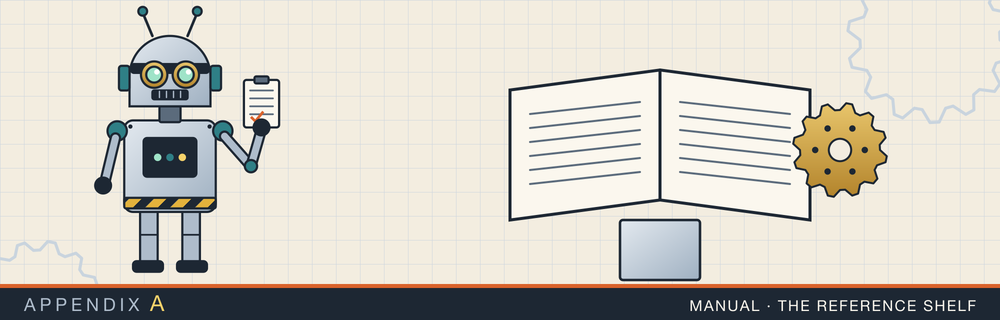

# Appendix A. The Rust cheat sheet

This appendix reproduces `rust-interview-lab/src/bin/RUST_CHEATSHEET.md`, the page of compile errors and
idioms that cost the most time while the Rust lab was being written. Its own instructions are the right way
to use it: read a block, close the file, and type it from memory.

Its sections map onto the chapters of this book:

- reference levels and iterator closures: chapters 1 and 3
- `Option` and `Result` combinators: chapter 1
- collections and heaps: chapter 3
- locks and guards: chapters 12 to 14
- strings and match ergonomics: chapters 1 to 3

---

{{#include ../../rust-interview-lab/src/bin/RUST_CHEATSHEET.md}}
