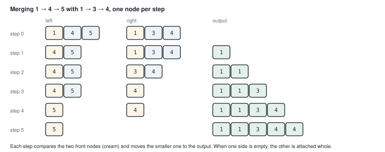
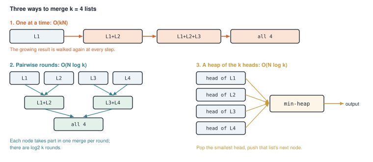
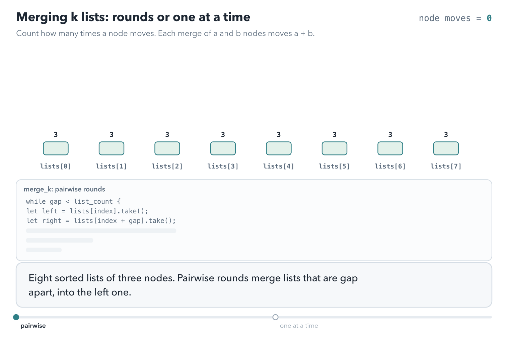
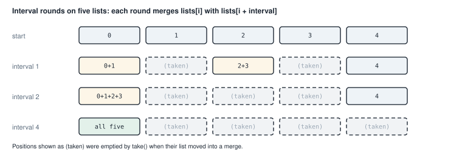
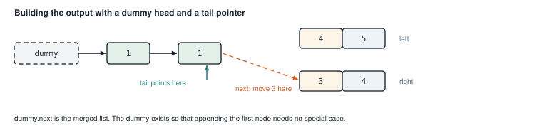
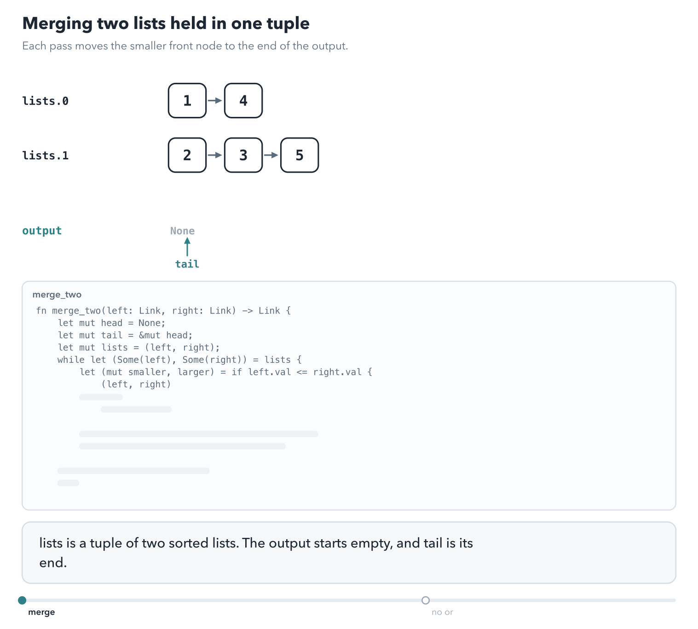

# Appendix C. Merging k sorted lists, the long version

> **Warning.** This is the first version of chapter 10, kept whole. It walks through eleven programs for one
> merge, and most of them are near copies of each other. It is very ugly. It stays in the book for brave readers
> who want every variant and every borrow trick. Chapter 10 teaches the same material with three programs.

<div class="covers" markdown="1">

This chapter covers

- Merging two sorted linked lists by moving nodes, not copying values
- Three strategies for merging many lists, and why two of them are much faster than the third
- Borrowing two elements of one `Vec` at the same time, and ways to avoid needing to
- The dummy head, the tail pointer, and `Option::insert`
- Eleven implementations of the same task, compared

</div>

Chapter 9 built singly linked lists and moved their nodes between owners with `take`. Here you have k linked
lists, each already sorted, and you want one sorted list that contains all their nodes.

Section C.2 compares three orders of merging. Sections C.3 to C.8 implement them in eleven programs, and
section C.9 lists the time and memory each program needs.

Two letters appear throughout. **k** is the number of lists. **N** is the total number of nodes across all of
them.

## C.1 Merging two sorted lists

Every program in this chapter merges two sorted lists at a time. Compare the front nodes of the
two lists. Move the smaller one to the end of the output. Repeat until one list is empty, then attach the
other list whole. Figure C.1 works through an example.

<figure>

<figcaption><b>Figure C.1</b> Merging two sorted lists. Each step moves one node, so merging lists of lengths a and b takes a + b steps.</figcaption>
</figure>

With linked lists, "move a node to the output" does not copy the value. It detaches the node from the front of
its list and links it to the end of the output. No memory is allocated.

Animation C.1 runs that merge with the code of listing C.5, one node at a time. The output starts at a
**dummy** node, a placeholder whose `next` will hold the real first node. `tail` always points at the last node
of the output.

<figure class="anim">
<video class="motion" src="figures/ch10-merge-two.mp4" autoplay loop muted playsinline preload="metadata" aria-label="Two linked lists, left 1, 4, 5 and right 1, 3, 4, and an output that starts at a dummy node with tail pointing at it. The two front nodes are compared; left's 1 wins the tie, is detached from left, and linked after tail, and tail moves onto it. Then right's 1, right's 3, left's 4, and right's 4 move the same way. right is empty, the loop stops, and one link attaches left's remaining 5. In a second run the attaching line is deleted, and node 5 is freed when left goes out of scope, so the output has only five nodes." data-chapters="[[0.0, &quot;merge&quot;], [36.84, &quot;no attach&quot;]]"></video>
<figcaption><b>Animation C.1</b> Each step moves one node to the tail. The last line attaches whatever is left; without it, the rest of the list is dropped.</figcaption>
</figure>

## C.2 Three strategies for k lists

Figure C.2 shows three ways to extend two-list merging to k lists.

<figure>

<figcaption><b>Figure C.2</b> The first strategy walks its growing result again and again. The other two touch each node only about log₂ k times.</figcaption>
</figure>

**One at a time.** Merge list 2 into list 1, then list 3 into the result, and so on. Each merge walks the
whole result so far, which keeps growing. The first nodes are walked k times, so the total is about O(kN).

**Pairwise rounds.** Merge the lists in pairs, like the rounds of a tournament. After the first round there are
k / 2 lists, after the second k / 4, and so on. In every round, each node takes part in exactly one merge. There
are about log₂ k rounds, so the total is O(N log k).

**A heap of heads.** Put the front node of each list into a min-heap, the structure from chapter 5. Pop the
smallest, append it to the output, and push the next node from the same list. Each node goes through one push and one pop on a heap of at most k entries. Each costs O(log k), so the
total is again O(N log k).

Animation C.2 counts node moves for eight lists of three nodes: pairwise rounds against one list at a time.

<figure class="anim">
<video class="motion" src="figures/ch10-merge-rounds.mp4" autoplay loop muted playsinline preload="metadata" aria-label="Eight bars, lists[0] to lists[7], each of three nodes, and a counter of node moves. Pairwise: with gap 1, four merges of 3 and 3 take 24 moves; with gap 2, two merges of 6 and 6 take 24 more; with gap 4, one merge of 12 and 12 takes 24, and lists[0] holds all 24 nodes after 72 moves. Then one at a time: each list is merged into the growing lists[0], and the moves add up 6, 9, 12, up to 24, for 105 in total." data-chapters="[[0.0, &quot;pairwise&quot;], [25.02, &quot;one at a time&quot;]]"></video>
<figcaption><b>Animation C.2</b> Pairwise rounds move each node once per round, log₂ 8 = 3 rounds: 72 moves. One at a time walks the growing result again and again: 105 moves for the same 24 nodes.</figcaption>
</figure>

For 100 lists of 10,000 nodes each, N is a million. O(kN) is about 100 million steps. O(N log k) is about 7
million.

The pairwise strategy has a compact in-place form that most of the eleven versions use. It keeps the lists in a
`Vec` and merges positions that are a growing **interval** apart (figure C.3).

<figure>

<figcaption><b>Figure C.3</b> Interval rounds on five lists. The interval doubles each round, and the result collects in <code>lists[0]</code>.</figcaption>
</figure>

In each round, the list at position `i` absorbs the list at `i + interval`. The position `i` runs through
0, 2 × interval, 4 × interval, and so on. The odd list out, number 4 here, waits until the interval is large enough to reach it.

## C.3 First version: `split_at_mut` and a dummy head

The first version implements pairwise rounds with a growing `interval`, as in figure C.3. Its merge builds the
output after a placeholder node, called a dummy head, so that the first real node needs no special case.

<p class="listing"><b>Listing C.1</b> The node type and the interval loop (lines 1 to 34). <a href="https://github.com/arpanpathak/cracking-the-systems-programming-interview/blob/prep-v2/rust-interview-lab/src/bin/merge_k_sorted_lists_divide.rs">src/bin/merge_k_sorted_lists_divide.rs</a></p>

```rust
{{#include ../../rust-interview-lab/src/bin/merge_k_sorted_lists_divide.rs:1:34}}
    // ...
}
```

`ListNode` is the node from chapter 9: a value, `data`, and `next`, an `Option<Box<ListNode>>` that is
`None` at the end of the list. `OptionalLink<T>` is a **type alias**, a second name for `Option<Box<T>>`,
so signatures stay short. `MergeKSorted` is an empty struct. It holds no data, and only groups the functions
under one name.

The two `while` loops follow figure C.3. The outer one doubles `interval`. The inner one steps `i` by
`interval * 2`, merging `i` with `i + interval`.

The merge needs to change two elements of the vector at once. The obvious code,
`merge_two(&mut lists[i], &mut lists[i + interval])`, does not compile. Both `&mut` borrows are borrows of the
whole vector `lists`, and Rust allows only one mutable borrow of a value at a time. The compiler does not
reason about the two indexes being different.

`split_at_mut(i + interval)` solves this. It splits the vector into two slices that do not overlap: the part before position `i + interval` and the
rest. It returns a mutable borrow of each. Now `left[i]`
and `right[0]` come from different slices, and borrowing both is allowed.

The merge of two lists uses a **dummy head** and a **tail pointer** (figure C.4).

<figure>

<figcaption><b>Figure C.4</b> The dummy node gives the output a fixed starting point. <code>tail</code> always points at the last node, where the next one is attached.</figcaption>
</figure>

<p class="listing"><b>Listing C.2</b> Merging two lists (lines 36 to 57).</p>

```rust
impl MergeKSorted {
    // ...
{{#include ../../rust-interview-lab/src/bin/merge_k_sorted_lists_divide.rs:36:57}}
}
```

`dummy` is a throwaway node, and `tail` is a mutable reference to the last node of the output. At the start,
the output is empty, so `tail` points at `dummy`. Each pass of the loop:

1. `while let (Some(l), Some(r)) = (left.as_ref(), right.as_ref())` continues while both lists have a front
   node, and looks at both without moving them.
2. `smaller` is a mutable reference to whichever list has the smaller front.
3. `smaller.take().unwrap()` takes that front node out, and `*smaller = head.next.take()` puts the rest of that
   list back.
4. `tail.next = Some(head)` attaches the node, and `tail = tail.next.as_mut().unwrap()` moves `tail` onto it.

When one list runs out, `left.take().or(right.take())` attaches whichever one is left. The merged list starts at
`dummy.next`.

The complete program is listing C.19 at the end of the chapter.

The tests check three lists, an empty input with empty lists inside it, and an odd number of lists.

```text
$ cargo run --bin merge_k_sorted_lists_divide
[1, 1, 2, 3, 4, 4, 5, 6]
```

## C.4 Avoiding the double borrow

`split_at_mut` works, but the next two versions show that the double borrow can be avoided altogether.

### C.4.1 Take the right list out first

This version moves the right-hand list out of the vector before the call. With only one list still inside the
vector, the merge needs only one mutable borrow of it.

It uses the same `MergeKSorted`, `ListNode`, and `OptionalLink` as listing C.1.

<p class="listing"><b>Listing C.3</b> The loop and the merge (lines 16 to 56). <a href="https://github.com/arpanpathak/cracking-the-systems-programming-interview/blob/prep-v2/rust-interview-lab/src/bin/merge_k_sorted_lists_swap.rs">src/bin/merge_k_sorted_lists_swap.rs</a></p>

```rust
{{#include ../../rust-interview-lab/src/bin/merge_k_sorted_lists_swap.rs:16:56}}
```

Look at the inner loop:

```rust
let mut right = lists[i + interval].take();
lists[i] = Self::merge_two(&mut lists[i], &mut right);
```

The right list is moved out of the vector into a local variable first. After that, the only borrow of the
vector is the one for `lists[i]`, so the call compiles.

The merge changes too. Instead of choosing which list to take from, it makes sure `left` always holds the
smaller front. When the right front is smaller, `std::mem::swap(left, right)` exchanges the two lists. Then the
loop body always takes from `left`.

The complete program is listing C.20 at the end of the chapter.

### C.4.2 Merge owned lists, with no dummy node

This version moves both lists out of the vector and passes them by value, so nothing is borrowed during the
merge. It also drops the dummy node and tracks the empty slot where the next node belongs.

<p class="listing"><b>Listing C.4</b> The node type, the loop, and the merge (lines 1 to 43). <a href="https://github.com/arpanpathak/cracking-the-systems-programming-interview/blob/prep-v2/rust-interview-lab/src/bin/merge_k_sorted_lists_simple.rs">src/bin/merge_k_sorted_lists_simple.rs</a></p>

```rust
{{#include ../../rust-interview-lab/src/bin/merge_k_sorted_lists_simple.rs:1:43}}
```

This file names its link type `Link`, an alias for `Option<Box<ListNode>>`, and uses free functions
instead of methods on an empty struct. The algorithm changes in two ways.

First, `merge_two` takes both lists by value, not by reference. The loop moves both out of the vector with
`take()` before the call, so nothing is borrowed at all.

Second, there is no dummy node. `tail` is a `&mut Link`, a pointer to the empty slot where the next node
belongs. It starts at `&mut merged`, the slot for the first node. The loop body is three lines, each with a
comment:

```rust
*tail = left;                              // hang left list on the tail
tail = &mut tail.as_mut().unwrap().next;   // step past its first node
left = tail.take();                        // cut the rest off again
```

After the swap has put the smaller front in `left`, the whole left list is placed in the empty slot. `tail` then
moves to the `next` slot of the list's first node. Finally `tail.take()` cuts everything after that first node
back off into `left`. One node has moved to the output.

The complete program is listing C.21 at the end of the chapter.

`to_vec` takes `&Link` and follows the nodes with `list = &node.next`, so the tests can read a list without
consuming it.

### C.4.3 The shortest form, with `Option::insert`

This version keeps the owned merge and brings back the dummy head. One standard-library method attaches a node and
moves the tail onto it in a single step.

<p class="listing"><b>Listing C.5</b> The node type, the merge, and the loop (lines 1 to 45). <a href="https://github.com/arpanpathak/cracking-the-systems-programming-interview/blob/prep-v2/rust-interview-lab/src/bin/merge_k_sorted_list_zero_copy.rs">src/bin/merge_k_sorted_list_zero_copy.rs</a></p>

```rust
{{#include ../../rust-interview-lab/src/bin/merge_k_sorted_list_zero_copy.rs:1:45}}
```

Here the node is `Node`, with an `i32` value named `val`, and the link alias is `NodeLink`. This version keeps
the owned `merge_two` from listing C.4 and brings back the dummy head. It shortens the tail
bookkeeping with one method:

```rust
tail = tail.next.insert(node);
```

`Option::insert` stores a value in the option and returns a mutable reference to the stored value. So one call
attaches the node and moves `tail` onto it. Listing C.2 needed two lines and an `unwrap` for the same step.

Every node in the output is a box that was in the input, moved by pointer. The only allocation is the dummy
node, once per `merge_two` call. The single `unwrap` has a comment saying why it cannot fail. The `while let` has already checked that both
lists have a front node.

The complete program is listing C.22 at the end of the chapter.

`main` tries four cases: four lists including an empty one, duplicates across lists, no lists at all, and five
lists.

```text
$ cargo run --bin merge_k_sorted_list_zero_copy
0 1 2 3 4 5 6 7 8 9
1 1 1 3 5

1 2 3 4 5 8 9
```

The empty line is the output for no lists.

### C.4.4 Swap the lists by value

Listing C.5 picks the smaller list with `&mut left` or `&mut right`, and keeps a third mutable reference, `tail`.
This version swaps the two lists by value instead, so that `left` always holds the smaller front node. The only
mutable reference left is `tail`, which makes the loop easier to read: there is one borrow to follow instead of
three.

<p class="listing"><b>Listing C.8</b> The node type and <code>merge_two</code> (lines 4 to 27). <a href="https://github.com/arpanpathak/cracking-the-systems-programming-interview/blob/prep-v2/rust-interview-lab/src/bin/merge_k_sorted_lists_owned.rs">src/bin/merge_k_sorted_lists_owned.rs</a></p>

```rust
{{#include ../../rust-interview-lab/src/bin/merge_k_sorted_lists_owned.rs:4:27}}
```

`while let (Some(l), Some(r)) = (&left, &right)` runs while both lists have a node. `&left` and `&right` are
shared references, used only to read the two front values.

If the right front is smaller, `(left, right) = (right, left)` swaps the two lists. The assignment moves the two
`Option` values; no node moves, and no reference is taken. After it, the smaller front node is always in `left`.

`left.unwrap()` moves that list out of `left`. It cannot fail, because the `while let` checked that
`left` is `Some`. `node.next.take()` cuts the front node off, and the rest of the list goes back into `left`.

`tail.next.insert(node)` attaches the node at the end of the output, as in listing C.5, and returns a reference to
it. That node is the new `tail`.

When the loop ends, one list is empty. `left.or(right)` returns the other one, and `tail.next` takes it whole.

Animation C.3 runs `merge_two` one line at a time on the lists of the trace below. The table beside the lists
shows what each variable owns or borrows after every line. The last part reads `l` after the swap, which does not
compile.

<figure class="anim">
<video class="motion" src="figures/ch10-merge-trace.mp4" autoplay loop muted playsinline preload="metadata" aria-label="Rows for left, right, node, and the output, which starts at a dummy node; a table of the variables left, right, l, r, node, dummy, and tail with what each owns or borrows; and the code of merge_two with the running line highlighted. Each pass shows while let binding l and r as shared borrows of the two front nodes, the comparison where those borrows end, the swap when the right front is smaller, left.unwrap moving the whole list into node so that left is moved out, node.next.take returning the rest to left, and insert moving the node to the end of the output while tail moves on. After four passes, left.or(right) attaches 5 and dummy.next returns 1, 2, 3, 4, 5. Last, a loop that reads l after the swap fails with error E0506, cannot assign to left because it is borrowed, and E0505, cannot move out of left because it is borrowed." data-chapters="[[0.0, &quot;set up&quot;], [17.59, &quot;pass 1&quot;], [57.67, &quot;pass 2&quot;], [100.87, &quot;pass 3&quot;], [133.99, &quot;pass 4&quot;], [175.03, &quot;the end&quot;], [204.55, &quot;l after the swap&quot;]]"></video>
<figcaption><b>Animation C.3</b> <code>merge_two</code> line by line. <code>l</code> and <code>r</code> borrow the front nodes until the comparison. <code>unwrap</code> moves the list into <code>node</code>, and <code>take</code> returns the rest to <code>left</code>. <code>tail</code> is the only mutable reference. Reading <code>l</code> after the swap does not compile.</figcaption>
</figure>

Trace the merge of 1 → 4 with 2 → 3 → 5:

| Pass | `left` | `right` | Swap? | Node moved | Output after `dummy` |
|---|---|---|---|---|---|
| 1 | 1 → 4 | 2 → 3 → 5 | no | 1 | 1 |
| 2 | 4 | 2 → 3 → 5 | yes: 2 < 4 | 2 | 1 → 2 |
| 3 | 3 → 5 | 4 | no | 3 | 1 → 2 → 3 |
| 4 | 5 | 4 | yes: 4 < 5 | 4 | 1 → 2 → 3 → 4 |
| 5 | None | 5 | the loop ends; `or` attaches 5 | | 1 → 2 → 3 → 4 → 5 |

Each pass moves one node, so merging n nodes takes O(n) time. The merge uses O(1) extra memory, and allocates
only the dummy node.

<p class="listing"><b>Listing C.8</b> <code>merge_k</code> (lines 29 to 47). <a href="https://github.com/arpanpathak/cracking-the-systems-programming-interview/blob/prep-v2/rust-interview-lab/src/bin/merge_k_sorted_lists_owned.rs">src/bin/merge_k_sorted_lists_owned.rs</a></p>

```rust
{{#include ../../rust-interview-lab/src/bin/merge_k_sorted_lists_owned.rs:29:47}}
```

`merge_k` is the loop of listing C.1. `lists[i].take()` moves each list out of its slot and leaves `None`, so
`merge_two` receives two owned lists.

Animation C.4 runs the merge of the trace. The last part leaves out the line after the loop.

<figure class="anim">
<video class="motion" src="figures/ch10-merge-owned.mp4" autoplay loop muted playsinline preload="metadata" aria-label="Rows for left and right, and an output row that starts at a dummy node, with a tail marker at its end. Each pass compares the two front nodes; when right's front is smaller, the two rows trade places. Then the front node of left moves to the end of the output, and the rest of its list stays in left. After pass 4, left is empty and the loop ends; left.or(right) attaches the remaining 5, and the output reads 1, 2, 3, 4, 5. Last, with that line struck out, the output stops at 4 and node 5 is dropped." data-chapters="[[0.0, &quot;merge&quot;], [30.16, &quot;no or&quot;]]"></video>
<figcaption><b>Animation C.4</b> When the right front is smaller, the two lists swap, so <code>left</code> always holds the next node. When one list runs out, <code>or</code> attaches the other. Without that line, the nodes left in <code>right</code> are dropped.</figcaption>
</figure>

```text
$ cargo run --bin merge_k_sorted_lists_owned
[0, 1, 2, 3, 4, 5, 6, 7, 8, 9]
[1, 1, 1, 3, 5]
[]
```

The complete program is listing C.23 at the end of the chapter.

## C.5 The same merge on an enum node

Chapter 9 also wrote a list as an enum. Two versions try the merge on that shape.

### C.5.1 An enum with its own `take`

The node can also be an enum, as in chapter 9. A list is either `Empty`, or a `Node` with a value and the rest of
the list. This version gives that enum a `take` method so the merge reads like the `Option` versions.

<p class="listing"><b>Listing C.9</b> The node type (lines 1 to 14). <a href="https://github.com/arpanpathak/cracking-the-systems-programming-interview/blob/prep-v2/rust-interview-lab/src/bin/merge_k_sorted_lists_enum.rs">src/bin/merge_k_sorted_lists_enum.rs</a></p>

```rust
{{#include ../../rust-interview-lab/src/bin/merge_k_sorted_lists_enum.rs:1:14}}
```

`use ListNode::{Empty, Node};` lets the code write `Empty` instead of `ListNode::Empty`. The enum gets its own
`take`, built on `mem::replace`, so it can be used like `Option::take`.

<p class="listing"><b>Listing C.10</b> The merge (lines 38 to 76).</p>

```rust
impl MergeKSorted {
    // ...
{{#include ../../rust-interview-lab/src/bin/merge_k_sorted_lists_enum.rs:38:76}}
}
```

The loop picks `smaller` with a `match` on both fronts. The two `Empty` arms attach the other list and leave
the loop with `break`. The third arm returns a mutable reference to the list with the smaller front.

This representation has a cost. Look at how a node is attached:

```rust
*tail = Node { data, next: LinkTo::new(Empty) };
```

With `Option<Box<Node>>`, a node's box moves from the input to the output. Here, `*smaller = *next` moves the
rest of the input out of its box, and that box is freed. The output node is a new `Node` with a new `Box`
holding a new `Empty`. So this version allocates once for every node it outputs.

The complete program is listing C.24 at the end of the chapter.

### C.5.2 An enum with standard traits and a recursive merge

This version uses the same enum shape but derives `Default`, so the standard `std::mem::take` works on it. Its
two-list merge is recursive.

<p class="listing"><b>Listing C.11</b> The type and its conversions (lines 1 to 24). <a href="https://github.com/arpanpathak/cracking-the-systems-programming-interview/blob/prep-v2/rust-interview-lab/src/bin/merge_k_sorted_lists_enum_recursive.rs">src/bin/merge_k_sorted_lists_enum_recursive.rs</a></p>

```rust
{{#include ../../rust-interview-lab/src/bin/merge_k_sorted_lists_enum_recursive.rs:1:24}}
```

This version uses standard traits in place of hand-written helpers:

- `#[derive(Default)]` with `#[default]` on `Empty` makes the empty list the default value. So
  `NodeLink::default()` is a box holding `Empty`, and `std::mem::take` can be used instead of a custom `take`.
- `impl From<Vec<i32>> for NodeLink` builds a list from a vector. It walks the vector backward with `rev()` and
  uses `fold` to wrap each value around the list built so far. `main` calls it as `vec![1, 4, 5].into()`.

<p class="listing"><b>Listing C.12</b> The interval loop and a recursive merge (lines 26 to 59).</p>

```rust
{{#include ../../rust-interview-lab/src/bin/merge_k_sorted_lists_enum_recursive.rs:26:59}}
```

`std::mem::take(&mut lists[i + interval])` moves the right list out and leaves the default, an empty list, in
its place. It takes the right list before the left, which avoids the double borrow as listing C.3 did.
`lists.swap_remove(0)` removes position 0 by moving the last element into it, which takes O(1).

`merge` is recursive, and takes both lists as `ListNode` values. The caller moves them out of their boxes with `*left` and `*right`. `merge` keeps the smaller front node, merges the rest into `rest`, and boxes only the result. The list it did not take from passes to the recursive call unboxed. The code reads almost like a definition of merging. It has two costs. It allocates a new `Box` for every output node. And it recurses once per output node, so
a long result uses a deep stack, as chapter 9's recursive drop did.

The complete program is listing C.25 at the end of the chapter.

The program prints the result with `{:#?}`, which shows the nesting of the enum directly:

```text
$ cargo run --bin merge_k_sorted_lists_enum_recursive
Node(
    1,
    Node(
        1,
        Node(
            2,
            ...
```

## C.6 A queue of lists

This version does pairwise rounds with a queue instead of intervals. A `VecDeque` is a double-ended queue:
you can push and pop at both ends in O(1). `merge_k_lists` puts all the lists in the queue. Then it pops two from the front and pushes their merge on
the back, until one list is left.

This file declares its own copy of the node type, with `Link` as the alias for a whole list:

```rust
{{#include ../../rust-interview-lab/src/bin/merge_k_sorted_lists_pairs.rs:1:8}}
```

<p class="listing"><b>Listing C.13</b> <code>merge_k_lists</code> (lines 10 to 18). <a href="https://github.com/arpanpathak/cracking-the-systems-programming-interview/blob/prep-v2/rust-interview-lab/src/bin/merge_k_sorted_lists_pairs.rs">src/bin/merge_k_sorted_lists_pairs.rs</a></p>

```rust
{{#include ../../rust-interview-lab/src/bin/merge_k_sorted_lists_pairs.rs:10:18}}
```


Because merged lists go to the back, every original list is merged once before any merged list is merged again.
So the rounds are the same as in figure C.2, and the cost is O(N log k).

`queue.pop_front().flatten()` needs a word of explanation. `pop_front` returns `Option<Link>`, and a `Link` is
itself an `Option<Box<ListNode>>`. So the value is an `Option<Option<...>>`. `flatten` turns it into one
`Option`: `None` if the queue was empty, or the merged list.

```text
$ cargo run --bin merge_k_sorted_lists_pairs
1 1 2 3 4 4 5 6
```

## C.7 A heap of list heads

This is the third strategy from figure C.2. The heap does not hold nodes. It holds pairs of `(front value, list
number)`, wrapped in `Reverse` to make it a min-heap, as in chapter 5. Storing the list number instead of the
node keeps the nodes in their lists, and avoids needing an ordering on nodes.

<p class="listing"><b>Listing C.14</b> <code>merge_k_lists</code> (lines 10 to 33). <a href="https://github.com/arpanpathak/cracking-the-systems-programming-interview/blob/prep-v2/rust-interview-lab/src/bin/merge_k_sorted_lists_heap.rs">src/bin/merge_k_sorted_lists_heap.rs</a></p>

```rust
{{#include ../../rust-interview-lab/src/bin/merge_k_sorted_lists_heap.rs:10:33}}
```


Each pass of the loop:

1. Pops the smallest pair. Its second field, `i`, says which list holds that value.
2. Takes the front node out of `lists[i]` and puts the rest of that list back.
3. If the list still has a node, pushes that node's value with `i`.
4. Attaches the taken node to the output with `tail.next.insert(node)`.

When two fronts have equal values, the pairs compare by list number, so the lower-numbered list goes first.

The heap needs only the current front of each list. That makes this strategy the right one when the lists are too large to hold in memory. An example is k
sorted files read line by line.

## C.8 Recursion on halves

The last two versions do pairwise merging from the top down. They split the lists into two halves, merge each
half recursively, and merge the two results.

<p class="listing"><b>Listing C.15</b> The node type and a recursive two-list merge (lines 1 to 21). <a href="https://github.com/arpanpathak/cracking-the-systems-programming-interview/blob/prep-v2/rust-interview-lab/src/bin/merge_k_sorted_lists_recursion.rs">src/bin/merge_k_sorted_lists_recursion.rs</a></p>

```rust
{{#include ../../rust-interview-lab/src/bin/merge_k_sorted_lists_recursion.rs:1:21}}
```

`List` is an alias for `Option<Box<ListNode>>`, so a whole list is one value that is `None` when empty.
The first arm, `(None, rest) | (rest, None) => rest`, handles an empty list on either side: the other list is
the answer. In the second arm, `mem::swap` makes `a` the list with the smaller front. Then `a`'s node stays at
the front, and its `next` becomes the merge of the rest of `a` with `b`. No node is allocated; the boxes move.

<p class="listing"><b>Listing C.16</b> Two ways to split the lists (lines 24 to 47).</p>

```rust
{{#include ../../rust-interview-lab/src/bin/merge_k_sorted_lists_recursion.rs:24:46}}
```

`merge_k` splits the vector with `split_off(n / 2)`, which moves the second half into a new `Vec`. That
allocates a new vector at every level of the recursion.

`merge_k_slice` works on a slice, `&mut [List]`, and splits it with `split_at_mut`, the method from section
C.3. Splitting a slice only creates two views of the same memory, so this version allocates nothing to split.

<p class="listing"><b>Listing C.17</b> Building a list front to back (lines 49 to 68).</p>

```rust
{{#include ../../rust-interview-lab/src/bin/merge_k_sorted_lists_recursion.rs:48:59}}
```

`from_vec` builds the list front to back, with a slot pointer like listing C.4. `tail = &mut
tail.insert(node).next` fills the empty slot and moves `tail` to the new node's `next` slot.

The complete program is listing C.28 at the end of the chapter.

`main` merges the sample lists with `merge_k`, tries three edge cases, then merges the same lists again
with `merge_k_slice`. Both versions give the same result.

```text
$ cargo run --bin merge_k_sorted_lists_recursion
[1, 1, 2, 3, 4, 4, 5, 6]
[]
[]
[7]
[1, 1, 2, 3, 4, 4, 5, 6]
```

The last version keeps only the slice-based recursion:

Its node holds an `i32` named `val`, and `List` is the alias for a whole list:

```rust
{{#include ../../rust-interview-lab/src/bin/merge_k_sorted_lists_halves.rs:1:9}}
```

<p class="listing"><b>Listing C.18</b> The merge and the recursion on a slice (lines 11 to 34). <a href="https://github.com/arpanpathak/cracking-the-systems-programming-interview/blob/prep-v2/rust-interview-lab/src/bin/merge_k_sorted_lists_halves.rs">src/bin/merge_k_sorted_lists_halves.rs</a></p>

```rust
{{#include ../../rust-interview-lab/src/bin/merge_k_sorted_lists_halves.rs:11:34}}
```

`create_list` builds front to back with the slot pointer, advancing it with `if let Some(node) = tail`.
`print_list` collects the values as strings and joins them with `" -> "`.

```text
$ cargo run --bin merge_k_sorted_lists_halves
Input lists:
[1 -> 4 -> 5]
[1 -> 3 -> 4]
[2 -> 6]

Merged list:
[1 -> 1 -> 2 -> 3 -> 4 -> 4 -> 5 -> 6]
```

Both recursive merges recurse once for each node of their output. For short lists that is fine. For lists with
hundreds of thousands of nodes, the iterative merges of sections C.3 and C.4 are safer.

## C.9 The eleven versions side by side

In the table, N is the total number of nodes and k the number of lists. The extra memory column counts memory
beyond the input `Vec` and the nodes. The stack column is the deepest the call stack goes, in frames.

| Program | Strategy | Time | Extra memory | Stack | Allocations | How a merge moves nodes |
|---|---|---|---|---|---|---|
| `merge_k_sorted_lists_divide` | interval rounds | O(N log k) | O(1) | O(1) | one dummy node per merge | `split_at_mut`, `&mut` tail |
| `merge_k_sorted_lists_swap` | interval rounds | O(N log k) | O(1) | O(1) | one dummy node per merge | right list taken first, `&mut` tail |
| `merge_k_sorted_lists_simple` | interval rounds | O(N log k) | O(1) | O(1) | none | owned lists, `&mut` tail slot |
| `merge_k_sorted_list_zero_copy` | interval rounds | O(N log k) | O(1) | O(1) | one dummy node per merge | owned lists, `Option::insert` |
| `merge_k_sorted_lists_owned` | interval rounds | O(N log k) | O(1) | O(1) | one dummy node per merge | lists swapped by value, so `tail` is the only `&mut` (section C.4.4) |
| `merge_k_sorted_lists_enum` | interval rounds | O(N log k) | O(1) | O(1) | one box per node per round | custom `take`, `&mut` tail |
| `merge_k_sorted_lists_enum_recursive` | interval rounds | O(N log k) | O(1) | O(N) | one box per node per round | recursive merge on owned values |
| `merge_k_sorted_lists_pairs` | queue of lists | O(N log k) | O(1) | O(1) | one dummy node per merge | owned lists, `Option::insert` |
| `merge_k_sorted_lists_heap` | heap of heads | O(N log k) | O(k) | O(1) | none | list numbers in the heap |
| `merge_k_sorted_lists_recursion` | recursive halves | O(N log k) | O(k) | O(N) | a `Vec` per split | `split_off`, recursive merge |
| `merge_k_sorted_lists_halves` | recursive halves | O(N log k) | O(1) | O(N) | none | `split_at_mut`, recursive merge |

- **Time.** Every version merges in rounds or halves, so each node moves about log2 k times: O(N log k). The
  "one at a time" strategy of figure C.2 would be O(kN). No version here uses it.
- **Extra memory.** The heap holds one entry per list: O(k). `split_off` makes a new `Vec` for each right half,
  so the recursion holds O(k) of them. The queue reuses the input `Vec`'s buffer: `VecDeque::from` a `Vec` does not
  reallocate.
- **Stack.** A recursive merge makes one call per node of its output. The last merge outputs all N nodes, so the
  stack reaches O(N) frames. In section 9.6, a recursive drop overflowed the 8 MiB main-thread stack between
  260,000 and 270,000 nodes.
- **Allocations.** A dummy node costs one allocation per merge, k - 1 in total. The enum versions free a box and
  allocate a new one for every node they move, about N log k in all. The tail-slot version allocates
  nothing.

## C.10 The complete files

Each file below is shown whole, in the order the chapter used it.

<p class="listing"><b>Listing C.19</b> First version: <code>split_at_mut</code> and a dummy head. <a href="https://github.com/arpanpathak/cracking-the-systems-programming-interview/blob/prep-v2/rust-interview-lab/src/bin/merge_k_sorted_lists_divide.rs">src/bin/merge_k_sorted_lists_divide.rs</a></p>

```rust
{{#include ../../rust-interview-lab/src/bin/merge_k_sorted_lists_divide.rs}}
```

<p class="listing"><b>Listing C.20</b> Take the right list out first. <a href="https://github.com/arpanpathak/cracking-the-systems-programming-interview/blob/prep-v2/rust-interview-lab/src/bin/merge_k_sorted_lists_swap.rs">src/bin/merge_k_sorted_lists_swap.rs</a></p>

```rust
{{#include ../../rust-interview-lab/src/bin/merge_k_sorted_lists_swap.rs}}
```

<p class="listing"><b>Listing C.21</b> Owned lists, no dummy node. <a href="https://github.com/arpanpathak/cracking-the-systems-programming-interview/blob/prep-v2/rust-interview-lab/src/bin/merge_k_sorted_lists_simple.rs">src/bin/merge_k_sorted_lists_simple.rs</a></p>

```rust
{{#include ../../rust-interview-lab/src/bin/merge_k_sorted_lists_simple.rs}}
```

<p class="listing"><b>Listing C.22</b> The shortest form, with <code>Option::insert</code>. <a href="https://github.com/arpanpathak/cracking-the-systems-programming-interview/blob/prep-v2/rust-interview-lab/src/bin/merge_k_sorted_list_zero_copy.rs">src/bin/merge_k_sorted_list_zero_copy.rs</a></p>

```rust
{{#include ../../rust-interview-lab/src/bin/merge_k_sorted_list_zero_copy.rs}}
```

<p class="listing"><b>Listing C.23</b> The lists swapped by value. <a href="https://github.com/arpanpathak/cracking-the-systems-programming-interview/blob/prep-v2/rust-interview-lab/src/bin/merge_k_sorted_lists_owned.rs">src/bin/merge_k_sorted_lists_owned.rs</a></p>

```rust
{{#include ../../rust-interview-lab/src/bin/merge_k_sorted_lists_owned.rs}}
```

<p class="listing"><b>Listing C.24</b> An enum node with its own <code>take</code>. <a href="https://github.com/arpanpathak/cracking-the-systems-programming-interview/blob/prep-v2/rust-interview-lab/src/bin/merge_k_sorted_lists_enum.rs">src/bin/merge_k_sorted_lists_enum.rs</a></p>

```rust
{{#include ../../rust-interview-lab/src/bin/merge_k_sorted_lists_enum.rs}}
```

<p class="listing"><b>Listing C.25</b> An enum with standard traits and a recursive merge. <a href="https://github.com/arpanpathak/cracking-the-systems-programming-interview/blob/prep-v2/rust-interview-lab/src/bin/merge_k_sorted_lists_enum_recursive.rs">src/bin/merge_k_sorted_lists_enum_recursive.rs</a></p>

```rust
{{#include ../../rust-interview-lab/src/bin/merge_k_sorted_lists_enum_recursive.rs}}
```

<p class="listing"><b>Listing C.26</b> A queue of lists. <a href="https://github.com/arpanpathak/cracking-the-systems-programming-interview/blob/prep-v2/rust-interview-lab/src/bin/merge_k_sorted_lists_pairs.rs">src/bin/merge_k_sorted_lists_pairs.rs</a></p>

```rust
{{#include ../../rust-interview-lab/src/bin/merge_k_sorted_lists_pairs.rs}}
```

<p class="listing"><b>Listing C.27</b> A heap of list heads. <a href="https://github.com/arpanpathak/cracking-the-systems-programming-interview/blob/prep-v2/rust-interview-lab/src/bin/merge_k_sorted_lists_heap.rs">src/bin/merge_k_sorted_lists_heap.rs</a></p>

```rust
{{#include ../../rust-interview-lab/src/bin/merge_k_sorted_lists_heap.rs}}
```

<p class="listing"><b>Listing C.28</b> Recursion on halves, two ways to split. <a href="https://github.com/arpanpathak/cracking-the-systems-programming-interview/blob/prep-v2/rust-interview-lab/src/bin/merge_k_sorted_lists_recursion.rs">src/bin/merge_k_sorted_lists_recursion.rs</a></p>

```rust
{{#include ../../rust-interview-lab/src/bin/merge_k_sorted_lists_recursion.rs}}
```

<p class="listing"><b>Listing C.29</b> Recursion on a slice. <a href="https://github.com/arpanpathak/cracking-the-systems-programming-interview/blob/prep-v2/rust-interview-lab/src/bin/merge_k_sorted_lists_halves.rs">src/bin/merge_k_sorted_lists_halves.rs</a></p>

```rust
{{#include ../../rust-interview-lab/src/bin/merge_k_sorted_lists_halves.rs}}
```

<div class="summary" markdown="1">

## Summary

- Merging two sorted lists moves the smaller front node to the output until one list is empty, in O(a + b).
- Merging k lists one at a time costs O(kN). Pairwise rounds and a heap of heads both cost O(N log k).
- Two `&mut` borrows of elements of one `Vec` do not compile. `split_at_mut` splits it into two slices, or you
  can move one list out with `take()` first.
- A dummy head and a tail pointer attach nodes to the end of a list. `Option::insert` attaches and advances in
  one call.
- With `Option<Box<Node>>`, merging moves boxes and allocates nothing. The enum versions allocate a new box for
  every node.
- A heap of `(value, list number)` pairs needs only the front of each list, which suits lists read from disk.
- Recursive merges are short but recurse once per output node.

</div>

## Exercises

1. Write the "one at a time" merge and time it against listing C.22 on 200 lists of 5,000 nodes each.
2. Make `merge_two` from listing C.5 generic over any `T: Ord`.
3. Write a k-way merge of sorted text files with the heap strategy, keeping only one line per file in memory.
4. Count allocations in listings C.9 and C.12 with a custom global allocator that increments a counter, and
   confirm the difference described in section C.5.1.
