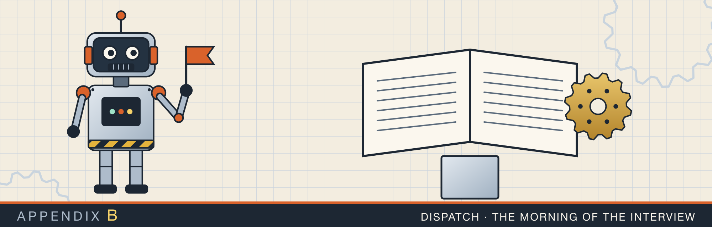

# Appendix B. The benchmark report

Chapters 4 and 9 quote measurements from the Rust lab's benchmark program. This appendix reproduces the full
report written from those runs: `rust-interview-lab/benchmarking_examples/benchmarking-report.md`. It
presents them as a short paper, with method, results, discussion, and threats to validity. The recorded
program output it relies on is in `rust-interview-lab/BENCHMARKS.md`.

> **A correction to sections 2.2 and 5.2 of the report.** They attribute the enum list's slower push to
> a discriminant stored alongside the boxed continuation. On a 64-bit target,
> `std::mem::size_of::<ListNode<u64>>()` is 16, the same as `Node<u64>`: the `Box` field's non-null niche
> encodes `Empty`, so there is no separate discriminant. Chapter 4, section 4.3, gives the two structural
> differences that remain (the inline head moved on every push, and the extra allocation for the final
> `Empty`). The measured timings are unaffected.

The report is built as its own PDF by this script and stylesheet:

<p class="listing"><b>Listing B.1</b> The report's build script. <a href="https://github.com/arpanpathak/cracking-the-systems-programming-interview/blob/prep-v2/rust-interview-lab/benchmarking_examples/build_report_pdf.py">benchmarking_examples/build_report_pdf.py</a></p>

```python
{{#include ../../rust-interview-lab/benchmarking_examples/build_report_pdf.py}}
```

<p class="listing"><b>Listing B.2</b> The report's stylesheet. <a href="https://github.com/arpanpathak/cracking-the-systems-programming-interview/blob/prep-v2/rust-interview-lab/benchmarking_examples/report.css">benchmarking_examples/report.css</a></p>

```css
{{#include ../../rust-interview-lab/benchmarking_examples/report.css}}
```

---

{{#include ../../rust-interview-lab/benchmarking_examples/benchmarking-report.md}}
