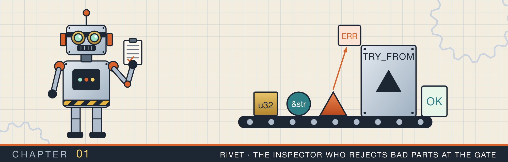
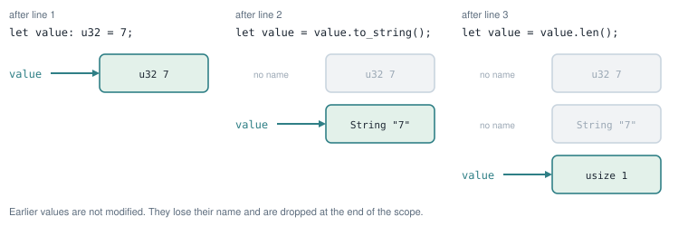
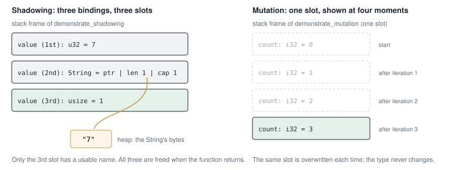
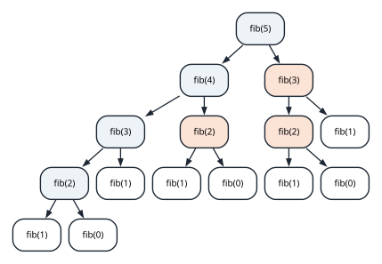
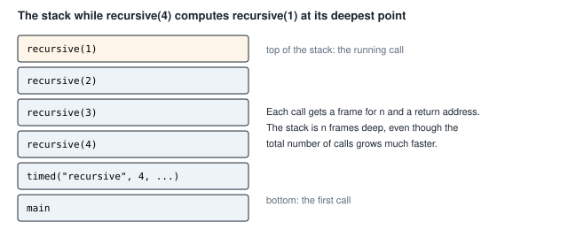
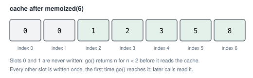

# Bindings, functions, and loops

<div class="covers" markdown="1">

This chapter covers

- What a `let` binding is and where its value lives
- Shadowing a name, and how it differs from changing a value with `mut`
- Writing a function that calls itself, and what happens on the stack when it does
- Replacing that recursion with a loop, and with a table of saved answers
- Timing code with `Instant`, and passing a function to another function

</div>

This chapter begins Part 1 of the book. Part 1 covers the pieces of Rust that every later chapter uses.
This first chapter works with the smallest pieces: names for values, functions, and loops.

You will read and run two short programs. The first gives one name to three different values in turn. It
shows what a `let` statement does, and how that differs from changing a value in place. The second
program computes Fibonacci numbers in three ways and times each one. It shows how a function that calls
itself uses memory, and it compares the running times of the three versions.

A few terms first:

- A **binding** is a name attached to a value. `let x = 5;` binds the name `x` to the value `5`.
- A **scope** is the region of code where a binding can be used. In Rust, a scope is usually a block
  between `{` and `}`.
- The **stack** is the memory where a function keeps its local values while it runs.
- A **stack frame** is the part of the stack that belongs to one running call of a function.

## 1.1 A binding is a name for a value

When a function starts, Rust reserves a stack frame for it. Each `let` in the function gets a place in
that frame, sized for its type. A `u32` takes 4 bytes, and a `usize` takes 8 bytes on a 64-bit machine.

A `String` is different. Its text can grow, so the text is kept in heap memory. The **heap** is memory the
program requests while it runs and gives back when it is done. The `String` value on the stack holds three
numbers. They are the address of the text on the heap, the length of the text, and the size of the heap block.

When a function returns, its frame is removed. Every value in the frame is dropped. For a `String`,
dropping it also frees its heap block.

## 1.2 Shadowing: one name, several values

You can write a second `let` with a name that is already in use. This does not change the first value.
It creates a second binding with the same name, and the name now refers to the new value. Rust calls this
**shadowing**. The first value still exists until the end of its scope, but you can no longer reach it by
that name.

Because the second binding is a new variable, it can have a different type. Figure 1.1 follows the name
`value` through three bindings of three types.

<figure>

<figcaption><b>Figure 1.1</b> Each <code>let</code> creates a new value and moves the name to it. The earlier values are not changed; they lose their name.</figcaption>
</figure>

Here is the function that performs those three steps:

<p class="listing"><b>Listing 1.1</b> One name, three types. <a href="https://github.com/arpanpathak/cracking-the-systems-programming-interview/blob/prep-v2/rust-interview-lab/src/bin/shadowing.rs">src/bin/shadowing.rs</a>, lines 27 to 41</p>

```rust
{{#include ../../rust-interview-lab/src/bin/shadowing.rs:27:41}}
```

Read the three `let value` lines in order:

1. `let value: u32 = 7;` creates a `u32`.
2. `let value = value.to_string();` reads the `u32`, builds a `String` from it, and binds the name to the
   `String`. On the right-hand side, `value` still means the `u32`, because the new binding does not exist
   until the statement finishes.
3. `let value = value.len();` reads the `String` and binds the name to its length, a `usize`.

None of these lines needs `mut`, because no value is changed after it is created. The `log` string does
change, so it is declared `let mut log`. Each `push_str` appends one line to it, so the test can check all
three stages.

Figure 1.2 (left) shows the stack frame after the third line. There are three values, and only the last
one has a usable name.

<figure>

<figcaption><b>Figure 1.2</b> Shadowing creates a new slot for each binding. Mutation writes new values into the same slot. (The compiler may reuse slots it can prove are no longer used; the picture shows what the program means.)</figcaption>
</figure>

### 1.2.1 When shadowing helps

Programs often receive a value in one form and need it in another. A number typed by a user arrives as
text. After you parse it, you want the number and never the text again. Shadowing lets the number take the
text's name:

```rust
let count = read_line_from_user();   // a String, for example "42"
let count: u32 = count.trim().parse().expect("a number");
```

After the second line, `count` is a `u32`. Code below it cannot use the unparsed text by mistake, because
no name refers to it any more.

### 1.2.2 A value captured earlier keeps its old value

A closure or a reference created before a shadowing `let` still refers to the first value:

```rust
let x = 1;
let show = || println!("{x}");
let x = x + 1;   // a new x
show();          // prints 1
```

The closure captured the first `x`. The second `let` created a new variable, and the closure never sees it.

<div class="callout warning" markdown="1">

**WARNING:** Inside a loop, `let x = x + 1;` creates a new `x` that lives only until the end of that pass
through the loop. On the next pass, the outer `x` has its old value again. To count across passes, declare
`let mut x` before the loop and write `x += 1` inside it.

</div>

## 1.3 Mutation: one value that changes

When you want one variable whose value changes over time, declare it with `mut`. The type stays the same,
and each assignment writes into the same place in the frame.

<p class="listing"><b>Listing 1.2</b> A counter that changes in place. <a href="https://github.com/arpanpathak/cracking-the-systems-programming-interview/blob/prep-v2/rust-interview-lab/src/bin/shadowing.rs">src/bin/shadowing.rs</a>, lines 43 to 53</p>

```rust
{{#include ../../rust-interview-lab/src/bin/shadowing.rs:43:53}}
```

`for _ in 0..3` runs the loop body three times. The `_` means the loop does not use the counter it is given.
Each pass adds 1 to `count` and appends the new value to `log`. Figure 1.2 (right) shows the one slot for
`count` at four moments.

Table 1.1 compares the two ways of changing what a name refers to.

| | Shadowing (`let x = ...` again) | Mutation (`let mut x`, then `x = ...`) |
|---|---|---|
| Creates a new variable | yes | no |
| Can change the type | yes | no |
| Needs `mut` | no | yes |
| A closure that captured `x` earlier sees | the old value | a compile error if it is still in use |

## 1.4 The first complete program

The rest of `shadowing.rs` runs both functions and tests them. The file starts with a comment that
explains the program:

<p class="listing"><b>Listing 1.3</b> The complete program. <a href="https://github.com/arpanpathak/cracking-the-systems-programming-interview/blob/prep-v2/rust-interview-lab/src/bin/shadowing.rs">src/bin/shadowing.rs</a></p>

```rust
{{#include ../../rust-interview-lab/src/bin/shadowing.rs}}
```

The tests at the end are in a module marked `#[cfg(test)]`. The compiler builds that module only when you
run `cargo test`. `use super::*;` brings the functions from the rest of the file into the test module.
Each test calls a function and uses `assert!` to check that the log contains the expected text.

Run the program and its tests from the `rust-interview-lab` directory:

```text
$ cargo run --bin shadowing
=== Shadowing ===
integer: 7
string: 7
usize: 1

=== Mutation ===
mut count: 1 2 3

$ cargo test --bin shadowing
running 2 tests
test tests::mutation_requires_mut_binding ... ok
test tests::shadowing_allows_type_changes ... ok
```

Now that you know where a function keeps its values, you can look at what happens when a function calls
itself many times.

## 1.5 A function that calls itself

The Fibonacci numbers start with 0 and 1. Each later number is the sum of the two before it:

| n | 0 | 1 | 2 | 3 | 4 | 5 | 6 | 7 | 8 |
|---|---|---|---|---|---|---|---|---|---|
| fib(n) | 0 | 1 | 1 | 2 | 3 | 5 | 8 | 13 | 21 |

The definition can be written directly as a Rust function. A function that calls itself is **recursive**.

<p class="listing"><b>Listing 1.4</b> Fibonacci by recursion. <a href="https://github.com/arpanpathak/cracking-the-systems-programming-interview/blob/prep-v2/rust-interview-lab/src/bin/cs_fib.rs">src/bin/cs_fib.rs</a>, lines 8 to 15</p>

```rust
{{#include ../../rust-interview-lab/src/bin/cs_fib.rs:6:6}}

{{#include ../../rust-interview-lab/src/bin/cs_fib.rs:8:15}}
```

For `n` of 0 or 1, the function returns `n`. This is the **base case**, the input that needs no further
calls. For larger `n`, it calls itself twice and adds the results. The `if` is an expression, so its
value is the function's return value, and no `return` keyword is needed.

### 1.5.1 Counting the calls

Work out `recursive(5)` by hand. It calls `recursive(4)` and `recursive(3)`. `recursive(4)` then calls
`recursive(3)` again. Figure 1.3 draws every call.

<figure>

<figcaption><b>Figure 1.3</b> The calls made by <code>recursive(5)</code>. Shaded calls repeat work that another branch already did: <code>fib(3)</code> is computed twice and <code>fib(2)</code> three times.</figcaption>
</figure>

The tree has 15 calls for `n = 5`. The tree for `n` contains the trees for `n - 1` and `n - 2`, so the
count grows by about 1.6 times per step. For `n = 30`, the function makes about 2.7 million calls. For `n = 90`,
the count would be about 10<sup>19</sup>.

### 1.5.2 What each call uses on the stack

Every call gets its own stack frame, holding its `n` and the address to return to. A frame is removed when
its call returns. So the stack does not hold all the calls at once, only the chain of calls that are
waiting on each other. Figure 1.4 shows the deepest moment of `recursive(4)`.

<figure>

<figcaption><b>Figure 1.4</b> The stack at the deepest point of <code>recursive(4)</code>. The depth is about <code>n</code> frames, while the number of calls grows much faster.</figcaption>
</figure>

So the recursive version has two costs. Its time grows exponentially with `n`, because it repeats work.
Its stack depth grows with `n`, which is small here but limits recursion on very deep inputs. Chapter 9
shows a list that crashes because of this second cost.

## 1.6 The same numbers with a loop

You only ever need the last two numbers to compute the next one. A loop can keep those two and move them
forward one step at a time.

<p class="listing"><b>Listing 1.5</b> Fibonacci with a loop. <a href="https://github.com/arpanpathak/cracking-the-systems-programming-interview/blob/prep-v2/rust-interview-lab/src/bin/cs_fib.rs">src/bin/cs_fib.rs</a>, lines 17 to 24</p>

```rust
{{#include ../../rust-interview-lab/src/bin/cs_fib.rs:17:24}}
```

`let (mut previous, mut current) = (0u64, 1u64);` declares two variables in one statement by matching a
pair. The suffix `u64` on each literal sets its type.

`(previous, current) = (current, previous + current);` assigns both variables at once. Rust evaluates the
whole right-hand side first, using the old values, and only then writes both. Without the pair, you would
need a temporary variable to avoid overwriting `previous` before it is used.

Trace `iterative(5)`:

| after pass | 0 (start) | 1 | 2 | 3 | 4 | 5 |
|---|---|---|---|---|---|---|
| `previous` | 0 | 1 | 1 | 2 | 3 | 5 |
| `current` | 1 | 1 | 2 | 3 | 5 | 8 |

After five passes, `previous` is 5, which is fib(5). The loop runs `n` times and keeps two numbers, so its
time grows in proportion to `n` and its memory stays constant.

## 1.7 Recursion with a memory

The loop is fast, but the recursive version matches the definition more closely. You can keep the
recursion and remove the repeated work by saving each answer the first time you compute it. Saving answers
this way is called **memoization**, and the table of saved answers is a **cache**.

<p class="listing"><b>Listing 1.6</b> Fibonacci with a cache. <a href="https://github.com/arpanpathak/cracking-the-systems-programming-interview/blob/prep-v2/rust-interview-lab/src/bin/cs_fib.rs">src/bin/cs_fib.rs</a>, lines 26 to 41</p>

```rust
{{#include ../../rust-interview-lab/src/bin/cs_fib.rs:26:41}}
```

This listing uses three pieces of syntax you may not have used before:

- **A function inside a function.** `go` is declared inside `memoized`. Only `memoized` can call it. It is
  an ordinary function; it does not see `memoized`'s variables.
- **`vec![0u64; n as usize + 1]`.** This creates a `Vec` of `n + 1` zeros. `n as usize` converts the
  `u64` to `usize`, the type Rust uses for lengths and indexes.
- **`&mut [u64]`.** This is a mutable slice: a borrowed view of the vector's elements that allows writing.
  `go` receives the cache this way, so every call shares one table instead of copying it.

`go` checks the base case first. Then it looks in the cache. A zero means "not computed yet". In that case
it computes the value with two recursive calls and stores it. Either way, it returns the saved value.

Zero can mark an empty slot here because fib(n) is never zero for n of 2 or more. Smaller values
return before the cache is read. Figure 1.5 shows the cache after `memoized(6)`.

<figure>

<figcaption><b>Figure 1.5</b> The cache after <code>memoized(6)</code>. Each slot from 2 to 6 is computed once and then read.</figcaption>
</figure>

With the cache, each value from 2 to `n` is computed once, so the time grows in proportion to `n`. The
cache uses memory in proportion to `n`, and the recursion still uses `n` stack frames.

## 1.8 Timing the three versions

To compare the versions, the program measures how long each call takes.

<p class="listing"><b>Listing 1.7</b> Timing a function and printing the result. <a href="https://github.com/arpanpathak/cracking-the-systems-programming-interview/blob/prep-v2/rust-interview-lab/src/bin/cs_fib.rs">src/bin/cs_fib.rs</a>, lines 43 to 51</p>

```rust
{{#include ../../rust-interview-lab/src/bin/cs_fib.rs:43:51}}
```

`timed` takes a parameter `operation: impl Fn(u64) -> u64`. This means "any function or closure that takes
a `u64` and returns a `u64`". So `main` can pass `recursive`, `iterative`, or `memoized` by name.

`Instant::now()` reads a clock that only moves forward. `start.elapsed()` returns the time since then as a
`Duration`.

`report` uses format specifiers inside the braces. `{label:<10}` pads the label to 10 characters, aligned
left. `{n:>2}` right-aligns `n` in 2 characters. `{elapsed:?}` prints the `Duration` with its debug format,
which chooses a unit such as `µs` or `ms`.

## 1.9 The complete Fibonacci program

Here is the whole program, including `main`. `main` times each version, then checks that all three agree.

<p class="listing"><b>Listing 1.8</b> The complete program. <a href="https://github.com/arpanpathak/cracking-the-systems-programming-interview/blob/prep-v2/rust-interview-lab/src/bin/cs_fib.rs">src/bin/cs_fib.rs</a></p>

```rust
{{#include ../../rust-interview-lab/src/bin/cs_fib.rs}}
```

The loop near the end of `main` compares the three versions for every `n` below 20. If any pair disagrees,
`assert_eq!` stops the program with both values. The two final assertions check known values of fib(30) and
fib(90).

This output comes from a debug build, the default for `cargo run`:

```text
$ cargo run --bin cs_fib
small input, all three should agree
  recursive  fib(20) = 6765                 in 90.908µs
  iterative  fib(20) = 6765                 in 567ns
  memoized   fib(20) = 6765                 in 10.826µs

recursive cost grows quickly
  recursive  fib(30) = 832040               in 11.124774ms
  iterative  fib(30) = 832040               in 542ns

large input: recursion alone would not finish
  iterative  fib(90) = 2880067194370816120  in 937ns
  memoized   fib(90) = 2880067194370816120  in 5.749µs

all checks passed
```

Compare the two recursive timings. Going from `n = 20` to `n = 30`, the time grows about 120 times. That
matches the growth rate from section 1.5.1: 1.618 multiplied by itself 10 times is about 123. At that rate,
`recursive(90)` would run for over a thousand years, so `main` does not call it.

The memoized version is slower than the loop, although both grow in proportion to `n`. It allocates a
`Vec` and makes function calls, and the loop does neither.

<div class="callout note" markdown="1">

**NOTE:** fib(93) is the largest Fibonacci number that fits in a `u64`. `iterative(94)` would overflow. In
a debug build, an overflow stops the program with a panic. In a release build, the value silently wraps
around.

</div>

<div class="summary" markdown="1">

## Summary

- A `let` binding attaches a name to a value in the current stack frame. A `String` keeps its text on the
  heap and a small header on the stack.
- Shadowing creates a new binding, which may have a new type. Earlier values are unchanged and lose their
  name. Closures that captured the old binding keep the old value.
- `mut` lets one binding change its value. The type stays the same.
- A recursive function uses one stack frame per active call. Naive recursive Fibonacci repeats work, so its
  time grows exponentially.
- A loop that keeps only the last two values computes the same result in linear time and constant memory.
- Memoization keeps the recursion and saves each answer in a cache, making the time linear.
- `impl Fn(u64) -> u64` accepts any function or closure with that signature, and `Instant` measures
  elapsed time.

</div>

Chapter 2 moves from computation to the operating system. You will read and write files, walk
directories, and parse command-line arguments, and meet `Result` and `?`, which every later chapter uses.

## Exercises

1. Add a counter to `recursive` that records how many calls it makes. Print the count for `n` from 1 to 25,
   and check that each count is close to 1.6 times the previous one.
2. Rewrite `memoized` so the cache holds `Option<u64>` instead of using 0 as "empty". Explain why the 0
   marker is safe for Fibonacci but would not be safe for a function that can return 0.
3. Change `iterative` to return `Option<u64>` and use `checked_add`, so that `iterative(94)` returns `None`
   instead of overflowing.
4. Run `cargo run --release --bin cs_fib` and compare the timings with the debug build above.
