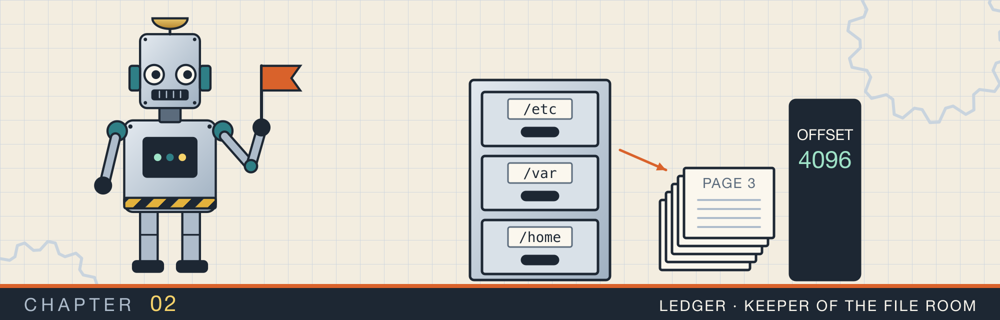
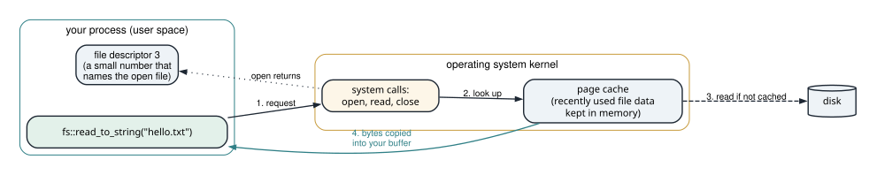
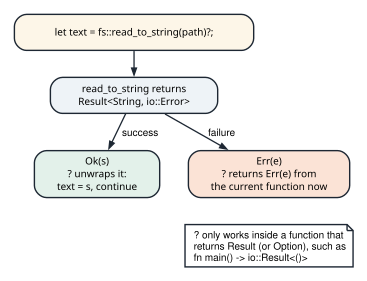
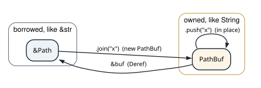
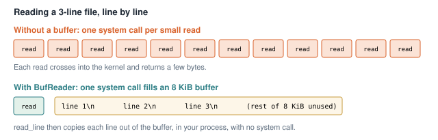
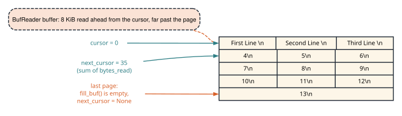
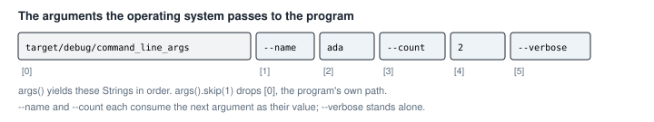

# Files, paths, and the command line

<div class="covers" markdown="1">

This chapter covers

- What happens between your program and the disk when you read a file
- `Result` and the `?` operator, which every later chapter uses
- `Path` and `PathBuf`, and reading a file whole or line by line
- Appending, copying, renaming, and deleting files, and telling one error from another
- Listing and walking directories
- Reading a large file one page at a time, and parsing command-line arguments

</div>

In chapter 1 your programs only computed values. In this chapter they talk to the operating system. They
read and write files, look inside directories, and read the arguments you type after a program's name.

Every one of these operations can fail. A file may not exist, or you may not have permission to read it.
Rust reports such failures through a type called `Result`, so this chapter starts there. After that come
paths, reading, writing, and directories. The chapter ends with two complete tools. One reads a file a page
at a time. The other turns command-line arguments into typed options.

A few terms:

- The **kernel** is the core of the operating system. It controls the disk, memory, and devices.
- A **system call** is a request from a program to the kernel, such as "open this file" or "read 100
  bytes".
- A **file descriptor** is a small number the kernel gives your program for each open file. Later system
  calls use it to name that file.

## 2.1 What happens when you read a file

Your program cannot read the disk directly. It asks the kernel with system calls, and the kernel does the
work. Figure 2.1 shows the steps for reading a small file.

<figure>

<figcaption><b>Figure 2.1</b> A read goes through the kernel. The kernel keeps recently used file data in memory, in its page cache, so a second read of the same file usually does not touch the disk.</figcaption>
</figure>

The steps are:

1. `open` asks the kernel to open the file. The kernel checks permissions and returns a file descriptor.
2. `read` asks for bytes from that descriptor. The kernel copies them into a buffer in your program.
3. `close` tells the kernel you are done, so it can release the descriptor.

Rust's standard library makes these calls for you. Each call can fail, and the library reports that with
`Result`.

## 2.2 `Result` and the `?` operator

`Result` is an enum with two variants:

```rust
enum Result<T, E> {
    Ok(T),    // the operation succeeded and produced a T
    Err(E),   // the operation failed with an error of type E
}
```

For file operations, the error type is `std::io::Error`, and `io::Result<T>` is a shorter name for
`Result<T, io::Error>`. So `fs::read_to_string(path)` returns `io::Result<String>`: either the file's text,
or the reason it could not be read.

You can handle a `Result` with `match`. That gets long when a function makes several calls, each of which
can fail. The `?` operator shortens it. Put `?` after an expression of type `Result`, and it does one of two
things (figure 2.2):

- If the value is `Ok(x)`, the expression evaluates to `x` and the function continues.
- If the value is `Err(e)`, the function returns `Err(e)` immediately.

<figure>

<figcaption><b>Figure 2.2</b> The <code>?</code> operator. It can only be used inside a function that itself returns <code>Result</code>.</figcaption>
</figure>

Because `?` returns from the function, the function must return a `Result` too. That is why the programs in
this chapter declare `fn main() -> io::Result<()>`. If `main` returns an `Err`, Rust prints the error and
the program exits with status 1.

## 2.3 Paths

A **path** names a file or directory, such as `/tmp/data.txt`. Rust has two path types. `&Path` is a
borrowed view of a path, and `PathBuf` is an owned path that can grow. They relate the same way `&str`
relates to `String` (figure 2.3).

<figure>

<figcaption><b>Figure 2.3</b> <code>join</code> returns a new owned path. <code>push</code> extends a <code>PathBuf</code> in place. A <code>&amp;PathBuf</code> converts to <code>&amp;Path</code> automatically when a function asks for one.</figcaption>
</figure>

<p class="listing"><b>Listing 2.1</b> Building paths and taking them apart. <a href="https://github.com/arpanpathak/cracking-the-systems-programming-interview/blob/prep-v2/rust-interview-lab/src/bin/path_buff.rs">src/bin/path_buff.rs</a></p>

```rust
{{#include ../../rust-interview-lab/src/bin/path_buff.rs}}
```

`Path::new("/tmp")` wraps a string as a path without copying it. `dir.join("data.txt")` builds a new
`PathBuf`. `PathBuf::from(dir)` copies the path into an owned buffer, and each `push` adds one component.

```text
$ cargo run --bin path_buff
file: /tmp/data.txt
buf:  /tmp/nested/file.txt
parent: Some("/tmp/nested")
file_name: Some("file.txt")
ext: Some("txt")
```

`parent`, `file_name`, and `extension` return `Option`, because some paths lack them: `/` has no parent.
To print a path you call `display()`. On Linux and macOS a path is a sequence of bytes that need not be
valid UTF-8. `display()` replaces any invalid bytes when it prints.

<div class="callout warning" markdown="1">

**WARNING:** If the argument to `join` or `push` is an absolute path, it replaces the whole path instead of
extending it. `Path::new("/srv").join("/etc/passwd")` is `/etc/passwd`. If part of a path comes from a user,
reject absolute paths and `..` before you join it.

</div>

## 2.4 Reading a file

### 2.4.1 The whole file at once

The simplest read loads the whole file into one `String`.

<p class="listing"><b>Listing 2.2</b> Write a file, then read it back. <a href="https://github.com/arpanpathak/cracking-the-systems-programming-interview/blob/prep-v2/rust-interview-lab/src/bin/read_write_file.rs">src/bin/read_write_file.rs</a></p>

```rust
{{#include ../../rust-interview-lab/src/bin/read_write_file.rs}}
```

`fs::write` creates the file (or empties an existing one) and writes the text. `fs::read_to_string` opens,
reads, and closes the file in one call. Both calls end with `?`, so a failure in either one returns from
`main`.

`read_content_of_file` takes `&Path`. The program calls it twice, with a path built by `join` and a path built
by `push`. Both are `PathBuf` values that convert to `&Path`. The two calls print the
same text.

`read_to_string` keeps the whole file in memory. That suits a small configuration file. For a log of
several gigabytes, read one line at a time instead.

### 2.4.2 One line at a time

To read line by line, wrap the file in a `BufReader`. Figure 2.4 shows why the buffer helps.

<figure>

<figcaption><b>Figure 2.4</b> A <code>BufReader</code> asks the kernel for a large block at once and hands out lines from it. Fewer system calls means less time spent crossing into the kernel.</figcaption>
</figure>

<p class="listing"><b>Listing 2.3</b> Numbered lines through a buffered reader. <a href="https://github.com/arpanpathak/cracking-the-systems-programming-interview/blob/prep-v2/rust-interview-lab/src/bin/readfile_line_by_line.rs">src/bin/readfile_line_by_line.rs</a></p>

```rust
{{#include ../../rust-interview-lab/src/bin/readfile_line_by_line.rs}}
```

`BufReader::new(file)` takes ownership of the file and adds an 8 KiB buffer. The `lines` method comes from
the `BufRead` trait, so the program imports that trait. Without the import, the method is not visible.

`lines()` yields one `io::Result<String>` per line, with the newline removed. Reading can fail partway
through the file, so each line is a `Result`. `let line = line?;` replaces the `Result` with the `String`
inside it, using the shadowing you saw in section 1.2. `enumerate()` pairs each line with its index,
starting at 0, which is why the program prints `i + 1`.

### 2.4.3 Reusing one buffer, and skipping bad lines

`lines()` allocates a new `String` for every line. For a very large file, you can read every line into the
same `String` instead.

<p class="listing"><b>Listing 2.4</b> One reused buffer, with invalid lines skipped. <a href="https://github.com/arpanpathak/cracking-the-systems-programming-interview/blob/prep-v2/rust-interview-lab/src/bin/read_large_file.rs">src/bin/read_large_file.rs</a></p>

```rust
{{#include ../../rust-interview-lab/src/bin/read_large_file.rs}}
```

`reader.read_line(&mut line)` appends the next line, including its newline, to `line`. It returns the
number of bytes read. The loop is written in an unusual way: `while match ... { ... } {}`. The whole
`match` is the loop's condition, and the loop's body, `{}`, is empty. Each arm of the `match` evaluates to
`true` to continue or `false` to stop.

Table 2.1 lists the four outcomes.

| `read_line` returns | Meaning | What the loop does |
|---|---|---|
| `Ok(0)` | end of the file | stops |
| `Ok(n)` | a line of `n` bytes | processes it, clears the buffer, continues |
| `Err(e)` with kind `InvalidData` | the line is not valid UTF-8 text | prints a message, clears, continues |
| any other `Err` | a real read failure | returns the error from `main` |

Because `read_line` appends, the loop must call `line.clear()` after each line. Otherwise the buffer would
grow to hold the whole file.

The `InvalidData` arm can continue safely because `read_line` has already consumed the invalid bytes. You
can check this with a file whose second line holds two bytes that are not UTF-8:

```text
$ printf 'ok\n\xff\xfebad\nfine\n' > large.txt
$ cargo run --bin read_large_file
ok
skipping bad line: stream did not contain valid UTF-8
fine
```

## 2.5 Writing and changing files

### 2.5.1 Appending

`fs::write` replaces a file's contents. To add lines to the end of a log instead, open the file with
`OpenOptions`.

<p class="listing"><b>Listing 2.5</b> Appending lines to a file. <a href="https://github.com/arpanpathak/cracking-the-systems-programming-interview/blob/prep-v2/rust-interview-lab/src/bin/append_to_file_open_options.rs">src/bin/append_to_file_open_options.rs</a></p>

```rust
{{#include ../../rust-interview-lab/src/bin/append_to_file_open_options.rs}}
```

`OpenOptions` collects settings, and `open` applies them. `create(true)` creates the file if it is missing.
`append(true)` asks the kernel to move to the end of the file before every write. The kernel does that move
and the write as one step. So two programs appending to the same log do not overwrite each other's lines.

`writeln!` works like `println!`, but writes to any value that implements the `std::io::Write` trait, such
as a `File`. The trait must be imported, as the second `use` line does.

### 2.5.2 Copying, renaming, and deleting

<p class="listing"><b>Listing 2.6</b> Copy, rename, remove. <a href="https://github.com/arpanpathak/cracking-the-systems-programming-interview/blob/prep-v2/rust-interview-lab/src/bin/copy_rename_delete_file.rs">src/bin/copy_rename_delete_file.rs</a></p>

```rust
{{#include ../../rust-interview-lab/src/bin/copy_rename_delete_file.rs}}
```

After the program runs, `a.txt` is gone and `c.txt` holds `hello`. Each call is one or two system calls.

`fs::rename` has a property you can build on. When both names are on the same disk, the rename is
**atomic**. Any other program sees either the old name or the new one, never a half-renamed file. To update
a file safely, write the new contents to a temporary file, then rename it over the old one. A crash in the
middle leaves either the old file or the new file, never a partial one.

### 2.5.3 Telling one error from another

An `io::Error` carries a **kind**, an enum value such as `NotFound` or `PermissionDenied`. You can match on
it to handle one failure and report the others.

<p class="listing"><b>Listing 2.7</b> Matching on the kind of an error. <a href="https://github.com/arpanpathak/cracking-the-systems-programming-interview/blob/prep-v2/rust-interview-lab/src/bin/file_error_handling.rs">src/bin/file_error_handling.rs</a></p>

```rust
{{#include ../../rust-interview-lab/src/bin/file_error_handling.rs}}
```

The second arm has a **match guard**, the `if` after the pattern. It matches only errors whose kind is
`NotFound`. Every other error falls through to the third arm. This `main` does not return a `Result`, so it
cannot use `?`; it handles every case itself. Run it where `missing.txt` does not exist, and it prints
`File not found`.

## 2.6 Directories

A directory is a list of entries. Each entry has a name and a type: a file, a directory, or a symbolic
link. A **symbolic link** is an entry that points to another path.

### 2.6.1 One level

<p class="listing"><b>Listing 2.8</b> Listing the current directory. <a href="https://github.com/arpanpathak/cracking-the-systems-programming-interview/blob/prep-v2/rust-interview-lab/src/bin/list_directory.rs">src/bin/list_directory.rs</a></p>

```rust
{{#include ../../rust-interview-lab/src/bin/list_directory.rs}}
```

`fs::read_dir(".")` returns an iterator over the entries of the current directory. Each item is a
`Result`, because reading an entry can fail. `path.is_dir()` asks the kernel for the entry's details. If
the entry is a symbolic link, `is_dir` follows it and reports on the target.

### 2.6.2 Every level

To visit subdirectories, the function calls itself on each directory it finds, the recursion you met in
section 1.5.

<p class="listing"><b>Listing 2.9</b> Walking a directory tree. <a href="https://github.com/arpanpathak/cracking-the-systems-programming-interview/blob/prep-v2/rust-interview-lab/src/bin/recusrive_directory_walk.rs">src/bin/recusrive_directory_walk.rs</a></p>

```rust
{{#include ../../rust-interview-lab/src/bin/recusrive_directory_walk.rs}}
```

`walk` uses `entry.file_type()` instead of `path.is_dir()`. The difference is how each treats symbolic
links. `file_type()` does not follow them, so a link to a directory is reported as a link, and `walk` does
not descend into it. That keeps the walk from looping forever through a link that points back to one of its
own parent directories. On Linux, `file_type()` is usually also faster, because the kernel returns the type
together with the name.

The recursion goes one level deeper per directory level. Real directory trees are shallow, so the stack is
not a concern here.

## 2.7 Project: reading a large file one page at a time

Suppose a service stores millions of job records, one per line, in a file. A client asks for them a page at
a time. With each page, the service returns a **cursor**, a value the client sends back to get the next page.

If the cursor is the byte position where the next page starts, the service needs no memory of past
requests. Any copy of the service can read the next page from the cursor alone.

### 2.7.1 The page type

<p class="listing"><b>Listing 2.10</b> The <code>Page</code> type (lines 1 to 7). <a href="https://github.com/arpanpathak/cracking-the-systems-programming-interview/blob/prep-v2/rust-interview-lab/src/bin/file_pagination.rs">src/bin/file_pagination.rs</a></p>

```rust
{{#include ../../rust-interview-lab/src/bin/file_pagination.rs:1:7}}
```

A `Page` holds the lines and an `Option<u64>` for the next cursor. `None` means there are no more pages.

### 2.7.2 Counting bytes to find the next cursor

The next cursor is the byte where this page ends. There is a trap in finding it. You might ask the file for
its current position after reading three lines. That answer is wrong, because the `BufReader` read 8 KiB
ahead on its first read, as figure 2.4 showed. The file's position is past the buffered data, not after the
third line (figure 2.5).

<figure>

<figcaption><b>Figure 2.5</b> Each row is one page. The next cursor is the sum of the bytes each <code>read_line</code> returned: 12 + 12 + 11 = 35 for the first page. The file's own position is far past that, at the end of what the buffer read.</figcaption>
</figure>

So `read_page` counts the bytes itself:

<p class="listing"><b>Listing 2.11</b> <code>read_page</code> (lines 9 to 36).</p>

```rust
{{#include ../../rust-interview-lab/src/bin/file_pagination.rs:9:36}}
```

`read_page` opens the file and calls `seek(SeekFrom::Start(cursor))`, which moves the file's read position
to byte `cursor`. Then it wraps the file in a `BufReader`. `Vec::with_capacity(page_size)` reserves room
for a full page, so pushing lines does not reallocate.

`offset` starts at `cursor`. Each `read_line` returns how many bytes it consumed, newline included, and
`offset` grows by that amount. `line.trim_end()` removes the newline (and any trailing spaces) before the
line is stored, but the count still includes them, so `offset` stays exact.

The last page needs care. If the file ends exactly after this page's last line, the page should report no
next cursor. `reader.fill_buf()` returns the bytes waiting in the buffer, reading more if the buffer is
empty, without consuming them. If it returns nothing, the file has ended, and the cursor is `None`.

### 2.7.3 The complete program

`main` acts as a client. It asks for pages of three lines until the cursor is `None`.

<p class="listing"><b>Listing 2.12</b> The complete program. <a href="https://github.com/arpanpathak/cracking-the-systems-programming-interview/blob/prep-v2/rust-interview-lab/src/bin/file_pagination.rs">src/bin/file_pagination.rs</a></p>

```rust
{{#include ../../rust-interview-lab/src/bin/file_pagination.rs}}
```

The input file has thirteen lines, so the program prints four full pages and one page of one line:

```text
$ cargo run --bin file_pagination
--- page ---
First Line
Second Line
Thrid Line
--- page ---
4
5
6
--- page ---
7
8
9
--- page ---
10
11
12
--- page ---
13
```

<div class="callout tip" markdown="1">

**TIP:** If the file can change between requests, an old cursor may point into the middle of a line. You
can include a version number with the offset in the cursor, and reject cursors whose version is out of date.

</div>

## 2.8 Project: command-line arguments

When you run `command_line_args --name ada --count 2 --verbose`, the operating system passes the program a
list of strings (figure 2.6). The first string is the program's own path. The rest are the arguments, in
the order you typed them.

<figure>

<figcaption><b>Figure 2.6</b> The arguments as the program receives them. <code>--name</code> and <code>--count</code> each take the next string as their value.</figcaption>
</figure>

This program turns that list into a struct of typed options, or an error message.

### 2.8.1 The options and their defaults

<p class="listing"><b>Listing 2.13</b> The options (lines 1 to 17). <a href="https://github.com/arpanpathak/cracking-the-systems-programming-interview/blob/prep-v2/rust-interview-lab/src/bin/command_line_args.rs">src/bin/command_line_args.rs</a></p>

```rust
{{#include ../../rust-interview-lab/src/bin/command_line_args.rs:1:16}}
```

`Options` has one field per option. The `Default` trait gives the values used when an option is not given.
`#[derive(Debug, PartialEq)]` lets the tests print and compare `Options` values.

### 2.8.2 Parsing

<p class="listing"><b>Listing 2.14</b> <code>parse</code> (lines 18 to 40).</p>

```rust
{{#include ../../rust-interview-lab/src/bin/command_line_args.rs:18:40}}
```

`parse` takes `impl IntoIterator<Item = String>`, which means "anything that can produce `String`s one at a
time". The program passes the real arguments. The tests pass short lists written in the test code.

The loop is `while let Some(argument) = arguments.next()`. It calls `next()` itself, rather than using
`for`, because `--name` must take the next string from the same iterator as its value. A `for` loop holds
the iterator for the whole loop, so the body could not call `next()` on it.

`arguments.next().ok_or("--name needs a value")?` does two steps. `ok_or` turns `None` into an `Err` with
the message. Then `?` returns that error from `parse`. The `--count` arm adds a third step. `parse()`
converts the text to a number, and `map_err` replaces a parse error with a message that includes the text.

An argument the program does not know is an error, so a misspelled option is reported instead of ignored.

### 2.8.3 The exit code

<p class="listing"><b>Listing 2.15</b> <code>main</code> (lines 42 to 61).</p>

```rust
{{#include ../../rust-interview-lab/src/bin/command_line_args.rs:42:61}}
```

A program's **exit code** is a number it returns to whoever started it. Zero means success. `main` returns
`ExitCode`, so it can report failure after printing its own message. `args().skip(1)` drops the program's
path. On an error, `main` prints the message and a usage line to standard error with `eprintln!`, then
returns `ExitCode::FAILURE`, which is 1.

### 2.8.4 The complete program

<p class="listing"><b>Listing 2.16</b> The complete program, with its tests. <a href="https://github.com/arpanpathak/cracking-the-systems-programming-interview/blob/prep-v2/rust-interview-lab/src/bin/command_line_args.rs">src/bin/command_line_args.rs</a></p>

```rust
{{#include ../../rust-interview-lab/src/bin/command_line_args.rs}}
```

The helper `parse_args` in the test module converts a list of `&str` into `String`s, so each test states its
input in one line. The tests cover the defaults, each option, a missing value, a bad number, and an unknown
argument.

```text
$ cargo run --bin command_line_args -- --name ada --count 2 --verbose
[0] hello, ada
[1] hello, ada
$ cargo run --bin command_line_args -- --count many
error: --count needs a number, got "many"
usage: command_line_args [--name NAME] [--count N] [--verbose]
$ echo $?
1
```

The `--` after `cargo run --bin command_line_args` tells Cargo that the rest of the line belongs to your
program, not to Cargo.

<div class="summary" markdown="1">

## Summary

- A program reads files through system calls. The kernel keeps recent file data in its page cache.
- `Result<T, E>` holds either a value or an error. `?` returns the error from the current function, so that
  function must return `Result`.
- `&Path` and `PathBuf` are the borrowed and owned path types. Functions should take `&Path`.
- `fs::read_to_string` reads a whole file. A `BufReader` reads large files a line at a time with few system
  calls. `read_line` into one reused `String` avoids an allocation per line.
- `OpenOptions` with `append(true)` adds to a file safely. A rename within one disk is atomic.
- `io::Error::kind()` lets you handle one kind of failure and report the others.
- `file_type()` does not follow symbolic links, which keeps a recursive walk from looping.
- A byte offset works as a page cursor if you count the bytes you read, not the file's position.
- Command-line arguments arrive as strings. Parse them in a function that takes an iterator, and return an
  exit code.

</div>

Chapter 3 begins Part 2. It works with Rust's main collections, `Vec`, `String`, and `HashMap`, on a series
of problems about arrays and text.

## Exercises

1. Rewrite `walk` without recursion. Keep a `Vec<PathBuf>` of directories still to visit, and count the files
   and total bytes for each file extension.
2. Write `atomic_write(path, bytes)`. Write to a temporary file in the same directory, call `sync_all()` on
   it, and rename it over the target.
3. Add a version number to the pagination cursor, and return an error when the file changed between pages.
4. Let the argument parser accept `--name=ada` as well as `--name ada`.
