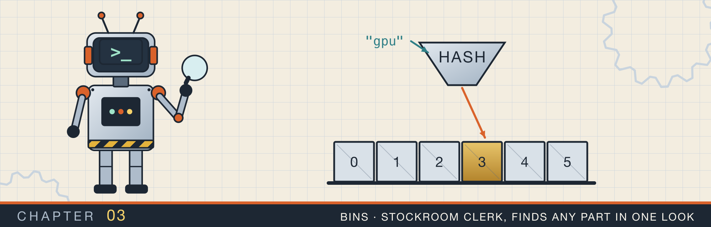

# Vectors, strings, and hash maps

<div class="covers" markdown="1">

This chapter covers

- Counting how much work an algorithm does, and the O(n) notation for it
- How a `Vec`, a `String`, and a `HashMap` are laid out in memory
- Finding a pair of numbers with a hash map
- Using a vector as a stack to check brackets and to track a minimum
- Walking an array with two indexes: reversing, sliding windows, and merging intervals
- Binary search, rotating a grid, and searching text

</div>

This chapter begins Part 2. Part 2 is about data structures and the algorithms that use them. In this
chapter you work with the three collections you will use most in Rust: `Vec`, `String`, and `HashMap`.

Before any problem, I spend a few sections on groundwork. First, a way to compare two solutions by how
much work they do. Then a look at how each collection stores its data. With that in place, each problem
in the rest of the chapter is short, and you can see why each solution is fast.

The problems are grouped by technique, not by topic. A technique is a pattern you can reuse. Two examples are
"keep a stack of things not yet matched" and "move two indexes toward each other". Table 3.1 lists them.

| Section | Technique | Problems |
|---|---|---|
| 3.5 | look things up in a hash map | find two numbers that add up to a target |
| 3.6 | a vector used as a stack | check brackets; a stack that knows its minimum |
| 3.7 | two indexes moving toward each other | reverse a string; find three numbers that add to zero |
| 3.8 | a window that slides along a string | longest piece of text with no repeated letter |
| 3.9 | sort, then walk once | merge overlapping ranges |
| 3.10 | halve the search each step | binary search in a rotated array |
| 3.11 | transform in place | rotate a square grid |
| 3.12 | reuse what you already matched | find text inside other text |

## 3.1 Counting the work an algorithm does

Two programs can give the same answer and take very different amounts of time. You saw this in chapter 1:
the recursive Fibonacci took milliseconds where the loop took nanoseconds. To choose between solutions,
you need a way to describe how their running time grows as the input grows.

The usual way is to count the basic steps a program takes for an input of size n. Here n is the length of
the array or string. A basic step is something that takes a fixed amount of time, such as comparing two
numbers or reading one element.

Consider three ways to answer questions about an array of n numbers:

- Reading the first element takes one step, whatever n is.
- Adding up all the elements takes n steps, one per element.
- Comparing every element with every other element takes about n × n steps.

**Big-O notation** is a short way to write how the count grows. You keep only the part that grows fastest
and drop constant factors. So the three examples above are written O(1), O(n), and O(n²). You read O(n) as
"order n": the time grows in proportion to n.

Table 3.2 shows how different these are once n is large.

| n | O(1) | O(log n) | O(n) | O(n log n) | O(n²) |
|---|---|---|---|---|---|
| 10 | 1 | about 3 | 10 | about 33 | 100 |
| 1,000 | 1 | about 10 | 1,000 | about 10,000 | 1,000,000 |
| 1,000,000 | 1 | about 20 | 1,000,000 | about 20,000,000 | 1,000,000,000,000 |

A modern processor does roughly a billion simple steps per second. At a million elements, an O(n) solution
finishes in about a millisecond. An O(n²) solution takes about a quarter of an hour.

The same notation describes memory. A solution that uses O(n) extra memory stores something for each
input element. A solution that uses O(1) extra memory uses a fixed amount, however large the input.

<div class="callout note" markdown="1">

**NOTE:** O(log n) appears when each step cuts the remaining work in half. Halving a million items takes
about 20 steps to get down to one, because 2 multiplied by itself 20 times is about a million. Section
3.10 uses this.

</div>

## 3.2 How a `Vec` stores its elements

A `Vec<T>` is a growable array. Its elements sit next to each other in one block of heap memory. The
`Vec` value itself is small. It holds three numbers. The first is a pointer to the block. The second is
the number of elements in use, its **length**. The third is how many elements the block has room for, its
**capacity**. Figure 3.1
shows a vector of four `i32` values with room for six.

<figure>
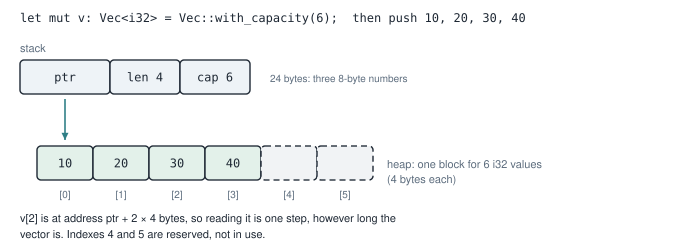
<figcaption><b>Figure 3.1</b> A <code>Vec&lt;i32&gt;</code> with length 4 and capacity 6. The elements are next to each other, so the address of any element can be computed from its index.</figcaption>
</figure>

Because the elements are next to each other, reading `v[i]` takes one step. The address of element `i` is
the block's address plus `i` times the size of one element. The length of the vector does not matter.
So indexing a `Vec` is O(1).

When you push an element and the block is full, the vector needs a bigger block. Figure 3.2 shows what
happens.

<figure>
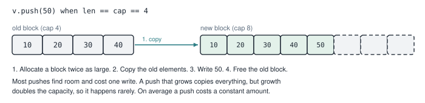
<figcaption><b>Figure 3.2</b> Pushing into a full vector. The vector allocates a block twice as large, copies the old elements, writes the new one, and frees the old block.</figcaption>
</figure>

That copy costs O(n), but it happens rarely, because each growth doubles the capacity. Spread over all
the pushes, each push costs a constant amount on average. This is called **amortized O(1)**.

If you know how many elements you will push, `Vec::with_capacity(n)` allocates the whole block at once, and
no copy happens at all. You will see this in several listings below.

<div class="callout warning" markdown="1">

**WARNING:** A push can move every element to a new block. So Rust does not let you keep a reference to an
element while you push. The compiler rejects code that holds `&v[0]` across a `v.push(...)`, since
the reference could point to freed memory afterward.

</div>

## 3.3 How a `String` stores text

A `String` is a `Vec<u8>` with one extra rule. Its bytes must always be valid UTF-8. **UTF-8** is the
standard way of turning characters into bytes. An English letter takes one byte. Other characters take two,
three, or four bytes. Figure 3.3 shows the four characters of `"café"`.

<figure>
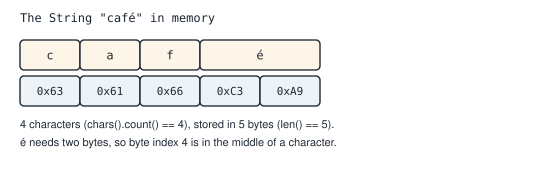
<figcaption><b>Figure 3.3</b> <code>"café"</code> has four characters and five bytes. The letter é takes two bytes.</figcaption>
</figure>

This has three consequences you will meet in this chapter:

- `s.len()` counts bytes, not characters. `"café".len()` is 5.
- `s.chars()` walks the characters one at a time, decoding the bytes as it goes.
- You cannot index a `String` with `s[3]`. A byte index might fall in the middle of a character, as index 4
  does in figure 3.3, so Rust does not allow it.

## 3.4 How a `HashMap` finds a key

A `HashMap<K, V>` stores pairs of a key and a value, and finds the value for a key quickly. It works in
three steps (figure 3.4):

1. It runs the key through a **hash function**, which turns any key into a large number. The same key
   always gives the same number.
2. It uses some of the bits of that number to pick a **bucket**, one slot in an array of buckets.
3. It stores the pair in that bucket, or looks for it there.

<figure>
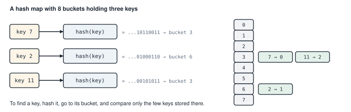
<figcaption><b>Figure 3.4</b> A map with 8 buckets. Keys 7 and 11 happen to land in the same bucket, so a lookup there compares both.</figcaption>
</figure>

Two keys can land in the same bucket, as 7 and 11 do in the figure. Then a lookup compares the keys in
that bucket one by one. The map keeps the number of keys per bucket small by growing its bucket array as
it fills. So on average, `insert` and `get` are O(1), however many keys the map holds.

Rust's `HashMap` uses a hash function with a random starting value, chosen when the program starts. This
stops an attacker from sending keys that all land in one bucket. It also means the order in which you
iterate over a map changes from one run to the next.

Now you have the tools for the problems. Each one starts with the simplest correct idea, then shows how a
collection makes it faster.

## 3.5 Finding two numbers that add up to a target

**The problem.** Given an array of numbers and a target, find two positions whose numbers add up to the
target. For `[2, 7, 11, 15]` and target 9, the answer is positions 0 and 1, because 2 + 7 = 9.

**The simple idea.** Try every pair. For each position `i`, check every later position `j`. That is about
n × n / 2 pairs, so O(n²).

**A faster idea.** Walk the array once. For each number, you know which partner it needs: `target - num`.
If you have already seen that partner, you are done. To answer "have I seen it?" in one step, keep a
`HashMap` from each number seen so far to its position.

Trace it on `[2, 7, 11, 15]` with target 9:

| Position | Number | Partner needed | In the map? | Map afterward |
|---|---|---|---|---|
| 0 | 2 | 7 | no | {2: 0} |
| 1 | 7 | 2 | yes, at position 0 | answer: (0, 1) |

<p class="listing"><b>Listing 3.1</b> Two Sum with one pass and a hash map. <a href="https://github.com/arpanpathak/cracking-the-systems-programming-interview/blob/prep-v2/rust-interview-lab/src/problems/two_sum.rs">src/problems/two_sum.rs</a></p>

```rust
{{#include ../../rust-interview-lab/src/problems/two_sum.rs}}
```

Walk through the function:

- The parameter `nums: &[i32]` is a **slice**, a borrowed view of a sequence of `i32` values. You can pass a
  `Vec`, an array, or part of either.
- `HashMap::with_capacity(nums.len())` sizes the map for the worst case, so it never grows during the loop.
- `nums.iter().enumerate()` gives pairs of (position, reference to number). The pattern `(idx, &num)` copies
  the number out of the reference.
- `seen.get(&(target - num))` looks up the partner. `get` takes a reference to the key, hence the `&`.
- If the partner is found, the function returns both positions. Otherwise it records this number.

The lookup comes before the insert. Think of target 4 with a single 2 in the array. If the insert came
first, the 2 would find itself and pair with itself.

The function returns `Option<(usize, usize)>`: `Some` with the two positions, or `None` if no pair exists.
It runs in O(n) time and uses O(n) extra memory for the map.

<figure class="anim">
<video class="motion" src="figures/ch03-two-sum.mp4" autoplay loop muted playsinline preload="metadata" aria-label="The array 2, 7, 11, 15 with target 9, and the map seen beside it. idx points at 2; the partner 7 is not in seen, so 2 maps to 0 is stored. idx moves to 7; the partner 2 is in seen at index 0, so the function returns Some((0, 1)). A second run moves the insert above the lookup: with target 4 and the array [2], the 2 finds itself and the result is Some((0, 0))." data-chapters="[[2.4, &quot;index 0&quot;], [22.92, &quot;index 1&quot;], [41.46, &quot;insert first&quot;]]">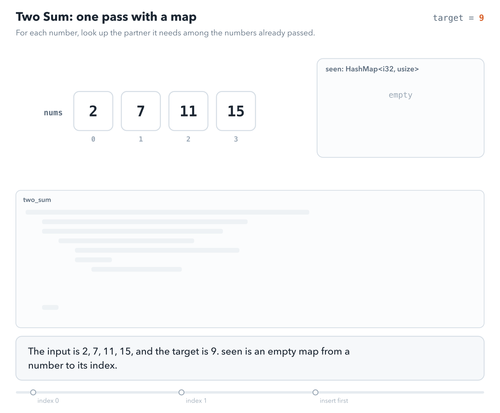</video>
<figcaption><b>Animation 3.1</b> The trace from the table, with the code line that runs at each step. The last part moves the insert above the lookup, and the single 2 pairs with itself.</figcaption>
</figure>

<div class="callout warning" markdown="1">

**WARNING:** `target - num` is computed in `i32`. For numbers near the ends of the `i32` range, such as
`i32::MIN`, the subtraction overflows, and a debug build stops with a panic. Using `i64` for the arithmetic,
or `target.checked_sub(num)`, avoids it.

</div>

## 3.6 A vector used as a stack

A **stack** is a collection where you add and remove items at the same end, called the top. The last item
you added is the first one you remove. A `Vec` works as a stack. `push` adds to the end, and `pop` removes
the last item and returns it. `last` looks at the end without removing it. All three are O(1).

### 3.6.1 Checking brackets

**The problem.** A string of brackets is valid if every opening bracket is closed by the matching kind, in
the right order. `"{[()]}"` is valid. `"([)]"` is not, because `]` arrives while `(` is still open.

**The idea.** Read the string from left to right. Push each opening bracket onto a stack. When a closing
bracket arrives, the top of the stack must be its matching opener; pop it and continue. At the end, the
stack must be empty. Figure 3.5 traces `"{[()]}"`.

<figure>
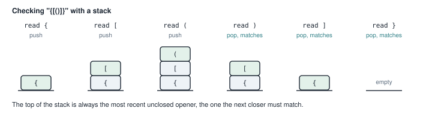
<figcaption><b>Figure 3.5</b> Checking <code>"{[()]}"</code>. Each closing bracket pops the opener on top, which must be its partner.</figcaption>
</figure>

<figure class="anim">
<video class="motion" src="figures/ch03-brackets.mp4" autoplay loop muted playsinline preload="metadata" aria-label="The string ( [ { } ] ) with a stack beside it. Each opener is pushed. Each closer pops the top, which matches, and the stack ends empty, so is_valid returns true. A second run on ( [ ) ]: the closer ) pops [, which does not match, so is_valid returns false." data-chapters="[[0.0, &quot;([{}])&quot;], [38.16, &quot;([)]&quot;]]">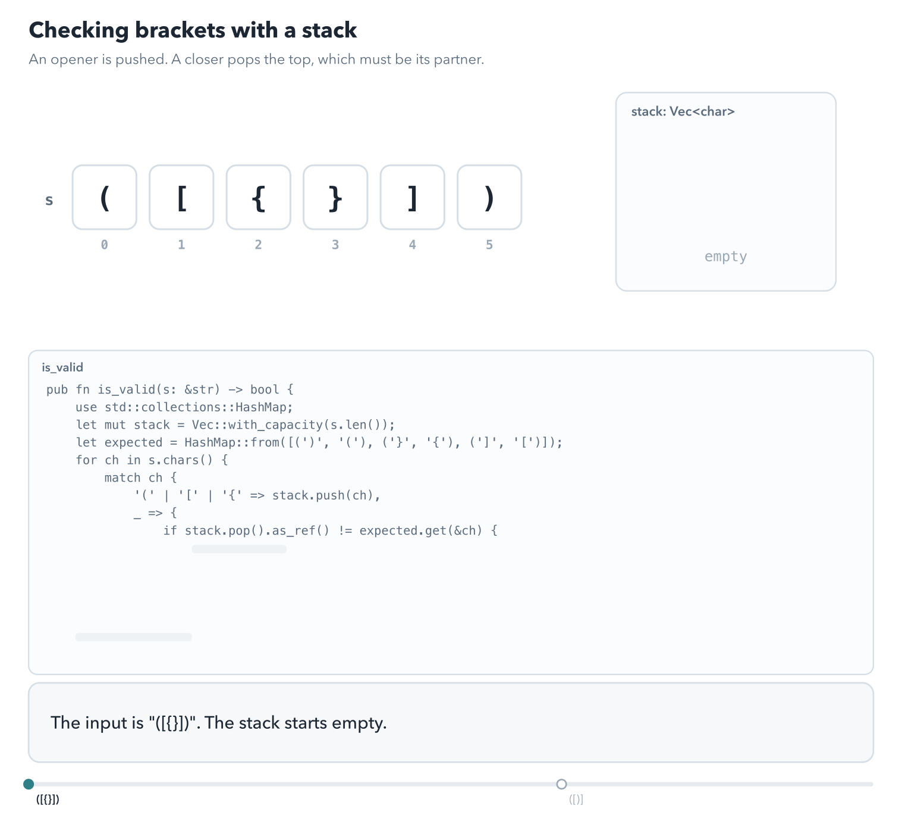</video>
<figcaption><b>Animation 3.2</b> An opener is pushed, and a closer pops the top and compares it with its partner. In the second run, <code>)</code> pops <code>[</code>, so the check fails.</figcaption>
</figure>

<p class="listing"><b>Listing 3.2</b> Valid Parentheses. <a href="https://github.com/arpanpathak/cracking-the-systems-programming-interview/blob/prep-v2/rust-interview-lab/src/problems/valid_parentheses.rs">src/problems/valid_parentheses.rs</a></p>

```rust
{{#include ../../rust-interview-lab/src/problems/valid_parentheses.rs}}
```

The map `expected` records, for each closing bracket, the opener it needs. `HashMap::from([...])` builds a
map from an array of pairs.

The `match` has two arms. The first pushes any of the three openers. The second handles every other
character and compares two `Option` values:

- `stack.pop()` removes the top and returns `Some(opener)`, or `None` if the stack is empty. `.as_ref()`
  turns `Option<char>` into `Option<&char>`, so it can be compared with the next value.
- `expected.get(&ch)` returns `Some(&opener)` for a closing bracket.

If they differ, the string is invalid. An empty stack gives `None`, which differs from `Some`, so an extra
closer is caught. After the loop, `stack.is_empty()` catches openers that were never closed.

The tests list valid and invalid examples, including `"([)]"`, a lone `")"`, and `"(("`.

<div class="callout warning" markdown="1">

**WARNING:** Suppose a character that is not a bracket arrives while the stack is empty. It gives `None`
on both sides of the comparison, so it passes. `is_valid("a")` returns `true`. If your input can contain other
characters, skip or reject them in their own arm.

</div>

### 3.6.2 A stack that knows its minimum

**The problem.** Build a stack that supports `push`, `pop`, `top`, and `get_min`, the smallest value
currently in it, all in O(1).

**The idea.** Scanning the stack for the minimum takes O(n). Instead, keep a second stack beside the first.
Each time you push a value, also push the minimum so far. Then the minimum of the whole stack is always on
top of the second stack. When you pop, pop both.

Trace pushes of -2, 0, and -3:

| Operation | `values` | `mins` | `get_min()` |
|---|---|---|---|
| push -2 | [-2] | [-2] | -2 |
| push 0 | [-2, 0] | [-2, -2] | -2 |
| push -3 | [-2, 0, -3] | [-2, -2, -3] | -3 |
| pop | [-2, 0] | [-2, -2] | -2 |

<p class="listing"><b>Listing 3.3</b> Min Stack with a parallel stack of minimums. <a href="https://github.com/arpanpathak/cracking-the-systems-programming-interview/blob/prep-v2/rust-interview-lab/src/problems/min_stack.rs">src/problems/min_stack.rs</a></p>

```rust
{{#include ../../rust-interview-lab/src/problems/min_stack.rs}}
```

`#[derive(Default)]` gives `MinStack` a `default()` function that creates two empty vectors, and `new` calls
it.

In `push`, `self.mins.last()` returns the current minimum, if any. The arm `Some(&min) if min <= val` has a
**guard**, the `if` after the pattern. It pushes the old minimum again when the new value is not smaller.
The `_` arm covers both an empty stack and a new smaller value, and pushes `val`.

The guard uses `<=`, not `<`. When you push a value equal to the current minimum, the minimum is recorded
again. So popping one copy leaves the other, and the minimum stays correct. The test `handles_duplicates`
checks this case.

`top` and `get_min` use `.copied()` to turn `Option<&i32>` into `Option<i32>`, so the caller gets a plain
number.

## 3.7 Two indexes moving toward each other

Some problems need you to look at both ends of an array at once. Keep one index at the start and one at the
end, and move them toward each other. Each step moves at least one index, so the whole walk is O(n).

### 3.7.1 Reversing a string in place

**The idea.** Swap the first and last bytes, then the second and second-to-last, and stop when the indexes
meet (figure 3.6).

<figure>
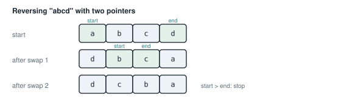
<figcaption><b>Figure 3.6</b> Reversing <code>"abcd"</code>. Two swaps, then the indexes cross.</figcaption>
</figure>

There is a complication. As section 3.3 explained, a `String` must stay valid UTF-8, and swapping the bytes
of a two-byte character would break it. So Rust does not let you change a `String`'s bytes directly in safe
code. `String::as_mut_vec` gives you the bytes, but it is marked `unsafe`. **`unsafe`** marks code where the
compiler cannot check a rule, so the programmer must. Here the rule is "the bytes are valid UTF-8 when
you are done".

<p class="listing"><b>Listing 3.4</b> The reversing function (lines 1 to 14). <a href="https://github.com/arpanpathak/cracking-the-systems-programming-interview/blob/prep-v2/rust-interview-lab/src/bin/reverse_string.rs">src/bin/reverse_string.rs</a></p>

```rust
{{#include ../../rust-interview-lab/src/bin/reverse_string.rs:1:14}}
```

The function keeps the rule by checking first: `assert!(s.is_ascii())` stops the program unless every byte
is a plain ASCII character. Reversing ASCII bytes gives ASCII, which is valid UTF-8. The `unsafe` block is
then as small as possible, one call.

`bytes.swap(start, end)` exchanges two elements of the vector. The loop runs while `start < end`, so the
middle element of an odd-length string stays where it is.

<p class="listing"><b>Listing 3.5</b> The complete program, with its tests. <a href="https://github.com/arpanpathak/cracking-the-systems-programming-interview/blob/prep-v2/rust-interview-lab/src/bin/reverse_string.rs">src/bin/reverse_string.rs</a></p>

```rust
{{#include ../../rust-interview-lab/src/bin/reverse_string.rs}}
```

The test `the_buffer_is_reused` records the string's capacity and the address of its bytes before the
call, then checks both afterward. They are unchanged, so the reversal used no new memory.
`non_ascii_input_panics` is marked `#[should_panic]`: it passes only if the call panics, which the
`assert!` does for `"café"`.

```text
$ cargo run --bin reverse_string
  abcd -> dcba
   abc -> cba
     a -> a
  rust -> tsur
```

<div class="callout warning" markdown="1">

**WARNING:** For an empty string, `bytes.len() - 1` subtracts 1 from 0 in `usize`, which cannot go below
zero. A debug build panics. Return early when the string is empty.

</div>

### 3.7.2 Three numbers that add up to a target

**The problem.** Find every set of three numbers in an array that adds up to a target, without listing the
same set twice.

**The idea.** Sort the array first. Then fix the first number, and look for the other two in the rest of the
array. Use two indexes: `left` starts right after the fixed number, and `right` starts at the end. Because the array is
sorted, you know which index to move:

- If the sum is too small, move `left` right. That can only increase the sum.
- If the sum is too large, move `right` left. That can only decrease it.
- If the sum is right, record the three numbers, then move both.

Each fixed number costs one O(n) walk, and there are n fixed numbers, so the whole search is O(n²). Sorting
costs O(n log n), which is smaller.

The function first sorts, then fixes each number in turn:

```rust
{{#include ../../rust-interview-lab/src/problems/three_sum.rs:6:21}}
        // ...
    }
}
```

- `use std::cmp::Ordering::{Equal, Greater, Less};` lets the code write `Less` instead of
  `Ordering::Less`. The next excerpt matches on these three.
- The `continue` skips a fixed value equal to the previous one, so the same set is not found twice.
- `numbers.len().saturating_sub(1)` gives 0 instead of underflowing when the slice is empty.

For each fixed number, `left` and `right` close in from the two ends of the rest:

```rust
pub fn three_sum(numbers: &mut [i32], target: i32) -> Vec<(i32, i32, i32)> {
    // ...
    for i in 0..numbers.len() {
        // ...
{{#include ../../rust-interview-lab/src/problems/three_sum.rs:22:43}}
    }
    // ...
}
```

- The sum is computed in `i64`. Three `i32` values can add up to more than `i32` can hold. The test
  `does_not_overflow_on_extreme_values` uses `i32::MAX` twice to check this.
- `current_sum.cmp(&target)` returns `Less`, `Greater`, or `Equal`, and the `match` turns each into the move
  from the list above.
- After a match, the two inner `while` loops step `left` and `right` past values equal to the ones in the match.

<p class="listing"><b>Listing 3.6</b> Three Sum, with its tests. <a href="https://github.com/arpanpathak/cracking-the-systems-programming-interview/blob/prep-v2/rust-interview-lab/src/problems/three_sum.rs">src/problems/three_sum.rs</a></p>

```rust
{{#include ../../rust-interview-lab/src/problems/three_sum.rs}}
```

<figure class="anim">
<video class="motion" src="figures/ch03-three-sum.mp4" autoplay loop muted playsinline preload="metadata" aria-label="The sorted array -4, -1, -1, 0, 1, 2. The pointer i fixes one number; left and right start at the ends of the rest. Each step shows the sum: a sum below 0 moves left right, a sum above 0 moves right left. The triples (-1, -1, 2) and (-1, 0, 1) are recorded, and i = 2 is skipped because it repeats -1." data-chapters="[[2.4, &quot;i = 0&quot;], [36.6, &quot;i = 1&quot;], [67.2, &quot;i = 3&quot;]]">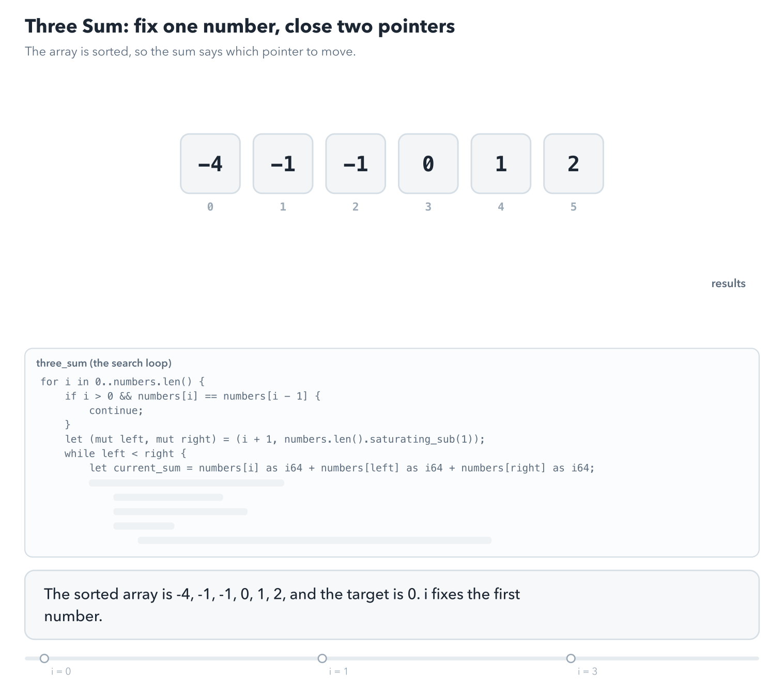</video>
<figcaption><b>Animation 3.3</b> Three Sum on <code>[-4, -1, -1, 0, 1, 2]</code>, one comparison per step. The sign of the sum decides which pointer moves. The repeated <code>-1</code> at index 2 is skipped.</figcaption>
</figure>

## 3.8 A window that slides along a string

**The problem.** Find the length of the longest piece of a string in which no character repeats. In
`"pwwkew"`, the answer is 3, for `"wke"` or `"kew"`.

**The idea.** Keep a **window**, a range `start..=end` of the string with no repeated character. Move `end`
forward one character at a time. When the new character already appears inside the window, move `start` to
the position right after its earlier one. The window never contains a repeat, and the answer is the largest window
seen.

To know where a character last appeared, keep a `HashMap` from each character to its last position. Figure
3.7 shows the moment in `"pwwkew"` when the second `w` arrives.

<figure>
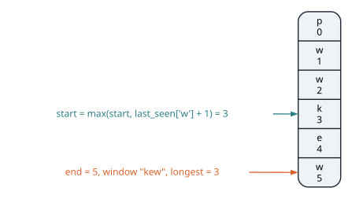
<figcaption><b>Figure 3.7</b> At <code>end = 5</code>, the <code>w</code> was last seen at index 2. <code>start</code> moves to 3, and the window is <code>"kew"</code>.</figcaption>
</figure>

<figure class="anim">
<video class="motion" src="figures/ch03-window.mp4" autoplay loop muted playsinline preload="metadata" aria-label="The string pwwkew with the window drawn as an outline from start to end, and the map last_seen beside it. end moves one character at a time. When the second w arrives, start moves to 2; when the third w arrives, start moves to 3, leaving the window kew, length 3. A second run on abba shows why start uses max: the last a was seen at 0, before the window, so start stays at 2." data-chapters="[[0.0, &quot;pwwkew&quot;], [49.48, &quot;abba&quot;]]">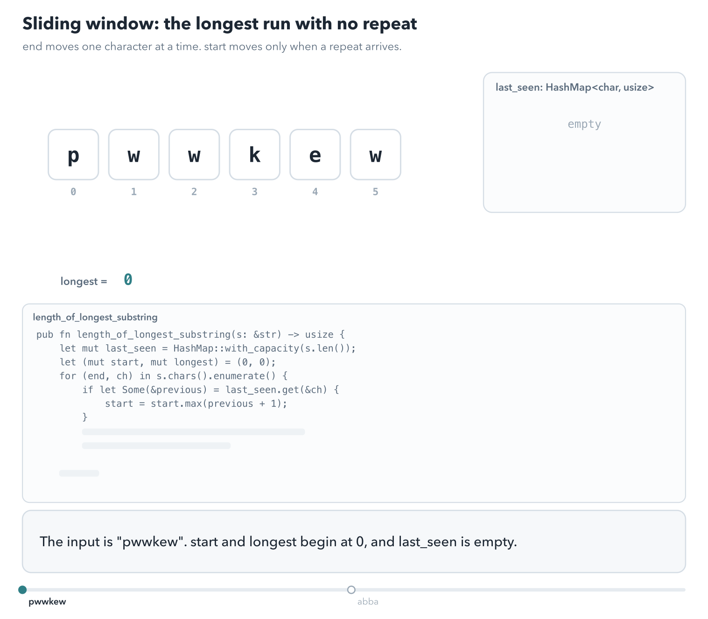</video>
<figcaption><b>Animation 3.4</b> <code>end</code> moves right one character at a time, and <code>start</code> moves only when a repeat inside the window arrives. The run on <code>"abba"</code> shows the case that <code>max</code> handles.</figcaption>
</figure>

<p class="listing"><b>Listing 3.7</b> Longest substring without a repeated character. <a href="https://github.com/arpanpathak/cracking-the-systems-programming-interview/blob/prep-v2/rust-interview-lab/src/problems/sliding_window.rs">src/problems/sliding_window.rs</a></p>

```rust
{{#include ../../rust-interview-lab/src/problems/sliding_window.rs}}
```

`if let Some(&previous) = last_seen.get(&ch)` runs its block only when the character has been seen before.
Then `start = start.max(previous + 1)` moves `start` past the earlier position. The `max` stops `start` from
moving backward when the earlier position is already outside the window. For example, in `"abba"`, the last
`a` was seen at 0, but `start` is already at 2.

`end - start + 1` is the current window's length. Both `start` and `end` only move forward, so the loop does
O(n) work.

The positions come from `chars().enumerate()`, so they count characters, not bytes. That is what the
problem asks for.

## 3.9 Sort, then walk once: merging ranges

**The problem.** Given ranges such as `[1,3] [2,6] [8,10] [15,18]`, merge every group that overlaps. The
answer here is `[1,6] [8,10] [15,18]`.

**The idea.** Sort the ranges by their start. Then walk them once. Each range either overlaps the last
merged range, and extends it, or starts a new merged range (figure 3.8).

<figure>
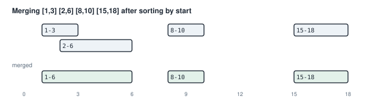
<figcaption><b>Figure 3.8</b> After sorting, a range overlaps the previous merged range exactly when its start is not after that range's end.</figcaption>
</figure>

<figure class="anim">
<video class="motion" src="figures/ch03-merge-intervals.mp4" autoplay loop muted playsinline preload="metadata" aria-label="Four ranges drawn as bars over a number line. They are sorted by start: 1-3, 2-6, 8-10, 15-18. Then each range is compared with the last merged range: 2-6 overlaps 1-3 and extends it to 1-6, and the other two start new merged ranges. The result is 1-6, 8-10, 15-18. A last part shows the input unsorted, where 1-3 and 2-6 would not meet." data-chapters="[[0.0, &quot;sort&quot;], [6.42, &quot;walk&quot;], [45.72, &quot;no sort&quot;]]">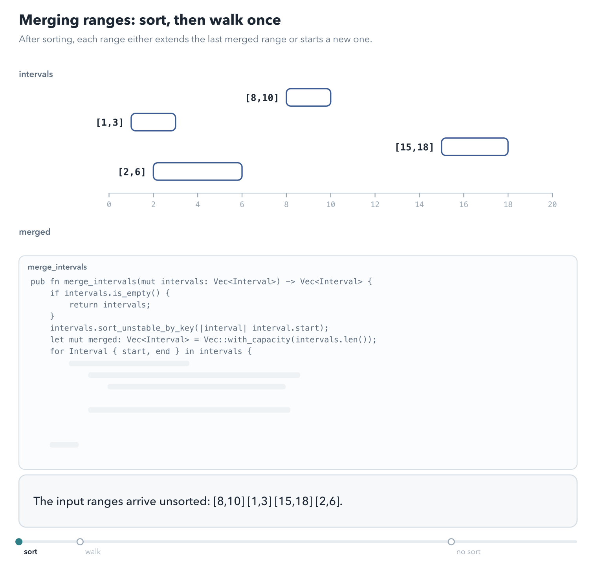</video>
<figcaption><b>Animation 3.5</b> Sorting puts overlapping ranges next to each other, so one walk can merge them. Each step extends the last merged range or starts a new one.</figcaption>
</figure>

The file solves the problem three times: with a named struct, with plain tuples, and in place. First the
struct and the first version:

<p class="listing"><b>Listing 3.8</b> Merging ranges held in a struct (lines 6 to 28). <a href="https://github.com/arpanpathak/cracking-the-systems-programming-interview/blob/prep-v2/rust-interview-lab/src/problems/merge_intervals.rs">src/problems/merge_intervals.rs</a></p>

```rust
{{#include ../../rust-interview-lab/src/problems/merge_intervals.rs:6:28}}
```

`sort_unstable_by_key(|interval| interval.start)` sorts by start. "Unstable" means equal starts may change
order, which does not affect the result and is slightly faster.

The loop header `for Interval { start, end } in intervals` takes each range apart into two variables.

`merged.last_mut()` returns a mutable reference to the last merged range, or `None` if there is none yet.
The guard `if start <= previous.end` checks for overlap. When it holds, the code extends the range in place
through the reference: `previous.end = previous.end.max(end)`. The `max` handles a range that lies entirely
inside the previous one. In every other case, the `_` arm starts a new merged range.

The second version does the same with `(i32, i32)` tuples, so the end is written `previous.1`:

<p class="listing"><b>Listing 3.9</b> The same merge over tuples (lines 30 to 48).</p>

```rust
{{#include ../../rust-interview-lab/src/problems/merge_intervals.rs:30:48}}
```

It works the same way. The struct version is easier to read, because `previous.end` says what `previous.1`
leaves to you to remember.

The third version needs no second vector. It writes the merged ranges into the front of the input vector:

<p class="listing"><b>Listing 3.10</b> Merging in place (lines 50 to 72).</p>

```rust
{{#include ../../rust-interview-lab/src/problems/merge_intervals.rs:50:72}}
```

`last` is the position of the last merged range. For each later range, the code either extends
`intervals[last]`, or moves `last` forward one place and copies the range there. At the end,
`truncate(last + 1)` drops the leftovers. This version uses O(1) extra memory.

`match (intervals[last], intervals[i])` copies both ranges out of the vector into a pair. That works
because `Interval` derives `Copy`. Because the arms work on copies, they are free to write to
`intervals[last]` without a borrowing conflict.

<p class="listing"><b>Listing 3.11</b> The tests (lines 74 to 106).</p>

```rust
{{#include ../../rust-interview-lab/src/problems/merge_intervals.rs:74:106}}
```

The tests build ranges from tuples with `.map(|(start, end)| Interval { start, end })` on arrays. They cover
overlapping ranges, an empty input, ranges that do not touch, and unsorted input for the in-place version.

All three versions merge ranges that only touch, such as `[1,3]` and `[3,5]`, because the check is `<=`.

## 3.10 Halving the search: binary search

In a sorted array, you can find a value without looking at every element. Compare the value with the middle
element. If the value is smaller, it can only be in the left half; if larger, only in the right half.
Discard the other half and repeat. Figure 3.9 finds 23 in eight values in three steps.

<figure>
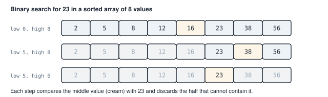
<figcaption><b>Figure 3.9</b> Binary search. Each step halves the range, so a million elements need about 20 steps.</figcaption>
</figure>

<figure class="anim">
<video class="motion" src="figures/ch03-binary-search.mp4" autoplay loop muted playsinline preload="metadata" aria-label="The array 2 5 8 12 16 23 38 56. The live range low..high is marked under it. mid is 4, holding 16, so low moves to 5. mid is 6, holding 38, so high moves to 6. mid is 5, holding 23, the target. A second search, for 20, ends when low equals high and the range is empty." data-chapters="[[0.0, &quot;find 23&quot;], [36.12, &quot;find 20&quot;]]">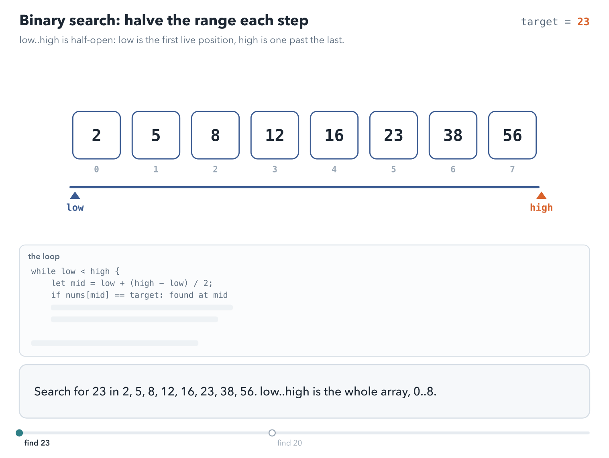</video>
<figcaption><b>Animation 3.6</b> Each comparison halves the live range <code>low..high</code>. Eight elements take three comparisons. The search for 20 ends with an empty range.</figcaption>
</figure>

The code in this section uses a **half-open range** `low..high`. `low` is the first position still in the
range, and `high` is one past the last. The range is empty when `low == high`.

### 3.10.1 Searching a rotated array

The file solves a harder version. A sorted array has been **rotated**: some elements from the front were
moved to the back, as in `[4, 5, 6, 7, 0, 1, 2]`. You still want O(log n).

The idea rests on one observation. If you split a rotated array at any middle position, at least one of the
two halves is still sorted. You can tell which by comparing its end values. Then:

- If the left half is sorted and the target lies between its first and middle values, search the left half.
- If the right half is sorted and the target lies between its middle and last values, search the right half.
- Otherwise, search the other half.

<figure>
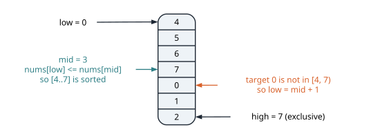
<figcaption><b>Figure 3.10</b> The first step of searching for 0. The left half 4 to 7 is sorted and cannot contain 0, so the search continues on the right.</figcaption>
</figure>

<figure class="anim">
<video class="motion" src="figures/ch03-rotated-search.mp4" autoplay loop muted playsinline preload="metadata" aria-label="The array 4, 5, 6, 7, 0, 1, 2. For target 0: mid is 7, the left half 4 to 7 is sorted and cannot hold 0, so low moves past mid. mid is 1, the left half 0 to 1 is sorted and holds 0, so high moves to mid. mid lands on 0. A second search, for 3, ends with an empty range and None." data-chapters="[[0.0, &quot;find 0&quot;], [41.04, &quot;find 3&quot;]]">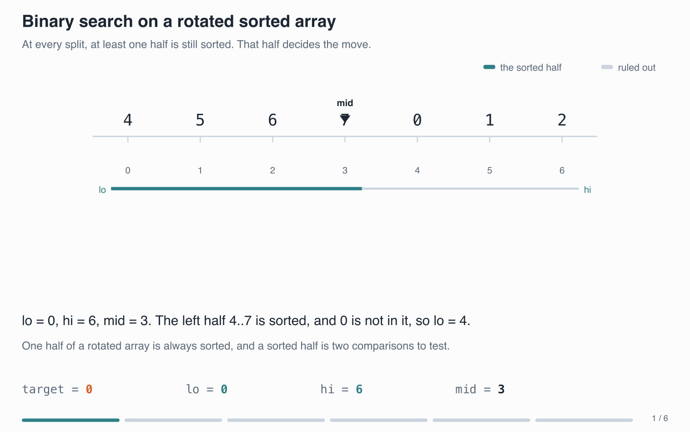</video>
<figcaption><b>Animation 3.7</b> At each step one half around <code>mid</code> is sorted. The search keeps that half only if the target lies inside its end values.</figcaption>
</figure>

<p class="listing"><b>Listing 3.12</b> Search in a rotated sorted array. <a href="https://github.com/arpanpathak/cracking-the-systems-programming-interview/blob/prep-v2/rust-interview-lab/src/problems/binary_search.rs">src/problems/binary_search.rs</a></p>

```rust
{{#include ../../rust-interview-lab/src/problems/binary_search.rs}}
```

`mid = low + (high - low) / 2` finds the middle. The shorter `(low + high) / 2` can overflow when both are
very large; this form cannot.

`nums[low] <= nums[mid]` means the left half is sorted. The test that the target is in it is
`nums[low] <= target && target < nums[mid]`. The right-half test uses `nums[high - 1]`, the last element,
because `high` itself is one past the end.

## 3.11 Rotating a square grid in place

**The problem.** Rotate an n × n grid a quarter turn clockwise, without a second grid.

**The idea.** Do it in two simple steps (figure 3.11). First **transpose** the grid. That means swapping the element at
row i, column j with the one at row j, column i. It flips the grid across its diagonal. Then reverse each
row.

<figure>
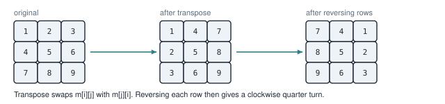
<figcaption><b>Figure 3.11</b> Transpose, then reverse each row. The result is the grid turned a quarter turn clockwise.</figcaption>
</figure>

<figure class="anim">
<video class="motion" src="figures/ch03-rotate-grid.mp4" autoplay loop muted playsinline preload="metadata" aria-label="A 3 by 3 grid of 1 to 9. Three swaps across the diagonal transpose it: 2 with 4, 3 with 7, 6 with 8. Then each row is reversed, giving 7 4 1, 8 5 2, 9 6 3. A last part starts j at 0 instead: 2 and 4 swap, then swap back, and the transpose does nothing." data-chapters="[[0.0, &quot;transpose&quot;], [22.86, &quot;reverse rows&quot;], [39.3, &quot;j from 0&quot;]]">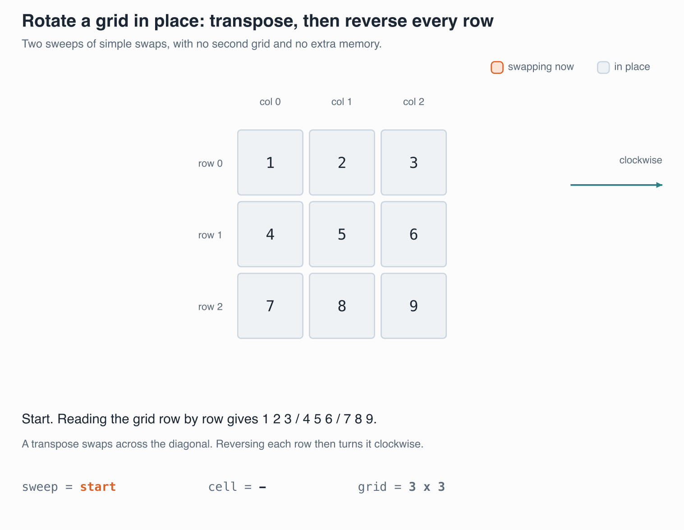</video>
<figcaption><b>Animation 3.8</b> The transpose swaps each pair above the diagonal once, then <code>row.reverse()</code> reverses each row. Starting <code>j</code> at 0 would swap every pair twice.</figcaption>
</figure>

<p class="listing"><b>Listing 3.13</b> The complete program. <a href="https://github.com/arpanpathak/cracking-the-systems-programming-interview/blob/prep-v2/rust-interview-lab/src/bin/rotate_matrix.rs">src/bin/rotate_matrix.rs</a></p>

```rust
{{#include ../../rust-interview-lab/src/bin/rotate_matrix.rs}}
```

The grid is a `Vec<Vec<i32>>`, a vector of rows. `rotate` takes it as `&mut [Vec<i32>]`, a mutable slice of rows, because it changes cells but never adds or removes a row. The transpose loop starts `j` at `i + 1`, so it visits only
the cells above the diagonal and swaps each pair once. Visiting every cell would swap each pair twice and
undo the work.

The swap uses a temporary variable `tmp`. `std::mem::swap` needs two mutable references, and
`m[i][j]` and `m[j][i]` are in different rows of the same outer vector. The borrow checker cannot see that
they do not overlap, so it would reject taking both at once.

`for row in m.iter_mut()` gives a mutable reference to each row, and `row.reverse()` reverses it.

```text
$ cargo run --bin rotate_matrix
[7, 4, 1]
[8, 5, 2]
[9, 6, 3]
```

## 3.12 Finding text inside text

**The problem.** Find the first position where a short string, the **needle**, appears in a longer one, the
**haystack**.

**The simple idea.** Try each position of the haystack, and compare the needle character by character. On
a mismatch, move one position right and start over. In the worst case this compares every needle character
at every position. For a haystack of length n and a needle of length m, that is O(n × m).

**The better idea.** Suppose a mismatch comes after several matching characters. You already know what
those characters were, because they are the start of the needle. Often a later part of them is also the start of the
needle, so you can continue from there instead of starting over. The Knuth-Morris-Pratt algorithm (KMP)
uses this. It never moves backward in the haystack, so it runs in O(n + m).

Figure 3.12 shows one such jump.

<figure>
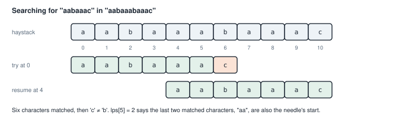
<figcaption><b>Figure 3.12</b> After six matching characters and a mismatch, the last two matched characters, <code>"aa"</code>, are also the start of the needle. The search continues with them already matched, and finds the needle at position 4.</figcaption>
</figure>

<figure class="anim">
<video class="motion" src="figures/ch03-kmp-search.mp4" autoplay loop muted playsinline preload="metadata" aria-label="The haystack aabaaabaaac above the needle aabaaac, with the lps table below. right walks the haystack and left counts matched needle characters. Six characters match, then a mismatch at haystack index 6. left falls back to lps[5] = 2 while right stays at 6, and the needle shifts so its first two characters stay matched. The needle then matches fully at position 4." data-chapters="[[0.0, &quot;match&quot;], [36.7, &quot;fall back&quot;], [79.98, &quot;found&quot;]]">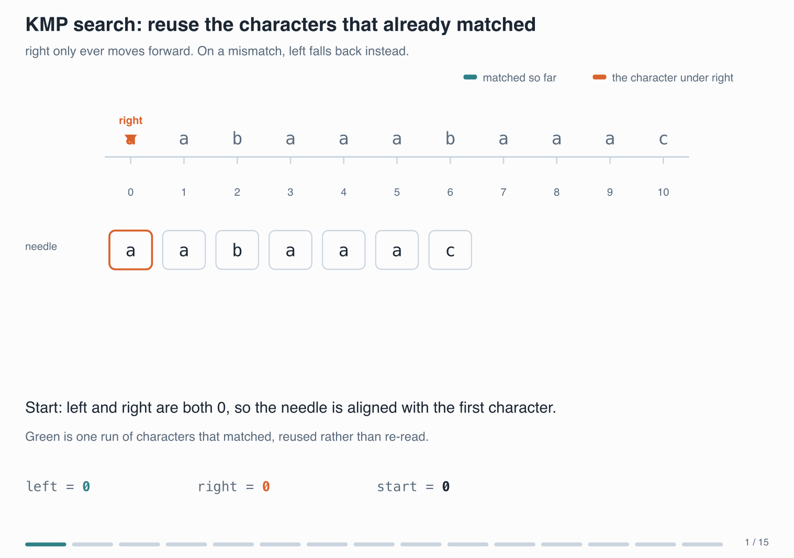</video>
<figcaption><b>Animation 3.9</b> On a mismatch, <code>left</code> falls back to <code>lps[left - 1]</code> and <code>right</code> stays where it is. The haystack is read once, from left to right.</figcaption>
</figure>

To know how far to jump, KMP first builds a table from the needle alone. For each position i, look at the piece `needle[0..=i]`. `lps[i]` is
the length of the longest part of that piece that is both its start and its end. The whole piece does not
count. The name "lps" stands for longest proper prefix that is also a suffix. For the needle in the figure:

| index | 0 | 1 | 2 | 3 | 4 | 5 | 6 |
|---|---|---|---|---|---|---|---|
| needle | a | a | b | a | a | a | c |
| lps | 0 | 1 | 0 | 1 | 2 | 2 | 0 |

For example, `lps[4] = 2`, because `"aabaa"` starts with `"aa"` and ends with `"aa"`.

<figure class="anim">
<video class="motion" src="figures/ch03-kmp-lps.mp4" autoplay loop muted playsinline preload="metadata" aria-label="The needle aabaaac with the lps row below it, filled one entry at a time. right compares needle[right] with needle[left]. A match writes lps[right] = left + 1. A mismatch with left above 0 moves left back to lps[left - 1]; a mismatch at left 0 leaves the entry at 0. The table ends as 0 1 0 1 2 2 0." data-chapters="[]">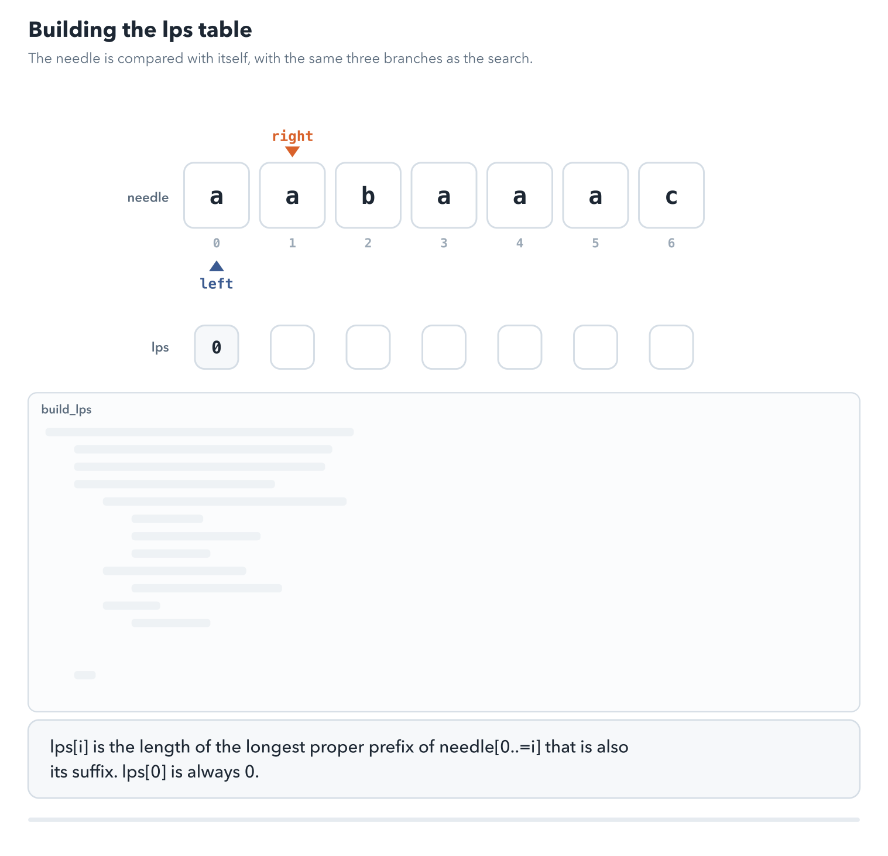</video>
<figcaption><b>Animation 3.10</b> <code>build_lps</code> compares the needle with itself, using the same three branches as the search. The table ends as <code>0 1 0 1 2 2 0</code>.</figcaption>
</figure>


<p class="listing"><b>Listing 3.14</b> The search and the table (lines 1 to 58). <a href="https://github.com/arpanpathak/cracking-the-systems-programming-interview/blob/prep-v2/rust-interview-lab/src/bin/kmp_pattern_matching.rs">src/bin/kmp_pattern_matching.rs</a></p>

```rust
{{#include ../../rust-interview-lab/src/bin/kmp_pattern_matching.rs:1:58}}
    // ...
}
```

`str_str` works on bytes, from `as_bytes()`, so it can index directly. `left` counts how many needle
characters currently match, and `right` walks the haystack. Each pass of the loop takes one of three
branches:

1. The characters match: advance both.
2. They do not match, but some characters had matched: jump `left` back to `lps[left - 1]`, keeping `right`
   where it is.
3. They do not match and nothing had matched: advance `right`.

When `left` reaches the needle's length, the needle starts at `right - left`.

`build_lps` runs the same three-branch loop, comparing the needle against itself. Both loops only move
forward, which gives the O(n + m) total.

<p class="listing"><b>Listing 3.15</b> The complete program. <a href="https://github.com/arpanpathak/cracking-the-systems-programming-interview/blob/prep-v2/rust-interview-lab/src/bin/kmp_pattern_matching.rs">src/bin/kmp_pattern_matching.rs</a></p>

```rust
{{#include ../../rust-interview-lab/src/bin/kmp_pattern_matching.rs}}
```

```text
$ cargo run --bin kmp_pattern_matching
str_str("sadbutsad", "sad") = 0

str_str("leetcode", "leeto") = -1

str_str("aabaaabaaac", "aabaaac") = 4

str_str("hello", "") = 0
```

The function returns -1 when the needle is absent, following the convention of the problem it solves. In
your own code, `Option<usize>` states that more clearly. For everyday searching, the standard library's
`str::find` is also linear time.

## 3.13 The complete files

The sections above showed these files in excerpts. Here each one is whole.

<p class="listing"><b>Listing 3.16</b> Merging overlapping intervals, with its tests. <a href="https://github.com/arpanpathak/cracking-the-systems-programming-interview/blob/prep-v2/rust-interview-lab/src/problems/merge_intervals.rs">src/problems/merge_intervals.rs</a></p>

```rust
{{#include ../../rust-interview-lab/src/problems/merge_intervals.rs}}
```

<div class="summary" markdown="1">

## Summary

- Big-O notation describes how running time or memory grows with the input size, keeping only the fastest
  growing part.
- A `Vec` stores its elements next to each other on the heap, so indexing is O(1). Pushing is amortized O(1)
  because the capacity doubles when it runs out.
- A `String` is UTF-8 bytes. `len()` counts bytes, and `chars()` walks characters.
- A `HashMap` hashes each key to a bucket, so `get` and `insert` are O(1) on average.
- A hash map turns "have I seen the partner?" into one step (Two Sum).
- A vector used as a stack tracks unmatched openers (brackets) and running minimums (Min Stack).
- Two indexes moving toward each other reverse a string or search a sorted array for sums in O(n) per pass.
- A sliding window with a map of last positions finds the longest run without repeats in O(n).
- Sorting first lets one pass merge overlapping ranges.
- Binary search halves the range each step, O(log n), and still works on a rotated sorted array.
- KMP reuses matched characters, so text search takes O(n + m).

</div>

This chapter used iterators such as `iter()` and `enumerate()` without much comment. Chapter 4 looks at them
closely, along with the references they hand you and the lifetimes that keep those references valid.

## Exercises

1. Change `two_sum` to use `i64` arithmetic so that it cannot overflow, and add a test with `i32::MIN`.
2. Fix `is_valid` so that characters other than brackets are rejected, and add a test for `"a"`.
3. Make `reverse_str` handle an empty string, then write a version that reverses the characters of any
   UTF-8 string, including `"café"`.
4. Write a plain binary search over a sorted slice that returns `Option<usize>`, and test it on arrays of
   length 0, 1, and 2.
5. Rotate the grid counterclockwise instead, using a transpose and one other reversal.
