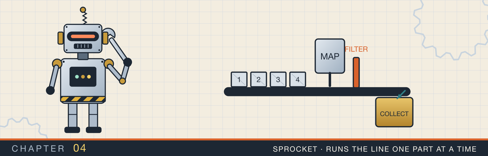
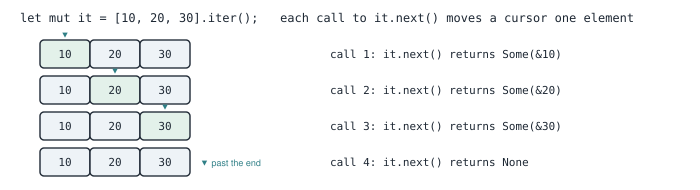
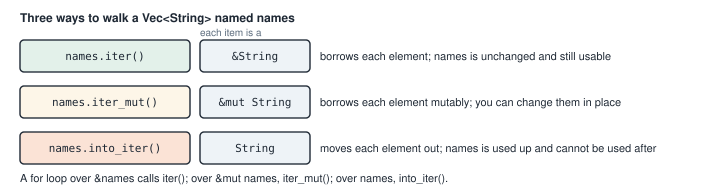
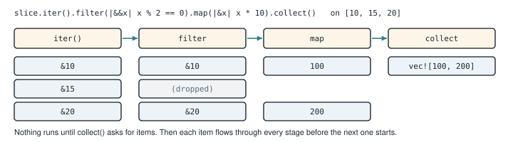
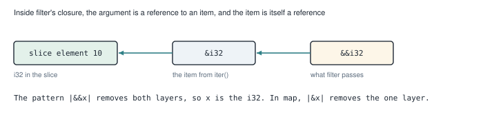
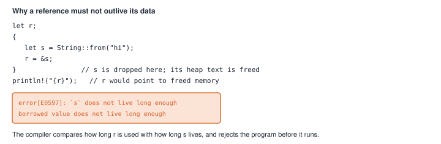
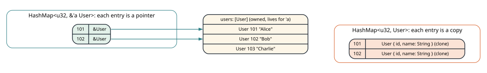
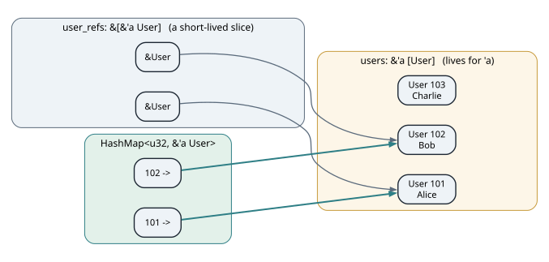

# Iterators and references

<div class="covers" markdown="1">

This chapter covers

- What an iterator is, and what a `for` loop does with one
- The three ways to walk a collection: by reference, by mutable reference, and by value
- Chaining `filter`, `map`, and `collect`, and why nothing runs until `collect`
- Why a closure sometimes receives `&&i32`, and how patterns like `|&&x|` remove the references
- Lifetimes: what they are, why the compiler needs them, and how to read `'a` in a signature
- Building a map that stores references instead of copies

</div>

Chapter 3 used iterators and references in almost every listing: `nums.iter().enumerate()`,
`s.chars()`, `seen.get(&key)`. I explained each use briefly and moved on. This chapter slows down and
looks at them properly, because every later chapter depends on them.

The chapter has two halves. The first half is about iterators: what they are, how a `for` loop uses them,
and how to chain them. The second half is about references and lifetimes. A **lifetime** is the part of a
program during which a reference is guaranteed to point to valid data. You will see why Rust needs them,
how to read them, and how to write a function whose signature uses one.

Both halves meet in one short program. It turns a list of users into a map from each user's ID to that
user, without copying any user.

## 4.1 What an iterator is

An **iterator** is a value that hands out items one at a time. It has one required method, `next`, which
returns `Some(item)` while there are items left and `None` when there are none.

You can think of an iterator over a slice as a cursor that starts before the first element. Each call to
`next` returns the element under the cursor and moves the cursor one step (figure 4.1).

<figure>

<figcaption><b>Figure 4.1</b> An iterator over <code>[10, 20, 30]</code>. Each call to <code>next</code> returns one item. After the last item, it returns <code>None</code>.</figcaption>
</figure>

You rarely call `next` yourself. A `for` loop calls it for you. This loop:

```rust
for x in [10, 20, 30].iter() {
    println!("{x}");
}
```

does the same as this:

```rust
let mut it = [10, 20, 30].iter();
while let Some(x) = it.next() {
    println!("{x}");
}
```

`while let Some(x) = it.next()` keeps looping as long as `next` returns `Some`, and binds the item to `x`.
Section 2.8 used this form directly, because it needed to call `next` inside the loop body.

## 4.2 Three ways to walk a collection

A `Vec<String>` owns its strings. When you walk it, you have to decide what you get for each element: a
shared reference, a mutable reference, or the string itself. Each choice has its own method (figure 4.2).

<figure>

<figcaption><b>Figure 4.2</b> The three iteration methods and the item type each one yields.</figcaption>
</figure>

- `iter()` gives `&T`, a shared reference to each element. You can read the elements, and the collection
  is unchanged afterward.
- `iter_mut()` gives `&mut T`. You can change each element in place.
- `into_iter()` gives `T`, the element itself. The collection is moved into the iterator, so you cannot use
  it afterward.

A `for` loop chooses for you based on what you write after `in`. `for x in &names` means `names.iter()`.
`for x in &mut names` means `names.iter_mut()`. `for x in names` means `names.into_iter()`, and `names` is
gone after the loop.

<div class="callout tip" markdown="1">

**TIP:** When you are not sure which one you have, look at the item type the compiler reports. A
deliberate type error such as `let () = x;` inside the loop makes the compiler print the type of `x`.

</div>

## 4.3 Chaining iterators

An **iterator adapter** is a method that takes one iterator and returns another. `filter` keeps only the
items for which a closure returns `true`. `map` replaces each item with the closure's result. `collect`
is different: it runs the whole chain and gathers the items into a collection, such as a `Vec`.

Figure 4.3 follows three numbers through a chain.

<figure>

<figcaption><b>Figure 4.3</b> Items flow through the chain one at a time. The odd number 15 stops at <code>filter</code>.</figcaption>
</figure>

Adapters are **lazy**. `iter().filter(...).map(...)` only builds a description of the work. Nothing happens
until something asks for items, as `collect` or a `for` loop does. Then each item goes through every stage
before the next item starts. No temporary vector is created between stages.

Animation 4.1 runs `functional_numbers_drill` from listing 4.1 on `[10, 15, 20, 25, 30]`. The requests go
backward, from `collect` toward the slice, and the items come forward one at a time.

<figure class="anim">
<video class="motion" src="figures/ch04-lazy-chain.mp4" autoplay loop muted playsinline preload="metadata" aria-label="Four stages in a row, iter, filter, map, and collect, above the input 10, 15, 20, 25, 30. collect sends next() back through map and filter to iter. The item &10 comes forward, passes filter, becomes 100 in map, and collect stores it. Then &15 comes forward and filter drops it, because it is odd, and asks for the next item at once. 20 and 30 pass, and the result is 100, 200, 300, built in one pass. In a last run collect is removed: no next() is ever called, filter and map never run, and the compiler warns that the Map is unused." data-chapters="[[0.0, &quot;pull&quot;], [12.46, &quot;one at a time&quot;], [32.64, &quot;no collect&quot;]]"></video>
<figcaption><b>Animation 4.1</b> <code>collect</code> pulls items through the chain one at a time. Without a consumer, no item is ever asked for, and the chain does nothing.</figcaption>
</figure>

<div class="callout warning" markdown="1">

**WARNING:** Because adapters are lazy, a chain that ends without `collect`, a `for` loop, or another method
that consumes it does nothing at all. The compiler warns about such a chain: "unused `Map` that must be used".

</div>

## 4.4 References to references

Look closely at the chain in figure 4.3. `slice.iter()` yields items of type `&i32`. `filter` passes its
closure a reference to each item, so that the closure can look at the item without taking it. So the
closure receives `&&i32`: a reference to a reference to an `i32` (figure 4.4).

<figure>

<figcaption><b>Figure 4.4</b> The two layers of reference inside <code>filter</code>'s closure.</figcaption>
</figure>

A closure's parameter can be a pattern, the same as the left side of a `let`. The pattern `&x` matches a
reference and binds `x` to what it points to. So:

- `.filter(|&&x| x % 2 == 0)` removes both layers. Inside the closure, `x` is an `i32`.
- `.map(|&x| x * 10)` removes the one layer that `map` gives. `map` passes the item itself, not a reference
  to it.

This works for `i32` because `i32` is `Copy`: removing the reference copies the number. A `String` is not
`Copy`. For it, a pattern like `|&s|` would try to move the value out of a reference, and the compiler
rejects that. You would write `|s|` and use `s` as a reference instead.

## 4.5 The same work in two styles

The program for this chapter starts with a small `User` type and two functions that do similar work in two
styles.

<p class="listing"><b>Listing 4.1</b> The <code>User</code> type and two ways to transform a slice (lines 1 to 23). <a href="https://github.com/arpanpathak/cracking-the-systems-programming-interview/blob/prep-v2/rust-interview-lab/src/bin/lifetime_reference_drill.rs">src/bin/lifetime_reference_drill.rs</a></p>

```rust
{{#include ../../rust-interview-lab/src/bin/lifetime_reference_drill.rs:1:23}}
```

`functional_numbers_drill` is the chain from figure 4.3. `collect()` knows to build a `Vec<i32>` because
that is the function's return type. When the type is not clear from context, you write it, as in
`collect::<Vec<i32>>()`.

`imperative_numbers_map` uses a `for` loop and builds a `HashMap` from each number to that number times
100. `for &num in slice` removes the one reference that iterating a slice gives, so `num` is an `i32`.

Neither style is faster. Both compile to similar machine code. Iterator chains read well when the work is a
sequence of steps. Loops read well when the body does several unrelated things.

With iterators covered, the rest of the chapter turns to the references they hand out, and to the rules
that keep those references safe.

## 4.6 Lifetimes

A reference points to data owned by something else. If the owner is dropped while the reference is still
in use, the reference points to freed memory. Reading through it would give garbage or crash the program.
Figure 4.5 shows the smallest example.

<figure>

<figcaption><b>Figure 4.5</b> A reference that would outlive its data. The compiler rejects this program.</figcaption>
</figure>

To prevent this, the compiler tracks, for every reference, the part of the program where it is used. It
also knows where each value is dropped. If a reference is used after its value is dropped, the program does
not compile. The part of the program where a reference is valid is its lifetime.

Inside one function, the compiler works out all lifetimes on its own. Across function calls it needs help.
Consider a function that takes a reference and returns one:

```rust
fn first_word(s: &str) -> &str { ... }
```

The caller needs to know how long the returned reference is valid. Here the only possible answer is "as
long as `s`", and the compiler assumes that without being told. These assumptions are called **lifetime
elision rules**. For a function with one reference parameter, the returned reference gets that parameter's
lifetime.

When the rules cannot decide, or when you want to state a relationship yourself, you name lifetimes. A
lifetime name is an apostrophe and a short name, usually `'a`. You declare it in angle brackets after the
function name, like a generic type, and then attach it to references:

```rust
fn longest<'a>(x: &'a str, y: &'a str) -> &'a str { ... }
```

Read this as: "for some lifetime `'a`, both inputs are valid for `'a`, and so is the output". The compiler
then checks every caller. The returned reference may not be used after either input's data is dropped.

A lifetime annotation does not change how long anything lives. It describes a relationship, and the
compiler checks that the code keeps it.

## 4.7 A map that points into a slice

Now you have what you need to read the main functions of the program. The goal is to index a list of users
by ID. You could copy each user into a `HashMap<u32, User>`. Or you could store only a reference to each
user, in a `HashMap<u32, &User>`, and leave the users where they are. Figure 4.6 compares the two.

<figure>

<figcaption><b>Figure 4.6</b> A map of copies duplicates every user and its name. A map of references stores one pointer per entry, and depends on the original array staying alive.</figcaption>
</figure>

The map of references is cheaper. It also depends on the users staying alive while the map is used. The
function's signature states that dependency with a lifetime.

<p class="listing"><b>Listing 4.2</b> A map whose values point into the slice (lines 27 to 33).</p>

```rust
{{#include ../../rust-interview-lab/src/bin/lifetime_reference_drill.rs:27:33}}
```

Read the signature the way section 4.6 showed. For some lifetime `'a`, the input is a slice of users valid
for `'a`. The output is a map whose values are references valid for `'a`. Because both mention the same
`'a`, the map may not be used after the users are dropped. If you tried, the compiler would reject the
program with the same error as figure 4.5.

Inside the function, `for user in slice` walks the slice by reference, so `user` is a `&User`. The map
stores that reference. No `User` is cloned.

## 4.8 Two lifetimes in one type

The second function takes a different input. Instead of a slice of users, it takes a slice of references to
users.

<p class="listing"><b>Listing 4.3</b> A map built from a slice of references (lines 35 to 41).</p>

```rust
{{#include ../../rust-interview-lab/src/bin/lifetime_reference_drill.rs:35:41}}
```

The type `&[&'a User]` has two references in it:

- The outer `&` is the slice itself, a short list of pointers. Its lifetime has no name here.
- The inner `&'a User` is each pointer in the list. Its lifetime `'a` belongs to the users those pointers
  point to.

The returned map mentions only `'a`. So the map depends on the users, not on the list of pointers. The list
can be dropped right after the call, and the map stays valid (figure 4.7).

<figure>

<figcaption><b>Figure 4.7</b> The map copies the pointers out of the short-lived slice. It points at the users directly, so only the users must stay alive.</figcaption>
</figure>

`for &user in slice` copies each pointer out of the slice. A reference is a `Copy` value, one machine word, so
this copy is cheap.

## 4.9 The complete program

<p class="listing"><b>Listing 4.4</b> The complete program. <a href="https://github.com/arpanpathak/cracking-the-systems-programming-interview/blob/prep-v2/rust-interview-lab/src/bin/lifetime_reference_drill.rs">src/bin/lifetime_reference_drill.rs</a></p>

```rust
{{#include ../../rust-interview-lab/src/bin/lifetime_reference_drill.rs}}
```

`main` starts with one more iterator chain. `vv.iter()` yields `&i32`, and `filter` receives `&&i32`. This
closure writes `|x|` and then `*x % 2`. The `*` removes one layer of reference, and the `%` operator works
through the other. `.copied()` turns each `&i32` into an `i32`, so `collect` builds a `Vec<i32>`.

Two lines in `main` use a rule you have not seen yet:

```rust
let users: &[User] = &[ User { ... }, User { ... }, User { ... } ];
```

`&[ ... ]` takes a reference to an array that was never given a name of its own. Such a value is a
**temporary**, and a temporary is normally dropped at the end of the statement. That would leave `users`
pointing to freed memory. Rust extends the temporary's life to the end of the enclosing block when it is the
direct value of a `let`. This is called **temporary lifetime extension**. It is why `users` and `user_refs`
stay valid for the rest of `main`.

Run the program:

```text
$ cargo run --bin lifetime_reference_drill
Filtered : [2, 4, 6]
--- Ultra-Lean Inline Slice Drill ---

1. Functional Numbers (Even * 10): [100, 200, 300]
2. Imperative Numbers Map: {20: 2000, 10: 1000, 25: 2500, 15: 1500, 30: 3000}

3. Zero-Allocation Struct Map (From &[User]):
   Key ID: 101 -> Value Name: Alice
   Key ID: 102 -> Value Name: Bob
   Key ID: 103 -> Value Name: Charlie

4. Zero-Allocation Ref Slice Map (From &[&User]):
   Key ID: 102 -> Value Name: Bob
   Key ID: 101 -> Value Name: Alice

--- Drill Completed Successfully! ---
```

Run it again and the map lines may come out in a different order. As section 3.4 explained, `HashMap` uses a
randomly seeded hash, so its iteration order is not fixed. When you need a stable order, use a `BTreeMap`,
which keeps its keys sorted, or sort the keys before printing.

<div class="summary" markdown="1">

## Summary

- An iterator hands out items through `next`, which returns `Some(item)` or `None`. A `for` loop calls
  `next` until it gets `None`.
- `iter()` yields `&T`, `iter_mut()` yields `&mut T`, and `into_iter()` yields `T` and uses up the
  collection.
- Adapters such as `filter` and `map` are lazy. `collect` or a loop drives them, one item at a time.
- `filter` passes a reference to each item, so over `iter()` its closure receives `&&T`. Patterns like
  `|&&x|` remove the references for `Copy` types.
- A lifetime is the part of the program where a reference is valid. The compiler rejects a reference used
  after its data is dropped.
- `'a` in a signature names a lifetime and ties inputs to outputs. It describes a relationship; it does not
  change how long anything lives.
- A `HashMap<u32, &'a User>` indexes data without copying it, and cannot outlive that data.

</div>

Chapter 5 uses iterators and collections to solve problems with heaps and sorted collections, such as
finding the most frequent words in a text.

## Exercises

1. Rewrite `imperative_numbers_map` as an iterator chain that ends in `collect::<HashMap<_, _>>()`.
2. Write `fn longest<'a>(x: &'a str, y: &'a str) -> &'a str`. Then write a `main` where calling it and
   using the result fails to compile, and read the error.
3. Change `struct_slice_to_map` to return a `BTreeMap`, and check that the output order is now stable.
4. Write a function that takes `&mut [User]` and uses `iter_mut()` to append " (admin)" to every name.
