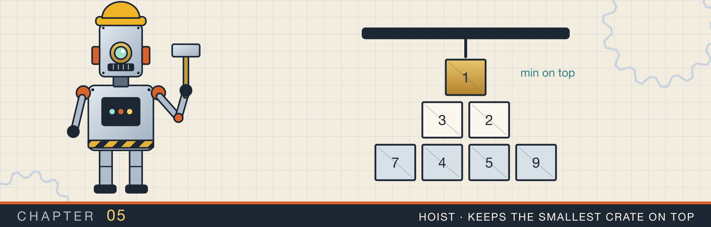
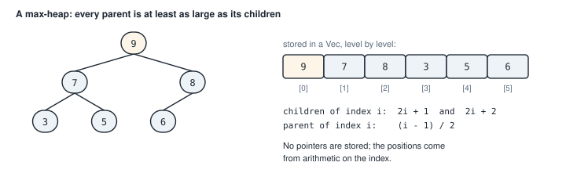
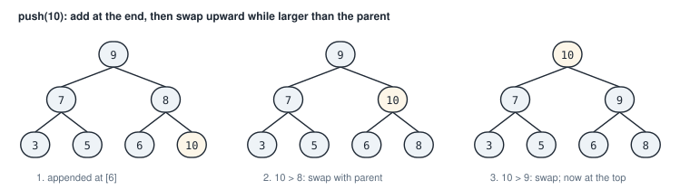
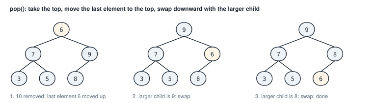
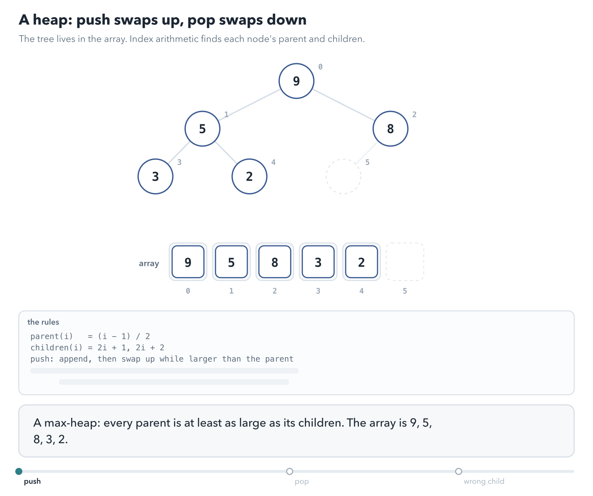
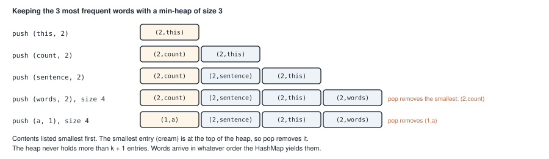
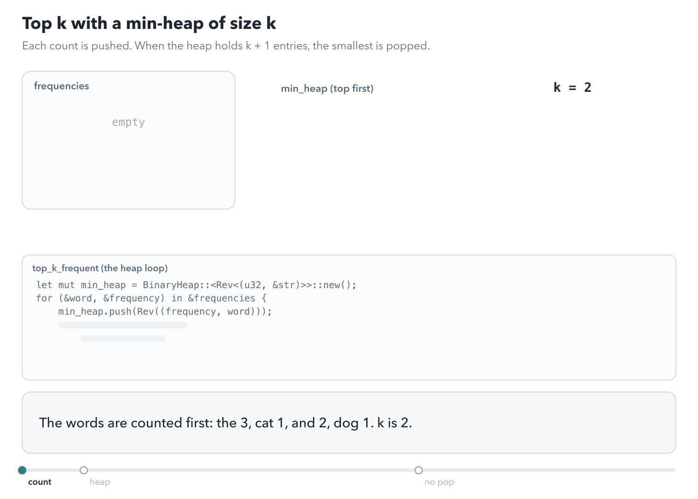
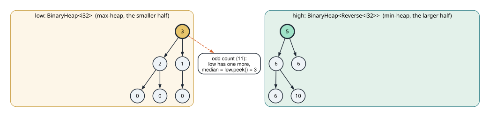

# Heaps

<div class="covers" markdown="1">

This chapter covers

- What a heap is, and how it stores a tree inside a `Vec`
- How `push` and `pop` keep the largest item on top in O(log n) steps
- Rust's `BinaryHeap`, and turning it into a min-heap with `Reverse`
- How tuples compare, and why `(count, value)` orders items by count
- Finding the k most frequent items, first with a full heap and then with a heap of size k
- Keeping the median of a stream of numbers with two heaps

</div>

Chapter 3 used vectors, strings, and hash maps. This chapter adds one more collection, the heap. A heap
answers one question quickly: "what is the largest item right now?" It keeps answering it while items are
added and removed.

That question comes up whenever you want the best few items from many. Two examples are the most frequent
words in a text and the next job to run from a queue ordered by priority. You will build three programs. Two find
the most frequent items. The third keeps the median of a stream of numbers.

As in chapter 3, I start with how the structure works, with pictures, and then show the code.

A few terms used throughout the chapter:

- A **binary tree** is a set of nodes where each node has at most two children, a left one and a right one.
  The node with no parent is the **root**.
- A **max-heap** is a binary tree where every parent is at least as large as each of its children. So the
  root holds the largest item.
- A **min-heap** is the same with "at least as large" replaced by "at most as large". The root holds the
  smallest item.
- The **median** of a list of numbers is the middle value once they are sorted. For an even count, it is
  the average of the two middle values.

## 5.1 A tree stored in a vector

A heap is a tree, but it does not store pointers between nodes. It stores the nodes in a `Vec`, level by
level: the root first, then its two children, then their four children, and so on. Figure 5.1 shows a
max-heap of six numbers and the vector that holds it.

<figure>

<figcaption><b>Figure 5.1</b> A max-heap and its vector. The children of the node at index i are at 2i + 1 and 2i + 2.</figcaption>
</figure>

Because the nodes are packed level by level, simple arithmetic finds a node's relatives. The children of index i are at 2i + 1 and 2i + 2. Its parent is at (i − 1) / 2, rounded down. In figure 5.1, the
children of 7 (index 1) are at indexes 3 and 4, which hold 3 and 5.

The heap rule only compares parents with children. It says nothing about brothers or cousins. In figure
5.1, 7 is on the left and 8 on the right, and that is allowed. That weak rule keeps a heap cheap to
maintain.

A tree with n nodes packed this way has about log₂ n levels. A heap of a million items is only about 20
levels deep.

## 5.2 Adding and removing

### 5.2.1 Push

To add an item, put it at the end of the vector, which is the next free spot on the bottom level. It may be
larger than its parent, which breaks the rule. So swap it with its parent, and keep swapping upward until it
is not larger than its parent, or it reaches the root. Figure 5.2 pushes 10.

<figure>

<figcaption><b>Figure 5.2</b> Pushing 10. It moves up one level per swap until the rule holds again.</figcaption>
</figure>

Each swap moves the item one level up, and there are about log₂ n levels. So a push takes O(log n) steps.

### 5.2.2 Pop

To remove the largest item, take the root. That leaves a hole at the top. Fill it with the last item in the
vector, which shrinks the vector by one. The moved item is probably too small for the top. So swap it with its larger child, and keep swapping
downward until both its children are smaller. Figure 5.3 pops the 10
that figure 5.2 added.

<figure>

<figcaption><b>Figure 5.3</b> Popping the largest item. The item moved to the top sinks one level per swap.</figcaption>
</figure>

It swaps with the larger child for a reason. That child is about to become the parent of the other one,
and a parent must be at least as large as its children. Pop is also O(log n).

Looking at the largest item without removing it is O(1): it is always at index 0.

<figure class="anim">
<video class="motion" src="figures/ch05-heap-sift.mp4" autoplay loop muted playsinline preload="metadata" aria-label="A max-heap 9, 5, 8, 3, 2 drawn as a tree above its array. push(10) appends 10 at index 5; it swaps with its parent 8 at index 2, then with 9 at the root. pop() takes 10 from the root, moves the last value 8 into the root, and 8 swaps with its larger child 9. A last part swaps 8 with the smaller child 5 instead, and 5 ends up as the parent of 9." data-chapters="[[0.0, &quot;push&quot;], [34.32, &quot;pop&quot;], [55.74, &quot;wrong child&quot;]]"></video>
<figcaption><b>Animation 5.1</b> A push appends and swaps up; a pop moves the last value to the root and swaps it down with the larger child. Each value moves in the tree and in the array at the same time. The last part swaps with the smaller child and breaks the heap rule.</figcaption>
</figure>


## 5.3 Heaps in Rust

Rust's standard library provides `std::collections::BinaryHeap<T>`, a max-heap. Its main methods match the
operations above:

| Method | What it does | Cost |
|---|---|---|
| `push(x)` | adds `x` | O(log n) |
| `pop()` | removes and returns the largest item, as an `Option` | O(log n) |
| `peek()` | returns a reference to the largest item, as an `Option` | O(1) |
| `len()` | the number of items | O(1) |
| `into_sorted_vec()` | consumes the heap and returns its items in ascending order | O(n log n) |

To decide which item is larger, `BinaryHeap` uses the `Ord` trait, which types such as `i32`, `String`, and
tuples implement.

### 5.3.1 How tuples compare

Tuples compare element by element, from the left. Two tuples are compared on their first elements, and
only if those are equal does the second element decide. So `(3, 1) > (2, 9)`, because 3 > 2, and the 9 is
never looked at. And `(3, 1) < (3, 2)`, because the first elements tie and 1 < 2.

This gives a way to choose what a heap orders by: put that field first in a tuple. A heap of
`(count, value)` pairs orders by count, and breaks ties by value.

### 5.3.2 A min-heap with `Reverse`

`BinaryHeap` has no min-heap mode. Instead, the standard library provides a wrapper,
`std::cmp::Reverse<T>`, whose comparison is the opposite of `T`'s. `Reverse(3) > Reverse(5)`, because 3 < 5.
So a `BinaryHeap<Reverse<i32>>` keeps the smallest number on top.

To put a value in, wrap it: `heap.push(Reverse(x))`. To get it out, unwrap it with a pattern:
`if let Some(Reverse(x)) = heap.pop()`.

Now you can read the three programs.

## 5.4 The k most frequent numbers

**The problem.** Given a list of numbers and a count k, return the k numbers that occur most often. For
`[1, 1, 1, 2, 2, 3]` and k = 2, the answer is 1 and 2.

**The idea.** Count each number with a `HashMap`. Put every `(count, number)` pair into a max-heap. Pop k
times.

<p class="listing"><b>Listing 5.1</b> Top k with a full heap. <a href="https://github.com/arpanpathak/cracking-the-systems-programming-interview/blob/prep-v2/rust-interview-lab/src/problems/top_k_frequent.rs">src/problems/top_k_frequent.rs</a></p>

```rust
{{#include ../../rust-interview-lab/src/problems/top_k_frequent.rs}}
```

Step through it:

1. `*counts.entry(num).or_insert(0) += 1;` counts one occurrence. `entry(num)` finds the map slot for `num`,
   and `or_insert(0)` creates it with 0 if it is missing. Both steps return a mutable reference to the
   count, and `*` followed by `+= 1` adds one to the value it points to.
2. `counts.into_iter().map(|(num, count)| (count, num)).collect()` turns each map entry around, so the count
   comes first, and collects the pairs straight into a `BinaryHeap`. A `BinaryHeap` can be built with
   `collect` like a `Vec`.
3. The `while` loop pops until it has k numbers. If there are fewer than k distinct numbers, `pop` returns
   `None` and the loop stops early. The second test checks that case.

Counting takes O(n). Building the heap from u distinct numbers takes O(u), and k pops take O(k log u).

The first test sorts the result before comparing it. The order of numbers with equal counts depends on the map's iteration order. That order changes between
runs, so a test must not depend on it.

## 5.5 The k most frequent words, with a heap of size k

The first version puts every distinct number in the heap. If the input has millions of distinct words and
you only want the top 3, most of that heap is wasted. The second version never lets the heap grow past k + 1
entries.

**The idea.** Use a min-heap. Push each `(count, word)` pair. Whenever the heap has more than k entries, pop
once. A min-heap pops its smallest entry, which is the least frequent word seen so far, so the k most
frequent words survive (figure 5.4).

<figure>

<figcaption><b>Figure 5.4</b> A min-heap bounded to k = 3 entries. Each time a fourth entry arrives, the smallest is removed.</figcaption>
</figure>

The program first turns the text into words, then counts them, then runs the bounded heap.

<figure class="anim">
<video class="motion" src="figures/ch05-top-k.mp4" autoplay loop muted playsinline preload="metadata" aria-label="Word counts the 3, cat 1, and 2, dog 1, and a min-heap with k = 2. Each count is pushed. When the heap holds three entries, pop removes the top, the smallest count. The heap ends with (2, and) and (3, the). Last, without the pop, the heap keeps all four words, and taking two from its top gives cat and dog, the least frequent." data-chapters="[[0.0, &quot;count&quot;], [8.16, &quot;heap&quot;], [52.48, &quot;no pop&quot;]]"></video>
<figcaption><b>Animation 5.2</b> The bounded heap from listing 5.2 with k = 2. The top of the heap is the least frequent word kept, and it is popped whenever the heap holds k + 1 entries.</figcaption>
</figure>


<p class="listing"><b>Listing 5.2</b> The function (lines 1 to 41). <a href="https://github.com/arpanpathak/cracking-the-systems-programming-interview/blob/prep-v2/rust-interview-lab/src/bin/top_k_frequent_words.rs">src/bin/top_k_frequent_words.rs</a></p>

```rust
{{#include ../../rust-interview-lab/src/bin/top_k_frequent_words.rs:1:41}}
```

**Turning text into words.** The chain splits on whitespace. Then it trims characters that are not letters
or digits from both ends of each piece, so `"sentence."` becomes `"sentence"`. It drops empty pieces, which a
lone punctuation mark leaves behind, and lowercases each word. `trim_matches` takes a closure that decides
which characters to trim. `map(str::to_lowercase)` passes a function by name instead of writing a closure.

**Counting without copying.** The map is `HashMap<&str, u32>`. Its keys are references into the `words`
vector, so counting allocates nothing for each occurrence. `or_default()` inserts the type's default value,
0 for `u32`, when the key is missing.

**The bounded heap.** `use std::cmp::Reverse as Rev;` gives `Reverse` a shorter name. Each entry is
`Rev((frequency, word))`, so the heap's top is the smallest `(frequency, word)` pair. After each push, if
the heap has more than k entries, one pop removes that smallest pair.

**The result.** `into_sorted_vec()` returns the entries in ascending order of `Rev`, which is descending
order of frequency. The final `map` unwraps each `Rev` with a pattern and copies the word into an owned `String`. The result
must not borrow from `words`, because `words` is dropped when the function returns.

The heap holds at most k + 1 entries, so each push and pop costs O(log k). For u distinct words, the heap
work is O(u log k) instead of O(u log u), and its memory is O(k) instead of O(u).

### 5.5.1 The complete program

<p class="listing"><b>Listing 5.3</b> The complete program, with its tests. <a href="https://github.com/arpanpathak/cracking-the-systems-programming-interview/blob/prep-v2/rust-interview-lab/src/bin/top_k_frequent_words.rs">src/bin/top_k_frequent_words.rs</a></p>

```rust
{{#include ../../rust-interview-lab/src/bin/top_k_frequent_words.rs}}
```

The sentence in `main` is a **raw string literal**, written `r"..."`. A raw string treats backslashes as
ordinary characters, and this one also spans several lines. The tests cover the basic case, uppercase and
punctuation, a k larger than the number of words, and an empty input.

```text
$ cargo run --bin top_k_frequent_words
Top 3 frequency [(word, frequency)] :
 [
    (
        "words",
        2,
    ),
    (
        "this",
        2,
    ),
    (
        "sentence",
        2,
    ),
]
```

Four words occur twice in the sentence: "this", "sentence", "count", and "words". Only three fit, and
"count" was evicted. When two entries have the same count, the tuple comparison falls to the word, and the
min-heap evicts the alphabetically smallest one. So among equal counts, this version keeps the words that
come last in alphabetical order.

<div class="callout tip" markdown="1">

**TIP:** To keep the alphabetically first words instead, push `Rev((frequency, Reverse(word)))`. The inner
`Reverse` flips the order of words only. Among equal counts, the alphabetically last word then has the
smallest key and is evicted first.

</div>

## 5.6 The median of a stream

**The problem.** Numbers arrive one at a time. After each one, report the median of all the numbers so far.

**The simple idea.** Keep every number in a sorted `Vec`, and read the middle. Inserting into the middle of a
sorted vector shifts the elements after it, which costs O(n) per number.

**The idea with heaps.** Split the numbers into two halves (figure 5.5):

- `low`, a max-heap holding the smaller half. Its top is the largest of the small numbers.
- `high`, a min-heap holding the larger half. Its top is the smallest of the large numbers.

Keep two rules. Every number in `low` is at most every number in `high`. And `low` has either the same
number of items as `high`, or one more. Then the median is always at the tops. With an odd count, it is the
top of `low`. With an even count, it is the average of the two tops.

<figure>

<figcaption><b>Figure 5.5</b> The two heaps after all eleven sample values. <code>low</code> has six values and <code>high</code> five, so the median is 3, the top of <code>low</code>.</figcaption>
</figure>

### 5.6.1 Adding a number

<p class="listing"><b>Listing 5.4</b> The structure and <code>add_num</code> (lines 1 to 27). <a href="https://github.com/arpanpathak/cracking-the-systems-programming-interview/blob/prep-v2/rust-interview-lab/src/bin/median_finder.rs">src/bin/median_finder.rs</a></p>

```rust
{{#include ../../rust-interview-lab/src/bin/median_finder.rs:1:7}}

impl MedianFinder {
{{#include ../../rust-interview-lab/src/bin/median_finder.rs:10:26}}
    // ...
}
```

`add_num` keeps both rules with three moves, and never compares numbers itself:

1. Push the new number into `low`.
2. Pop the largest number from `low` and push it into `high`. This keeps the first rule: whatever `high`
   receives is at least as large as everything left in `low`.
3. If `high` now has more items than `low`, pop its smallest and push it back into `low`. This keeps the
   second rule.

Trace the first three numbers of the sample, 6, 10, and 2:

| Add | After step 1 (`low`) | After step 2 (`low` / `high`) | After step 3 (`low` / `high`) | Median |
|---|---|---|---|---|
| 6 | {6} | {} / {6} | {6} / {} | 6 |
| 10 | {6, 10} | {6} / {10} | {6} / {10} | (6 + 10) / 2 = 8 |
| 2 | {2, 6} | {2} / {6, 10} | {2, 6} / {10} | 6 |

Each move is one heap operation, so adding a number is O(log n).

### 5.6.2 Reading the median

<p class="listing"><b>Listing 5.5</b> <code>find_median</code> (lines 28 to 37).</p>

```rust
impl MedianFinder {
    // ...
{{#include ../../rust-interview-lab/src/bin/median_finder.rs:28:37}}
}
```

`*self.low.peek()?` reads the top of `low`. The `?` works on `Option` the same way it works on `Result`. If no number has been added, `peek` returns
`None`, and so does the function. The function returns
`Option<f64>`, a floating-point number, because the average of two integers can be a half.

`let Reverse(min_high) = *self.high.peek()?;` unwraps the `Reverse` in the `let` pattern itself.

### 5.6.3 The complete program

<p class="listing"><b>Listing 5.6</b> The complete program, with its tests. <a href="https://github.com/arpanpathak/cracking-the-systems-programming-interview/blob/prep-v2/rust-interview-lab/src/bin/median_finder.rs">src/bin/median_finder.rs</a></p>

```rust
{{#include ../../rust-interview-lab/src/bin/median_finder.rs}}
```

`main` adds the eleven sample values and prints the median after each one.

```text
$ cargo run --bin median_finder
after  6: median 6
after 10: median 8
after  2: median 6
after  6: median 6
after  5: median 6
after  0: median 5.5
after  6: median 6
after  3: median 5.5
after  1: median 5
after  0: median 4
after  0: median 3
```

Look at the test `the_stream_matches_a_sort_on_every_step`. After every added number, it sorts a copy of all the numbers so far. Then it computes the median the slow
way, with the helper `median_of_sorted`. Then it checks
that the heaps give the same answer. A test like this, which compares a fast method with a slow method you
can trust, is called an **oracle test**. It catches mistakes that a few hand-picked examples miss.

The last test checks the second rule directly: after every number, the two heaps' sizes differ by at most one.

<div class="summary" markdown="1">

## Summary

- A heap is a binary tree stored level by level in a `Vec`. The children of index i are at 2i + 1 and 2i + 2.
- In a max-heap every parent is at least as large as its children, so the largest item is at index 0.
- Push adds at the end and swaps upward. Pop moves the last item to the top and swaps downward with the
  larger child. Both are O(log n).
- `BinaryHeap` is a max-heap. Wrapping items in `Reverse` makes it a min-heap.
- Tuples compare element by element from the left, so `(count, value)` orders by count first.
- Top k with a full heap costs O(u) memory. A min-heap bounded to k entries costs O(k) memory and O(u log k)
  time.
- Two heaps, a max-heap for the small half and a min-heap for the large half, give the running median in
  O(log n) per number.

</div>

Chapter 6 covers recursion and dynamic programming. You will solve problems by combining answers to
smaller versions of themselves, and save those answers so none is computed twice.

## Exercises

1. Implement a max-heap yourself on a `Vec<i32>`, with `push`, `pop`, and `peek`, using the index formulas
   from section 5.1. Test it against `BinaryHeap` on random input.
2. Change `top_k_frequent_words` to keep the alphabetically first words among ties, as the tip in section 5.5
   describes, and add a test.
3. Add a method `len` to `MedianFinder` that returns how many numbers it holds.
4. Extend the running median to remove numbers as well, so it can report the median of the last 100
   numbers only. Hint: remove lazily, by remembering which numbers are waiting to be deleted.
