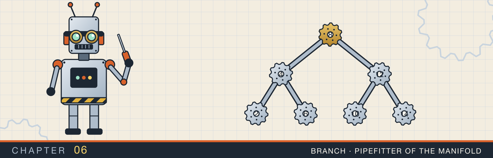
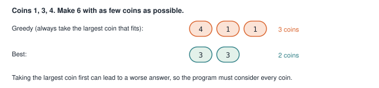
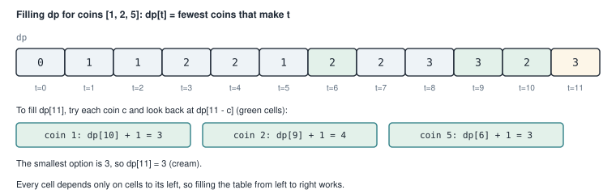
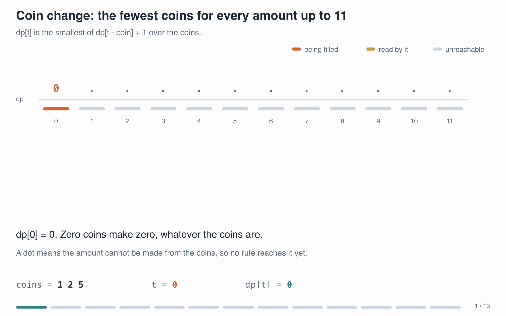
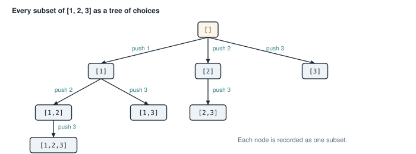
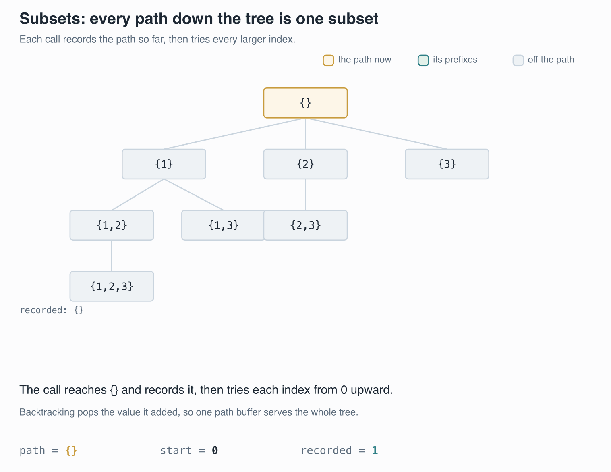
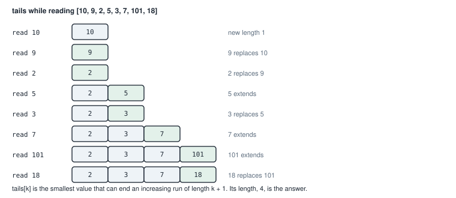
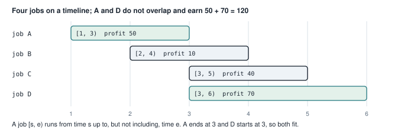

# Recursion and dynamic programming

<div class="covers" markdown="1">

This chapter covers

- Recognizing a problem that can be built from answers to smaller versions of itself
- Filling a table of answers from the smallest case upward
- Listing every subset of a set by exploring a tree of choices
- The longest increasing run hidden inside a list, in O(n log n)
- Choosing jobs that do not overlap, to earn the most

</div>

In chapter 1 you computed Fibonacci numbers three ways. The recursive version repeated work. The memoized
version saved each answer in a table, and the loop version kept only the answers it still needed. That
small example contains the whole idea of this chapter.

**Dynamic programming** is a way to solve a problem by answering smaller versions of the same problem first,
saving those answers, and combining them. It applies when two things are true:

1. The answer for a large input can be built from the answers for smaller inputs.
2. The same smaller inputs come up again and again, so saving their answers avoids repeated work.

This chapter works through four problems. The first, making change with coins, is dynamic programming in its
plainest form. The second, listing subsets, uses recursion without any saved answers. The last two combine
dynamic programming with the sorting and searching you learned in chapter 3.

For each problem I first say, in one sentence, what one entry of the table means. That sentence is called
the **subproblem**. Once it is written down, the code follows from it.

## 6.1 Making change with the fewest coins

**The problem.** You have coins of some values, as many of each as you like. What is the fewest number of
coins that add up to a given amount? With coins 1, 2, and 5, the amount 11 needs three coins: 5 + 5 + 1.
Some amounts cannot be made at all. With only a 2 coin, the amount 3 is impossible.

### 6.1.1 Why the obvious approach fails

A natural first try is to take the largest coin that fits, again and again. This is called a **greedy**
approach. It works for 1, 2, and 5. It does not work for every set of coins (figure 6.1).

<figure>

<figcaption><b>Figure 6.1</b> Greedy picks 4 first and needs three coins. The best answer uses two.</figcaption>
</figure>

So the program has to consider every coin at every step. Trying every combination directly takes
exponential time. Dynamic programming makes it fast.

### 6.1.2 The subproblem

Write down what one entry of the table means:

> `dp[t]` is the fewest coins that add up to exactly `t`.

Now think about the last coin used to make `t`. If that coin is `c`, the coins before it add up to `t - c`,
and the fewest coins for that is `dp[t - c]`. So using coin `c` last costs `dp[t - c] + 1` coins. You do not
know which coin is last in the best answer, so try every coin and keep the smallest:

> `dp[t]` = the smallest of `dp[t - c] + 1`, over every coin `c` that is not larger than `t`.

The starting point is `dp[0] = 0`: zero coins make zero.

Fill the table by hand for the coins in figure 6.1, which are 1, 3, and 4, and the amount 6. Each row tries
every coin that fits, and keeps the smallest count:

| `t` | coins that fit | options from each coin | `dp[t]` |
|---|---|---|---|
| 1 | 1 | `dp[0] + 1` = 1 | 1 |
| 2 | 1 | `dp[1] + 1` = 2 | 2 |
| 3 | 1, 3 | `dp[2] + 1` = 3, `dp[0] + 1` = 1 | 1 |
| 4 | 1, 3, 4 | `dp[3] + 1` = 2, `dp[1] + 1` = 2, `dp[0] + 1` = 1 | 1 |
| 5 | 1, 3, 4 | `dp[4] + 1` = 2, `dp[2] + 1` = 3, `dp[1] + 1` = 2 | 2 |
| 6 | 1, 3, 4 | `dp[5] + 1` = 3, `dp[3] + 1` = 2, `dp[2] + 1` = 3 | 2 |

`dp[6]` is 2, from `3 + 3`. Greedy needed three coins for the same amount, because it took the 4 first and
never went back. The table records the best count for every smaller amount. Each new amount is then one
lookup plus one.

Two properties must hold for that to work. The answers must **overlap**, so that saving them avoids work.
`dp[6]` and `dp[5]` both read `dp[1]`, and a longer table reads each entry many times. The best answer must
also be built from best answers to smaller amounts. Taking the smallest of `dp[t - c] + 1` relies on that.
If some way of making `t - c` used fewer coins, `dp[t - c]` would hold that smaller number. When either
property fails, the table gives a wrong answer.

Because `dp[t]` only uses entries for smaller amounts, you can fill the table from left to right. Figure 6.2
shows the table for coins 1, 2, and 5, and how `dp[11]` is computed.

<figure>

<figcaption><b>Figure 6.2</b> The filled table. For <code>dp[11]</code>, the three coins lead back to <code>dp[10]</code>, <code>dp[9]</code>, and <code>dp[6]</code>.</figcaption>
</figure>

<figure class="anim">
<video class="motion" src="figures/ch06-coin-change.mp4" autoplay loop muted playsinline preload="metadata" aria-label="The table dp[0] to dp[11] for coins 1, 2, and 5, filled left to right. For each amount t, arcs connect the entries dp[t - coin] it reads to dp[t]. The first amounts are shown one coin at a time; dp[11] ends as 3. A last part shows greedy on coins 1, 3, 4 for amount 6 taking 4 + 1 + 1, three coins, where the table finds two." data-chapters="[[0.0, &quot;dp[1..2]&quot;], [30.12, &quot;dp[3..10]&quot;], [66.12, &quot;dp[11]&quot;], [89.76, &quot;greedy&quot;]]"></video>
<figcaption><b>Animation 6.1</b> Each entry reads only entries to its left, so one pass fills the table. The arcs show which entries <code>dp[t]</code> reads. The last part shows greedy choosing three coins where two are enough.</figcaption>
</figure>

### 6.1.3 The code

<p class="listing"><b>Listing 6.1</b> Coin change (lines 6 to 29). <a href="https://github.com/arpanpathak/cracking-the-systems-programming-interview/blob/prep-v2/rust-interview-lab/src/problems/dp.rs">src/problems/dp.rs</a></p>

```rust
{{#include ../../rust-interview-lab/src/problems/dp.rs:6:29}}
```

Read it against the recurrence:

- A negative amount is rejected first. After that check, `amount as usize` cannot produce a strange value.
- `vec![usize::MAX; amount + 1]` creates the table, one entry per amount from 0 to `amount`. `usize::MAX`,
  the largest `usize`, stands for "cannot be made yet".
- `dp[0] = 0` is the starting point.
- The outer loop fills amounts from 1 upward. The inner loop tries every coin.
- The `continue` skips a coin that is larger than the amount, or whose remainder cannot be made. The second
  check also prevents `usize::MAX + 1`, which would overflow.
- `dp[total].min(dp[total - coin] + 1)` keeps the smaller of the current best and the new option.

<div class="callout warning" markdown="1">

**WARNING** The second half of that `continue` is not an optimisation. Remove it and the function breaks.
If `dp[total - coin]` holds the sentinel, then `dp[total - coin] + 1` adds one to the largest `usize`. A
debug build panics with "attempt to add with overflow". A release build wraps around to 0, and the final
`match` reads 0 as a real count of zero coins. The table then reports fewer coins than exist. Add the
sentinel check before adding, or `usize::MAX` cannot stand for "impossible".

</div>

At the end, a `match` turns the table entry into the result. The pattern `usize::MAX` matches that exact
value, meaning impossible, and returns `None`. Any other value is a count. So the function returns
`Option<i32>`, and the caller cannot mistake "impossible" for a number of coins.

The table has `amount + 1` entries and each one tries every coin. The cost is O(amount × coins) time and
O(amount) memory.

<p class="listing"><b>Listing 6.2</b> The complete file. <a href="https://github.com/arpanpathak/cracking-the-systems-programming-interview/blob/prep-v2/rust-interview-lab/src/problems/dp.rs">src/problems/dp.rs</a></p>

```rust
{{#include ../../rust-interview-lab/src/problems/dp.rs}}
```

Run the tests with `cargo test --lib coin_change`. The tests check the example from section 6.1, an
impossible amount, and the amount 0.

## 6.2 Listing every subset

Not every recursive problem needs a table. Sometimes you need every possible answer, not the best one. Then
recursion explores all the choices, and there is nothing to save.

**The problem.** List every subset of a set of distinct numbers. A **subset** is any selection of the
elements, including none of them and all of them. `[1, 2, 3]` has eight subsets: `[]`, `[1]`, `[2]`, `[3]`,
`[1, 2]`, `[1, 3]`, `[2, 3]`, and `[1, 2, 3]`.

**The idea.** Build subsets one element at a time. Start with the empty subset. From any subset, you can add
one more element, as long as it comes later in the input than the elements already chosen. That rule is what
stops `[2, 1]` from appearing as a copy of `[1, 2]`. Figure 6.3 draws the choices as a tree. Every node in
the tree is one subset.

<figure>

<figcaption><b>Figure 6.3</b> The tree of choices for <code>[1, 2, 3]</code>. Each edge adds an element that comes after the last one chosen.</figcaption>
</figure>

To visit the whole tree, the program walks it depth first, going down one branch as far as it can before
trying the next. Going down means adding an element; coming back up means removing it. This way of exploring
choices is called **backtracking**.

<figure class="anim">
<video class="motion" src="figures/ch06-subsets.mp4" autoplay loop muted playsinline preload="metadata" aria-label="The tree of choices for 1, 2, 3, with the current path highlighted. The recursion records a subset at each node, pushes the next element on the way down, and pops it on the way back. The result list grows to [], [1], [1, 2], [1, 2, 3], [1, 3], [2], [2, 3], [3]. A last part shows the copy [2, 1] that a loop starting at 0 would record." data-chapters="[[0.0, &quot;walk&quot;], [67.44, &quot;loop from 0&quot;]]"></video>
<figcaption><b>Animation 6.2</b> The recursion records each subset when it reaches its node, in depth-first order. Starting each loop at <code>start</code> keeps <code>[2, 1]</code> out of the result.</figcaption>
</figure>


<p class="listing"><b>Listing 6.3</b> Subsets by backtracking. <a href="https://github.com/arpanpathak/cracking-the-systems-programming-interview/blob/prep-v2/rust-interview-lab/src/problems/backtracking.rs">src/problems/backtracking.rs</a></p>

```rust
{{#include ../../rust-interview-lab/src/problems/backtracking.rs}}
```

`backtrack` is a function defined inside `subsets`, as `go` was in chapter 1. It takes four things:

- `nums`, the input, borrowed.
- `start`, the first position it may choose from.
- `path`, the subset being built. Only one `path` vector exists for the whole search, passed as `&mut`.
- `result`, the list of finished subsets, also passed as `&mut`.

On entry, `backtrack` records `path.clone()` in the result. The current path is one subset, the node of
the tree it has reached. Then, for each later position, it pushes that element, recurses to explore the
subtree below, and pops the element. After the pop, `path` is exactly as it was before the push, ready for
the next choice.

Trace the start of `subsets(vec![1, 2, 3])`:

| Call | `path` on entry | Records | Then pushes |
|---|---|---|---|
| `backtrack(start 0)` | `[]` | `[]` | 1 |
| `backtrack(start 1)` | `[1]` | `[1]` | 2 |
| `backtrack(start 2)` | `[1, 2]` | `[1, 2]` | 3 |
| `backtrack(start 3)` | `[1, 2, 3]` | `[1, 2, 3]` | nothing: the loop is empty |
| back in `start 2` | `[1, 2]` after pop | | no more positions |
| back in `start 1` | `[1]` after pop | | 3 |

`Vec::with_capacity(1 << nums.len())` reserves exactly enough room. `1 << n` means 2 to the power n, because
shifting 1 left by n bits doubles it n times. A set of n elements has 2ⁿ subsets.

The work is O(n · 2ⁿ): there are 2ⁿ subsets and each clone copies up to n numbers. No algorithm can do
better, because the output itself has that size.

## 6.3 The longest increasing run inside a list

**The problem.** In a list of numbers, pick some of them and keep their order. Each picked number must be
larger than the one before. What is the most you can pick? The picked numbers are called an **increasing
subsequence**. In `[10, 9, 2, 5, 3, 7, 101, 18]`, you can pick `2, 3, 7, 18`, so the answer is 4.

A subsequence may skip numbers. That is the difference from the substrings of chapter 3, which were
contiguous.

**The direct dynamic program.** Let `dp[i]` be the length of the longest increasing subsequence that ends at
position i. For each i, look at every earlier j with a smaller number, and take the best `dp[j] + 1`. That is
O(n²), because each position looks at every earlier one.

**A faster idea.** Keep a different table, called `tails`. Its entries have this meaning:

> The k-th smallest entry of `tails` is the smallest number that can end an increasing subsequence of
> length k.

Keeping the smallest possible ending number is useful because a smaller ending leaves more room for later
numbers to extend it. When a new number arrives:

- If it is larger than every entry, it extends the longest subsequence found so far. Add it.
- Otherwise, find the smallest entry that is at least as large as it, and replace that entry with it. Some
  subsequence of that length can now end with a smaller number.

At the end, the number of entries is the answer. Figure 6.4 follows the example.

<figure>

<figcaption><b>Figure 6.4</b> <code>tails</code> after each number. The green cell is the one that changed.</figcaption>
</figure>

Look at the last row. `tails` is `2, 3, 7, 18`, which happens to be a real increasing subsequence here. That
is not true in general. `tails` can mix numbers from different subsequences. Only its length is meaningful.

The entries of `tails` are always in increasing order, so finding "the smallest entry at least as large" can
use a sorted structure. The program uses a `BTreeSet`, a set that keeps its elements sorted.

<p class="listing"><b>Listing 6.4</b> The complete program. <a href="https://github.com/arpanpathak/cracking-the-systems-programming-interview/blob/prep-v2/rust-interview-lab/src/bin/longest_increasing_subsequence.rs">src/bin/longest_increasing_subsequence.rs</a></p>

```rust
{{#include ../../rust-interview-lab/src/bin/longest_increasing_subsequence.rs}}
```

`tails.range(num..)` returns the elements from `num` upward, in sorted order. `.next()` takes the first of
them, the smallest element that is at least `num`. If there is one, the program removes it. Then it inserts
`num` in every case. Removing and inserting is how the set replaces one element with another.

The range `num..` includes `num` itself, which handles repeated numbers. In `[7, 7, 7, 7]`, the second 7
finds the first 7, removes it, and inserts itself again, so the answer stays 1. A run with a repeated number
is not strictly increasing, so 1 is correct.

Each `range`, `remove`, and `insert` on a `BTreeSet` costs O(log n), so the whole program is O(n log n).

```text
$ cargo run --bin longest_increasing_subsequence
4
4
1
1
5
0
```

The six outputs match the comments in `main`.

## 6.4 Choosing jobs that do not overlap

**The problem.** A machine can run one job at a time. Each job has a start time, an end time, and a profit.
Choose jobs that do not overlap so that the total profit is as large as possible. Figure 6.5 shows the four
sample jobs.

<figure>

<figcaption><b>Figure 6.5</b> The sample jobs. A and D fit together and earn 120, the best possible.</figcaption>
</figure>

A job written `[s, e)` runs from time s up to, but not including, time e. So a job ending at 3 and a job
starting at 3 do not overlap.

### 6.4.1 Building the subproblem

First sort the jobs by end time. Then any job that can come before job i in a schedule ends earlier, so it
appears earlier in the sorted list. The subproblem is:

> `dp[i]` is the best profit using only the first i jobs of the sorted list.

For job i there are two choices:

- **Skip it.** The best profit stays `dp[i]`, the best without it.
- **Take it.** Then only jobs that end by its start time can come before it. Those jobs are a prefix of the
  sorted list, say the first `prev` jobs. The profit is `dp[prev] + profit of job i`.

So `dp[i + 1]` is the larger of the two. The last entry is the answer.

Finding `prev` is a search in a sorted list, so it can be a binary search, like chapter 3's. The standard
library provides one as `partition_point`. Given a condition that is true for a prefix of the list and false
after it, `partition_point` returns the length of that prefix.

### 6.4.2 The code

<p class="listing"><b>Listing 6.5</b> The complete program. <a href="https://github.com/arpanpathak/cracking-the-systems-programming-interview/blob/prep-v2/rust-interview-lab/src/bin/job_scheduling_with_profit_and_deadline.rs">src/bin/job_scheduling_with_profit_and_deadline.rs</a></p>

```rust
{{#include ../../rust-interview-lab/src/bin/job_scheduling_with_profit_and_deadline.rs}}
```

The comments inside `max_profit` walk through the same reasoning as section 6.4.1, step by step.
`jobs[..i].partition_point(|j| j.end <= job.start)` counts the jobs among the first i that end by this job's
start. Because the list is sorted by end time, those jobs come first, which is the condition
`partition_point` needs.

Trace it on the sorted jobs A, B, C, D:

| i | job | prev | skip: `dp[i]` | take: `dp[prev]` + profit | `dp[i + 1]` |
|---|---|---|---|---|---|
| 0 | A [1, 3) 50 | 0 | 0 | 0 + 50 = 50 | 50 |
| 1 | B [2, 4) 10 | 0 | 50 | 0 + 10 = 10 | 50 |
| 2 | C [3, 5) 40 | 1 | 50 | 50 + 40 = 90 | 90 |
| 3 | D [3, 6) 70 | 1 | 90 | 50 + 70 = 120 | **120** |

For C and D, `prev` is 1: only A ends by time 3. Sorting costs O(n log n), and each job does one binary
search, so the whole program is O(n log n).

```text
$ cargo run --bin job_scheduling_with_profit_and_deadline
120
```

<div class="summary" markdown="1">

## Summary

- Dynamic programming answers smaller versions of a problem first, saves the answers, and combines them.
- Start by writing, in one sentence, what one table entry means. The recurrence and the code follow from it.
- Coin change fills `dp[t]` from `dp[t - c] + 1` for each coin, left to right, in O(amount × coins).
- Greedy choices can fail. Coins 1, 3, and 4 make 6 greedily with three coins, but two suffice.
- Backtracking explores a tree of choices with one shared `path`, pushing before each recursive call and
  popping after it. Listing all subsets is O(n · 2ⁿ), the size of the output.
- The longest increasing subsequence keeps the smallest possible ending for each length, in a sorted set,
  for O(n log n).
- Weighted job scheduling sorts by end time, uses `partition_point` to find compatible jobs, and fills a
  table of best profits.

</div>

Chapter 7 begins Part 3, on modeling data. You will build types that can only hold valid values, using
structs, enums, and error types.

## Exercises

1. Change `coin_change` to also return the coins it used. Store the last coin chosen for each amount, then
   follow those choices back from `amount`.
2. Write the O(n²) version of the longest increasing subsequence described in section 6.3, and check that it
   agrees with `lis_len` on random lists.
3. Generate all subsets without recursion. Count a number `mask` from 0 to 2ⁿ − 1, and include element i
   when bit i of `mask` is set.
4. Extend `max_profit` to return which jobs it chose, not only the total.
