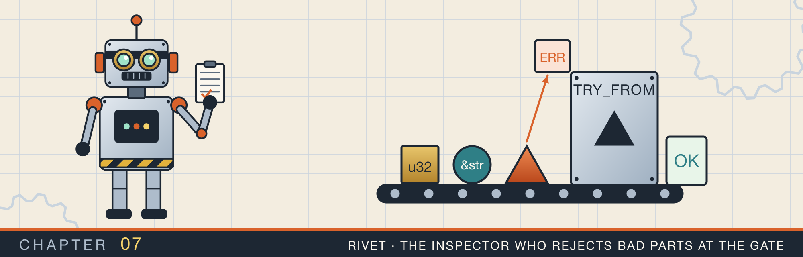
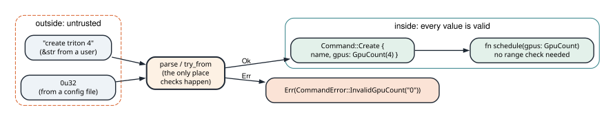
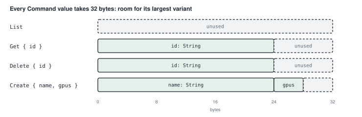
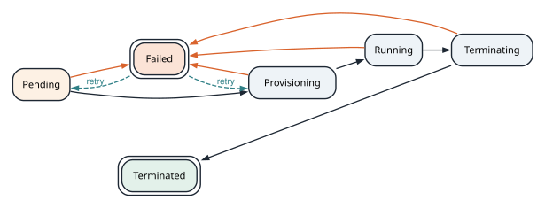

# Types that refuse bad input

<div class="covers" markdown="1">

This chapter covers

- Traits: what they are, how to implement one, and what `#[derive]` writes for you
- A newtype: a struct around one number that can only hold valid values
- Error types that say what went wrong, with `Display` and `std::error::Error`
- Converting between types with `From` and `TryFrom`
- Enums whose variants carry data, used for commands, for states, and for errors
- A parser that turns a line of text into a typed command

</div>

This chapter begins Part 3, on modeling data. So far your programs have used the types Rust provides:
numbers, strings, vectors, and maps. In this chapter you design your own types, so that invalid values cannot
be represented at all.

The examples come from a small command-line tool that manages jobs on a remote computer. The jobs are called
**workloads**. Each workload asks for a number of GPUs, which must be between 1 and 64. A GPU is a graphics processor,
and servers also use GPUs for general computation. A workload moves through states such as pending,
running, and terminated. The tool reads commands typed by a user, such as `create triton 4`, which asks for a
workload named `triton` with 4 GPUs. That is all you need to know about the tool.

Here is the problem this chapter solves. A GPU count arrives as text typed by a user. The program must reject
`0`, `99`, and `many`, and it must do so before the count reaches the code that uses it. If each function
checked the count itself, one forgotten check would let a bad value through. Instead, the program checks the
count once, where the text enters, and stores the result in a type that can only hold valid counts. Every
function that receives that type can rely on it without checking again.

The chapter builds this in order:

1. Section 7.1 explains traits, which the rest of the chapter implements.
2. Section 7.2 builds the GPU count type.
3. Section 7.3 gives it an error type.
4. Section 7.4 adds the standard conversions.
5. Section 7.5 builds an enum for commands and a parser for them.
6. Section 7.6 models the workload's states and the moves between them.
7. Section 7.7 models the errors a server can return.

## 7.1 Traits

A **trait** is a set of methods that a type promises to provide. The standard library defines many traits.
For example, the `Display` trait has one method, `fmt`, which writes a value as text for a person to read.
`println!("{}", x)` works for any `x` whose type implements `Display`.

You implement a trait for your type with an `impl` block that names the trait:

```rust
impl fmt::Display for GpuCountError {
    fn fmt(&self, formatter: &mut fmt::Formatter<'_>) -> fmt::Result {
        write!(formatter, "...")
    }
}
```

Some traits are so regular that the compiler can write them for you. `#[derive(Debug, Clone, PartialEq)]` placed above a struct asks the compiler to generate three traits.
`Debug` prints with `{:?}`, `Clone` copies with `.clone()`, and `PartialEq` compares with `==`. The derived versions work field by field.

Table 7.1 lists the traits this chapter uses.

| Trait | What it gives you | How you get it |
|---|---|---|
| `Debug` | printing with `{:?}`, for programmers | `#[derive(Debug)]` |
| `Display` | printing with `{}`, for users | write `impl Display` yourself |
| `Clone`, `Copy` | `.clone()`, and for `Copy`, copying by assignment | derive |
| `PartialEq`, `Eq` | `==` and `!=` | derive |
| `PartialOrd`, `Ord` | `<`, `>`, and sorting | derive |
| `Hash` | use as a `HashMap` key | derive |
| `std::error::Error` | use as an error with `?` and `Box<dyn Error>` | write an empty `impl` once `Debug` and `Display` exist |
| `From`, `TryFrom` | conversions between types | write `impl` yourself |

## 7.2 A GPU count that is always valid

A **newtype** is a struct with one field, used to give a plain value a type of its own. Here the plain value
is a `u32`, and the new type is `GpuCount`.

The trick is privacy. Fields in Rust are private by default. Code outside the module where the struct is defined cannot read or
write them, and cannot build the struct with `GpuCount(0)`. The only way to get a
`GpuCount` is through the functions the module offers. If those functions check the value, every
`GpuCount` in the program is valid. Figure 7.1 shows the design.

<figure>

<figcaption><b>Figure 7.1</b> Checks happen once, at the gate. Inside, the types guarantee the values are valid.</figcaption>
</figure>

The module starts with a comment that lists its ideas:

<p class="listing"><b>Listing 7.1</b> The module comment (lines 1 to 12). <a href="https://github.com/arpanpathak/cracking-the-systems-programming-interview/blob/prep-v2/rust-interview-lab/src/problems/adt_idioms.rs">src/problems/adt_idioms.rs</a></p>

```rust
{{#include ../../rust-interview-lab/src/problems/adt_idioms.rs:1:12}}
```

Here is the type:

<p class="listing"><b>Listing 7.2</b> <code>GpuCount</code> (lines 14 to 36).</p>

```rust
{{#include ../../rust-interview-lab/src/problems/adt_idioms.rs:14:36}}
```

- `pub struct GpuCount(u32);` is a **tuple struct**: a struct whose field has no name, only a position. The
  struct is public, but its field is not.
- `pub const MIN: u32 = 1;` and `MAX` are **associated constants**, constants that belong to the type. You
  refer to them as `GpuCount::MIN`, or `Self::MIN` inside the `impl`.
- `new` is the gate. `(Self::MIN..=Self::MAX)` is the range 1 to 64, including both ends, and `.contains(&value)`
  checks the value. If it is in range, `new` returns `Ok(Self(value))`. If not, it returns an error.
- `get` returns the number inside. It takes `self` by value, which is fine because `GpuCount` is `Copy`.

The long `#[derive(...)]` line gives `GpuCount` the same abilities as the `u32` inside it. You can print it,
copy it, compare it, sort it, and use it as a map key.

## 7.3 An error that says what went wrong

When `new` rejects a value, it returns a `GpuCountError`. Here is that type:

<p class="listing"><b>Listing 7.3</b> The error type (lines 38 to 54).</p>

```rust
{{#include ../../rust-interview-lab/src/problems/adt_idioms.rs:38:54}}
```

`GpuCountError(pub u32)` keeps the rejected value. Its field is `pub`, so a caller can read which value was
rejected.

The `Display` implementation writes the message a user sees. `write!` works like `format!`, but writes into
the formatter. The message includes the value and the allowed range: `gpu count 0 is outside 1..=64`.

`impl std::error::Error for GpuCountError {}` is empty. The `Error` trait's methods all have defaults, and it
requires `Debug` and `Display`, which the type already has. Implementing it lets this error work with other
error-handling code, such as `Box<dyn std::error::Error>`, which you will see in section 7.5.

## 7.4 Converting with `From` and `TryFrom`

The standard library has two traits for converting a value of one type into another:

- `From<A> for B` is for conversions that always succeed. Implementing it gives you `B::from(a)`, and also
  `a.into()` wherever a `B` is expected.
- `TryFrom<A> for B` is for conversions that can fail. Its `try_from` returns a `Result`. Implementing it
  gives you `B::try_from(a)` and `a.try_into()`.

<p class="listing"><b>Listing 7.4</b> The two conversions (lines 56 to 68).</p>

```rust
{{#include ../../rust-interview-lab/src/problems/adt_idioms.rs:56:68}}
```

Going from `u32` to `GpuCount` can fail, so it is `TryFrom`. Its body calls `new`, so the check still lives
in one place. `type Error = GpuCountError;` names the error type this conversion returns.

Going from `GpuCount` back to `u32` cannot fail, so it is `From`. The body returns the field, `count.0`.

<div class="callout tip" markdown="1">

**TIP:** Rust also has the `as` keyword, as in `x as u32`. `as` never reports failure: converting 300 to a
`u8` with `as` quietly gives 44. Prefer `From` when a conversion cannot fail and `TryFrom` when it can, and
keep `as` for cases where you want truncation.

</div>

## 7.5 Commands: an enum that carries data

### 7.5.1 Why an enum

The tool accepts four commands. `list` takes no arguments. `get` and `delete` each take an ID. `create`
takes a name and a GPU count. A first design might put all the possible fields in one struct:

```rust
struct Command {
    verb: String,
    id: Option<String>,        // only for get and delete
    name: Option<String>,      // only for create
    gpus: Option<u32>,         // only for create
}
```

This struct can hold a `get` without an ID, or a `list` with a GPU count. Every function that receives it
has to check which fields make sense for the verb.

An enum whose variants each carry their own data cannot hold those combinations:

<p class="listing"><b>Listing 7.5</b> The command enum (lines 70 to 77).</p>

```rust
{{#include ../../rust-interview-lab/src/problems/adt_idioms.rs:70:77}}
```

A `Create` always has a name and a valid `GpuCount`, because Rust will not build one without them. A `List`
has no fields, because it needs none.

In memory, every `Command` takes the same space, enough for its largest variant, as figure 7.2 shows.

<figure>

<figcaption><b>Figure 7.2</b> A <code>Command</code> is 32 bytes. Rust also records which variant a value is. Here it stores that in bit patterns the <code>String</code> never uses, so no extra byte is needed.</figcaption>
</figure>

### 7.5.2 Parsing a line of text

Parsing turns one line of text into a `Command`, or into an error that says what was wrong with the line.

<p class="listing"><b>Listing 7.6</b> <code>Command::parse</code> and <code>verb</code> (lines 79 to 117).</p>

```rust
{{#include ../../rust-interview-lab/src/problems/adt_idioms.rs:79:117}}
```

`parse` returns `Result<Self, CommandError>`: a command, or the reason the line could not be parsed. Trace
`Command::parse("create triton 4")` step by step:

| Step | Code | Result |
|---|---|---|
| 1 | `line.split_whitespace()` | an iterator over `"create"`, `"triton"`, `"4"` |
| 2 | `parts.next().ok_or(CommandError::Empty)?` | `verb` is `"create"` |
| 3 | `match verb` | runs the `"create"` arm |
| 4 | `argument(&mut parts, "name")?` | `"triton"`, turned into a `String` |
| 5 | `argument(&mut parts, "gpu count")?` | `raw` is `"4"` |
| 6 | `raw.parse()` | the number 4 |
| 7 | `GpuCount::new(value)` | `GpuCount(4)` |
| 8 | `Ok(Self::Create { name, gpus })` | the finished command |

Now try some bad inputs. An empty line fails at step 2, because there is no first word. `ok_or` turns the
`None` into `Err(CommandError::Empty)`, and `?` returns it. The line `create triton many` fails at step 6,
because `"many"` is not a number. The line `create triton 0` passes step 6 and fails at step 7.

Steps 6 and 7 can fail for different reasons, but both failures are reported the same way.
`.map_err(|_| CommandError::InvalidGpuCount(raw.to_string()))` replaces whatever error came back with
`InvalidGpuCount`, carrying the text the user typed. The user then sees their own input in the message.

`verb` goes the other way, from a command to its name. The patterns `Self::Get { .. }` match a variant and
ignore its fields.

### 7.5.3 The parser's errors and helper

Each way a line can be malformed gets its own error variant, so the caller learns exactly what failed.

<p class="listing"><b>Listing 7.7</b> <code>CommandError</code> and <code>argument</code> (lines 119 to 148).</p>

```rust
{{#include ../../rust-interview-lab/src/problems/adt_idioms.rs:119:148}}
```

`CommandError` lists every way parsing can fail, and its `Display` writes a message for each. Because the
errors are enum variants, a caller can `match` on them and react differently to each. A CLI could print usage
help for `MissingArgument` and the allowed range for `InvalidGpuCount`. With a plain `String` error, the
caller would have to read the message text to tell the cases apart.

`argument` takes the next word from the iterator, or fails with the argument's name. Look at its first
parameter, `&mut impl Iterator<Item = &'a str>`. It borrows the caller's iterator mutably, so that each call
consumes one more word. The lifetime `'a`, which you met in chapter 4, says the returned `&str` points into
the original line. So no text is copied until `parse` decides to keep it with `to_string()`.

### 7.5.4 Adding up without an index

The file has one more small function:

<p class="listing"><b>Listing 7.8</b> <code>summarize</code> (lines 150 to 157).</p>

```rust
{{#include ../../rust-interview-lab/src/problems/adt_idioms.rs:150:157}}
```

`fold` walks the slice once and carries a value along. Here the value is a pair, `(count, sum)`, starting at
`(0, 0)`. For each element, the closure returns the new pair. `i64::from(*value)` widens each `i32` to `i64`.
That conversion is a `From`, so it can never lose information.

### 7.5.5 The complete file

<p class="listing"><b>Listing 7.9</b> The complete file, with its tests. <a href="https://github.com/arpanpathak/cracking-the-systems-programming-interview/blob/prep-v2/rust-interview-lab/src/problems/adt_idioms.rs">src/problems/adt_idioms.rs</a></p>

```rust
{{#include ../../rust-interview-lab/src/problems/adt_idioms.rs}}
```

Read the tests as a description of the behavior. `parses_each_command_variant` shows one valid line per
variant. `rejects_bad_input_with_typed_errors` shows each failure, and compares the errors with `assert_eq!`.
That comparison works because `CommandError` derives `PartialEq`. `newtype_rejects_out_of_range_values`
tests both edges of the range, 1 and 64, and one step past each.

The tests run in parallel, so their order in the output can change from run to run:

```text
$ cargo test --lib adt_idioms
running 5 tests
test problems::adt_idioms::tests::newtype_rejects_out_of_range_values ... ok
test problems::adt_idioms::tests::summarize_reports_count_and_sum ... ok
test problems::adt_idioms::tests::rejects_bad_input_with_typed_errors ... ok
test problems::adt_idioms::tests::parses_each_command_variant ... ok
test problems::adt_idioms::tests::errors_render_a_reason ... ok

test result: ok. 5 passed; 0 failed
```

The command enum describes what a user asks for. The next section uses an enum to describe something that
changes over time.

## 7.6 The states of a workload

A workload is accepted (`Pending`), gets machines assigned (`Provisioning`), runs (`Running`), is shut down
(`Terminating`), and ends (`Terminated`). Any of the active states can fail, and a failed workload can be
tried again. A description like this, a set of states and the allowed moves between them, is called a
**state machine**. Figure 7.3 draws it.

<figure>

<figcaption><b>Figure 7.3</b> The workload's states. Double borders mark states where the workload holds no machines. Dashed arrows are retries.</figcaption>
</figure>

<p class="listing"><b>Listing 7.10</b> The states (lines 1 to 18). <a href="https://github.com/arpanpathak/cracking-the-systems-programming-interview/blob/prep-v2/rust-interview-lab/src/problems/state_machine.rs">src/problems/state_machine.rs</a></p>

```rust
{{#include ../../rust-interview-lab/src/problems/state_machine.rs:1:18}}
```

Each state is a variant with no data. Such an enum is stored as a single byte, and it derives `Copy`, so you
pass states around by value.

<p class="listing"><b>Listing 7.11</b> The allowed moves (lines 20 to 56).</p>

```rust
{{#include ../../rust-interview-lab/src/problems/state_machine.rs:20:56}}
```

`can_transition_to` checks one move, from `self` to `next`. It matches on the pair `(self, next)`, so each
pattern is one arrow in figure 7.3. Patterns joined with `|` share one arm: this is an **or-pattern**. The
first arm lists the forward moves and the failure moves. The second lists the retries. The last arm, `_`,
matches every other pair and returns an error.

That last arm decides what happens to moves nobody listed. With it, any move not written down is rejected.
If someone adds a new state later, every move into or out of it is rejected until they list it. That is the
safe default for a state machine.

`is_terminal` uses the `matches!` macro, which returns `true` when a value matches a pattern. `Failed` counts
as terminal even though it can retry, because it holds no machines. `summary` returns a fixed message for
each state. Its return type `&'static str` means the text lives for the whole program, because it is written
into the program itself.

## 7.7 Errors from a server

The same file models the errors a server can send back. Here, different errors carry different information.

<p class="listing"><b>Listing 7.12</b> <code>ApiError</code> and its methods (lines 58 to 91).</p>

```rust
{{#include ../../rust-interview-lab/src/problems/state_machine.rs:58:91}}
```

A rate-limit error says how long to wait before trying again. A not-found error says which resource. A server
error carries the HTTP status code and a message.

`is_retryable` answers a question every client asks after a failure: could trying again help? A rate limit
will pass, and a server error in the 500s may be temporary, so both are retryable. A missing resource will
still be missing. The whole rule is one pattern:

```rust
Self::RateLimited { .. } | Self::Server { status: 500..=599, .. }
```

`status: 500..=599` inside the struct pattern matches any status from 500 to 599. `..` ignores the other
fields. Chapter 19 builds a retry loop around this method.

`user_message` turns each error into text for a person. `retry_after.as_millis()` converts the waiting time
to milliseconds for the message.

<p class="listing"><b>Listing 7.13</b> A small parser (lines 93 to 101).</p>

```rust
{{#include ../../rust-interview-lab/src/problems/state_machine.rs:93:101}}
```

`parse_gpu_count` is a shorter version of the gate from section 7.2. It trims the text, handles the empty
case with its own message, and converts the standard library's parse error into `ApiError::InvalidRequest`.
`{raw:?}` prints the text with quotes, so an empty or odd input is visible in the message.

<p class="listing"><b>Listing 7.14</b> The complete file, with its tests. <a href="https://github.com/arpanpathak/cracking-the-systems-programming-interview/blob/prep-v2/rust-interview-lab/src/problems/state_machine.rs">src/problems/state_machine.rs</a></p>

```rust
{{#include ../../rust-interview-lab/src/problems/state_machine.rs}}
```

The tests check an allowed move and two forbidden ones, the retry rule for three errors, and the parser.

<div class="summary" markdown="1">

## Summary

- A trait is a set of methods a type promises. You implement one with `impl Trait for Type`, and
  `#[derive]` generates the standard ones.
- A newtype with a private field and a checking constructor can only hold valid values, so the code that
  receives it needs no checks.
- An error type with `Display` and `std::error::Error` tells the caller what went wrong, and works with `?`.
- `From` converts when it cannot fail. `TryFrom` returns a `Result` when it can.
- An enum whose variants carry their own data replaces a struct full of `Option` fields, and is as large as its
  largest variant.
- A parser turns text into a typed value, and `map_err` turns low-level failures into your own errors.
- Matching on a pair of states describes a state machine, and a final `_` arm rejects every move not listed.
- Error enums can carry data and methods such as `is_retryable`.

</div>

Every value in this chapter had exactly one owner. Chapter 8 covers the pointer types for data that needs
several owners, or that must be shared between threads.

## Exercises

1. Write a `Port` newtype for network ports that rejects 0, with a `TryFrom<u16>` implementation and its own
   error type.
2. Implement the `FromStr` trait for `Command`, so that `"list".parse::<Command>()` works. Its method can
   call `Command::parse`.
3. Add a `Suspended` state to `WorkloadState` that can be entered from `Running` and left back to `Running`,
   and add tests for both moves.
4. Give `ApiError` a `Display` implementation that uses `user_message`, then implement `std::error::Error`
   for it.
