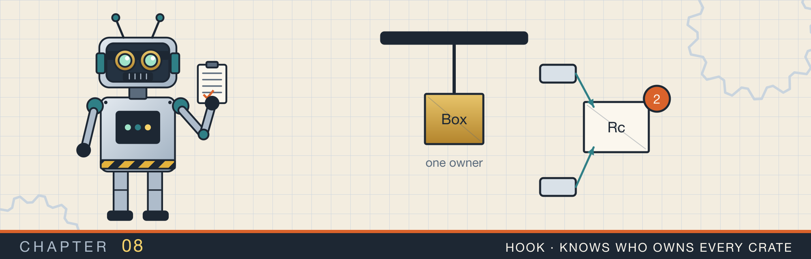
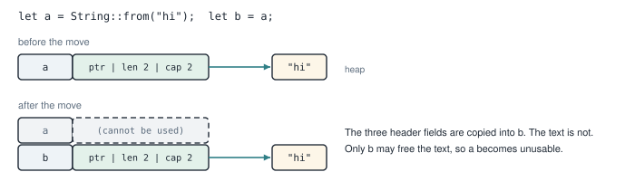
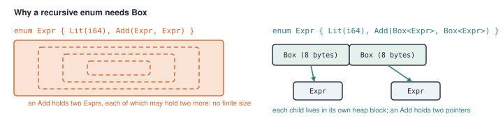
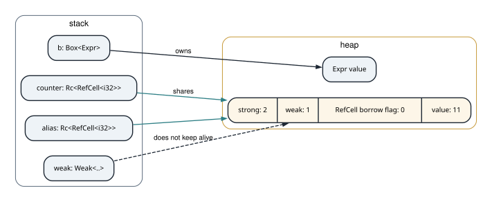
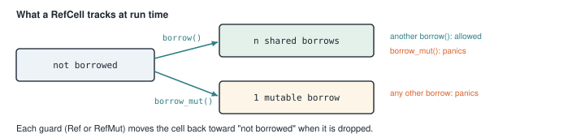
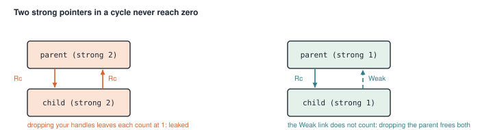
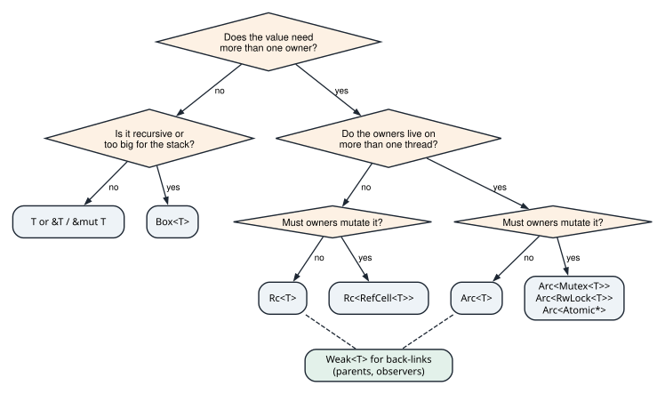

# Ownership and the pointer types

<div class="covers" markdown="1">

This chapter covers

- Ownership and moves, drawn in memory
- `Box`: putting a value on the heap, and why recursive types need it
- `Rc`: one value with several owners, counted
- `RefCell`: changing a value that has several owners, checked while the program runs
- `Weak`: a pointer that does not keep its value alive, and the leak it prevents
- `Arc` and `Mutex`: sharing and changing a value across threads
- `Cow`: borrowing when possible and copying only when needed

</div>

In chapter 7 every value had exactly one owner. That is the normal case in Rust, and most code needs nothing
more. But some structures cannot be described with one owner per value. A tree node wants to point back to
its parent. A counter must be updated by several threads. An expression contains smaller expressions of its
own type.

For each of these, the standard library has a **pointer type**. A pointer type holds the address of a
value and adds a rule about who owns it. This chapter covers the main ones, one at a time. For each, I show where its
data sits in memory and which problem it solves. The next four chapters, on linked lists, trees, and graphs,
use every one of them.

I start by reviewing ownership itself, because each pointer type is a change to its rules.

## 8.1 Ownership and moves

Every value in Rust has one **owner**, the variable or structure that holds it. When the owner goes away, at
the end of its scope, the value is dropped and its memory is freed.

Assigning a value to another variable **moves** it: ownership passes to the new variable, and the old one can
no longer be used. Figure 8.1 shows a move of a `String`.

<figure>

<figcaption><b>Figure 8.1</b> Moving a <code>String</code>. The small header is copied; the heap text is not. Only one variable may free the text, so the old one becomes unusable.</figcaption>
</figure>

A move copies only the header on the stack, the pointer, length, and capacity. The text on the heap stays
where it is. If both `a` and `b` were usable, both would try to free the same text when they went out of
scope. The compiler prevents that by making `a` unusable after the move.

Instead of moving a value, you can **borrow** it with a reference. A shared reference `&T` lets you read. A
mutable reference `&mut T` lets you change. The borrow rules say you may have either any number of `&T` or exactly one `&mut T`, but not both at once.
And no reference may outlive its value.

These rules cover most programs. The pointer types in this chapter handle the cases they cannot.

The module for this chapter starts with a table that summarizes them:

<p class="listing"><b>Listing 8.1</b> The module comment and imports (lines 1 to 27). <a href="https://github.com/arpanpathak/cracking-the-systems-programming-interview/blob/prep-v2/rust-interview-lab/src/problems/smart_pointers.rs">src/problems/smart_pointers.rs</a></p>

```rust
{{#include ../../rust-interview-lab/src/problems/smart_pointers.rs:1:27}}
```

Do not try to memorize the table yet. Each section below covers one row.

## 8.2 `Box`: one owner, on the heap

A `Box<T>` puts a value of type `T` on the heap and owns it. The `Box` itself is one pointer, 8 bytes on a
64-bit machine. When the `Box` is dropped, it drops the value and frees the heap memory. So a `Box` behaves
like an owned value that happens to live on the heap.

You need a `Box` most often for a type that contains itself. Consider an arithmetic expression: it is either
a number, or the sum of two smaller expressions. Written directly, that type would have no size (figure 8.2).

<figure>

<figcaption><b>Figure 8.2</b> Left: an <code>Add</code> that contains two <code>Expr</code> values directly would need infinite space. Right: with <code>Box</code>, an <code>Add</code> holds two pointers.</figcaption>
</figure>

To lay out a type, the compiler must know its size. An `Add(Expr, Expr)` contains two `Expr` values, each of
which may be another `Add`. The size has no end, so the compiler rejects the type. `Box<Expr>` is always 8
bytes, whatever it points to, so `Add(Box<Expr>, Box<Expr>)` has a fixed size.

<p class="listing"><b>Listing 8.2</b> An expression tree (lines 29 to 43).</p>

```rust
{{#include ../../rust-interview-lab/src/problems/smart_pointers.rs:29:43}}
```

`eval` computes the value of an expression. For a number, the value is the number. For a sum, it evaluates
both sides and adds them. The call `eval(left)` passes a `&Box<Expr>` where the function expects `&Expr`.
Rust converts it automatically, following the box to the value inside. This automatic conversion is called
**deref coercion**.

To build `1 + 2`, you write `Expr::Add(Box::new(Expr::Lit(1)), Box::new(Expr::Lit(2)))`. `Box::new`
allocates on the heap and moves the value there.

## 8.3 `Rc`: several owners, counted

Sometimes one value really has several owners, and none of them can be picked as the one that frees it. A
node in a graph with several incoming edges is an example. For this, Rust has `Rc<T>`, short for **reference
counted**.

`Rc::new(value)` puts the value on the heap together with a count of how many `Rc` handles point to it.
`Rc::clone(&rc)` does not copy the value. It adds 1 to the count and returns another handle to the same value.
Dropping a handle subtracts 1. When the count reaches zero, the value is dropped. Figure 8.3 shows two handles.

<figure>

<figcaption><b>Figure 8.3</b> Two <code>Rc</code> handles share one heap block. The block holds a strong count (the number of <code>Rc</code> handles), a weak count (section 8.5), and the value.</figcaption>
</figure>

An `Rc` hands out only shared references to its value. With several owners, a `&mut` through one of them
would break the rule that a `&mut` is the only reference. So by itself, a value inside an `Rc` cannot be
changed. The next section adds that ability.

<div class="callout note" markdown="1">

**NOTE:** `Rc` updates its count with ordinary, non-atomic arithmetic. If two threads updated it at the same
moment, the count could end up wrong. So the compiler does not let an `Rc` be sent to another thread.
Section 8.6 covers `Arc`, the version for threads.

</div>

## 8.4 `RefCell`: changing a shared value, checked at run time

`RefCell<T>` holds a value and allows it to be changed through a shared reference. It keeps the borrow rules,
but checks them while the program runs instead of at compile time. Figure 8.4 shows what it tracks.

<figure>

<figcaption><b>Figure 8.4</b> The borrow states of a <code>RefCell</code>. Breaking the rules is not a compile error; it panics when it happens.</figcaption>
</figure>

- `cell.borrow()` returns a guard that acts like `&T`. Many can exist at once.
- `cell.borrow_mut()` returns a guard that acts like `&mut T`. It panics if any other borrow is active.
- When a guard is dropped, its borrow ends.

`Rc` and `RefCell` are used together: `Rc<RefCell<T>>` gives several owners who can each change the value.

<p class="listing"><b>Listing 8.3</b> Two handles to one counter (lines 45 to 55).</p>

```rust
{{#include ../../rust-interview-lab/src/problems/smart_pointers.rs:45:55}}
```

Step through it:

1. `Rc::new(RefCell::new(0))` creates a counter holding 0, with a strong count of 1.
2. `Rc::clone(&counter)` makes a second handle, `alias`. The strong count is now 2. There is still one counter.
3. `*alias.borrow_mut() += 1;` borrows mutably through `alias` and adds 1. The guard is dropped at the end of
   the statement, so the borrow ends there.
4. `*counter.borrow_mut() += 10;` does the same through the other handle.
5. `*counter.borrow()` reads 11.

Animation 8.1 runs these steps, with the strong count and the `RefCell` flag drawn on the heap block.

<figure class="anim">
<video class="motion" src="figures/ch08-rc-refcell.mp4" autoplay loop muted playsinline preload="metadata" aria-label="Two stack variables, counter and alias, point at one heap block showing a strong count, a RefCell flag, and a value. Rc::new creates the block with count 1 and value 0; Rc::clone adds alias and the count becomes 2. borrow_mut through alias sets the flag to mutably borrowed, the value becomes 1, and the flag clears when the guard is dropped. The same through counter makes the value 11, and borrow reads it with a shared borrow. Dropping alias and counter brings the count to 0, and the block is freed. In a last run a guard g is kept alive, and a second borrow_mut panics with already borrowed." data-chapters="[[0.0, &quot;two handles&quot;], [7.98, &quot;borrow&quot;], [26.34, &quot;drop&quot;], [36.3, &quot;two guards&quot;]]"></video>
<figcaption><b>Animation 8.1</b> Two handles, one value. Each guard ends its borrow when it is dropped; a guard kept alive makes the next <code>borrow_mut</code> panic at run time.</figcaption>
</figure>

Each `borrow_mut` ends before the next starts, so no panic occurs. If you stored the first guard in a variable
and then called `borrow_mut` again while it was still alive, the program would panic.

## 8.5 `Weak`: a pointer that does not own

Counting has a weakness. If two values hold `Rc` handles to each other, each keeps the other's count above
zero. When you drop your own handles, both counts stay at 1, and neither value is ever freed. This is a
**reference cycle**, and it leaks memory (figure 8.5, left).

<figure>

<figcaption><b>Figure 8.5</b> Left: a cycle of strong pointers is never freed. Right: making the back-link <code>Weak</code> breaks the cycle.</figcaption>
</figure>

The fix is a pointer that does not count as an owner. `Weak<T>` is made from an `Rc` with `Rc::downgrade`.
It increases only the weak count, which does not keep the value alive. To use the value, you call
`upgrade()`, which returns `Some(Rc)` if the value still exists and `None` if it has been dropped.

The usual pattern is that parents own children with `Rc`, and children point back to their parents with
`Weak`.

<p class="listing"><b>Listing 8.4</b> A tree node with a weak parent pointer (lines 57 to 87).</p>

```rust
{{#include ../../rust-interview-lab/src/problems/smart_pointers.rs:57:87}}
```

- `parent: RefCell<Weak<TreeNode>>` stores the link to the parent. The `RefCell` allows the link to be
  changed after the node exists.
- `root` creates a node with `Weak::new()`, an empty weak pointer whose `upgrade` always returns `None`.
- `child_of` creates a node whose parent link is `Rc::downgrade(parent)`.
- `parent_value` borrows the link, calls `upgrade()`, and reads the parent's value if the parent still
  exists. `Option::map` applies the closure only when there is a value.

The test `weak_parent_link_does_not_keep_the_parent_alive` in listing 8.7 checks the behavior.

Animation 8.2 follows that test, then shows the cycle that `Weak` prevents.

<figure class="anim">
<video class="motion" src="figures/ch08-weak-parent.mp4" autoplay loop muted playsinline preload="metadata" aria-label="Stack variables root and child point at two heap nodes, each showing strong and weak counts. child_of gives the child a dashed Weak link to root, which raises root's weak count to 1 and leaves its strong count at 1. parent_value upgrades the link and returns Some(1). drop(root) brings root's strong count to 0, the node is freed, and parent_value returns None. In a second run both links are Rc: dropping both variables leaves each node with a strong count of 1, held by the other, and the pair is leaked." data-chapters="[[0.0, &quot;weak link&quot;], [16.86, &quot;drop root&quot;], [26.1, &quot;Rc both ways&quot;]]"></video>
<figcaption><b>Animation 8.2</b> A <code>Weak</code> parent link lets the parent be freed. With <code>Rc</code> in both directions, each node keeps the other alive forever.</figcaption>
</figure>

The test creates a
root and a child, drops the root, and then checks that the child's `parent_value()` is `None`.

## 8.6 `Arc` and `Mutex`: sharing across threads

`Arc<T>` is `Rc<T>` with an atomic count. An **atomic** operation is one the processor completes as a single step. That stays true even when several
cores run it on the same memory at the same moment. So `Arc` handles can
be sent to other threads. Chapter 16 explains atomic operations in detail.

`Mutex<T>` is the thread-safe counterpart of `RefCell`. `lock()` returns a guard that gives access to the
value. If another thread holds the lock, `lock()` waits until it is released, instead of panicking.

<p class="listing"><b>Listing 8.5</b> Several threads adding to one total (lines 89 to 110).</p>

```rust
{{#include ../../rust-interview-lab/src/problems/smart_pointers.rs:89:110}}
```

Step through it:

1. `Arc::new(Mutex::new(0usize))` creates the shared total.
2. For each thread, `Arc::clone(&total)` makes a new handle, and `thread::spawn(move || ...)` moves that handle
   into the new thread. `move` means the closure takes ownership of what it uses.
3. Each thread locks the mutex, adds 1, and drops the guard, `per_thread` times.
4. `handle.join()` waits for each thread to finish.
5. The last line locks once more and reads the result.

`lock()` returns a `Result`, because a thread that panics while holding the lock leaves the mutex marked as
**poisoned**. `.expect("mutex poisoned")` stops the program with that message in that case. Chapter 16 covers
poisoning.

This function locks once for every single increment, so the threads spend most of their time waiting for each
other. It is correct but slow. Chapter 16 measures faster ways to count across threads.

## 8.7 `Cow`: borrow when you can

`Cow<'a, str>` holds either a borrowed `&'a str` or an owned `String`. Its name stands for "clone on write".
It fits functions that usually return their input unchanged but sometimes need to change it.

<p class="listing"><b>Listing 8.6</b> Uppercase only when needed (lines 112 to 126).</p>

```rust
{{#include ../../rust-interview-lab/src/problems/smart_pointers.rs:112:126}}
```

`normalize` checks whether any byte is a lowercase letter. If there is nothing to change, it returns
`Cow::Borrowed(input)`, which costs nothing. Only when a change is needed does it allocate a new uppercase
`String` and return `Cow::Owned`. The caller can use either variant as a `&str`.

## 8.8 The complete file

<p class="listing"><b>Listing 8.7</b> The complete file, with its tests. <a href="https://github.com/arpanpathak/cracking-the-systems-programming-interview/blob/prep-v2/rust-interview-lab/src/problems/smart_pointers.rs">src/problems/smart_pointers.rs</a></p>

```rust
{{#include ../../rust-interview-lab/src/problems/smart_pointers.rs}}
```

The tests check one behavior per pointer type. `cow_borrows_and_owns_as_needed` uses `matches!` to check
which variant came back, not only the text. That is how a test shows that the unchanged case did not
allocate. Run them with `cargo test --lib smart_pointers`.

Figure 8.6 turns the chapter into three questions you can ask when choosing a pointer type.

<figure>

<figcaption><b>Figure 8.6</b> Choosing a pointer type: owners first, then threads, then whether the owners change the value.</figcaption>
</figure>

<div class="summary" markdown="1">

## Summary

- Every value has one owner. Assignment moves ownership, copying only the stack header, and borrowing lends
  access without moving.
- `Box<T>` owns a value on the heap. It gives recursive types a fixed size.
- `Rc<T>` lets several owners share a value, counted, within one thread. Cloning an `Rc` adds to the count.
- `RefCell<T>` allows changes through shared references and checks the borrow rules at run time, panicking on
  a violation.
- Two `Rc` handles pointing at each other leak. `Weak<T>` does not count as an owner and breaks such cycles.
- `Arc<T>` is `Rc` with an atomic count, for threads, and `Mutex<T>` makes other threads wait instead of
  panicking.
- `Cow` returns borrowed data unchanged and allocates only when it must change it.

</div>

Chapter 9 puts these types to work. You will build linked lists with `Box` and see how dropping a very long one can crash. Then you will build
a doubly linked list with `Rc`, `RefCell`, and `Weak`.

## Exercises

1. Build the expression `(1 + 2) + 3` with `Expr` and check that `eval` returns 6.
2. In `shared_counter_with_rc_refcell`, keep the first `borrow_mut` guard in a variable and call
   `borrow_mut` again. Run it and read the panic message.
3. Build a parent with two children that point back with `Weak`. Print `Rc::strong_count` and `Rc::weak_count`
   for the parent before and after creating the children.
4. Change `total_with_arc_mutex` so each thread counts in a local variable and adds its total to the mutex
   once. Compare the running time for 8 threads and one million increments each.
