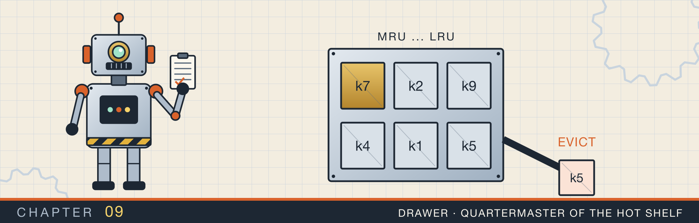
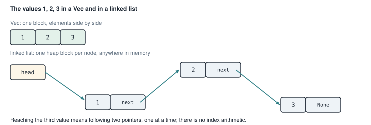
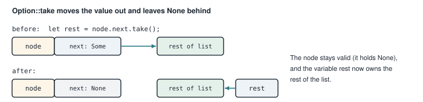
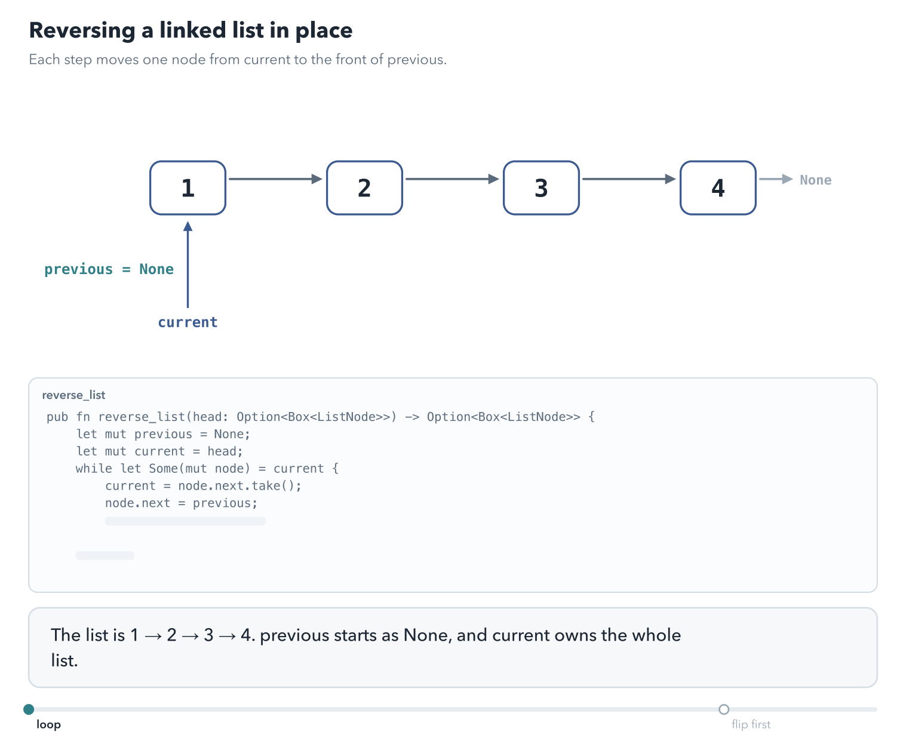
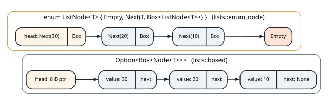
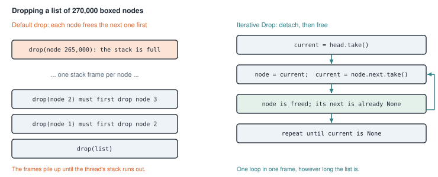
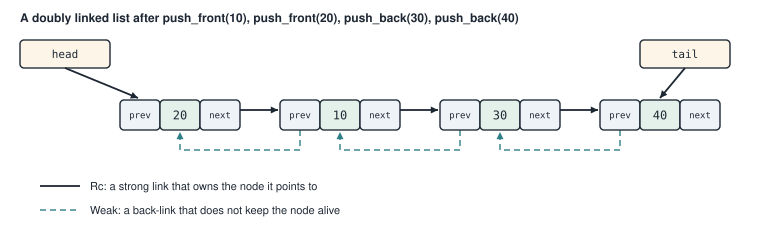

# Linked lists

<div class="covers" markdown="1">

This chapter covers

- What a linked list is, and how it differs from a `Vec` in memory
- Moving ownership of nodes with `Option::take` and `std::mem::replace`
- Reversing a list in place
- Four ways to write a list node, measured against each other
- Why dropping a long list can crash the program, and how to prevent it
- A doubly linked list built from `Rc`, `RefCell`, and `Weak`

</div>

Chapter 8 introduced the pointer types. This chapter uses them to build the classic linked structure, the
linked list. Linked lists are a good first test of ownership. Each operation moves a node from one owner to another,
and the compiler checks every move.

The chapter goes from simple to hard. First a singly linked list, where each node points only to the next,
and an algorithm that reverses it. Then four ways to write the same list, and a benchmark that compares them.
The benchmark finds a size at which the list crashes the program when it is dropped. After explaining and
fixing that, the chapter ends with a doubly linked list, where each node also points back to the one before.

## 9.1 What a linked list is

A **linked list** stores a sequence of values in separate nodes. Each **node** holds one value and a pointer
to the next node. The list itself holds a pointer to the first node, called the **head**. The last node's
pointer is empty, which marks the end.

Figure 9.1 compares a linked list with a `Vec` holding the same three values.

<figure>

<figcaption><b>Figure 9.1</b> A <code>Vec</code> stores its values next to each other. A linked list stores each value in its own heap block and connects the blocks with pointers.</figcaption>
</figure>

The two structures are good at different things:

| Operation | `Vec` | Singly linked list |
|---|---|---|
| Read the value at position i | O(1): compute the address | O(i): follow i pointers |
| Add or remove at the front | O(n): shift every element | O(1): change the head pointer |
| Add at the end | amortized O(1) | O(n), unless the list keeps a tail pointer |
| Memory per value | the value | the value, a pointer, and a heap block's overhead |

In practice, a `Vec` is faster for most work. Its values are next to each other in memory, and the
processor reads nearby memory quickly; chapter 15 measures that effect. The techniques you learn here for
moving nodes between owners carry over to the trees and graphs of chapters 11 and 12.

In Rust, a node owns the next node through a `Box`, and the "empty" pointer at the end is `None`. So a node's
`next` field has type `Option<Box<Node>>`.

## 9.2 Moving nodes: `take` and `replace`

Every list operation moves a node from one owner to another. Rust has a rule that makes this tricky. You cannot move a value out of a place that you only borrowed.
That would leave the place empty, and the owner would later find garbage there.

Two standard functions solve this by putting something valid in the place as they take the value out:

- `option.take()` returns the value inside an `Option` and leaves `None` in its place.
- `std::mem::replace(&mut place, new_value)` returns the old value and puts `new_value` in its place.

Figure 9.2 shows `take` on a node's `next` field.

<figure>

<figcaption><b>Figure 9.2</b> <code>node.next.take()</code> moves the rest of the list out of the node into a variable, and leaves <code>None</code> behind.</figcaption>
</figure>

You will see these two calls in almost every listing of this chapter.

## 9.3 Reversing a list

**The problem.** Given the list 1 → 2 → 3 → 4, turn it into 4 → 3 → 2 → 1. Change the pointers; do not
copy the values.

**The idea.** Walk the list from the front. Keep two variables: `previous`, the part already reversed, and
`current`, the part not yet visited. At each step, take the first node of `current`, point it at `previous`,
and make it the new front of `previous`. Figure 9.3 shows the state after two steps.

<figure>

<figcaption><b>Figure 9.3</b> Halfway through. <code>previous</code> owns the reversed part (2 → 1), and <code>current</code> owns the rest (3 → 4).</figcaption>
</figure>

<figure class="anim">

<figcaption><b>Animation 9.3</b> The loop, one node per frame. Each frame saves <code>next</code>, turns the node's link around, then advances <code>previous</code> and <code>current</code>. The teal links are the ones already reversed. No node is copied and no node is allocated; the list is rearranged in place, so the extra memory is three bindings.</figcaption>
</figure>

First, the node type and two helpers for building and reading lists:

<p class="listing"><b>Listing 9.1</b> The node and two helpers (lines 1 to 33). <a href="https://github.com/arpanpathak/cracking-the-systems-programming-interview/blob/prep-v2/rust-interview-lab/src/problems/linked_list.rs">src/problems/linked_list.rs</a></p>

```rust
{{#include ../../rust-interview-lab/src/problems/linked_list.rs:1:33}}
```

`from_slice` builds a list from a slice. It walks the slice backward, putting each value in front of the list
built so far. The last value pushed is `values[0]`, so it ends up first. Building from the back means it never
needs a pointer to the end of the list.

`to_vec` reads a list into a `Vec`. It takes the list by value and consumes it. In `while let Some(node) =
current`, each pass moves one box out of `current`. `current = node.next` then moves the rest of the list out
of that node before the node is freed.

Now the reversal:

<p class="listing"><b>Listing 9.2</b> Reversing the list (lines 35 to 46).</p>

```rust
{{#include ../../rust-interview-lab/src/problems/linked_list.rs:35:46}}
```

Each pass through the loop does three moves:

1. `current = node.next.take();` takes the rest of the list out of the node, as in figure 9.2.
2. `node.next = previous;` points the node at the reversed part.
3. `previous = Some(node);` makes the node the front of the reversed part.

Trace it on 1 → 2 → 3:

| After pass | `previous` | `current` |
|---|---|---|
| start | None | 1 → 2 → 3 |
| 1 | 1 | 2 → 3 |
| 2 | 2 → 1 | 3 |
| 3 | 3 → 2 → 1 | None |

At no moment do two variables own the same node, which is why the compiler accepts the code. The function
visits each node once, so it is O(n), and it uses O(1) extra memory.

<p class="listing"><b>Listing 9.3</b> The complete file. <a href="https://github.com/arpanpathak/cracking-the-systems-programming-interview/blob/prep-v2/rust-interview-lab/src/problems/linked_list.rs">src/problems/linked_list.rs</a></p>

```rust
{{#include ../../rust-interview-lab/src/problems/linked_list.rs}}
```

The tests reverse a four-element list, an empty list, and a one-element list.

## 9.4 A list written as an enum

The first list separated the node type from the `Option` that marks the end. Another way puts both into one
enum: a list is either empty, or a node holding a value and the rest of the list.

<p class="listing"><b>Listing 9.4</b> The list type (lines 1 to 13). <a href="https://github.com/arpanpathak/cracking-the-systems-programming-interview/blob/prep-v2/rust-interview-lab/src/bin/singly_linked_list.rs">src/bin/singly_linked_list.rs</a></p>

```rust
{{#include ../../rust-interview-lab/src/bin/singly_linked_list.rs:1:13}}
```

`List<T>` is **generic**. The `T` is a placeholder for the type of the values, so the same code works for
a list of numbers or of strings. `type Link<T> = Box<List<T>>;` gives the boxed rest of the list a short name.

<p class="listing"><b>Listing 9.5</b> Creating, checking, and measuring (lines 16 to 29).</p>

```rust
{{#include ../../rust-interview-lab/src/bin/singly_linked_list.rs:16:29}}
```

`len` counts the nodes recursively: an empty list has length 0, and a node adds 1 to the length of the rest.
Each call waits for the next, so a list of n nodes uses n stack frames. Section 9.6 shows where that ends.

<p class="listing"><b>Listing 9.6</b> Adding and removing at the front (lines 31 to 49).</p>

```rust
{{#include ../../rust-interview-lab/src/bin/singly_linked_list.rs:31:49}}
```

Both methods take `&mut self`, so they change the list in place. They use `std::mem::replace` from section 9.2. The method cannot move the old list out of `*self` and assign a new one later. Between those two steps,
`*self` would be empty. `replace(self, List::Empty)` puts a temporary `Empty` in place
and hands back the old list in one step.

`push_front` wraps the old list in a new node with the new value, and writes it back into `*self`.

`pop_front` matches on the old list. If it was `Empty`, there is nothing to pop, and `*self` is already `Empty`
again. If it was a `Node`, the method writes the rest of the list back into `*self` with `*self = *next`, and
returns the value. `*next` moves the list out of its `Box`.

<p class="listing"><b>Listing 9.7</b> The complete program. <a href="https://github.com/arpanpathak/cracking-the-systems-programming-interview/blob/prep-v2/rust-interview-lab/src/bin/singly_linked_list.rs">src/bin/singly_linked_list.rs</a></p>

```rust
{{#include ../../rust-interview-lab/src/bin/singly_linked_list.rs}}
```

`main` pushes three values and pops them back in reverse order, the last one pushed coming out first. A list
that adds and removes at the same end behaves as a stack, like the `Vec` in chapter 3.

```text
$ cargo run --bin singly_linked_list
ok
```

## 9.5 Four node layouts, measured

Section 9.3 wrote a node as a struct with an `Option<Box<Node>>`, and section 9.4 wrote the list as an enum.
Which is faster? To answer, the benchmark in this section puts four versions of the same list behind one **trait**. Then
one piece of code can measure them all.

### 9.5.1 One trait for four lists

<p class="listing"><b>Listing 9.8</b> The trait every list implements. <a href="https://github.com/arpanpathak/cracking-the-systems-programming-interview/blob/prep-v2/rust-interview-lab/benchmarking_examples/lists/mod.rs">benchmarking_examples/lists/mod.rs</a></p>

```rust
{{#include ../../rust-interview-lab/benchmarking_examples/lists/mod.rs}}
```

The trait lists the operations: `new`, `push_front`, `pop_front`, `is_empty`, and `variant`, which returns a
name for printing. `SinglyList<T>: Sized` limits the trait to types whose size is known at compile time. The benchmark uses
the trait only through generic functions, so the limit costs nothing. The four `pub mod` lines declare the four versions, each in its own
file.

The first two versions are the struct form and the enum form:

<p class="listing"><b>Listing 9.9</b> <code>Option&lt;Box&lt;Node&lt;T&gt;&gt;&gt;</code>. <a href="https://github.com/arpanpathak/cracking-the-systems-programming-interview/blob/prep-v2/rust-interview-lab/benchmarking_examples/lists/boxed.rs">benchmarking_examples/lists/boxed.rs</a></p>

```rust
{{#include ../../rust-interview-lab/benchmarking_examples/lists/boxed.rs}}
```

<p class="listing"><b>Listing 9.10</b> <code>enum ListNode&lt;T&gt; { Empty, Next(T, Box&lt;ListNode&lt;T&gt;&gt;) }</code>. <a href="https://github.com/arpanpathak/cracking-the-systems-programming-interview/blob/prep-v2/rust-interview-lab/benchmarking_examples/lists/enum_node.rs">benchmarking_examples/lists/enum_node.rs</a></p>

```rust
{{#include ../../rust-interview-lab/benchmarking_examples/lists/enum_node.rs}}
```

The two files implement the trait with `impl<T> SinglyList<T> for LinkedList<T>`. Each uses the tool from
section 9.2 that fits its type: `take()` on the `Option` in the struct version, and `mem::replace` on the enum.

### 9.5.2 What each node costs in memory

Figure 9.4 draws both lists after pushing 10, 20, and 30.

<figure>

<figcaption><b>Figure 9.4</b> The two layouts after three pushes. The struct list's head is one pointer. The enum list keeps its first node inside the list value itself and ends with a heap-allocated <code>Empty</code>.</figcaption>
</figure>

On a 64-bit machine, with `u64` values, each node is 16 bytes in both versions: 8 for the value and 8 for the
pointer. `Option<Box<Node>>` is only 8 bytes, because a `Box` is never null, so Rust uses the null address to
mean `None`. The enum gets the same treatment, using a null `Box` to mean `Empty`.

The versions still differ in two ways. The enum list keeps its first node, 16 bytes, inside the list value. So every push moves those 16 bytes
into a new box, where the struct version moves one 8-byte pointer. And the enum
chain ends with a boxed `Empty`, so a list of n values makes n + 1 allocations instead of n.

Two small programs exercise the two versions:

<p class="listing"><b>Listing 9.11</b> Demos of the two versions. <a href="https://github.com/arpanpathak/cracking-the-systems-programming-interview/blob/prep-v2/rust-interview-lab/benchmarking_examples/list_box.rs">benchmarking_examples/list_box.rs</a> and <a href="https://github.com/arpanpathak/cracking-the-systems-programming-interview/blob/prep-v2/rust-interview-lab/benchmarking_examples/list_enum.rs">list_enum.rs</a></p>

```rust
{{#include ../../rust-interview-lab/benchmarking_examples/list_box.rs}}
```

```rust
{{#include ../../rust-interview-lab/benchmarking_examples/list_enum.rs}}
```

`use systems_lab::lists::...` imports the lists from the crate's library, where `src/lib.rs` declares them.
So the four programs share one compiled copy of the list code.

## 9.6 When dropping a list crashes

Here is a short program built on the struct version:

```rust
let mut list = boxed::LinkedList::new();
for value in 0..270_000u64 {
    list.push_front(value);
}
// list goes out of scope here and is dropped
```

It builds the list without trouble, and then it crashes at the closing brace:

```text
thread 'main' has overflowed its stack
fatal runtime error: stack overflow, aborting
```

None of the list's methods is recursive. The recursion is in the code the compiler generates to drop the list.
To drop the list, Rust drops `head`. To drop a `Box<Node>`, it drops the node, which means dropping its fields,
including `next`, another `Box<Node>`. That drops the next node, and so on. Each step is a function call
nested inside the previous one, so each node adds one stack frame (figure 9.5, left).

<figure>

<figcaption><b>Figure 9.5</b> The default drop nests one call per node. A hand-written <code>Drop</code> detaches each node's successor first, so freeing one node never frees another.</figcaption>
</figure>

The main thread's stack is 8 MiB on most systems. The crash happened between 260,000 and 270,000 nodes, so
each level of nesting used about 32 bytes of stack. A thread you start with `std::thread::spawn` gets a 2 MiB stack by default. On such a thread the limit
would be about a quarter as many nodes.

The fix is to write the list's `Drop` yourself, as a loop. **`Drop`** is a trait. Rust calls its `drop` method when a value goes out of scope. If you implement it, your code runs before the fields are dropped.

<p class="listing"><b>Listing 9.12</b> The struct version with its own <code>Drop</code>. <a href="https://github.com/arpanpathak/cracking-the-systems-programming-interview/blob/prep-v2/rust-interview-lab/benchmarking_examples/lists/boxed_drop.rs">benchmarking_examples/lists/boxed_drop.rs</a></p>

```rust
{{#include ../../rust-interview-lab/benchmarking_examples/lists/boxed_drop.rs}}
```

The operations are the same as listing 9.9. Only the `Drop` implementation at the end is new. Its loop reads:

1. `let mut current = self.head.take();` takes the whole chain out of the list.
2. `while let Some(mut node) = current` moves the first box out of `current`.
3. `current = node.next.take();` moves the rest of the chain out of that node.
4. At the end of the loop body, `node` goes out of scope and is freed. Its `next` is already `None`, so freeing
   it frees nothing else.

The loop runs in one stack frame, whatever the length of the list.

<p class="listing"><b>Listing 9.13</b> The enum version with its own <code>Drop</code>. <a href="https://github.com/arpanpathak/cracking-the-systems-programming-interview/blob/prep-v2/rust-interview-lab/benchmarking_examples/lists/enum_drop.rs">benchmarking_examples/lists/enum_drop.rs</a></p>

```rust
{{#include ../../rust-interview-lab/benchmarking_examples/lists/enum_drop.rs}}
```

The enum version does the same with `mem::replace` and a `while let ListNode::Next(_, next) = current` loop.
`current = *next;` moves the rest of the chain out of the box. Assigning to `current` drops its old value, a
`Next` whose box has already been emptied, so again nothing nests.

A third demo builds a list of five million nodes and drops it:

<p class="listing"><b>Listing 9.14</b> Five million nodes, dropped with a loop. <a href="https://github.com/arpanpathak/cracking-the-systems-programming-interview/blob/prep-v2/rust-interview-lab/benchmarking_examples/list_drop.rs">benchmarking_examples/list_drop.rs</a></p>

```rust
{{#include ../../rust-interview-lab/benchmarking_examples/list_drop.rs}}
```

## 9.7 The benchmark

The benchmark program measures all four versions with one generic function. The full program also measures
the caches of chapter 13, and is listed there. This is the part that measures the lists.

<p class="listing"><b>Listing 9.15</b> The list benchmark (lines 159 to 235). <a href="https://github.com/arpanpathak/cracking-the-systems-programming-interview/blob/prep-v2/rust-interview-lab/benchmarking_examples/benchmark.rs">benchmarking_examples/benchmark.rs</a></p>

```rust
{{#include ../../rust-interview-lab/benchmarking_examples/benchmark.rs:159:235}}
```

`run_list::<L: SinglyList<u64>>` is **generic** over the list type `L`. The compiler generates a separate copy of the function for each list type. So each list is measured with
its own code.

The function follows three rules that apply to any small benchmark:

1. **Warm up first.** The first time a program allocates a lot of memory, the operating system has to supply
   fresh pages, which is slow. A warm-up pass pays that cost before timing starts.
2. **Run several times and keep the fastest.** Other programs can slow a run down but never speed it
   up. So the fastest run is the closest to the true cost.
3. **Check the result before trusting the time.** Every run pops all the values and checks their order. A
   broken list cannot report a fast time.

`std::hint::black_box(expected)` tells the compiler to treat the value as used, so it cannot delete the loop
that computed it.

These results come from a release build on an 8-core aarch64 development board:

| list | how it drops | 260,000 nodes | 270,000 nodes |
|---|---|---|---|
| `box` | recursively | completed | crashed |
| `enum` | recursively | completed | crashed |
| `box+drop` | with a loop | completed | completed |
| `enum+drop` | with a loop | completed | completed |

```text
  variant        elements          push          drop
  ----------------------------------------------------
  box             200,000        2.40ms        3.23ms
  enum            200,000        3.42ms        3.20ms
  box+drop        200,000        2.32ms        2.91ms
  enum+drop       200,000        3.62ms        2.52ms

  box+drop      5,000,000       58.11ms       72.32ms
  enum+drop     5,000,000       90.98ms       67.51ms
```

Read the table this way:

- A push costs about 12 nanoseconds for the struct node and about 17 for the enum node. Section 9.5.2 gave
  two differences that could explain the gap. The benchmark does not measure them separately.
- `box` and `box+drop` share the same push code, and their push times agree, 2.40 against 2.32 ms. That
  agreement is a sign the measurement is stable.
- The loop drop is not much faster than the recursive one. Its purpose is to remove the size limit, not to
  save time.

You can reproduce the crash and the fix:

```bash
cargo run --release --bin benchmark list box 260000   # completes
cargo run --release --bin benchmark list box 270000   # crashes
cargo run --release --bin list_drop                   # five million nodes, no crash
```

## 9.8 A doubly linked list

In a **doubly linked list**, each node points to the next node and also back to the previous one. That lets
you add and remove at both ends in O(1), and walk the list in either direction.

In Rust this creates an ownership problem. Every node in the middle is pointed to twice: by the previous
node's `next` and by the following node's `prev`. A `Box` has exactly one owner, so it cannot express this.

The solution uses the three types from chapter 8. Nodes live in `Rc<RefCell<Node>>`, so they can have more than
one handle and still be changed. The forward links, `next`, are strong `Rc` handles, so the list owns its nodes
from front to back. The backward links, `prev`, are `Weak` handles, so they do not create reference cycles
(figure 9.6).

<figure>

<figcaption><b>Figure 9.6</b> Strong links run forward and weak links run backward. If the back-links were strong, every pair of neighbors would form a cycle and no node would ever be freed.</figcaption>
</figure>

### 9.8.1 The types

<p class="listing"><b>Listing 9.16</b> Type names, the node, and the list (lines 1 to 26). <a href="https://github.com/arpanpathak/cracking-the-systems-programming-interview/blob/prep-v2/rust-interview-lab/src/bin/ll.rs">src/bin/ll.rs</a></p>

```rust
{{#include ../../rust-interview-lab/src/bin/ll.rs:1:25}}
```

The full type of a link is `Option<Rc<RefCell<Node<T>>>>`. It appears in almost every function, so the file
names it once, `OptNodeRef<T>`, with a `type` alias. The list keeps a `head`, a `tail`, and its length.

### 9.8.2 Adding at either end

<p class="listing"><b>Listing 9.17</b> <code>new</code>, <code>len</code>, and <code>push_front</code> (lines 28 to 69).</p>

```rust
{{#include ../../rust-interview-lab/src/bin/ll.rs:28:69}}
```

`push_front` creates the new node, then looks at the old head with `self.head.take()`:

- If there was an old head, its `prev` becomes a weak link to the new node, made with `Rc::downgrade`.
  The new node's `next` becomes the old head.
- If there was no old head, the list was empty, so the new node is also the tail. `new_node.clone()` makes a
  second strong handle for `tail`.

Finally the new node becomes the head, and the length grows by one. `borrow_mut()` is the `RefCell` method
from section 8.4. Each call is released at the end of its statement, so no two borrows of the same node
overlap.

<p class="listing"><b>Listing 9.18</b> <code>push_back</code> (lines 71 to 93).</p>

```rust
{{#include ../../rust-interview-lab/src/bin/ll.rs:71:93}}
```

`push_back` mirrors it at the other end. The new node's `prev` is set as it is created:
`self.tail.as_ref().map(Rc::downgrade)`. `as_ref()` turns `Option<Rc<...>>` into `Option<&Rc<...>>`, so the
tail is looked at without being moved. `map(Rc::downgrade)` turns that reference into a weak link.

### 9.8.3 Removing from either end

<p class="listing"><b>Listing 9.19</b> <code>pop_front</code> (lines 95 to 122).</p>

```rust
{{#include ../../rust-interview-lab/src/bin/ll.rs:95:122}}
```

`pop_front` must return the value by ownership, not a reference. To move the value out, the node itself must
be moved out of its `Rc`, and `Rc::try_unwrap` does that. It succeeds only if the handle is the last strong
one. So the method first removes every other strong link to the node:

1. `self.head.take()` removes the list's link to it.
2. The next node's `prev` is set to `None`. That link was weak, so it did not count anyway.
3. If there was no next node, the list is now empty, so `self.tail` is cleared, removing the tail's link.

Now `Rc::try_unwrap(old_head)` succeeds, and `.into_inner()` moves the `Node` out of its `RefCell`.

The call is written `.ok().unwrap()` rather than `.unwrap()`. `Result::unwrap` needs to print the error if it
fails, which requires the error type to implement `Debug`. Here the error type is the `Rc` itself, and `Node`
does not implement `Debug`, so `.unwrap()` would not compile. `.ok()` turns the `Result` into an `Option`,
whose `unwrap` needs no `Debug`.

<p class="listing"><b>Listing 9.20</b> <code>pop_back</code> (lines 124 to 147).</p>

```rust
{{#include ../../rust-interview-lab/src/bin/ll.rs:124:147}}
```

`pop_back` mirrors `pop_front`. It follows the weak `prev` link with `upgrade()`, which returns `None` if the
previous node is gone, then clears that node's `next`.

### 9.8.4 Looking without removing

<p class="listing"><b>Listing 9.21</b> <code>peek_front</code> and <code>peek_back</code> (lines 149 to 171).</p>

```rust
{{#include ../../rust-interview-lab/src/bin/ll.rs:149:170}}
```

`peek_front` returns `Option<Ref<'_, T>>`, not `Option<&T>`. The value is inside a `RefCell`, and a reference
to it is only safe while the cell's borrow is active. A `Ref` is the guard that keeps the borrow active, as
section 8.4 showed. `Ref::map` narrows a guard for the whole node into a guard for its `data` field. The
caller reads the value with `*`, as `main` does.

### 9.8.5 The complete program

<p class="listing"><b>Listing 9.22</b> The complete program, with its tests. <a href="https://github.com/arpanpathak/cracking-the-systems-programming-interview/blob/prep-v2/rust-interview-lab/src/bin/ll.rs">src/bin/ll.rs</a></p>

```rust
{{#include ../../rust-interview-lab/src/bin/ll.rs}}
```

```text
$ cargo run --bin ll
Length: 4
Front: 20
Back: 40
Pop front: Some(20)
Pop back:  Some(40)
Popped: 10
Popped: 30
Empty? true
```

The test `alternating_push_pop_keeps_invariants` pushes 100 values at each end, then pops from both ends and
checks every value. The comment block at the end of the file lists each standard-library method the file
uses, with a one-line description.

This list costs more than the singly linked list. Each node needs a heap block, two counts, and a borrow
flag, and every access is checked. It also keeps the recursive drop from section 9.6, because dropping the head drops the
next `Rc`, which drops the next node. Chapter 13 avoids both costs for an LRU cache by storing its nodes in a
`Vec` and linking them by index.

<div class="summary" markdown="1">

## Summary

- A linked list stores each value in its own node and links the nodes with pointers. It adds and removes at
  the front in O(1), but reaching position i takes O(i).
- `Option::take` and `std::mem::replace` move a value out of a place and leave a valid value behind. List
  code uses them to move nodes between owners.
- Reversing a list moves three owners per node: take the rest, point the node back, make it the new front.
- A list can be a struct with `Option<Box<Node>>` or an enum. Both nodes are 16 bytes for `u64` values.
- The compiler-generated drop of a `Box` list recurses once per node and overflows the stack for long lists.
  A hand-written `Drop` loop removes the limit.
- A benchmark should warm up, keep the fastest of several runs, and check its results.
- A doubly linked list needs `Rc<RefCell<Node>>` with strong forward links and `Weak` back-links.

</div>

Chapter 10 uses the singly linked list from section 9.3 to merge many sorted lists into one, and compares ten
ways of doing it.

## Exercises

1. Write `len` for the enum list of section 9.4 with a loop instead of recursion.
2. Implement `Iterator` for the struct list of section 9.3, with an `iter()` method that yields `&i32`.
3. Implement `Drop` for the doubly linked list, and test it with one million nodes.
4. Build a doubly linked list whose nodes live in a `Vec`, with `Option<usize>` indexes as links. Compare its
   push and pop times with the `Rc` version.
