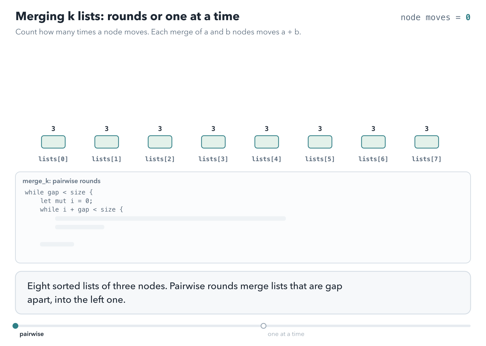

# Merging k sorted lists

<div class="covers" markdown="1">

This chapter covers

- Merging two sorted linked lists by moving nodes, not copying values
- Three strategies for merging many lists, and why two of them are much faster than the third
- A merge that swaps two lists by value, so that only one mutable reference remains
- Borrowing two elements of one `Vec` at the same time with `split_at_mut`
- A heap of list heads, and a recursion on halves

</div>

Chapter 9 built singly linked lists and moved their nodes between owners with `take`. Here you have k linked
lists, each already sorted, and you want one sorted list that contains all their nodes.

Section 10.2 compares three orders of merging. Sections 10.3 to 10.6 implement them, and section 10.7 lists the
time and memory each program needs. Appendix C keeps the first, much longer version of this chapter, with eleven
programs.

Two letters appear throughout. **k** is the number of lists. **N** is the total number of nodes across all of
them.

## 10.1 Merging two sorted lists

Every program in this chapter merges two sorted lists at a time. Compare the front nodes of the
two lists. Move the smaller one to the end of the output. Repeat until one list is empty, then attach the
other list whole. Figure 10.1 works through an example.

<figure>

<figcaption><b>Figure 10.1</b> Merging two sorted lists. Each step moves one node, so merging lists of lengths a and b takes a + b steps.</figcaption>
</figure>

With linked lists, "move a node to the output" does not copy the value. It detaches the node from the front of

## 10.2 Three strategies for k lists

Figure 10.2 shows three ways to extend two-list merging to k lists.

<figure>

<figcaption><b>Figure 10.2</b> The first strategy walks its growing result again and again. The other two touch each node only about log₂ k times.</figcaption>
</figure>

**One at a time.** Merge list 2 into list 1, then list 3 into the result, and so on. Each merge walks the
whole result so far, which keeps growing. The first nodes are walked k times, so the total is about O(kN).

**Pairwise rounds.** Merge the lists in pairs, like the rounds of a tournament. After the first round there are
k / 2 lists, after the second k / 4, and so on. In every round, each node takes part in exactly one merge. There
are about log₂ k rounds, so the total is O(N log k).

**A heap of heads.** Put the front node of each list into a min-heap, the structure from chapter 5. Pop the
smallest, append it to the output, and push the next node from the same list. Each node goes through one push and one pop on a heap of at most k entries. Each costs O(log k), so the
total is again O(N log k).

Animation 10.1 counts node moves for eight lists of three nodes: pairwise rounds against one list at a time.

<figure class="anim">
<video class="motion" src="figures/ch10-merge-gap.mp4" autoplay loop muted playsinline preload="metadata" aria-label="Eight bars, lists[0] to lists[7], each of three nodes, and a counter of node moves. Pairwise: with gap 1, four merges of 3 and 3 take 24 moves; with gap 2, two merges of 6 and 6 take 24 more; with gap 4, one merge of 12 and 12 takes 24, and lists[0] holds all 24 nodes after 72 moves. Then one at a time: each list is merged into the growing lists[0], and the moves add up 6, 9, 12, up to 24, for 105 in total." data-chapters="[[0.0, &quot;pairwise&quot;], [25.02, &quot;one at a time&quot;]]"></video>
<figcaption><b>Animation 10.1</b> Pairwise rounds move each node once per round, log₂ 8 = 3 rounds: 72 moves. One at a time walks the growing result again and again: 105 moves for the same 24 nodes.</figcaption>
</figure>

For 100 lists of 10,000 nodes each, N is a million. O(kN) is about 100 million steps. O(N log k) is about 7
million.

The pairwise strategy has a compact in-place form. It keeps the lists in a `Vec` and merges positions that are a
growing **interval** apart (figure 10.3). The code in section 10.3 calls the interval `gap`.

<figure>

<figcaption><b>Figure 10.3</b> Interval rounds on five lists. The interval doubles each round, and the result collects in <code>lists[0]</code>.</figcaption>
</figure>

In each round, the list at position `i` absorbs the list at `i + interval`. The position `i` runs through
0, 2 × interval, 4 × interval, and so on. The odd list out, number 4 here, waits until the interval is large enough to reach it.

## 10.3 Merging with the lists swapped by value

The merge builds its output after a placeholder node, the **dummy** head, so the first real node needs no special
case. `tail` always points at the last node of the output (figure 10.4).

<figure>

<figcaption><b>Figure 10.4</b> The dummy node gives the output a fixed starting point. <code>tail</code> always points at the last node, where the next one is attached.</figcaption>
</figure>

`merge_two` takes both lists by value. When the right list has the smaller front node, the two lists swap, so
`left` always holds the node to move. The only mutable reference is `tail`. This keeps the loop readable and
reduces the mutable borrow fatigue: there is one borrow to follow.

<p class="listing"><b>Listing 10.1</b> The node type and <code>merge_two</code> (lines 4 to 27). <a href="https://github.com/arpanpathak/cracking-the-systems-programming-interview/blob/prep-v2/rust-interview-lab/src/bin/merge_k_sorted_lists_owned.rs">src/bin/merge_k_sorted_lists_owned.rs</a></p>

```rust
{{#include ../../rust-interview-lab/src/bin/merge_k_sorted_lists_owned.rs:4:27}}
```

`while let (Some(l), Some(r)) = (&left, &right)` runs while both lists have a node. `&left` and `&right` are
shared references, used only to read the two front values.

If the right front is smaller, `(left, right) = (right, left)` swaps the two lists. The assignment moves the two
`Option` values; no node moves, and no reference is taken. After it, the smaller front node is always in `left`.

`left.unwrap()` moves that list out of `left`. It cannot fail, because the `while let` checked that
`left` is `Some`. `node.next.take()` cuts the front node off, and the rest of the list goes back into `left`.

`tail.next.insert(node)` attaches the node at the end of the output and returns a mutable reference to
it. That node is the new `tail`.

When the loop ends, one list is empty. `left.or(right)` returns the other one, and `tail.next` takes it whole.

Animation 10.2 runs `merge_two` one line at a time on the lists of the trace below. The table beside the lists
shows what each variable owns or borrows after every line. The last part reads `l` after the swap, which does not
compile.


<figure class="anim">
<video class="motion" src="figures/ch10-merge-trace.mp4" autoplay loop muted playsinline preload="metadata" aria-label="Rows for left, right, node, and the output, which starts at a dummy node; a table of the variables left, right, l, r, node, dummy, and tail with what each owns or borrows; and the code of merge_two with the running line highlighted. Each pass shows while let binding l and r as shared borrows of the two front nodes, the comparison where those borrows end, the swap when the right front is smaller, left.unwrap moving the whole list into node so that left is moved out, node.next.take returning the rest to left, and insert moving the node to the end of the output while tail moves on. After four passes, left.or(right) attaches 5 and dummy.next returns 1, 2, 3, 4, 5. Last, a loop that reads l after the swap fails with error E0506, cannot assign to left because it is borrowed, and E0505, cannot move out of left because it is borrowed." data-chapters="[[0.0, &quot;set up&quot;], [17.59, &quot;pass 1&quot;], [57.67, &quot;pass 2&quot;], [100.87, &quot;pass 3&quot;], [133.99, &quot;pass 4&quot;], [175.03, &quot;the end&quot;], [204.55, &quot;l after the swap&quot;]]"></video>
<figcaption><b>Animation 10.2</b> <code>merge_two</code> line by line. <code>l</code> and <code>r</code> borrow the front nodes until the comparison. <code>unwrap</code> moves the list into <code>node</code>, and <code>take</code> returns the rest to <code>left</code>. <code>tail</code> is the only mutable reference. Reading <code>l</code> after the swap does not compile.</figcaption>
</figure>

Trace the merge of 1 → 4 with 2 → 3 → 5:

| Pass | `left` | `right` | Swap? | Node moved | Output after `dummy` |
|---|---|---|---|---|---|
| 1 | 1 → 4 | 2 → 3 → 5 | no | 1 | 1 |
| 2 | 4 | 2 → 3 → 5 | yes: 2 < 4 | 2 | 1 → 2 |
| 3 | 3 → 5 | 4 | no | 3 | 1 → 2 → 3 |
| 4 | 5 | 4 | yes: 4 < 5 | 4 | 1 → 2 → 3 → 4 |
| 5 | None | 5 | the loop ends; `or` attaches 5 | | 1 → 2 → 3 → 4 → 5 |

Each pass moves one node, so merging n nodes takes O(n) time. The merge uses O(1) extra memory, and allocates
only the dummy node.

<p class="listing"><b>Listing 10.2</b> <code>merge_k</code> (lines 29 to 47).</p>

```rust
{{#include ../../rust-interview-lab/src/bin/merge_k_sorted_lists_owned.rs:29:47}}
```

`merge_k` follows figure 10.3. The outer `while` doubles `gap`. The inner `while` steps `i` by `gap * 2` and merges
position `i` with position `i + gap`. `lists[i].take()` moves each list out of its slot and leaves `None`, so
`merge_two` receives two owned lists.

Animation 10.3 runs the merge of the trace. The last part leaves out the line after the loop.

<figure class="anim">
<video class="motion" src="figures/ch10-merge-owned.mp4" autoplay loop muted playsinline preload="metadata" aria-label="Rows for left and right, and an output row that starts at a dummy node, with a tail marker at its end. Each pass compares the two front nodes; when right's front is smaller, the two rows trade places. Then the front node of left moves to the end of the output, and the rest of its list stays in left. After pass 4, left is empty and the loop ends; left.or(right) attaches the remaining 5, and the output reads 1, 2, 3, 4, 5. Last, with that line struck out, the output stops at 4 and node 5 is dropped." data-chapters="[[0.0, &quot;merge&quot;], [30.16, &quot;no or&quot;]]"></video>
<figcaption><b>Animation 10.3</b> When the right front is smaller, the two lists swap, so <code>left</code> always holds the next node. When one list runs out, <code>or</code> attaches the other. Without that line, the nodes left in <code>right</code> are dropped.</figcaption>
</figure>

```text
$ cargo run --bin merge_k_sorted_lists_owned
[0, 1, 2, 3, 4, 5, 6, 7, 8, 9]
[1, 1, 1, 3, 5]
[]
```

The complete program is listing 10.5 at the end of the chapter.

## 10.4 Borrowing two elements of one `Vec`

`merge_k` moves both lists out of the vector before the call. A merge that takes two `&mut` lists instead cannot be
called on two slots of the same vector:

```rust
merge_two(&mut lists[i], &mut lists[i + gap]) // does not compile
```

Both `&mut` borrows are borrows of the whole vector `lists`, and Rust allows only one mutable borrow of a value at
a time. The compiler does not reason about the two indexes being different.

`split_at_mut(i + gap)` splits the vector into two slices that do not overlap: the part before position `i + gap`,
and the rest. It returns a mutable borrow of each. In the long version of this chapter, listing C.1 merges this
way:

```rust
{{#include ../../rust-interview-lab/src/bin/merge_k_sorted_lists_divide.rs:26:27}}
```

Now `left[i]` and `right[0]` come from different slices, and borrowing both is allowed. Section 10.6 uses
`split_at_mut` to split a slice of lists in half.

## 10.5 A heap of list heads

This is the third strategy from figure 10.2. The heap does not hold nodes. It holds pairs of `(front value, list
number)`, wrapped in `Reverse` to make it a min-heap, as in chapter 5. Storing the list number instead of the
node keeps the nodes in their lists, and avoids needing an ordering on nodes.

<p class="listing"><b>Listing 10.3</b> <code>merge_k_lists</code> (lines 10 to 33). <a href="https://github.com/arpanpathak/cracking-the-systems-programming-interview/blob/prep-v2/rust-interview-lab/src/bin/merge_k_sorted_lists_heap.rs">src/bin/merge_k_sorted_lists_heap.rs</a></p>

```rust
{{#include ../../rust-interview-lab/src/bin/merge_k_sorted_lists_heap.rs:10:33}}
```

Each pass of the loop:

1. Pops the smallest pair. Its second field, `i`, says which list holds that value.
2. Takes the front node out of `lists[i]` and puts the rest of that list back.
3. If the list still has a node, pushes that node's value with `i`.
4. Attaches the taken node to the output with `tail.next.insert(node)`, as in listing 10.1.

When two fronts have equal values, the pairs compare by list number, so the lower-numbered list goes first.

The heap needs only the current front of each list. That makes this strategy the right one when the lists are too large to hold in memory, such as k
sorted files read line by line.

```text
$ cargo run --bin merge_k_sorted_lists_heap
1 1 2 3 4 4 5 6
```

The complete program is listing 10.6 at the end of the chapter.

## 10.6 Recursion on halves

This version merges from the top down. It splits the lists into two halves, merges each half recursively, and
merges the two results. Its node holds an `i32` named `val`, and `List` is the alias for a whole list:

```rust
{{#include ../../rust-interview-lab/src/bin/merge_k_sorted_lists_halves.rs:3:9}}
```

<p class="listing"><b>Listing 10.4</b> The merge and the recursion on a slice (lines 11 to 34). <a href="https://github.com/arpanpathak/cracking-the-systems-programming-interview/blob/prep-v2/rust-interview-lab/src/bin/merge_k_sorted_lists_halves.rs">src/bin/merge_k_sorted_lists_halves.rs</a></p>

```rust
{{#include ../../rust-interview-lab/src/bin/merge_k_sorted_lists_halves.rs:11:34}}
```

The first arm of `merge`, `(None, rest) | (rest, None) => rest`, handles an empty list on either side: the other
list is the answer. In the second arm, `mem::swap` makes `left` the list with the smaller front. Its node stays at
the front, and its `next` becomes the merge of the rest of `left` with `right`. No node is allocated; the boxes
move.

`merge_k_slice` works on a slice, `&mut [List]`, and splits it with `split_at_mut` from section 10.4. Splitting a
slice creates two views of the same memory, so nothing is allocated to split.

`merge` calls itself once for each node of its output. The last merge outputs all N nodes, so the stack reaches
O(N) frames. In section 9.6, a recursive drop overflowed the 8 MiB main-thread stack between 260,000 and 270,000
nodes. For long lists, use the loop of section 10.3.

```text
$ cargo run --bin merge_k_sorted_lists_halves
Input lists:
[1 -> 4 -> 5]
[1 -> 3 -> 4]
[2 -> 6]

Merged list:
[1 -> 1 -> 2 -> 3 -> 4 -> 4 -> 5 -> 6]
```

The complete program is listing 10.7 at the end of the chapter.

## 10.7 The three programs side by side

In the table, N is the total number of nodes and k the number of lists. The extra memory column counts memory
beyond the input `Vec` and the nodes. The stack column is the deepest the call stack goes, in frames.

| Program | Strategy | Time | Extra memory | Stack | Allocations | How a merge moves nodes |
|---|---|---|---|---|---|---|
| `merge_k_sorted_lists_owned` | gap rounds | O(N log k) | O(1) | O(1) | one dummy node per merge | lists swapped by value, so `tail` is the only `&mut` |
| `merge_k_sorted_lists_heap` | heap of heads | O(N log k) | O(k) | O(1) | one dummy node | list numbers in the heap, `Option::insert` |
| `merge_k_sorted_lists_halves` | recursive halves | O(N log k) | O(1) | O(N) | none | `split_at_mut`, recursive merge |

- **Time.** Each node moves about log₂ k times: O(N log k). The "one at a time" strategy of figure 10.2 would be
  O(kN).
- **Extra memory.** The heap holds one entry per list: O(k). The other two programs reuse the input `Vec`.
- **Stack.** The recursive merge makes one call per node of its output, so its stack reaches O(N) frames. The loop
  and the heap use a fixed number of frames.
- **Allocations.** The gap rounds allocate one dummy node per merge, k - 1 in total. The recursive merge allocates
  nothing.

## 10.8 The complete files

<p class="listing"><b>Listing 10.5</b> Gap rounds with the lists swapped by value. <a href="https://github.com/arpanpathak/cracking-the-systems-programming-interview/blob/prep-v2/rust-interview-lab/src/bin/merge_k_sorted_lists_owned.rs">src/bin/merge_k_sorted_lists_owned.rs</a></p>

```rust
{{#include ../../rust-interview-lab/src/bin/merge_k_sorted_lists_owned.rs}}
```

<p class="listing"><b>Listing 10.6</b> A heap of list heads. <a href="https://github.com/arpanpathak/cracking-the-systems-programming-interview/blob/prep-v2/rust-interview-lab/src/bin/merge_k_sorted_lists_heap.rs">src/bin/merge_k_sorted_lists_heap.rs</a></p>

```rust
{{#include ../../rust-interview-lab/src/bin/merge_k_sorted_lists_heap.rs}}
```

<p class="listing"><b>Listing 10.7</b> Recursion on halves. <a href="https://github.com/arpanpathak/cracking-the-systems-programming-interview/blob/prep-v2/rust-interview-lab/src/bin/merge_k_sorted_lists_halves.rs">src/bin/merge_k_sorted_lists_halves.rs</a></p>

```rust
{{#include ../../rust-interview-lab/src/bin/merge_k_sorted_lists_halves.rs}}
```

<div class="summary" markdown="1">

## Summary

- Merging two sorted lists moves the smaller front node to the output until one list is empty, in O(a + b).
- Merging k lists one at a time costs O(kN). Pairwise rounds and a heap of heads both cost O(N log k).
- Swapping the two lists by value keeps the smaller front in `left`, so `tail` is the only mutable reference.
- `Option::insert` attaches a node and returns a reference to it, so `tail` moves in one call.
- Two `&mut` borrows of one `Vec` do not compile. `split_at_mut` splits it into two slices that do not overlap.
- A heap of `(value, list number)` pairs needs only the front of each list, which suits lists read from disk.
- A recursive merge is short, but it recurses once per output node.

</div>

Chapter 11 moves from lists to trees, where each node has up to two children. It ends with tries, where
each node has one child per letter.

## Exercises

1. Write the "one at a time" merge and time it against listing 10.5 on 200 lists of 5,000 nodes each.
2. Make `merge_two` from listing 10.1 generic over any `T: Ord`.
3. Write a k-way merge of sorted text files with the heap strategy, keeping only one line per file in memory.
4. Rewrite `merge` from listing 10.4 as a loop with the swap of listing 10.1. Test it on two lists of a million
   nodes each.
