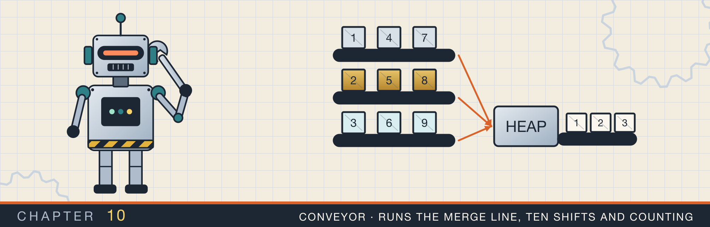

# Merging k sorted lists

<div class="covers" markdown="1">

This chapter covers

- Merging two sorted linked lists by moving nodes, not copying values
- Three strategies for merging many lists, and why two of them are much faster than the third
- Borrowing two elements of one `Vec` at the same time, and ways to avoid needing to
- The dummy head, the tail pointer, and `Option::insert`
- Ten implementations of the same task, compared

</div>

Chapter 9 built singly linked lists and moved their nodes between owners with `take`. This chapter applies those skills to one problem. You have k linked lists, each already sorted, and you
want one sorted list that contains all their nodes.

The problem is small, but it has several good solutions, and they differ in interesting ways. Some are faster
than others. Some move nodes; others allocate new ones. Some fight the borrow checker, and some avoid the
fight. This chapter walks through ten solutions, grouped by the strategy they use.

Two letters appear throughout. **k** is the number of lists. **N** is the total number of nodes across all of
them.

## 10.1 Merging two sorted lists

Everything in this chapter is built on merging two sorted lists, so start there. Compare the front nodes of the
two lists. Move the smaller one to the end of the output. Repeat until one list is empty, then attach the
other list whole. Figure 10.1 works through an example.

<figure>

<figcaption><b>Figure 10.1</b> Merging two sorted lists. Each step moves one node, so merging lists of lengths a and b takes a + b steps.</figcaption>
</figure>

With linked lists, "move a node to the output" does not copy the value. It detaches the node from the front of
its list and links it to the end of the output. No memory is allocated.

## 10.2 Three strategies for k lists

Figure 10.2 shows three ways to extend two-list merging to k lists.

<figure>

<figcaption><b>Figure 10.2</b> The first strategy walks its growing result again and again. The other two touch each node only about log₂ k times.</figcaption>
</figure>

**One at a time.** Merge list 2 into list 1, then list 3 into the result, and so on. Each merge walks the
whole result so far, which keeps growing. The first nodes are walked k times, so the total is about O(kN).

**Pairwise rounds.** Merge the lists in pairs, like the rounds of a tournament. After the first round there are
k / 2 lists, after the second k / 4, and so on. In every round, each node takes part in exactly one merge. There
are about log₂ k rounds, so the total is O(N log k).

**A heap of heads.** Put the front node of each list into a min-heap, the structure from chapter 5. Pop the
smallest, append it to the output, and push the next node from the same list. Each node goes through one push and one pop on a heap of at most k entries. Each costs O(log k), so the
total is again O(N log k).

For 100 lists of 10,000 nodes each, N is a million. O(kN) is about 100 million steps. O(N log k) is about 7
million.

The pairwise strategy has a compact in-place form that most of the ten versions use. It keeps the lists in a
`Vec` and merges positions that are a growing **interval** apart (figure 10.3).

<figure>

<figcaption><b>Figure 10.3</b> Interval rounds on five lists. The interval doubles each round, and the result collects in <code>lists[0]</code>.</figcaption>
</figure>

In each round, the list at position `i` absorbs the list at `i + interval`. The position `i` runs through
0, 2 × interval, 4 × interval, and so on. The odd list out, number 4 here, waits until the interval is large enough to reach it.

## 10.3 First version: `split_at_mut` and a dummy head

<p class="listing"><b>Listing 10.1</b> The interval loop (lines 17 to 34). <a href="https://github.com/arpanpathak/cracking-the-systems-programming-interview/blob/prep-v2/rust-interview-lab/src/bin/merge_k_sorted_lists_divide.rs">src/bin/merge_k_sorted_lists_divide.rs</a></p>

```rust
impl MergeKSorted {
{{#include ../../rust-interview-lab/src/bin/merge_k_sorted_lists_divide.rs:17:34}}
    // ...
}
```

The two `while` loops follow figure 10.3. The outer one doubles `interval`. The inner one steps `i` by
`interval * 2`, merging `i` with `i + interval`.

The merge needs to change two elements of the vector at once. The obvious code,
`merge_two(&mut lists[i], &mut lists[i + interval])`, does not compile. Both `&mut` borrows are borrows of the
whole vector `lists`, and Rust allows only one mutable borrow of a value at a time. The compiler does not
reason about the two indexes being different.

`split_at_mut(i + interval)` solves this. It splits the vector into two slices that do not overlap: the part before position `i + interval` and the
rest. It returns a mutable borrow of each. Now `left[i]`
and `right[0]` come from different slices, and borrowing both is allowed.

The merge of two lists uses a **dummy head** and a **tail pointer** (figure 10.4).

<figure>

<figcaption><b>Figure 10.4</b> The dummy node gives the output a fixed starting point. <code>tail</code> always points at the last node, where the next one is attached.</figcaption>
</figure>

<p class="listing"><b>Listing 10.2</b> Merging two lists (lines 36 to 57).</p>

```rust
impl MergeKSorted {
    // ...
{{#include ../../rust-interview-lab/src/bin/merge_k_sorted_lists_divide.rs:36:57}}
}
```

`dummy` is a throwaway node, and `tail` is a mutable reference to the last node of the output. At the start,
the output is empty, so `tail` points at `dummy`. Each pass of the loop:

1. `while let (Some(l), Some(r)) = (left.as_ref(), right.as_ref())` continues while both lists have a front
   node, and looks at both without moving them.
2. `smaller` is a mutable reference to whichever list has the smaller front.
3. `smaller.take().unwrap()` takes that front node out, and `*smaller = head.next.take()` puts the rest of that
   list back.
4. `tail.next = Some(head)` attaches the node, and `tail = tail.next.as_mut().unwrap()` moves `tail` onto it.

When one list runs out, `left.take().or(right.take())` attaches whichever one is left. The merged list starts at
`dummy.next`.

<p class="listing"><b>Listing 10.3</b> The complete program. <a href="https://github.com/arpanpathak/cracking-the-systems-programming-interview/blob/prep-v2/rust-interview-lab/src/bin/merge_k_sorted_lists_divide.rs">src/bin/merge_k_sorted_lists_divide.rs</a></p>

```rust
{{#include ../../rust-interview-lab/src/bin/merge_k_sorted_lists_divide.rs}}
```

The tests check three lists, an empty input with empty lists inside it, and an odd number of lists.

```text
$ cargo run --bin merge_k_sorted_lists_divide
[1, 1, 2, 3, 4, 4, 5, 6]
```

## 10.4 Avoiding the double borrow

`split_at_mut` works, but the next two versions show that the double borrow can be avoided altogether.

### 10.4.1 Take the right list out first

<p class="listing"><b>Listing 10.4</b> The loop and the merge (lines 19 to 55). <a href="https://github.com/arpanpathak/cracking-the-systems-programming-interview/blob/prep-v2/rust-interview-lab/src/bin/merge_k_sorted_lists_swap.rs">src/bin/merge_k_sorted_lists_swap.rs</a></p>

```rust
{{#include ../../rust-interview-lab/src/bin/merge_k_sorted_lists_swap.rs:16:56}}
```

Look at the inner loop:

```rust
let mut right = lists[i + interval].take();
lists[i] = Self::merge_two(&mut lists[i], &mut right);
```

The right list is moved out of the vector into a local variable first. After that, the only borrow of the
vector is the one for `lists[i]`, so the call compiles.

The merge changes too. Instead of choosing which list to take from, it makes sure `left` always holds the
smaller front. When the right front is smaller, `std::mem::swap(left, right)` exchanges the two lists. Then the
loop body always takes from `left`.

<p class="listing"><b>Listing 10.5</b> The complete program. <a href="https://github.com/arpanpathak/cracking-the-systems-programming-interview/blob/prep-v2/rust-interview-lab/src/bin/merge_k_sorted_lists_swap.rs">src/bin/merge_k_sorted_lists_swap.rs</a></p>

```rust
{{#include ../../rust-interview-lab/src/bin/merge_k_sorted_lists_swap.rs}}
```

### 10.4.2 Merge owned lists, with no dummy node

<p class="listing"><b>Listing 10.6</b> The loop and the merge (lines 8 to 43). <a href="https://github.com/arpanpathak/cracking-the-systems-programming-interview/blob/prep-v2/rust-interview-lab/src/bin/merge_k_sorted_lists_simple.rs">src/bin/merge_k_sorted_lists_simple.rs</a></p>

```rust
{{#include ../../rust-interview-lab/src/bin/merge_k_sorted_lists_simple.rs:8:43}}
```

This version changes two things.

First, `merge_two` takes both lists by value, not by reference. The loop moves both out of the vector with
`take()` before the call, so nothing is borrowed at all.

Second, there is no dummy node. `tail` is a `&mut Link`, a pointer to the empty slot where the next node
belongs. It starts at `&mut merged`, the slot for the first node. The loop body is three lines, each with a
comment:

```rust
*tail = left;                              // hang left list on the tail
tail = &mut tail.as_mut().unwrap().next;   // step past its first node
left = tail.take();                        // cut the rest off again
```

After the swap has put the smaller front in `left`, the whole left list is placed in the empty slot. `tail` then
moves to the `next` slot of the list's first node. Finally `tail.take()` cuts everything after that first node
back off into `left`. One node has moved to the output.

<p class="listing"><b>Listing 10.7</b> The complete program. <a href="https://github.com/arpanpathak/cracking-the-systems-programming-interview/blob/prep-v2/rust-interview-lab/src/bin/merge_k_sorted_lists_simple.rs">src/bin/merge_k_sorted_lists_simple.rs</a></p>

```rust
{{#include ../../rust-interview-lab/src/bin/merge_k_sorted_lists_simple.rs}}
```

`to_vec` takes `&Link` and follows the nodes with `list = &node.next`, so the tests can read a list without
consuming it.

### 10.4.3 The shortest form, with `Option::insert`

<p class="listing"><b>Listing 10.8</b> The merge and the loop (lines 8 to 45). <a href="https://github.com/arpanpathak/cracking-the-systems-programming-interview/blob/prep-v2/rust-interview-lab/src/bin/merge_k_sorted_list_zero_copy.rs">src/bin/merge_k_sorted_list_zero_copy.rs</a></p>

```rust
{{#include ../../rust-interview-lab/src/bin/merge_k_sorted_list_zero_copy.rs:8:45}}
```

This version keeps the owned `merge_two` from listing 10.6 and brings back the dummy head. It shortens the tail
bookkeeping with one method:

```rust
tail = tail.next.insert(node);
```

`Option::insert` stores a value in the option and returns a mutable reference to the stored value. So one call
attaches the node and moves `tail` onto it. Listing 10.2 needed two lines and an `unwrap` for the same step.

Every node in the output is a box that was in the input, moved by pointer. The only allocation is the dummy
node, once per `merge_two` call. The single `unwrap` has a comment saying why it cannot fail. The `while let` has already checked that both
lists have a front node.

<p class="listing"><b>Listing 10.9</b> The complete program. <a href="https://github.com/arpanpathak/cracking-the-systems-programming-interview/blob/prep-v2/rust-interview-lab/src/bin/merge_k_sorted_list_zero_copy.rs">src/bin/merge_k_sorted_list_zero_copy.rs</a></p>

```rust
{{#include ../../rust-interview-lab/src/bin/merge_k_sorted_list_zero_copy.rs}}
```

`main` tries four cases: four lists including an empty one, duplicates across lists, no lists at all, and five
lists.

```text
$ cargo run --bin merge_k_sorted_list_zero_copy
0 1 2 3 4 5 6 7 8 9
1 1 1 3 5

1 2 3 4 5 8 9
```

The empty line is the output for no lists.

## 10.5 The same merge on an enum node

Chapter 9 also wrote a list as an enum. Two versions try the merge on that shape.

### 10.5.1 An enum with its own `take`

<p class="listing"><b>Listing 10.10</b> The node type (lines 1 to 14). <a href="https://github.com/arpanpathak/cracking-the-systems-programming-interview/blob/prep-v2/rust-interview-lab/src/bin/merge_k_sorted_lists_enum.rs">src/bin/merge_k_sorted_lists_enum.rs</a></p>

```rust
{{#include ../../rust-interview-lab/src/bin/merge_k_sorted_lists_enum.rs:1:14}}
```

`use ListNode::{Empty, Node};` lets the code write `Empty` instead of `ListNode::Empty`. The enum gets its own
`take`, built on `mem::replace`, so it can be used like `Option::take`.

<p class="listing"><b>Listing 10.11</b> The merge (lines 38 to 76).</p>

```rust
impl MergeKSorted {
    // ...
{{#include ../../rust-interview-lab/src/bin/merge_k_sorted_lists_enum.rs:38:76}}
}
```

The loop picks `smaller` with a `match` on both fronts. The two `Empty` arms attach the other list and leave
the loop with `break`. The third arm returns a mutable reference to the list with the smaller front.

This representation has a cost. Look at how a node is attached:

```rust
*tail = Node { data, next: LinkTo::new(Empty) };
```

With `Option<Box<Node>>`, a node's box moves from the input to the output. Here, `*smaller = *next` moves the
rest of the input out of its box, and that box is freed. The output node is a new `Node` with a new `Box`
holding a new `Empty`. So this version allocates once for every node it outputs.

<p class="listing"><b>Listing 10.12</b> The complete program. <a href="https://github.com/arpanpathak/cracking-the-systems-programming-interview/blob/prep-v2/rust-interview-lab/src/bin/merge_k_sorted_lists_enum.rs">src/bin/merge_k_sorted_lists_enum.rs</a></p>

```rust
{{#include ../../rust-interview-lab/src/bin/merge_k_sorted_lists_enum.rs}}
```

### 10.5.2 An enum with standard traits and a recursive merge

<p class="listing"><b>Listing 10.13</b> The type and its conversions (lines 1 to 24). <a href="https://github.com/arpanpathak/cracking-the-systems-programming-interview/blob/prep-v2/rust-interview-lab/src/bin/merge_k_sorted_list_easy.rs">src/bin/merge_k_sorted_list_easy.rs</a></p>

```rust
{{#include ../../rust-interview-lab/src/bin/merge_k_sorted_list_easy.rs:1:24}}
```

This version uses standard traits in place of hand-written helpers:

- `#[derive(Default)]` with `#[default]` on `Empty` makes the empty list the default value. So
  `NodeLink::default()` is a box holding `Empty`, and `std::mem::take` can be used instead of a custom `take`.
- `impl From<Vec<i32>> for NodeLink` builds a list from a vector. It walks the vector backward with `rev()` and
  uses `fold` to wrap each value around the list built so far. `main` calls it as `vec![1, 4, 5].into()`.

<p class="listing"><b>Listing 10.14</b> The interval loop and a recursive merge (lines 26 to 63).</p>

```rust
{{#include ../../rust-interview-lab/src/bin/merge_k_sorted_list_easy.rs:26:63}}
```

`std::mem::take(&mut lists[i + interval])` moves the right list out and leaves the default, an empty list, in
its place. It takes the right list before the left, which avoids the double borrow as listing 10.4 did.
`lists.swap_remove(0)` removes position 0 by moving the last element into it, which takes O(1).

`merge` is recursive. It moves both nodes out of their boxes with `match (*l1, *l2)`. Then it builds the output
node around a recursive call that merges the rest. The code reads almost like a definition of merging. It has two costs. It allocates a new `Box` for every output node. And it recurses once per output node, so
a long result uses a deep stack, as chapter 9's recursive drop did.

<p class="listing"><b>Listing 10.15</b> The complete program. <a href="https://github.com/arpanpathak/cracking-the-systems-programming-interview/blob/prep-v2/rust-interview-lab/src/bin/merge_k_sorted_list_easy.rs">src/bin/merge_k_sorted_list_easy.rs</a></p>

```rust
{{#include ../../rust-interview-lab/src/bin/merge_k_sorted_list_easy.rs}}
```

The program prints the result with `{:#?}`, which shows the nesting of the enum directly:

```text
$ cargo run --bin merge_k_sorted_list_easy
Node(
    1,
    Node(
        1,
        Node(
            2,
            ...
```

## 10.6 A queue of lists

<p class="listing"><b>Listing 10.16</b> The complete program. <a href="https://github.com/arpanpathak/cracking-the-systems-programming-interview/blob/prep-v2/rust-interview-lab/src/bin/merge_k_sorted_lists_pairs.rs">src/bin/merge_k_sorted_lists_pairs.rs</a></p>

```rust
{{#include ../../rust-interview-lab/src/bin/merge_k_sorted_lists_pairs.rs}}
```

This version does pairwise rounds with a queue instead of intervals. A `VecDeque` is a double-ended queue:
you can push and pop at both ends in O(1). `merge_k_lists` puts all the lists in the queue. Then it pops two from the front and pushes their merge on
the back, until one list is left.

Because merged lists go to the back, every original list is merged once before any merged list is merged again.
So the rounds are the same as in figure 10.2, and the cost is O(N log k).

`queue.pop_front().flatten()` needs a word of explanation. `pop_front` returns `Option<Link>`, and a `Link` is
itself an `Option<Box<ListNode>>`. So the value is an `Option<Option<...>>`. `flatten` turns it into one
`Option`: `None` if the queue was empty, or the merged list.

```text
$ cargo run --bin merge_k_sorted_lists_pairs
1 1 2 3 4 4 5 6
```

## 10.7 A heap of list heads

<p class="listing"><b>Listing 10.17</b> The complete program. <a href="https://github.com/arpanpathak/cracking-the-systems-programming-interview/blob/prep-v2/rust-interview-lab/src/bin/merge_k_sorted_lists_heap.rs">src/bin/merge_k_sorted_lists_heap.rs</a></p>

```rust
{{#include ../../rust-interview-lab/src/bin/merge_k_sorted_lists_heap.rs}}
```

This is the third strategy from figure 10.2. The heap does not hold nodes. It holds pairs of `(front value, list
number)`, wrapped in `Reverse` to make it a min-heap, as in chapter 5. Storing the list number instead of the
node keeps the nodes in their lists, and avoids needing an ordering on nodes.

Each pass of the loop:

1. Pops the smallest pair. Its second field, `i`, says which list holds that value.
2. Takes the front node out of `lists[i]` and puts the rest of that list back.
3. If the list still has a node, pushes that node's value with `i`.
4. Attaches the taken node to the output with `tail.next.insert(node)`.

When two fronts have equal values, the pairs compare by list number, so the lower-numbered list goes first.

The heap needs only the current front of each list. That makes this strategy the right one when the lists are too large to hold in memory. An example is k
sorted files read line by line.

## 10.8 Recursion on halves

The last two versions do pairwise merging from the top down. They split the lists into two halves, merge each
half recursively, and merge the two results.

<p class="listing"><b>Listing 10.18</b> A recursive two-list merge (lines 9 to 22). <a href="https://github.com/arpanpathak/cracking-the-systems-programming-interview/blob/prep-v2/rust-interview-lab/src/bin/merrgemerge_k_sorted_recursion.rs">src/bin/merrgemerge_k_sorted_recursion.rs</a></p>

```rust
{{#include ../../rust-interview-lab/src/bin/merrgemerge_k_sorted_recursion.rs:9:21}}
```

The first arm, `(None, rest) | (rest, None) => rest`, handles an empty list on either side: the other list is
the answer. In the second arm, `mem::swap` makes `a` the list with the smaller front. Then `a`'s node stays at
the front, and its `next` becomes the merge of the rest of `a` with `b`. No node is allocated; the boxes move.

<p class="listing"><b>Listing 10.19</b> Two ways to split the lists (lines 24 to 47).</p>

```rust
{{#include ../../rust-interview-lab/src/bin/merrgemerge_k_sorted_recursion.rs:24:46}}
```

`merge_k` splits the vector with `split_off(n / 2)`, which moves the second half into a new `Vec`. That
allocates a new vector at every level of the recursion.

`merge_k_slice` works on a slice, `&mut [List]`, and splits it with `split_at_mut`, the method from section
10.3. Splitting a slice only creates two views of the same memory, so this version allocates nothing to split.

<p class="listing"><b>Listing 10.20</b> Building a list front to back (lines 49 to 68).</p>

```rust
{{#include ../../rust-interview-lab/src/bin/merrgemerge_k_sorted_recursion.rs:49:67}}
```

The commented-out `from_vec` builds the list backward, as `from_slice` did in chapter 9. The active one builds it forward, with a slot pointer like listing 10.6. `tail = &mut
tail.insert(node).next` fills the empty slot and moves `tail` to the new node's `next` slot.

<p class="listing"><b>Listing 10.21</b> The complete program. <a href="https://github.com/arpanpathak/cracking-the-systems-programming-interview/blob/prep-v2/rust-interview-lab/src/bin/merrgemerge_k_sorted_recursion.rs">src/bin/merrgemerge_k_sorted_recursion.rs</a></p>

```rust
{{#include ../../rust-interview-lab/src/bin/merrgemerge_k_sorted_recursion.rs}}
```

`main` ends with a slice pattern, `[1, ..]`, which matches any array whose first element is 1.

```text
$ cargo run --bin merrgemerge_k_sorted_recursion
[1, 1, 2, 3, 4, 4, 5, 6]
[]
[]
[7]
it starts with one thing....
```

The last version keeps only the slice-based recursion:

<p class="listing"><b>Listing 10.22</b> The complete program. <a href="https://github.com/arpanpathak/cracking-the-systems-programming-interview/blob/prep-v2/rust-interview-lab/src/bin/mergek_sortes_list_chrush_lee.rs">src/bin/mergek_sortes_list_chrush_lee.rs</a></p>

```rust
{{#include ../../rust-interview-lab/src/bin/mergek_sortes_list_chrush_lee.rs}}
```

`create_list` builds front to back with the slot pointer, advancing it with `if let Some(node) = tail`.
`print_list` collects the values as strings and joins them with `" -> "`.

```text
$ cargo run --bin mergek_sortes_list_chrush_lee
Input lists:
[1 -> 4 -> 5]
[1 -> 3 -> 4]
[2 -> 6]

Merged list:
[1 -> 1 -> 2 -> 3 -> 4 -> 4 -> 5 -> 6]
```

Both recursive merges recurse once for each node of their output. For short lists that is fine. For lists with
hundreds of thousands of nodes, the iterative merges of sections 10.3 and 10.4 are safer.

## 10.9 The ten versions side by side

| Program | Strategy | Moves or allocates nodes | Borrowing technique |
|---|---|---|---|
| `merge_k_sorted_lists_divide` | interval rounds | moves | `split_at_mut` |
| `merge_k_sorted_lists_swap` | interval rounds | moves | take the right list first |
| `merge_k_sorted_lists_simple` | interval rounds | moves | owned lists, tail slot |
| `merge_k_sorted_list_zero_copy` | interval rounds | moves | owned lists, `insert` |
| `merge_k_sorted_lists_enum` | interval rounds | allocates per node | custom `take` |
| `merge_k_sorted_list_easy` | interval rounds | allocates per node | `mem::take`, recursive merge |
| `merge_k_sorted_lists_pairs` | queue of lists | moves | owned lists |
| `merge_k_sorted_lists_heap` | heap of heads | moves | list numbers in the heap |
| `merrgemerge_k_sorted_recursion` | recursive halves | moves | `split_off`, then `split_at_mut` |
| `mergek_sortes_list_chrush_lee` | recursive halves | moves | `split_at_mut` |

All except the first strategy of figure 10.2 run in O(N log k). The differences are in memory. Some versions move nodes and some reallocate them. The recursive merges use
stack in proportion to the output. And the extra memory ranges from O(1) for the interval loop to O(k) for
the queue and the heap.

<div class="summary" markdown="1">

## Summary

- Merging two sorted lists moves the smaller front node to the output until one list is empty, in O(a + b).
- Merging k lists one at a time costs O(kN). Pairwise rounds and a heap of heads both cost O(N log k).
- Two `&mut` borrows of elements of one `Vec` do not compile. `split_at_mut` splits it into two slices, or you
  can move one list out with `take()` first.
- A dummy head and a tail pointer attach nodes to the end of a list. `Option::insert` attaches and advances in
  one call.
- With `Option<Box<Node>>`, merging moves boxes and allocates nothing. The enum versions allocate a new box for
  every node.
- A heap of `(value, list number)` pairs needs only the front of each list, which suits lists read from disk.
- Recursive merges are short but recurse once per output node.

</div>

Chapter 11 moves from lists to trees, where each node has up to two children. It ends with tries, where
each node has one child per letter.

## Exercises

1. Write the "one at a time" merge and time it against listing 10.9 on 200 lists of 5,000 nodes each.
2. Make `merge_two` from listing 10.8 generic over any `T: Ord`.
3. Write a k-way merge of sorted text files with the heap strategy, keeping only one line per file in memory.
4. Count allocations in listings 10.9 and 10.12 with a custom global allocator that increments a counter, and
   confirm the difference described in section 10.5.1.
