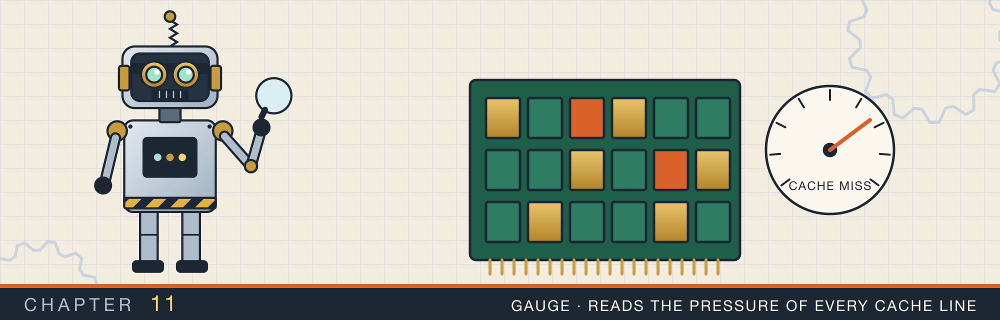
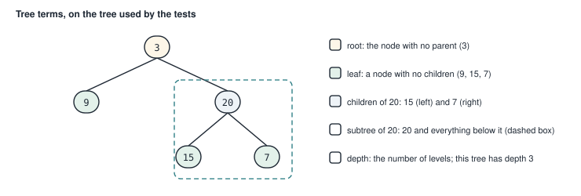
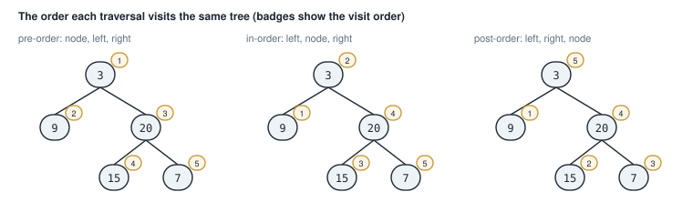
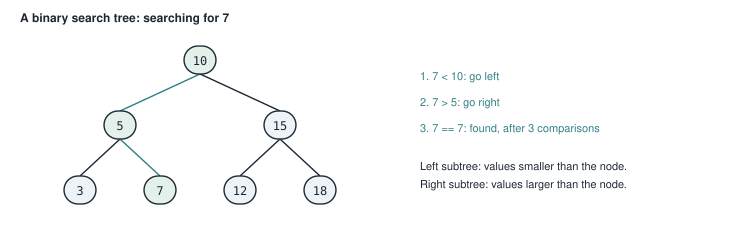
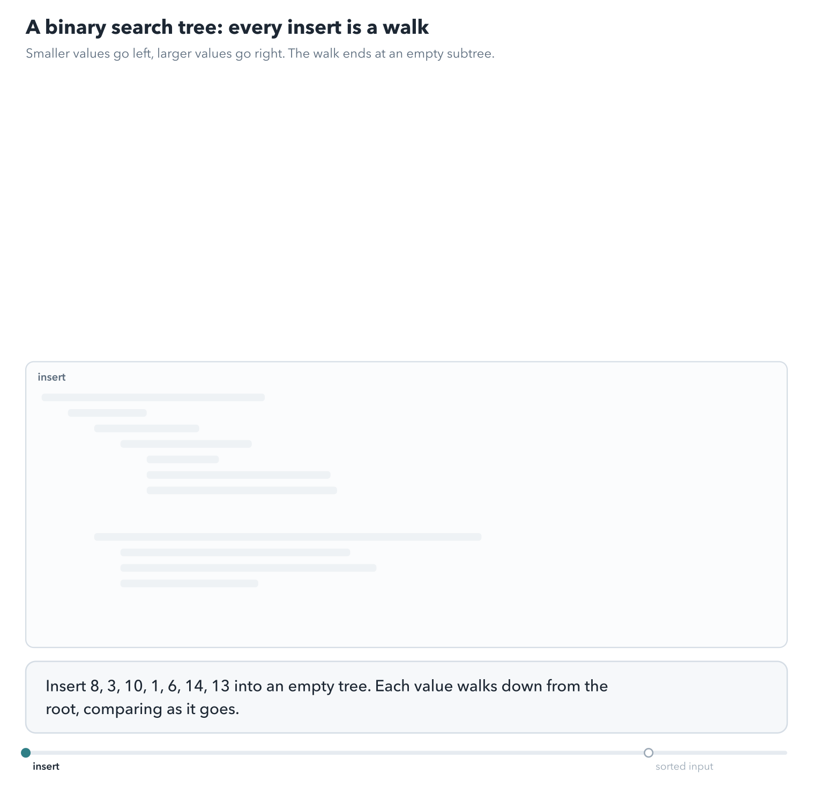
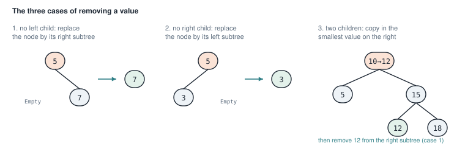
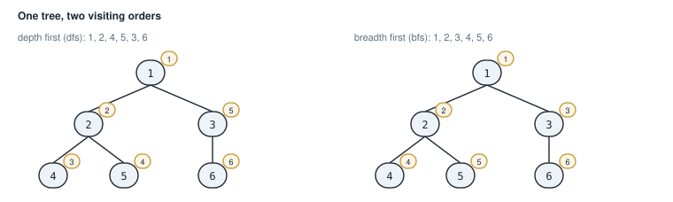
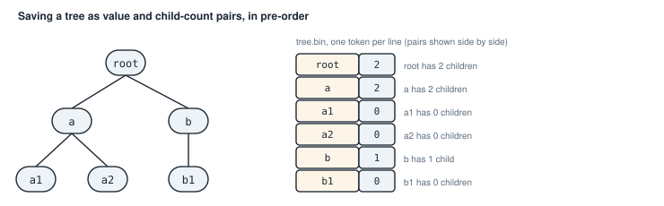
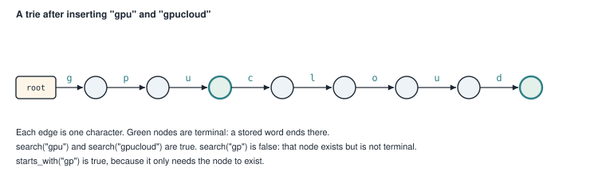
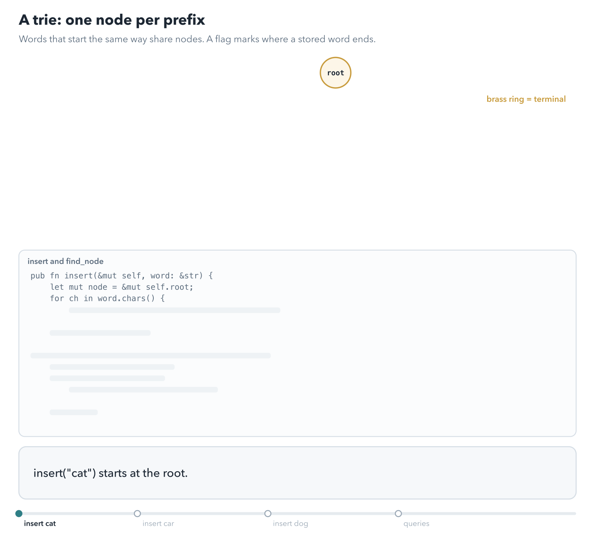

# Trees and tries

<div class="covers" markdown="1">

This chapter covers

- The vocabulary of trees: root, leaf, child, subtree, depth
- A binary tree as an enum, and the three depth-first visiting orders
- Binary search trees: insert, search, remove, and range queries, written two ways
- Trees with any number of children: depth-first and breadth-first visits, and grouping by level
- Saving a tree to a file and loading it back
- A trie, a tree for finding words by their first letters

</div>

In a linked list, each node points to at most one next node. In a **tree**, each node can point to several
nodes, called its children. Trees describe anything organized as a hierarchy. Examples are folders on a disk, the parts of an
expression, and a sorted set of numbers arranged for fast search.

Trees are easier to write in Rust than the doubly linked list of chapter 9. Each node has exactly one parent,
so a parent can own its children outright, with `Box` or with a `Vec`. No `Rc` or `RefCell` is needed. The
harder parts are elsewhere: replacing a node from inside a method, and choosing between recursion and an
explicit stack or queue.

The chapter starts with vocabulary, then binary trees, then binary search trees, then trees with any number of
children, and ends with the trie.

## 11.1 Tree vocabulary

Figure 11.1 names the parts of a tree.

<figure>

<figcaption><b>Figure 11.1</b> The small tree used by this chapter's tests, with its parts labeled.</figcaption>
</figure>

- The **root** is the one node with no parent. Trees are drawn with the root at the top.
- A **leaf** is a node with no children.
- The **subtree** of a node is that node and everything below it. Every subtree is a tree itself. So a function on a tree can call itself on each subtree, which is
recursion.
- The **depth** of a tree is the number of levels from the root down to its deepest leaf.

A **binary tree** is a tree in which each node has at most two children, called the left child and the right
child.

## 11.2 A binary tree as an enum

A binary tree is either empty, or a node holding a value and two smaller binary trees. That sentence
translates directly into an enum:

<p class="listing"><b>Listing 11.1</b> The tree type (lines 1 to 16). <a href="https://github.com/arpanpathak/cracking-the-systems-programming-interview/blob/prep-v2/rust-interview-lab/src/problems/binary_tree.rs">src/problems/binary_tree.rs</a></p>

```rust
{{#include ../../rust-interview-lab/src/problems/binary_tree.rs:1:16}}
```

The children are `Box<Tree>` for the reason chapter 8 gave. A `Tree` cannot contain two `Tree` values
directly, because its size would have no end. A `Box` is one pointer, so a node has a fixed size.

### 11.2.1 Depth and inversion

<p class="listing"><b>Listing 11.2</b> Depth and inversion (lines 19 to 35).</p>

```rust
impl Tree {
{{#include ../../rust-interview-lab/src/problems/binary_tree.rs:19:35}}
    // ...
}
```

Each method is a `match` with two arms. The `Empty` arm is the **base case**, the input small enough to answer
directly. The `Node` arm calls the method on the children and combines the results.

`max_depth` reads as a definition. An empty tree has depth 0. A node has depth 1 plus the larger depth of
its two subtrees. For the tree in figure 11.1: the leaves have depth 1, node 20 has depth 2, and the root has
depth 3.

`invert` swaps every node's left and right children, so the tree becomes its mirror image. It inverts both
subtrees first and then calls `std::mem::swap(left, right)`. The pattern binds `left` and `right` as mutable
references to the boxes, so the swap exchanges two pointers and moves no nodes.

### 11.2.2 The three depth-first orders

Visiting every node of a tree once is called a **traversal**. Going down one branch as far as possible before
trying the next is **depth-first** traversal. There are three common depth-first orders. They differ only in
when a node is visited relative to its children (figure 11.2).

<figure>

<figcaption><b>Figure 11.2</b> The badges show the order in which each traversal visits the nodes.</figcaption>
</figure>

- **Pre-order** visits the node first, then its left subtree, then its right subtree.
- **In-order** visits the left subtree, then the node, then the right subtree.
- **Post-order** visits both subtrees, then the node.

<p class="listing"><b>Listing 11.3</b> The public traversal methods (lines 37 to 53).</p>

```rust
impl Tree {
    // ...
{{#include ../../rust-interview-lab/src/problems/binary_tree.rs:37:53}}
    // ...
}
```

Each public method creates an empty `Vec`, passes it to a private helper, and returns it. Creating the vector
once and passing it down avoids building a new vector at every node.

<p class="listing"><b>Listing 11.4</b> The recursive helpers (lines 55 to 86).</p>

```rust
impl Tree {
    // ...
{{#include ../../rust-interview-lab/src/problems/binary_tree.rs:55:86}}
}
```

The three helpers are identical except for one line: where `out.push(*value)` appears relative to the two
recursive calls. `*value` copies the `i32` out of the reference.

<p class="listing"><b>Listing 11.5</b> The complete file, with its tests. <a href="https://github.com/arpanpathak/cracking-the-systems-programming-interview/blob/prep-v2/rust-interview-lab/src/problems/binary_tree.rs">src/problems/binary_tree.rs</a></p>

```rust
{{#include ../../rust-interview-lab/src/problems/binary_tree.rs}}
```

The test module defines two small helpers, `leaf` and `node`, so a test tree can be built in one readable
expression. `sample()` builds the tree of figure 11.1. The traversal test checks all three orders from figure
11.2.

## 11.3 Binary search trees

A **binary search tree** (BST) is a binary tree with an ordering rule. For every node, all values in its left
subtree are smaller than the node's value, and all values in its right subtree are larger.

The rule makes searching fast. To find a value, compare it with the root. If it is smaller, it can only be in
the left subtree; if larger, only in the right. Each comparison discards one subtree (figure 11.3).

<figure>

<figcaption><b>Figure 11.3</b> Searching for 7 visits one node per level. In a balanced tree of n values, that is about log₂ n comparisons.</figcaption>
</figure>

The code for this chapter has two implementations of the same BST. They agree on inserting and searching, and differ in
how they remove values and answer range queries. I'll go through the first fully, then the parts where the
second differs.

<figure class="anim">
<video class="motion" src="figures/ch11-bst.mp4" autoplay loop muted playsinline preload="metadata" aria-label="The values 8, 3, 10, 1, 6, 14, 13 are inserted one at a time. Each value starts at the root and moves left or right at every comparison until it reaches an empty subtree. Then contains(&6) follows 8, 3, 6. A last part inserts 1, 2, 3, 4, 5 in sorted order, and the tree becomes a chain." data-chapters="[[0.0, &quot;insert&quot;], [94.1, &quot;sorted input&quot;]]"></video>
<figcaption><b>Animation 11.1</b> Each insert is a walk from the root that ends at an empty subtree, and a search is the same walk. Sorted input produces a chain, so the shape depends on the insert order.</figcaption>
</figure>


### 11.3.1 The type, insertion, and search

<p class="listing"><b>Listing 11.6</b> The type (lines 1 to 14). <a href="https://github.com/arpanpathak/cracking-the-systems-programming-interview/blob/prep-v2/rust-interview-lab/src/bin/bst_clean.rs">src/bin/bst_clean.rs</a></p>

```rust
{{#include ../../rust-interview-lab/src/bin/bst_clean.rs:1:14}}
```

`BST<T>` is generic over the value type. The methods require `T: Ord`, meaning values of type `T` can be
ordered, which a search tree needs. `#[default]` on `Empty` makes an empty tree the default value, which the
removal code uses.

<p class="listing"><b>Listing 11.7</b> Creating, inserting, and searching (lines 17 to 47).</p>

```rust
impl<T: Ord> BST<T> {
{{#include ../../rust-interview-lab/src/bin/bst_clean.rs:17:47}}
    // ...
}
```

`insert` takes `&mut self` because it changes the tree in place. It walks down with recursive calls. When it
reaches an `Empty` tree, it replaces that spot with a new leaf: `*self = Self::Node { ... }`. On the way down,
`val.cmp(value)` compares the new value with the node's and returns `Ordering::Less`, `Greater`, or `Equal`. A
value equal to one already in the tree is ignored, so the tree holds each value once.

`contains` follows the same path without changing anything.

### 11.3.2 Removal

Removing a value is the hardest operation, because the tree must keep its ordering rule. There are three cases
(figure 11.4).

<figure>

<figcaption><b>Figure 11.4</b> The three removal cases. In case 3, removing 10 copies 12 into the root, then removes 12 from the right subtree.</figcaption>
</figure>

1. **No left child.** Replace the node with its right subtree.
2. **No right child.** Replace the node with its left subtree.
3. **Two children.** Keep the node, but give it a new value: the smallest value in its right subtree. That value
   is larger than everything on the left and smaller than everything else on the right, so the rule still
   holds. Then remove that smallest value from the right subtree. The smallest value has no left child, so its
   removal is case 1.

<p class="listing"><b>Listing 11.8</b> Removal (lines 49 to 90).</p>

```rust
impl<T: Ord> BST<T> {
    // ...
{{#include ../../rust-interview-lab/src/bin/bst_clean.rs:49:90}}
    // ...
}
```

The first two cases need to replace `*self` with one of its own children. That is not straightforward, because
`right` is a reference into `*self`. You cannot move a subtree out through `right` and assign it to `*self` in
one step. `std::mem::take(right)` solves it: it moves the subtree out and leaves the default value, an empty
tree, in its place. Then `*self = *std::mem::take(right)` assigns the subtree, and the `*` moves it out of its
`Box`. `take` needs `Default`, which is why the type derives it.

The code also handles a leaf, a node with no children, separately. Case 1 would already cover it.

For case 3, `remove_min` removes and returns the smallest value of the right subtree. It walks left until it
reaches a node whose left child is empty, using a match guard: `Self::Node { left, .. } if left.is_empty()`.
That node holds the smallest value. The method takes the whole node out with `std::mem::take(self)`, puts its
right subtree in its place, and returns its value. The `if let ... else { unreachable!() }` is there because
the compiler cannot see that the value taken from a `Node` arm is a `Node`. `unreachable!()` panics if that
ever turns out false.

`remove` returns `true` if the value was found and removed, and `false` otherwise, so a caller can tell the two
apart.

### 11.3.3 Range queries

A **range query** returns every value between a low and a high bound, in order. A BST can answer it without
visiting subtrees that cannot contain an answer.

<p class="listing"><b>Listing 11.9</b> Range queries (lines 92 to 114).</p>

```rust
impl<T: Ord> BST<T> {
    // ...
{{#include ../../rust-interview-lab/src/bin/bst_clean.rs:92:114}}
    // ...
}
```

`range_helper` collects matching values into an accumulator, `acc`. Its three branches skip work:

- If the node's value is below `low`, everything in its left subtree is lower still, so only the right subtree
  is searched.
- If the value is above `high`, only the left subtree is searched.
- Otherwise, the helper searches the left subtree, adds the value, and searches the right subtree. That order
  is in-order traversal, so the results come out sorted.

The signature has an explicit lifetime: `fn range_helper<'a>(&'a self, ..., acc: &mut Vec<&'a T>)`. The
references pushed into `acc` point into the tree, so they must live as long as the tree borrow `&'a self`.
Without the named `'a`, the elision rules from chapter 4 would give `self` and the vector's elements
separate lifetimes. The push would then not compile.

<p class="listing"><b>Listing 11.10</b> The complete program. <a href="https://github.com/arpanpathak/cracking-the-systems-programming-interview/blob/prep-v2/rust-interview-lab/src/bin/bst_clean.rs">src/bin/bst_clean.rs</a></p>

```rust
{{#include ../../rust-interview-lab/src/bin/bst_clean.rs}}
```

```text
$ cargo run --bin bst_clean
Contains 7: true
Contains 12: true
Values in [4, 16]: [5, 7, 10, 12, 15]
Remove 5: true
Remove 10: true
Remove 99: false
After removals: Node {
    value: 12,
    left: Node {
        value: 7,
        left: Node {
            value: 3,
            left: Empty,
            right: Empty,
        },
        right: Empty,
    },
    right: Node {
        value: 15,
        left: Empty,
        right: Node {
            value: 18,
            left: Empty,
            right: Empty,
        },
    },
}
```

Follow the two removals by hand. Node 5 has two children, 3 and 7. So it takes 7, the smallest value on its right, and the old 7 leaf is
removed. Node 10 also has two children, so the root takes 12, the smallest
value in its right subtree. The printed tree shows 12 at the root and 7 where 5 was.

### 11.3.4 A second BST, with an iterative minimum

The second implementation writes removal and range queries differently.

<p class="listing"><b>Listing 11.11</b> Removal and <code>pop_min</code> (lines 49 to 84). <a href="https://github.com/arpanpathak/cracking-the-systems-programming-interview/blob/prep-v2/rust-interview-lab/src/bin/bst_easy.rs">src/bin/bst_easy.rs</a></p>

```rust
{{#include ../../rust-interview-lab/src/bin/bst_easy.rs:1:4}}

impl<T: Ord> BST<T> {
    // ...
{{#include ../../rust-interview-lab/src/bin/bst_easy.rs:49:84}}
    // ...
}
```

This `remove` uses a helper `take`, defined at the end of the file, that swaps in `Empty` with
`mem::replace`. So the type does not need `Default`. `right.take()` reaches through the `Box` automatically
and returns the tree inside.

`pop_min` finds the smallest value with a loop instead of recursion. It moves a mutable reference, `node`, down
the left side of the tree:

```rust
let mut node = self;
while node.has_left() {
    if let Self::Node { left, .. } = node {
        node = left;
    }
}
```

When the loop ends, `node` refers to the leftmost node. `match node.take()` splits it into its value and its
right subtree, with no `unreachable!`. The loop uses one stack frame however deep the tree is. `pop_min` is also public, so the tree can serve as
a queue that always returns the smallest value.

<p class="listing"><b>Listing 11.12</b> A range query that returns a new vector (lines 86 to 102).</p>

```rust
impl<T: Ord> BST<T> {
    // ...
{{#include ../../rust-interview-lab/src/bin/bst_easy.rs:86:102}}
    // ...
}
```

This `range` returns a new `Vec` from each call and joins the children's results with `extend`. It is shorter
than the accumulator version, and it allocates a vector at every node it visits, where the accumulator version
allocates one.

<p class="listing"><b>Listing 11.13</b> The complete program. <a href="https://github.com/arpanpathak/cracking-the-systems-programming-interview/blob/prep-v2/rust-interview-lab/src/bin/bst_easy.rs">src/bin/bst_easy.rs</a></p>

```rust
{{#include ../../rust-interview-lab/src/bin/bst_easy.rs}}
```

```text
$ cargo run --bin bst_easy
Contains 7: true
Range 4 to 12: [5, 7, 10, 12]
After removing 10: [3, 5, 7, 12, 15]
Pop min: Some(3)
```

<div class="callout warning" markdown="1">

**WARNING:** Neither tree keeps itself balanced. Suppose you insert 1, 2, 3, and so on in increasing order. Each value becomes the right child of the
previous one, and the tree turns into a chain n levels deep. Searches
then take O(n), and every recursive method recurses n levels. The standard library's `BTreeMap` stays balanced.

</div>

## 11.4 Trees with any number of children

Many real trees are not binary. A folder can hold any number of files and folders. A node that owns a
`Vec<TreeNode<T>>` of children describes such a tree. It needs no `Box`, because the `Vec` already keeps its
elements on the heap, so the node's own size is fixed.

### 11.4.1 Depth first and breadth first

Figure 11.5 shows the two basic ways to visit such a tree. A **depth-first** visit goes down one branch completely before starting the next, as in section 11.2.2. A
**breadth-first** visit goes level by level: the root, then all its children, then all their children.

<figure>

<figcaption><b>Figure 11.5</b> Depth first finishes node 2's branch before visiting 3. Breadth first finishes each level before the next.</figcaption>
</figure>

Depth first is naturally recursive. Breadth first needs a **queue**: a collection where items leave in the
order they arrived. You put the root in the queue. Then, repeatedly, you take the node at the front, visit it,
and add its children at the back. Because children join at the back, every node of one level leaves the queue
before any node of the next.

<p class="listing"><b>Listing 11.14</b> The complete program. <a href="https://github.com/arpanpathak/cracking-the-systems-programming-interview/blob/prep-v2/rust-interview-lab/src/bin/test_tree.rs">src/bin/test_tree.rs</a></p>

```rust
{{#include ../../rust-interview-lab/src/bin/test_tree.rs}}
```

`dfs` prints the node and then calls itself on each child, which is pre-order.

`bfs` uses a `VecDeque` as the queue. `VecDeque::from([self])` starts it with the root. The queue holds
references, `&TreeNode<T>`, so no node is moved or copied. `pop_front` takes from the front, and `push_back`
adds each child at the back.

The tree in `main` is written as one nested value. The shape of the code matches the shape of the tree, which
makes test data easy to check.

```text
$ cargo run --bin test_tree
=== DFS ===
1
2
4
5
3
6

=== BFS ===
1
2
3
4
5
6
```

### 11.4.2 Grouping values by level

A common variation returns the values grouped by level, as a list of lists. The first list holds the
root's value, the second the values of its children, and so on. The file solves it twice.

<p class="listing"><b>Listing 11.15</b> The type and the first version (lines 1 to 20). <a href="https://github.com/arpanpathak/cracking-the-systems-programming-interview/blob/prep-v2/rust-interview-lab/src/bin/tree_under_pressure.rs">src/bin/tree_under_pressure.rs</a></p>

```rust
{{#include ../../rust-interview-lab/src/bin/tree_under_pressure.rs:1:20}}
```

`level_order` keeps one whole level in `level`, a `Vec` of references to nodes. Each pass of the loop does two
things. It adds the values of this level to the result. Then it builds the next level from all the children of
all the nodes in this level: `level.iter().flat_map(|n| &n.children).collect()`. `flat_map` turns each node into
its children and joins all those children into one sequence. The loop ends when a level has no nodes.

<p class="listing"><b>Listing 11.16</b> The second version, with a queue (lines 22 to 40).</p>

```rust
{{#include ../../rust-interview-lab/src/bin/tree_under_pressure.rs:22:40}}
```

`level_order_readable` uses one queue, as `bfs` did. The trick is `queue.len()` at the start of each round. At
that moment, the queue holds exactly one level. So the loop pops exactly that many nodes, collecting their
values, while their children pile up behind them for the next round.

`let Some(node) = queue.pop_front() else { break };` is a **let-else** statement. It binds `node` if the pattern
matches, and runs the `else` block, which must leave the loop or the function, if it does not.
`queue.extend(&node.children)` adds references to all the children at once.

<p class="listing"><b>Listing 11.17</b> The complete program. <a href="https://github.com/arpanpathak/cracking-the-systems-programming-interview/blob/prep-v2/rust-interview-lab/src/bin/tree_under_pressure.rs">src/bin/tree_under_pressure.rs</a></p>

```rust
{{#include ../../rust-interview-lab/src/bin/tree_under_pressure.rs}}
```

`main` prints the tree with `{:#?}`, then the levels from each version. Both give the same three levels:

```text
["root"]
["branch_a", "branch_b"]
["leaf_1", "leaf_2", "leaf_3"]
one queue, one level per round:
["root"]
["branch_a", "branch_b"]
["leaf_1", "leaf_2", "leaf_3"]
```

Both functions return `Vec<Vec<&T>>`, references into the tree, and both run in O(n).

## 11.5 Saving a tree to a file and loading it back

To save a tree, you turn it into a flat sequence of text. Later, you rebuild exactly the same tree from
that text. Turning a structure into a flat sequence is called **serialization**.

A list of values in pre-order is not enough, because it does not say where one node's children end. The file's
format adds, after each value, the number of children that follow (figure 11.6). A reader can then rebuild the
tree: read a value and a count, then read that many subtrees.

<figure>

<figcaption><b>Figure 11.6</b> Each node is written as its value and its number of children, in pre-order.</figcaption>
</figure>

<p class="listing"><b>Listing 11.18</b> The tree type, and writing the pairs (lines 1 to 47). <a href="https://github.com/arpanpathak/cracking-the-systems-programming-interview/blob/prep-v2/rust-interview-lab/src/bin/tree_serializ_deserialize_into_file.rs">src/bin/tree_serializ_deserialize_into_file.rs</a></p>

```rust
{{#include ../../rust-interview-lab/src/bin/tree_serializ_deserialize_into_file.rs:1:1}}

{{#include ../../rust-interview-lab/src/bin/tree_serializ_deserialize_into_file.rs:3:7}}

impl<T> TreeNode<T> {
    // ...
{{#include ../../rust-interview-lab/src/bin/tree_serializ_deserialize_into_file.rs:30:47}}
    // ...
}
```

`TreeNode<T>` is the same shape as in section 11.4: a value and a `Vec` of child nodes. A node can have any
number of children.

`serialize` walks the tree in pre-order without recursion, using a `Vec` as a **stack**: the last item pushed
is the first popped. It pushes the children in reverse order, with `iter().rev()`, so that the first child is on
top and is popped first. For each node it writes the value and the child count as strings.

The line `where T: ToString` sits on the method, not on the whole `impl`. So a tree of any type exists, and only
a tree whose values can become strings gets a `serialize` method.

<p class="listing"><b>Listing 11.19</b> Reading the pairs back (lines 49 to 63).</p>

```rust
impl<T> TreeNode<T> {
    // ...
{{#include ../../rust-interview-lab/src/bin/tree_serializ_deserialize_into_file.rs:49:63}}
    // ...
}
```

`deserialize` is recursive. `pos` is a `&mut usize`, a position in the token list shared by all the calls. Each
call reads a value and a count at `pos`, advances `pos` by two, and then calls itself `child_count` times to read
the children.

Every step that can fail uses `?` on an `Option`. The failures are a missing token, a value that does not
parse, and a count that is not a number. `.parse().ok()?` first turns the parse `Result` into an `Option`. Any failure makes the whole
function return `None`.

<p class="listing"><b>Listing 11.20</b> The complete program. <a href="https://github.com/arpanpathak/cracking-the-systems-programming-interview/blob/prep-v2/rust-interview-lab/src/bin/tree_serializ_deserialize_into_file.rs">src/bin/tree_serializ_deserialize_into_file.rs</a></p>

```rust
{{#include ../../rust-interview-lab/src/bin/tree_serializ_deserialize_into_file.rs}}
```

`save` joins the tokens with newlines and writes the file. `load` reads the file, splits it into lines, and starts
reading at position 0 with `&mut 0`. `main` saves a tree, loads it back, and prints its levels to show the shape
survived:

```text
$ cargo run --bin tree_serializ_deserialize_into_file
["root"]
["a", "b"]
["a1", "a2", "b1"]
```

The format breaks if a value contains a newline, because the reader splits on newlines. For arbitrary text,
write each value's length before it, or use a serialization library such as `serde`.

## 11.6 A trie for finding words by prefix

A **trie** (usually pronounced "try") stores a set of words by sharing their common beginnings. Each edge is one
character. Walking from the root along the characters of a word leads to the node for that word. A flag on the
node marks whether a stored word ends there (figure 11.7).

<figure>

<figcaption><b>Figure 11.7</b> A trie holding <code>"gpu"</code> and <code>"gpucloud"</code>. The two words share their first three nodes.</figcaption>
</figure>

A **prefix** is the beginning of a word: `"gp"` is a prefix of `"gpu"`. A trie answers "is any stored word
starting with this prefix?" by walking the prefix's characters. That makes it the usual structure behind
autocompletion.

<figure class="anim">
<video class="motion" src="figures/ch11-trie.mp4" autoplay loop muted playsinline preload="metadata" aria-label="Inserting cat, car, and dog one character at a time. A node is created only when no child exists for the character, so cat and car share the nodes c and ca. A ring marks each node that ends a word. starts_with(ca) finds the node ca; search(ca) finds it but it ends no word; cab finds no child b." data-chapters="[[0.0, &quot;insert cat&quot;], [15.44, &quot;insert car&quot;], [32.44, &quot;insert dog&quot;], [49.44, &quot;queries&quot;]]"></video>
<figcaption><b>Animation 11.2</b> <code>insert</code> creates a node only when the character has no child yet, so words with a common start share nodes. <code>"ca"</code> is a prefix but not a word, and <code>"cab"</code> stops at a missing child.</figcaption>
</figure>


<p class="listing"><b>Listing 11.21</b> The complete file. <a href="https://github.com/arpanpathak/cracking-the-systems-programming-interview/blob/prep-v2/rust-interview-lab/src/problems/trie.rs">src/problems/trie.rs</a></p>

```rust
{{#include ../../rust-interview-lab/src/problems/trie.rs}}
```

Each `Node` has a `HashMap` from a character to a child node, and a `terminal` flag. Both types derive `Default`,
so an empty node is `Node::default()`.

`insert` walks a mutable cursor, `node`, down the word, one character per line:

```rust
node = node.children.entry(ch).or_default();
```

`entry(ch).or_default()` finds the child for `ch`, creating an empty one if it is missing, and returns a mutable
reference to it. Assigning that to `node` moves the cursor down one level. After the last character, the node is
marked terminal.

`find_node` walks the same way without changing anything. `node.children.get(&ch)?` returns `None` from the
function at the first missing character. `search` then checks that the node exists and is terminal, with
`is_some_and`. `starts_with` only checks that the node exists.

Searching for a word of m characters takes m steps, whatever the number of stored words. A `HashMap` per node is
flexible but uses a lot of memory. For words of lowercase English letters only, an array of 26 child pointers
per node is faster and smaller.

<div class="summary" markdown="1">

## Summary

- A tree is a hierarchy of nodes. Each subtree is itself a tree, so recursion fits tree problems.
- A binary tree fits in an enum with `Box` children. Pre-order, in-order, and post-order differ only in when a
  node is visited relative to its subtrees.
- A binary search tree keeps smaller values on the left and larger on the right, so a search discards a subtree
  at each step.
- Removing from a BST has three cases. The two-children case copies in the smallest value of the right subtree.
- `std::mem::take` and `mem::replace` let a method replace `*self` with one of its own children.
- A range query skips subtrees outside the range and visits the rest in order.
- A node with `Vec` children describes a tree with any number of children. Breadth-first traversal uses a queue,
  and `queue.len()` at the start of a round gives the size of a level.
- Pre-order with child counts saves a tree in a form that can be rebuilt exactly.
- A trie shares prefixes between words, and finds a word in time proportional to its length.

</div>

Chapter 12 generalizes trees to graphs, where any node can connect to any other, and cycles are possible.

## Exercises

1. Write an in-order traversal of the binary tree from listing 11.1 without recursion, using a `Vec` of
   references as a stack.
2. Add a `height` method to one of the BSTs. Insert the numbers 1 to 1,000 in order, then in shuffled order, and
   compare the heights.
3. Serialize a binary tree using a marker such as `#` for each empty child, and write the matching reader.
4. Add `words_with_prefix(&self, prefix: &str) -> Vec<String>` to the trie.
