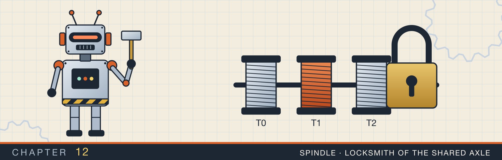

# Graphs

<div class="covers" markdown="1">

This chapter covers

- What a graph is, and two ways to store one in memory
- Breadth-first and depth-first search, and the queue and stack behind them
- Finding cycles with three node states
- Treating a grid of cells as a graph, to count islands
- Ordering tasks so that each comes after its prerequisites
- Shortest paths with Dijkstra's algorithm, written five ways
- Connecting every node at the lowest cost with Kruskal's algorithm and a union-find

</div>

In chapter 11, every node had exactly one parent, and no path could lead back to where it started. A **graph**
drops both rules. Any node can connect to any other node, and a path can come back to its start.

Graphs describe many real systems. Roads between cities form a graph. So do links between web pages, and
network links between machines. Courses and their prerequisites form a graph, and so do build steps and their
inputs.

The freedom has a cost. A traversal that follows edges can reach the same node many times, or walk around a loop
forever. Every algorithm in this chapter therefore keeps a record of which nodes it has already handled. The
record is a `Vec<bool>`, a `HashSet`, or a `HashMap` of states.

## 12.1 Graph vocabulary

Figure 12.1 names the parts of a graph.

<figure>
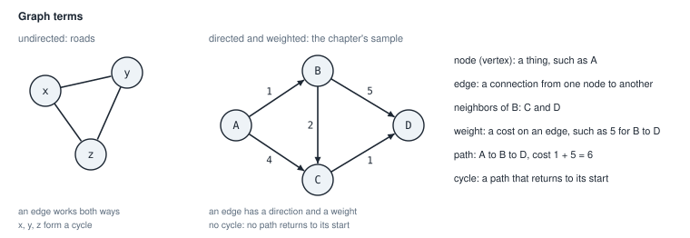
<figcaption><b>Figure 12.1</b> An undirected graph, and the directed, weighted sample graph used in sections 12.2 to 12.4.</figcaption>
</figure>

- A **node**, also called a vertex, is one of the things in the graph.
- An **edge** connects two nodes. In a **directed** graph, an edge goes one way, from one node to another. In an
  **undirected** graph, an edge works both ways, like a two-way road.
- The **neighbors** of a node are the nodes its edges lead to.
- A **weight** is a number on an edge, such as a distance or a cost.
- A **path** is a sequence of edges that you can follow one after another.
- A **cycle** is a path that ends at the node where it started.

A directed graph with no cycles is called a **directed acyclic graph**, or DAG. A tree is a special graph: it
has no cycles, and every node except the root has exactly one parent.

## 12.2 Storing a graph

The most common way to store a graph is an **adjacency list**. For every node, you keep a list of its outgoing
edges. Each edge is stored as a pair: the neighbor, and the weight of the edge.

The code in this chapter uses two forms of adjacency list (figure 12.2).

<figure>
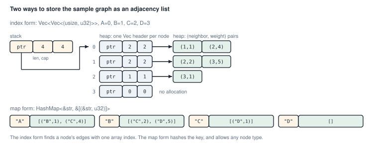
<figcaption><b>Figure 12.2</b> The sample graph in the two adjacency-list forms.</figcaption>
</figure>

In the **index form**, the nodes are numbered 0, 1, 2, and so on. The graph is a `Vec<Vec<(usize, u32)>>`.
`graph[i]` is the list of edges out of node `i`, and each edge is a `(neighbor, weight)` pair. Finding a node's
edges is one array index. The record of visited nodes can be a `Vec<bool>` with one entry per node.

In the **map form**, nodes can be any type that can be hashed, such as names. The graph is a `HashMap` from a
node to its edges. Finding a node's edges means hashing the key. The visited record becomes a `HashSet`.

The index form is faster, and the map form is more convenient when nodes have natural names. Several files in
this chapter solve the same problem both ways, so you can compare them side by side.

The map form in `graph_bfs.rs` has a type alias:

```rust
{{#include ../../rust-interview-lab/src/problems/graph_bfs.rs:10:13}}

{{#include ../../rust-interview-lab/src/problems/graph_bfs.rs:15:16}}
```

`GraphAdjList<'a, Node>` is a `HashMap` whose values are borrowed slices, `&'a [(Node, u32)]`. The map does not
own the edges. They live somewhere else for at least the lifetime `'a`, and the map points at them. The tests
keep the edges in constant arrays, which live for the whole program.

## 12.3 Breadth-first search

**Breadth-first search** (BFS) visits the start node first, then every node one edge away, then every node two
edges away, and so on. It works the same way as the level-order tree traversal of section 11.4: a queue holds
the nodes waiting to be visited.

Unlike a tree, a graph can offer two paths to the same node. In the sample graph, A reaches C directly, and also
through B. Without a record, C would enter the queue twice. So BFS marks a node as seen when it first enters the
queue, and never adds it again.

The top half of figure 12.3 follows the queue step by step.

<figure>
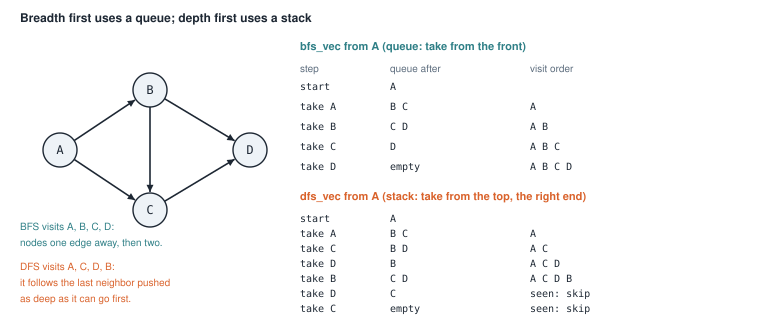
<figcaption><b>Figure 12.3</b> The queue in BFS and the stack in DFS, starting at A. Both visit every node once, in different orders.</figcaption>
</figure>

<figure class="anim">
<video class="motion" src="figures/ch12-bfs.mp4" autoplay loop muted playsinline preload="metadata" aria-label="A graph of nodes 0 to 6 with a queue and a result list below it. BFS takes 0, then pushes its neighbors 1 and 2, then takes them in order and pushes their unvisited neighbors. The result is 0, 1, 2, 3, 4, 5. Node 6 has no edges to the others and is never reached." data-chapters="[[0.0, &quot;queue&quot;], [51.84, &quot;node 6&quot;]]">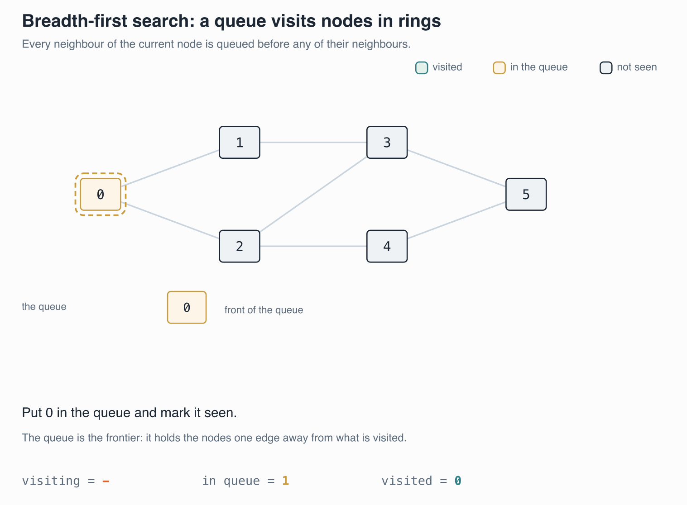</video>
<figcaption><b>Animation 12.1</b> <code>bfs_vec</code> from node 0. The queue hands out the oldest entry first, so nodes are visited in order of distance. Node 6 is not connected and is never reached.</figcaption>
</figure>

### 12.3.1 BFS with numbered nodes

<p class="listing"><b>Listing 12.1</b> BFS over the index form (lines 18 to 36). <a href="https://github.com/arpanpathak/cracking-the-systems-programming-interview/blob/prep-v2/rust-interview-lab/src/problems/graph_bfs.rs">src/problems/graph_bfs.rs</a></p>

```rust
{{#include ../../rust-interview-lab/src/problems/graph_bfs.rs:18:36}}
```

The function sets up three things. `visited` has one `false` per node. `queue` holds the start node. `result`
collects the nodes in the order they are visited.

The loop takes the front node, records it, and looks at its edges. The pattern `&(neighbor, _)` takes each edge
apart: it copies out the neighbor and ignores the weight with `_`. Each neighbor that has not been seen is
marked and added to the back of the queue.

Every node enters the queue at most once, and every edge is looked at once. So BFS runs in O(V + E) time, where
V is the number of nodes and E the number of edges. Nodes that cannot be reached from the start never enter the
queue, and are not in the result.

### 12.3.2 BFS with any node type

<p class="listing"><b>Listing 12.2</b> BFS over the map form (lines 38 to 59).</p>

```rust
{{#include ../../rust-interview-lab/src/problems/graph_bfs.rs:38:59}}
```

The steps are the same. Three things change:

- The function is generic over `Node`. The `where` clause asks for `Copy`, so a node can be copied into the queue and the result. It also asks
for `Eq + Hash`, so a node can be a key in a `HashSet`.
- `graph[&current_node]` looks up the edges by key. Indexing a `HashMap` panics if the key is missing, so every
  node needs an entry, even a node with no edges.
- `visited.insert(neighbor)` does the check and the marking in one call. `insert` returns `true` if the value
  was not in the set before.

The tests at the end of the file build the sample graph in both forms and check that the two functions agree:

```text
$ cargo test --lib problems::graph_bfs
running 5 tests
test problems::graph_bfs::tests::vec_variant_skips_unreachable_nodes ... ok
test problems::graph_bfs::tests::vec_variant_visits_level_by_level ... ok
test problems::graph_bfs::tests::vec_variant_handles_cycles ... ok
test problems::graph_bfs::tests::both_variants_agree ... ok
test problems::graph_bfs::tests::map_variant_visits_level_by_level ... ok

test result: ok. 5 passed; 0 failed; 0 ignored; 0 measured; 132 filtered out
```

Tests run in parallel, so the order of the lines can change from run to run.

## 12.4 Depth-first search

**Depth-first search** (DFS) follows one path as far as it can before it tries another. You can write it with
recursion, as the tree traversals of chapter 11 were. The versions here use a `Vec` as an explicit stack
instead. An explicit stack has no depth limit other than memory, while deep recursion can overflow the thread's
stack.

<p class="listing"><b>Listing 12.3</b> DFS over the index form (lines 16 to 33). <a href="https://github.com/arpanpathak/cracking-the-systems-programming-interview/blob/prep-v2/rust-interview-lab/src/problems/graph_dfs.rs">src/problems/graph_dfs.rs</a></p>

```rust
{{#include ../../rust-interview-lab/src/problems/graph_dfs.rs:12:14}}

{{#include ../../rust-interview-lab/src/problems/graph_dfs.rs:16:33}}
```

Compare this with listing 12.1. The queue became a stack, so `pop_front` became `pop`. The other change is when
a node is marked. BFS marked a node when it was added. DFS marks a node when it is taken off the stack, and skips
it if it was already visited.

Marking late gives the true depth-first order, at a small cost. A node can sit on the stack more than once, as C
and D do in the lower half of figure 12.3. The stack can hold up to one entry per edge, and the duplicates are
skipped with `continue` when they come off.

The neighbors are pushed in list order, so the last neighbor pushed is the first taken. From A, the stack
receives B and then C, so C is explored first. The visit order is A, C, D, B.

<figure class="anim">
<video class="motion" src="figures/ch12-dfs.mp4" autoplay loop muted playsinline preload="metadata" aria-label="The same graph with a stack and a result list. dfs_vec pops the newest entry, records it if it is unvisited, and pushes all its neighbors. Entries for nodes already visited are popped and skipped. The result is 0, 2, 4, 5, 3, 1." data-chapters="[[0.0, &quot;stack&quot;]]">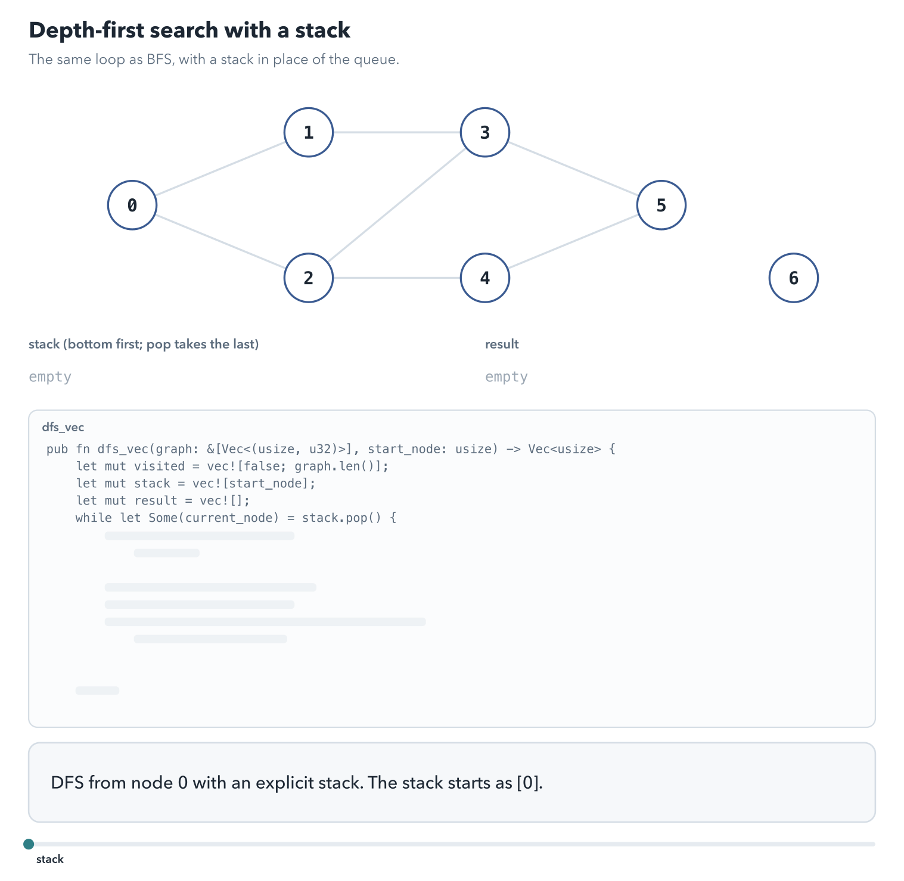</video>
<figcaption><b>Animation 12.2</b> <code>dfs_vec</code> uses the same loop as BFS with a stack. The newest entry is taken first, so the walk goes deep before it goes wide.</figcaption>
</figure>


<p class="listing"><b>Listing 12.4</b> DFS over the map form (lines 35 to 54).</p>

```rust
{{#include ../../rust-interview-lab/src/problems/graph_dfs.rs:35:54}}
```

Here `if !visited.insert(current_node)` is the "already visited" check. If `insert` returns `false`, the node
was in the set, and the loop moves on.

The file starts with `use crate::problems::graph_bfs::GraphAdjList;`, so both files share one type alias.

### 12.4.1 A stack of references

When the graph is a tree, DFS needs no visited record, because no node can be reached twice. The following
program walks a tree with a stack of references.

<p class="listing"><b>Listing 12.5</b> The complete program. <a href="https://github.com/arpanpathak/cracking-the-systems-programming-interview/blob/prep-v2/rust-interview-lab/src/bin/rust_interview_hacks_graph.rs">src/bin/rust_interview_hacks_graph.rs</a></p>

```rust
{{#include ../../rust-interview-lab/src/bin/rust_interview_hacks_graph.rs}}
```

The stack has type `Vec<&Node>`. It holds borrowed references into the tree, so the loop moves no nodes and
copies none. `stack.extend(node.children.iter())` pushes a reference to each child. The last line of `main` uses
`tree.value` after the walk, which shows that `tree` still owns its nodes.

```text
$ cargo run --bin rust_interview_hacks_graph
Node { value: 1, children: [Node { value: 2, children: [] }, Node { value: 3, children: [Node { value: 4, children: [] }] }] }
Node { value: 3, children: [Node { value: 4, children: [] }] }
Node { value: 4, children: [] }
Node { value: 2, children: [] }
still own it: 1
```

`{:?}` prints each node with all its children, so the first line shows the whole tree. The order is 1, 3, 4, 2,
because the last child pushed is the first popped.

## 12.5 A graph with named nodes

Programs often receive a graph as pairs of names, such as `("A", "B")`. A common way to handle names is to give
each name a number the first time you see it. The algorithm then runs on numbers, with the fast index form.
Assigning numbers to names this way is called **interning**.

The graph keeps two things: `ids`, which interns each name as a number, and `adj`, the adjacency list indexed by those numbers:

```rust
{{#include ../../rust-interview-lab/src/bin/graph_bfs.rs:1:7}}
```

<p class="listing"><b>Listing 12.6</b> The complete program. <a href="https://github.com/arpanpathak/cracking-the-systems-programming-interview/blob/prep-v2/rust-interview-lab/src/bin/graph_bfs.rs">src/bin/graph_bfs.rs</a></p>

```rust
{{#include ../../rust-interview-lab/src/bin/graph_bfs.rs}}
```

`Graph` has two fields. `ids` maps a name to its number, and `adj` is an index-form adjacency list without
weights.

The `id` method does the interning in one expression. `self.ids.entry(name.to_owned())` looks up the name.
`or_insert_with` runs its closure only if the name is new. The closure adds an empty edge list to `adj` and
returns its index, which becomes the name's number. Either way, the expression returns a reference to the
number, and the `*` at the front copies it out.

The closure changes `self.adj` while `self.ids` is borrowed by the entry. The compiler allows this because a
closure borrows only the fields it uses, here `self.adj`. The two borrows touch different fields, so they do not
conflict.

This `bfs` marks nodes when they leave the queue, as the DFS of section 12.4 did. A node can enter the queue
more than once, and the second copy is skipped. `queue.extend(self.adj[node].iter())` adds all neighbors at
once.

```text
$ cargo run --bin graph_bfs
[0, 1, 2, 3, 4, 5]
```

The result is numbers, not names. A to F were numbered 0 to 5 in the order they first appeared.

## 12.6 Finding cycles

Many problems need to know whether a directed graph has a cycle. A build system cannot build a file that
depends on itself. A course plan cannot require a course before itself.

A visited flag is not enough to find cycles. Look at the diamond on the right of figure 12.4. DFS reaches D
through B, and later reaches D again through C. That second visit does not mean there is a loop. It only means
two paths join.

<figure>
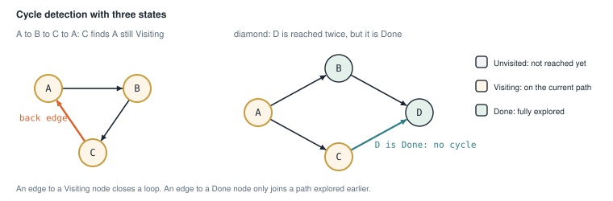
<figcaption><b>Figure 12.4</b> An edge to a node on the current path is a cycle. An edge to a finished node is not.</figcaption>
</figure>

The fix is to give each node one of three states:

- **Unvisited**: DFS has not reached the node yet.
- **Visiting**: the node is on the path DFS is currently following. DFS has entered it and not yet finished it.
- **Done**: DFS has explored everything reachable from the node.

An edge that leads to a Visiting node goes back to an earlier point on the current path, so it closes a loop.
Such an edge is called a **back edge**. An edge that leads to a Done node joins a path that was already fully
explored, and cannot close a loop.

### 12.6.1 A graph that owns its node data

<p class="listing"><b>Listing 12.7</b> The graph and its states (lines 1 to 30). <a href="https://github.com/arpanpathak/cracking-the-systems-programming-interview/blob/prep-v2/rust-interview-lab/src/bin/cyclic_graph.rs">src/bin/cyclic_graph.rs</a></p>

```rust
{{#include ../../rust-interview-lab/src/bin/cyclic_graph.rs:1:15}}

impl<T> Graph<T> {
{{#include ../../rust-interview-lab/src/bin/cyclic_graph.rs:18:37}}
    // ...
}
```

This `Graph<T>` keeps the node data in `nodes`, and the edges in `adj`, as numbers. `NodeId` is a type alias
for `usize`, so signatures say what a number means. `add_node` returns the new node's number, and the caller
uses that number to add edges.

Storing numbers instead of references is the usual way to build graphs in Rust. A cycle of references between
nodes would need `Rc` and `RefCell`, as chapter 9's doubly linked list did. Numbers into a `Vec` have no
ownership problems at all.

`neighbors` returns `impl Iterator<Item = NodeId> + '_`. That return type means "some iterator of node
numbers". The `+ '_` says the iterator borrows from `self`, so it cannot outlive the graph. `.copied()` turns
the `&usize` items of the slice iterator into `usize` values.

<p class="listing"><b>Listing 12.8</b> BFS and DFS (lines 39 to 74).</p>

```rust
impl<T> Graph<T> {
    // ...
{{#include ../../rust-interview-lab/src/bin/cyclic_graph.rs:39:74}}
    // ...
}
```

These are the algorithms of sections 12.3 and 12.4, written with `neighbors`. The DFS filters out visited
neighbors before pushing them, with `.filter(|&n| !visited[n])`. The filter keeps the stack smaller, but the
check after `pop` is still needed. A node can be pushed by two different nodes before either copy is popped.

<p class="listing"><b>Listing 12.9</b> Cycle detection (lines 76 to 94).</p>

```rust
impl<T> Graph<T> {
    // ...
{{#include ../../rust-interview-lab/src/bin/cyclic_graph.rs:76:94}}
}
```

`visit` is a recursive DFS that returns `true` as soon as it finds a cycle. It reads the node's state:

- `Visiting` means this edge is a back edge, so the answer is `true`.
- `Done` means the node was explored before and no cycle was found through it, so the answer is `false`.
- `Unvisited` means this is the first visit. The node becomes `Visiting`, and `visit` recurses into each
  neighbor. `any` stops at the first neighbor that reports a cycle. Then the node becomes `Done`.

`has_cycle` calls `visit` from every node, because a cycle might not be reachable from node 0. All the calls
share one `state` vector, so each node is fully explored only once, and the whole check runs in O(V + E).

<p class="listing"><b>Listing 12.10</b> The complete program. <a href="https://github.com/arpanpathak/cracking-the-systems-programming-interview/blob/prep-v2/rust-interview-lab/src/bin/cyclic_graph.rs">src/bin/cyclic_graph.rs</a></p>

```rust
{{#include ../../rust-interview-lab/src/bin/cyclic_graph.rs}}
```

`main` builds the loop A to B to C to A. The closure `names` converts a list of numbers back into names for
printing.

```text
$ cargo run --bin cyclic_graph
BFS:   ["A", "B", "C"]
DFS:   ["A", "B", "C"]
Cycle: true
```

### 12.6.2 The same graph with a HashMap

The second version stores the graph as a map from a node to its neighbors, with no numbering step.

The cycle check marks each node with a `State`: `Visiting` while its descendants are being explored, and `Done` after. The graph is a map from a node to its neighbors, generic over any `Copy` node type:

```rust
{{#include ../../rust-interview-lab/src/bin/cyclic_graph_map.rs:6:15}}
```

<p class="listing"><b>Listing 12.11</b> The complete program. <a href="https://github.com/arpanpathak/cracking-the-systems-programming-interview/blob/prep-v2/rust-interview-lab/src/bin/cyclic_graph_map.rs">src/bin/cyclic_graph_map.rs</a></p>

```rust
{{#include ../../rust-interview-lab/src/bin/cyclic_graph_map.rs}}
```

Three details differ from listing 12.10:

- `State` has only `Visiting` and `Done`. A node that is not in the `state` map is unvisited, so the map itself
  plays the role of the third state.
- `add_edge` inserts the target `v` as a key too, with `entry(v).or_default()`. Every node therefore has an
  entry, and `self.adj[&u]` cannot panic on a node that has no outgoing edges.
- The recursive helper is a function declared inside `has_cycle`. A nested `fn` cannot use the local variables
  of the function around it, so it receives the graph and the state map as arguments.

```text
$ cargo run --bin cyclic_graph_map
["A", "B", "C"]
true
```

## 12.7 A grid is a graph

A grid of cells is a graph too, even though it is not stored as one. Each cell is a node, and each cell has an
edge to the cells directly above, below, left, and right of it. The edges are computed from the coordinates when
needed, not stored.

The classic grid problem counts **islands**. The grid holds land and water. An island is a group of land cells
connected up, down, left, or right. Diagonal neighbors do not count.

The method is to scan every cell. When the scan finds a land cell that no earlier search has reached, that cell
starts a new island. The count goes up by one, and a BFS from that cell marks every cell of the island. Filling
a connected area this way is called a **flood fill** (figure 12.5).

<figure>
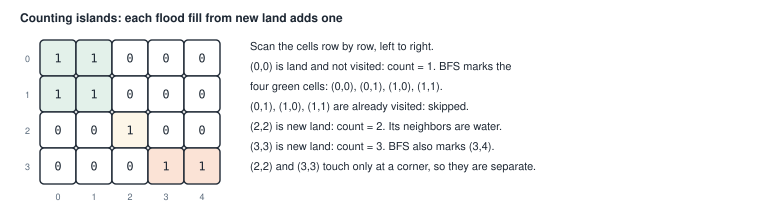
<figcaption><b>Figure 12.5</b> The grid from <code>main</code>. Each color is one island, found by one flood fill.</figcaption>
</figure>

<figure class="anim">
<video class="motion" src="figures/ch12-islands.mp4" autoplay loop muted playsinline preload="metadata" aria-label="A 4 by 4 grid of 1s and 0s. The scan reaches land at (0, 0), count becomes 1, and the flood fill colors the three connected land cells. The scan passes cells already filled. At (1, 3) count becomes 2, and the fill colors the second island of three cells." data-chapters="[[2.4, &quot;island 1&quot;], [30.18, &quot;island 2&quot;]]">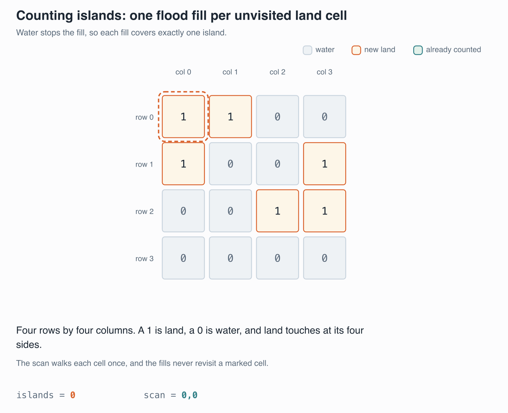</video>
<figcaption><b>Animation 12.3</b> The scan starts a new island only at land the fill has not reached. Each fill marks one whole island, so the count is the number of islands.</figcaption>
</figure>

<p class="listing"><b>Listing 12.12</b> Counting islands (lines 27 to 72). <a href="https://github.com/arpanpathak/cracking-the-systems-programming-interview/blob/prep-v2/rust-interview-lab/src/bin/count_islands.rs">src/bin/count_islands.rs</a></p>

```rust
{{#include ../../rust-interview-lab/src/bin/count_islands.rs:21:21}}

{{#include ../../rust-interview-lab/src/bin/count_islands.rs:27:72}}
```

The grid has type `&[&[T]]`, a slice of rows, where each row is a slice of cells. The function is generic, so
cells can be characters, booleans, or numbers. `land: T` says which value counts as land, and `T: PartialEq`
lets the code compare a cell with it.

`dirs` lists the four moves as (row change, column change) pairs. The BFS adds each move to the current cell's
coordinates. The coordinates are `usize`, which cannot be negative, and a move up from row 0 would go below
zero. So the code converts to `i32` first. It checks that the new position is inside the grid with `(0..rows as
i32).contains(&nr)`, and only then converts back to `usize`.

The BFS is a closure stored in `bfs`. It reads `grid`, `dirs`, `rows`, `cols`, and `land` from the function
around it. It does not capture `visited`, though. It takes `visited` as a parameter instead. If the closure
captured `visited` mutably, that borrow would last as long as the closure. The outer loop could then not call
`visited.contains` while the closure exists. Passing it in on each call keeps the borrow short.

Each cell is looked at a constant number of times, so the function runs in O(rows × cols). A `Vec<bool>` with
one entry per cell would be faster than the `HashSet` of coordinates, because it avoids hashing.

<p class="listing"><b>Listing 12.13</b> The complete program, with tests. <a href="https://github.com/arpanpathak/cracking-the-systems-programming-interview/blob/prep-v2/rust-interview-lab/src/bin/count_islands.rs">src/bin/count_islands.rs</a></p>

```rust
{{#include ../../rust-interview-lab/src/bin/count_islands.rs}}
```

```text
$ cargo run --bin count_islands
Islands: 3
Boolean islands: 2

$ cargo test --bin count_islands
running 5 tests
test tests::empty_grid_has_zero_islands ... ok
test tests::all_water_is_zero ... ok
test tests::generic_bool_grid_works ... ok
test tests::single_row_and_column ... ok
test tests::counts_classic_example ... ok

test result: ok. 5 passed; 0 failed; 0 ignored; 0 measured; 0 filtered out
```

## 12.8 Putting tasks in order

Suppose you have tasks, and some tasks must finish before others can start. A **topological order** lists
every task so that each one comes after all of its prerequisites. Build tools, package managers, and course
planners all compute one.

Draw an arrow from each task to the tasks that depend on it. The **indegree** of a node is the number of arrows
coming into it: the number of prerequisites it is still waiting for.

**Kahn's algorithm** builds the order step by step (figure 12.6):

1. Put every node with indegree 0 in a queue. They have no prerequisites.
2. Take a node from the queue and add it to the order.
3. For each arrow out of that node, lower the target's indegree by one. The target has one fewer prerequisite
   to wait for. If its indegree reaches 0, add it to the queue.
4. Repeat until the queue is empty.

<figure>
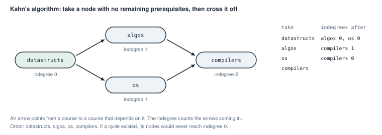
<figcaption><b>Figure 12.6</b> Kahn's algorithm on four courses.</figcaption>
</figure>

If the graph has a cycle, the nodes on the cycle wait for each other forever. Their indegrees never reach 0, so
they never enter the order. The order then comes out shorter than the number of nodes, and that is how the
algorithm detects a cycle.

<figure class="anim">
<video class="motion" src="figures/ch12-topo.mp4" autoplay loop muted playsinline preload="metadata" aria-label="Five nodes with directed edges and each node's indegree below it. Node 0 has indegree 0 and is taken first; removing its edges brings 1 and 2 to 0. Then 1, 2, 3, and 4 follow. A last part adds an edge from 4 back to 1: after 0 and 2, no node reaches indegree 0, and the function returns None." data-chapters="[[0.0, &quot;Kahn&quot;], [61.44, &quot;cycle&quot;]]">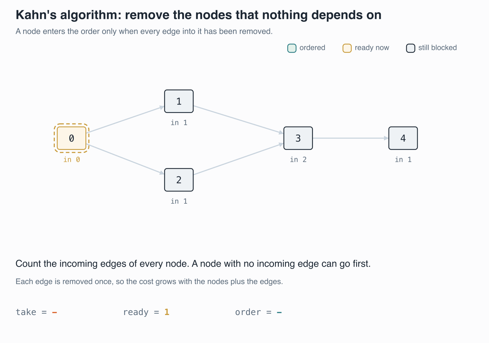</video>
<figcaption><b>Animation 12.4</b> Kahn's algorithm takes a node when nothing points into it, and removing its edges releases the next ones. With a cycle, the order stops short and the function returns <code>None</code>.</figcaption>
</figure>


### 12.8.1 Kahn's algorithm on numbered nodes

The input is a node count and a slice of `(from, to)` edges. The first step builds the adjacency list and
counts each node's indegree at the same time:

```rust
{{#include ../../rust-interview-lab/src/problems/graph_topology.rs:6:15}}
    // ...
}
```

The starting queue comes from one iterator chain:

```rust
pub fn topological_sort(num_nodes: usize, edges: &[(usize, usize)]) -> Option<Vec<usize>> {
    // ...
{{#include ../../rust-interview-lab/src/problems/graph_topology.rs:17:20}}
    // ...
}
```

`(0..num_nodes)` produces every node number. `.filter(|&n| indegree[n] == 0)` keeps the nodes with no
prerequisites, and `.collect()` builds the `VecDeque`.

The loop is Kahn's algorithm itself:

```rust
pub fn topological_sort(num_nodes: usize, edges: &[(usize, usize)]) -> Option<Vec<usize>> {
    // ...
{{#include ../../rust-interview-lab/src/problems/graph_topology.rs:22:33}}
}
```

Each node taken from the queue goes into `order`. Removing it removes its outgoing edges, so each neighbor's
indegree drops by one. A neighbor whose indegree reaches 0 has no prerequisites left, and joins the queue.

The last line returns the answer. `bool::then_some(order)` gives `Some(order)` if the condition is true, and
`None` if it is false. So the function returns `None` exactly when a cycle kept some nodes out of the order.
The nodes on a cycle never reach indegree 0.

<p class="listing"><b>Listing 12.14</b> The complete file. <a href="https://github.com/arpanpathak/cracking-the-systems-programming-interview/blob/prep-v2/rust-interview-lab/src/problems/graph_topology.rs">src/problems/graph_topology.rs</a></p>

```rust
{{#include ../../rust-interview-lab/src/problems/graph_topology.rs}}
```

The tests check positions rather than one exact order. A graph usually has several valid topological orders, and
the tests only require that each edge's source comes before its target.

```text
$ cargo test --lib problems::graph_topology
running 3 tests
test problems::graph_topology::tests::disconnected_nodes_are_included ... ok
test problems::graph_topology::tests::returns_order_for_dag ... ok
test problems::graph_topology::tests::detects_cycle ... ok

test result: ok. 3 passed; 0 failed; 0 ignored; 0 measured; 134 filtered out
```

### 12.8.2 Kahn's algorithm on named courses

The second version takes courses with names and lists of prerequisites, the way the data might arrive from a
file.

A course has a name and a list of prerequisites, the names of the courses that must come before it:

```rust
{{#include ../../rust-interview-lab/src/bin/dependency_resolutiom.rs:1:7}}
```

<p class="listing"><b>Listing 12.15</b> The complete program. <a href="https://github.com/arpanpathak/cracking-the-systems-programming-interview/blob/prep-v2/rust-interview-lab/src/bin/dependency_resolutiom.rs">src/bin/dependency_resolutiom.rs</a></p>

```rust
{{#include ../../rust-interview-lab/src/bin/dependency_resolutiom.rs}}
```

The input describes edges backward from the way the algorithm needs them. Each course lists its prerequisites,
but Kahn's algorithm follows arrows from a prerequisite to the courses that need it. The loop turns them around.
For each prerequisite `dep` of course `name`, it adds `name` to `adj[dep]`.

A course's indegree is the length of its `depends_on` list. A prerequisite that is never listed as a course,
like `datastructs` here, still needs an entry. `indegree.entry(dep.clone()).or_insert(0)` adds it with indegree
0, and `or_insert` leaves an existing entry alone.

`for Course { name, depends_on } in courses` takes each course apart in the loop header. Because `courses` is a
slice reference, `name` and `depends_on` are references to the fields.

If a cycle keeps some courses out of the order, the function returns an empty `Vec`. With `Option` as in listing
12.14, the caller could tell "no courses" from "a cycle".

```text
$ cargo run --bin dependency_resolutiom
["datastructs", "algos", "os", "compilers"]
```

The starting queue is built by iterating over a `HashMap`, and that order changes between runs. This input has
only one course with no prerequisites, so the output is always the same. With several such courses, the order
among them could change from run to run.

## 12.9 Shortest paths

In a weighted graph, the cost of a path is the sum of its edge weights. The **shortest path** from A to D is the
path with the lowest cost. It is not always the one with the fewest edges.

BFS finds the path with the fewest edges, which is a different question. **Dijkstra's algorithm** finds the lowest
cost from one start node to every other node, as long as no weight is negative.

### 12.9.1 How Dijkstra's algorithm works

The algorithm keeps two things:

- `dist`, the lowest cost found so far to each node. At the start, only the start node has a cost, 0.
- A min-heap of `(cost, node)` entries, so the cheapest entry is always taken next. Chapter 5 built min-heaps
  with `BinaryHeap` and `Reverse`.

Each step takes the cheapest entry from the heap. For each edge out of that node, it computes the cost of
reaching the neighbor through this node. If that cost beats the neighbor's recorded cost, the new cost is
recorded and pushed onto the heap. Updating a recorded cost to a lower one is called **relaxing** the edge.

When a node is taken from the heap with its recorded cost, that cost is final. Every other entry in the heap
costs at least as much, and weights are never negative. So no path found later can come back cheaper.

A node can be in the heap several times. When a cheaper path to B is found, the old entry for B stays in the heap.
`BinaryHeap` has no way to find and update it. When the old entry is eventually taken, its cost is higher than
B's recorded cost, and the code skips it. Such an entry is called **stale**.

Figure 12.7 follows every step on a four-node graph.

<figure>
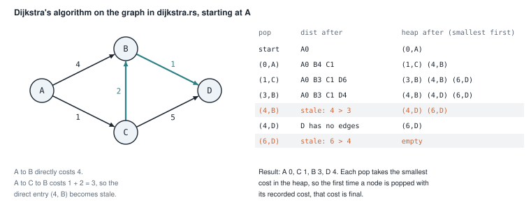
<figcaption><b>Figure 12.7</b> Dijkstra's algorithm from A. Two entries become stale when cheaper paths are found.</figcaption>
</figure>

<figure class="anim">
<video class="motion" src="figures/ch12-dijkstra.mp4" autoplay loop muted playsinline preload="metadata" aria-label="A weighted graph A, B, C, D with each node's distance and the heap of entries. A settles at 0 and pushes B at 4 and C at 1. C settles at 1 and lowers B to 3 and D to 6. B settles at 3 and lowers D to 4. The older entry (4, B) is popped later and skipped as stale. D settles at 4." data-chapters="[[0.0, &quot;settle&quot;]]">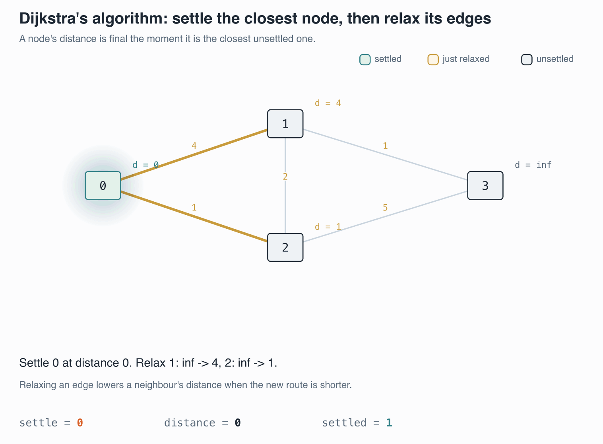</video>
<figcaption><b>Animation 12.5</b> <code>dijkstra_vec</code> settles the node with the smallest cost in the heap, then relaxes its edges. An entry whose cost is above the recorded distance is stale and skipped.</figcaption>
</figure>

Read the table row by row. Taking A records B at 4 and C at 1. Taking C finds B at 1 + 2 = 3, which beats 4, so
B is recorded at 3 and pushed again. The old `(4, B)` entry is now stale. Taking B at 3 finds D at 4, which
beats the 6 recorded through C. Later, `(4, B)` and `(6, D)` come off the heap, and each is skipped because its
cost is higher than the recorded one.

### 12.9.2 Two versions side by side

<p class="listing"><b>Listing 12.16</b> Dijkstra over the index form (lines 23 to 44). <a href="https://github.com/arpanpathak/cracking-the-systems-programming-interview/blob/prep-v2/rust-interview-lab/src/problems/graph_dijkstra.rs">src/problems/graph_dijkstra.rs</a></p>

```rust
{{#include ../../rust-interview-lab/src/problems/graph_dijkstra.rs:15:21}}

{{#include ../../rust-interview-lab/src/problems/graph_dijkstra.rs:23:44}}
```

The distances are a `Vec<Option<u32>>`, where `None` means "no path found yet". Two methods of `Option` read
well here:

- `is_some_and(|best| current_cost > best)` is true only if there is a recorded cost and the popped cost is
  higher. That is the stale check.
- `is_none_or(|best| new_distance < best)` is true if there is no recorded cost, or the new cost is lower. That
  is the relax check.

The heap holds `Reverse((cost, node))`. `BinaryHeap` pops the largest item, and `Reverse` flips the comparison,
so the smallest cost comes out first. Tuples compare by their first field, then by their second, so the cost
decides and the node number breaks ties.

<p class="listing"><b>Listing 12.17</b> Dijkstra over the map form (lines 46 to 73).</p>

```rust
{{#include ../../rust-interview-lab/src/problems/graph_dijkstra.rs:46:73}}
```

In this version, `distances` is a `HashMap` that contains only nodes that have been reached. `Node` also needs
`Ord`, because nodes sit inside the tuples that the heap compares.

`distances[&current_node]` cannot panic here. A node is pushed onto the heap only after its distance is inserted,
so every popped node has an entry. `distances.get(&neighbor).unwrap_or(&u32::MAX)` treats a missing entry as
the largest possible cost, so any real cost beats it.

Each edge can push one heap entry, and each heap operation takes O(log E). The whole algorithm runs in
O(E log E), which is the same as O(E log V) for simple graphs.

```text
$ cargo test --lib problems::graph_dijkstra
running 4 tests
test problems::graph_dijkstra::tests::vec_variant_finds_shorter_multi_hop_paths ... ok
test problems::graph_dijkstra::tests::vec_variant_marks_unreachable_nodes ... ok
test problems::graph_dijkstra::tests::map_variant_omits_unreachable_nodes ... ok
test problems::graph_dijkstra::tests::map_variant_finds_shorter_multi_hop_paths ... ok

test result: ok. 4 passed; 0 failed; 0 ignored; 0 measured; 133 filtered out
```

<div class="callout warning" markdown="1">

**WARNING:** `current_cost + weight` panics on overflow in a debug build, and wraps around silently in a
release build. With `u32` weights, a long path of large weights can overflow. Listing 12.20 shows the fix with
`checked_add`.

</div>

### 12.9.3 Edges as a struct

The next three programs use a named `Edge` struct instead of a `(neighbor, weight)` tuple, and `u64` costs.
They show three steps of the same function: it first clones node names, then borrows them, and finally handles
missing nodes and overflow.

An `Edge` holds the node it leads to and its weight. `AdjMap` is an alias for the graph: each node, with the list of edges that leave it. Both are generic over the node type:

```rust
{{#include ../../rust-interview-lab/src/bin/dijkstra.rs:7:13}}
```

<p class="listing"><b>Listing 12.18</b> The complete program. <a href="https://github.com/arpanpathak/cracking-the-systems-programming-interview/blob/prep-v2/rust-interview-lab/src/bin/dijkstra.rs">src/bin/dijkstra.rs</a></p>

```rust
{{#include ../../rust-interview-lab/src/bin/dijkstra.rs}}
```

`edge.to` and `edge.weight` read better than `.0` and `.1`. The node type needs `Clone` instead of `Copy`, so
it could be a `String`. The function clones a node each time it stores one in `dist` or on the heap.

`graph[&node]` panics if a node has no entry in the map. `main` includes `"D"` with an empty list, so every node
has one.

```text
$ cargo run --bin dijkstra
{
    "B": [
        Edge {
            to: "D",
            weight: 1,
        },
    ],
    ...
}
{
    "B": 3,
    "C": 1,
    "A": 0,
    "D": 4,
}
```

The first print shows the graph and is cut short here. A `HashMap` does not keep its entries in any order. The lines of both prints can come out in a different
order on your machine.

<p class="listing"><b>Listing 12.19</b> The graph types, and borrowing nodes instead of cloning them (lines 1 to 47). <a href="https://github.com/arpanpathak/cracking-the-systems-programming-interview/blob/prep-v2/rust-interview-lab/src/bin/dijkstra_with_lifetime.rs">src/bin/dijkstra_with_lifetime.rs</a></p>

```rust
{{#include ../../rust-interview-lab/src/bin/dijkstra_with_lifetime.rs:1:13}}

{{#include ../../rust-interview-lab/src/bin/dijkstra_with_lifetime.rs:15:47}}
```

The types are generic over `Node`, the type that names a node, such as `&str` or `u32`. An `Edge<Node>` holds
the node it leads to and a weight. `AdjMap<Node>` is an alias for the adjacency map: each node, and the list
of edges that leave it.

This version stores references to nodes, `&'a Node`, in `dist` and in the heap, so `Node` does not need `Clone`.
With `String` nodes, that saves an allocation per clone.

The lifetime `'a` ties everything together. The graph and the start node are both borrowed for `'a`, and the
returned map holds `&'a Node` keys. The compiler therefore keeps the graph alive as long as the result is in
use. Every reference pushed onto the heap, `&edge.to`, points into the graph, so it lives long enough.

Two `let ... else` lines make the function safer than listing 12.18:

- `let Some(edges) = graph.get(node) else { continue };` handles a node that has no entry in the map. `main`
  leaves `"D"` out of the map, and the function still works.
- `let Some(new_cost) = cost.checked_add(edge.weight) else { continue };` skips an edge whose total cost would
  overflow. `checked_add` returns `None` on overflow instead of panicking or wrapping around.

<p class="listing"><b>Listing 12.20</b> The complete program. <a href="https://github.com/arpanpathak/cracking-the-systems-programming-interview/blob/prep-v2/rust-interview-lab/src/bin/dijkstra_with_lifetime.rs">src/bin/dijkstra_with_lifetime.rs</a></p>

```rust
{{#include ../../rust-interview-lab/src/bin/dijkstra_with_lifetime.rs}}
```

In `main`, `let start = "A".into();` makes a `String` in its own variable, because the function needs a
reference that lives as long as the graph borrow.

```text
$ cargo run --bin dijkstra_with_lifetime
Graph => {
    ...
}
Shortest path {
    "A": 0,
    "B": 3,
    "D": 4,
    "C": 1,
}
```

The last version keeps the owned, cloning style of listing 12.18 and adds the two safety checks.

<p class="listing"><b>Listing 12.21</b> The complete program. <a href="https://github.com/arpanpathak/cracking-the-systems-programming-interview/blob/prep-v2/rust-interview-lab/src/bin/dijkstra_bruce_lee.rs">src/bin/dijkstra_bruce_lee.rs</a></p>

```rust
{{#include ../../rust-interview-lab/src/bin/dijkstra_bruce_lee.rs}}
```

```text
$ cargo run --bin dijkstra_bruce_lee
{"B": 3, "C": 1, "D": 4, "A": 0}
```

Table 12.1 compares the five versions.

<p class="listing"><b>Table 12.1</b> The five Dijkstra implementations</p>

| Listing | Nodes | Edges | Missing node entry | Overflow |
|---|---|---|---|---|
| 12.16 `dijkstra_vec` | `usize` indices | `(usize, u32)` | cannot happen | panics in debug |
| 12.17 `dijkstra` | `Copy` values | `(Node, u32)` | panics | panics in debug |
| 12.18 `dijkstra.rs` | cloned | `Edge`, `u64` | panics | panics in debug |
| 12.20 `dijkstra_with_lifetime.rs` | borrowed | `Edge`, `u64` | skipped | skipped |
| 12.21 `dijkstra_bruce_lee.rs` | cloned | `Edge`, `u64` | skipped | skipped |

## 12.10 Connecting every node at the lowest cost

The last problem uses an undirected, weighted graph. Think of the nodes as buildings and the weights as the cost
of laying cable between two buildings. You want to connect every building, directly or indirectly, at the lowest
total cost.

A set of edges that connects all the nodes without forming a cycle is a **spanning tree**. A spanning tree with
the lowest total weight is a **minimum spanning tree** (MST). With n nodes, a spanning tree has exactly n − 1
edges. One edge fewer would leave a node disconnected, and one edge more would close a loop.

**Kruskal's algorithm** builds an MST by taking edges from lightest to heaviest. It keeps an edge if the edge
joins two groups of nodes that are not yet connected. It skips an edge whose two ends are already connected,
because that edge would close a loop.

### 12.10.1 Union-find

Kruskal's algorithm needs to answer one question fast: are these two nodes already connected? A **union-find**
structure, also called a disjoint set, answers it.

Union-find keeps nodes in groups. Each group is a small tree stored in a `parent` array, where `parent[i]` is
the node that `i` points to. The node at the top of a group points to itself and is called the group's **root**.
Two nodes are in the same group when they have the same root.

There are two operations:

- `find(x)` follows `parent` links from `x` up to the root.
- `union(x, y)` finds both roots. If the roots differ, it makes one root point to the other, which joins the two
  groups.

<p class="listing"><b>Listing 12.22</b> Union-find (lines 10 to 49). <a href="https://github.com/arpanpathak/cracking-the-systems-programming-interview/blob/prep-v2/rust-interview-lab/src/bin/kruskals_algorithm.rs">src/bin/kruskals_algorithm.rs</a></p>

```rust
{{#include ../../rust-interview-lab/src/bin/kruskals_algorithm.rs:1:1}}

{{#include ../../rust-interview-lab/src/bin/kruskals_algorithm.rs:10:49}}
```

`new` makes every node its own group: `parent` is `[0, 1, 2, ...]`, built with `(0..n).collect()`.

`find` is recursive. On the way back from the root, it sets `parent[elem]` to the root directly. The next `find`
on that node then takes one step instead of many. This trick is called **path compression**.

`union` returns `false` if both nodes already have the same root. Otherwise it joins the groups using `rank`, a
rough measure of each group's height. The shorter group goes under the taller one, so the trees stay flat. If
both have the same rank, either can go under the other, and the new root's rank grows by one. This is called
**union by rank**.

With both tricks, `find` and `union` take nearly constant time in practice.

### 12.10.2 Kruskal's algorithm

<p class="listing"><b>Listing 12.23</b> The edge type and Kruskal's algorithm (lines 3 to 65).</p>

```rust
{{#include ../../rust-interview-lab/src/bin/kruskals_algorithm.rs:3:8}}

{{#include ../../rust-interview-lab/src/bin/kruskals_algorithm.rs:51:65}}
```

An `Edge` joins nodes `u` and `v`, numbered from 0, with weight `w`. The graph is undirected, so the
order of `u` and `v` does not matter.

`edges.sort_by_key(|e| e.w)` sorts the edges by weight. Then each edge is offered to `union`. If `union`
returns `true`, the edge joined two groups, and it goes into the tree. The edge is moved into `mst`, not copied,
because `for edge in edges` takes ownership of each one.

Sorting dominates the running time, so the algorithm runs in O(E log E).

Figure 12.8 follows the `parent` array through every edge of the program's graph.

<figure>
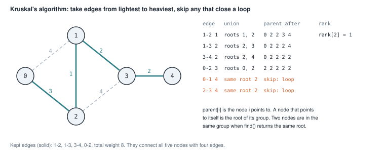
<figcaption><b>Figure 12.8</b> Kruskal's algorithm with union-find. The two weight-4 edges would close loops, so they are skipped.</figcaption>
</figure>

`sort_by_key` is a stable sort: edges with equal weights keep their input order. So 1-3 comes before 3-4, and
0-1 comes before 2-3.

<figure class="anim">
<video class="motion" src="figures/ch12-kruskal.mp4" autoplay loop muted playsinline preload="metadata" aria-label="Five nodes with weighted edges, colored by the set each node belongs to. The edges are taken cheapest first. An edge joining two sets is kept and the sets merge. The edges 0-1 and 2-3 would close cycles and are skipped. Four edges remain, total weight 8." data-chapters="[[2.4, &quot;union-find&quot;]]">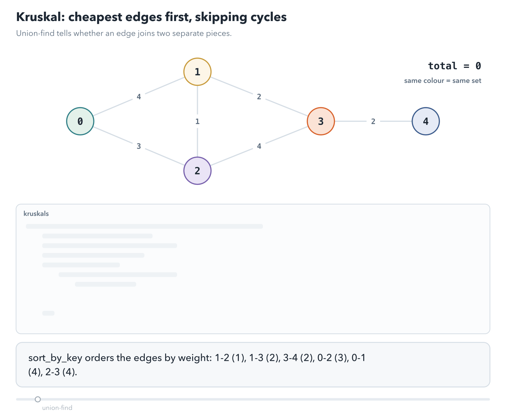</video>
<figcaption><b>Animation 12.6</b> Edges arrive cheapest first. <code>union</code> keeps an edge only when its ends are in different sets, so no kept edge closes a cycle.</figcaption>
</figure>


<p class="listing"><b>Listing 12.24</b> The complete program. <a href="https://github.com/arpanpathak/cracking-the-systems-programming-interview/blob/prep-v2/rust-interview-lab/src/bin/kruskals_algorithm.rs">src/bin/kruskals_algorithm.rs</a></p>

```rust
{{#include ../../rust-interview-lab/src/bin/kruskals_algorithm.rs}}
```

```text
$ cargo run --bin kruskals_algorithm
1 - 2 (1)
1 - 3 (2)
3 - 4 (2)
0 - 2 (3)
total: 8
```

The tree has four edges for five nodes, as expected.

## 12.11 The complete files

The sections above showed these files in excerpts. Here each one is whole.

<p class="listing"><b>Listing 12.25</b> Breadth-first search, with its tests. <a href="https://github.com/arpanpathak/cracking-the-systems-programming-interview/blob/prep-v2/rust-interview-lab/src/problems/graph_bfs.rs">src/problems/graph_bfs.rs</a></p>

```rust
{{#include ../../rust-interview-lab/src/problems/graph_bfs.rs}}
```

<p class="listing"><b>Listing 12.26</b> Depth-first search, with its tests. <a href="https://github.com/arpanpathak/cracking-the-systems-programming-interview/blob/prep-v2/rust-interview-lab/src/problems/graph_dfs.rs">src/problems/graph_dfs.rs</a></p>

```rust
{{#include ../../rust-interview-lab/src/problems/graph_dfs.rs}}
```

<p class="listing"><b>Listing 12.27</b> Dijkstra's algorithm, with its tests. <a href="https://github.com/arpanpathak/cracking-the-systems-programming-interview/blob/prep-v2/rust-interview-lab/src/problems/graph_dijkstra.rs">src/problems/graph_dijkstra.rs</a></p>

```rust
{{#include ../../rust-interview-lab/src/problems/graph_dijkstra.rs}}
```

<div class="summary" markdown="1">

## Summary

- A graph is a set of nodes and edges, with no rule against cycles. Every traversal needs a record of the nodes
  it has handled.
- An adjacency list stores each node's outgoing edges. The index form uses `Vec<Vec<...>>` and numbered nodes.
  The map form uses a `HashMap` and allows any hashable node.
- BFS uses a queue and visits nodes in order of edge count from the start. DFS uses a stack and follows one path
  as deep as it goes. Both run in O(V + E).
- Graph nodes in Rust are usually numbers into a `Vec`, which avoids reference cycles.
- Cycle detection needs three states. An edge to a node on the current path, a Visiting node, closes a cycle.
- A grid is a graph whose edges are computed from coordinates. Counting islands runs one flood fill per island.
- Kahn's algorithm produces a topological order by repeatedly taking nodes with indegree 0. A shorter order than
  the node count means the graph has a cycle.
- Dijkstra's algorithm finds lowest-cost paths with a min-heap, skipping stale entries. `checked_add` and
  `let ... else` guard against overflow and missing nodes.
- Kruskal's algorithm builds a minimum spanning tree from the lightest edges, using union-find to skip edges
  that would close a loop.

</div>

Chapter 13 builds an LRU cache, which combines a hash map with a linked list. It brings back the ownership
questions of chapters 8 and 9.

## Exercises

1. Change `bfs_vec` in listing 12.1 to also return, for each node, the number of edges on the shortest path from
   the start.
2. Extend `dijkstra_vec` to record each node's predecessor on its shortest path. Then write a function that
rebuilds the path from the start to a given node.
3. Rewrite `count_islands` with a `Vec<bool>` for `visited`, and with a DFS stack instead of a BFS queue. Check
   that the tests still pass.
4. Change `topo_sort` in listing 12.15 to return `Option<Vec<String>>`, and add a test with a cycle.
5. Rewrite `find` in listing 12.22 with a loop instead of recursion, keeping path compression.
