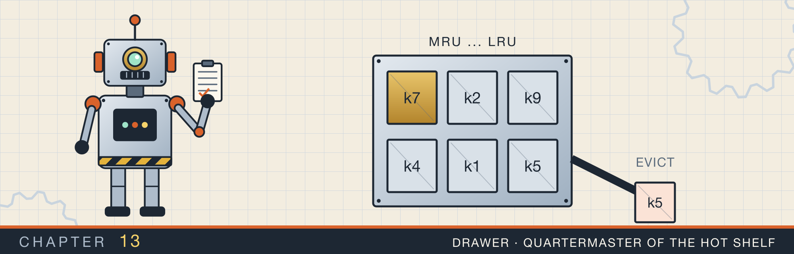
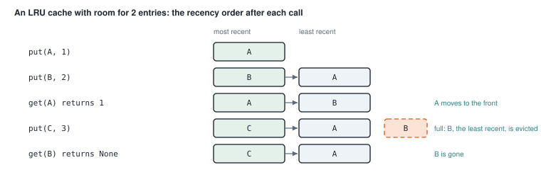
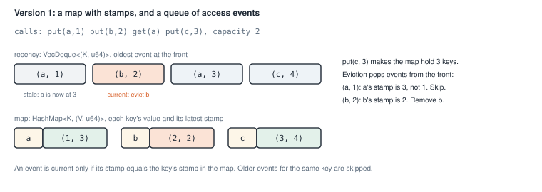
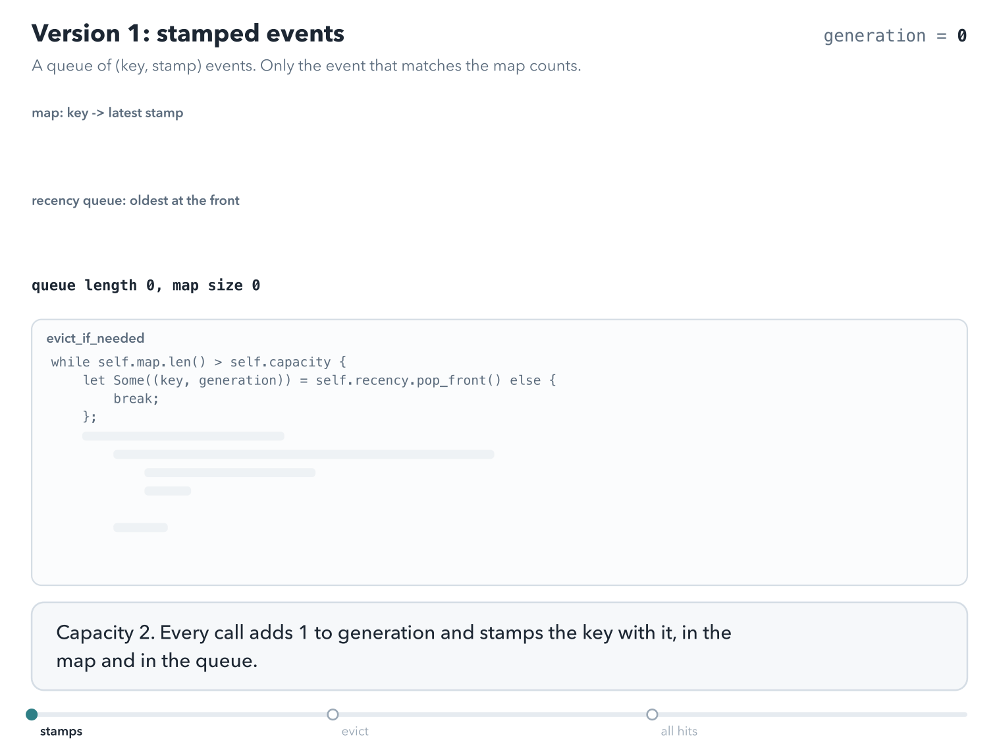
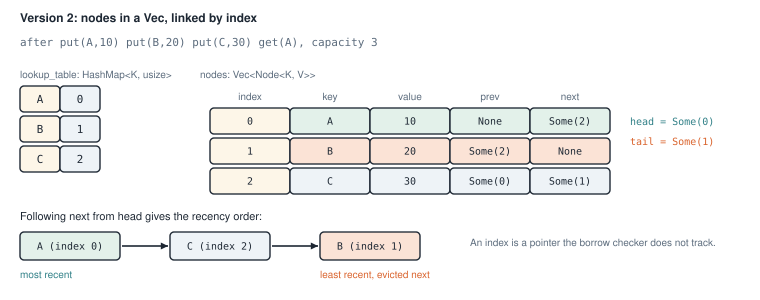
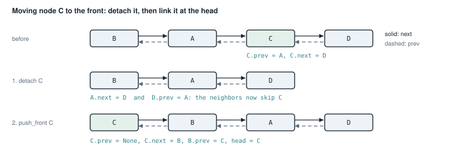
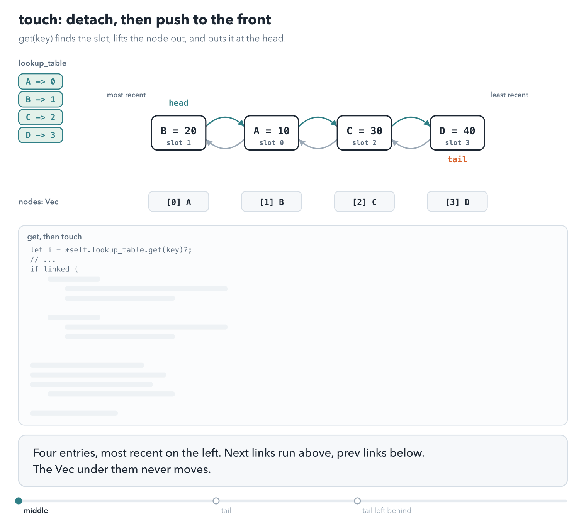
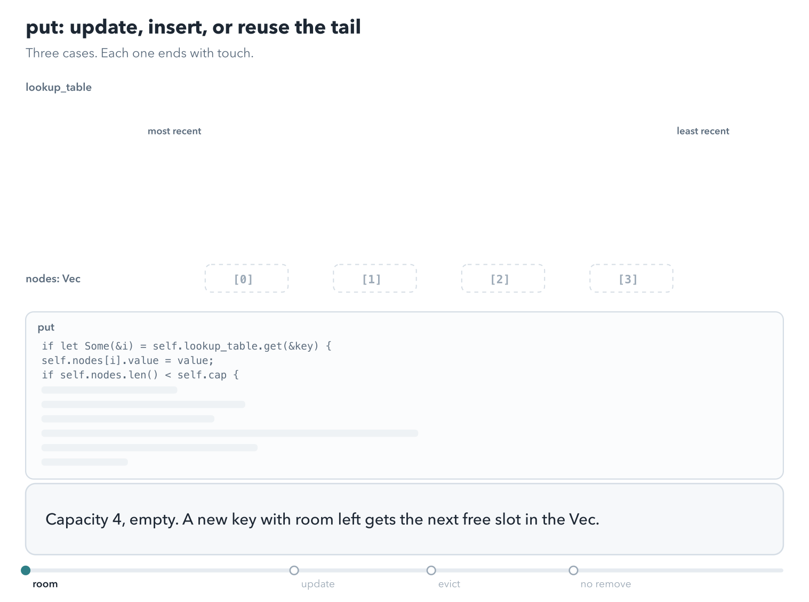
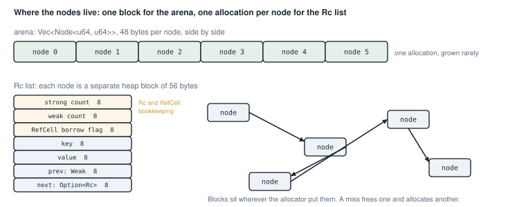
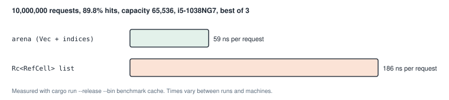

# An LRU cache

<div class="covers" markdown="1">

This chapter covers

- What a cache is, and the least-recently-used rule for deciding what to throw away
- An LRU cache built from a map and a queue of stamped events
- An LRU cache built from a doubly linked list stored in a `Vec`, with indices as links
- The same list split into small operations with stated preconditions
- A benchmark of the `Vec` version against a list of `Rc<RefCell<_>>` nodes

</div>

A **cache** keeps a limited number of recent results close at hand, so a program does not have to compute or
fetch them again. A web browser caches images. A database caches disk pages in memory. A CPU caches memory in
small, fast storage next to its cores, which chapter 15 looks at.

A cache has a fixed size. When it is full and a new entry arrives, it must remove, or **evict**, an old entry.
The rule for choosing which entry to evict is the cache's **eviction policy**.

This chapter builds a cache with the **least recently used** (LRU) policy: evict the entry that has gone longest
without being used. The idea is that an entry used recently is likely to be used again soon.

You have already built both parts of an LRU cache. Chapter 3 covered `HashMap`, and chapters 8 and 9 covered
linked lists and `Rc`. This chapter combines them, four ways, and then measures two of them.

## 13.1 What an LRU cache does

An LRU cache has two operations:

- `get(key)` returns the value for `key`, or nothing if the key is not cached. A successful `get` counts as a use,
  so the key becomes the most recently used.
- `put(key, value)` stores the value. The key becomes the most recently used. If the cache was full and the key
  is new, the least recently used entry is evicted.

Figure 13.1 follows five calls on a cache with room for two entries.

<figure>

<figcaption><b>Figure 13.1</b> The recency order after each call. The entry at the right end is evicted next.</figcaption>
</figure>

The third call changes the outcome. Without `get(A)`, A would be the least recent entry, and `put(C, 3)` would
evict A. Because `get(A)` counted as a use, B is evicted instead.

### 13.1.1 What a cache saves

A cache pays off when a hit is much cheaper than the work it replaces. Suppose a lookup in the cache takes
100 ns, and a miss means a database query that takes 1 ms, ten thousand times longer. The average cost of a
request is then set almost entirely by the misses:

| Hit rate | Average cost of a request |
|---|---|
| 0% | 1 ms |
| 50% | about 500 µs |
| 90% | about 100 µs |
| 99% | about 10 µs |

Going from 90% to 99% makes the average ten times smaller. The hit rate depends on what stays in the cache,
and the eviction policy decides that.

Here is a longer trace. The cache holds three entries, and eight requests arrive: A, B, A, C, A, D, A, B. A
request for a cached key is a hit; any other request is a miss, which fetches the value and stores it. The
table follows the LRU rule, and a simpler rule for comparison. **FIFO**, first in, first out, evicts the entry
that arrived earliest, and ignores use. The order is shown most recent first.

| Request | LRU: entries after | LRU | FIFO: entries after | FIFO |
|---|---|---|---|---|
| A | A | miss | A | miss |
| B | B A | miss | B A | miss |
| A | A B | hit | B A | hit |
| C | C A B | miss | C B A | miss |
| A | A C B | hit | C B A | hit |
| D | D A C | miss, evicts B | D C B | miss, evicts A |
| A | A D C | hit | A D C | miss, evicts B |
| B | B A D | miss, evicts C | B A D | miss, evicts C |

LRU scores 3 hits, and FIFO 2. A is used most, and LRU never evicts it: every use moves it back to the front.
FIFO evicts A at the sixth request because A arrived first, and the very next request misses on A.

Animation 13.1 plays the same trace, with a robot for the cache and one for the slow store behind it.

<figure class="anim">
<video class="motion" src="figures/ch13-lru-shelf.mp4" autoplay loop muted playsinline preload="metadata" aria-label="A cache robot with a shelf of three slots, most recent on the left, and a backing store robot on the right, with the eight requests A, B, A, C, A, D, A, B above. Each miss sends a fetch to the backing store, which takes time, and the value lands in the front slot. Each hit takes the value from the shelf and moves it to the front. At the sixth request the shelf is full, and B, at the back, slides into the evicted tray. The run ends with 3 hits and 5 misses, and A never left the shelf. In a second run with FIFO, hits do not move anything; D evicts A, which arrived first, and the next request for A misses: 2 hits and 6 misses." data-chapters="[[0.0, &quot;LRU&quot;], [36.29, &quot;FIFO&quot;]]"></video>
<figcaption><b>Animation 13.1</b> The trace above. Under LRU, each use moves an entry to the front, so the hot key stays. Under FIFO, the hot key is evicted because it arrived first.</figcaption>
</figure>

LRU works when the recent past predicts the near future, which holds for most workloads. One pattern breaks it:
a scan that reads many keys once each. Every key in the scan becomes the most recent, and the scan pushes out
the entries that were in steady use. Databases defend against this with variants that admit a key fully only
on its second use.

A cache needs to answer two questions fast:

1. Is this key cached, and what is its value? A `HashMap` answers that in O(1).
2. Which entry is the least recently used? This needs an order that changes on every call.

Keeping the order in a `Vec` would be slow. Moving an entry from the middle to the front shifts every element
between, which is O(n). The four versions in this chapter keep the order in structures where each step is O(1).

## 13.2 Version 1: stamped events in a queue

The first version avoids a linked list entirely. Its idea is to record each use as an event, and to sort out
which events still count only when something must be evicted.

The cache has a counter called `generation` that goes up by one on every call. Each call stamps the key with the
current generation in two places (figure 13.2):

- The map stores each key's value and its latest stamp: `HashMap<K, (V, u64)>`.
- A queue, `recency`, receives a `(key, stamp)` event at the back on every use.

<figure>

<figcaption><b>Figure 13.2</b> The state after four calls. The event (a, 1) is stale, because a was used again at stamp 3.</figcaption>
</figure>

The queue is in the order of use, oldest at the front. A key used several times has several events in it. Only
the event whose stamp matches the map is current. The others are **stale**, the same idea as the stale heap
entries of Dijkstra's algorithm in section 12.9.

To evict, the cache pops events from the front. It skips stale events, and removes the key of the first
current event. That key is the least recently used one.

<p class="listing"><b>Listing 13.1</b> The type (lines 10 to 24). <a href="https://github.com/arpanpathak/cracking-the-systems-programming-interview/blob/prep-v2/rust-interview-lab/src/problems/lru_cache.rs">src/problems/lru_cache.rs</a></p>

```rust
{{#include ../../rust-interview-lab/src/problems/lru_cache.rs:10:24}}
```

The key must be `Clone`, because a copy of it goes into the queue with every event. The value must be `Clone`,
because `get` returns a copy of it.

<p class="listing"><b>Listing 13.2</b> <code>get</code> and <code>put</code> (lines 49 to 71).</p>

```rust
impl<K, V> LruCache<K, V>
where
    K: Eq + Hash + Clone,
    V: Clone,
{
    // ...
{{#include ../../rust-interview-lab/src/problems/lru_cache.rs:49:71}}
    // ...
}
```

`get` looks up the key and returns early with `None` if it is missing: `self.map.get(key)?`. Then it advances the
generation, records an event, and stores the value again with the new stamp.

`put` stores the value with a new stamp, and records an event. `HashMap::insert` returns the old value if the key
was already present, or `None` if it was new. Only a new key can make the map too large, so only a new key
triggers eviction.

<p class="listing"><b>Listing 13.3</b> Eviction (lines 73 to 87).</p>

```rust
impl<K, V> LruCache<K, V>
where
    K: Eq + Hash + Clone,
    V: Clone,
{
    // ...
{{#include ../../rust-interview-lab/src/problems/lru_cache.rs:73:87}}
}
```

The loop runs while the map holds more keys than the capacity. Each pass pops the oldest event. The match guard
`Some((_, current)) if *current == generation` accepts the event only if its stamp matches the key's stamp in
the map. A match removes the key and ends the loop. A stale event matches the `_` arm and is dropped.

Each event is pushed once and popped at most once. So the total work over many calls is proportional to the
number of calls, and each call costs O(1) on average. A cost measured this way, averaged over a sequence of
calls, is called **amortized**.

Animation 13.2 runs the four calls of figure 13.2 with a capacity of 2, then a run of hits.

<figure class="anim">
<video class="motion" src="figures/ch13-lru-stamps.mp4" autoplay loop muted playsinline preload="metadata" aria-label="A map from key to latest stamp and a queue of (key, stamp) events, with a generation counter. put a, put b, get a, and put c add events (a, 1), (b, 2), (a, 3), and (c, 4); the map holds a: 3, b: 2, c: 4. With three keys and capacity 2, eviction pops (a, 1), finds that a's stamp is 3, and skips it as stale; it pops (b, 2), which matches, and removes b. In a second run, eight hits on a and c add eight events, and the queue reaches 10 events while the map holds 2 keys." data-chapters="[[0.0, &quot;stamps&quot;], [16.86, &quot;evict&quot;], [34.74, &quot;all hits&quot;]]"></video>
<figcaption><b>Animation 13.2</b> Eviction skips stale events until it finds a current one. Without evictions, nothing removes events, and the queue grows with every hit.</figcaption>
</figure>

<div class="callout warning" markdown="1">

**WARNING:** The queue gets one new event per call, but loses events only during eviction. A workload of mostly
hits evicts rarely, so the queue can grow far longer than the capacity. The memory used depends on the number of
calls, not on the number of cached entries. Exercise 1 asks you to fix it.

</div>

## 13.3 Version 2: a linked list inside a `Vec`

The classic LRU design keeps the entries in a doubly linked list, ordered from most to least recently used.
A doubly linked list can move an entry to the front in O(1). Removing the last entry and adding one at the
front are O(1) too. The map stores, for each key, where that key's node is.

Chapter 9 showed that a doubly linked list of `Rc<RefCell<_>>` nodes is awkward in Rust. Each node is owned
jointly, every change goes through runtime borrow checks, and the back links must be `Weak` to avoid leaks.

This version uses a different approach. All nodes live in one `Vec`, and a link is the index of another node in
that `Vec`. A `Vec` used as a pool of nodes this way is called an **arena**. Figure 13.3 shows one.

<figure>

<figcaption><b>Figure 13.3</b> Three entries in the arena. The order in the <code>Vec</code> is the order of insertion. The <code>prev</code> and <code>next</code> indices give the order of use.</figcaption>
</figure>

An index is a plain `usize`. The borrow checker does not track it, so a node can be "pointed to" by several other
nodes with no `Rc` and no `RefCell`. The cost is that the compiler cannot catch a wrong index. The code must keep
the links correct by itself.

<p class="listing"><b>Listing 13.4</b> The node and the cache (lines 20 to 45). <a href="https://github.com/arpanpathak/cracking-the-systems-programming-interview/blob/prep-v2/rust-interview-lab/src/problems/lru_cache_easy.rs">src/problems/lru_cache_easy.rs</a></p>

```rust
{{#include ../../rust-interview-lab/src/problems/lru_cache_easy.rs:20:45}}
```

Each node stores its key as well as its value. When a node is evicted, the cache reads the key from the node to
remove the key from `lookup_table`.

`prev` and `next` are `Option<usize>`, where `None` means "no neighbor on that side". `head` is the index of the
most recently used node, and `tail` is the index of the least recently used one.

### 13.3.1 Moving a node to the front

Every `get` and `put` ends by moving one node to the front of the list. The method `touch` does it in two steps
(figure 13.4):

1. **Detach** the node: make its two neighbors point at each other, so the list skips it.
2. **Push it to the front**: make it point at the old head, and make it the new head.

<figure>

<figcaption><b>Figure 13.4</b> Moving C to the front. Only the links around C and at the head change.</figcaption>
</figure>

Animation 13.3 runs `touch` on a list of four entries. The `Vec` sits underneath and never moves. Only the
links above it change. Watch the arrows: when C is lifted out, A's `next` swings over to D.

<figure class="anim">
<video class="motion" src="figures/ch13-lru-touch.mp4" autoplay loop muted playsinline preload="metadata" aria-label="Four nodes B, A, C, D in a chain, next links above and prev links below, a lookup table on the left, and the Vec slots underneath. get(C) looks up slot 2, lifts C out of the chain, points A's next at D and D's prev at A, slides the rest right, and sets C down at the front with C.next = B, B.prev = C, and head = C. get(D) on the tail moves the tail marker back to A. In a last run without the line None => self.tail = prev, the tail marker stays on D after D moves to the front, so the next eviction would remove the entry just read." data-chapters="[[0.0, &quot;middle&quot;], [30.02, &quot;tail&quot;], [51.52, &quot;tail left behind&quot;]]"> self.tail = prev, the tail marker stays on D after D moves to the front, so the next eviction would remove the entry just read."></video>
<figcaption><b>Animation 13.3</b> <code>touch</code>: detach the node, close the gap, push it at the head. Without the tail update, the tail marker travels to the front with its node.</figcaption>
</figure>

<p class="listing"><b>Listing 13.5</b> <code>new</code> and <code>touch</code> (lines 51 to 101).</p>

```rust
impl<K, V> LruCache<K, V>
where
    K: Hash + Eq + Clone,
{
{{#include ../../rust-interview-lab/src/problems/lru_cache_easy.rs:51:101}}
    // ...
}
```

`touch` first copies the node's `prev` and `next` into local variables. `Option<usize>` is `Copy`, so this reads
the values without keeping a borrow of `self.nodes`.

A brand-new node is not in the list yet, so there is nothing to detach. `touch` tells the two cases apart with
`linked`. A node is in the list if it has a neighbor, or if it is the head or the tail. A list with one node has
no neighbors, so the head and tail checks are needed for that case.

The detach step handles the ends of the list. If the node has no `prev`, it was the head, so the head moves to
its `next`. If it has no `next`, it was the tail, so the tail moves to its `prev`.

The push step sets the node's links, points the old head back at it, and makes it the head. If the list was
empty, the node is also the tail.

### 13.3.2 `get` and `put`

<p class="listing"><b>Listing 13.6</b> <code>get</code> and <code>put</code> (lines 103 to 147).</p>

```rust
impl<K, V> LruCache<K, V>
where
    K: Hash + Eq + Clone,
{
    // ...
{{#include ../../rust-interview-lab/src/problems/lru_cache_easy.rs:103:147}}
}
```

`get` finds the index, touches the node, and returns a reference to the value. The return type `Option<&V>`
borrows from the cache. Because `get` takes `&mut self`, the cache stays mutably borrowed while you hold that
reference.

`put` has three cases:

1. **The key is present.** Replace the value and touch the node.
2. **There is room.** Push a new node onto the end of the `Vec`, record its index, and touch it.
3. **The cache is full.** Reuse the tail node's slot for the new entry.

The third case is the arena's advantage. Eviction does not free anything, and insertion does not allocate. The
tail slot receives the new key and value, and `touch` moves it to the front.

`std::mem::replace(&mut self.nodes[i].key, key)` puts the new key into the node and returns the old key, in one
step. The old key is then removed from `lookup_table`. The new key was moved into the node, so the map receives a
clone of it.

Animation 13.4 plays the three cases in order. It fills the cache, updates an entry, and then evicts the tail
by reusing its slot. The last run leaves out the `remove` of the old key.

<figure class="anim">
<video class="motion" src="figures/ch13-lru-put.mp4" autoplay loop muted playsinline preload="metadata" aria-label="An empty cache of capacity 4. put A, B, C, D each push a node into the next free Vec slot, record it in the lookup table, and rise to the front of the chain: D, C, B, A. put(B, 21) finds B, changes its value in place, and moves it to the front. put(E, 50) with the cache full marks the tail A, reuses slot 0 for E, removes A from the table, adds E, and moves it to the front. In a last run without the remove, put(F, 60) reuses C's slot 2, the table still maps C to 2, and get(C) returns 60, F's value." data-chapters="[[0.0, &quot;room&quot;], [34.74, &quot;update&quot;], [52.47, &quot;evict&quot;], [70.88, &quot;no remove&quot;]]"></video>
<figcaption><b>Animation 13.4</b> <code>put</code>: update in place, push into a free slot, or reuse the tail's slot. A reused slot must leave the table under its old key, or a stale key finds another key's value.</figcaption>
</figure>

The file `src/bin/lru_cache_arena.rs` has the same cache with a `main` function:

<p class="listing"><b>Listing 13.7</b> The <code>main</code> function (lines 150 to 165). <a href="https://github.com/arpanpathak/cracking-the-systems-programming-interview/blob/prep-v2/rust-interview-lab/src/bin/lru_cache_arena.rs">src/bin/lru_cache_arena.rs</a></p>

```rust
{{#include ../../rust-interview-lab/src/bin/lru_cache_arena.rs:20:20}}

{{#include ../../rust-interview-lab/src/bin/lru_cache_arena.rs:150:165}}
```

```text
$ cargo run --bin lru_cache_arena
get A = Some(10)
get B = None
get A = Some(10)
get C = Some(30)
get A = Some(99)
```

## 13.4 Version 3: one operation per method

`touch` in version 2 does two jobs, and must first work out which situation it is in. Version 3 splits it into
three methods, each with a stated precondition. A **precondition** is something that must be true when a
function is called. The compiler cannot check these preconditions, so the doc comments state them.

This version also fixes the key and value types to `i32`. `i32` is `Copy`, so the code never clones a key.

<p class="listing"><b>Listing 13.8</b> The link operations (lines 63 to 94). <a href="https://github.com/arpanpathak/cracking-the-systems-programming-interview/blob/prep-v2/rust-interview-lab/src/bin/lru_cache_modular.rs">src/bin/lru_cache_modular.rs</a></p>

```rust
{{#include ../../rust-interview-lab/src/bin/lru_cache_modular.rs:20:20}}

impl LruCache {
    // ...
{{#include ../../rust-interview-lab/src/bin/lru_cache_modular.rs:63:94}}
    // ...
}
```

- `detach` unlinks a node. Its precondition is that the node is in the list.
- `push_front` links a node at the head. Its precondition is that the node is not in the list.
- `promote_to_front` combines them for a node that is in the list. If the node is already the head, it does
  nothing.

Each method now does one thing, with no `linked` check. `put` calls `push_front` for a new node and
`promote_to_front` for an existing one, so each call satisfies its precondition.

```text
$ cargo run --bin lru_cache_modular
get 1 = Some(10)
get 2 = None
get 1 = Some(10)
get 3 = Some(30)
get 1 = Some(99)
```

## 13.5 Version 4: measuring the arena against `Rc<RefCell<_>>`

Is the arena faster than a list of `Rc<RefCell<_>>` nodes, and by how much? The only reliable answer is to
measure. This section builds both caches behind one trait, and runs the same requests through each.

### 13.5.1 One trait, two caches

<p class="listing"><b>Listing 13.9</b> The trait. <a href="https://github.com/arpanpathak/cracking-the-systems-programming-interview/blob/prep-v2/rust-interview-lab/benchmarking_examples/cache/mod.rs">benchmarking_examples/cache/mod.rs</a></p>

```rust
{{#include ../../rust-interview-lab/benchmarking_examples/cache/mod.rs}}
```

The trait `Cache<K, V>` lists what the benchmark needs. `new` is part of the trait, so generic code can create
a cache with `C::new(capacity)` without knowing which type `C` is. `variant` has no `self` parameter. It is
called on the type, and gives each cache a name for the output.

`V: Copy` lets `get` return the value itself, `Option<V>`, instead of a reference. The benchmark stores `u64`
values, which are `Copy`.

The arena cache is version 2, split into two `impl` blocks. `touch` stays in an ordinary `impl`, because it is
not part of the trait. The trait methods go in `impl<K, V> Cache<K, V> for LruCache<K, V>`, and their bodies are
the `get` and `put` of section 13.3.2:

<p class="listing"><b>Listing 13.10</b> The arena cache's trait methods (lines 91 to 154). <a href="https://github.com/arpanpathak/cracking-the-systems-programming-interview/blob/prep-v2/rust-interview-lab/benchmarking_examples/cache/arena.rs">benchmarking_examples/cache/arena.rs</a></p>

```rust
{{#include ../../rust-interview-lab/benchmarking_examples/cache/arena.rs:91:154}}
```

Listing 13.20, at the end of the chapter, has the whole file.

### 13.5.2 The `Rc<RefCell<_>>` list

<p class="listing"><b>Listing 13.11</b> The node and the cache (lines 10 to 33). <a href="https://github.com/arpanpathak/cracking-the-systems-programming-interview/blob/prep-v2/rust-interview-lab/benchmarking_examples/cache/rc_list.rs">benchmarking_examples/cache/rc_list.rs</a></p>

```rust
{{#include ../../rust-interview-lab/benchmarking_examples/cache/rc_list.rs:10:33}}
```

This is the doubly linked list of chapter 9. A node is `Rc<RefCell<Node>>`: `Rc` so several owners can hold it,
and `RefCell` so it can be changed through those shared handles. `next` is a strong link, and `prev` is a `Weak`
link, so two neighbors do not keep each other alive forever. The map holds one more `Rc` to every node.

<p class="listing"><b>Listing 13.12</b> <code>detach</code> and <code>push_front</code> (lines 35 to 69).</p>

```rust
{{#include ../../rust-interview-lab/benchmarking_examples/cache/rc_list.rs:35:69}}
```

The logic matches listing 13.8, with pointers instead of indices. The difference is in the ceremony around
each step:

- `detach` reads the node's links inside a small block. `node.borrow()` returns a guard that holds a shared
  borrow of the `RefCell`. The block ends before any neighbor is changed, so the guard is dropped early. A
  `RefCell` panics if a `borrow_mut` happens while another borrow of the same cell is alive.
- `prev.upgrade()` turns the `Weak` link into an `Rc`, if the node still exists.
- Each `.clone()` of an `Rc` or a `Weak` increases a reference count, and each drop decreases one.

<p class="listing"><b>Listing 13.13</b> The trait methods and <code>Drop</code> (lines 71 to 139).</p>

```rust
{{#include ../../rust-interview-lab/benchmarking_examples/cache/rc_list.rs:71:139}}
```

On a miss with a full cache, `put` removes the tail node from the map and detaches it. When `victim` goes out of
scope, the last `Rc` to that node is dropped, and its memory is freed. Then `Rc::new` allocates a new node for the
new key. So every eviction frees one heap block and allocates another.

The `Drop` implementation is the fix from chapter 9. Dropping a long chain of `next` links recursively uses one
stack frame per node, and a large cache would overflow the stack. The loop breaks the links one node at a time.
The map drops its `Rc` handles afterward, and each drop then frees a single node.

Figure 13.5 compares where the two caches keep their nodes.

<figure>

<figcaption><b>Figure 13.5</b> Node storage for <code>u64</code> keys and values. The sizes were measured with <code>std::mem::size_of</code>.</figcaption>
</figure>

The arena's node is 48 bytes: the key and value take 8 bytes each, and each `Option<usize>` takes 16. The `Rc` node is 32 bytes. The heap block around it adds a strong count, a weak count, and the `RefCell`
flag, for 56 bytes. The memory sizes are close. What differs is the number of allocations and where the nodes sit in memory.

### 13.5.3 The benchmark

<p class="listing"><b>Listing 13.14</b> The request stream and the timed loop (lines 52 to 106). <a href="https://github.com/arpanpathak/cracking-the-systems-programming-interview/blob/prep-v2/rust-interview-lab/benchmarking_examples/benchmark.rs">benchmarking_examples/benchmark.rs</a></p>

```rust
{{#include ../../rust-interview-lab/benchmarking_examples/benchmark.rs:12:20}}

{{#include ../../rust-interview-lab/benchmarking_examples/benchmark.rs:52:106}}
```

A fair comparison needs both caches to see exactly the same requests. The program makes its own request stream
from a number called `state`. Each step multiplies and adds two fixed constants, so the same starting `state`
always produces the same sequence. A generator of this kind is called a **linear congruential generator**.

`key_at` shapes the stream to look like real traffic. Real caches see some keys far more often than others. Here,
80% of requests pick from a hot set of 1% of the keys, and the rest pick from all 131,072 keys. The capacity,
65,536, is half the key space.

Each request calls `get`. On a miss, it calls `put`, the way a program fills a cache after it computes a missing
value. `black_box` tells the compiler to treat the value as used, so the optimizer cannot remove the work.

<p class="listing"><b>Listing 13.15</b> Running and checking both caches (lines 108 to 158).</p>

```rust
{{#include ../../rust-interview-lab/benchmarking_examples/benchmark.rs:108:158}}
```

`best_cache_run::<ArenaCache<u64, u64>>()` runs the generic function with the arena cache, and the next line runs
it with the `Rc` cache. The `::<...>` syntax, called the turbofish, names the type parameter explicitly.

Before printing any times, the function checks that both caches finished with the same size and the same number
of hits. Two correct LRU caches given the same requests make the same decisions. If the counts differed, one
cache would have a bug, and its time would mean nothing.

`<ArenaCache<u64, u64> as Cache<u64, u64>>::variant()` is the fully qualified way to call a trait function that
has no `self`. It names both the type and the trait.

<p class="listing"><b>Listing 13.16</b> The complete benchmark program. <a href="https://github.com/arpanpathak/cracking-the-systems-programming-interview/blob/prep-v2/rust-interview-lab/benchmarking_examples/benchmark.rs">benchmarking_examples/benchmark.rs</a></p>

```rust
{{#include ../../rust-interview-lab/benchmarking_examples/benchmark.rs}}
```

The list half of this file was explained in section 9.7. Run only the cache half with the `cache` argument, and
always with `--release`. A debug build is not optimized, and its times do not show how the code performs.

```text
$ cargo run --release --bin benchmark cache
LRU cache: 65,536 entries, 10,000,000 requests over 131,072 keys
A miss inserts and evicts the least recently used entry.
Best of 3 runs per cache.

  hit rate: 89.8%  (8,979,314 hits, 1,020,686 inserts)

  storage                       total   per request
  ------------------------------------------------
  arena (Vec + indices)      587.49ms       59 ns
  Rc<RefCell> list              1.86s      186 ns

  the arena is 3.16x faster on the same requests: 587.49ms against 1.86s
  the arena reuses the evicted slot; the list frees a node and allocates another
```

<figure>

<figcaption><b>Figure 13.6</b> Time per request on an Intel Core i5-1038NG7 laptop.</figcaption>
</figure>

On this machine, the arena handled a request in 59 ns on average, and the `Rc` list took 186 ns. Your numbers
will differ, but the ratio should be similar on most machines.

The two caches do the same O(1) work per request. Three differences in how they do it add up:

- **Allocation.** About one request in ten is a miss, and each miss in the `Rc` list frees a node and allocates
  another. The arena reuses the tail slot.
- **Bookkeeping.** The `Rc` list updates reference counts on every clone and drop, and checks the `RefCell`
  borrow flag on every access. The arena reads and writes plain integers.
- **Location.** The arena's nodes sit side by side in one block. The `Rc` nodes sit wherever the allocator put
  them. Chapter 15 explains why nearby memory is faster to reach.

This benchmark measures the total, and does not separate the three costs. Exercise 4 suggests a way to
separate them.

## 13.6 The complete files

The sections above showed these files in excerpts. Here each one is whole.

<p class="listing"><b>Listing 13.17</b> Version 1, stamped events, with tests. <a href="https://github.com/arpanpathak/cracking-the-systems-programming-interview/blob/prep-v2/rust-interview-lab/src/problems/lru_cache.rs">src/problems/lru_cache.rs</a></p>

```rust
{{#include ../../rust-interview-lab/src/problems/lru_cache.rs}}
```

The tests cover the cases of figure 13.1. They check plain eviction, a `get` that saves an entry, and a
`put` to an existing key, which also counts as a use.

<p class="listing"><b>Listing 13.18</b> Version 2, the arena, with tests. <a href="https://github.com/arpanpathak/cracking-the-systems-programming-interview/blob/prep-v2/rust-interview-lab/src/problems/lru_cache_easy.rs">src/problems/lru_cache_easy.rs</a></p>

```rust
{{#include ../../rust-interview-lab/src/problems/lru_cache_easy.rs}}
```

The tests include a capacity of 1, where the single node is the head and the tail at once. Another test
checks that a capacity of 0 panics.

<p class="listing"><b>Listing 13.19</b> Version 3, one operation per method. <a href="https://github.com/arpanpathak/cracking-the-systems-programming-interview/blob/prep-v2/rust-interview-lab/src/bin/lru_cache_modular.rs">src/bin/lru_cache_modular.rs</a></p>

```rust
{{#include ../../rust-interview-lab/src/bin/lru_cache_modular.rs}}
```


<p class="listing"><b>Listing 13.20</b> The arena LRU cache. <a href="https://github.com/arpanpathak/cracking-the-systems-programming-interview/blob/prep-v2/rust-interview-lab/src/bin/lru_cache_arena.rs">src/bin/lru_cache_arena.rs</a></p>

```rust
{{#include ../../rust-interview-lab/src/bin/lru_cache_arena.rs}}
```

<p class="listing"><b>Listing 13.21</b> The <code>Rc&lt;RefCell&lt;_&gt;&gt;</code> LRU cache used by the benchmark. <a href="https://github.com/arpanpathak/cracking-the-systems-programming-interview/blob/prep-v2/rust-interview-lab/benchmarking_examples/cache/rc_list.rs">benchmarking_examples/cache/rc_list.rs</a></p>

```rust
{{#include ../../rust-interview-lab/benchmarking_examples/cache/rc_list.rs}}
```

<div class="summary" markdown="1">

## Summary

- An LRU cache evicts the entry that has gone longest without use. It needs fast lookup by key and a recency
  order that changes on every call.
- Version 1 records each use as a stamped event in a queue, and skips stale events during eviction. It is
  amortized O(1), but its queue grows with the number of calls.
- Version 2 keeps a doubly linked list in a `Vec`, with indices as links. Eviction reuses the tail slot, so the
  cache stops allocating once it is full.
- Version 3 splits the list operations into `detach`, `push_front`, and `promote_to_front`, each with one job and
  a stated precondition.
- Behind a common trait, the arena cache handled requests about three times faster than an `Rc<RefCell<_>>` list
  in this benchmark.
- A fair benchmark feeds both versions the same input, checks that their results agree, and runs in release
  mode.

</div>

Chapter 14 spreads a cache across several machines, and asks how to decide which machine holds which key.

## Exercises

1. Bound the queue in version 1. When `recency` grows longer than twice the capacity, rebuild it with only the
   current events. Check that the cost stays amortized O(1).
2. Add `peek(&self, key: &K) -> Option<&V>` to version 2, which returns a value without changing the order.
3. Add `remove(&mut self, key: &K) -> Option<V>` to version 3. The removed slot must be reused by a later `put`.
   Keep a list of free slots.
4. Change the benchmark's `CACHE_CAPACITY` to the full key space, so no request evicts anything. Compare the ratio
   with the one above, and explain what the change tells you about the cost of allocation.
