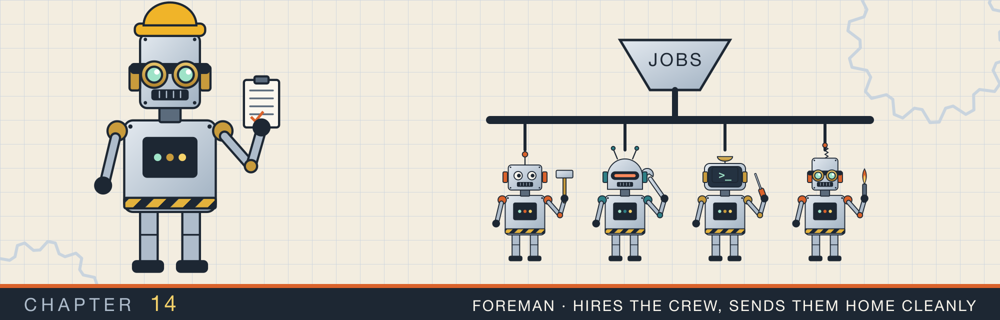
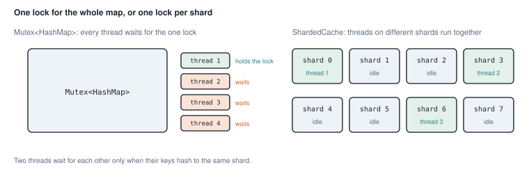
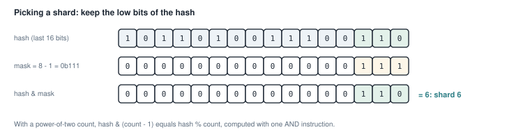
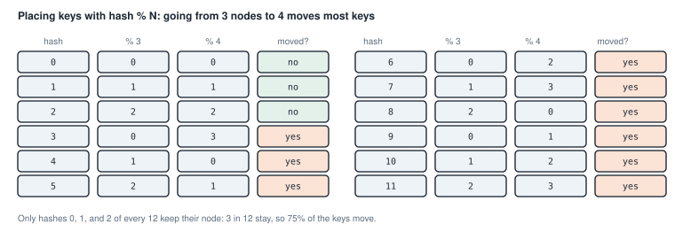
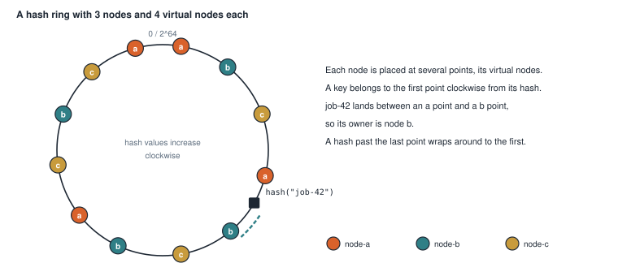
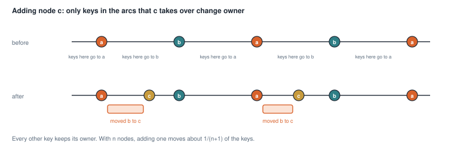
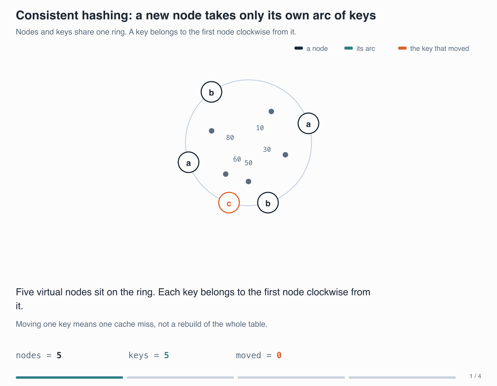
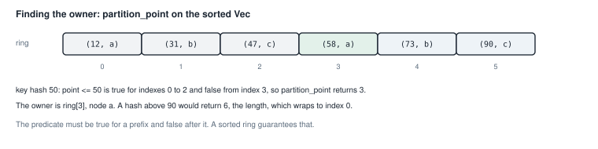

# Shards and consistent hashing

<div class="covers" markdown="1">

This chapter covers

- Why one lock around a whole map makes threads wait, and splitting the map into shards
- Choosing a shard from a hash with a bit mask
- Reading a value under a lock without cloning it, by passing a closure
- Why `hash % N` moves almost every key when N changes
- Consistent hashing: a ring of virtual nodes, searched with `partition_point`

</div>

The caches of chapter 13 serve one thread at a time. This chapter asks what happens when many threads, or many
machines, share one set of keys.

Both halves of the chapter use the same idea. You split the keys into groups by their hash, and each group is
handled separately. A group of keys handled separately is called a **shard**.

Section 14.1 splits a map inside one program, so threads that use different keys do not wait for each other.
Section 14.2 splits keys across machines, so that adding or removing a machine moves as few keys as possible.

## 14.1 A map split into shards

Section 8.6 showed how to share a value between threads: wrap it in a `Mutex`, and share the `Mutex` with an
`Arc`. A thread calls `lock()` before it touches the value. While one thread holds the lock, every other thread
that calls `lock()` waits.

A single `Mutex<HashMap<K, V>>` is safe, but it has a cost. If four threads use the map at once, three of them
wait, even when each thread wants a different key. Waiting for a lock that another thread holds is called
**lock contention**.

The fix is to give the map several locks. Split it into, say, eight smaller maps, each with its own `Mutex`
(figure 14.1). A key always goes to the same small map. Two threads then wait for each other only when their
keys land in the same shard.

<figure>

<figcaption><b>Figure 14.1</b> One lock for everything, against one lock per shard.</figcaption>
</figure>

### 14.1.1 The type

<p class="listing"><b>Listing 14.1</b> The type and the constructor (lines 16 to 42). <a href="https://github.com/arpanpathak/cracking-the-systems-programming-interview/blob/prep-v2/rust-interview-lab/src/problems/sharded_cache.rs">src/problems/sharded_cache.rs</a></p>

```rust
{{#include ../../rust-interview-lab/src/problems/sharded_cache.rs:16:24}}

{{#include ../../rust-interview-lab/src/problems/sharded_cache.rs:30:42}}
```

`ShardedCache` has three fields:

- `shards` is a `Vec` of maps, each inside its own `Mutex`.
- `hasher` produces the hash that picks a shard for a key.
- `mask` turns a hash into a shard number, as the next section explains.

`new` builds the `Vec` with an iterator. `(0..shard_count).map(|_| Mutex::new(HashMap::new()))` makes one empty,
locked map per shard, and `collect()` gathers them. The `_` in the closure ignores the shard number, which is
not needed.

The first line of `new` adjusts the requested count. `shard_count.max(1)` turns a request for 0 shards into 1.
`.next_power_of_two()` rounds up to the next power of two, so a request for 6 shards gives 8.

### 14.1.2 Picking a shard with a mask

A shard count that is a power of two lets the code pick a shard cheaply. For 8 shards, the mask is 8 − 1 = 7,
which is `0b111` in binary. The operation `hash & mask` keeps the lowest three bits of the hash and clears the
rest. The result is a number from 0 to 7 (figure 14.2).

<figure>

<figcaption><b>Figure 14.2</b> <code>hash &amp; mask</code> keeps the low bits. For a power-of-two count, it gives the same result as <code>hash % count</code>.</figcaption>
</figure>

`hash % 8` would give the same answer. The `&` is one simple CPU instruction, while `%` is a division, which
takes more time. The difference is small, but this code runs on every call.

<p class="listing"><b>Listing 14.2</b> Picking a shard (lines 44 to 49).</p>

```rust
{{#include ../../rust-interview-lab/src/problems/sharded_cache.rs:44:49}}
```

The method creates a hasher, feeds the key into it with `key.hash(&mut hasher)`, and reads the result with
`finish()`. It returns a reference to the chosen shard's `Mutex`.

The cache keeps one `RandomState` for its whole life. `RandomState::new()` picks random secret keys for the hash
function when the cache is created. Every lookup in the same cache uses the same keys, so a key always maps to the
same shard. A different cache, or the same program run again, would place the keys differently.

`HashMap` uses `RandomState` for the same reason. Random keys stop an attacker from choosing inputs that all hash
to the same place and slow the map down.

### 14.1.3 Each method locks one shard

<p class="listing"><b>Listing 14.3</b> <code>insert</code>, <code>get</code>, and <code>with</code> (lines 51 to 78).</p>

```rust
{{#include ../../rust-interview-lab/src/problems/sharded_cache.rs:51:78}}
```

Each method follows the same three steps: pick the shard, lock it, and call the matching `HashMap` method. The
methods take `&self`, not `&mut self`. The `Mutex` provides the permission to change the map, so a shared
reference to the cache is enough. Several threads can then share one cache through an `Arc`.

`lock()` returns a `Result`. It is an error only if another thread panicked while it held the same lock. Such a
lock is called **poisoned**, and chapter 16 covers it. Here `.expect(...)` turns that error into a panic with a
clear message.

The lock stays held until the guard returned by `lock()` is dropped. In `insert`, the guard is a temporary value
in one expression, so it is dropped at the end of the statement.

`get` must return a clone of the value, which is why it asks for `V: Clone`. A reference to the value would point
into the map, and the map is only reachable through the guard. When `get` returns, the guard is dropped and the
lock released. A reference could then be read while another thread changes the map, so the compiler does not
allow it to escape.

### 14.1.4 Reading under the lock with a closure

Cloning a large value only to read one field of it wastes work. `with` avoids the clone. You pass it a closure,
and `with` runs the closure while it holds the lock:

```rust
pub fn with<R>(&self, key: &K, inspect: impl FnOnce(Option<&V>) -> R) -> R
```

- `inspect: impl FnOnce(Option<&V>) -> R` accepts any closure that takes an `Option<&V>` and returns some type
  `R`. `FnOnce` means `with` calls it at most once.
- The closure receives a reference into the map, valid while the lock is held.
- Only the closure's result, of type `R`, leaves the function. `R` cannot borrow from the map.

The test `with_exposes_the_value_without_cloning` uses it to read the length of a `String`:

```rust
let observed = cache.with(&"node", |value| value.map(|v| v.len()));
```

The doc comment of `with` gives two rules. Keep the closure short, because every other thread that needs the same
shard waits while it runs. And do not call the cache from inside the closure. A call that lands on the same shard
would try to lock a `Mutex` that this thread already holds. The standard `Mutex` does not allow that: the thread
blocks forever or panics. A thread waiting forever for a lock is called a **deadlock**.

### 14.1.5 Operations on every shard

<p class="listing"><b>Listing 14.4</b> <code>len</code> and <code>clear</code> (lines 94 to 109).</p>

```rust
{{#include ../../rust-interview-lab/src/problems/sharded_cache.rs:94:109}}
```

`len` locks each shard in turn, reads its size, releases the lock, and adds up the sizes. `clear` also visits the
shards one at a time.

This is the price of sharding, and the comment at the top of the file states it. No moment exists when all
shards are locked together. While `len` runs, other threads can insert into shards it has already counted. The
total is correct if no other thread is writing, and approximate if one is.

### 14.1.6 The complete file

<p class="listing"><b>Listing 14.5</b> The complete file, with tests. <a href="https://github.com/arpanpathak/cracking-the-systems-programming-interview/blob/prep-v2/rust-interview-lab/src/problems/sharded_cache.rs">src/problems/sharded_cache.rs</a></p>

```rust
{{#include ../../rust-interview-lab/src/problems/sharded_cache.rs}}
```

The test `concurrent_writers_all_land` is the one that uses threads. It wraps the cache in an `Arc`, and starts
eight threads with `thread::spawn`. Each thread gets its own clone of the `Arc` and inserts 500 keys. `join()`
waits for each thread to finish. The final `len` must be 8 × 500 = 4,000, which shows that no insert was lost.

The test `keys_spread_across_shards` inserts 4,096 keys into 8 shards and checks that no shard is empty. It
reaches the private `shards` field directly. A test module inside the file can see private items of its parent
module.

```text
$ cargo test --lib problems::sharded_cache
running 4 tests
test problems::sharded_cache::tests::with_exposes_the_value_without_cloning ... ok
test problems::sharded_cache::tests::insert_get_remove ... ok
test problems::sharded_cache::tests::concurrent_writers_all_land ... ok
test problems::sharded_cache::tests::keys_spread_across_shards ... ok

test result: ok. 4 passed; 0 failed; 0 ignored; 0 measured; 133 filtered out
```

## 14.2 Spreading keys across machines

Now move from threads to machines. Suppose a cache is spread over several servers, and each key must live on
exactly one of them. Every client must compute the same server for the same key, with no central directory to
ask.

### 14.2.1 The problem with `hash % N`

The obvious rule is `hash(key) % N`, where N is the number of servers. It spreads keys evenly and needs no
storage. It breaks down when N changes.

Figure 14.3 shows keys with hashes 0 to 11 when a fourth server joins three others. A key stays in place only if
`hash % 3` equals `hash % 4`.

<figure>

<figcaption><b>Figure 14.3</b> From 3 servers to 4 with <code>hash % N</code>. Three keys in twelve stay, and the rest move.</figcaption>
</figure>

The pattern repeats every 12 hashes, so 75% of all keys change servers. For a cache, a moved key is a miss: the
new server does not have it. Adding one server would empty most of the cache at once.

### 14.2.2 The ring

**Consistent hashing** places both servers and keys on a circle of hash values, called the **ring**. The ring
covers every `u64` value. After the largest value, it wraps around to 0.

Each server is hashed to a point on the ring. A key is hashed too, and it belongs to the first server point
clockwise from it. In practice, "clockwise" means "the next larger hash".

When a server joins, it takes over only the keys between its point and the point before it. Every other key keeps
its server. When a server leaves, only its own keys move, to the next point clockwise.

With one point per server, the arcs between points are uneven, so some servers get much more of the ring than
others. The fix is to place each server at many points, called **virtual nodes**. With many small arcs per
server, the shares even out (figure 14.4).

<figure>

<figcaption><b>Figure 14.4</b> Three nodes with four virtual nodes each. The key belongs to the next point clockwise, which belongs to node b.</figcaption>
</figure>

Figure 14.5 shows the ring cut open and laid flat, before and after a third node joins.

<figure>

<figcaption><b>Figure 14.5</b> Adding node c. The keys that move all move to c. None moves between a and b.</figcaption>
</figure>

<figure class="anim">

<figcaption><b>Animation 14.1</b> The ring cut open and laid flat. Each key belongs to the first node to its right. Adding c takes over only the arc that reaches back to the previous node, so the keys that move are the ones that now find c first. With a thousand nodes and a thousand keys each, <code>hash % N</code> moves almost every key when N changes. This moves about <code>1/(n+1)</code> of them.</figcaption>
</figure>

With n servers, a new server takes over about 1/(n + 1) of the keys. Going from 3 servers to 4 moves about 25% of
the keys, where `hash % N` moved 75%.

### 14.2.3 The ring as a sorted `Vec`

<p class="listing"><b>Listing 14.6</b> The type and <code>add_node</code> (lines 17 to 55). <a href="https://github.com/arpanpathak/cracking-the-systems-programming-interview/blob/prep-v2/rust-interview-lab/src/problems/consistent_hash.rs">src/problems/consistent_hash.rs</a></p>

```rust
{{#include ../../rust-interview-lab/src/problems/consistent_hash.rs:17:23}}

{{#include ../../rust-interview-lab/src/problems/consistent_hash.rs:26:55}}
```

The ring is a `Vec<(u64, Arc<str>)>`, kept sorted by hash. Each entry is one virtual node: its position on the
ring, and the name of the server it belongs to.

With 128 virtual nodes per server, each name would be stored 128 times as a `String`. The code stores it as
`Arc<str>` instead. `Arc::from(node)` copies the name into one heap block once. Each `Arc::clone(&name)` then
adds a pointer to that same block and increases its reference count. No text is copied.

`add_node` does three things:

1. It checks whether the server is already on the ring, by scanning the entries. If so, it returns.
2. It pushes one entry per virtual node, with the hash from `virtual_node_hash`.
3. It sorts the ring by hash again.

`remove_node` keeps every entry that belongs to another server, with `retain`. Removing entries does not
change the order of the rest, so the ring stays sorted.

<p class="listing"><b>Listing 14.7</b> The hash functions (lines 85 to 100).</p>

```rust
{{#include ../../rust-interview-lab/src/problems/consistent_hash.rs:85:100}}
```

`virtual_node_hash` feeds both the server name and the replica number into one hasher. Each replica number gives a
different point for the same server. Feeding the two values separately avoids building a string such as
`"node-a#17"` for every virtual node.

<div class="callout warning" markdown="1">

**WARNING:** `DefaultHasher::new()` gives the same result every time within one program, which the ring needs.
The standard library does not promise that it stays the same across Rust versions. Servers and clients built with
different compilers could then disagree about who owns a key. A real deployment should use a hash function with a
fixed, documented algorithm.

</div>

### 14.2.4 Finding a key's server

<p class="listing"><b>Listing 14.8</b> <code>get</code> (lines 57 to 68).</p>

```rust
{{#include ../../rust-interview-lab/src/problems/consistent_hash.rs:57:68}}
```

`get` must find the first ring entry with a hash larger than the key's hash. The ring is sorted, so a binary
search can find it in O(log n) steps, as in section 3.10.

`partition_point` performs that binary search. It takes a condition that is true for a first part of the slice and false for the rest. It returns the
index where the condition turns false (figure 14.6). Here the condition is
`point <= hash`, so the result is the index of the first point larger than the key's hash.

<figure>

<figcaption><b>Figure 14.6</b> <code>partition_point</code> returns the first index where the condition is false.</figcaption>
</figure>

If the key's hash is larger than every point, `partition_point` returns the length of the ring. The ring wraps
around there, so the code uses index 0 instead.

`get` returns `Option<&str>`, a reference into the ring. `.as_ref()` turns the `Arc<str>` into a `&str`. An empty
ring has no servers, so the function returns `None` for it.

### 14.2.5 The complete file

<p class="listing"><b>Listing 14.9</b> The complete file, with tests. <a href="https://github.com/arpanpathak/cracking-the-systems-programming-interview/blob/prep-v2/rust-interview-lab/src/problems/consistent_hash.rs">src/problems/consistent_hash.rs</a></p>

```rust
{{#include ../../rust-interview-lab/src/problems/consistent_hash.rs}}
```

`node_count` counts distinct servers by collecting the names into a `HashSet`, which keeps one copy of each.

The tests check the properties this section described:

- `keys_spread_across_nodes` places 3,000 keys on three servers with 128 virtual nodes each. Each server must own
  more than 300 keys. An even split would give each one 1,000.
- `adding_a_node_only_moves_keys_to_the_new_node` records the owner of 2,000 keys, adds a third server, and looks
  again. Every key must either keep its owner or move to the new server.
- `removing_a_node_drops_it_from_the_ring` checks that 2 servers with 32 virtual nodes give 64 ring entries, and
  that removing one leaves every key with the other.

```text
$ cargo test --lib problems::consistent_hash
running 5 tests
test problems::consistent_hash::tests::empty_ring_has_no_owner ... ok
test problems::consistent_hash::tests::lookup_is_stable_for_a_fixed_ring ... ok
test problems::consistent_hash::tests::removing_a_node_drops_it_from_the_ring ... ok
test problems::consistent_hash::tests::adding_a_node_only_moves_keys_to_the_new_node ... ok
test problems::consistent_hash::tests::keys_spread_across_nodes ... ok

test result: ok. 5 passed; 0 failed; 0 ignored; 0 measured; 132 filtered out
```

<div class="summary" markdown="1">

## Summary

- A single `Mutex` around a map makes every thread wait for every other. Sharding gives each group of keys its
  own lock, so threads wait only when their keys share a shard.
- With a power-of-two shard count, `hash & (count - 1)` picks the shard with one AND instruction.
- A value inside a `Mutex` can leave the lock only as a clone. A closure passed to `with` can read the value in
  place while the lock is held.
- Operations over all shards, such as `len`, lock one shard at a time and are not a single snapshot.
- `hash % N` moves most keys when N changes. Consistent hashing moves only the keys the new server takes over,
  about 1/(n + 1) of them.
- Virtual nodes even out each server's share of the ring. `Arc<str>` lets all of a server's entries share one
  copy of its name.
- The ring is a sorted `Vec`, and `partition_point` finds a key's server by binary search.

</div>

Chapter 15 looks below the data structures, at how the CPU caches memory and how the operating system hands it
out.

## Exercises

1. Add `update(&self, key: &K, change: impl FnOnce(&mut V))` to `ShardedCache`, which changes a value in place
   under the lock.
2. Write a test that counts how many keys change owner when a fourth server joins a ring of three. Compare the
   result with 25%.
3. Measure how even the ring is. For 10, 50, and 200 virtual nodes per server, place 100,000 keys and report
the largest and smallest share.
4. `add_node` sorts the whole ring after every call. Rewrite it to insert each new entry at its sorted position
   with `partition_point` and `Vec::insert`, and compare the two for 100 servers.
