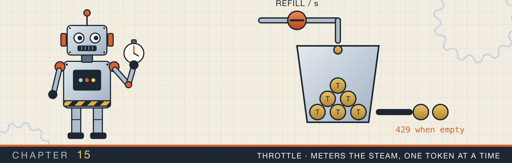
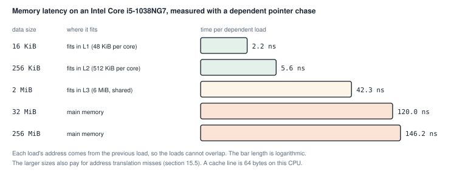
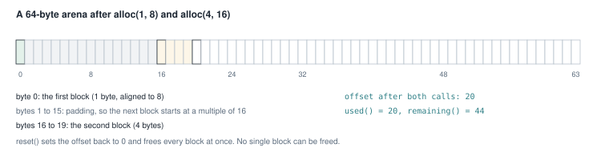
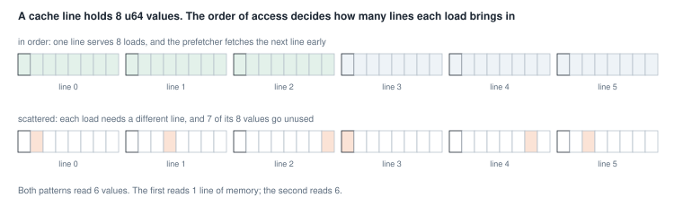
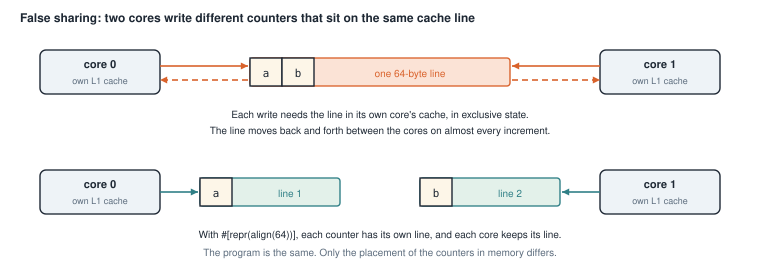
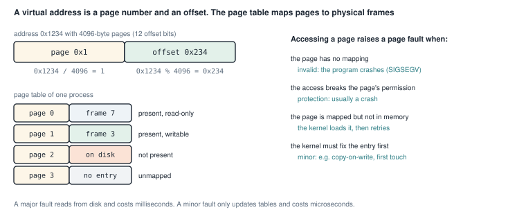
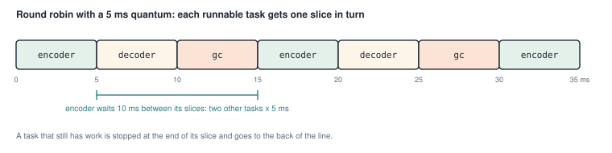
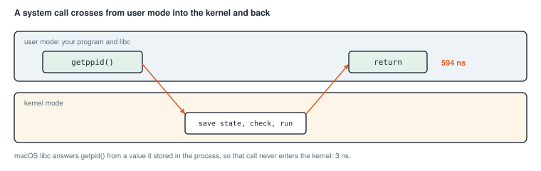

# Memory, CPU caches, and the operating system

<div class="covers" markdown="1">

This chapter covers

- How long it takes the CPU to read memory, measured at five data sizes
- A bump allocator, and what alignment means
- Why the order in which you read an array changes the time, and a benchmark that measured something else
- False sharing: two threads that slow each other down without sharing any data
- Pages, page tables, and the kinds of page fault
- Round-robin scheduling, and what a system call costs

</div>

The earlier chapters counted steps: O(1), O(log n), O(n). Step counts predict how a program grows, but not how
long one step takes. On a real machine, one memory read can take 2 ns or 150 ns, depending on where the data is.
Chapter 13 already saw a factor of three between two caches with the same step count.

This chapter looks at the machine under the data structures. Section 15.1 measures the memory system. Sections
15.2 to 15.4 show three programs whose speed depends on how they lay out and touch memory. Sections 15.5 to 15.7
look at three services of the operating system: virtual memory, scheduling, and system calls.

Most programs in this chapter print times. Run them with `--release`, and expect your numbers to differ from mine.
All the numbers here come from one laptop with an Intel Core i5-1038NG7 CPU, running macOS.

## 15.1 How far away is memory?

Main memory, the RAM, is large and slow compared with the CPU. To hide the difference, the CPU keeps copies of
recently used memory in small, fast memories called **caches**. There are usually three levels:

- **L1** is the smallest and fastest, and each core has its own. On this CPU it holds 48 KiB of data per core.
- **L2** is larger and slower, also per core: 512 KiB here.
- **L3** is shared by all cores: 6 MiB here.

Caches do not copy single bytes. They copy blocks of 64 bytes, called **cache lines**. Reading one `u64` brings
in the line around it, so the next seven `u64` values in memory arrive at no extra cost.

To see the cost of each level, I measured a **pointer chase**. The program fills an array with the indexes of a
random cycle, so each element holds the index of the next one to read. The loop then runs
`i = next[i]` many times. Each read needs the result of the previous one, so the reads cannot overlap. The time per step is the time
of one read. Figure 15.1 shows the result for five array sizes.

<figure>

<figcaption><b>Figure 15.1</b> Time per dependent read, by data size. Data that fits in L1 is about 65 times faster to reach than data in main memory.</figcaption>
</figure>

A read from L1 took 2.2 ns. A read that had to go to main memory took 120 to 146 ns. In 120 ns, this CPU can run
several hundred simple instructions. The larger sizes also include the cost of translating addresses, which
section 15.5 explains.

Those five numbers describe one hierarchy, not five separate machines. Data in L1 answers a dependent read in
2.2 ns. The same read against 256 KiB costs 5.6 ns. That array no longer fits in a 48 KiB L1, so the line comes
from L2. At 2 MiB the cost is 42.3 ns, having left L2 as well. From 32 MiB upward it is 120 ns or more, which
is main memory. A larger level holds several times more than the one above it, and answers several times more
slowly. The trade is forced. A store that answers in 2 ns has to be small, because reaching a location costs
more as the store grows.

A cache line is 64 bytes, and it arrives as one unit. A program that reads one `u64` and then the next seven
pays for a single line and uses all of it. A program that jumps to a new random line on every read pays the
same 120 ns. It uses one eighth of what it fetched.

The rest of the chapter comes back to one fact. Data that is close together in memory, and read in order,
is much cheaper than data scattered around. Keeping related data close together is called **locality**.

## 15.2 A bump allocator

Programs get heap memory from an **allocator**. Every `Box::new` and every growing `Vec` asks the allocator for
a block, and every drop gives one back. A general-purpose allocator must handle blocks of any size, freed in any
order, from any thread. That takes bookkeeping.

A **bump allocator** is the simplest allocator. It owns one large buffer and an offset, the position of the
first free byte. To allocate, it hands out the bytes at the offset and moves the offset forward. It never frees a
single block. Instead, `reset` frees everything at once by setting the offset back to 0.

This fits work that allocates many small pieces and throws them all away together. A parser can allocate its
syntax tree in an arena and drop it after compiling. A server can allocate per request and reset after sending
the response.

### 15.2.1 Alignment

Most types must start at an address that is a multiple of some number, called their **alignment**. A `u64` has
alignment 8, so it must start at an address divisible by 8. The CPU reads aligned values in one step, and some
instructions refuse unaligned ones.

So an allocator must sometimes skip bytes before a block, to reach an address with the right alignment. The
skipped bytes are called **padding**. Figure 15.2 shows two allocations and the padding between them.

<figure>

<figcaption><b>Figure 15.2</b> The state checked by the test <code>allocations_are_aligned</code>. Aligning the second block to 16 costs 15 bytes of padding.</figcaption>
</figure>

### 15.2.2 The code

<p class="listing"><b>Listing 15.1</b> <code>alloc</code> (lines 27 to 42) and <code>align_up</code> (lines 65 to 70). <a href="https://github.com/arpanpathak/cracking-the-systems-programming-interview/blob/prep-v2/rust-interview-lab/src/problems/bump_allocator.rs">src/problems/bump_allocator.rs</a></p>

```rust
impl BumpArena {
    // ...
{{#include ../../rust-interview-lab/src/problems/bump_allocator.rs:27:42}}
    // ...
}

{{#include ../../rust-interview-lab/src/problems/bump_allocator.rs:65:70}}
```

`align_up` rounds the offset up to the next multiple of `align`. The alignment must be a power of two, which the
`assert!` in `alloc` checks. A power of two has exactly one bit set, so `align - 1` is a mask with all the bits
below it set. For `align = 16`, the mask is `0b1111`.

The rounding happens in two steps. Adding the mask pushes the offset past the next multiple, unless it is already
on one. Then `& !mask` clears the low bits, which rounds down to a multiple. Work through the second allocation of
figure 15.2 by hand:

1. The offset is 1, and the alignment is 16, so the mask is 15.
2. 1 + 15 = 16.
3. 16 with the low four bits cleared is 16. The block starts at 16.

An offset of 16 would give 16 + 15 = 31, which rounds down to 16 again. An offset already aligned stays where it
is.

`alloc` uses `checked_add` twice, and the `?` operator returns `None` if either addition overflows. It also
returns `None` if the block would end past the buffer. Only after every check passes does it move the offset.
So a failed allocation leaves the arena unchanged, which the test `exhaustion_returns_none_and_keeps_state`
checks.

The block is returned as `&mut [u8]`, a slice of the buffer. That reference borrows the arena mutably, so you
cannot call `alloc` again while you hold it. A production arena allocator hands out many live references at
once, and needs `unsafe` code or interior mutability to do so.

<div class="callout warning" markdown="1">

**WARNING:** `align_up` aligns the offset, not the memory address. The address of a block is the buffer's address plus the offset. So the block is aligned only if the buffer
itself starts at a multiple of `align`. The buffer is a
`Vec<u8>`, which only promises alignment 1. The tests pass because the macOS allocator returns 16-byte aligned
blocks. A request for alignment 64 could return a misaligned address.

</div>

<p class="listing"><b>Listing 15.2</b> The complete file, with tests. <a href="https://github.com/arpanpathak/cracking-the-systems-programming-interview/blob/prep-v2/rust-interview-lab/src/problems/bump_allocator.rs">src/problems/bump_allocator.rs</a></p>

```rust
{{#include ../../rust-interview-lab/src/problems/bump_allocator.rs}}
```

```text
$ cargo test --lib problems::bump_allocator
running 5 tests
test problems::bump_allocator::tests::allocations_are_aligned ... ok
test problems::bump_allocator::tests::exhaustion_returns_none_and_keeps_state ... ok
test problems::bump_allocator::tests::reset_reclaims_everything ... ok
test problems::bump_allocator::tests::zero_sized_allocation_is_allowed ... ok
test problems::bump_allocator::tests::writes_are_isolated_between_allocations ... ok

test result: ok. 5 passed; 0 failed; 0 ignored; 0 measured; 132 filtered out
```

## 15.3 Reading in order, and reading scattered

Figure 15.3 shows how the order of reads changes the work. Reading a `u64` array in order uses every value of each cache
line it loads. The CPU also notices the pattern and fetches the next lines before they are needed, which is called
**prefetching**. Reading scattered values loads a whole line for each value and uses one eighth of it.

<figure>

<figcaption><b>Figure 15.3</b> Six reads in order touch one line. Six scattered reads touch six lines.</figcaption>
</figure>

### 15.3.1 The program

<p class="listing"><b>Listing 15.3</b> The two loops (lines 9 to 30). <a href="https://github.com/arpanpathak/cracking-the-systems-programming-interview/blob/prep-v2/rust-interview-lab/src/bin/cs_locality.rs">src/bin/cs_locality.rs</a></p>

```rust
{{#include ../../rust-interview-lab/src/bin/cs_locality.rs:7:7}}

{{#include ../../rust-interview-lab/src/bin/cs_locality.rs:9:30}}
```

Both functions add up every element of the same 32 MiB array, which is too large for any cache.
`sequential_sum` reads it in order with `data.iter().sum()`. `strided_sum` jumps 1,000,003 elements forward at
each step, wrapping around with `%`.

The jump must eventually visit every element exactly once. The array has 4,194,304 elements, which is 2 to the
power 22. The stride is odd, so it shares no factor with a power of two. A walk whose step shares no factor with
the length visits every position once before it returns to the start.

<p class="listing"><b>Listing 15.4</b> The complete program. <a href="https://github.com/arpanpathak/cracking-the-systems-programming-interview/blob/prep-v2/rust-interview-lab/src/bin/cs_locality.rs">src/bin/cs_locality.rs</a></p>

```rust
{{#include ../../rust-interview-lab/src/bin/cs_locality.rs}}
```

`main` checks that both sums are equal, and that they match the formula for 0 + 1 + ... + (n − 1). The two loops
did the same additions. Only the order of reading differs.

```text
$ cargo run --release --bin cs_locality
4194304 elements, 32 MiB

  sequential: 8796090925056 in 3.127311ms
  strided:    8796090925056 in 37.375274ms

equal work, different pattern; timings vary by machine
```

### 15.3.2 What the strided loop measured

The strided loop took twelve times as long. It is tempting to credit all of that to the cache, but the two loops
differ in more than their reading order.

`strided_sum` computes `(index + STRIDE) % data.len()` at every step. `data.len()` is not known at compile time,
so `%` is compiled as a real division instruction, one of the slowest integer instructions. Each step's index
depends on the previous one, so the divisions run one after another.

To separate the two costs, I ran four variants of the loop:

<p class="listing"><b>Table 15.1</b> Variants of the 32 MiB sum, release build</p>

| Loop | Time |
|---|---|
| `data.iter().sum()`, in order | 3.1 ms |
| `strided_sum` as written, stride 1,000,003 | 37.4 ms |
| `strided_sum` with stride 1, reading in order | 36 ms |
| sum through a list of indexes, in order | 4.4 ms |
| sum through a list of indexes, in random order | 31 ms |
| pointer chase in random order, each read waits for the last | 478 ms |

The third row settles it. With stride 1, the loop reads memory in perfect order, and it still takes 36 ms. The
division sets the pace of `strided_sum`, not the memory.

The last three rows remove the division and show the real cost of scattered reads. Reading through a list of
indexes in random order took about seven times as long as reading through the same list in order. The reads are
independent of each other, so the CPU keeps several of them in flight at once. In the pointer chase of section 15.1, each read must wait for the previous one. There, the same 4 million
reads take 478 ms, about 114 ns each.

Two lessons come out of this. Scattered memory access is expensive, from a few times slower to a hundred times,
depending on whether reads can overlap. And a benchmark measures everything in its loop. Before you explain a
number, change one thing at a time and check that the number moves.

## 15.4 False sharing

Chapter 16 covers threads in depth. This section needs only two facts about them:

- `thread::scope(|scope| { ... })` creates a scope. Threads started inside it with `scope.spawn` may borrow local
  variables, because the scope waits for all of them to finish before it returns.
- An atomic integer such as `AtomicUsize` can be changed by several threads at once without a lock.
  `fetch_add(1, Ordering::Relaxed)` adds 1 in one indivisible step. The `Ordering` argument is explained in
  chapter 16. `Relaxed` is enough for a counter that nothing else depends on.

Now the problem. Each core has its own L1 cache. Before a core writes to a cache line, it must have the only
copy of that line. Every other core's copy is thrown away. If two cores write to the same line in turn, the line
moves back and forth between them on almost every write.

That is expected when two threads write the same variable. **False sharing** is the same slowdown when the two
threads write different variables that happen to sit in the same cache line (figure 15.4). The threads share no
data, but the hardware moves memory in whole lines, so they share a line.

<figure>

<figcaption><b>Figure 15.4</b> Two counters in one line, and two counters in separate lines.</figcaption>
</figure>

The fix is to place each counter in its own cache line. `#[repr(align(64))]` on a struct makes its alignment 64,
so every value of the type starts on a new line. The size rounds up to a multiple of the alignment, so the value
fills the line.

### 15.4.1 Four counters

<p class="listing"><b>Listing 15.5</b> Two counter types (lines 16 to 41). <a href="https://github.com/arpanpathak/cracking-the-systems-programming-interview/blob/prep-v2/rust-interview-lab/src/bin/concurrency_false_sharing.rs">src/bin/concurrency_false_sharing.rs</a></p>

```rust
{{#include ../../rust-interview-lab/src/bin/concurrency_false_sharing.rs:6:11}}

{{#include ../../rust-interview-lab/src/bin/concurrency_false_sharing.rs:16:41}}
```

`Unpadded` is 8 bytes, so a `Vec` of four of them fits in 32 bytes, inside one or two cache lines. `Padded` is 64
bytes, and each one gets a line.

<p class="listing"><b>Listing 15.6</b> The timed run (lines 43 to 57).</p>

```rust
{{#include ../../rust-interview-lab/src/bin/concurrency_false_sharing.rs:43:57}}
```

The loop `for counter in &counters` gives each thread a reference to its own counter. `move ||` moves that
reference into the thread's closure. Each thread increments only its own counter, two million times.

<p class="listing"><b>Listing 15.7</b> The complete program. <a href="https://github.com/arpanpathak/cracking-the-systems-programming-interview/blob/prep-v2/rust-interview-lab/src/bin/concurrency_false_sharing.rs">src/bin/concurrency_false_sharing.rs</a></p>

```rust
{{#include ../../rust-interview-lab/src/bin/concurrency_false_sharing.rs}}
```

```text
$ cargo run --release --bin concurrency_false_sharing
atomic:   8 bytes
unpadded: 8 bytes (several counters per 64 byte line)
padded:   64 bytes (one counter per 64 byte line)

4 threads x 2000000 increments, each on its own counter
  unpadded (shared lines): 205.466825ms
  padded   (own line):     20.667095ms

timings vary by machine; the padded run is normally the faster one
```

Adding 56 bytes of padding to each counter made the same work ten times faster.

### 15.4.2 Two counters

The second program makes the sharing certain instead of likely. `SameLine` holds both counters and is aligned to
64, so both are guaranteed to be in one line.

<p class="listing"><b>Listing 15.8</b> The complete program. <a href="https://github.com/arpanpathak/cracking-the-systems-programming-interview/blob/prep-v2/rust-interview-lab/src/bin/false_sharing.rs">src/bin/false_sharing.rs</a></p>

```rust
{{#include ../../rust-interview-lab/src/bin/false_sharing.rs}}
```

`time` is a small generic helper. It takes any closure that can be called once, `F: FnOnce()`, runs it, and
returns how long it took.

The spawned closures have no `move`. They borrow `same`, `p0`, and `p1` directly, which `thread::scope` allows.

```text
$ cargo run --release --bin false_sharing
same cache line (false sharing): 838.152232ms
padded (separate lines):         170.243616ms
```

Here the difference is about five times.

<div class="callout note" markdown="1">

**NOTE:** A cache line is 64 bytes on this Intel CPU. Apple's M-series CPUs use 128-byte lines. Some Intel CPUs
also fetch lines in adjacent pairs, so some libraries pad shared counters to 128 bytes to be safe on both.

</div>

## 15.5 Pages and page faults

Every address your program uses is a **virtual address**. The operating system gives each process its own
private range of addresses. The CPU translates each virtual address into a **physical address**, a location in
the actual RAM.

Translation works on fixed-size blocks called **pages**. On this machine a page is 4,096 bytes. Apple's ARM Macs
use 16 KiB pages. The operating system keeps a **page table** for each process, which maps each virtual page to a
physical block of RAM, called a **frame**.

An address splits into two parts (figure 15.5). The high part is the page number, which the page table
translates. The low part is the offset inside the page, which stays the same. With 4,096-byte pages, the offset
is the low 12 bits, because 2 to the power 12 is 4,096.

<figure>

<figcaption><b>Figure 15.5</b> Splitting an address, and the four cases in which accessing a page causes a fault.</figcaption>
</figure>

Looking up the page table on every access would be slow. The CPU keeps recent translations in a small cache called
the **TLB** (translation lookaside buffer). Scattered reads over a large array need many different pages, miss
the TLB, and pay for a table lookup. That cost is part of the larger numbers in figure 15.1.

When the translation cannot complete, the CPU stops the program and hands control to the kernel. This is a
**page fault**. The kernel decides what kind it is:

- **Invalid**: the address is not mapped at all. The program is stopped, usually with a segmentation fault.
- **Protection**: the page is mapped, but the access is not allowed, such as a write to a read-only page.
- **Major**: the page is valid, but its contents are on disk. The kernel reads it in and restarts the access.
  This takes milliseconds.
- **Minor**: the kernel can fix the mapping without reading the disk. Examples are the first write to a freshly
  allocated page, or a write to a page shared after `fork` (copy-on-write). This takes microseconds.

<p class="listing"><b>Listing 15.9</b> The address arithmetic and the fault model (lines 6 to 35). <a href="https://github.com/arpanpathak/cracking-the-systems-programming-interview/blob/prep-v2/rust-interview-lab/src/bin/os_paging.rs">src/bin/os_paging.rs</a></p>

```rust
{{#include ../../rust-interview-lab/src/bin/os_paging.rs:6:35}}
```

`split_page` divides by the page size for the page number, and takes the remainder for the offset.
`pages_needed` rounds up with `div_ceil`, because 4,097 bytes need two pages, not one.

`classify_fault` matches on three facts at once, written as a tuple. They are: is the address mapped, is
the page present in memory, and does the mapping allow the access. The arms are tried in order, so the first arm that fits wins.
`(false, _, _)` catches every unmapped address, whatever the other two values are.

The model is a simplification. It treats every page that is not in memory as a major fault. A real kernel also counts some of those as minor, because no disk read is needed. Examples are a first
touch of new memory, and a file page already in the kernel's file cache.

<p class="listing"><b>Listing 15.10</b> The complete program. <a href="https://github.com/arpanpathak/cracking-the-systems-programming-interview/blob/prep-v2/rust-interview-lab/src/bin/os_paging.rs">src/bin/os_paging.rs</a></p>

```rust
{{#include ../../rust-interview-lab/src/bin/os_paging.rs}}
```

```text
$ cargo run --bin os_paging
page size: 4096 bytes

address -> page, offset
  0x0000 -> page  0, offset 0x000
  0x1234 -> page  1, offset 0x234
  0x1fff -> page  1, offset 0xfff
  0x2000 -> page  2, offset 0x000

pages needed
      0 bytes -> 0
      1 bytes -> 1
   4096 bytes -> 1
   4097 bytes -> 2

fault classification
  unmapped           -> Invalid
  mapped, not in ram -> Major
  resident, read-only-> Protection
  resident, writable -> Minor

all checks passed
```

`0x1fff` is the last byte of page 1, and `0x2000` is the first byte of page 2.

## 15.6 Taking turns on the CPU

A machine runs more threads than it has cores. The operating system's **scheduler** decides which thread runs on
each core, and switches between them many times per second. A **context switch** saves one thread's registers and
loads another's.

**Round robin** is the simplest fair policy. The runnable tasks wait in a line. The first runs for a fixed time,
called the **quantum** or time slice, and then goes to the back of the line (figure 15.6). No task can hold a core
forever, so none starves.

<figure>

<figcaption><b>Figure 15.6</b> Three tasks sharing one core in 5 ms slices.</figcaption>
</figure>

<p class="listing"><b>Listing 15.11</b> The complete program. <a href="https://github.com/arpanpathak/cracking-the-systems-programming-interview/blob/prep-v2/rust-interview-lab/src/bin/os_scheduler.rs">src/bin/os_scheduler.rs</a></p>

```rust
{{#include ../../rust-interview-lab/src/bin/os_scheduler.rs}}
```

`schedule` returns the task for each slice: slice `tick` goes to task `tick % tasks.len()`. The early return
avoids a division by zero when there are no tasks.

The signature `fn schedule<'a>(tasks: &[&'a str], ticks: usize) -> Vec<&'a str>` has one named lifetime. It
says that the returned names borrow from the same strings as the names in `tasks`, not from the slice that holds
them. The caller can drop the slice and keep the result.

```text
$ cargo run --bin os_scheduler
3 runnable tasks, 5 ms quantum
  slice 0:  0- 5 ms  encoder
  slice 1:  5-10 ms  decoder
  slice 2: 10-15 ms  gc
  slice 3: 15-20 ms  encoder
  slice 4: 20-25 ms  decoder
  slice 5: 25-30 ms  gc
  slice 6: 30-35 ms  encoder

worst-case wait for one slice: 15 ms
all checks passed
```

Between two of its own slices, a task waits 10 ms, while the other two tasks run. From an arbitrary moment, it
waits at most one full round of 15 ms, which is the number the program prints. A shorter quantum makes tasks wait
less, but switches more often, and each switch costs time.

## 15.7 The cost of a system call

A program cannot touch hardware or other processes directly. It asks the kernel, with a **system call**: opening
a file, reading a socket, starting a thread. The CPU switches from user mode into kernel mode, the kernel does the
work, and the CPU switches back (figure 15.7). The switch itself costs time, even when the work is tiny.

<figure>

<figcaption><b>Figure 15.7</b> A system call's round trip on this machine.</figcaption>
</figure>

### 15.7.1 Calling C from Rust

The program calls `getpid`, which returns the process ID. `getpid` is a C function from the system's C library.
The `libc` crate declares it for Rust.

Calling a function written in another language is called a **foreign function interface** (FFI) call. Rust
cannot check what C code does, so every call to it must be inside an `unsafe` block. Each block here carries a
`SAFETY` comment explaining why the call is sound. `getpid` takes no pointers and changes no memory.

<p class="listing"><b>Listing 15.12</b> The timed loop (lines 27 to 47). <a href="https://github.com/arpanpathak/cracking-the-systems-programming-interview/blob/prep-v2/rust-interview-lab/src/bin/syscall_overhead.rs">src/bin/syscall_overhead.rs</a></p>

```rust
{{#include ../../rust-interview-lab/src/bin/syscall_overhead.rs:25:25}}

{{#include ../../rust-interview-lab/src/bin/syscall_overhead.rs:27:47}}
```

The comment inside the loop mentions `black_box`, but the loop does not use it, and does not need it. The compiler
cannot see inside an external C function, so it must assume each call has an effect, and it cannot remove the
loop.

<p class="listing"><b>Listing 15.13</b> The complete program. <a href="https://github.com/arpanpathak/cracking-the-systems-programming-interview/blob/prep-v2/rust-interview-lab/src/bin/syscall_overhead.rs">src/bin/syscall_overhead.rs</a></p>

```rust
{{#include ../../rust-interview-lab/src/bin/syscall_overhead.rs}}
```

`main` warms up with 100,000 untimed calls, then times ten million. Warming up lets the first-call costs, such as
loading the function's code into the cache, happen outside the measurement.

```text
$ cargo run --release --bin syscall_overhead
Iterations:      10000000
Total time:      0.031s
Per syscall:     3.1 ns
At 10M calls/s, syscall overhead would consume: 0.03 CPU-seconds per second
```

### 15.7.2 What the 3.1 ns measured

3.1 ns is far too fast for a trip into the kernel. It is about the time of two L1 reads. The program measured
something other than its title says.

The C library on macOS stores the process ID the first time it is asked, and answers later `getpid` calls from
that stored value. None of the ten million calls entered the kernel.

To measure a real round trip, the call must be one the library cannot answer by itself. On the same machine, I
timed `getppid`, which returns the parent's process ID, and a raw `syscall(SYS_getpid)`. Both took about 594 ns
per call, nearly 200 times the cached `getpid`.

On Linux, the answer is different again. The GNU C library stopped caching `getpid` in version 2.25, so there the
same program does measure a real system call.

The lesson matches section 15.3. Before you trust a number, check that the code did the work you meant to time.
The comment block at the top of the file names the practical point. A program that handles millions of events
per second cannot afford one system call per event. Interfaces such as Linux's `recvmmsg` and `io_uring` exist to
handle many events per system call.

<div class="summary" markdown="1">

## Summary

- Reading memory on this laptop took 2.2 ns from L1 and up to 146 ns from main memory. Caches move 64-byte lines.
- A bump allocator hands out bytes from an offset and frees everything at once. `(offset + align - 1) & !(align - 1)` rounds an offset up to a power-of-two alignment.
- Reading in order uses whole cache lines and lets the CPU prefetch. Scattered reads were about seven times
  slower when independent, and about 114 ns each when each depended on the last.
- The `cs_locality` benchmark mostly measured a division instruction. Change one thing at a time before
  explaining a number.
- False sharing slows threads that write different variables in one cache line. `#[repr(align(64))]` gave each
  counter its own line and made the loop up to ten times faster.
- A virtual address is a page number and an offset. The page table maps pages to frames, the TLB caches the
  mappings, and a page fault hands control to the kernel.
- Round robin gives each task one quantum in turn. A shorter quantum lowers waiting but adds switches.
- A system call costs hundreds of nanoseconds here. macOS answers `getpid` without one, so the benchmark measured
  a cached value.

</div>

Chapter 16 starts the concurrency part of the book: threads, atomics, and locks, and the rules that keep them
correct.

## Exercises

1. Change `strided_sum` to use `& (data.len() - 1)` instead of `% data.len()`, and compare its time with
   stride 1 and stride 1,000,003.
2. Write the pointer chase of section 15.1, and measure it on your machine for sizes from 4 KiB to 512 MiB. Find
   where the time jumps, and compare with your CPU's cache sizes.
3. Fix the warning in section 15.2. Make `BumpArena` allocate its buffer with `std::alloc::alloc` and a
`Layout` aligned to 64. Add a test that requests alignment 64.
4. Change `concurrency_false_sharing.rs` to use `#[repr(align(128))]`, and check whether the time changes on your
   machine.
5. Time `getppid` in a loop on your system, and compare it with `getpid`.
