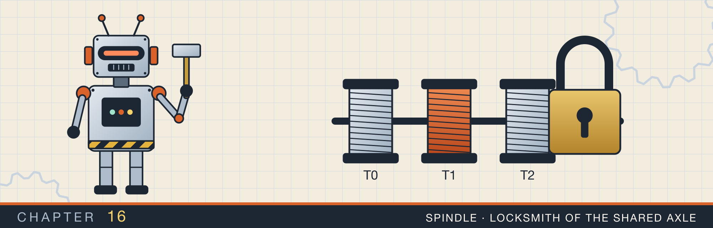

# Threads, atomics, and locks

<div class="covers" markdown="1">

This chapter covers

- Starting threads with `thread::spawn` and `thread::scope`, and collecting their results
- The `Send` and `Sync` traits, which let the compiler reject data races
- Atomic integers, and why `count += 1` from two threads can lose an update
- Splitting a sum across threads, measuring it, and Amdahl's law
- A spin lock built from one atomic flag, with acquire and release ordering
- A counting semaphore built from a `Mutex` and a `Condvar`
- What happens to a `Mutex` when its holder panics, and how to detect a deadlock

</div>

Chapter 15 showed that a laptop CPU has several cores. A program that runs on one thread uses one of them. To use
the others, the program must split its work across several **threads**: independent sequences of instructions
that the operating system schedules onto cores.

Threads share the process's memory, so they can all read the same data. That sharing also makes them
dangerous. When two threads change the same memory at the same time, the result can be wrong in ways that
are hard to reproduce.

Rust's promise here is narrow and specific. Safe Rust code cannot contain a **data race**. In a data race, two threads access the same memory at the same time, and at least one of them writes.
Nothing orders the two accesses. The
compiler checks this with two traits, `Send` and `Sync`. The chapter starts there.

## 16.1 Starting threads

### 16.1.1 What a thread is

A process owns memory: the program's code, its static data, and its heap. A **thread** is one path of execution
through that code. Each thread has its own stack, which holds the local variables of the functions it is running.
Each also has its own copy of the CPU registers, including the instruction pointer that says which instruction
runs next. Everything else is shared. Every thread reads the same code and can reach the same heap (figure 16.1).

<figure>
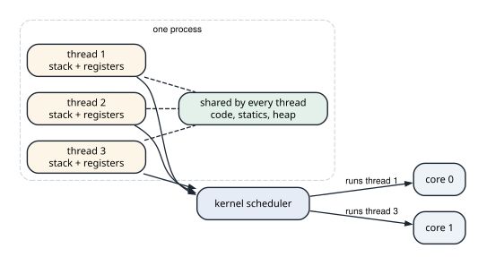
<figcaption><b>Figure 16.1</b> Threads in one process. Stacks and registers are per thread; code, statics, and the heap are shared. The scheduler decides which threads run on the cores.</figcaption>
</figure>

The kernel's **scheduler** decides which threads run. A core runs one thread at a time. When there are more
runnable threads than cores, the scheduler gives each a short slice of time. Between slices it saves one
thread's registers and loads another's. That swap is a **context switch**, and it costs a few microseconds.

A thread that waits for I/O or for a lock is not runnable. It uses no CPU time while it waits, only the memory
of its stack.

Because the heap is shared, two threads can reach the same value at the same moment. Section 16.2 shows what
goes wrong then, and the rest of the chapter builds the tools that prevent it.

### 16.1.2 `spawn` and `join`

`std::thread::spawn` starts a new thread that runs a closure. It returns a `JoinHandle`. Calling `join()` on the
handle waits for the thread to finish and returns the closure's result:

```rust
let handle = thread::spawn(|| 6 * 7);
assert_eq!(handle.join().expect("worker panicked"), 42);
```

`join` returns a `Result`, because the thread might have panicked. `Ok` carries the closure's return value.

A spawned thread may outlive the function that started it. So the closure cannot borrow local variables, which
might be gone by the time the thread uses them. The compiler requires the closure to own everything it uses, or
to borrow only data that lives for the whole program. That requirement is written `'static`. To share data with
a spawned thread, you move an `Arc` into the closure, as section 8.6 did.

### 16.1.3 Scoped threads

`thread::scope` removes that restriction for work that finishes before the function continues. It takes a
closure that receives a `scope` value. Threads started with `scope.spawn` may borrow local data. The scope waits
for every one of them before `thread::scope` returns, so the borrowed data is still alive while they run.

The file `threads.rs` uses a scope to sum a slice on several threads (figure 16.2).

<figure>
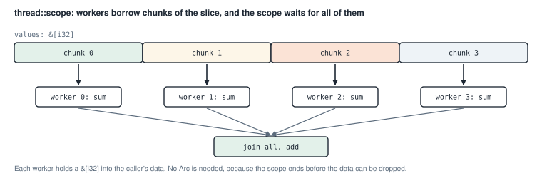
<figcaption><b>Figure 16.2</b> Each worker sums one chunk, borrowing it from the caller's slice.</figcaption>
</figure>

<p class="listing"><b>Listing 16.1</b> <code>available_workers</code> and <code>parallel_sum</code> (lines 31 to 69). <a href="https://github.com/arpanpathak/cracking-the-systems-programming-interview/blob/prep-v2/rust-interview-lab/src/problems/threads.rs">src/problems/threads.rs</a></p>

```rust
{{#include ../../rust-interview-lab/src/problems/threads.rs:23:29}}

{{#include ../../rust-interview-lab/src/problems/threads.rs:31:69}}
```

`thread::available_parallelism()` asks the operating system how many threads can run at the same time. On this
laptop it returns 8: four cores, each running two hardware threads. It returns a `Result`, so the code falls back
to 1 if the question cannot be answered.

The function never starts more workers than there are values. `values.len().div_ceil(workers)` computes a chunk
size that rounds up, so the chunks cover every value. `values.chunks(chunk_size)` then yields sub-slices of that
size, with a shorter last one.

Each worker converts its values to `i64` with `i64::from(*value)` before adding. The sum of many `i32` values can
exceed the `i32` range, and an `i64` has room for it.

The order of two steps decides whether the threads run in parallel. The workers are all started, and their handles collected into a `Vec`,
before any is joined. Iterators are lazy. A single chain like `.map(spawn).map(join)` would start one thread, wait
for it, then start the next. The work would run one chunk at a time. Collecting first starts every thread before
waiting on any of them.

The closure passed to `scope.spawn` is a `move` closure. It moves `chunk`, a `&[i32]`, into the thread. Moving a
reference copies the reference, not the data.

### 16.1.4 `Send` and `Sync`

How does the compiler know which values may be used from another thread? Two marker traits describe it:

- A type is **`Send`** if a value of it can be moved to another thread.
- A type is **`Sync`** if a reference to it, `&T`, can be shared with other threads. Put another way, `T` is
  `Sync` exactly when `&T` is `Send`.

These traits have no methods. They are **auto traits**: the compiler implements them for a type automatically
when all of the type's fields have them. `i32`, `String`, `Vec<i32>`, and `Arc<Mutex<T>>` are both `Send` and
`Sync`.

`Rc` is neither. Its reference count is a plain integer, so two threads cloning the same `Rc` could lose a count,
as section 16.2 shows. `RefCell` is `Send` but not `Sync`: its borrow flag is not safe to change from two threads.
`thread::spawn` and `scope.spawn` require their closures to be `Send`. A closure that captures an `Rc` is
therefore rejected at compile time.

<p class="listing"><b>Listing 16.2</b> A compile-time check (lines 121 to 125).</p>

```rust
{{#include ../../rust-interview-lab/src/problems/threads.rs:121:125}}
```

`assert_send_sync` has an empty body. Calling `assert_send_sync::<AtomicCounter>()` compiles only if
`AtomicCounter` is `Send + Sync`. If a later change added an `Rc` field to it, the call would stop compiling. The
check costs nothing at run time.

## 16.2 Atomic integers

### 16.2.1 The lost update

`count += 1` looks like one step, but the CPU performs three: read the value, add one, and write the result back.
If two threads do this at the same time, their steps can interleave (figure 16.3).

<figure>
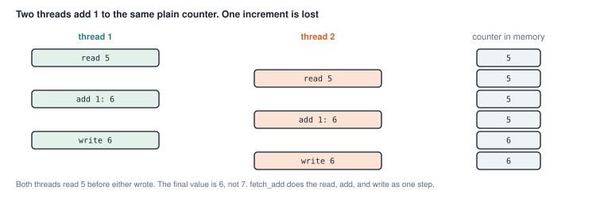
<figcaption><b>Figure 16.3</b> A lost update. Both threads read 5, so one of the two increments disappears.</figcaption>
</figure>

Safe Rust does not compile this: sharing a plain `usize` for writing between threads needs `&mut` in two places
at once. Other languages compile it, and the program loses counts only under load.

An **atomic** type performs the read, the change, and the write as one indivisible operation. No other thread can
see or change the value in between. `AtomicUsize::fetch_add(1, ordering)` adds 1 and returns the old value.

### 16.2.2 A counter without a lock

<p class="listing"><b>Listing 16.3</b> <code>AtomicCounter</code> and <code>scoped_increment</code> (lines 71 to 110).</p>

```rust
{{#include ../../rust-interview-lab/src/problems/threads.rs:71:110}}
```

`increment` takes `&self`, not `&mut self`. An atomic can be changed through a shared reference, the same way a
`RefCell` can, but safely across threads. So many threads can hold `&AtomicCounter` and increment it at once.

`fetch_add` returns the value before the addition, so `increment` adds 1 to report the new value.

`scoped_increment` starts `threads` threads that each increment the counter `per_thread` times. The closure has
no `move`, so it borrows `counter`, which the scope allows. The test runs 8 threads × 500 increments and checks
that the total is exactly 4,000. No increment is lost.

### 16.2.3 Memory ordering

Every atomic operation takes an `Ordering` argument. The ordering answers a question beyond the atomic value itself. When this thread changes the atomic, what
may other threads assume about the *other* memory this thread changed?

Compilers and CPUs reorder memory operations to run faster. Within one thread, the reordering is invisible.
Another thread watching the memory can see writes in a different order from the one in the source code. The
ordering argument limits that reordering around the atomic operation.

- `Relaxed` makes the operation itself atomic, and promises nothing about other memory. That is enough for a
  counter whose value no other data depends on, which is the case here.
- `Release`, used when writing, and `Acquire`, used when reading, work as a pair. Section 16.4 uses them to build
  a lock.
- `SeqCst` is the strongest. All `SeqCst` operations appear in one order that every thread agrees on. It is the
  simplest to reason about, and sometimes slower.

### 16.2.4 Initializing a value once

<p class="listing"><b>Listing 16.4</b> <code>OnceLock</code> (lines 112 to 119).</p>

```rust
{{#include ../../rust-interview-lab/src/problems/threads.rs:112:119}}
```

A `static` is a single value shared by the whole program. `OnceLock` holds a value that starts empty and is set at
most once. `get_or_init` runs the closure the first time, and returns the stored value after that. If several
threads call it at the same moment, one runs the closure and the others wait for its result.

<p class="listing"><b>Listing 16.5</b> The complete file, with tests. <a href="https://github.com/arpanpathak/cracking-the-systems-programming-interview/blob/prep-v2/rust-interview-lab/src/problems/threads.rs">src/problems/threads.rs</a></p>

```rust
{{#include ../../rust-interview-lab/src/problems/threads.rs}}
```

```text
$ cargo test --lib problems::threads
running 6 tests
test problems::threads::tests::counter_is_thread_safe_by_construction ... ok
test problems::threads::tests::once_lock_initializes_a_single_value ... ok
test problems::threads::tests::spawn_returns_a_join_handle_that_carries_the_result ... ok
test problems::threads::tests::scoped_threads_share_a_counter_without_arc ... ok
test problems::threads::tests::parallel_sum_handles_small_and_empty_inputs ... ok
test problems::threads::tests::parallel_sum_matches_the_sequential_sum ... ok

test result: ok. 6 passed; 0 failed; 0 ignored; 0 measured; 131 filtered out
```

## 16.3 How much faster do threads make it?

### 16.3.1 A billion elements

`parallel_sum.rs` times the same idea at a large scale. It sums a billion elements three times, as `i32`, `i64`,
and `i128`, once on one thread and once on several.

<p class="listing"><b>Listing 16.6</b> The parallel sum for <code>i32</code> (lines 15 to 38). <a href="https://github.com/arpanpathak/cracking-the-systems-programming-interview/blob/prep-v2/rust-interview-lab/src/bin/parallel_sum.rs">src/bin/parallel_sum.rs</a></p>

```rust
{{#include ../../rust-interview-lab/src/bin/parallel_sum.rs:1:5}}

{{#include ../../rust-interview-lab/src/bin/parallel_sum.rs:15:38}}
```

This version divides the work by index instead of with `chunks`. Worker `i` sums the range from `i * chunk` to the
next boundary. The last worker takes everything to the end, so the leftover elements from the integer division
are not lost. The handles are collected before joining, for the reason in section 16.1.3.

<p class="listing"><b>Listing 16.7</b> The complete program. <a href="https://github.com/arpanpathak/cracking-the-systems-programming-interview/blob/prep-v2/rust-interview-lab/src/bin/parallel_sum.rs">src/bin/parallel_sum.rs</a></p>

```rust
{{#include ../../rust-interview-lab/src/bin/parallel_sum.rs}}
```

The thread count comes from the first command-line argument, and defaults to 8. Each block creates its vector,
times both sums, and drops the vector at the closing brace before the next block starts.

<div class="callout warning" markdown="1">

**WARNING:** The three vectors take 4 GB, 8 GB, and 16 GB of memory. On a machine with 16 GB, the larger two do not fit next to everything else in memory. The operating system
then compresses pages or swaps them to disk. Lower
`SIZE` before you run this on a small machine.

</div>

Here is one run on the 16 GB laptop:

```text
$ cargo run --release --bin parallel_sum
i32   seq sum = 1000000000, elapsed = 522.646188ms
i32   par sum = 1000000000, elapsed = 142.427408ms  (n = 8)
i64   seq sum = 1000000000, elapsed = 7.750109265s
i64   par sum = 1000000000, elapsed = 2.591278253s  (n = 8)
i128  seq sum = 1000000000, elapsed = 16.173010504s
i128  par sum = 1000000000, elapsed = 10.198263426s  (n = 8)
```

Read these numbers with care. The `i32` rows are the only ones that measure the sum. Eight threads made it about
3.7 times faster, not 8 times. The `i64` and `i128` rows are dominated by the memory pressure from the warning. Reading 8 GB should take
well under a second, so 7.7 seconds means pages were being brought back from compression or disk.

The runs were not stable, either. In an earlier run, the sequential `i32` sum took 4.6 seconds instead of 0.52.
To check the `i32` result, I wrote a separate test that fills the vector once and times each sum several times.
The sequential sum took 0.25 to 0.29 seconds, and eight threads took 0.08 seconds, about 3.2 times faster.

Why not 8 times? Summing is almost no work per byte, so the loop is limited by how fast memory delivers bytes, not
by how fast cores add. One core cannot use all of the memory bandwidth, so several cores help, but only until
the memory bus is full. The laptop also has four cores, not eight. Its eight hardware threads share those cores
in pairs.

### 16.3.2 Amdahl's law

Most programs also contain work that cannot be split: reading input, starting threads, combining results.
**Amdahl's law** states how much that serial part limits the speedup.

Suppose a fraction `s` of the run time is serial, and `p` processors share the rest perfectly. The run time
becomes `s + (1 - s) / p` of the original, and the speedup is one divided by that:

```text
speedup(s, p) = 1 / (s + (1 - s) / p)
```

Work through one case by hand: `s = 0.5` and `p = 4`. The run time is 0.5 + 0.5 / 4 = 0.625 of the original,
so the speedup is 1 / 0.625 = 1.6.

<p class="listing"><b>Listing 16.8</b> The complete program. <a href="https://github.com/arpanpathak/cracking-the-systems-programming-interview/blob/prep-v2/rust-interview-lab/src/bin/concurrency_amdahl.rs">src/bin/concurrency_amdahl.rs</a></p>

```rust
{{#include ../../rust-interview-lab/src/bin/concurrency_amdahl.rs}}
```

```text
$ cargo run --bin concurrency_amdahl
  serial |      1      2      4      8     16   <- processors
---------+-----------------------------------
    0.00 |   1.00   2.00   4.00   8.00  16.00
    0.05 |   1.00   1.90   3.48   5.93   9.14
    0.10 |   1.00   1.82   3.08   4.71   6.40
    0.25 |   1.00   1.60   2.29   2.91   3.37
    0.50 |   1.00   1.33   1.60   1.78   1.88

limit as processors grow: 1 / serial
  0.00 ->    inf
  0.05 ->   20.0
  0.10 ->   10.0
  0.25 ->    4.0
  0.50 ->    2.0

all checks passed
```

<figure>
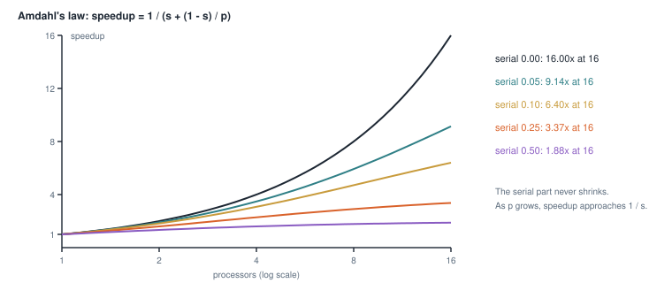
<figcaption><b>Figure 16.4</b> The table as curves. With 5% serial work, 16 processors give a speedup of 9.14.</figcaption>
</figure>

As `p` grows, `(1 - s) / p` shrinks toward zero, and the speedup approaches `1 / s`. A program that is 5% serial
can never run more than 20 times faster, however many cores it gets.

## 16.4 A spin lock

A `Mutex` from the standard library lets one thread at a time use a value. This section builds a simpler lock
from one atomic `bool`, to show what a lock must do.

A **spin lock** waits by looping. A thread that wants the lock checks it over and over until it is free. This
works well when the lock is held for a very short time. When it is held longer, the waiting threads waste whole
cores doing nothing useful. `std::sync::Mutex` instead asks the operating system to put a waiting thread to sleep.

### 16.4.1 The type

<p class="listing"><b>Listing 16.9</b> The lock, the guard, and <code>new</code> (lines 24 to 48). <a href="https://github.com/arpanpathak/cracking-the-systems-programming-interview/blob/prep-v2/rust-interview-lab/src/problems/spin_lock.rs">src/problems/spin_lock.rs</a></p>

```rust
{{#include ../../rust-interview-lab/src/problems/spin_lock.rs:19:24}}

{{#include ../../rust-interview-lab/src/problems/spin_lock.rs:26:41}}

impl<T> SpinLock<T> {
{{#include ../../rust-interview-lab/src/problems/spin_lock.rs:44:50}}
    // ...
}
```

`SpinLock<T>` holds a flag, `locked`, and the protected value inside an `UnsafeCell<T>`. `UnsafeCell` is the one
type through which Rust allows changing data behind a shared reference. `RefCell`, `Mutex`, and the atomic types
are all built on it. Its `get()` method returns a raw pointer, `*mut T`. Using that pointer requires `unsafe`,
and the code must make sure no two threads use it at once.

`UnsafeCell` is not `Sync`, so `SpinLock` would not be `Sync` either. The line `unsafe impl<T: Send> Sync for
SpinLock<T> {}` declares that it is. The compiler cannot check this claim, which is why the implementation needs
`unsafe`. The `SAFETY` comment above it gives the reason the claim holds: the value is used only while the lock is
held.

The bound is `T: Send`, not `T: Sync`. Only one thread uses the value at a time, but different threads use it one
after another, so the value effectively moves between threads.

`SpinGuard` is returned by `lock`. It holds a reference to the lock, gives access to the value, and releases the
lock when it is dropped.

### 16.4.2 Taking and releasing the lock

<p class="listing"><b>Listing 16.10</b> <code>lock</code>, <code>try_lock</code>, and <code>unlock</code> (lines 52 to 87).</p>

```rust
impl<T> SpinLock<T> {
    // ...
{{#include ../../rust-interview-lab/src/problems/spin_lock.rs:52:87}}
}
```

Taking the lock must be one atomic step: check that it is free and mark it taken, with no other thread slipping
in between. `compare_exchange(false, true, ...)` does that. If the flag is `false`, it sets it to `true` and
returns `Ok`. If it is already `true`, it changes nothing and returns `Err`.

`lock` uses `compare_exchange_weak`, which may fail even when the flag is `false`. The weak form is cheaper on
some CPUs, and inside a loop a false failure costs one more pass.

When the exchange fails, the thread waits in an inner loop that only reads the flag with a `Relaxed` load. A read
lets the cache line stay shared between the waiting cores. A compare-exchange must take the line for writing, as
section 15.4 described, so repeating it would bounce the line between cores. When the read sees `false`, the outer
loop tries the exchange again. `spin_loop()` tells the CPU that this is a wait loop. The CPU can then save power and let the other
hardware thread on the core run.

`try_lock` makes one attempt and returns `None` if the lock is taken.

### 16.4.3 Acquire and release

The orderings in `lock` and `unlock` make the lock correct (figure 16.5).

<figure>
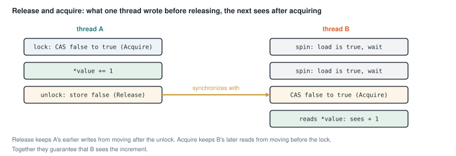
<figcaption><b>Figure 16.5</b> The release store in <code>unlock</code> pairs with the acquire exchange in the next <code>lock</code>.</figcaption>
</figure>

- `unlock` stores `false` with `Release`. Every write the thread made before the store happens before the store, as far as other threads can tell.
That includes its changes to the value.
- `lock` exchanges with `Acquire`. Every read the thread makes after the exchange happens after it.

When B's acquire reads the `false` that A's release wrote, the two operations **synchronize**. Everything A wrote
before unlocking is then visible to B after locking. With `Relaxed` in both places, B could take the lock and
still read an old copy of the value.

<figure class="anim">
<video class="motion" src="figures/ch16-spin-lock.mp4" autoplay loop muted playsinline preload="metadata" aria-label="Thread A and thread B on either side of the atomic word locked. A's compare_exchange_weak changes false to true and A holds the lock. B's exchange fails, and B spins on a relaxed load. A's unlock stores false with Release; B's next exchange succeeds with Acquire. Last, A leaks its guard with mem::forget, unlock never runs, and B spins forever at 100% CPU." data-chapters="[[0.0, &quot;A locks&quot;], [5.0, &quot;B spins&quot;], [15.68, &quot;handoff&quot;], [29.6, &quot;never released&quot;]]">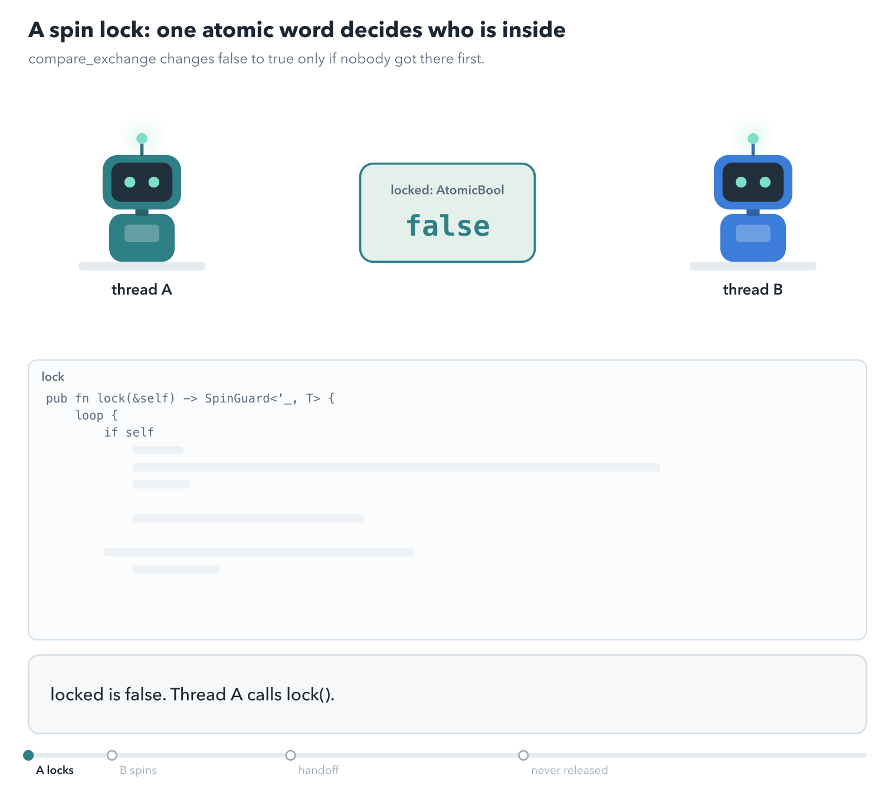</video>
<figcaption><b>Animation 16.1</b> <code>lock</code> from listing 16.10. B stays on the CPU while it spins. The Release store in <code>unlock</code> pairs with B's Acquire exchange.</figcaption>
</figure>


The second ordering argument to `compare_exchange`, `Relaxed`, applies when the exchange fails. A failed attempt
does not take the lock, so it needs no ordering.

### 16.4.4 The guard

<p class="listing"><b>Listing 16.11</b> The guard's traits (lines 96 to 116).</p>

```rust
{{#include ../../rust-interview-lab/src/problems/spin_lock.rs:96:116}}
```

The guard implements three traits:

- `Drop` releases the lock. The lock is released when the guard goes out of scope, even if the code between
  panics. This pattern, tying a resource's release to a value's drop, is called **RAII**.
- `Deref` lets `*guard` and method calls on the guard reach the value, as `&T`.
- `DerefMut` gives `&mut T`, so `*lock.lock() += 1` changes the value.

Each method turns the raw pointer from `UnsafeCell::get` into a reference. That is sound only because holding the
guard means holding the lock.

<div class="callout warning" markdown="1">

**WARNING:** `SpinGuard` has a gap. Its auto traits come from its field `&SpinLock<T>`, so the guard is `Sync`
whenever `T` is `Send`. Take a type such as `Cell<u64>`, which is `Send` but not `Sync`. Safe code can share
`&SpinGuard<Cell<u64>>` between two scoped threads, and both can call `Cell::set` at once. That is a data race. I compiled
such a program to confirm it. `std::sync::MutexGuard` avoids this by being `Sync` only when `T` is `Sync`.
Exercise 3 asks you to close the gap.

</div>

<p class="listing"><b>Listing 16.12</b> The complete file, with tests. <a href="https://github.com/arpanpathak/cracking-the-systems-programming-interview/blob/prep-v2/rust-interview-lab/src/problems/spin_lock.rs">src/problems/spin_lock.rs</a></p>

```rust
{{#include ../../rust-interview-lab/src/problems/spin_lock.rs}}
```

The first test shares the lock between 8 threads with an `Arc`, and each adds 1,000. The total must be 8,000.

```text
$ cargo test --lib problems::spin_lock
running 3 tests
test problems::spin_lock::tests::try_lock_reports_contention ... ok
test problems::spin_lock::tests::guard_gives_mutable_access ... ok
test problems::spin_lock::tests::serializes_concurrent_increments ... ok

test result: ok. 3 passed; 0 failed; 0 ignored; 0 measured; 134 filtered out
```

## 16.5 A counting semaphore

A lock lets one thread at a time proceed. A **semaphore** lets up to N threads proceed at once. It holds a count of
**permits**. A thread takes a permit before it starts, and returns it when it finishes. When no permit is left,
the next thread waits (figure 16.6).

Semaphores limit how much of something runs at once. Examples are open connections to a database, requests
to a server, and open files.

<figure>
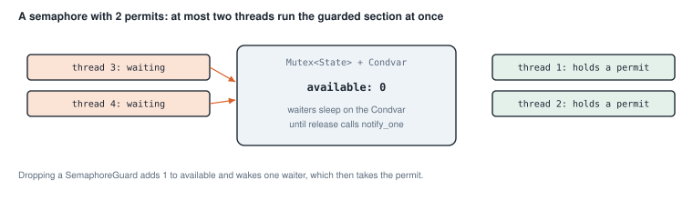
<figcaption><b>Figure 16.6</b> A semaphore with two permits, both taken.</figcaption>
</figure>

### 16.5.1 Waiting without spinning

A waiting thread should sleep, not spin, because the wait may be long. A **condition variable**, `Condvar`, lets a
thread sleep until another thread signals it. It always works together with a `Mutex`:

1. The waiting thread locks the mutex and checks the condition.
2. If the condition is false, it calls `condvar.wait(guard)`. That call releases the mutex and puts the thread to
   sleep, in one step.
3. Another thread locks the mutex, changes the state, and calls `notify_one()`.
4. The sleeping thread wakes up, holding the mutex again, and checks the condition again.

The check in step 4 is needed for two reasons. Another thread may have taken the permit first. And a thread can
sometimes wake up with no notification at all, which is called a **spurious wakeup**. So the wait always sits in a
`while` loop, not an `if`.

<p class="listing"><b>Listing 16.13</b> The state, the guard, and <code>acquire_guard</code>. <a href="https://github.com/arpanpathak/cracking-the-systems-programming-interview/blob/prep-v2/rust-interview-lab/src/problems/semaphore.rs">src/problems/semaphore.rs</a></p>

```rust
{{#include ../../rust-interview-lab/src/problems/semaphore.rs:10:13}}

{{#include ../../rust-interview-lab/src/problems/semaphore.rs:15:23}}

{{#include ../../rust-interview-lab/src/problems/semaphore.rs:111:120}}

impl Semaphore {
{{#include ../../rust-interview-lab/src/problems/semaphore.rs:26:53}}
    // ...
}
```

`acquire_guard` returns a `SemaphoreGuard`. The guard holds only a reference to its semaphore, and its `Drop` calls `release`. A permit goes back even if
the holder returns early or panics.

`acquire_guard` follows the four steps. `self.released.wait(state)` takes the guard, sleeps, and returns a new
guard when the thread wakes. When the loop ends, a permit is free and the thread holds the mutex, so it takes the
permit by subtracting 1.

The permit is returned by a guard, the same RAII pattern as in section 16.4.

<p class="listing"><b>Listing 16.14</b> The other ways to acquire, and <code>release</code> (lines 47 to 103).</p>

```rust
impl Semaphore {
    // ...
{{#include ../../rust-interview-lab/src/problems/semaphore.rs:55:108}}
}

{{#include ../../rust-interview-lab/src/problems/semaphore.rs:111:120}}
```

`release` adds a permit and wakes one sleeping thread with `notify_one`. It is private, and only the guard's `Drop`
calls it. A caller therefore cannot release a permit it never took.

Two methods have problems:

- `acquire` calls `acquire_guard` and stores the guard in `_guard`. The guard is dropped when `acquire` returns,
  so the permit is released at once. A caller of `acquire` never actually holds a permit. `acquire_guard` is the
  method to use.
- `try_acquire_timeout` waits once. If it wakes early, from a spurious wakeup or because another thread took the
  permit first, it returns `None` before the timeout has passed. A correct version loops, and waits again for the
  time remaining. Exercise 4 asks you to write it.

<p class="listing"><b>Listing 16.15</b> The complete file, with tests. <a href="https://github.com/arpanpathak/cracking-the-systems-programming-interview/blob/prep-v2/rust-interview-lab/src/problems/semaphore.rs">src/problems/semaphore.rs</a></p>

```rust
{{#include ../../rust-interview-lab/src/problems/semaphore.rs}}
```

The test `never_exceeds_the_permit_count` starts 32 threads on a semaphore with 4 permits. Each thread counts
itself in `active` while it holds a permit, and records the highest count ever seen in `peak` with `fetch_max`.
The peak must not exceed 4.

```text
$ cargo test --lib problems::semaphore
running 4 tests
test problems::semaphore::tests::guard_returns_the_permit_on_drop ... ok
test problems::semaphore::tests::try_acquire_reports_contention ... ok
test problems::semaphore::tests::timeout_gives_up_when_no_permit_arrives ... ok
test problems::semaphore::tests::never_exceeds_the_permit_count ... ok

test result: ok. 4 passed; 0 failed; 0 ignored; 0 measured; 133 filtered out
```

## 16.6 When a lock holder panics

A lock protects data that must stay consistent. A bank transfer, for example, takes money from one account and
adds it to another. Between those two steps, the data is briefly inconsistent. The lock hides that moment from
other threads.

What if the thread panics between the two steps? The guard is dropped during the panic, so the lock is released.
The data, though, stays half-changed. The standard `Mutex` records that this happened, and the mutex becomes
**poisoned** (figure 16.7). Every later `lock()` returns `Err(PoisonError)` instead of `Ok(guard)`.

<figure>
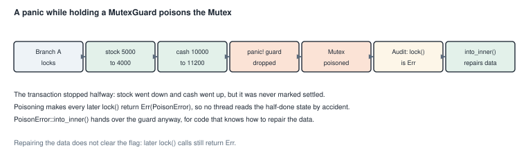
<figcaption><b>Figure 16.7</b> The sequence in <code>mutex_poisoning.rs</code>.</figcaption>
</figure>

The error does not hide the data. `PoisonError::into_inner()` returns the guard anyway, for code that can check
and repair the data.

<p class="listing"><b>Listing 16.16</b> The ledger and the recovery function. <a href="https://github.com/arpanpathak/cracking-the-systems-programming-interview/blob/prep-v2/rust-interview-lab/src/bin/mutex_poisoning.rs">src/bin/mutex_poisoning.rs</a></p>

```rust
{{#include ../../rust-interview-lab/src/bin/mutex_poisoning.rs:27:31}}

{{#include ../../rust-interview-lab/src/bin/mutex_poisoning.rs:33:41}}

{{#include ../../rust-interview-lab/src/bin/mutex_poisoning.rs:54:82}}
```

`Ledger` is the shared state: the cash, the stock value, a transaction counter, and a flag that says whether
the books balance. A panic between two of its updates leaves them inconsistent.

`recover_ledger` receives the `PoisonError` and takes the guard out of it. It holds the lock while it corrects the
ledger. It returns a clone of the corrected data, and the guard is dropped at the end of the function.

<p class="listing"><b>Listing 16.17</b> The complete program. <a href="https://github.com/arpanpathak/cracking-the-systems-programming-interview/blob/prep-v2/rust-interview-lab/src/bin/mutex_poisoning.rs">src/bin/mutex_poisoning.rs</a></p>

```rust
{{#include ../../rust-interview-lab/src/bin/mutex_poisoning.rs}}
```

In `main`, thread A changes the stock and the cash and then panics before marking the transaction settled. The
panic does not stop the process. It ends only thread A, and `handle_a.join()` returns an `Err`, which `main`
ignores on purpose with `let _ =`.

Thread B then locks the ledger. `match` on the result separates the two cases. `poisoned.get_ref()` shows the data
without taking the guard, and `recover_ledger` repairs it.

```text
$ cargo run --bin mutex_poisoning
[Branch A] Transaction 1 commenced.
[Branch A] Stock deducted. New value: 4000
[Branch A] Cash updated. New balance: 11200

thread '<unnamed>' (5795284) panicked at src/bin/mutex_poisoning.rs:109:9:
[Branch A] Settlement failure: arithmetic overflow in reconciliation.
note: run with `RUST_BACKTRACE=1` environment variable to display a backtrace

[Audit] Attempting to access the ledger...
[Audit] Mutex is poisoned. Recovered state before correction:
[Audit] Ledger { cash_on_hand: 11200, stock_value: 4000, transaction_id: 0, is_settled: false }
[Reconciliation] Physical audit reveals a cash discrepancy.
[Reconciliation] Digital cash: 11200 | Corrected cash: 11000
[Reconciliation] Ledger corrected. Transaction marked failed and closed.
[Audit] Corrected ledger: Ledger { cash_on_hand: 11000, stock_value: 4000, transaction_id: 1, is_settled: true }
```

The panic message goes to standard error, so in a terminal it can appear between the other lines. The number in
parentheses is the thread's ID and changes on every run.

Recovering the data does not clear the poison flag. A later `lock()` on the same mutex still returns `Err`, as the
comment at the end of `main` notes. Rust 1.77 added `Mutex::clear_poison` for code that has repaired the data and
wants to say so.

## 16.7 Deadlock

A **deadlock** happens when threads wait for each other in a circle, so none can continue. The classic case needs
two locks. Thread 1 holds lock A and waits for lock B. Thread 2 holds lock B and waits for lock A. Neither will
ever release what it holds.

To analyze a deadlock, draw a **wait-for graph**. Each thread is a node. An edge from T0 to T1 means T0 is waiting
for a lock that T1 holds. The threads are deadlocked exactly when the graph has a cycle (figure 16.8). Finding a
cycle is the three-state DFS from section 12.6.

<figure>
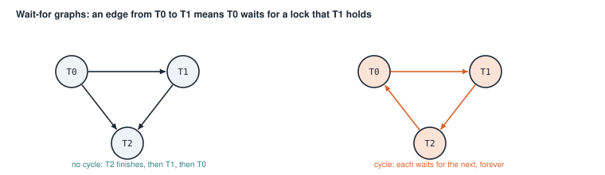
<figcaption><b>Figure 16.8</b> The two graphs from the program. Only the right one is deadlocked.</figcaption>
</figure>

`has_deadlock` takes the edges as `(waiter, holder)` pairs. It first turns them into an adjacency list:

```rust
{{#include ../../rust-interview-lab/src/bin/concurrency_deadlock.rs:7:20}}
    // ...
}
```

It finds the largest thread number with a `let ... else`, so an empty list returns `false` at once. The
adjacency list then has one entry per thread, holding the threads it waits for.

The search is the DFS of section 12.6. The three states are plain numbers: 0 for unvisited, 1 for on the
current path, and 2 for fully explored:

```rust
fn has_deadlock(waits_for: &[(usize, usize)]) -> bool {
    // ...
{{#include ../../rust-interview-lab/src/bin/concurrency_deadlock.rs:22:39}}
}
```

`visit` returns `true` as soon as it reaches a node in state 1. That node is on the path that led here, so the
edge closes a cycle. A node in state 2 was explored already and is known to lead to no cycle. `any` starts a
search from every node, so a cycle among threads that no other thread waits on is found too.

`main` checks three graphs. The third, `(0, 0)`, is a thread waiting for itself, as happens when a thread tries
to lock a `Mutex` it already holds.

<p class="listing"><b>Listing 16.18</b> The complete program. <a href="https://github.com/arpanpathak/cracking-the-systems-programming-interview/blob/prep-v2/rust-interview-lab/src/bin/concurrency_deadlock.rs">src/bin/concurrency_deadlock.rs</a></p>

```rust
{{#include ../../rust-interview-lab/src/bin/concurrency_deadlock.rs}}
```

```text
$ cargo run --bin concurrency_deadlock
0->1, 1->2, 0->2     deadlock: false
0->1, 1->2, 2->0     deadlock: true
0->0                 deadlock: true

Coffman conditions:
  - mutual exclusion
  - hold and wait
  - no preemption
  - circular wait

all checks passed
```

The program ends with the four **Coffman conditions**. A deadlock needs all four:

1. **Mutual exclusion**: a lock can be held by only one thread.
2. **Hold and wait**: a thread holds one lock while waiting for another.
3. **No preemption**: a lock cannot be taken away from its holder.
4. **Circular wait**: the waiting forms a cycle.

Removing any one prevents deadlock. The most practical rule removes the fourth: give every lock a fixed order, and
always take locks in that order. If every thread takes lock A before lock B, no thread can hold B while waiting for
A, and no cycle can form.

<figure class="anim">
<video class="motion" src="figures/ch16-deadlock.mp4" autoplay loop muted playsinline preload="metadata" aria-label="Thread A and thread B, and two locks m1 and m2. A takes m1 and B takes m2. A waits for m2 and B waits for m1, which forms the cycle A, m2, B, m1. A second run uses one order for both threads: B waits for m1 while holding nothing, A takes m2 and finishes, then B takes both locks." data-chapters="[[0.0, &quot;opposite order&quot;], [28.64, &quot;fixed order&quot;]]">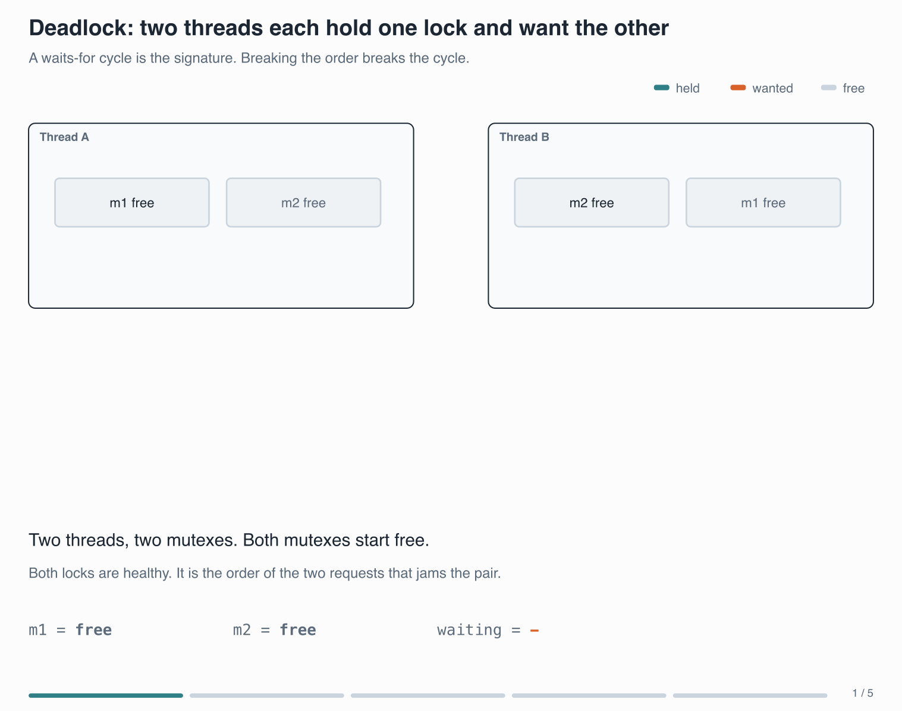</video>
<figcaption><b>Animation 16.2</b> Each lock is taken correctly; the opposite orders form the cycle. When both threads take <code>m1</code> first, the waiting thread holds nothing, and no cycle can form.</figcaption>
</figure>


<div class="summary" markdown="1">

## Summary

- `thread::spawn` needs closures that own their data. `thread::scope` lets threads borrow local data, and waits
  for them.
- Collect the join handles before joining, or lazy iterators run the threads one at a time.
- `Send` and `Sync` are auto traits. `Rc` and `RefCell` lack them, so the compiler rejects sharing them across
  threads.
- An atomic performs read, change, and write as one step. `Relaxed` suffices for a standalone counter. `Release`
  and `Acquire` pair up to pass other data between threads.
- Eight threads summed a large array about 3 to 4 times faster, limited by memory bandwidth and four physical
  cores. Amdahl's law caps speedup at `1 / s` for a serial fraction `s`.
- A spin lock is an atomic flag, a compare-exchange loop, and a guard that releases on drop. Its `unsafe impl
  Sync` is a promise the code must keep.
- A semaphore built from a `Mutex` and a `Condvar` waits in a `while` loop, because wakeups can be spurious.
- A panic while holding a `MutexGuard` poisons the mutex, and `into_inner` gives the data to recovery code.
- Threads are deadlocked when their wait-for graph has a cycle. A global lock order prevents it.

</div>

Chapter 17 uses these tools to build queues that pass work between threads, and makes producers wait when the
queue is full.

## Exercises

1. Write a version of `parallel_sum` from listing 16.1 as a single lazy chain, `.map(spawn).map(join).sum()`, and
   time both on a large slice. Explain the difference.
2. Make the three pairs of functions in `parallel_sum.rs` one generic function over `T: Sum<T> + Copy + Send + Sync`.
   Which extra bound does `sum::<T>()` over `&T` items need?
3. Close the gap in `SpinGuard`. Add a field `_marker: PhantomData<&'a mut T>`, and explain why this makes the
   guard `Sync` only when `T: Sync`.
4. Rewrite `try_acquire_timeout` to loop until a permit is free or the whole timeout has passed. Use
   `Instant::now()` to compute the time left for each wait.
5. Write a program that deadlocks with two `Mutex` values and two threads. Then fix it by taking the locks in a
   fixed order.
