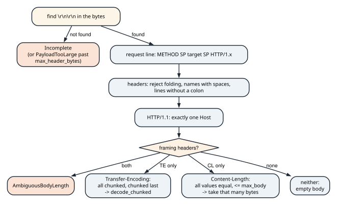
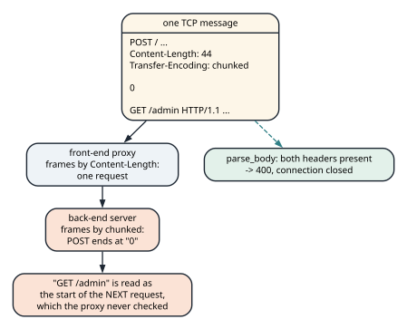
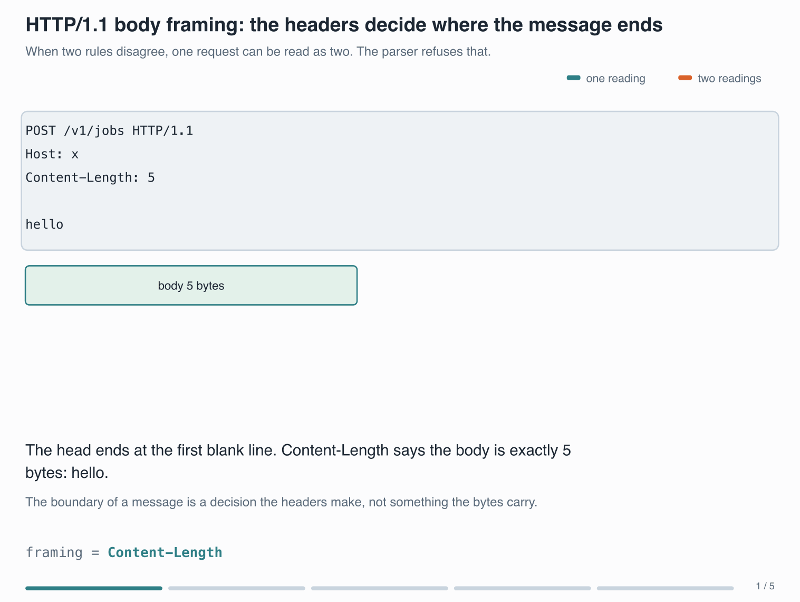
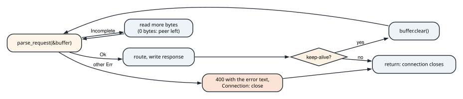

# Parsing and serving HTTP/1.1

<div class="covers" markdown="1">

This chapter covers

- Parsing an HTTP/1.1 request from bytes: request line, headers, and body framing
- Why `Content-Length` plus `Transfer-Encoding` must be rejected, and what request smuggling is
- Decoding chunked bodies, enforcing size limits, and reporting "incomplete" as a normal result
- A small REST server: a pure routing function, keep-alive, and status codes
- Reading the server against the RFC, and the three things it gets wrong

</div>

A web server is a common exercise for SDK and platform roles. It is also a trap for anyone who treats HTTP
as text with line breaks. The protocol is a byte stream whose message boundaries are decided by headers.
The security bugs in real servers come from disagreeing about where one request ends and the next begins.
The parser is built around that point, and the server on top of it keeps protocol handling separate from
routing. Each can then be tested alone.

## 17.1 The parser

<p class="listing"><b>Listing 17.1</b> An HTTP/1.1 request parser with framing checks and limits. <a href="https://github.com/arpanpathak/cracking-the-systems-programming-interview/blob/prep-v2/rust-interview-lab/src/problems/http_request.rs">src/problems/http_request.rs</a></p>

```rust
{{#include ../../rust-interview-lab/src/problems/http_request.rs}}
```

### 17.1.1 Types first

The file opens with its vocabulary. `Method` is an enum with a `parse` that returns `None` for an unknown
token, and two predicates from RFC 9110. `is_safe` is true for GET, HEAD, and OPTIONS, which do not change
state. `is_idempotent` adds PUT and DELETE to those. Chapter 15's retry loop is exactly the consumer that
needs `is_idempotent`. `Version` has two variants because the parser accepts two. `Limits` carries the
header and body caps, with defaults of 16 KiB and 8 MiB.

`ParseError` distinguishes the cases a server must treat differently. `Incomplete` is not a failure: it
means "read more bytes and try again", and the server's loop in section 17.2 depends on it.
`PayloadTooLarge` maps naturally to status 413, `MissingHost` and `Malformed` to 400.

`Request::header` finds a header case-insensitively, because header names are case-insensitive. Then
`should_keep_alive` encodes the one rule that differs by version. HTTP/1.1 keeps the connection open
unless the client sends `Connection: close`. HTTP/1.0 closes it unless the client sends `Connection:
keep-alive`. The `has` closure splits the header on commas because `Connection` carries a list.

### 17.1.2 The head of the request

`parse_request` works on `&[u8]`, not `&str`, because an HTTP body is arbitrary bytes and only the head is
text. It first looks for the blank line that ends the head, `\r\n\r\n`, with `windows(4).position(...)`.
If it is missing, the request is `Incomplete`. The exception is a buffer already larger than
`max_header_bytes`: then the client is sending an endless header and gets `PayloadTooLarge`.
That check stops a slow client from holding memory with a header that never ends. Figure 17.1
shows the order of the remaining checks.

<figure>

<figcaption><b>Figure 17.1</b> The order of checks in <code>parse_request</code> and <code>parse_body</code>.</figcaption>
</figure>

The request line must be exactly three space-separated parts: a known method, a non-empty target, and
`HTTP/1.1` or `HTTP/1.0`. A fourth part is an error. Header lines are split at the first colon. A name
with whitespace is rejected, because RFC 9112 forbids whitespace between the name and the colon. A line
that starts with a space or tab is *obsolete line folding*, a continuation syntax the RFC deprecates. Since
different servers interpret it differently, the parser rejects it.

HTTP/1.1 requires exactly one `Host` header. The count uses `filter(...).count() != 1`, which rejects
both zero and two.

### 17.1.3 Body framing and request smuggling

`parse_body` decides how long the body is, which is what the module's first comment is about. A
request with both `Content-Length` and `Transfer-Encoding` is rejected as `AmbiguousBodyLength`.

The reason is request smuggling (figure 17.2). A front-end proxy may frame a request by
`Content-Length`, while the back-end server frames the same bytes by `Transfer-Encoding: chunked`. The two
then disagree about where the request ends. The attacker places a second request in the part the back-end
treats as "after the body". The back-end runs it as though it arrived on its own, past whatever checks the
proxy applied. Refusing ambiguous framing outright, and closing the connection, removes the disagreement.

<figure>

<figcaption><b>Figure 17.2</b> A CL.TE desynchronization. The parser answers such a request with 400 and closes the connection.</figcaption>
</figure>

<figure class="anim">

<figcaption><b>Animation 17.3</b> The three framing rules on the same request shape. The head always ends at the first blank line; what differs is how the body's length is decided. Content-Length gives an exact byte count, a chunked body carries its own sizes and ends at a zero-size chunk, and a message with both is refused outright. The last frame is the disagreement removed: a connection that closes cannot have its leftover bytes read as a second request.</figcaption>
</figure>

The remaining rules close smaller gaps:

- `Transfer-Encoding` values from every such header are joined and split into codings. The parser
  supports only `chunked`, and requires it to be last, because a body whose final coding is not
  `chunked` has no defined end. Anything else is `UnsupportedTransferEncoding`.
- Multiple `Content-Length` headers are allowed only if they all agree. The check parses each value and
  compares with `lengths.any(|length| length != Ok(first))`, comparing `Result`s directly.
- A length above `max_body_bytes` is rejected *before* the server waits for the bytes. A client cannot
  claim a huge body and make the server buffer it.
- If fewer bytes than the length have arrived, the result is `Incomplete`.

### 17.1.4 Chunked bodies

`decode_chunked` walks a cursor through `size-in-hex CRLF data CRLF` records until a size of 0, then
consumes optional trailer lines until an empty line. Chunk extensions after a `;` are ignored, as the RFC
permits. Each chunk checks the running total against the body limit. It computes the chunk's end with
`checked_add`, returns `Incomplete` if the data has not all arrived, and insists on the CRLF after the
data. `find_crlf` uses `data.get(from..)?` so that a cursor past the end is `None` rather than a panic.

One arithmetic detail needs tightening. `body.len() + size > max_body` runs before the `checked_add`, and
a chunk size near `usize::MAX` overflows that addition. `from_str_radix` will happily parse such a size
from sixteen `f`s. The form `size > max_body - body.len()` cannot overflow.

`parse_request` returns the request but not how many bytes it consumed. A caller therefore cannot find the
start of a second, pipelined request in the same buffer. The server below accepts that limitation and
says so.

## 17.2 A small REST server

<p class="listing"><b>Listing 17.2</b> Routes, responses, and a keep-alive loop over <code>std::net</code>. <a href="https://github.com/arpanpathak/cracking-the-systems-programming-interview/blob/prep-v2/rust-interview-lab/src/bin/http_server.rs">src/bin/http_server.rs</a></p>

```rust
{{#include ../../rust-interview-lab/src/bin/http_server.rs}}
```

### 17.2.1 Routing as a pure function

`route(&Request) -> (u16, &'static str, Vec<u8>)` decides the status, content type, and body without
touching a socket. Its doc comment gives the reason: it is unit-testable, and the tests at the bottom
exercise every route by building a `Request` value directly. A known path with an unsupported method
returns 405, an unknown path 404. For `/v1/gpu-workloads/{id}`, `strip_prefix` extracts the id, and an
empty id or one containing `/` is a 404.

`build_response` writes the status line, `Content-Length`, an optional `Content-Type`, and a
`Connection` header that tells the client what the server will do.

### 17.2.2 The connection loop

`handle_connection` accumulates bytes in `buffer` and asks the parser what it has (figure 17.3). On `Ok`,
it routes, writes the response, and either closes or clears the buffer for the next request. On
`Incomplete`, it reads more; a read of 0 means the client left mid-request. Any other error gets a 400
whose body is the error's `Display` text, and the connection closes. After a framing error the
server cannot know where the next request starts.

<figure>

<figcaption><b>Figure 17.3</b> The keep-alive loop in <code>handle_connection</code>.</figcaption>
</figure>

A session with `curl` and `nc` against the server, started with
`cargo run --bin http_server 127.0.0.1:18080`:

```text
$ curl -si http://127.0.0.1:18080/healthz
HTTP/1.1 200 OK
Content-Length: 3
Content-Type: text/plain
Connection: keep-alive

ok
$ curl -si -X POST -d '{"gpuCount":1}' http://127.0.0.1:18080/v1/gpu-workloads
HTTP/1.1 201 Created
Content-Length: 49
Content-Type: application/json
Connection: keep-alive

{"id":"wl-a100-2","gpuCount":1,"state":"Pending"}
$ printf 'POST / HTTP/1.1\r\nHost: x\r\nContent-Length: 5\r\nTransfer-Encoding: chunked\r\n\r\nhello' | nc 127.0.0.1 18080
HTTP/1.1 400 Bad Request
Content-Length: 59
Content-Type: text/plain
Connection: close

Content-Length and Transfer-Encoding are mutually exclusive
```

### 17.2.3 Reading the server against the RFC

The same session shows three places where the server departs from RFC 9110. None of them is hard to fix,
and finding them is good practice.

```text
$ curl -si -X DELETE http://127.0.0.1:18080/v1/gpu-workloads/wl-7
HTTP/1.1 204 No Content
Content-Length: 0
Connection: keep-alive

$ printf 'HEAD /healthz HTTP/1.1\r\nHost: x\r\nConnection: close\r\n\r\n' | nc 127.0.0.1 18080
HTTP/1.1 200 OK
Content-Length: 3
Content-Type: text/plain
Connection: close

ok
```

- **HEAD must not carry a body.** A HEAD response repeats the GET headers, including the
  `Content-Length` of a body it does not send. The server sends `ok`. A client that
  trusts the spec reads those three bytes as the start of the *next* response. The fix is one line in
  `handle_connection`: skip `body` when `request.method == Method::Head`.
- **204 must not carry `Content-Length`.** `build_response` always writes it. Skipping it for 204 (and
  1xx) fixes that.
- **Errors all become 400.** `PayloadTooLarge` deserves 413, and `status_reason` already has its text.
  Mapping `ParseError` to a status in one `match` fixes it. A 405 should also carry an `Allow` header
  listing the methods that path supports.

Two more points concern safety rather than the RFC. The id is interpolated into JSON with `format!`, so an
id containing `"` produces invalid JSON; a real server serializes with `serde_json`. And `buffer.clear()`
after each request discards any pipelined bytes that arrived with it, which the module comment
acknowledges.

## 17.3 Questions that come up

**"How does a server know where an HTTP/1.1 request body ends?"**
`Transfer-Encoding: chunked` means read chunks until a zero-size chunk. Else `Content-Length` gives the
count. With neither header there is no body. For responses, closing the connection can also end the body.

**"What is request smuggling, and how do you prevent it?"**
Two servers frame the same bytes differently, so each sees a different message.
Reject requests with both framing headers. Reject conflicting `Content-Length`s. Close the
connection after any framing error.

**"How do you stop a client from exhausting your server's memory?"**
Limit header size and body size. Check the declared length before reading the body. Time out idle
and slow connections.

**"Why is routing a separate pure function?"**
So the rules are testable without sockets. The protocol code (framing, keep-alive) can then be changed
without touching the application logic.

**"What does HTTP/2 change?"**
Binary framing with explicit lengths, many concurrent streams on one connection, and header compression.
Framing ambiguity of the HTTP/1.1 kind disappears inside HTTP/2, although it can return where a proxy
downgrades to HTTP/1.1.
