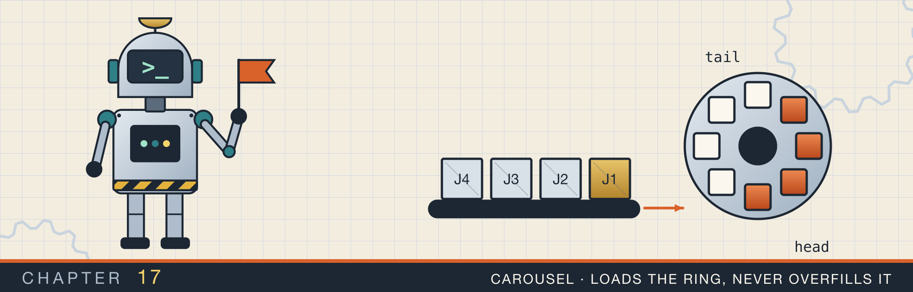
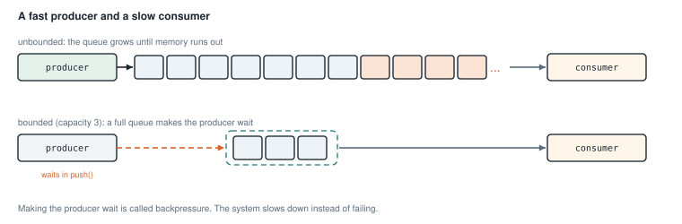
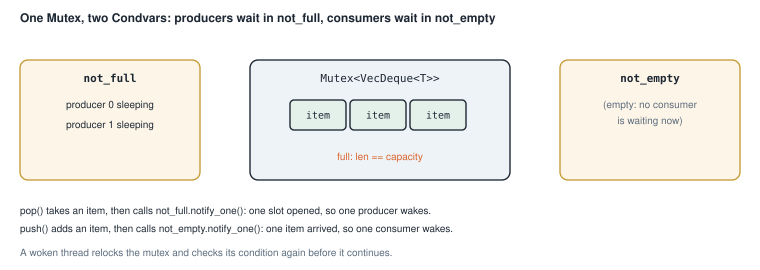
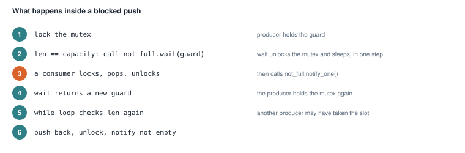
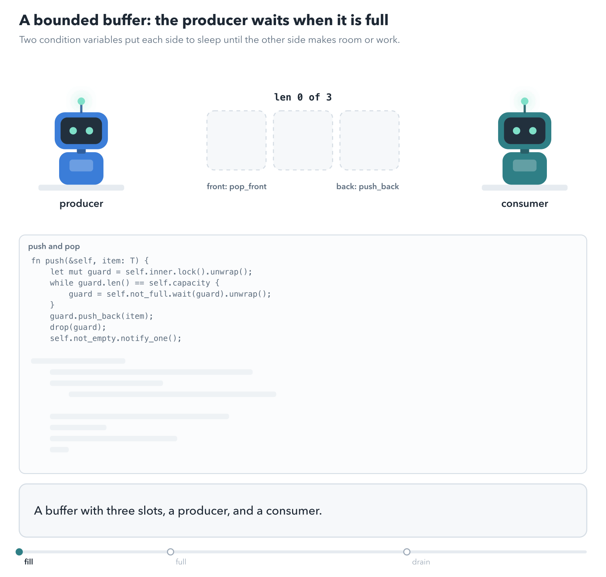
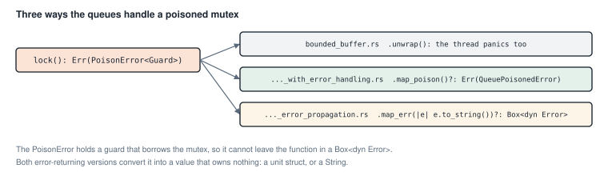
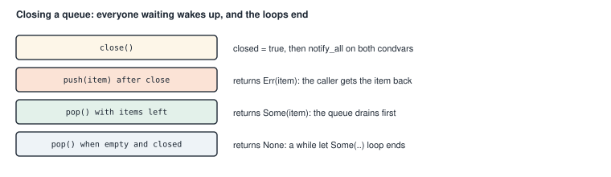
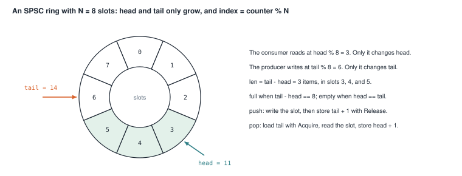

# Queues and bounded buffers

<div class="covers" markdown="1">

This chapter covers

- Passing work between threads through a shared queue
- Putting a waiting thread to sleep with a `Condvar`, and waking it again
- A bounded buffer, where producers wait when the queue is full
- Three ways to handle a poisoned lock inside a queue
- Closing a queue so that every waiting thread wakes up and every loop ends
- A ring buffer for one producer and one consumer, with no lock at all

</div>

Chapter 16 split one job across threads. Many programs have a different shape. Some threads produce work: they
read requests, parse files, or receive messages. Other threads consume it: they process each item. The two groups
run at different speeds, so they need a place to leave work for each other.

That place is a **queue**. Producers add items at the back, and consumers take them from the front. Items come
out in the order they went in, which is called **FIFO**, for first in, first out.

This chapter builds the queue six times. Each version fixes a limitation of the one before, and the last one
removes the lock.

## 17.1 Why a queue needs a limit

Suppose producers add items faster than consumers can handle them. If the queue can grow without limit, it grows until the machine runs out of memory, and the program is
killed (figure 17.1).

<figure>

<figcaption><b>Figure 17.1</b> An unbounded queue grows without end. A bounded queue makes the producer wait.</figcaption>
</figure>

A **bounded** queue has a fixed capacity. When it is full, `push` waits until a consumer makes room. The producer
slows down to the consumer's speed. Slowing down the source of work when the rest of the system cannot keep up is
called **backpressure**. A slow system is better than a crashed one.

A bounded queue with blocking `push` and `pop` is also called a **bounded buffer**.

## 17.2 A shared queue

The first version is unbounded. It shows the two tools every version uses: a `Mutex` around a `VecDeque`, and a
`Condvar` for waiting.

`VecDeque` from chapter 3 adds at the back and removes from the front in O(1). The `Mutex` makes sure one thread
at a time touches it.

The `Condvar` is for consumers that find the queue empty. Section 16.5 introduced condition variables. A thread waits on one while holding a mutex, and the wait
releases the mutex and sleeps in one step. When another thread
calls `notify_one`, one sleeping thread wakes up with the mutex locked again.

<p class="listing"><b>Listing 17.1</b> The queue (lines 7 to 29). <a href="https://github.com/arpanpathak/cracking-the-systems-programming-interview/blob/prep-v2/rust-interview-lab/src/bin/thread_safe_queue.rs">src/bin/thread_safe_queue.rs</a></p>

```rust
{{#include ../../rust-interview-lab/src/bin/thread_safe_queue.rs:1:5}}

{{#include ../../rust-interview-lab/src/bin/thread_safe_queue.rs:7:29}}
```

`push` locks the queue, adds the item, and wakes one waiting consumer. `if let Ok(mut q)` skips the push if the
lock is poisoned, so in that case the item is silently lost. Section 17.4 shows better ways to handle that.

`pop` uses `wait_while`. It takes the guard and a condition, and waits for as long as the condition is true:

```rust
let mut q = self.not_empty.wait_while(q, |q| q.is_empty()).ok()?;
```

`wait_while` contains the `while` loop that section 16.5 wrote by hand. It checks the condition, waits if it is
true, and checks again after each wakeup. It returns the guard when the queue is not empty. The `.ok()?` turns a
poisoned lock into `None`.

<p class="listing"><b>Listing 17.2</b> The complete program. <a href="https://github.com/arpanpathak/cracking-the-systems-programming-interview/blob/prep-v2/rust-interview-lab/src/bin/thread_safe_queue.rs">src/bin/thread_safe_queue.rs</a></p>

```rust
{{#include ../../rust-interview-lab/src/bin/thread_safe_queue.rs}}
```

`main` shares the queue through an `Arc`. Each thread is created inside a block that makes its own clone of the
`Arc` first:

```rust
let producer = {
    let q = Arc::clone(&q);
    thread::spawn(move || { ... })
};
```

The block keeps the clone's name short, and the outer `q` stays available for the next thread.

```text
$ cargo run --bin thread_safe_queue
Producer pushed 0
Producer pushed 1
Producer pushed 2
Producer pushed 3
Producer pushed 4
Cosnumer popped: Some(0)
Cosnumer popped: Some(1)
Cosnumer popped: Some(2)
Cosnumer popped: Some(3)
Cosnumer popped: Some(4)
```

In this run the producer finished before the consumer started. On another run the lines can interleave. The
values always come out in the order 0 to 4, because the queue is FIFO.

## 17.3 A bounded buffer

The bounded version adds a capacity, and a second reason to wait: a producer must wait while the queue is full.
So it has two condition variables, one for each kind of waiting thread (figure 17.2).

- `not_empty` is where consumers wait. A producer notifies it after adding an item.
- `not_full` is where producers wait. A consumer notifies it after removing an item.

<figure>

<figcaption><b>Figure 17.2</b> Two condition variables share one mutex. Each wakes only the kind of thread that can make progress.</figcaption>
</figure>

With a single condition variable and `notify_one`, a producer could wake another producer instead of a consumer.
The woken producer would find the queue still full and sleep again, while the consumer that could make progress
never woke. Every thread could end up asleep. `notify_all` on one condition variable avoids that, but wakes every
thread for each change. Two condition variables wake the right kind of thread directly.

<p class="listing"><b>Listing 17.3</b> The type and <code>new</code> (lines 19 to 38). <a href="https://github.com/arpanpathak/cracking-the-systems-programming-interview/blob/prep-v2/rust-interview-lab/src/bin/bounded_buffer.rs">src/bin/bounded_buffer.rs</a></p>

```rust
{{#include ../../rust-interview-lab/src/bin/bounded_buffer.rs:1:6}}

{{#include ../../rust-interview-lab/src/bin/bounded_buffer.rs:21:26}}

impl<T> BoundedQueue<T> {
{{#include ../../rust-interview-lab/src/bin/bounded_buffer.rs:29:40}}
    // ...
}
```

`VecDeque::with_capacity(capacity)` allocates room for every item at the start, so the deque never grows later.
A capacity of 0 is rejected, because nothing could ever be pushed.

<p class="listing"><b>Listing 17.4</b> <code>push</code> (lines 42 to 76).</p>

```rust
impl<T> BoundedQueue<T> {
    // ...
{{#include ../../rust-interview-lab/src/bin/bounded_buffer.rs:42:76}}
    // ...
}
```

The comments in `push` explain each decision. Figure 17.3 puts the steps of a blocked `push` in order.

<figure>

<figcaption><b>Figure 17.3</b> A producer that finds the queue full.</figcaption>
</figure>

<figure class="anim">

<figcaption><b>Animation 17.1</b> A producer and a consumer sharing three slots. The buffer row shows what is stored, and the two lanes show what each thread is doing right now. The producer is blocked exactly once, on the frame where the buffer is full, and the consumer's pop is what wakes it. That is backpressure: a fast producer cannot outrun a slow consumer, because the buffer's capacity is the limit.</figcaption>
</figure>

The line `guard = self.not_full.wait(guard).unwrap();` looks odd at first. `wait` takes the guard by value,
because it must release the mutex. When the thread wakes, `wait` locks the mutex again and returns a new guard. The
assignment stores that new guard in the same variable.

After the push, the code drops the guard before calling `notify_one`. If it notified first, the woken consumer
would try to lock a mutex that is still held, and wait again at once. Unlocking first avoids that extra wait. The
program would be correct either way.

<p class="listing"><b>Listing 17.5</b> <code>pop</code> (lines 78 to 102).</p>

```rust
impl<T> BoundedQueue<T> {
    // ...
{{#include ../../rust-interview-lab/src/bin/bounded_buffer.rs:78:102}}
}
```

`pop` mirrors `push`. It waits on `not_empty` while the queue is empty, removes the front item, unlocks, and wakes
one producer through `not_full`. The `unwrap()` on `pop_front()` cannot fail. The loop ended because the queue was not empty, and the
thread has held the lock since that check.

<p class="listing"><b>Listing 17.6</b> The complete program. <a href="https://github.com/arpanpathak/cracking-the-systems-programming-interview/blob/prep-v2/rust-interview-lab/src/bin/bounded_buffer.rs">src/bin/bounded_buffer.rs</a></p>

```rust
{{#include ../../rust-interview-lab/src/bin/bounded_buffer.rs}}
```

`main` starts two producers and two consumers on a queue with room for 3 items. Producers sleep 30 ms after each
push, and consumers sleep 60 ms after each pop, so the producers are faster.

```text
$ cargo run --bin bounded_buffer
  [producer 0] pushing p0:item0
  [producer 1] pushing p1:item0
[consumer 1] got p0:item0
[consumer 0] got p1:item0
  [producer 0] pushing p0:item1
  [producer 1] pushing p1:item1
  [producer 0] pushing p0:item2
  [producer 1] pushing p1:item2
[consumer 1] got p0:item1
[consumer 0] got p1:item1
  [producer 0] pushing p0:item3
  [producer 1] pushing p1:item3
[consumer 1] got p0:item2
[consumer 0] got p1:item2
  [producer 0] pushing p0:item4
  [producer 1] pushing p1:item4
[consumer 1] got p1:item3
[consumer 0] got p0:item3
[consumer 1] got p0:item4
[consumer 0] got p1:item4
done
```

The order changes from run to run. Items from one producer always come out in that producer's order. The
"pushing" line is printed before `push` is called, so the output does not show how long a push waited. Exercise 1
adds that.

## 17.4 When the lock is poisoned

`bounded_buffer.rs` calls `.unwrap()` on every `lock()` and `wait()`. If a thread panics while holding the lock,
the mutex is poisoned, as section 16.6 showed. Every other thread's `unwrap()` then panics too. Two more versions
return an error instead (figure 17.4).

<figure>

<figcaption><b>Figure 17.4</b> Three responses to a poisoned mutex.</figcaption>
</figure>

### 17.4.1 A custom error type

<p class="listing"><b>Listing 17.7</b> The error and an extension trait (lines 9 to 31). <a href="https://github.com/arpanpathak/cracking-the-systems-programming-interview/blob/prep-v2/rust-interview-lab/src/bin/bounded_buffer_with_error_handling.rs">src/bin/bounded_buffer_with_error_handling.rs</a></p>

```rust
{{#include ../../rust-interview-lab/src/bin/bounded_buffer_with_error_handling.rs:1:7}}

{{#include ../../rust-interview-lab/src/bin/bounded_buffer_with_error_handling.rs:9:31}}
```

`QueuePoisonedError` is a unit struct: it carries no data. It implements `Display` for a readable message, and
`std::error::Error` so it works with `?` and `Box<dyn Error>`.

`PoisonMap` adds a method to a type the code does not own. A trait defined in your crate can be implemented for
any type, including the standard library's `Result`. A trait used this way is called an **extension trait**.
`impl<T> PoisonMap<T> for Result<T, PoisonError<T>>` gives every `Result<T, PoisonError<T>>` a `map_poison`
method, which replaces the `PoisonError` with `QueuePoisonedError`.

<p class="listing"><b>Listing 17.8</b> <code>push</code> and <code>pop</code> (lines 51 to 71).</p>

```rust
impl<T> BoundedQueue<T> {
    // ...
{{#include ../../rust-interview-lab/src/bin/bounded_buffer_with_error_handling.rs:51:71}}
}
```

Each `lock()` and `wait()` call ends in `.map_poison()?`. The logic is the same as listing 17.4, and each method
now returns a `Result`.

<p class="listing"><b>Listing 17.9</b> The complete program. <a href="https://github.com/arpanpathak/cracking-the-systems-programming-interview/blob/prep-v2/rust-interview-lab/src/bin/bounded_buffer_with_error_handling.rs">src/bin/bounded_buffer_with_error_handling.rs</a></p>

```rust
{{#include ../../rust-interview-lab/src/bin/bounded_buffer_with_error_handling.rs}}
```

The threads in `main` handle an error by printing it with `dbg!` and leaving their loop with `break`.

The second test poisons the queue on purpose. It spawns a thread that locks the inner mutex and panics while
holding it. A test in the same file can reach the private `inner` field. After that, both `push` and `pop` must
return `Err(QueuePoisonedError)`.

```text
$ cargo test --bin bounded_buffer_with_error_handling
running 2 tests
test tests::test_zero_capacity_panics - should panic ... ok
test tests::test_queue_poisoning_on_thread_panic ... ok

test result: ok. 2 passed; 0 failed; 0 ignored; 0 measured; 0 filtered out
```

### 17.4.2 A boxed error

The third version returns a general error type:

```rust
{{#include ../../rust-interview-lab/src/bin/bounded_buffer_error_propagation.rs:1:7}}

{{#include ../../rust-interview-lab/src/bin/bounded_buffer_error_propagation.rs:9:9}}
```

`Box<dyn Error + Send + Sync>` can hold any error type. `+ Send + Sync` is needed because the error travels
between threads: each thread returns a `Result`, and `join` hands it to the main thread.

<p class="listing"><b>Listing 17.10</b> <code>push</code> (lines 29 to 43). <a href="https://github.com/arpanpathak/cracking-the-systems-programming-interview/blob/prep-v2/rust-interview-lab/src/bin/bounded_buffer_error_propagation.rs">src/bin/bounded_buffer_error_propagation.rs</a></p>

```rust
impl<T> BoundedQueue<T> {
    // ...
{{#include ../../rust-interview-lab/src/bin/bounded_buffer_error_propagation.rs:29:43}}
    // ...
}
```

Why `.map_err(|e| e.to_string())` instead of `?` directly? A `PoisonError` contains the guard, and the guard
borrows the mutex. A `Box<dyn Error>` must not borrow anything local, so the poison error cannot go into one.
`to_string()` turns it into a `String`, which owns its text. Then `?` converts the `String` into the boxed error,
through a `From` implementation in the standard library.

<p class="listing"><b>Listing 17.11</b> The complete program. <a href="https://github.com/arpanpathak/cracking-the-systems-programming-interview/blob/prep-v2/rust-interview-lab/src/bin/bounded_buffer_error_propagation.rs">src/bin/bounded_buffer_error_propagation.rs</a></p>

```rust
{{#include ../../rust-interview-lab/src/bin/bounded_buffer_error_propagation.rs}}
```

`main` builds the threads with two iterator chains, `producers` and `consumers`. These are lazy: no thread starts
until something consumes them. `producers.chain(consumers).collect()` starts all four threads while building the
`Vec`, and only then does the loop join them.

Each thread's closure is written `move || -> Result<(), RuntimeError> { ... }`, with its return type, so the `?`
inside it knows what error type to convert to. `join()` returns `Ok(r)`, where `r` is the thread's own `Result`.

```text
$ cargo run --bin bounded_buffer_error_propagation
  [producer 1] pushing p1:item0
  [producer 0] pushing p0:item0
[consumer 1] got p1:item0
[consumer 0] got p0:item0
  [producer 0] pushing p0:item1
  [producer 1] pushing p1:item1
[consumer 1] got p0:item1
[consumer 0] got p1:item1
  [producer 0] pushing p0:item2
  [producer 1] pushing p1:item2
  [producer 0] pushing p0:item3
  [producer 1] pushing p1:item3
[consumer 0] got p1:item2
[consumer 1] got p0:item2
  [producer 0] pushing p0:item4
  [producer 1] pushing p1:item4
Thread joined : Ok(
    (),
)
[consumer 0] got p1:item3
[consumer 1] got p0:item3
Thread joined : Ok(
    (),
)
[consumer 1] got p0:item4
[consumer 0] got p1:item4
Thread joined : Ok(
    (),
)
Thread joined : Ok(
    (),
)
done
```

The join messages appear between the consumer lines, because `main` joins the producers first, while the
consumers are still running.

## 17.5 Many producers and consumers with `wait_while`

The next version is the bounded buffer written more compactly, with `wait_while` for both waits. Its `main` uses
scoped threads, so no `Arc` is needed.

<p class="listing"><b>Listing 17.12</b> The complete program. <a href="https://github.com/arpanpathak/cracking-the-systems-programming-interview/blob/prep-v2/rust-interview-lab/src/bin/mpmc_bounded_buffer.rs">src/bin/mpmc_bounded_buffer.rs</a></p>

```rust
{{#include ../../rust-interview-lab/src/bin/mpmc_bounded_buffer.rs}}
```

**MPMC** stands for multiple producers, multiple consumers. Here four producers push 10 items each, and two
consumers pop 20 each. `PER_CONSUMER` is computed from the other constants, so every pushed item is popped and
every thread finishes.

`push` reads `self.capacity` into a local `cap` before the closure `|q| q.len() >= cap`. The closure then
captures a `usize` instead of borrowing `self`.

`let buffer = &buffer;` replaces the buffer with a reference to it. Each `move` closure then copies the reference
into its thread. The scope guarantees that the buffer outlives all the threads.

```text
$ cargo run --bin mpmc_bounded_buffer
consumer 1: (3, 0)
consumer 1: (2, 0)
consumer 0: (1, 0)
consumer 0: (3, 2)
consumer 0: (3, 3)
...
consumer 0: (3, 8)
consumer 0: (0, 9)
consumer 0: (2, 9)
```

The full output has 40 lines. Each item is a `(producer, index)` pair. Across the whole output, each producer's
indexes appear in increasing order, but the producers are mixed together. Which consumer prints an item depends
on which one the operating system happened to wake.

## 17.6 Closing a queue

Every version so far has one problem. A consumer loop needs to know when to stop. The demos stop after a fixed
count, but a real consumer does not know how many items will come. It calls `pop` in a loop, and when the
producers finish, `pop` waits forever.

The library version adds a way to **close** the queue (figure 17.5).

<figure>

<figcaption><b>Figure 17.5</b> What each operation does after <code>close</code>.</figcaption>
</figure>

<p class="listing"><b>Listing 17.13</b> The state (lines 16 to 27). <a href="https://github.com/arpanpathak/cracking-the-systems-programming-interview/blob/prep-v2/rust-interview-lab/src/problems/bounded_queue.rs">src/problems/bounded_queue.rs</a></p>

```rust
{{#include ../../rust-interview-lab/src/problems/bounded_queue.rs:11:14}}

{{#include ../../rust-interview-lab/src/problems/bounded_queue.rs:16:27}}
```

The mutex now protects a small struct: the items, the capacity, and a `closed` flag. The flag must be inside the
mutex, because threads check it together with the items.

<p class="listing"><b>Listing 17.14</b> <code>push</code> and <code>pop</code> (lines 47 to 88).</p>

```rust
impl<T> BoundedQueue<T> {
    // ...
{{#include ../../rust-interview-lab/src/problems/bounded_queue.rs:47:88}}
    // ...
}
```

Both methods use a `loop` that checks every condition after each wakeup.

`push` returns `Result<(), T>`. If the queue is closed, it returns `Err(item)`, handing the item back. The value
is not lost, and the caller decides what to do with it.

`pop` returns `Option<T>`. It checks for an item before it checks `closed`, so a closed queue still gives up the
items already in it. Only a closed queue that is empty returns `None`. A consumer can therefore loop with
`while let Some(item) = queue.pop()`, and the loop ends after the last item.

<p class="listing"><b>Listing 17.15</b> <code>close</code> (lines 100 to 110).</p>

```rust
impl<T> BoundedQueue<T> {
    // ...
{{#include ../../rust-interview-lab/src/problems/bounded_queue.rs:100:110}}
    // ...
}
```

`close` sets the flag and wakes every waiting thread on both condition variables with `notify_all`. Each woken
thread sees `closed` in its loop and returns. Calling `close` twice does no harm. An operation that gives the same
result when repeated is called **idempotent**.

<p class="listing"><b>Listing 17.16</b> The complete file, with tests. <a href="https://github.com/arpanpathak/cracking-the-systems-programming-interview/blob/prep-v2/rust-interview-lab/src/problems/bounded_queue.rs">src/problems/bounded_queue.rs</a></p>

```rust
{{#include ../../rust-interview-lab/src/problems/bounded_queue.rs}}
```

The tests check the four promises:

- `preserves_order_across_threads` pushes 0 to 999 from one thread and pops them on another. They must arrive
  in order, and the consumer's `while let` loop must end after `close`.
- `never_exceeds_capacity` records the largest length seen, with a slow consumer. It must never pass 4.
- `close_wakes_a_blocked_consumer` starts a consumer on an empty queue, waits 20 ms so it is asleep, and closes
  the queue. The consumer must return `None` instead of sleeping forever.
- `push_after_close_returns_the_item` checks that `push` hands the item back.

```text
$ cargo test --lib problems::bounded_queue
running 4 tests
test problems::bounded_queue::tests::push_after_close_returns_the_item ... ok
test problems::bounded_queue::tests::preserves_order_across_threads ... ok
test problems::bounded_queue::tests::never_exceeds_capacity ... ok
test problems::bounded_queue::tests::close_wakes_a_blocked_consumer ... ok

test result: ok. 4 passed; 0 failed; 0 ignored; 0 measured; 133 filtered out
```

## 17.7 A ring buffer without a lock

Every queue so far takes a lock for each operation. With exactly one producer thread and one consumer thread,
the lock can go. This case is called **SPSC**, for single producer, single consumer.

### 17.7.1 The idea

A **ring buffer** is a fixed array used in a circle (figure 17.6). Two counters track it:

- `head` counts the items taken so far. The consumer reads the next item at `head % N`.
- `tail` counts the items added so far. The producer writes the next item at `tail % N`.

The number of items in the ring is `tail - head`. The ring is empty when the two are equal, and full when the
difference is N.

<figure>

<figcaption><b>Figure 17.6</b> A ring with 8 slots holding 3 items. The counters keep growing, and <code>% 8</code> maps them to slots.</figcaption>
</figure>

No lock is needed because each counter has one writer. Only the producer changes `tail`, and only the consumer
changes `head`. Each side only reads the other's counter.

The ordering of each store makes the handoff safe. The producer writes the item into its slot first, and then
stores the new `tail` with `Release`. The consumer loads `tail` with `Acquire` before it reads the slot. This is
the release and acquire pairing from section 16.4. If the consumer sees the new `tail`, it also sees the item
written before it.

### 17.7.2 The type

<p class="listing"><b>Listing 17.17</b> The ring (lines 25 to 38). <a href="https://github.com/arpanpathak/cracking-the-systems-programming-interview/blob/prep-v2/rust-interview-lab/src/problems/ring_buffer.rs">src/problems/ring_buffer.rs</a></p>

```rust
{{#include ../../rust-interview-lab/src/problems/ring_buffer.rs:19:23}}

{{#include ../../rust-interview-lab/src/problems/ring_buffer.rs:25:38}}
```

Three new pieces of Rust appear here:

- `const N: usize` is a **const generic**: a type parameter that is a number instead of a type. `SpscRing<u64,
  256>` is a ring of 256 slots, and the array has that length at compile time.
- `MaybeUninit<T>` is memory that may or may not hold a valid `T`. An empty slot holds no value, and Rust does not
  allow a variable of type `T` to hold garbage. `MaybeUninit` makes the uninitialized state explicit. Reading it
  as a `T` is `unsafe`, because the code must know that the slot holds a value.
- `UnsafeCell` lets the producer write a slot through `&self`, as in the spin lock of section 16.4.

`new` builds the array with `std::array::from_fn`, which calls a closure once per index.

### 17.7.3 Push and pop

<p class="listing"><b>Listing 17.18</b> <code>push</code> and <code>pop</code> (lines 71 to 107).</p>

```rust
impl<T, const N: usize> SpscRing<T, N> {
    // ...
{{#include ../../rust-interview-lab/src/problems/ring_buffer.rs:71:107}}
}
```

`push` loads its own counter, `tail`, with `Relaxed`, because only this thread writes it. It loads the other
side's counter, `head`, with `Acquire`. That load pairs with the consumer's `Release` store of `head`, so the
consumer has finished reading a slot before the producer writes it again.

If the ring is full, `push` returns `Err(value)`, handing the value back. Otherwise it writes the value into the
slot with `MaybeUninit::write`, and publishes it by storing `tail + 1` with `Release`.

`pop` is the mirror image. It loads `tail` with `Acquire`, reads the value out of the slot with
`assume_init_read`, and publishes the free slot by storing `head + 1` with `Release`.

The counters use `wrapping_add` and `wrapping_sub`. After 2 to the power 64 operations a counter would wrap around
to 0, and wrapping arithmetic keeps `tail - head` correct across that point.

<p class="listing"><b>Listing 17.19</b> <code>Drop</code> (lines 116 to 121).</p>

```rust
{{#include ../../rust-interview-lab/src/problems/ring_buffer.rs:116:121}}
```

`MaybeUninit` never drops its contents, because it cannot know whether a value is there. So when the ring is
dropped, its `Drop` pops every remaining item. Each popped value is a normal `T`, and it is dropped at the end of
the loop body. The test `dropped_ring_drops_queued_items` counts those drops.

<div class="callout warning" markdown="1">

**WARNING:** The safety of `SpscRing` depends on a rule the compiler does not check: one thread calls `push`, and
one thread calls `pop`. Both methods take `&self`, and the type is `Sync`. So safe code can share the ring with two
producer threads, and both can write the same slot at once. That is a data race. A sound design splits the ring
into a `Producer` handle and a `Consumer` handle that cannot be cloned. Exercise 5 asks you to build it.

</div>

<p class="listing"><b>Listing 17.20</b> The complete file, with tests. <a href="https://github.com/arpanpathak/cracking-the-systems-programming-interview/blob/prep-v2/rust-interview-lab/src/problems/ring_buffer.rs">src/problems/ring_buffer.rs</a></p>

```rust
{{#include ../../rust-interview-lab/src/problems/ring_buffer.rs}}
```

The concurrent test sends 50,000 values through a ring of 256 slots. When the ring is full, the producer calls
`thread::yield_now()` and tries again. When it is empty, the consumer does the same. The producer ends with a
sentinel value, `u64::MAX`, which tells the consumer to stop. The consumer must receive every value, in order.

```text
$ cargo test --lib problems::ring_buffer
running 4 tests
test problems::ring_buffer::tests::is_fifo_within_capacity ... ok
test problems::ring_buffer::tests::full_ring_returns_the_value ... ok
test problems::ring_buffer::tests::dropped_ring_drops_queued_items ... ok
test problems::ring_buffer::tests::producer_and_consumer_run_concurrently_in_order ... ok

test result: ok. 4 passed; 0 failed; 0 ignored; 0 measured; 133 filtered out
```

<div class="summary" markdown="1">

## Summary

- A queue connects threads that produce work with threads that consume it. A bounded queue makes producers wait
  when it is full, which is backpressure.
- A `Condvar` puts a thread to sleep until another thread notifies it. The wait releases the mutex, and the thread
  holds it again when it wakes.
- Always check the condition again after waking, with a `while` loop or `wait_while`. Wakeups can be spurious, and
  another thread may have acted first.
- Two condition variables, `not_empty` and `not_full`, wake only the kind of thread that can make progress.
- A poisoned lock can panic the caller, become a custom error through an extension trait, or become a `String`
  inside a boxed error.
- A `closed` flag, `notify_all`, and `pop` returning `None` after the queue drains let every consumer loop end.
- An SPSC ring buffer needs no lock: each counter has one writer, and release and acquire publish each slot. Its
  one-producer rule must be enforced by the API, or it is unsound.

</div>

Chapter 18 puts a queue at the center of a thread pool: a fixed set of threads that take jobs from a shared queue.

## Exercises

1. In `bounded_buffer.rs`, measure how long each `push` waits and print it. Change the sleep times until the
   producers visibly block.
2. Add `try_push(&self, item: T) -> Result<(), T>` to the library `BoundedQueue`. It should return at once when
   the queue is full.
3. Add `pop_timeout(&self, timeout: Duration) -> Option<T>` using `Condvar::wait_timeout_while`.
4. Replace the two condition variables in `bounded_buffer.rs` with one, using `notify_all`. Check that it still
   works, and count the wakeups with an atomic counter.
5. Split `SpscRing` into `Producer<T, N>` and `Consumer<T, N>` handles that share the ring through an `Arc`. Give
   `push` and `pop` a `&mut self` receiver, so that each handle can be used by only one thread at a time.
