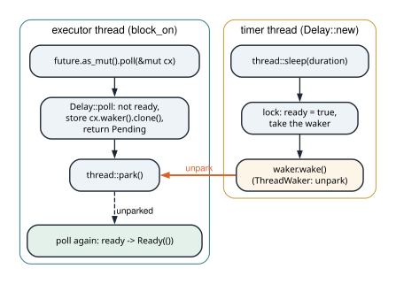
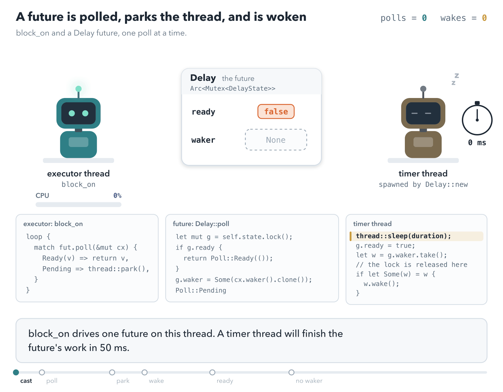
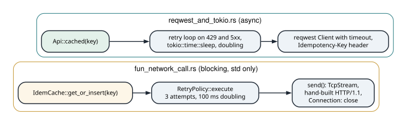

# Async Rust from the executor up

<div class="covers" markdown="1">

This chapter covers

- What `Future::poll`, `Poll::Pending`, and a `Waker` promise each other
- `block_on`: an executor in fifteen lines that parks the thread between polls
- Two hand-written futures: one that yields, one that waits on a timer thread
- A task queue where waking a task re-enqueues it
- An `async` block as a state machine, and why `poll` takes `Pin<&mut Self>`
- Two HTTP clients with caching, retries, and idempotency keys: one blocking over `TcpStream`, one on Tokio and `reqwest`

</div>

Any serious use of Tokio raises the question of what `.await` does. The short answer: it calls `poll` on a
future. If the future is not ready, control returns to whoever called it, after arranging to be called
again. The long answer is a runtime, and this chapter builds a small one so that the short answer has
something concrete behind it. It then uses a real runtime for the job runtimes exist for: talking to a
server over the network while retrying failures safely.

## 18.1 The contract

A `Future` has one method:

```rust
fn poll(self: Pin<&mut Self>, cx: &mut Context<'_>) -> Poll<Self::Output>;
```

It returns `Poll::Ready(value)` when done or `Poll::Pending` when not. `Pending` comes with an obligation:
before returning it, the future must make sure that `cx.waker()` will be called when progress is
possible. The executor's side of the contract is to poll again after a wake, and not to busy-loop
otherwise. Everything in this chapter is one side or the other of that agreement.

A runtime exists to avoid one thread per task. A thread is given a stack, and a default stack is measured in
megabytes. Ten thousand idle connections held as threads would reserve gigabytes before doing any work. A
suspended future is a state machine, and it holds only the variables alive at its suspension points. Ten
thousand parked connections cost kilobytes each instead. The work must then be written as a state machine,
and `async` is the notation for writing one that still looks like ordinary code.

<div class="callout warning" markdown="1">

**WARNING** The two halves of the contract fail in different ways, and only one is easy to debug. Polling a
future that is not ready is always safe. It returns `Pending` again, so a spurious wake and an early return
from `park` do no harm. Forgetting to arrange a wake is not safe. The task returns `Pending`, nothing calls
its waker, and the task never runs again. There is no crash and no error message. That one task stops making
progress. When an async program hangs with no visible reason, look first for a waker that was dropped
instead of called.

</div>

<p class="listing"><b>Listing 18.1</b> <code>block_on</code>, two futures, and a task executor, with no runtime dependency. <a href="https://github.com/arpanpathak/cracking-the-systems-programming-interview/blob/prep-v2/rust-interview-lab/src/problems/async_mini.rs">src/problems/async_mini.rs</a></p>

```rust
{{#include ../../rust-interview-lab/src/problems/async_mini.rs}}
```

## 18.2 `block_on`

`block_on` drives one future to completion on the calling thread:

1. `Box::pin(future)` moves the future to the heap and pins it there, so its address will not change
   between polls (section 18.5 explains why).
2. The waker is built from a `ThreadWaker` holding a handle to the current thread. `Waker::from(Arc<W>)`
   works for any `W: Wake`, the safe way to build a waker without writing a raw vtable.
3. The loop polls. On `Ready` it returns the value. On `Pending` it calls `thread::park()`, which sleeps
   until some other code calls `unpark` on this thread, which is exactly what `ThreadWaker::wake` does.

The comment on the `Pending` arm notes that `park` may return spuriously. The loop tolerates it by polling
again: an extra poll of a future that is not ready returns `Pending` a second time. The
contract makes spurious polls safe and missing wakes fatal. `park`/`unpark` also has a property the loop
needs when the wake arrives *before* the park. `unpark` leaves a token, and the next `park` returns at once.

## 18.3 Two futures by hand

**`YieldTimes`** returns `Pending` a set number of times before it completes, and each time it calls
`context.waker().wake_by_ref()` first. It asks to be polled again immediately, which is what
`tokio::task::yield_now` does. Its value is the number of times it yielded, so a test can check that the
executor really suspended and resumed it. The comment in `poll` spells out the contract: an executor that
ignored the wake would hang.

`YieldTimes` contains two `usize`s, so it is `Unpin`, and `self.get_mut()` turns `Pin<&mut Self>` into
`&mut Self` without `unsafe`.

**`Delay`** completes after a wall-clock duration, and it shows the real pattern for I/O. Its state is
`ready` and an optional stored `Waker`, shared with a background thread through `Arc<Mutex<_>>`. `poll`
checks `ready`; if not, it stores a clone of the current waker and returns `Pending`. The thread sleeps,
sets `ready`, takes the waker, releases the lock, and wakes it. Figure 18.1 shows the exchange.

<figure>

<figcaption><b>Figure 18.1</b> One <code>Delay</code> from start to finish. The executor thread sleeps in <code>park</code>, not in <code>poll</code>.</figcaption>
</figure>

Two details make it correct. `poll` stores the waker on *every* `Pending`, not only the first. A
future may be polled with a different waker each time, as when a runtime moves the task between
threads. Only the latest waker is guaranteed to reach the current owner. The second detail is the order
in the timer thread: it calls `wake()` *after* dropping the lock. The woken executor therefore does not
immediately block on the mutex the waker is still holding.

A real runtime replaces "a thread per timer" with one timer wheel. It replaces the thread for I/O with the
epoll loop from chapter 16. The reactor stores wakers by file descriptor, and wakes them when `epoll_wait`
reports the descriptor ready.

<figure class="anim">

<figcaption><b>Animation 18.1</b> One future from first poll to <code>Ready</code>, matching the exchange in figure 18.1. Polling returns <code>Pending</code> as long as the work is not done, and each <code>Pending</code> stores the waker. The executor then parks, which costs no CPU, and the waker is the only thing that can schedule the next poll. This is why an executor that ignored the waker would hang forever rather than spin.</figcaption>
</figure>


## 18.4 An executor with a task queue

`block_on` runs one future. `MiniExecutor` runs many, and it shows how waking and scheduling are the same
operation.

A `Task` holds its future as `Mutex<Pin<Box<dyn Future<Output = ()> + Send>>>`, a handle to the executor's
queue, and a `completed` flag. `Task` implements `Wake`, and waking it pushes an `Arc` of the task back on
the queue: to wake a task is to schedule it. `spawn` wraps a future in a task and enqueues it. `run` pops
tasks one at a time, builds a waker from the task itself, and polls it. A `Ready` result marks the task
completed, so a stale wake that arrives later is skipped by the `completed` check.

`run` returns when the queue is empty. Its doc comment says why that is the right behavior for this
executor. A task that returned `Pending` without waking itself is waiting on something outside the
executor. A runtime with timers or I/O would park on its event source at that point instead of
returning.

The `+ Send` bound on spawned futures is there because the task, and so the future inside it, is reachable
from a `Waker`. Wakers may be sent to other threads, as `Delay` does. This is the same bound that
`tokio::spawn` imposes. It is also why holding a `std::sync::MutexGuard` or an `Rc` across an `.await` in a
spawned task is a compile error.

`async_demo` exercises all of it:

<p class="listing"><b>Listing 18.2</b> The runtime in use. <a href="https://github.com/arpanpathak/cracking-the-systems-programming-interview/blob/prep-v2/rust-interview-lab/src/bin/async_demo.rs">src/bin/async_demo.rs</a></p>

```rust
{{#include ../../rust-interview-lab/src/bin/async_demo.rs}}
```

```text
== block_on drives a hand-written future ==
YieldTimes suspended and resumed 3 time(s)

== block_on drives an async block ==
async block finished with 3

== block_on parks the thread until the waker fires ==
Delay completed after 53.370994ms

== MiniExecutor runs independent tasks ==
task 1 completed after 1 yield(s)
task 2 completed after 2 yield(s)
task 3 completed after 3 yield(s)
3 task(s) completed
```

The tasks finish in order 1, 2, 3 because each yield sends a task to the back of the queue. The
tasks take turns: a round-robin scheduler, as in chapter 11, with a yield as the end of a time slice.

## 18.5 What `async` compiles to, and why `Pin`

The async block in `main` is:

```rust
async {
    let first = YieldTimes::new(1).await;
    let second = YieldTimes::new(2).await;
    first + second
}
```

The compiler turns it into an anonymous type that implements `Future`. That type is an enum with one
variant per suspension point. Each variant holds the variables that are alive across that point
(figure 18.2). Polling it runs the code up to the next `.await` whose inner future returns `Pending`, saves
the state, and returns `Pending` too.

<figure>

<figcaption><b>Figure 18.2</b> The state machine behind the async block. The value <code>first</code> survives the second <code>.await</code>, so it is stored in the second state.</figcaption>
</figure>

A state can hold a reference to another field of the same state machine. One example is a borrow of a local
buffer that is still in use across an `.await`. If the state machine moved in memory after such a borrow
was created, the reference would point at the old location. `Pin<&mut Self>` is the promise that the
value will not move again after the first poll. That is why `block_on` pins the future before polling it,
and why `MiniExecutor` stores `Pin<Box<...>>`. Types without self-references, such as `YieldTimes`, are
`Unpin`, and for them pinning imposes nothing.

## 18.6 Two HTTP clients with retries and caching

The last three programs apply chapter 15's reliability patterns to real HTTP calls. One uses nothing but
the standard library, and one uses Tokio and `reqwest`. Both send `POST /post` with a JSON body to
`httpbin.org`, a public echo service, under the key `create-demo-001`. Figure 18.3 compares their layering.

<figure>

<figcaption><b>Figure 18.3</b> The same three layers in both clients: cache, retry, transport.</figcaption>
</figure>

### 18.6.1 A blocking client over `TcpStream`

<p class="listing"><b>Listing 18.3</b> Cache, retry, and a hand-written HTTP/1.1 request. <a href="https://github.com/arpanpathak/cracking-the-systems-programming-interview/blob/prep-v2/rust-interview-lab/src/bin/fun_network_call.rs">src/bin/fun_network_call.rs</a></p>

```rust
{{#include ../../rust-interview-lab/src/bin/fun_network_call.rs}}
```

The design is three layers composed in one line:

```rust
self.cache.get_or_insert(key, || self.retry.execute(|| self.send(req)))
```

`IdemCache` is chapter 15's idempotency store under another name. `RetryPolicy::execute` retries any error
with a doubling delay, `base × 2^(attempt - 1)`, capped at `max_delay`. `RequestType` is an enum whose
variants carry exactly the fields each method needs. Then `send` flattens it with one `match` into a tuple
of method, path, headers, and optional body.

`send` writes the request by hand: request line, `Host`, `Connection: close`, the caller's headers,
`Content-Length` when there is a body, a blank line, the body. `Connection: close` lets
`read_to_string` work as the response reader. The server closes the connection after its response, so
reading to end-of-file reads exactly one response. Chapter 17's parser is the other side of this
conversation.

Two gaps separate it from a client you would ship, and both are visible in the code:

- **The status code is never read.** `send` returns whatever follows the first blank line. A `500` with
  an error page is returned as success, cached under the idempotency key, and never retried. Only
  transport errors (connect, write, read) reach the retry loop.
- **Everything is retried.** A retry policy should consult the error, as `Retryable` does in chapter 15.
  Here a DNS failure for a misspelled host is retried three times.

The `RequestHeader` alias and the `OPTION` variant are declared but not used.

### 18.6.2 An async client with `reqwest`

<p class="listing"><b>Listing 18.4</b> The same layers on Tokio. <a href="https://github.com/arpanpathak/cracking-the-systems-programming-interview/blob/prep-v2/rust-interview-lab/src/bin/reqwest_and_tokio.rs">src/bin/reqwest_and_tokio.rs</a></p>

```rust
{{#include ../../rust-interview-lab/src/bin/reqwest_and_tokio.rs}}
```

This client reads the status code and makes retry a decision about it. `RETRY` lists the statuses to
retry: 429 and four 5xx codes. The `match` on `status` then has three arms with guards. Success stores and
returns. A retryable status with attempts left sleeps with `tokio::time::sleep(delay).await` and doubles
the delay. Anything else returns an error that includes the status, the attempt count, and the
response body.

`tokio::time::sleep` does not block the thread. It returns a future that registers with Tokio's timer and
returns `Pending`, which is the `Delay` of section 18.3 done properly. Other tasks then run on the same
thread while this one waits.

Several choices in this client are deliberate:

- `Client::builder().timeout(cfg.timeout)` bounds every request. A client without a timeout can wait
  forever on a server that accepted the connection and never answered.
- The request carries `Idempotency-Key: create-demo-001`, so a server that honors the header can safely
  deduplicate the retried `POST`. The client-side cache gives the same guarantee within one process.
- The cache is a `std::sync::Mutex`, which is fine in async code because the guard is never held across an
  `.await`. `cached` and `store` lock, act, and return. The lock is taken with
  `unwrap_or_else(|e| e.into_inner())`, chapter 12's "ignore the poison" choice. That is safe here because
  a `HashMap` insert cannot leave the map half-updated.
- `type Error = Box<dyn std::error::Error + Send + Sync>` so errors can cross task boundaries.

Compared with chapter 15's `retry`, this loop has no jitter and ignores `Retry-After`. Transport errors
from `send().await?` are not retried at all, which is the opposite gap from the blocking client. Merging
the two means retrying transport errors and retryable statuses with a policy that asks the error. That is
the exercise the two files set up.

### 18.6.3 A new project, started

<p class="listing"><b>Listing 18.5</b> A fresh Tokio project, not yet written. <a href="https://github.com/arpanpathak/cracking-the-systems-programming-interview/tree/prep-v2/rust-async-http-examples">rust-async-http-examples/</a></p>

```toml
{{#include ../../rust-async-http-examples/Cargo.toml}}
```

```rust
{{#include ../../rust-async-http-examples/src/main.rs}}
```

The repository's newest crate is `cargo new` output with Tokio added as a dependency. A natural first
program for it is the client from section 18.6.2 as a library. The retry and cache layers go in `lib.rs`.
Its tests can then run against a local server such as chapter 17's, instead of a public one.

## 18.7 Questions that come up

**"What happens when a future returns `Pending`?"**
It has arranged for its waker to be called when it can make progress. The executor stops polling it and
runs other tasks. When the waker fires, the executor polls it again.

**"Why does `poll` take `Pin<&mut Self>`?"**
Async state machines can hold references into themselves across `.await` points. Pinning guarantees the
value will not move after it has been polled, so those references stay valid.

**"Why must spawned futures be `Send` in Tokio?"**
The multi-threaded runtime may resume a task on a different worker thread after any `.await`. Everything
the task holds across an `.await` must therefore be safe to move between threads.

**"Can you call blocking code inside async?"**
Only briefly. A blocking call holds the worker thread, and every task scheduled on it waits. Use
`tokio::task::spawn_blocking` for blocking work, and async versions of I/O and sleep.

**"Is a `std::sync::Mutex` allowed in async code?"**
Yes, if the guard is dropped before the next `.await`. Holding it across an `.await` can deadlock or block
the worker; use `tokio::sync::Mutex` when the lock must be held across one.

<div class="summary" markdown="1">

## Summary

- `poll` returns `Ready` or `Pending`. `Pending` is a promise that the waker will be called when progress
  becomes possible.
- `block_on` is an executor in fifteen lines: poll, park on `Pending`, then poll again when the wake
  arrives. Spurious wakes are harmless; missing wakes are not.
- `YieldTimes` and `Delay` are the two shapes of a future. One re-arms itself and asks to be polled again.
  The other waits on an event outside the executor, and keeps the waker of whoever is waiting for it.
- Waking a task and scheduling it are the same operation. `Task` implements `Wake`, and `wake` puts the
  task back on the queue.
- An `async` block compiles to an enum with one variant per suspension point. Each variant holds the
  variables alive across that point. A variant may borrow from another field of the same enum, so `poll`
  takes `Pin<&mut Self>`. Pinning guarantees the value cannot move after the first poll, so those
  references stay valid.
- A spawned future must be `Send`. A runtime may resume the task on a different worker thread, so nothing
  that is not `Send` may be held across an `.await`.
- The two HTTP clients are the same three layers: cache, retry, and transport. One is blocking over
  `TcpStream`, the other runs on Tokio. Comparing them shows both gaps: the blocking client never reads the
  status code, and the async one never retries a transport error.

</div>

Chapter 19 collects compact implementations of the structures from parts 2 to 6. Each one is the shortest
program that still shows the structure working, and each fits on one screen.
