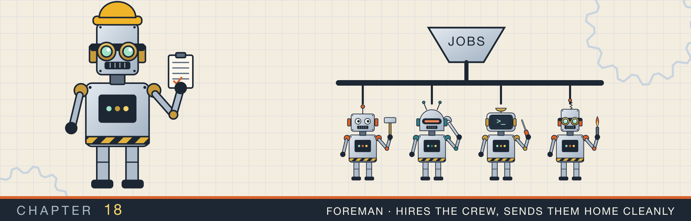
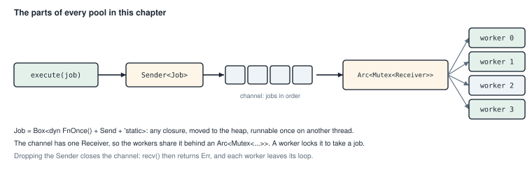
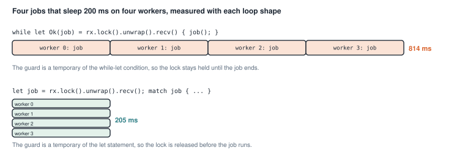
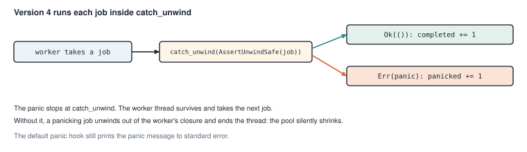
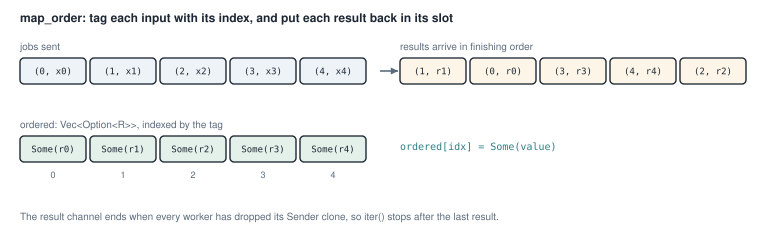

# Thread pools

<div class="covers" markdown="1">

This chapter covers

- A pool of worker threads that take jobs from a shared channel
- A measured bug: a lock held for too long turned four parallel jobs into a sequence
- Returning errors instead of panicking, and shutting down in `Drop`
- Keeping workers alive when a job panics, with `catch_unwind`
- A bounded job queue, results sent back through a channel, and many producers
- A parallel map that returns results in input order

</div>

Starting a thread costs time and memory. The operating system must create it, give it a stack, and schedule it.
For a program that runs thousands of small jobs, starting a thread per job wastes most of its time on starting
threads.

A **thread pool** starts a fixed number of threads once, and reuses them. The threads are called **workers**. Each
worker waits for a job, runs it, and waits for the next. Jobs wait in a queue until a worker is free. This is the
queue of chapter 17, with the consumers built in.

This chapter builds the pool several times. Each version fixes a problem found in the one before, so read them in
order.

## 18.1 The parts of a pool

Every pool here has the same parts (figure 18.1).

<figure>

<figcaption><b>Figure 18.1</b> A job travels from <code>execute</code>, through a channel, to whichever worker takes it first.</figcaption>
</figure>

**The job type.** A job is any closure that the pool can run once on another thread:

```rust
type Job = Box<dyn FnOnce() + Send + 'static>;
```

Each closure has its own unnamed type, so a queue cannot hold them directly. `Box<dyn FnOnce()>` puts each closure
on the heap behind a pointer of one common type. `dyn FnOnce()` means "some type that can be called once with no
arguments". `Send` lets the job move to a worker thread. `'static` means the job borrows nothing that could be
dropped before the job runs.

**The channel.** `std::sync::mpsc::channel()` returns a `Sender` and a `Receiver`. Values sent through the sender
come out of the receiver in the same order. `mpsc` stands for multiple producer, single consumer: the `Sender` can
be cloned, but there is only one `Receiver`.

**The shared receiver.** Every worker needs to take jobs from the one receiver. So the pool wraps it in a `Mutex`,
and shares the mutex through an `Arc`. A worker locks the mutex, calls `recv()` to take the next job, and runs it.

**Shutdown.** When every `Sender` is dropped, the channel closes. `recv()` then returns `Err` once the remaining
jobs are taken. A worker that sees the `Err` leaves its loop, and the thread ends.

## 18.2 Version 1, and a bug you can measure

Version 1 writes the pool of figure 18.1 directly. `new` starts the workers, `execute` sends a job, and `join`
closes the channel and waits for every worker. Each worker locks the shared receiver to take a job. How long it
keeps that lock decides whether the workers run at the same time.

<p class="listing"><b>Listing 18.1</b> The complete program. <a href="https://github.com/arpanpathak/cracking-the-systems-programming-interview/blob/prep-v2/rust-interview-lab/src/bin/thread_pool.rs">src/bin/thread_pool.rs</a></p>

```rust
{{#include ../../rust-interview-lab/src/bin/thread_pool.rs}}
```

`new` creates the channel and starts `size` workers. Each gets its own clone of the `Arc` around the receiver.
`execute` sends a boxed job. `join` takes `self` by value, drops the sender to close the channel, and waits for
every worker. `main` queues 10,000 jobs that each print a line.

The program prints 10,000 lines and looks correct. It has one bug, in the worker loop:

```rust
while let Ok(job) = rx.lock().unwrap().recv() {
    job();
}
```

`rx.lock().unwrap()` creates a `MutexGuard`. The guard is a temporary value inside the `while let` condition. A
temporary in that position lives until the end of the loop body, so the guard is still alive while `job()` runs.
The worker holds the lock for the whole job, and no other worker can take a job in the meantime.

To see the effect, I ran four jobs that each sleep for 200 ms on four workers. I ran them once with this
loop and once with the loop of version 2. Figure 18.2 shows the result.

<figure>

<figcaption><b>Figure 18.2</b> The same four jobs with each loop shape, release build.</figcaption>
</figure>

With `while let`, the four jobs ran one after another and took 814 ms. With the lock released before the job, they
ran at the same time and took 205 ms. The first pool had four threads but used one at a time.

The same bug has a second effect. If a job panics, the panic happens while the guard is alive, so it poisons the
mutex. When I piped this program's output into `head`, which closes the pipe after five lines, `println!` panicked
inside a job. The other three workers then panicked on `.unwrap()` of the poisoned lock, and `main` panicked when
`send` found no worker left.

## 18.3 Version 2: release the lock before the job

<p class="listing"><b>Listing 18.2</b> The worker loop and <code>execute</code> (lines 23 to 64). <a href="https://github.com/arpanpathak/cracking-the-systems-programming-interview/blob/prep-v2/rust-interview-lab/src/problems/thread_pool_v2.rs">src/problems/thread_pool_v2.rs</a></p>

```rust
{{#include ../../rust-interview-lab/src/problems/thread_pool_v2.rs:10:13}}

impl ThreadPool {
{{#include ../../rust-interview-lab/src/problems/thread_pool_v2.rs:23:64}}
}
```

The fix is one line. `let job = receiver.lock().unwrap().recv();` is a separate statement, and the temporary guard
is dropped at the end of that statement. The lock is released before `match` runs the job.

Version 2 also changes `execute`. It is generic over `F: FnOnce() + Send + 'static`, and does the boxing itself.
Callers write `pool.execute(|| ...)` instead of `pool.execute(Box::new(|| ...))`.

<p class="listing"><b>Listing 18.3</b> The complete file, with tests. <a href="https://github.com/arpanpathak/cracking-the-systems-programming-interview/blob/prep-v2/rust-interview-lab/src/problems/thread_pool_v2.rs">src/problems/thread_pool_v2.rs</a></p>

```rust
{{#include ../../rust-interview-lab/src/problems/thread_pool_v2.rs}}
```

The test `jobs_run_at_the_same_time` checks the fix without measuring time. It uses a `Barrier` for four threads.
A barrier makes each thread that calls `wait()` sleep until four threads have called it, then releases them all.
Four jobs wait on the barrier. They can only get through if four workers run them at the same moment. With
version 1's loop, the first job would hold the lock and wait on the barrier forever.

The test waits for the results with `recv_timeout(Duration::from_secs(5))`, so a broken pool fails the test after
five seconds instead of hanging it.

## 18.4 Version 3: errors, and shutdown on drop

Version 2 still panics in three places: for a size of zero, when `send` fails, and when the lock is poisoned. And
if the caller forgets to call `join`, the pool is dropped without waiting for its jobs. Version 3 fixes both.

<p class="listing"><b>Listing 18.4</b> The error type (lines 16 to 32). <a href="https://github.com/arpanpathak/cracking-the-systems-programming-interview/blob/prep-v2/rust-interview-lab/src/problems/thread_pool_v3.rs">src/problems/thread_pool_v3.rs</a></p>

```rust
{{#include ../../rust-interview-lab/src/problems/thread_pool_v3.rs:8:12}}

{{#include ../../rust-interview-lab/src/problems/thread_pool_v3.rs:16:32}}
```

`PoolError` names the two ways a request can fail. It implements `Display` for a message, and `Error` so callers
can use `?` and `Box<dyn Error>` with it.

<p class="listing"><b>Listing 18.5</b> <code>execute</code>, <code>shutdown</code>, and <code>Drop</code> (lines 61 to 87).</p>

```rust
impl ThreadPool {
    // ...
{{#include ../../rust-interview-lab/src/problems/thread_pool_v3.rs:63:82}}
}

{{#include ../../rust-interview-lab/src/problems/thread_pool_v3.rs:85:89}}
```

The sender is now an `Option<Sender<Job>>`. `shutdown` takes it out with `self.sender.take()`, which leaves `None`
behind, and drops it. `execute` checks for `None` with `.ok_or(PoolError::ShutDown)?`.

`shutdown` takes `&mut self`, not `self`, so that `Drop` can call it. `self.workers.drain(..)` removes the handles
from the vector one at a time and gives each to the loop. A second call finds no sender and no workers, so it does
nothing.

`impl Drop for ThreadPool` calls `shutdown`. When a pool goes out of scope, it closes its channel and waits for
every queued job to finish.

<p class="listing"><b>Listing 18.6</b> The worker loop (lines 91 to 104).</p>

```rust
{{#include ../../rust-interview-lab/src/problems/thread_pool_v3.rs:91:104}}
```

The worker loop is now a named function. It uses `let ... else` to leave quietly if the lock is poisoned, and
drops the guard explicitly before running the job.

<p class="listing"><b>Listing 18.7</b> The complete file, with tests. <a href="https://github.com/arpanpathak/cracking-the-systems-programming-interview/blob/prep-v2/rust-interview-lab/src/problems/thread_pool_v3.rs">src/problems/thread_pool_v3.rs</a></p>

```rust
{{#include ../../rust-interview-lab/src/problems/thread_pool_v3.rs}}
```

The test `dropping_the_pool_finishes_queued_jobs` creates a pool inside a block, queues 50 jobs, and lets the pool
go out of scope at the closing brace. After the block, all 50 jobs must have run.

## 18.5 Version 4: surviving a panicking job

Version 3 has one remaining weakness. If a job panics, the panic unwinds out of `worker_loop` and ends that
worker's thread. The pool now has one worker fewer, and nothing reports it. After enough panics, no worker is left,
and jobs queue up forever.

Version 4 catches the panic (figure 18.3).

<figure>

<figcaption><b>Figure 18.3</b> A job's panic stops at <code>catch_unwind</code>, and the worker lives on.</figcaption>
</figure>

<p class="listing"><b>Listing 18.8</b> The worker loop (lines 150 to 169). <a href="https://github.com/arpanpathak/cracking-the-systems-programming-interview/blob/prep-v2/rust-interview-lab/src/problems/thread_pool_v4.rs">src/problems/thread_pool_v4.rs</a></p>

```rust
{{#include ../../rust-interview-lab/src/problems/thread_pool_v4.rs:11:22}}

{{#include ../../rust-interview-lab/src/problems/thread_pool_v4.rs:150:169}}
```

`panic::catch_unwind(f)` runs `f`. If `f` panics, the unwinding stops at `catch_unwind`, which returns `Err`.
Otherwise it returns `Ok` with `f`'s result.

`catch_unwind` requires the closure to be `UnwindSafe`. The trait marks types that cannot leave broken data
visible after a panic. A boxed `dyn FnOnce` does not have it, because the compiler cannot see what the closure
captured. `AssertUnwindSafe(job)` is a wrapper that declares the closure safe anyway. The comment gives the reason:
the job owns everything it touches, and this loop never looks at its partial state.

Each outcome increments one of two atomic counters, `completed` or `panicked`.

<p class="listing"><b>Listing 18.9</b> Named workers (lines 73 to 105).</p>

```rust
impl ThreadPool {
{{#include ../../rust-interview-lab/src/problems/thread_pool_v4.rs:73:105}}
    // ...
}
```

`thread::Builder` configures a thread before starting it. Here it gives each worker a name, `pool-worker-0` and so
on, which appears in panic messages and debuggers. `Builder::spawn` returns a `Result`, because the operating system
can refuse to create a thread. `thread::spawn` panics in that case.

The pool is built before the workers are started. If starting the third worker fails, `return Err(...)` drops the
half-built `pool`. Its `Drop` closes the channel and joins the two workers that did start, so no thread is left
running.

<p class="listing"><b>Listing 18.10</b> <code>shutdown</code> and the report (lines 113 to 136).</p>

```rust
impl ThreadPool {
    // ...
{{#include ../../rust-interview-lab/src/problems/thread_pool_v4.rs:119:141}}
}

{{#include ../../rust-interview-lab/src/problems/thread_pool_v4.rs:144:148}}
```

`shutdown` takes `self` by value and returns a `Report` with the two counts. The work is in `close_and_join`, which
`Drop` also calls. When `shutdown` returns, `self` is dropped, and `Drop` runs `close_and_join` a second time. The
second call finds nothing left to do.

<p class="listing"><b>Listing 18.11</b> The complete file, with tests. <a href="https://github.com/arpanpathak/cracking-the-systems-programming-interview/blob/prep-v2/rust-interview-lab/src/problems/thread_pool_v4.rs">src/problems/thread_pool_v4.rs</a></p>

```rust
{{#include ../../rust-interview-lab/src/problems/thread_pool_v4.rs}}
```

The test `a_panicking_job_does_not_kill_its_worker` uses a pool with one worker. The first job panics. If that
killed the worker, the second job would never run, and `recv_timeout` would fail after five seconds.

The test `spawn_errors_expose_their_source` checks the `source` method. `Error::source` returns the lower-level
error that caused this one, so a caller can print the whole chain.

```text
$ cargo test --lib problems::thread_pool
running 12 tests
test problems::thread_pool_v3::tests::zero_workers_is_an_error ... ok
test problems::thread_pool_v3::tests::errors_render_a_message ... ok
test problems::thread_pool_v2::tests::zero_workers_is_rejected - should panic ... ok
test problems::thread_pool_v3::tests::execute_after_shutdown_is_an_error ... ok
test problems::thread_pool_v3::tests::dropping_the_pool_finishes_queued_jobs ... ok
test problems::thread_pool_v2::tests::runs_every_job ... ok
test problems::thread_pool_v4::tests::spawn_errors_expose_their_source ... ok
test problems::thread_pool_v2::tests::jobs_run_at_the_same_time ... ok
test problems::thread_pool_v4::tests::zero_workers_is_an_error ... ok
test problems::thread_pool_v4::tests::reports_completed_jobs ... ok
test problems::thread_pool_v4::tests::a_panicking_job_does_not_kill_its_worker ... ok
test problems::thread_pool_v4::tests::workers_are_named ... ok

test result: ok. 12 passed; 0 failed; 0 ignored; 0 measured; 125 filtered out
```

The filter `problems::thread_pool` matches all three versions. `cargo test` hides what passing tests print,
including the message of the job that panics on purpose. Add `-- --nocapture` to see it. The message names the
thread, `pool-worker-0`, which shows the thread names at work.

## 18.6 Shorter pools

Three more pools take the lessons of versions 2 and 3 in a more compact form, and each adds one feature.

### 18.6.1 Shutdown in `Drop`, compactly

This pool shuts itself down when it goes out of scope. Its `Drop` closes the channel and joins the workers, so
the caller never calls a shutdown method.

<p class="listing"><b>Listing 18.12</b> The complete program. <a href="https://github.com/arpanpathak/cracking-the-systems-programming-interview/blob/prep-v2/rust-interview-lab/src/bin/thread_pool_bruce_lee.rs">src/bin/thread_pool_bruce_lee.rs</a></p>

```rust
{{#include ../../rust-interview-lab/src/bin/thread_pool_bruce_lee.rs}}
```

This pool keeps version 2's worker loop and version 3's `Option` sender and `Drop`. `self.job_sender = None`
drops the sender by overwriting it. `thread::spawn(move || loop { ... })` passes a closure whose whole body is the
`loop`.

`main` has no explicit shutdown. The pool is dropped at the end of `main`, and `Drop` waits for all eight jobs.

```text
$ cargo run --bin thread_pool_bruce_lee
task 0 on ThreadId(4)
task 4 on ThreadId(4)
task 5 on ThreadId(4)
task 6 on ThreadId(4)
task 7 on ThreadId(4)
task 1 on ThreadId(3)
task 2 on ThreadId(2)
task 3 on ThreadId(5)
```

In this run, one worker took five of the eight jobs. Printing a line is so quick that the first worker to wake
could take the next job before the others were scheduled. The pool does not promise an even split.

`Drop` calls `worker.join().unwrap()`. If a job panicked, its worker's `join` returns `Err`, and the `unwrap` panics
inside `Drop`. The later versions use `let _ = worker.join();` instead.

### 18.6.2 A bounded queue and results

This pool adds two features. The queue has a fixed size, so a caller that submits jobs faster than the workers
run them has to wait. And each job's return value comes back to the caller.

<p class="listing"><b>Listing 18.13</b> The complete program. <a href="https://github.com/arpanpathak/cracking-the-systems-programming-interview/blob/prep-v2/rust-interview-lab/src/bin/thread_pool_with_back_pressure.rs">src/bin/thread_pool_with_back_pressure.rs</a></p>

```rust
{{#include ../../rust-interview-lab/src/bin/thread_pool_with_back_pressure.rs}}
```

The comments marked `changed` and `new` show the two additions.

`mpsc::sync_channel(queue_size)` creates a channel that holds at most `queue_size` messages. `SyncSender::send`
blocks while the channel is full. This is the backpressure of section 17.1, built into the standard library's channel. A caller that queues
jobs faster than the workers run them has to wait.

`submit` returns a result. It creates a new channel for each job, and the job sends its return value into it. The
caller gets the `Receiver` back at once, and calls `recv()` when it needs the value. A value that will be ready
later is often called a **future**, and chapter 22 builds on that idea.

```text
$ cargo run --bin thread_pool_with_back_pressure
0
1
4
9
16
25
36
49
```

The results print in order because `main` calls `recv()` on the receivers in order, even though the jobs may finish
in any order.

### 18.6.3 Many producers

In this pool, several threads submit jobs at the same time, each through its own clone of the `Sender`. The
worker loop also handles a poisoned lock and a closed channel separately.

<p class="listing"><b>Listing 18.14</b> The complete program. <a href="https://github.com/arpanpathak/cracking-the-systems-programming-interview/blob/prep-v2/rust-interview-lab/src/bin/mpmc_thread_pool_engine.rs">src/bin/mpmc_thread_pool_engine.rs</a></p>

```rust
{{#include ../../rust-interview-lab/src/bin/mpmc_thread_pool_engine.rs}}
```

This pool's worker loop is the clearest of the chapter:

```rust
let Ok(receiver) = rx.lock() else { break }; // mutex poisoned
let Ok(job) = receiver.recv() else { break }; // channel closed
drop(receiver); // release lock before running the job
job();
```

Each `let ... else` line handles one failure and says which. The lock is released explicitly before the job runs.

`execute` returns `Result<(), SendError<Job>>`. When the pool is shut down, it returns the job inside the error,
so the caller can still run it or report it.

`main` shares the pool between three producer threads with an `Arc`. Each producer queues five jobs. When the last
`Arc` is dropped at the end of `main`, `Drop` runs and waits for every queued job.

```text
$ cargo run --bin mpmc_thread_pool_engine
producer 0, job 0
producer 0, job 3
producer 0, job 4
producer 1, job 1
producer 1, job 2
producer 0, job 1
producer 1, job 4
producer 2, job 0
producer 2, job 1
producer 2, job 2
producer 0, job 2
producer 2, job 4
producer 2, job 3
producer 1, job 3
producer 1, job 0
```

All 15 jobs ran. The order is mixed, even within one producer, because four workers run the jobs at the same time.

## 18.7 A parallel map that keeps order

The last pool is a single function. `map_order` applies a function to every input on several threads, and returns
the results in the same order as the inputs.

The difficulty is that jobs finish in any order. The fix is to tag each input with its position, and use the tag
to put each result back in place (figure 18.4).

<figure>

<figcaption><b>Figure 18.4</b> The index travels with the job, and puts the result back in its slot.</figcaption>
</figure>

<p class="listing"><b>Listing 18.15</b> The complete file, with tests. <a href="https://github.com/arpanpathak/cracking-the-systems-programming-interview/blob/prep-v2/rust-interview-lab/src/problems/worker_pool.rs">src/problems/worker_pool.rs</a></p>

```rust
{{#include ../../rust-interview-lab/src/problems/worker_pool.rs}}
```

The function uses two channels. Jobs go out as `(usize, T)` pairs, and results come back as `(usize, R)` pairs.

`mapper` is shared by all workers, so it goes in an `Arc`, and it must be `Sync` as well as `Send`. It has type
`F: Fn(T) -> R`, not `FnOnce`, because each worker calls it many times.

The worker loop takes the job inside a block: `let job = { let guard = ...; guard.recv() };`. The guard is dropped
at the end of the block, so the lock is released before `mapper` runs. This is the third way in this chapter to
write the same fix.

After sending every job, the function drops its own `job_tx` so that the workers stop when the queue is empty. It
also drops its own `result_tx`. Only the workers' clones remain, and `result_rx.iter()` ends when the last worker
exits and drops its clone.

Each result is stored at its index in `ordered`, a `Vec<Option<R>>`, which grows as needed with `resize_with`. At
the end, every slot must hold `Some`, and the options are unwrapped into the final `Vec<R>`.

```text
$ cargo test --lib problems::worker_pool
running 2 tests
test problems::worker_pool::tests::one_worker_works ... ok
test problems::worker_pool::tests::maps_all_inputs_and_preserves_order ... ok

test result: ok. 2 passed; 0 failed; 0 ignored; 0 measured; 135 filtered out
```

## 18.8 The versions compared

<p class="listing"><b>Table 18.1</b> What each pool handles</p>

| Pool | Jobs run in parallel | Shutdown | Poisoned lock | Panicking job | Queue |
|---|---|---|---|---|---|
| v1 `thread_pool.rs` | no: lock held during job | `join(self)` | panics | poisons the lock | unbounded |
| v2 `thread_pool_v2.rs` | yes | `join(self)` | panics | kills the worker | unbounded |
| v3 `thread_pool_v3.rs` | yes | `Drop` | worker exits | kills the worker | unbounded |
| v4 `thread_pool_v4.rs` | yes | `Drop`, `Report` | worker exits | caught and counted | unbounded |
| `thread_pool_bruce_lee.rs` | yes | `Drop` | panics | kills the worker | unbounded |
| `thread_pool_with_back_pressure.rs` | yes | `Drop` | panics | kills the worker | bounded |
| `mpmc_thread_pool_engine.rs` | yes | `Drop` | worker exits | kills the worker | bounded |

<div class="summary" markdown="1">

## Summary

- A thread pool reuses a fixed set of worker threads. Jobs are boxed closures, `Box<dyn FnOnce() + Send +
  'static>`, sent through a channel whose receiver the workers share behind `Arc<Mutex<_>>`.
- In `while let Ok(job) = rx.lock().unwrap().recv()`, the guard lives through the loop body. The workers ran one at
  a time: 814 ms instead of 205 ms for four 200 ms jobs.
- Release the lock before running the job: take it in its own `let` statement, in a block, or with `drop(guard)`.
- Dropping the sender closes the channel. Workers drain the queue, see `Err` from `recv`, and exit. Doing this in
  `Drop` makes a pool finish its jobs when it goes out of scope.
- `catch_unwind` with `AssertUnwindSafe` keeps a worker alive when its job panics.
- `sync_channel` bounds the queue and adds backpressure. A per-job channel carries a result back to the caller.
- Tagging each job with its index returns parallel results in input order.

</div>

Chapter 19 turns to failures between programs: limiting request rates, retrying failed calls, and making repeated
requests safe.

## Exercises

1. Add a test to `thread_pool_v2.rs` that measures four jobs sleeping 200 ms each, and asserts that they finish in
   under 400 ms.
2. Add `submit` from listing 18.13 to version 4, returning the job's result through a channel.
3. Make version 4's queue bounded with `sync_channel`, and add a `try_execute` method that returns the job instead
   of blocking when the queue is full.
4. Write `map_order` so that it returns `Result<Vec<R>, E>` for a mapper of type `Fn(T) -> Result<R, E>`, and stops
   sending jobs after the first error.
