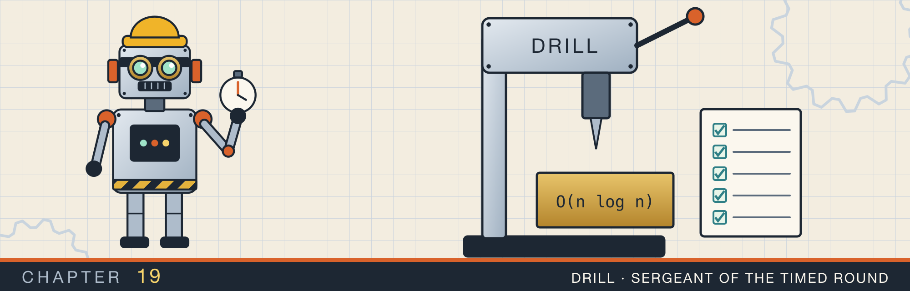
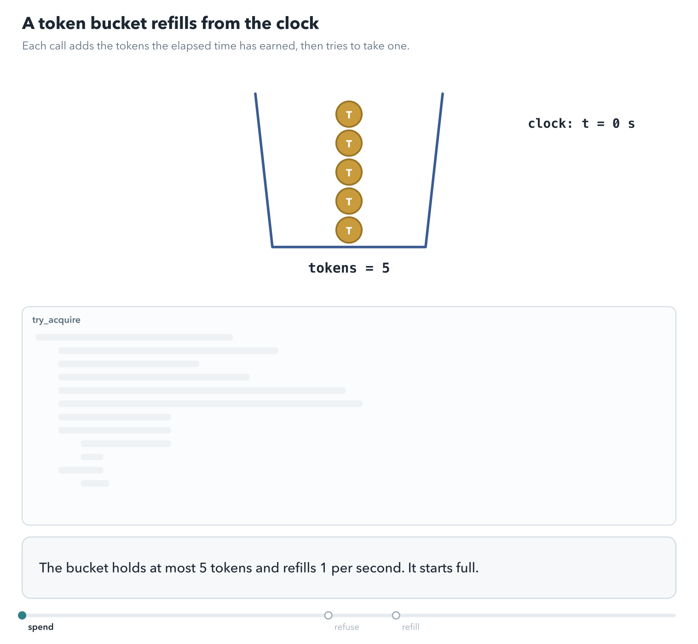
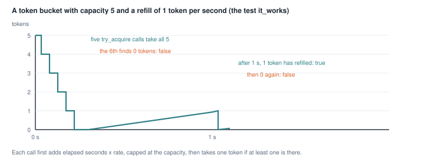
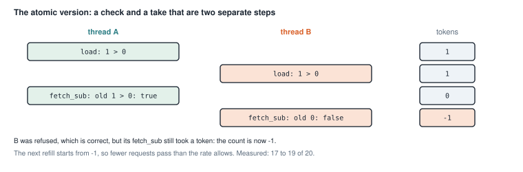
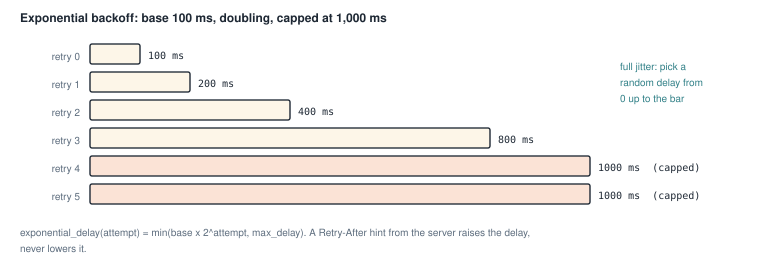
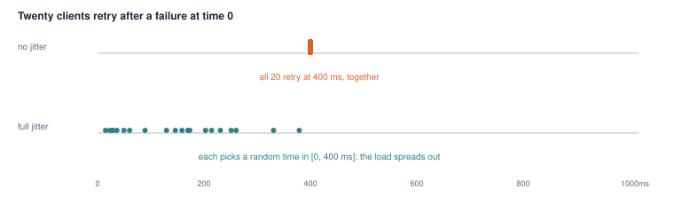
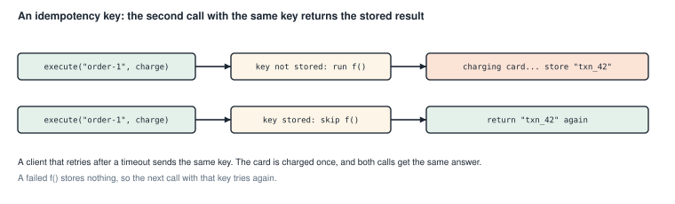

# Rate limits, retries, and idempotency

<div class="covers" markdown="1">

This chapter covers

- A token bucket that limits how often something may happen, with a lock and with atomics
- A measured flaw in the atomic version, and where it comes from
- Retrying failed calls with exponential backoff, jitter, and the server's `Retry-After`
- Deciding which errors to retry, with a trait
- Making a repeated request safe with an idempotency key

</div>

Programs that talk to other programs over a network see failures that local code never sees. A server is busy
and refuses a request. A connection drops halfway. A reply takes so long that the client gives up, without
knowing whether the server did the work.

This chapter builds three tools for those situations:

- A **rate limiter** protects a service from too many requests, by refusing requests above a set rate.
- A **retry** policy tries a failed call again, waiting longer after each failure.
- An **idempotency key** makes it safe to send the same request twice, by making the second one do nothing new.

The three work together. A client that retries must not overload the server, so it backs off. And a retried
request must not repeat a side effect, such as charging a card twice.

## 19.1 A token bucket

Suppose a service allows each client 5 requests per second. A simple counter that resets every second allows 5
requests at 0.99 s and 5 more at 1.01 s: 10 requests in 20 ms. A **token bucket** smooths this out.

Picture a bucket that holds up to 5 tokens. Every request takes one token out. If the bucket is empty, the request
is refused. Tokens flow back in at a steady rate, say 1 per second, until the bucket is full again (figure 19.1).

<figure class="anim">

<figcaption><b>Animation 19.1</b> The bucket at capacity 5 with a refill of 1 token per second. A full cell is a token in the bucket. A burst spends tokens faster than they arrive, which is allowed up to the capacity; after that a call is refused. When a second passes, one token appears with no timer and no background thread, because the count is worked out from the clock at the start of each call.</figcaption>
</figure>


<figure>

<figcaption><b>Figure 19.1</b> The bucket in the test <code>it_works</code>: capacity 5, refill 1 token per second.</figcaption>
</figure>

Two numbers describe the bucket. The **capacity** is the largest burst allowed at once. The **rate** is the
long-run number of requests per second.

The bucket does not need a timer that adds tokens. Each request computes how many tokens arrived since the last request, from the time that has passed. It
adds them before it checks.

### 19.1.1 The bucket behind a lock

<p class="listing"><b>Listing 19.1</b> The bucket (lines 6 to 31). <a href="https://github.com/arpanpathak/cracking-the-systems-programming-interview/blob/prep-v2/rust-interview-lab/src/problems/rate_limiter.rs">src/problems/rate_limiter.rs</a></p>

```rust
{{#include ../../rust-interview-lab/src/problems/rate_limiter.rs:6:17}}

{{#include ../../rust-interview-lab/src/problems/rate_limiter.rs:20:31}}
```

The capacity and the rate never change, so they are plain fields. The token count and the time of the last refill
change on every call, so they live in `BucketState` behind a `Mutex`. The token count is an `f64`, because a
fraction of a token can arrive between two requests. The bucket starts full.

`Instant` is the standard library's clock for measuring durations. It only moves forward, unlike the wall-clock
time, which can jump when the system clock is corrected.

<p class="listing"><b>Listing 19.2</b> <code>try_acquire</code> (lines 33 to 50).</p>

```rust
{{#include ../../rust-interview-lab/src/problems/rate_limiter.rs:33:50}}
```

`try_acquire` does all its work under the lock:

1. It computes the time since the last refill, `now - s.last_refill`, a `Duration`.
2. It converts that to seconds and multiplies by the rate: the number of new tokens.
3. It adds them and caps the total at the capacity with `.min(self.capacity)`.
4. It records `now` as the last refill.
5. If at least one token is there, it takes it and returns `true`. Otherwise it returns `false`.

Work through the test by hand. The bucket starts with 5 tokens. Five calls happen within microseconds, so almost no
tokens refill, and each call takes one. The sixth finds about 0.00001 tokens and returns `false`. After a one-second
sleep, about 1.00001 tokens are there, so one call succeeds, and the next finds about 0.00001 again.

<p class="listing"><b>Listing 19.3</b> The complete file, with its test. <a href="https://github.com/arpanpathak/cracking-the-systems-programming-interview/blob/prep-v2/rust-interview-lab/src/problems/rate_limiter.rs">src/problems/rate_limiter.rs</a></p>

```rust
{{#include ../../rust-interview-lab/src/problems/rate_limiter.rs}}
```

```text
$ cargo test --lib problems::rate_limiter
running 1 test
test problems::rate_limiter::tests::it_works ... ok

test result: ok. 1 passed; 0 failed; 0 ignored; 0 measured; 136 filtered out; finished in 1.00s
```

The test takes one second, because it sleeps to let a token refill. A test that depends on real time can also fail
on a heavily loaded machine. Exercise 1 removes the dependency by passing the time in.

### 19.1.2 The bucket with atomics

Every call to the locked bucket takes the mutex. Under heavy load, threads wait for each other there, as section
14.1 described for maps. The second version replaces the lock with atomic integers.

<p class="listing"><b>Listing 19.4</b> The limiter (lines 5 to 37). <a href="https://github.com/arpanpathak/cracking-the-systems-programming-interview/blob/prep-v2/rust-interview-lab/src/bin/rate_limiter_atomic_token_bucket.rs">src/bin/rate_limiter_atomic_token_bucket.rs</a></p>

```rust
{{#include ../../rust-interview-lab/src/bin/rate_limiter_atomic_token_bucket.rs:5:12}}

{{#include ../../rust-interview-lab/src/bin/rate_limiter_atomic_token_bucket.rs:15:37}}
```

The design differs from the locked version in three ways:

- Tokens are whole numbers in an `AtomicI64`, and time is whole seconds since the limiter was created. Tokens
  arrive in steps, once per second, instead of continuously.
- `last_refilled_at.fetch_max(now, Relaxed)` records the current second and returns the previous value, in one
  atomic step. If several threads start a new second at once, only the first sees an older value, so only that
  thread adds tokens.
- `#[repr(align(64))]` gives the limiter its own cache lines, so it does not share a line with a neighbor, as
  section 15.4 described.

Then comes the check. If the count is 0 or less, the call returns `false`. Otherwise it takes a token with
`fetch_sub(1)`, and returns `true` if the count before the subtraction was positive.

<p class="listing"><b>Listing 19.5</b> The complete program. <a href="https://github.com/arpanpathak/cracking-the-systems-programming-interview/blob/prep-v2/rust-interview-lab/src/bin/rate_limiter_atomic_token_bucket.rs">src/bin/rate_limiter_atomic_token_bucket.rs</a></p>

```rust
{{#include ../../rust-interview-lab/src/bin/rate_limiter_atomic_token_bucket.rs}}
```

```text
$ cargo run --bin rate_limiter_atomic_token_bucket
request 1: true
request 2: true
request 3: true
request 4: true
request 5: true
request 6: false
request 1: true
request 2: true
request 3: true
request 4: true
request 5: true
request 6: false
```

With one thread, the output is exactly right: 5 requests pass, the sixth fails, and after a second 5 more pass.

### 19.1.3 What happens with many threads

Each atomic operation is safe on its own. The problem is that `try_acquire` makes several of them, and other threads
can act between them. Figure 19.2 shows one interleaving with one token left.

<figure>

<figcaption><b>Figure 19.2</b> Both threads pass the check before either takes the token.</figcaption>
</figure>

B is correctly refused, but its `fetch_sub` still ran. The count drops below zero, and the next refill starts from
there, so the limiter lets through fewer requests than its rate. To measure this, I ran 8 threads calling
`try_acquire` in a loop for 3.5 seconds, on a limiter with capacity 5 and rate 5. A correct limiter admits 20
requests: 5 at the start and 5 in each of the next three seconds. Three runs admitted 18, 19, and 17, and ended
with the count at 0, −1, and −1.

A second gap goes the other way. The refill is a `fetch_add` followed by a separate `fetch_min`. Between the two,
the count can be above the capacity, and other threads can take the extra tokens before the cap is applied. That
would let through more than the capacity in one burst. My runs did not catch this window, but nothing in the code
prevents it.

Both gaps close if the check, the take, and the refill happen as one atomic step. `compare_exchange` in a loop does that. It reads the count, computes the new count, and writes it only if
no other thread changed the count in between.
Exercise 2 asks you to write it.

## 19.2 Retrying failed calls

Many failures are temporary. A server restarts, a network link drops a packet, or a service is briefly overloaded.
Trying again a moment later often works.

Retrying well takes three decisions:

1. **Which errors to retry.** A "not found" error will fail again. A "server busy" error may not.
2. **How long to wait.** Waiting a little longer after each failure gives a struggling server time to recover.
3. **How many times.** At some point, the caller should give up and report the error.

### 19.2.1 Which errors to retry

<p class="listing"><b>Listing 19.6</b> The <code>Retryable</code> trait (lines 21 to 43). <a href="https://github.com/arpanpathak/cracking-the-systems-programming-interview/blob/prep-v2/rust-interview-lab/src/problems/retry.rs">src/problems/retry.rs</a></p>

```rust
{{#include ../../rust-interview-lab/src/problems/retry.rs:21:43}}
```

`Retryable` is a trait that an error type implements to answer the first question. `is_retryable` has no default,
so each error type must decide. `retry_after` has a default body that returns `None`, so an error type only needs
to implement it if the server can send a hint.

The trait is implemented for `ApiError`, the error enum from section 7.7. Its `is_retryable` method returns `true`
for a rate limit and for server errors with a status from 500 to 599. `retry_after` returns the delay carried by a
`RateLimited` error. That delay usually comes from the HTTP header `Retry-After`, which a server sends to say when
to try again.

The line `ApiError::is_retryable(self)` calls the enum's own method, not the trait's. Both have the same name. The
path `ApiError::is_retryable` finds the inherent method first, so the trait method does not call itself forever.

### 19.2.2 How long to wait

A fixed delay has a problem. If a server fails, all its clients fail at the same moment. With a fixed delay they all retry at the same moment too. The server is hit by a wave of retries at the
moment it recovers. This is called a
**thundering herd**.

Two techniques spread the retries out:

- **Exponential backoff** doubles the delay after each failure: 100 ms, 200 ms, 400 ms, and so on, up to a cap
  (figure 19.3). The longer the outage, the less often each client tries.
- **Jitter** adds randomness to the delay, so clients that failed together do not retry together (figure 19.4).
  **Full jitter** picks a random delay between 0 and the backoff.

<figure>

<figcaption><b>Figure 19.3</b> The delays from the test <code>exponential_backoff_doubles_until_capped</code>.</figcaption>
</figure>

<figure>

<figcaption><b>Figure 19.4</b> The same twenty retries, without and with full jitter.</figcaption>
</figure>

<p class="listing"><b>Listing 19.7</b> The policy (lines 45 to 99).</p>

```rust
{{#include ../../rust-interview-lab/src/problems/retry.rs:45:99}}
```

`RetryPolicy` holds the four settings. `max_attempts` counts the first try as well, so 3 means one try and two
retries.

`exponential_delay` computes `base * 2^attempt`, capped at `max_delay`. Three details keep it from overflowing:

- `1u32 << shift` computes 2 to the power `shift` by shifting the bit 1 left. `attempt.min(31)` keeps the shift
  within a `u32`, because shifting by 32 or more is an error.
- `Duration::saturating_mul` returns the largest `Duration` instead of overflowing.
- `.min(self.max_delay)` applies the cap.

`delay_for` applies jitter. It takes a random number in `[0, 1)` as an argument, and multiplies the delay by it
with `Duration::mul_f64`. `clamp(0.0, 1.0)` guards against a random source that returns something out of range.

### 19.2.3 The retry loop

<p class="listing"><b>Listing 19.8</b> <code>retry</code> (lines 101 to 134).</p>

```rust
{{#include ../../rust-interview-lab/src/problems/retry.rs:101:134}}
```

`retry` is generic over four types. `T` and `E` are the success and error types. `F` is the operation, a closure
that receives the attempt number. `R` produces random numbers.

The operation is `FnMut`, not `FnOnce`, because the loop calls it several times, and it may change captured state,
like the test's attempt counter.

On each error, the loop checks two reasons to stop: the attempts are used up, or the error is not retryable. Either
way it returns the last error. Otherwise it computes its own backoff, and then applies the server's hint:

```rust
let delay = error.retry_after().map_or(backoff, |hint| hint.max(backoff));
```

`map_or(default, f)` returns `default` for `None`, and `f(hint)` for `Some(hint)`. So without a hint, the delay is
the backoff. With a hint, it is the larger of the two. The client never retries sooner than the server asked, and
never sooner than its own backoff.

`std::thread::sleep(delay)` blocks the thread for the delay. In async code, chapter 22, the wait would be an async
timer instead, so the thread can do other work.

**Injecting randomness.** The random number comes from the `unit_random` closure the caller passes in. Production
code passes a real random number generator. Tests pass `|| 0.0`, which makes every delay predictable. Passing in a
dependency this way, instead of creating it inside the function, is called **dependency injection**. It makes the
function testable without a real clock or a real random source.

<p class="listing"><b>Listing 19.9</b> The complete file, with tests. <a href="https://github.com/arpanpathak/cracking-the-systems-programming-interview/blob/prep-v2/rust-interview-lab/src/problems/retry.rs">src/problems/retry.rs</a></p>

```rust
{{#include ../../rust-interview-lab/src/problems/retry.rs}}
```

The tests use a policy with zero delays, so they run instantly. `retries_then_succeeds` fails twice with a 503 and
then succeeds: three attempts in total. `non_retryable_errors_return_immediately` returns `NotFound`, and must stop
after one attempt.

```text
$ cargo test --lib problems::retry
running 6 tests
test problems::retry::tests::full_jitter_scales_the_delay ... ok
test problems::retry::tests::exponential_backoff_doubles_until_capped ... ok
test problems::retry::tests::retry_after_is_honored_as_a_floor ... ok
test problems::retry::tests::non_retryable_errors_return_immediately ... ok
test problems::retry::tests::exhausted_policy_returns_the_last_error ... ok
test problems::retry::tests::retries_then_succeeds ... ok

test result: ok. 6 passed; 0 failed; 0 ignored; 0 measured; 131 filtered out
```

## 19.3 Idempotency keys

Retries have a danger. Suppose a client asks a server to charge a card, and the reply is lost. The client cannot
tell whether the charge happened. If it retries, the card may be charged twice.

An operation is **idempotent** if doing it twice has the same effect as doing it once. Reading a record is
idempotent. Charging a card is not, unless the server makes it so.

The usual way is an **idempotency key**. The client picks a unique key for each logical request, such as an order
number, and sends it with every attempt. The server records the result under that key. When the same key arrives
again, the server returns the recorded result and does not repeat the work (figure 19.5).

<figure>

<figcaption><b>Figure 19.5</b> Two calls with one key. The work runs once.</figcaption>
</figure>

<p class="listing"><b>Listing 19.10</b> The complete program. <a href="https://github.com/arpanpathak/cracking-the-systems-programming-interview/blob/prep-v2/rust-interview-lab/src/bin/idempotent_operation.rs">src/bin/idempotent_operation.rs</a></p>

```rust
{{#include ../../rust-interview-lab/src/bin/idempotent_operation.rs}}
```

`Idempotent<K, V>` stores results in a `HashMap` behind a `Mutex`. `execute` takes a key and a closure `f` that does
the work:

1. It locks the store. A poisoned lock becomes an error: `map_err(|_| "lock poisoned")?` turns the `PoisonError`
   into a `&str`, and `?` converts that into a `Box<dyn Error>`.
2. If the key is present, it returns a clone of the stored result.
3. Otherwise it runs `f()`. If `f` fails, `?` returns the error, and nothing is stored, so a later call can try
   again.
4. It stores a clone of the result and returns it.

In `main`, `charge` is called with the same key twice. The closure captures nothing, so it is `Copy`, and passing it
to `execute` twice copies it. The line "charging card..." appears once:

```text
$ cargo run --bin idempotent_operation
charging card...
```

The second file is the same program with a type alias, `type RuntimeError = Box<dyn std::error::Error>;`, which
shortens the signatures:

<p class="listing"><b>Listing 19.11</b> The complete program. <a href="https://github.com/arpanpathak/cracking-the-systems-programming-interview/blob/prep-v2/rust-interview-lab/src/bin/idempotent_operation_with_error_progagation.rs">src/bin/idempotent_operation_with_error_progagation.rs</a></p>

```rust
{{#include ../../rust-interview-lab/src/bin/idempotent_operation_with_error_progagation.rs}}
```

```text
$ cargo run --bin idempotent_operation_with_error_progagation
charging card...
```

Holding the lock while `f()` runs makes the store correct. Two calls with the same key cannot both find it
missing and both run the work. It is also the store's limit. Every call waits for the one lock, even calls with
different keys, so one slow operation delays all others. A production store locks per key instead. It records "in progress" for a key and releases the lock while the work runs. Later callers with that key
wait for the result. A real service also keeps the results in a database, so they survive a restart.

<div class="summary" markdown="1">

## Summary

- A token bucket allows bursts up to its capacity and a long-run rate. Each call adds the tokens earned since the
  last call before it checks.
- The locked bucket is correct and simple. The atomic bucket avoids the lock, but its separate check, take, and
  refill steps let the count go negative. With 8 threads it admitted 17 to 19 requests where 20 were due.
- Retry only errors that can succeed later. A `Retryable` trait lets each error type decide, and carry a server
  hint.
- Exponential backoff with full jitter spreads retries out and prevents a thundering herd. The server's
  `Retry-After` is a floor on the delay.
- Passing randomness in as a closure makes the retry logic testable.
- An idempotency key makes a retried request safe: the server stores the result under the key and returns it for
  every repeat.

</div>

Chapter 20 moves down to the network itself: IP addresses, sockets, and a server that echoes back what it receives.

## Exercises

1. Change `TokenBucket::try_acquire` to take the current time as an argument, `try_acquire_at(&self, now: Instant)`.
   Rewrite the test without `thread::sleep`.
2. Rewrite the atomic limiter's `try_acquire` with a `compare_exchange` loop that refills, checks, and takes a
   token in one atomic step. Run the 8-thread test from section 19.1.3 on it.
3. Add a `max_elapsed: Duration` to `RetryPolicy`, and make `retry` stop when the total time spent would pass it.
4. Change `Idempotent` so that `execute` does not hold the lock while `f` runs. Two calls with the same key
must still run `f` only once. Hint: store an enum with `InProgress` and `Done(V)` states, and a `Condvar`.
