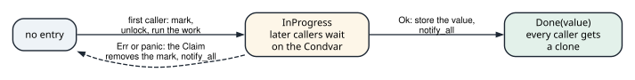
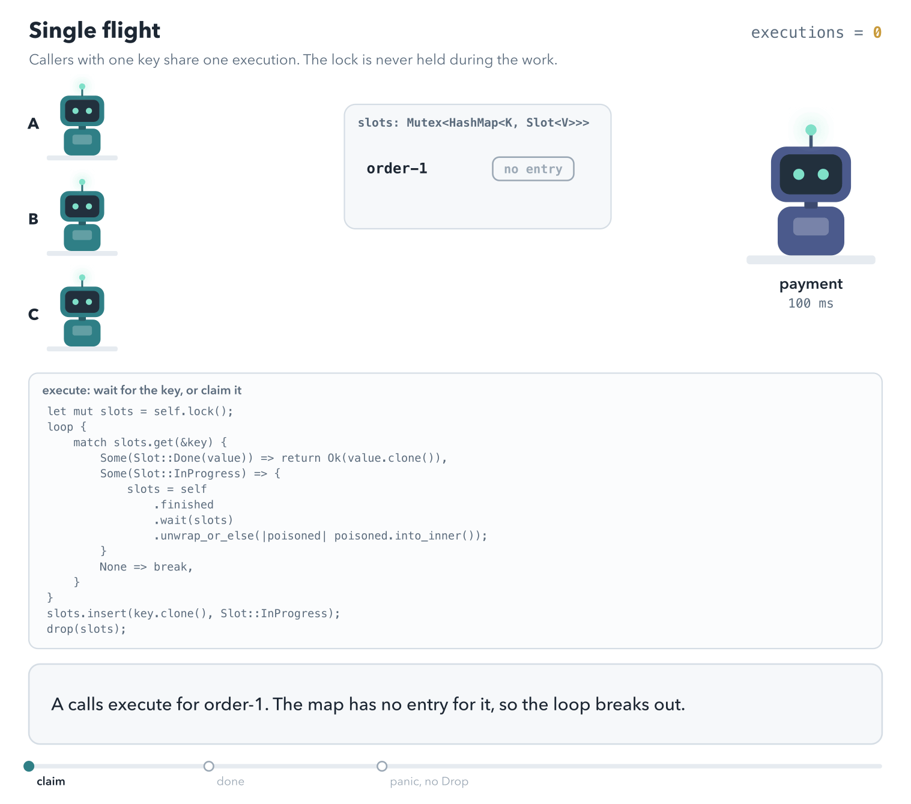

# Rate limits, retries, and idempotency

<div class="covers" markdown="1">

This chapter covers

- A token bucket that limits how often something may happen, with a lock and with atomics
- A measured flaw in the atomic version, and where it comes from
- Retrying failed calls with exponential backoff, jitter, and the server's `Retry-After`
- Deciding which errors to retry, with a trait
- Making a repeated request safe with an idempotency key
- Single flight: concurrent calls with one key share one execution, and other keys run in parallel

</div>

Programs that talk to other programs over a network see failures that local code never sees. A server is busy
and refuses a request. A connection drops halfway. A reply takes so long that the client gives up, without
knowing whether the server did the work.

This chapter builds three tools for those situations:

- A **rate limiter** protects a service from too many requests, by refusing requests above a set rate.
- A **retry** policy tries a failed call again, waiting longer after each failure.
- An **idempotency key** makes it safe to send the same request twice, by making the second one do nothing new.

The three work together. A client that retries must not overload the server, so it backs off. And a retried
request must not repeat a side effect, such as charging a card twice.

## 19.1 A token bucket

Suppose a service allows each client 5 requests per second. A simple counter that resets every second allows 5
requests at 0.99 s and 5 more at 1.01 s: 10 requests in 20 ms. A **token bucket** smooths this out.

Picture a bucket that holds up to 5 tokens. Every request takes one token out. If the bucket is empty, the request
is refused. Tokens flow back in at a steady rate, say 1 per second, until the bucket is full again (figure 19.1).

<figure class="anim">
<video class="motion" src="figures/ch19-token-bucket.mp4" autoplay loop muted playsinline preload="metadata" aria-label="A bucket that holds 5 tokens and refills 1 per second. Five calls at time 0 take the five tokens. The sixth call returns false. One second passes with nothing running; the next call adds the token that second earned and takes it. Last, without the cap on the refill, an hour idle adds 3,600 tokens and lets 3,600 calls through at once." data-chapters="[[0.0, &quot;spend&quot;], [28.5, &quot;refuse&quot;], [34.8, &quot;refill&quot;], [56.28, &quot;no cap&quot;]]"></video>
<figcaption><b>Animation 19.1</b> <code>try_acquire</code> adds the tokens earned since the last call, then takes one if it can. Nothing runs between calls.</figcaption>
</figure>


<figure>

<figcaption><b>Figure 19.1</b> The bucket in the test <code>it_works</code>: capacity 5, refill 1 token per second.</figcaption>
</figure>

Two numbers describe the bucket. The **capacity** is the largest burst allowed at once. The **rate** is the
long-run number of requests per second.

The bucket does not need a timer that adds tokens. Each request computes how many tokens arrived since the last request, from the time that has passed. It
adds them before it checks.

### 19.1.1 The bucket behind a lock

<p class="listing"><b>Listing 19.1</b> The bucket (lines 6 to 31). <a href="https://github.com/arpanpathak/cracking-the-systems-programming-interview/blob/prep-v2/rust-interview-lab/src/problems/rate_limiter.rs">src/problems/rate_limiter.rs</a></p>

```rust
{{#include ../../rust-interview-lab/src/problems/rate_limiter.rs:3:3}}

{{#include ../../rust-interview-lab/src/problems/rate_limiter.rs:5:16}}

impl TokenBucket {
{{#include ../../rust-interview-lab/src/problems/rate_limiter.rs:19:30}}
    // ...
}
```

The capacity and the rate never change, so they are plain fields. The token count and the time of the last refill
change on every call, so they live in `BucketState` behind a `Mutex`. The token count is an `f64`, because a
fraction of a token can arrive between two requests. The bucket starts full.

`Instant` is the standard library's clock for measuring durations. It only moves forward, unlike the wall-clock
time, which can jump when the system clock is corrected.

<p class="listing"><b>Listing 19.2</b> <code>try_acquire</code> (lines 32 to 49).</p>

```rust
impl TokenBucket {
    // ...
{{#include ../../rust-interview-lab/src/problems/rate_limiter.rs:32:49}}
}
```

`try_acquire` does all its work under the lock:

1. It computes the time since the last refill, `now - s.last_refill`, a `Duration`.
2. It converts that to seconds and multiplies by the rate: the number of new tokens.
3. It adds them and caps the total at the capacity with `.min(self.capacity)`.
4. It records `now` as the last refill.
5. If at least one token is there, it takes it and returns `true`. Otherwise it returns `false`.

Work through the test by hand. The bucket starts with 5 tokens. Five calls happen within microseconds, so almost no
tokens refill, and each call takes one. The sixth finds about 0.00001 tokens and returns `false`. After a one-second
sleep, about 1.00001 tokens are there, so one call succeeds, and the next finds about 0.00001 again.

<p class="listing"><b>Listing 19.3</b> The complete file, with its test. <a href="https://github.com/arpanpathak/cracking-the-systems-programming-interview/blob/prep-v2/rust-interview-lab/src/problems/rate_limiter.rs">src/problems/rate_limiter.rs</a></p>

```rust
{{#include ../../rust-interview-lab/src/problems/rate_limiter.rs}}
```

```text
$ cargo test --lib problems::rate_limiter
running 1 test
test problems::rate_limiter::tests::it_works ... ok

test result: ok. 1 passed; 0 failed; 0 ignored; 0 measured; 136 filtered out; finished in 1.00s
```

The test takes one second, because it sleeps to let a token refill. A test that depends on real time can also fail
on a heavily loaded machine. Exercise 1 removes the dependency by passing the time in.

### 19.1.2 The bucket with atomics

Every call to the locked bucket takes the mutex. Under heavy load, threads wait for each other there, as section
14.1 described for maps. The second version replaces the lock with atomic integers.

<p class="listing"><b>Listing 19.4</b> The limiter (lines 5 to 37). <a href="https://github.com/arpanpathak/cracking-the-systems-programming-interview/blob/prep-v2/rust-interview-lab/src/bin/rate_limiter_atomic_token_bucket.rs">src/bin/rate_limiter_atomic_token_bucket.rs</a></p>

```rust
{{#include ../../rust-interview-lab/src/bin/rate_limiter_atomic_token_bucket.rs:1:5}}

{{#include ../../rust-interview-lab/src/bin/rate_limiter_atomic_token_bucket.rs:7:14}}

impl RateLimiter {
{{#include ../../rust-interview-lab/src/bin/rate_limiter_atomic_token_bucket.rs:17:43}}
}
```

The design differs from the locked version in three ways:

- Tokens are whole numbers in an `AtomicI64`, and time is whole seconds since the limiter was created. Tokens
  arrive in steps, once per second, instead of continuously.
- `last_refilled_at.fetch_max(now, Relaxed)` records the current second and returns the previous value, in one
  atomic step. If several threads start a new second at once, only the first sees an older value, so only that
  thread adds tokens.
- `#[repr(align(64))]` gives the limiter its own cache lines, so it does not share a line with a neighbor, as
  section 15.4 described.

Then comes the check. If the count is 0 or less, the call returns `false`. Otherwise it takes a token with
`fetch_sub(1)`, and returns `true` if the count before the subtraction was positive.

<p class="listing"><b>Listing 19.5</b> The complete program. <a href="https://github.com/arpanpathak/cracking-the-systems-programming-interview/blob/prep-v2/rust-interview-lab/src/bin/rate_limiter_atomic_token_bucket.rs">src/bin/rate_limiter_atomic_token_bucket.rs</a></p>

```rust
{{#include ../../rust-interview-lab/src/bin/rate_limiter_atomic_token_bucket.rs}}
```

```text
$ cargo run --bin rate_limiter_atomic_token_bucket
request 1: true
request 2: true
request 3: true
request 4: true
request 5: true
request 6: false
request 1: true
request 2: true
request 3: true
request 4: true
request 5: true
request 6: false
```

With one thread, the output is exactly right: 5 requests pass, the sixth fails, and after a second 5 more pass.

### 19.1.3 What happens with many threads

Each atomic operation is safe on its own. The problem is that `try_acquire` makes several of them, and other threads
can act between them. Figure 19.2 shows one interleaving with one token left.

<figure>

<figcaption><b>Figure 19.2</b> Both threads pass the check before either takes the token.</figcaption>
</figure>

B is correctly refused, but its `fetch_sub` still ran. The count drops below zero, and the next refill starts from
there, so the limiter lets through fewer requests than its rate. To measure this, I ran 8 threads calling
`try_acquire` in a loop for 3.5 seconds, on a limiter with capacity 5 and rate 5. A correct limiter admits 20
requests: 5 at the start and 5 in each of the next three seconds. Three runs admitted 18, 19, and 17, and ended
with the count at 0, −1, and −1.

A second gap goes the other way. The refill is a `fetch_add` followed by a separate `fetch_min`. Between the two,
the count can be above the capacity, and other threads can take the extra tokens before the cap is applied. That
would let through more than the capacity in one burst. My runs did not catch this window, but nothing in the code
prevents it.

Both gaps close if the check, the take, and the refill happen as one atomic step. `compare_exchange` in a loop does that. It reads the count, computes the new count, and writes it only if
no other thread changed the count in between.
Exercise 2 asks you to write it.

## 19.2 Retrying failed calls

Many failures are temporary. A server restarts, a network link drops a packet, or a service is briefly overloaded.
Trying again a moment later often works.

Retrying well takes three decisions:

1. **Which errors to retry.** A "not found" error will fail again. A "server busy" error may not.
2. **How long to wait.** Waiting a little longer after each failure gives a struggling server time to recover.
3. **How many times.** At some point, the caller should give up and report the error.

### 19.2.1 Which errors to retry

The retry code works with `ApiError`, the error enum from section 7.7. Here it is again. Each variant is one
way a call to a service can fail, and carries the data that failure needs:

```rust
{{#include ../../rust-interview-lab/src/problems/state_machine.rs:58:78}}
    // ...
}
```

- `InvalidRequest` and `NotFound` describe a request that is wrong. Sending it again gives the same answer.
- `Unauthorized` needs new credentials, not a second try.
- `RateLimited` says the server is busy, and carries how long it asked the client to wait.
- `Server` is a failure on the server's side, with the HTTP status code.

The enum's own method, `is_retryable`, already answers the first question for each variant. `matches!` tests a
value against a pattern and returns `true` or `false`. It returns `true` for `RateLimited`, and for `Server` with a
status from 500 to 599.

The retry code should not be tied to `ApiError`, though. It should work with any error that can answer the
question. That is a job for a trait:

<p class="listing"><b>Listing 19.6</b> The <code>Retryable</code> trait (lines 22 to 44). <a href="https://github.com/arpanpathak/cracking-the-systems-programming-interview/blob/prep-v2/rust-interview-lab/src/problems/retry.rs">src/problems/retry.rs</a></p>

```rust
{{#include ../../rust-interview-lab/src/problems/retry.rs:18:20}}

{{#include ../../rust-interview-lab/src/problems/retry.rs:22:44}}
```

`Retryable` is a trait that an error type implements to answer the first question. `is_retryable` has no default,
so each error type must decide. `retry_after` has a default body that returns `None`, so an error type only needs
to implement it if the server can send a hint.

The trait is implemented for `ApiError`. Its `is_retryable` passes the question to the enum's own method.
`retry_after` returns the delay carried by a `RateLimited` error. That delay usually comes from the HTTP header `Retry-After`, which a server sends to say when
to try again.

The line `ApiError::is_retryable(self)` calls the enum's own method, not the trait's. Both have the same name. The
path `ApiError::is_retryable` finds the inherent method first, so the trait method does not call itself forever.

### 19.2.2 How long to wait

A fixed delay has a problem. If a server fails, all its clients fail at the same moment. With a fixed delay they all retry at the same moment too. The server is hit by a wave of retries at the
moment it recovers. This is called a
**thundering herd**.

Two techniques spread the retries out:

- **Exponential backoff** doubles the delay after each failure: 100 ms, 200 ms, 400 ms, and so on, up to a cap
  (figure 19.3). The longer the outage, the less often each client tries.
- **Jitter** adds randomness to the delay, so clients that failed together do not retry together (figure 19.4).
  **Full jitter** picks a random delay between 0 and the backoff.

<figure>

<figcaption><b>Figure 19.3</b> The delays from the test <code>exponential_backoff_doubles_until_capped</code>.</figcaption>
</figure>

<figure>

<figcaption><b>Figure 19.4</b> The same twenty retries, without and with full jitter.</figcaption>
</figure>

<p class="listing"><b>Listing 19.7</b> The policy (lines 46 to 102).</p>

```rust
{{#include ../../rust-interview-lab/src/problems/retry.rs:46:102}}
```

`RetryPolicy` holds the four settings. `max_attempts` counts the first try as well, so 3 means one try and two
retries.

`exponential_delay` computes `base * 2^attempt`, capped at `max_delay`. Three details keep it from overflowing:

- `1u32 << shift` computes 2 to the power `shift` by shifting the bit 1 left. `attempt.min(31)` keeps the shift
  within a `u32`, because shifting by 32 or more is an error.
- `Duration::saturating_mul` returns the largest `Duration` instead of overflowing.
- `.min(self.max_delay)` applies the cap.

`delay_for` applies jitter. It takes a random number in `[0, 1)` as an argument, and multiplies the delay by it
with `Duration::mul_f64`. `clamp(0.0, 1.0)` guards against a random source that returns something out of range.

### 19.2.3 The retry loop

<p class="listing"><b>Listing 19.8</b> <code>retry</code> (lines 104 to 137).</p>

```rust
{{#include ../../rust-interview-lab/src/problems/retry.rs:104:137}}
```

`retry` is generic over four types. `T` and `E` are the success and error types. `F` is the operation, a closure
that receives the attempt number. `R` produces random numbers.

The operation is `FnMut`, not `FnOnce`, because the loop calls it several times, and it may change captured state,
like the test's attempt counter.

On each error, the loop checks two reasons to stop: the attempts are used up, or the error is not retryable. Either
way it returns the last error. Otherwise it computes its own backoff, and then applies the server's hint:

```rust
let delay = error.retry_after().map_or(backoff, |hint| hint.max(backoff));
```

`map_or(default, f)` returns `default` for `None`, and `f(hint)` for `Some(hint)`. So without a hint, the delay is
the backoff. With a hint, it is the larger of the two. The client never retries sooner than the server asked, and
never sooner than its own backoff.

`std::thread::sleep(delay)` blocks the thread for the delay. In async code, chapter 22, the wait would be an async
timer instead, so the thread can do other work.

**Injecting randomness.** The random number comes from the `unit_random` closure the caller passes in. Production
code passes a real random number generator. Tests pass `|| 0.0`, which makes every delay predictable. Passing in a
dependency this way, instead of creating it inside the function, is called **dependency injection**. It makes the
function testable without a real clock or a real random source.

<p class="listing"><b>Listing 19.9</b> The complete file, with tests. <a href="https://github.com/arpanpathak/cracking-the-systems-programming-interview/blob/prep-v2/rust-interview-lab/src/problems/retry.rs">src/problems/retry.rs</a></p>

```rust
{{#include ../../rust-interview-lab/src/problems/retry.rs}}
```

The tests use a policy with zero delays, so they run instantly. `retries_then_succeeds` fails twice with a 503 and
then succeeds: three attempts in total. `non_retryable_errors_return_immediately` returns `NotFound`, and must stop
after one attempt.

```text
$ cargo test --lib problems::retry
running 6 tests
test problems::retry::tests::full_jitter_scales_the_delay ... ok
test problems::retry::tests::exponential_backoff_doubles_until_capped ... ok
test problems::retry::tests::retry_after_is_honored_as_a_floor ... ok
test problems::retry::tests::non_retryable_errors_return_immediately ... ok
test problems::retry::tests::exhausted_policy_returns_the_last_error ... ok
test problems::retry::tests::retries_then_succeeds ... ok

test result: ok. 6 passed; 0 failed; 0 ignored; 0 measured; 131 filtered out
```

## 19.3 Idempotency keys

Retries have a danger. Suppose a client asks a server to charge a card, and the reply is lost. The client cannot
tell whether the charge happened. If it retries, the card may be charged twice.

An operation is **idempotent** if doing it twice has the same effect as doing it once. Reading a record is
idempotent. Charging a card is not, unless the server makes it so.

The usual way is an **idempotency key**. The client picks a unique key for each logical request, such as an order
number, and sends it with every attempt. The server records the result under that key. When the same key arrives
again, the server returns the recorded result and does not repeat the work (figure 19.5).

<figure>

<figcaption><b>Figure 19.5</b> Two calls with one key. The work runs once.</figcaption>
</figure>

The store is a `HashMap` from key to result, behind a `Mutex` so that several threads can share it:

```rust
{{#include ../../rust-interview-lab/src/bin/idempotent_operation.rs:1:5}}
```

<p class="listing"><b>Listing 19.10</b> The complete program. <a href="https://github.com/arpanpathak/cracking-the-systems-programming-interview/blob/prep-v2/rust-interview-lab/src/bin/idempotent_operation.rs">src/bin/idempotent_operation.rs</a></p>

```rust
{{#include ../../rust-interview-lab/src/bin/idempotent_operation.rs}}
```

`Idempotent<K, V>` stores results in a `HashMap` behind a `Mutex`. `execute` takes a key and a closure `f` that does
the work:

1. It locks the store. A poisoned lock becomes an error: `map_err(|_| "lock poisoned")?` turns the `PoisonError`
   into a `&str`, and `?` converts that into a `Box<dyn Error>`.
2. If the key is present, it returns a clone of the stored result.
3. Otherwise it runs `f()`. If `f` fails, `?` returns the error, and nothing is stored, so a later call can try
   again.
4. It stores a clone of the result and returns it.

In `main`, `charge` is called with the same key twice. The closure captures nothing, so it is `Copy`, and passing it
to `execute` twice copies it. The line "charging card..." appears once:

```text
$ cargo run --bin idempotent_operation
charging card...
```

The second file is the same program with a type alias, `type RuntimeError = Box<dyn std::error::Error>;`, which
shortens the signatures:

<p class="listing"><b>Listing 19.11</b> The complete program. <a href="https://github.com/arpanpathak/cracking-the-systems-programming-interview/blob/prep-v2/rust-interview-lab/src/bin/idempotent_operation_with_error_progagation.rs">src/bin/idempotent_operation_with_error_progagation.rs</a></p>

```rust
{{#include ../../rust-interview-lab/src/bin/idempotent_operation_with_error_progagation.rs}}
```

```text
$ cargo run --bin idempotent_operation_with_error_progagation
charging card...
```

Holding the lock while `f()` runs makes the store correct. Two calls with the same key cannot both find it
missing and both run the work. It is also the store's limit. Every call waits for the one lock, even calls with
different keys, so one slow operation delays all others. Section 19.4 removes that limit. A real service also keeps the results in a database, so they survive a
restart.

## 19.4 One execution per key: single flight

The store in section 19.3 has two problems under load.

- **It serializes every key.** It holds one lock while the work runs. A slow charge for `order-1` makes a
  call for `order-2` wait, although the two have nothing in common.
- **It cannot be split naively.** Suppose the lock is released during the work. Two callers with the same key
  can then both find it missing, and both charge the card.

The same shape appears in caches. When a popular entry expires, hundreds of requests can miss at once, and
each recomputes the value or queries the database. That burst is a **cache stampede**, a thundering herd
aimed at one key.

The fix is to record, for each key, that work is **in progress**. The first caller for a key marks it,
releases the lock, and runs the work. A caller that finds the mark waits for the result instead of starting
its own. Callers with other keys never wait. This is called **single flight**: at most one execution per key
is in the air at a time.

Each key moves through three states (figure 19.6). A success stores the value for every later caller. A
failure, or a panic, removes the mark, so the next caller can try again.

<figure>

<figcaption><b>Figure 19.6</b> The states of one key. Only the first caller runs the work. A failure returns the key to no entry, so a retry runs it again.</figcaption>
</figure>

### 19.4.1 The state

Each key maps to a `Slot`, and all the slots share one map behind one mutex. A `Condvar` wakes the waiters
when any slot changes:

```rust
{{#include ../../rust-interview-lab/src/bin/single_flight.rs:11:38}}
```

The mutex is held only to read or change the map, never while the work runs. So one lock is enough for every
key. `notify_all` wakes every waiter, for any key. Each one checks its own key and goes back to sleep if
nothing it cares about changed. That costs a few spurious wakeups, and keeps the code to one `Condvar`.

### 19.4.2 The claim

The caller that runs the work holds a **claim** on its key. If the work fails or panics, someone has to remove
the `InProgress` mark, or the waiters sleep forever. `Drop` is the place that runs in both cases:

```rust
{{#include ../../rust-interview-lab/src/bin/single_flight.rs:40:65}}
```

`key` is an `Option`. The success path takes the key out of the claim before the claim is dropped, so `Drop`
does nothing. On an error or a panic, the key is still inside, and `Drop` removes the mark and wakes the
waiters.

`lock` recovers a poisoned mutex with `into_inner`, as in section 16.6. The map is consistent after every
update, because each update is one `insert` or one `remove`, so the data is safe to keep using.

### 19.4.3 `execute`

`execute` loops while the key is in progress, then claims it, runs the work outside the lock, and stores the
result:

```rust
{{#include ../../rust-interview-lab/src/bin/single_flight.rs:67:116}}
```

The `loop` handles all three states:

- `Done(value)`: return a clone. This is the idempotency of section 19.3.
- `InProgress`: wait on the `Condvar`. `wait` releases the lock while it sleeps, and takes it back on wakeup.
  The loop then checks the key again, because the wakeup may be for another key, or spurious.
- No entry: leave the loop and claim the key.

After the claim, `drop(slots)` releases the lock, and `work()` runs with no lock held. If `work` returns an
error, `?` returns it, and the claim's `Drop` removes the mark. If `work` succeeds, the code takes the key out
of the claim, stores `Done`, and wakes the waiters.

### 19.4.4 Measured

`main` starts its callers together with a `Barrier`, so they really overlap, and times them:

```rust
{{#include ../../rust-interview-lab/src/bin/single_flight.rs:118:139}}
```

The work is a fake charge that sleeps for 100 ms and counts how many times it ran. The second scene also runs
the four keys through a store like section 19.3's: one lock, held while the work runs.

```text
1. Eight concurrent calls with one key
  executions 1, all got txn-order-1: true, 103 ms

2. Four concurrent calls with four keys
  single flight:                 executions 4, 103 ms
  one lock held during the work: executions 4, 417 ms

3. A failure is not stored
  first: Err("card declined"), retry: Ok("txn-order-5"), executions 1
```

Eight callers with one key caused one charge, and all eight got its result in 103 ms. Four keys ran in
parallel in 103 ms. The one-lock store ran them one after another, in 417 ms. A declined charge was not
stored, so the retry ran the work, and that run succeeded.

The fourth scene makes the work panic while a second caller waits for the same key:

```text
4. The work panics while another caller waits

thread '<unnamed>' panicked at src/bin/single_flight.rs:209:21:
payment provider crashed
  caller 0: Err("panicked")
  caller 1: Ok(Ok("txn-order-6"))
```

The `panicked at` lines are the default panic message, written to standard error. Caller 0's panic dropped
its claim, and `Drop` removed the mark and woke caller 1. Caller 1 found no entry, claimed the key, and ran
the work itself. Without the claim's `Drop`, the mark would stay `InProgress`, and caller 1 would wait
forever. Animation 19.2 shows both runs.

<figure class="anim">
<video class="motion" src="figures/ch19-single-flight.mp4" autoplay loop muted playsinline preload="metadata" aria-label="Three caller robots, A, B, and C, a slot map with an entry for order-1, and a payment service. A finds no entry, marks order-1 InProgress, releases the lock, and calls the service. B and C find InProgress and sleep on the Condvar. The charge returns txn-order-1; A stores Done and calls notify_all; B and C wake and each take a clone, with one execution counted. In a second run without the claim's Drop, A's work panics, the mark stays InProgress, and B and C sleep while a clock runs." data-chapters="[[0.0, &quot;claim&quot;], [13.67, &quot;done&quot;], [26.82, &quot;panic, no Drop&quot;]]"></video>
<figcaption><b>Animation 19.2</b> One key, three callers, one execution. When the claim's <code>Drop</code> is missing, a panic leaves the mark in place and the waiters sleep forever.</figcaption>
</figure>

A production version adds two things. Waiters need a deadline, `wait_timeout`, so a hung charge cannot hold
them forever. And the results need an expiry, or a store that only grows becomes a memory leak.

<p class="listing"><b>Listing 19.12</b> Single flight: one execution per key in flight. <a href="https://github.com/arpanpathak/cracking-the-systems-programming-interview/blob/prep-v2/rust-interview-lab/src/bin/single_flight.rs">src/bin/single_flight.rs</a></p>

```rust
{{#include ../../rust-interview-lab/src/bin/single_flight.rs}}
```

<div class="summary" markdown="1">

## Summary

- A token bucket allows bursts up to its capacity and a long-run rate. Each call adds the tokens earned since the
  last call before it checks.
- The locked bucket is correct and simple. The atomic bucket avoids the lock, but its separate check, take, and
  refill steps let the count go negative. With 8 threads it admitted 17 to 19 requests where 20 were due.
- Retry only errors that can succeed later. A `Retryable` trait lets each error type decide, and carry a server
  hint.
- Exponential backoff with full jitter spreads retries out and prevents a thundering herd. The server's
  `Retry-After` is a floor on the delay.
- Passing randomness in as a closure makes the retry logic testable.
- An idempotency key makes a retried request safe: the server stores the result under the key and returns it for
  every repeat.
- Single flight marks a key in progress and runs its work outside the lock. Eight callers with one key caused one
  execution, and four keys took 103 ms, against 417 ms behind one lock. A claim with `Drop` clears the mark after
  an error or a panic.

</div>

Chapter 20 moves down to the network itself: IP addresses, sockets, and a server that echoes back what it receives.

## Exercises

1. Change `TokenBucket::try_acquire` to take the current time as an argument, `try_acquire_at(&self, now: Instant)`.
   Rewrite the test without `thread::sleep`.
2. Rewrite the atomic limiter's `try_acquire` with a `compare_exchange` loop that refills, checks, and takes a
   token in one atomic step. Run the 8-thread test from section 19.1.3 on it.
3. Add a `max_elapsed: Duration` to `RetryPolicy`, and make `retry` stop when the total time spent would pass it.
4. Add a deadline to `SingleFlight::execute`: a caller that waits longer than a given `Duration` for a key
   in progress returns an error. Use `Condvar::wait_timeout`, and keep the remaining time across spurious wakeups.
