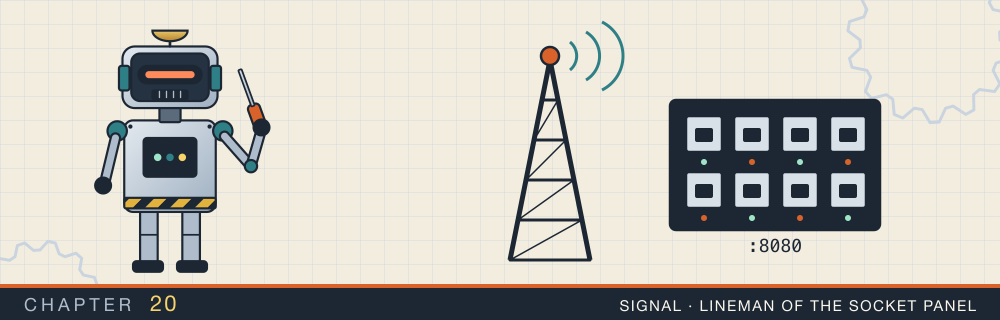
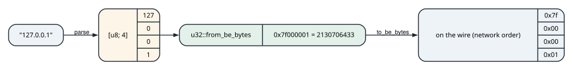
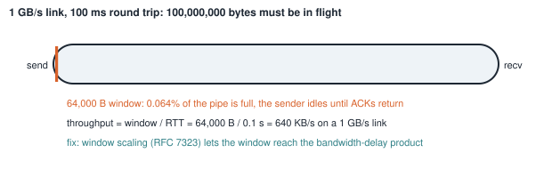
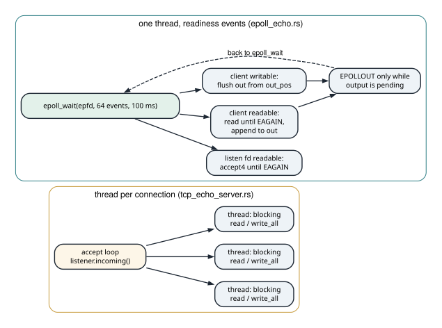

# Addresses, windows, and echo servers

<div class="covers" markdown="1">

This chapter covers

- Parsing IPv4 addresses with `??`, matching private ranges with slice patterns, and byte order
- The effective TCP window and the bandwidth-delay product
- A thread-per-connection echo server and the TCP lifecycle it walks through
- An epoll echo server over raw `libc` calls: non-blocking sockets, `EAGAIN`, and write buffers
- Where each model breaks, and what a production server adds

</div>

Networking questions start at the bottom of the stack and work up. What is an IPv4 address as a number? Why
does a fast link with high latency deliver less than its bandwidth? What happens between `bind` and the first
byte echoed back? How does one thread serve ten thousand connections? The four programs in this chapter
answer those in order. The last one uses no runtime and no crate beyond `libc`, so every system call is
visible.

## 20.1 IPv4 addresses

<p class="listing"><b>Listing 20.1</b> Parse, classify, and convert IPv4 addresses. <a href="https://github.com/arpanpathak/cracking-the-systems-programming-interview/blob/prep-v2/rust-interview-lab/src/bin/net_ipv4.rs">src/bin/net_ipv4.rs</a></p>

```rust
{{#include ../../rust-interview-lab/src/bin/net_ipv4.rs}}
```

`parse` is four `parts.next()??` expressions and a check that nothing is left over. The iterator yields
`Option<u8>` (the result of `part.parse::<u8>().ok()`), so `next()` returns `Option<Option<u8>>`. The
first `?` returns `None` if there is no fourth part. The second returns `None` if a part is not a valid
`u8`, which is how `"256.1.1.1"` is rejected. `parts.next().is_none().then_some(address)` rejects a fifth
part.

`is_private` is one `matches!` over array patterns. `[10, ..]` matches any address starting with 10.
`[172, 16..=31, ..]` uses a range pattern for the second octet: exactly the /12 block from 172.16 to
172.31. Rust's patterns are shorter here than the bit masks they replace.

Network byte order is big-endian: the first octet is the most significant byte. `u32::from_be_bytes`
turns the four octets into that number on any machine, whatever its native order (figure 20.1).

<figure>

<figcaption><b>Figure 20.1</b> An address as text, as octets, as a <code>u32</code>, and on the wire.</figcaption>
</figure>

```text
input            parsed              private       as u32
10.0.0.1         [10, 0, 0, 1]          true    167772161
172.16.5.4       [172, 16, 5, 4]        true   2886731012
8.8.8.8          [8, 8, 8, 8]          false    134744072
256.1.1.1        invalid
1.2.3            invalid
```

`str::parse::<u8>` accepts a leading `+` and leading zeros, so `"+1.02.3.4"` parses. The standard
library's `"1.2.3.4".parse::<std::net::Ipv4Addr>()` rejects both, and `Ipv4Addr::is_private` implements
the same three ranges. Write your own version; name the standard one.

## 20.2 How much data can be in flight

<p class="listing"><b>Listing 20.2</b> The effective window and the bandwidth-delay product. <a href="https://github.com/arpanpathak/cracking-the-systems-programming-interview/blob/prep-v2/rust-interview-lab/src/bin/net_window.rs">src/bin/net_window.rs</a></p>

```rust
{{#include ../../rust-interview-lab/src/bin/net_window.rs}}
```

A TCP sender may have at most `min(receive window, congestion window)` bytes unacknowledged. The receive
window is flow control: how much the receiver can buffer. The congestion window is the sender's estimate of
what the network can carry. Once that many bytes are in flight, the sender stops and waits for
acknowledgments.

The bandwidth-delay product is how many bytes a link holds while they travel: bandwidth times round-trip
time. If the window is smaller than the product, the sender runs out of window before the first
acknowledgment returns. The link then sits idle for the rest of each round trip. The program's last case
makes it concrete (figure 20.2).

<figure>

<figcaption><b>Figure 20.2</b> A 64,000-byte window on a link whose bandwidth-delay product is 100,000,000 bytes.</figcaption>
</figure>

```text
window 64000 B vs product 100000000 B: link is starved, the window too small
```

<figure class="anim">
<video class="motion" src="figures/ch20-bdp.mp4" autoplay loop muted playsinline preload="metadata" aria-label="A sender and a receiver joined by a link with a data lane and an ACK lane. A gauge above shows 16 slots, the packets the link holds in one round trip. With a window of 4, the sender sends 4 packets, stops with the label window full, and waits a round trip for ACKs while most of the link is empty; the link is busy 25 percent of the time. With a window of 16, packets leave continuously, the first ACK returns as the 16th packet leaves, and the link is busy 100 percent of the time. Last, a window of 1 against the real numbers: 1 GB/s times 100 ms is 100,000,000 bytes in flight, and a 64,000-byte window gives 640 KB/s." data-chapters="[[0.0, &quot;window 4&quot;], [25.74, &quot;window 16&quot;], [45.24, &quot;real numbers&quot;]]"></video>
<figcaption><b>Animation 20.1</b> The window caps how many packets are unacknowledged. When it is smaller than the bandwidth-delay product, the sender stops for part of every round trip. The link is idle for that part.</figcaption>
</figure>

Latency costs as much as bandwidth for bulk transfers. That is why TCP's window-scaling option
exists: the original 16-bit window field caps at 65,535 bytes. On Linux, `net.ipv4.tcp_rmem` and
`tcp_wmem` bound how large the kernel lets the windows grow.

`bandwidth_delay_product` multiplies before it divides, `bytes_per_second * rtt_millis / 1_000`, which
keeps precision in integer arithmetic. The intermediate product overflows `u64` only when bytes per
second times milliseconds passes about 1.8 × 10¹⁹, far beyond any real link.

## 20.3 A thread-per-connection echo server

<p class="listing"><b>Listing 20.3</b> The canonical socket exercise with <code>std::net</code>. <a href="https://github.com/arpanpathak/cracking-the-systems-programming-interview/blob/prep-v2/rust-interview-lab/src/bin/tcp_echo_server.rs">src/bin/tcp_echo_server.rs</a></p>

```rust
{{#include ../../rust-interview-lab/src/bin/tcp_echo_server.rs}}
```

`TcpListener::bind` performs three system calls: `socket`, `bind`, and `listen`. Binding to port 0 asks
the kernel for any free port. `local_addr()` reports which one it chose, which is how both `main` and
the test avoid colliding with other programs. `listener.incoming()` is an endless iterator over
`accept`, and each accepted stream moves into its own thread.

<figure class="anim">
<video class="motion" src="figures/ch20-tcp-handshake.mp4" autoplay loop muted playsinline preload="metadata" aria-label="The echo server's test as two robots, a client and a server, joined by a wire, each with its TCP state above it and a kernel receive buffer below it. The server thread sleeps in accept. The client's connect sends SYN seq 1000; the server's kernel, not the server thread, answers SYN+ACK seq 5000 ack 1001; the client sends ACK 5001, and both sides are ESTABLISHED. The connection waits in the accept queue until accept takes it. write_all sends hello echo as one 10-byte segment into the server's receive buffer, read returns 10, and write_all sends it back. shutdown sends FIN; the server's read returns 0, the handler returns, and the server sends its own FIN; read_to_end returns the echo, and the client's last ACK closes the server side. A second run deletes the shutdown line: both sides block in read forever." data-chapters="[[0.0, &quot;listen&quot;], [5.22, &quot;handshake&quot;], [34.26, &quot;echo&quot;], [57.72, &quot;close&quot;], [88.68, &quot;no FIN&quot;]]"></video>
<figcaption><b>Animation 20.2</b> The test from listing 20.3, one segment at a time. The kernel completes the handshake before <code>accept</code> returns, and each direction closes with its own FIN. Without <code>shutdown</code>, no FIN is sent, and both reads wait forever.</figcaption>
</figure>


`handle_connection` is the whole protocol:

- `set_nodelay(true)` disables Nagle's algorithm. Nagle delays small writes to coalesce them. That is
  wrong for an echo server whose reply is never followed by more data, and the module comment says so.
- `read` returns how many bytes arrived, which can be anything from 1 to the buffer size, no matter how
  the client wrote them. TCP is a byte stream with no message boundaries.
- `read` returning 0 means the peer sent FIN: an orderly close. The function returns `Ok(())` and the
  stream is closed when it is dropped.
- `write_all` loops over partial writes until every byte is sent.

The test is a model of how to test a server. It binds an ephemeral port, runs `handle_connection` for
exactly one connection in a thread, writes `"hello echo"`, and then half-closes with
`shutdown(Shutdown::Write)`. The half-close sends FIN, so the server's `read` returns 0 and the server
finishes. The client's read side stays open, so `read_to_end` can collect the echo.

Thread per connection is the right default when connections are few or handlers block on other I/O. Each
thread costs a kernel stack and scheduling work. At thousands of mostly idle connections, the model
spends its memory on stacks that wait. That is the case for the next program.

## 20.4 An epoll echo server

<p class="listing"><b>Listing 20.4</b> One thread, many non-blocking sockets, over <code>libc</code>. <a href="https://github.com/arpanpathak/cracking-the-systems-programming-interview/blob/prep-v2/rust-interview-lab/src/bin/epoll_echo.rs">src/bin/epoll_echo.rs</a></p>

```rust
{{#include ../../rust-interview-lab/src/bin/epoll_echo.rs}}
```

The whole Linux implementation lives in `mod linux` behind `#[cfg(target_os = "linux")]`, and a second
`main` for every other platform prints a message instead. The program compiles everywhere and runs where
epoll exists. Figure 20.3 contrasts the two server models.

<figure>

<figcaption><b>Figure 20.3</b> Readiness events against threads. The epoll server's only blocking call is <code>epoll_wait</code>.</figcaption>
</figure>

### 20.4.1 Setting up the listener by hand

`bind_listener` is what `TcpListener::bind` does inside, spelled out. `socket(AF_INET, SOCK_STREAM |
SOCK_NONBLOCK, 0)` creates a non-blocking socket in one call. `SO_REUSEADDR` lets a restarted server bind
while old connections sit in `TIME_WAIT`. The `sockaddr_in` is built with `std::mem::zeroed()`, and its
fields are converted to network order: `port.to_be()` and `INADDR_LOOPBACK.to_be()`. That is the
byte-order lesson of section 20.1 in its natural habitat. Every failure path closes the fd before returning
the error, so nothing leaks, and the `SAFETY` comment explains why the raw pointers are valid.

### 20.4.2 The loop

`event_loop` registers the listening socket for `EPOLLIN`, then waits, at most 64 events at a time. The
wait has a 100 ms timeout, so the loop re-checks the `shutdown` flag regularly. `EINTR` (a signal arrived
during the wait) is not an error; the loop continues. Each event carries the fd in its `u64` field, put
there at registration.

- **The listener is readable:** `accept_ready` calls `accept4` with `SOCK_NONBLOCK` in a loop until it
  returns `EAGAIN`, registering each new client for `EPOLLIN`. Accepting until `EAGAIN` drains a burst of
  connections in one wake-up.
- **A client is readable:** `read_into` reads until `EAGAIN`, appending everything to the connection's
  `out` buffer, then tries to `flush` it. A read of 0 closes the connection.
- **A client is writable:** `flush` writes from `out_pos` onward. When `write` returns `EAGAIN` the
  socket's send buffer is full; the rest stays queued.
- **After either:** `update_interest` asks for `EPOLLOUT` only while output is pending. A socket with
  room in its send buffer is almost always writable. Leaving `EPOLLOUT` on permanently would wake the
  loop continuously for nothing.

`Connection` is two fields, `out` and `out_pos`, and `has_pending_output` compares them. That buffer keeps
one slow client harmless. Its reply waits in memory, and the loop moves on to other sockets instead of
blocking in `write`.

<figure class="anim">
<video class="motion" src="figures/ch20-epoll.mp4" autoplay loop muted playsinline preload="metadata" aria-label="One robot, the event loop thread, beside a panel of registered sockets. Each row shows an fd, its interest set, a readiness light, and for clients an out buffer. The thread sleeps in epoll_wait. Two clients connect, the listener fd 3 lights up, and accept4 turns them into fd 5 and fd 6 until it returns EAGAIN. fd 5 sends 1 KB and fd 6 sends 12 KB; one epoll_wait returns both. fd 5's reply is written in full. fd 6's write stops at EAGAIN with 4 KB left, so the 4 KB stays in out and fd 6's interest becomes IN and OUT while the thread moves on. Later fd 6 turns writable, flush sends the rest, and the interest returns to IN. In a last run fd 6 is blocking: the thread is stuck in write, while fd 5 and a new connection sit ready and ignored." data-chapters="[[0.0, &quot;wait&quot;], [5.22, &quot;accept&quot;], [21.42, &quot;read&quot;], [56.46, &quot;writable&quot;], [69.18, &quot;blocking fd&quot;]]"></video>
<figcaption><b>Animation 20.3</b> The loop from listing 20.4 serving three sockets on one thread. A slow client leaves bytes in its <code>out</code> buffer, not a blocked thread. One blocking socket would stop every other socket.</figcaption>
</figure>

`main` ignores `SIGPIPE`. By default, writing to a socket whose peer has gone away raises `SIGPIPE`, which
kills the process. With the signal ignored, `write` returns `EPIPE` instead. Rust's standard library does
this for you at startup on Unix, but a program that makes raw `libc` calls should not rely on it.

### 20.4.3 What a production server would change

The program is a complete, tested event loop, and reading it critically is good practice.

- **One client's error stops the server.** `read_into` and `flush` return `Err` on any failure other than
  `EAGAIN`, and `event_loop` propagates it with `?`. A client that resets its connection (`ECONNRESET`)
  makes the whole loop return. A per-connection error should close that connection and continue.
- **The output buffer is unbounded.** A client that sends continuously and never reads grows `out`
  without limit. Backpressure here means turning off `EPOLLIN` for that client while its buffer is over a
  threshold.
- **`epoll_ctl` runs after every event.** `update_interest` issues a `EPOLL_CTL_MOD` system call even
  when the interest set has not changed. Tracking the current set per connection removes most of them.
- **Level-triggered mode.** The loop registers without `EPOLLET`, so epoll keeps reporting a socket while
  it stays ready. Reading until `EAGAIN` is required in edge-triggered mode and harmless here.

Frameworks such as `mio` (under Tokio) wrap exactly this loop, portably over epoll, kqueue, and IOCP.
Chapter 22 builds the other half of an async runtime, the part that turns readiness into resumed tasks.

## 20.5 Questions that come up

**"What does a `read` of 0 bytes mean on a TCP socket?"**
The peer closed its sending side (FIN). No more data will arrive. It is not an error.

**"Why set `TCP_NODELAY`?"**
To stop Nagle's algorithm from holding back small writes. Request-response protocols that write a small
reply and wait want it off.

**"Thread per connection or an event loop?"**
Threads for a modest number of connections and simple blocking code. An event loop, or an async runtime
on top of one, for many mostly idle connections, where per-thread stacks and context switches dominate.

**"Level-triggered or edge-triggered epoll?"**
Level-triggered reports a ready fd until it is no longer ready. Edge-triggered reports only transitions, so
the handler must drain the fd until `EAGAIN`. Otherwise it may never hear about the remaining data.

**"A 10 Gb/s link between regions delivers 50 MB/s. Why?"**
Check the bandwidth-delay product against the window: at 80 ms RTT, 10 Gb/s needs about 100 MB in
flight. A small socket buffer, or window scaling disabled somewhere on the path, caps throughput at
window / RTT.
