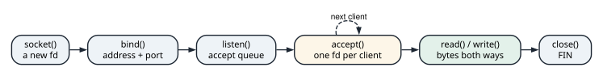
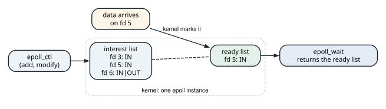

# Addresses, windows, and echo servers

<div class="covers" markdown="1">

This chapter covers

- Parsing IPv4 addresses with `??`, matching private ranges with slice patterns, and byte order
- The effective TCP window and the bandwidth-delay product
- A thread-per-connection echo server and the TCP lifecycle it walks through
- An epoll echo server over raw `libc` calls: non-blocking sockets, `EAGAIN`, and write buffers
- Where each model breaks, and what a production server adds

</div>

This chapter works up from the bottom of the network stack. Section 20.1 covers addresses, the numbers that
name a machine. Section 20.2 covers how much data TCP lets a sender have on the wire at once, and why that
limits speed on long links. Sections 20.3 and 20.4 build two echo servers. The first gives every client its
own thread. The second serves every client from one thread with epoll. It uses no crate beyond `libc`, so every
system call it makes is visible.

## 20.1 IPv4 addresses

An **IPv4 address** names one network interface on one machine. It is a 32-bit number. People write it as
four bytes in decimal, separated by dots, such as `10.0.0.1`. Each of the four parts is called an **octet**,
so each must be between 0 and 255.

An address alone names a machine. A connection also needs to name a program on that machine. That is the job
of the **port**, a 16-bit number. An address and a port together, such as `127.0.0.1:8080`, are a **socket
address**.

Some addresses are reserved for private networks: offices, homes, and the inside of a data center. Routers on
the public internet do not forward them. Three ranges are private:

| Range | Written as | First octets |
|---|---|---|
| 10.0.0.0 to 10.255.255.255 | `10.0.0.0/8` | 10 |
| 172.16.0.0 to 172.31.255.255 | `172.16.0.0/12` | 172, then 16 to 31 |
| 192.168.0.0 to 192.168.255.255 | `192.168.0.0/16` | 192, 168 |

The `/8` means that the first 8 bits are fixed and the rest can be anything.

When an address travels inside a packet, it is four bytes in a fixed order: the first octet first. That order
is called **network byte order**, and it is big-endian: the first byte is the most significant. Most CPUs
store numbers little-endian, with the least significant byte first. Code that puts an address into a packet
has to convert it (figure 20.1).

<figure>

<figcaption><b>Figure 20.1</b> An address as text, as octets, as a <code>u32</code>, and on the wire.</figcaption>
</figure>

The program `net_ipv4.rs` does these three jobs: parse the text, check the private ranges, and convert to and
from network order.

`parse` splits the text on dots and parses each part as a `u8`:

```rust
{{#include ../../rust-interview-lab/src/bin/net_ipv4.rs:6:21}}
```

`parse` is four `parts.next()??` expressions and a check that nothing is left over. The iterator yields
`Option<u8>` (the result of `part.parse::<u8>().ok()`), so `next()` returns `Option<Option<u8>>`. The
first `?` returns `None` if there is no fourth part. The second returns `None` if a part is not a valid
`u8`, which is how `"256.1.1.1"` is rejected. `parts.next().is_none().then_some(address)` rejects a fifth
part.

`is_private` is the table above, written as one pattern:

```rust
{{#include ../../rust-interview-lab/src/bin/net_ipv4.rs:23:27}}
```

`[10, ..]` matches any address starting with 10. `[172, 16..=31, ..]` uses a range pattern for the second
octet: exactly the /12 block from 172.16 to 172.31. Rust's patterns are shorter here than the bit masks they
replace.

The conversions are one standard-library call each:

```rust
{{#include ../../rust-interview-lab/src/bin/net_ipv4.rs:29:36}}
```

`u32::from_be_bytes` reads the four octets as a big-endian number on any machine, whatever its native order.
`to_be_bytes` goes back. The program prints each input with its result:

```text
input            parsed              private       as u32
10.0.0.1         [10, 0, 0, 1]          true    167772161
172.16.5.4       [172, 16, 5, 4]        true   2886731012
192.168.1.10     [192, 168, 1, 10]      true   3232235786
8.8.8.8          [8, 8, 8, 8]          false    134744072
256.1.1.1        invalid
1.2.3            invalid

all checks passed
```

`str::parse::<u8>` accepts a leading `+` and leading zeros, so `"+1.02.3.4"` parses. The standard
library's `"1.2.3.4".parse::<std::net::Ipv4Addr>()` rejects both, and `Ipv4Addr::is_private` implements
the same three ranges. Production code uses `Ipv4Addr`.

## 20.2 How much data can be in flight

TCP turns an unreliable network into a reliable byte stream. The sender numbers every byte it sends. The
receiver answers with an **acknowledgment**, or ACK, that says how many bytes have arrived in order. A byte
the sender has sent, but not yet seen acknowledged, is **in flight**. If its ACK never comes, the sender sends
it again.

The time from sending a byte to receiving its ACK is the **round-trip time**, or RTT. Between two machines in
one data center it is under a millisecond. Across a continent it is tens of milliseconds.

A sender may not send without limit. It keeps at most a **window** of bytes in flight, and stops when the
window is full. Two limits set the window:

- The **receive window** is how much the receiver can buffer. The receiver states it in every ACK. This is
  **flow control**: it stops a fast sender from overrunning a slow reader.
- The **congestion window** is the sender's own estimate of what the network can carry. It grows while ACKs
  return and shrinks when packets are lost. This is **congestion control**.

The sender uses the smaller of the two. Once that many bytes are in flight, it waits for an ACK.

The window decides how fast a single connection can go. The bytes a link holds while they travel are its
bandwidth times the round-trip time, the **bandwidth-delay product**. If the window is smaller than that, the
sender runs out of window before the first ACK returns. The link then sits idle for the rest of each round
trip. A worked example: a 1 GB/s link with a 100 ms round trip holds 100,000,000 bytes in flight. A 64,000-byte
window fills 0.064% of it, so the connection moves 64,000 bytes per 100 ms, which is 640 KB/s (figure 20.2).

<figure>

<figcaption><b>Figure 20.2</b> A 64,000-byte window on a link whose bandwidth-delay product is 100,000,000 bytes.</figcaption>
</figure>

<figure class="anim">
<video class="motion" src="figures/ch20-bdp.mp4" autoplay loop muted playsinline preload="metadata" aria-label="A sender and a receiver joined by a link with a data lane and an ACK lane. A gauge above shows 16 slots, the packets the link holds in one round trip. With a window of 4, the sender sends 4 packets, stops with the label window full, and waits a round trip for ACKs while most of the link is empty; the link is busy 25 percent of the time. With a window of 16, packets leave continuously, the first ACK returns as the 16th packet leaves, and the link is busy 100 percent of the time. Last, a window of 1 against the real numbers: 1 GB/s times 100 ms is 100,000,000 bytes in flight, and a 64,000-byte window gives 640 KB/s." data-chapters="[[0.0, &quot;window 4&quot;], [25.74, &quot;window 16&quot;], [45.24, &quot;real numbers&quot;]]"></video>
<figcaption><b>Animation 20.1</b> The window caps how many packets are unacknowledged. When it is smaller than the bandwidth-delay product, the sender stops for part of every round trip. The link is idle for that part.</figcaption>
</figure>

The program `net_window.rs` computes both quantities. The effective window is the smaller of the two limits:

```rust
{{#include ../../rust-interview-lab/src/bin/net_window.rs:7:10}}
```

The bandwidth-delay product is a multiplication, done with care for integer precision:

```rust
{{#include ../../rust-interview-lab/src/bin/net_window.rs:12:15}}
```

It multiplies before it divides, `bytes_per_second * rtt_millis / 1_000`, which keeps precision in integer
arithmetic. The intermediate product overflows `u64` only when bytes per second times milliseconds passes
about 1.8 × 10¹⁹, far beyond any real link. The program prints:

```text
effective window = min(receiver window, congestion window)
  receiver   64000 B, congestion   16000 B ->   16000 B
  receiver   16000 B, congestion   64000 B ->   16000 B
  receiver   32000 B, congestion   32000 B ->   32000 B

bandwidth-delay product (bytes needed in flight)
       1000000 B/s x   1 ms ->         1000 B
      10000000 B/s x  50 ms ->       500000 B
    1000000000 B/s x 100 ms ->    100000000 B

window 64000 B vs product 100000000 B: link is starved, the window too small

all checks passed
```

For bulk transfers, latency limits a connection as much as bandwidth does. TCP's original window field is 16
bits, so it caps at 65,535 bytes. The window-scaling option multiplies it, so a window can reach the size of a
fast, long link. On Linux, `net.ipv4.tcp_rmem` and `tcp_wmem` bound how large the kernel lets the windows
grow.

## 20.3 A thread-per-connection echo server

An **echo server** writes back every byte it receives. It is a small server, but it still accepts
connections, reads, writes, and notices when the client leaves.

A server reaches the network through a **socket**, a file descriptor that the kernel connects to a network
endpoint. A listening server goes through a fixed sequence of system calls (figure 20.3):

1. `socket` creates the socket and returns its file descriptor.
2. `bind` gives it a socket address, so clients know where to connect.
3. `listen` turns it into a listening socket. The kernel now completes TCP handshakes for it and keeps the
   finished connections in an **accept queue**.
4. `accept` takes one connection from that queue and returns a new file descriptor for it. The listening
   socket stays open for the next client.
5. `read` and `write` on the new descriptor move bytes in both directions.
6. `close` ends the connection. The kernel sends a FIN, the TCP message that says "no more bytes from me".

<figure>

<figcaption><b>Figure 20.3</b> The system calls of a listening server. <code>accept</code> runs once per client, and each client gets its own file descriptor.</figcaption>
</figure>

`std::net` wraps these calls. `TcpListener::bind` performs `socket`, `bind`, and `listen`. Iterating over
`incoming()` calls `accept`. The simplest way to serve several clients at once is to give each accepted
connection its own thread:

```rust
{{#include ../../rust-interview-lab/src/bin/tcp_echo_server.rs:22:36}}
```

Binding to port 0 asks the kernel for any free port. `local_addr()` reports which one it chose, which is how
both `main` and the test avoid colliding with other programs. `listener.incoming()` is an endless iterator
over `accept`, and each accepted stream moves into its own thread.

Each thread runs the whole protocol for one client:

```rust
{{#include ../../rust-interview-lab/src/bin/tcp_echo_server.rs:38:54}}
```

- `set_nodelay(true)` disables Nagle's algorithm. Nagle delays small writes to combine them into fewer
  packets. That is wrong for an echo server, whose reply is never followed by more data.
- `read` returns how many bytes arrived, which can be anything from 1 to the buffer size, no matter how
  the client wrote them. TCP is a byte stream with no message boundaries.
- `read` returning 0 means the peer sent FIN: an orderly close. The function returns `Ok(())` and the
  stream is closed when it is dropped.
- `write_all` loops over partial writes until every byte is sent.

<figure class="anim">
<video class="motion" src="figures/ch20-tcp-handshake.mp4" autoplay loop muted playsinline preload="metadata" aria-label="The echo server's test as two robots, a client and a server, joined by a wire, each with its TCP state above it and a kernel receive buffer below it. The server thread sleeps in accept. The client's connect sends SYN seq 1000; the server's kernel, not the server thread, answers SYN+ACK seq 5000 ack 1001; the client sends ACK 5001, and both sides are ESTABLISHED. The connection waits in the accept queue until accept takes it. write_all sends hello echo as one 10-byte segment into the server's receive buffer, read returns 10, and write_all sends it back. shutdown sends FIN; the server's read returns 0, the handler returns, and the server sends its own FIN; read_to_end returns the echo, and the client's last ACK closes the server side. A second run deletes the shutdown line: both sides block in read forever." data-chapters="[[0.0, &quot;listen&quot;], [5.22, &quot;handshake&quot;], [34.26, &quot;echo&quot;], [57.72, &quot;close&quot;], [88.68, &quot;no FIN&quot;]]"></video>
<figcaption><b>Animation 20.2</b> The test from listing 20.3, one segment at a time. The kernel completes the handshake before <code>accept</code> returns, and each direction closes with its own FIN. Without <code>shutdown</code>, no FIN is sent, and both reads wait forever.</figcaption>
</figure>

The test is a model of how to test a server. It binds an ephemeral port, runs `handle_connection` for
exactly one connection in a thread, writes `"hello echo"`, and then half-closes with
`shutdown(Shutdown::Write)`. The half-close sends FIN, so the server's `read` returns 0 and the server
finishes. The client's read side stays open, so `read_to_end` can collect the echo.

Thread per connection is the right default when connections are few or handlers block on other I/O. Each
thread costs a kernel stack and scheduling work. At thousands of mostly idle connections, the model spends
its memory on stacks that wait. That is the case for the next program.

## 20.4 An epoll echo server

A thread blocked in `read` is waiting for one socket. To serve thousands of sockets with one thread, the
thread must never wait on any single one. Two kernel features make that possible.

A **non-blocking** socket never makes its caller wait. When there is nothing to read, `read` returns at once
with the error `EAGAIN`, which means "try again later". When the kernel's send buffer for the socket is full,
`write` returns `EAGAIN` the same way.

**epoll** tells the program which sockets have work. The program creates one epoll instance and adds every
socket to its **interest list**. For each socket it says what to watch for: `EPOLLIN` for "readable" and
`EPOLLOUT` for "writable". When data arrives on a socket, the kernel puts that socket on the instance's **ready list**.
`epoll_wait` sleeps until the ready list is not empty, then returns it (figure 20.4).

<figure>

<figcaption><b>Figure 20.4</b> One epoll instance. <code>epoll_ctl</code> edits the interest list; the kernel fills the ready list; <code>epoll_wait</code> hands it to the program.</figcaption>
</figure>

The server becomes a loop: wait for ready sockets, do whatever work is possible on each without blocking,
and wait again. Figure 20.5 contrasts this with thread per connection.

<figure>

<figcaption><b>Figure 20.5</b> Readiness events against threads. The epoll server's only blocking call is <code>epoll_wait</code>.</figcaption>
</figure>

The program `epoll_echo.rs` is Linux only. The whole implementation lives in `mod linux` behind
`#[cfg(target_os = "linux")]`, and a second `main` for every other platform prints a message instead. The
program compiles everywhere and runs where epoll exists.

### 20.4.1 Setting up the listener by hand

`bind_listener` is what `TcpListener::bind` does inside, spelled out. It calls C functions through the
`libc` crate. The crate declares them inside an `unsafe extern "C"` block, with C's types. `c_int` is a C
`int`, and `socklen_t` is the size of an address in bytes. These are the five it uses, with what each parameter means:

```rust
unsafe extern "C" {
    fn socket(domain: c_int, ty: c_int, protocol: c_int) -> c_int; // AF_INET, SOCK_STREAM | SOCK_NONBLOCK, 0
    fn setsockopt(
        fd: c_int,
        level: c_int,          // SOL_SOCKET
        name: c_int,           // SO_REUSEADDR
        value: *const c_void,  // points at the option's value
        len: socklen_t,        // the value's size in bytes
    ) -> c_int;
    fn bind(fd: c_int, addr: *const sockaddr, len: socklen_t) -> c_int; // give the socket an address
    fn listen(fd: c_int, backlog: c_int) -> c_int; // backlog: how many connections may wait for accept
    fn getsockname(fd: c_int, addr: *mut sockaddr, len: *mut socklen_t) -> c_int; // read back the address
}
```

Each returns 0, or a new descriptor for `socket`, and -1 on failure with the reason in `errno`. `sockaddr` is
a generic address type. An IPv4 address is a `sockaddr_in`, passed as a pointer to `sockaddr` together with its
size. The epoll calls the loop uses later are declared the same way:

```rust
unsafe extern "C" {
    fn epoll_create1(flags: c_int) -> c_int; // a new epoll instance's fd
    fn epoll_ctl(epfd: c_int, op: c_int, fd: c_int, event: *mut epoll_event) -> c_int; // add, modify, remove
    fn epoll_wait(epfd: c_int, events: *mut epoll_event, maxevents: c_int, timeout: c_int) -> c_int;
}
```

An `epoll_event` has two fields: `events`, the flags such as `EPOLLIN`, and `u64`, a number the program chooses.
This program stores the fd there, so each event says which socket it is about. `epoll_wait` fills an array of
them and returns how many it filled.

The function:

```rust
mod linux {
    // ...
{{#include ../../rust-interview-lab/src/bin/epoll_echo.rs:32:88}}
    // ...
}
```

`socket(AF_INET, SOCK_STREAM | SOCK_NONBLOCK, 0)` creates a non-blocking socket in one call.
`SO_REUSEADDR` lets a restarted server bind while old connections sit in `TIME_WAIT`. The `sockaddr_in` is
built with `std::mem::zeroed()`, and its fields are converted to network order: `port.to_be()` and
`INADDR_LOOPBACK.to_be()`. That is the byte order of section 20.1, used where the kernel reads it. Every
failure path closes the fd before returning the error, so nothing leaks, and the `SAFETY` comment explains
why the raw pointers are valid.

### 20.4.2 The loop

Each client needs a place for bytes that could not be written yet:

```rust
mod linux {
    // ...
{{#include ../../rust-interview-lab/src/bin/epoll_echo.rs:18:29}}
    // ...
}
```

`Connection` is two fields, `out` and `out_pos`, and `has_pending_output` compares them. That buffer keeps
one slow client harmless. Its reply waits in memory, and the loop moves on to other sockets instead of
blocking in `write`.

`event_loop` is the wait-and-dispatch loop:

```rust
mod linux {
    // ...
{{#include ../../rust-interview-lab/src/bin/epoll_echo.rs:90:139}}
    // ...
}
```

It registers the listening socket for `EPOLLIN`, then waits, at most 64 events at a time. The wait has a
100 ms timeout, so the loop re-checks the `shutdown` flag regularly. `EINTR` (a signal arrived during the
wait) is not an error; the loop continues. Each event carries the fd in its `u64` field, put there at
registration.

When the listener is readable, new connections are waiting in the accept queue:

```rust
mod linux {
    // ...
{{#include ../../rust-interview-lab/src/bin/epoll_echo.rs:141:169}}
    // ...
}
```

`accept_ready` calls `accept4` with `SOCK_NONBLOCK` in a loop until it returns `EAGAIN`, registering each new
client for `EPOLLIN`. Accepting until `EAGAIN` drains a burst of connections in one wake-up.

When a client is readable, its bytes go into its output buffer:

```rust
mod linux {
    // ...
{{#include ../../rust-interview-lab/src/bin/epoll_echo.rs:171:202}}
    // ...
}
```

`read_into` reads until `EAGAIN`, appending everything to the connection's `out` buffer, then tries to
`flush` it. A read of 0 closes the connection.

`flush` writes as much as the socket accepts:

```rust
mod linux {
    // ...
{{#include ../../rust-interview-lab/src/bin/epoll_echo.rs:204:234}}
    // ...
}
```

It writes from `out_pos` onward. When `write` returns `EAGAIN`, the socket's send buffer is full, and the rest
stays queued.

After either, `update_interest` sets what the loop waits for on this socket:

```rust
mod linux {
    // ...
{{#include ../../rust-interview-lab/src/bin/epoll_echo.rs:236:251}}
    // ...
}
```

It asks for `EPOLLOUT` only while output is pending. A socket with room in its send buffer is almost always
writable, so leaving `EPOLLOUT` on permanently would wake the loop continuously for nothing.

<figure class="anim">
<video class="motion" src="figures/ch20-epoll.mp4" autoplay loop muted playsinline preload="metadata" aria-label="One robot, the event loop thread, beside a panel of registered sockets. Each row shows an fd, its interest set, a readiness light, and for clients an out buffer. The thread sleeps in epoll_wait. Two clients connect, the listener fd 3 lights up, and accept4 turns them into fd 5 and fd 6 until it returns EAGAIN. fd 5 sends 1 KB and fd 6 sends 12 KB; one epoll_wait returns both. fd 5's reply is written in full. fd 6's write stops at EAGAIN with 4 KB left, so the 4 KB stays in out and fd 6's interest becomes IN and OUT while the thread moves on. Later fd 6 turns writable, flush sends the rest, and the interest returns to IN. In a last run fd 6 is blocking: the thread is stuck in write, while fd 5 and a new connection sit ready and ignored." data-chapters="[[0.0, &quot;wait&quot;], [5.22, &quot;accept&quot;], [21.42, &quot;read&quot;], [56.46, &quot;writable&quot;], [69.18, &quot;blocking fd&quot;]]"></video>
<figcaption><b>Animation 20.3</b> The loop from listing 20.4 serving three sockets on one thread. A slow client leaves bytes in its <code>out</code> buffer, not a blocked thread. One blocking socket would stop every other socket.</figcaption>
</figure>

`main` ignores `SIGPIPE`. By default, writing to a socket whose peer has gone away raises `SIGPIPE`, which
kills the process. With the signal ignored, `write` returns `EPIPE` instead. Rust's standard library does
this for you at startup on Unix, but a program that makes raw `libc` calls should not rely on it.

### 20.4.3 What a production server would change

The program is a complete, tested event loop, and reading it critically is good practice.

- **One client's error stops the server.** `read_into` and `flush` return `Err` on any failure other than
  `EAGAIN`, and `event_loop` propagates it with `?`. A client that resets its connection (`ECONNRESET`)
  makes the whole loop return. A per-connection error should close that connection and continue.
- **The output buffer is unbounded.** A client that sends continuously and never reads grows `out`
  without limit. Backpressure here means turning off `EPOLLIN` for that client while its buffer is over a
  threshold.
- **`epoll_ctl` runs after every event.** `update_interest` issues a `EPOLL_CTL_MOD` system call even
  when the interest set has not changed. Tracking the current set per connection removes most of them.
- **Level-triggered mode.** The loop registers without `EPOLLET`, so epoll keeps reporting a socket while
  it stays ready. Reading until `EAGAIN` is required in edge-triggered mode and harmless here.

Frameworks such as `mio` (under Tokio) wrap exactly this loop, portably over epoll, kqueue, and IOCP.
Chapter 22 builds the other half of an async runtime, the part that turns readiness into resumed tasks.

## 20.5 The complete programs

<p class="listing"><b>Listing 20.1</b> Parse, classify, and convert IPv4 addresses. <a href="https://github.com/arpanpathak/cracking-the-systems-programming-interview/blob/prep-v2/rust-interview-lab/src/bin/net_ipv4.rs">src/bin/net_ipv4.rs</a></p>

```rust
{{#include ../../rust-interview-lab/src/bin/net_ipv4.rs}}
```

<p class="listing"><b>Listing 20.2</b> The effective window and the bandwidth-delay product. <a href="https://github.com/arpanpathak/cracking-the-systems-programming-interview/blob/prep-v2/rust-interview-lab/src/bin/net_window.rs">src/bin/net_window.rs</a></p>

```rust
{{#include ../../rust-interview-lab/src/bin/net_window.rs}}
```

<p class="listing"><b>Listing 20.3</b> A thread-per-connection echo server, with its test. <a href="https://github.com/arpanpathak/cracking-the-systems-programming-interview/blob/prep-v2/rust-interview-lab/src/bin/tcp_echo_server.rs">src/bin/tcp_echo_server.rs</a></p>

```rust
{{#include ../../rust-interview-lab/src/bin/tcp_echo_server.rs}}
```

<p class="listing"><b>Listing 20.4</b> One thread, many non-blocking sockets, over <code>libc</code>. <a href="https://github.com/arpanpathak/cracking-the-systems-programming-interview/blob/prep-v2/rust-interview-lab/src/bin/epoll_echo.rs">src/bin/epoll_echo.rs</a></p>

```rust
{{#include ../../rust-interview-lab/src/bin/epoll_echo.rs}}
```

## 20.6 Questions that come up

**"What does a `read` of 0 bytes mean on a TCP socket?"**
The peer closed its sending side (FIN). No more data will arrive. It is not an error.

**"Why set `TCP_NODELAY`?"**
To stop Nagle's algorithm from holding back small writes. Request-response protocols that write a small
reply and wait want it off.

**"Thread per connection or an event loop?"**
Threads for a modest number of connections and simple blocking code. An event loop, or an async runtime
on top of one, for many mostly idle connections, where per-thread stacks and context switches dominate.

**"Level-triggered or edge-triggered epoll?"**
Level-triggered reports a ready fd until it is no longer ready. Edge-triggered reports only transitions, so
the handler must drain the fd until `EAGAIN`. Otherwise it may never hear about the remaining data.

**"A 10 Gb/s link between regions delivers 50 MB/s. Why?"**
Check the bandwidth-delay product against the window: at 80 ms RTT, 10 Gb/s needs about 100 MB in
flight. A small socket buffer, or window scaling disabled somewhere on the path, caps throughput at
window / RTT.
