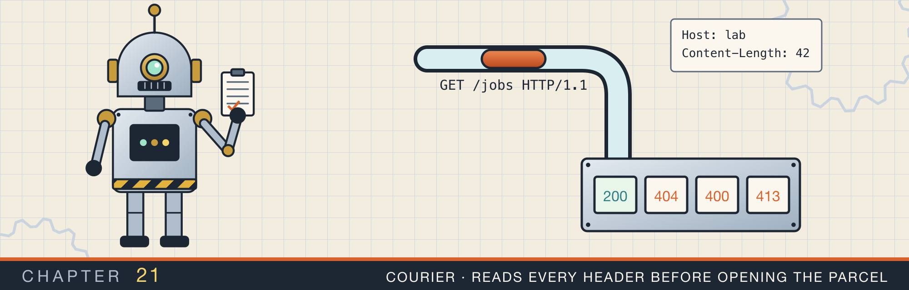
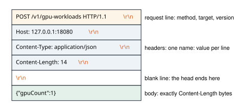
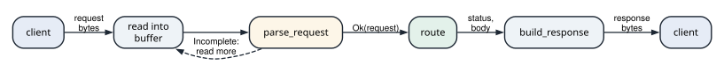
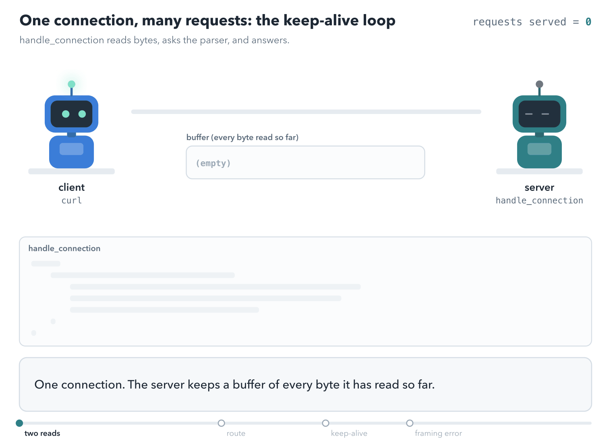

# Parsing and serving HTTP/1.1

<div class="covers" markdown="1">

This chapter covers

- What a request and a response look like on the wire, and how a server finds where a request ends
- Parsing an HTTP/1.1 request from bytes: request line, headers, and body framing
- Why `Content-Length` plus `Transfer-Encoding` must be rejected, and what request smuggling is
- Decoding chunked bodies, enforcing size limits, and reporting "incomplete" as a normal result
- A small REST server: a pure routing function, keep-alive, and status codes
- Reading the server against the RFC, and the three things it gets wrong

</div>

HTTP looks like text with line breaks, but it is a byte stream whose message boundaries are decided by
headers. The security bugs in real servers come from disagreeing about where one request ends and the next
begins. The parser in this chapter is built around that boundary. The server on top of it keeps protocol
handling separate from routing, so each can be tested alone.

## 21.1 Requests and responses on the wire

HTTP/1.1 runs over one TCP connection, the byte stream from chapter 20. The client writes a request into the
connection. The server reads it, works out an answer, and writes a response back on the same connection.

A request is a few lines of text, then an optional body. Every line ends with two bytes, a carriage return
and a line feed, written `\r\n` in Rust strings and called CRLF. Figure 21.1 shows a request that creates a
GPU workload, byte for byte.

<figure>

<figcaption><b>Figure 21.1</b> One request. The head is text lines ending in CRLF, and an empty line separates it from the body.</figcaption>
</figure>

The first line is the **request line**. It has three parts separated by spaces:

- The **method** says what the client wants done. `GET` reads, `POST` creates, and `DELETE` removes.
- The **target** names the thing to act on, here the path `/v1/gpu-workloads`.
- The **version** is `HTTP/1.1`.

Each following line is a **header**: a name, a colon, and a value. `Host` names the server the client meant.
`Content-Type` says what kind of data the body holds. `Content-Length` says how many bytes the body has, here
14.

An empty line ends the **head**. The **body** follows it, and it is exactly `Content-Length` bytes long:
`{"gpuCount":1}` is 14 bytes.

A response has the same shape. Its first line is a **status line**: the version, a three-digit status code,
and a short reason phrase. Codes from 200 to 299 mean success, 400 to 499 mean the client sent something
wrong, and 500 to 599 mean the server failed.

```text
HTTP/1.1 201 Created
Content-Length: 49
Content-Type: application/json
Connection: keep-alive

{"id":"wl-a100-2","gpuCount":1,"state":"Pending"}
```

### 21.1.1 Where one request ends

TCP delivers bytes, not messages. As chapter 20 showed, one `read` can return part of a request, exactly one
request, or one request and the start of the next. The bytes carry no marker that says "a request starts
here". The server has to find the end of each request from the bytes themselves:

1. The head ends at the first empty line, the four bytes `\r\n\r\n`.
2. The head then says how long the body is. `Content-Length` gives a byte count. Section 21.2.4 covers the
   other way, a body sent in sized pieces.

The next request depends on it too. HTTP/1.1 keeps a connection open after a response, so the client can
send another request without a new TCP handshake. This is called **keep-alive**. The server
can read the second request only if it knows exactly where the first one stopped.

### 21.1.2 The parts of the server

Figure 21.2 shows the pieces of the server in this chapter and the order in which a request passes through
them.

<figure>

<figcaption><b>Figure 21.2</b> One request through the server. The parser sends the server back to read more until a whole request has arrived.</figcaption>
</figure>

- The server reads bytes from the connection and appends them to a buffer.
- `parse_request` looks at the whole buffer. If the request is not complete yet, it says `Incomplete`, and
  the server reads more. If it is complete, it returns a `Request` value.
- `route` decides the answer from the `Request`: a status code and a body. It never sees bytes or sockets.
- `build_response` turns the answer into the bytes of a response, which the server writes back.

The parser, the read loop, and the response bytes are the protocol. `route` is the application. Keeping
them apart means each can be tested without the other: the parser with byte strings, and `route` with
`Request` values.

## 21.2 The parser

The parser is one file, `src/problems/http_request.rs`. Listing 21.1 in section 21.4 is the whole file.

### 21.2.1 Types first

The file opens with its vocabulary. `Method` is an enum with a `parse` that returns `None` for an unknown
token, and two predicates from RFC 9110:

```rust
{{#include ../../rust-interview-lab/src/problems/http_request.rs:10:45}}
```

`is_safe` is true for GET, HEAD, and OPTIONS, which do not change state. `is_idempotent` adds PUT and
DELETE to those. Chapter 19's retry loop is the consumer that needs `is_idempotent`.

`Version` has two variants because the parser accepts two. `Limits` carries the header and body caps, with
defaults of 16 KiB and 8 MiB:

```rust
{{#include ../../rust-interview-lab/src/problems/http_request.rs:47:66}}
```

`Request` holds what the parser found:

```rust
{{#include ../../rust-interview-lab/src/problems/http_request.rs:68:100}}
```

`Request::header` finds a header case-insensitively, because header names are case-insensitive. Then
`should_keep_alive` encodes the one rule that differs by version. HTTP/1.1 keeps the connection open
unless the client sends `Connection: close`. HTTP/1.0 closes it unless the client sends `Connection:
keep-alive`. The `has` closure splits the header on commas because `Connection` carries a list.

`ParseError` distinguishes the cases a server must treat differently:

```rust
{{#include ../../rust-interview-lab/src/problems/http_request.rs:102:112}}
```

`Incomplete` is not a failure: it means "read more bytes and try again", and the server's loop in section
21.3 depends on it. `PayloadTooLarge` maps to status 413, `MissingHost` and `Malformed` to 400.

### 21.2.2 The head of the request

`parse_request` works on `&[u8]`, not `&str`, because an HTTP body is arbitrary bytes and only the head is
text. It first looks for the blank line that ends the head, `\r\n\r\n`, with `windows(4).position(...)`:

```rust
{{#include ../../rust-interview-lab/src/problems/http_request.rs:134:151}}
    // ...
}
```

If the blank line is missing, the request is `Incomplete`. The exception is a buffer already larger than
`max_header_bytes`: then the client is sending an endless header and gets `PayloadTooLarge`. That check
stops a slow client from holding memory with a header that never ends. Figure 21.3 shows the order of the
remaining checks.

<figure>

<figcaption><b>Figure 21.3</b> The order of checks in <code>parse_request</code> and <code>parse_body</code>.</figcaption>
</figure>

The request line must be exactly three space-separated parts: a known method, a non-empty target, and
`HTTP/1.1` or `HTTP/1.0`. A fourth part is an error.

```rust
pub fn parse_request(input: &[u8], limits: Limits) -> Result<Request, ParseError> {
    // ...
{{#include ../../rust-interview-lab/src/problems/http_request.rs:153:180}}
    // ...
}
```

Header lines are split at the first colon. A name with whitespace is rejected, because RFC 9112 forbids
whitespace between the name and the colon. A line that starts with a space or tab is *obsolete line
folding*, a continuation syntax the RFC deprecates. Since different servers interpret it differently, the
parser rejects it.

```rust
pub fn parse_request(input: &[u8], limits: Limits) -> Result<Request, ParseError> {
    // ...
{{#include ../../rust-interview-lab/src/problems/http_request.rs:182:206}}
    // ...
}
```

HTTP/1.1 requires exactly one `Host` header. The count uses `filter(...).count() != 1`, which rejects both
zero and two.

```rust
pub fn parse_request(input: &[u8], limits: Limits) -> Result<Request, ParseError> {
    // ...
{{#include ../../rust-interview-lab/src/problems/http_request.rs:208:216}}
    // ...
}
```

### 21.2.3 Body framing and request smuggling

`parse_body` decides how long the body is. A request with both `Content-Length` and `Transfer-Encoding` is
rejected as `AmbiguousBodyLength`:

```rust
{{#include ../../rust-interview-lab/src/problems/http_request.rs:229:248}}
    // ...
}
```

The reason is request smuggling (figure 21.4). A front-end proxy may frame a request by `Content-Length`,
while the back-end server frames the same bytes by `Transfer-Encoding: chunked`. The two then disagree
about where the request ends. The attacker places a second request in the part the back-end treats as
"after the body". The back-end runs it as though it arrived on its own, past whatever checks the proxy
applied. Refusing ambiguous framing outright, and closing the connection, removes the disagreement.

<figure>

<figcaption><b>Figure 21.4</b> A CL.TE desynchronization. The parser answers such a request with 400 and closes the connection.</figcaption>
</figure>

<figure class="anim">
<video class="motion" src="figures/ch21-http-framing.mp4" autoplay loop muted playsinline preload="metadata" aria-label="A request's bytes stream into a buffer. The parser slides a window until it finds the blank line that ends the head, then splits the request line and headers into fields. With Content-Length: 5, a ruler counts five body bytes. With Transfer-Encoding: chunked, the parser reads a size line, takes that many bytes, and stops at the zero-size chunk. Last, one message carries both headers: a proxy frames it by Content-Length and sees one request, a back-end frames it by chunks and finds a hidden GET /admin after the body. The parser refuses the message with 400 and closes the connection." data-chapters="[[0.0, &quot;the head&quot;], [14.1, &quot;Content-Length&quot;], [23.7, &quot;chunked&quot;], [40.08, &quot;both&quot;]]"></video>
<figcaption><b>Animation 21.1</b> The head ends at the first blank line. <code>Content-Length</code> or chunked encoding then sets where the body ends. A message with both is refused with 400.</figcaption>
</figure>

`Transfer-Encoding` values from every such header are joined and split into codings. The parser supports
only `chunked`, and requires it to be last, because a body whose final coding is not `chunked` has no
defined end. Anything else is `UnsupportedTransferEncoding`.

```rust
fn parse_body(
    input: &[u8],
    body_start: usize,
    headers: &[(String, String)],
    limits: Limits,
) -> Result<Vec<u8>, ParseError> {
    // ...
{{#include ../../rust-interview-lab/src/problems/http_request.rs:250:268}}
    // ...
}
```

Multiple `Content-Length` headers are allowed only if they all agree. The check parses each value and
compares with `lengths.any(|length| length != Ok(first))`, comparing `Result`s directly. A length above
`max_body_bytes` is rejected *before* the server waits for the bytes. A client cannot claim a huge body and
make the server buffer it. If fewer bytes than the length have arrived, the result is `Incomplete`.

```rust
fn parse_body(
    input: &[u8],
    body_start: usize,
    headers: &[(String, String)],
    limits: Limits,
) -> Result<Vec<u8>, ParseError> {
    // ...
{{#include ../../rust-interview-lab/src/problems/http_request.rs:270:291}}
}
```

### 21.2.4 Chunked bodies

`decode_chunked` walks a cursor through `size-in-hex CRLF data CRLF` records until a size of 0. Chunk
extensions after a `;` are ignored, as the RFC permits.

```rust
{{#include ../../rust-interview-lab/src/problems/http_request.rs:294:311}}
        // ...
    }
}
```

A size of 0 ends the body, after optional trailer lines up to an empty line:

```rust
fn decode_chunked(data: &[u8], max_body: usize) -> Result<Vec<u8>, ParseError> {
    // ...
    loop {
        // ...
{{#include ../../rust-interview-lab/src/problems/http_request.rs:313:323}}
        // ...
    }
}
```

Each other chunk checks the running total against the body limit. It computes the chunk's end with
`checked_add`, returns `Incomplete` if the data has not all arrived, and insists on the CRLF after the
data.

```rust
fn decode_chunked(data: &[u8], max_body: usize) -> Result<Vec<u8>, ParseError> {
    // ...
    loop {
        // ...
{{#include ../../rust-interview-lab/src/problems/http_request.rs:325:338}}
    }
}
```

`find_crlf` uses `data.get(from..)?` so that a cursor past the end is `None` rather than a panic.

```rust
{{#include ../../rust-interview-lab/src/problems/http_request.rs:342:347}}
```

One arithmetic detail needs tightening. `body.len() + size > max_body` runs before the `checked_add`, and
a chunk size near `usize::MAX` overflows that addition. `from_str_radix` parses such a size from sixteen
`f`s. The form `size > max_body - body.len()` cannot overflow.

`parse_request` returns the request but not how many bytes it consumed. A caller therefore cannot find the
start of a second, pipelined request in the same buffer. The server below accepts that limitation, and its
module comment says so.

## 21.3 A small REST server

The server is `src/bin/http_server.rs`. Listing 21.2 in section 21.4 is the whole file.

### 21.3.1 Routing as a pure function

`route(&Request) -> (u16, &'static str, Vec<u8>)` decides the status, content type, and body without
touching a socket:

```rust
{{#include ../../rust-interview-lab/src/bin/http_server.rs:36:47}}
    // ...
}
```

A known path with an unsupported method returns 405, an unknown path 404.

```rust
pub fn route(request: &Request) -> (u16, &'static str, Vec<u8>) {
    // ...
{{#include ../../rust-interview-lab/src/bin/http_server.rs:49:63}}
    // ...
}
```

For `/v1/gpu-workloads/{id}`, `strip_prefix` extracts the id, and an empty id or one containing `/` is a
404.

```rust
pub fn route(request: &Request) -> (u16, &'static str, Vec<u8>) {
    // ...
{{#include ../../rust-interview-lab/src/bin/http_server.rs:65:80}}
}
```

Its doc comment gives the reason it is a separate function: it is unit-testable. The tests at the bottom
of the file exercise every route by building a `Request` value directly.

`build_response` writes the status line, `Content-Length`, an optional `Content-Type`, and a `Connection`
header that tells the client what the server will do:

```rust
{{#include ../../rust-interview-lab/src/bin/http_server.rs:100:116}}
```

### 21.3.2 The connection loop

`handle_connection` accumulates bytes in `buffer` and asks the parser what it has (figure 21.5).

<figure>

<figcaption><b>Figure 21.5</b> The keep-alive loop in <code>handle_connection</code>.</figcaption>
</figure>

On `Ok`, it routes, writes the response, and either closes or clears the buffer for the next request:

```rust
{{#include ../../rust-interview-lab/src/bin/http_server.rs:134:152}}
            // ...
        }
    }
}
```

On `Incomplete`, it reads more; a read of 0 means the client left mid-request. Any other error gets a 400
whose body is the error's `Display` text, and the connection closes. After a framing error the server
cannot know where the next request starts.

```rust
fn handle_connection(mut stream: TcpStream) -> std::io::Result<()> {
    // ...
    loop {
        match parse_request(&buffer, limits) {
            // ...
{{#include ../../rust-interview-lab/src/bin/http_server.rs:153:166}}
        }
    }
}
```

<figure class="anim">
<video class="motion" src="figures/ch21-keep-alive.mp4" autoplay loop muted playsinline preload="metadata" aria-label="A client and the server's connection loop. The first request arrives in two reads: the first read leaves the parser with Incomplete, so the loop reads again, and the second read completes the head. The parser returns Ok, route answers 200, the response goes back with Connection: keep-alive, and the buffer is cleared. A second request on the same connection is routed the same way. Last, a request with both Content-Length and Transfer-Encoding gets 400 and the connection closes." data-chapters="[[0.0, &quot;two reads&quot;], [20.46, &quot;route&quot;], [31.02, &quot;keep-alive&quot;], [39.54, &quot;framing error&quot;]]"></video>
<figcaption><b>Animation 21.2</b> The first request arrives in two reads, so the parser returns <code>Incomplete</code> once. The second reuses the connection. The third has both framing headers, gets 400, and the connection closes.</figcaption>
</figure>

A session with `curl` and `nc` against the server, started with
`cargo run --bin http_server 127.0.0.1:18080`:

```text
$ curl -si http://127.0.0.1:18080/healthz
HTTP/1.1 200 OK
Content-Length: 3
Content-Type: text/plain
Connection: keep-alive

ok
$ curl -si -X POST -d '{"gpuCount":1}' http://127.0.0.1:18080/v1/gpu-workloads
HTTP/1.1 201 Created
Content-Length: 49
Content-Type: application/json
Connection: keep-alive

{"id":"wl-a100-2","gpuCount":1,"state":"Pending"}
$ printf 'POST / HTTP/1.1\r\nHost: x\r\nContent-Length: 5\r\nTransfer-Encoding: chunked\r\n\r\nhello' | nc 127.0.0.1 18080
HTTP/1.1 400 Bad Request
Content-Length: 59
Content-Type: text/plain
Connection: close

Content-Length and Transfer-Encoding are mutually exclusive
```

### 21.3.3 Reading the server against the RFC

The same session shows three places where the server departs from RFC 9110. None of them is hard to fix,
and finding them is good practice.

```text
$ curl -si -X DELETE http://127.0.0.1:18080/v1/gpu-workloads/wl-7
HTTP/1.1 204 No Content
Content-Length: 0
Connection: keep-alive

$ printf 'HEAD /healthz HTTP/1.1\r\nHost: x\r\nConnection: close\r\n\r\n' | nc 127.0.0.1 18080
HTTP/1.1 200 OK
Content-Length: 3
Content-Type: text/plain
Connection: close

ok
```

- **HEAD must not carry a body.** A HEAD response repeats the GET headers, including the
  `Content-Length` of a body it does not send. The server sends `ok`. A client that
  trusts the spec reads those three bytes as the start of the *next* response. The fix is one line in
  `handle_connection`: skip `body` when `request.method == Method::Head`.
- **204 must not carry `Content-Length`.** `build_response` always writes it. Skipping it for 204 (and
  1xx) fixes that.
- **Errors all become 400.** `PayloadTooLarge` deserves 413, and `status_reason` already has its text.
  Mapping `ParseError` to a status in one `match` fixes it. A 405 should also carry an `Allow` header
  listing the methods that path supports.

Two more points concern safety rather than the RFC. The id is interpolated into JSON with `format!`, so an
id containing `"` produces invalid JSON; a real server serializes with `serde_json`. And `buffer.clear()`
after each request discards any pipelined bytes that arrived with it, which the module comment
acknowledges.

## 21.4 The complete programs

<p class="listing"><b>Listing 21.1</b> An HTTP/1.1 request parser with framing checks and limits. <a href="https://github.com/arpanpathak/cracking-the-systems-programming-interview/blob/prep-v2/rust-interview-lab/src/problems/http_request.rs">src/problems/http_request.rs</a></p>

```rust
{{#include ../../rust-interview-lab/src/problems/http_request.rs}}
```

<p class="listing"><b>Listing 21.2</b> Routes, responses, and a keep-alive loop over <code>std::net</code>. <a href="https://github.com/arpanpathak/cracking-the-systems-programming-interview/blob/prep-v2/rust-interview-lab/src/bin/http_server.rs">src/bin/http_server.rs</a></p>

```rust
{{#include ../../rust-interview-lab/src/bin/http_server.rs}}
```

## 21.5 Questions that come up

**"How does a server know where an HTTP/1.1 request body ends?"**
`Transfer-Encoding: chunked` means read chunks until a zero-size chunk. Else `Content-Length` gives the
count. With neither header there is no body. For responses, closing the connection can also end the body.

**"What is request smuggling, and how do you prevent it?"**
Two servers frame the same bytes differently, so each sees a different message.
Reject requests with both framing headers. Reject conflicting `Content-Length`s. Close the
connection after any framing error.

**"How do you stop a client from exhausting your server's memory?"**
Limit header size and body size. Check the declared length before reading the body. Time out idle
and slow connections.

**"Why is routing a separate pure function?"**
So the rules are testable without sockets. The protocol code (framing, keep-alive) can then be changed
without touching the application logic.

**"What does HTTP/2 change?"**
Binary framing with explicit lengths, many concurrent streams on one connection, and header compression.
Framing ambiguity of the HTTP/1.1 kind disappears inside HTTP/2, although it can return where a proxy
downgrades to HTTP/1.1.
