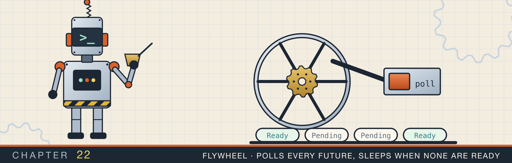
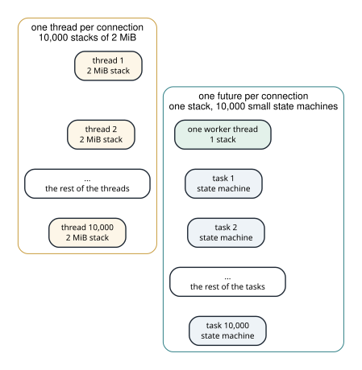
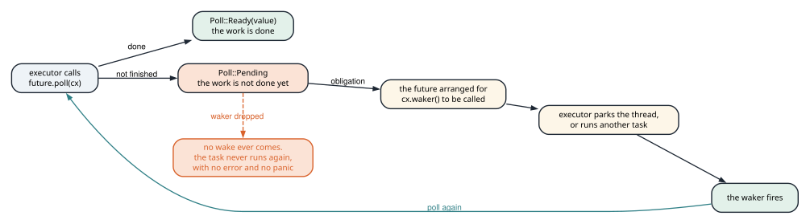
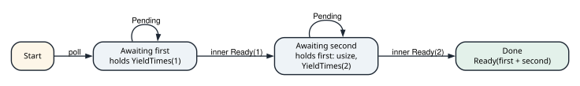
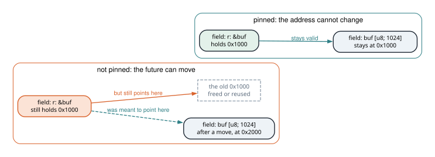

# Async Rust from the executor up

<div class="covers" markdown="1">

This chapter covers

- What `Future::poll`, `Poll::Pending`, and a `Waker` promise each other
- Why one thread can hold thousands of waiting connections
- `block_on`: an executor in a dozen lines that parks the thread between polls
- Two futures written by hand: one that yields, and one that waits on a timer
- A task queue where waking a task is the same as scheduling it
- What an `async` block compiles to, and why `poll` takes `Pin<&mut Self>`
- Two HTTP clients with caching and retries, one blocking and one on Tokio

</div>

Chapter 20's echo server gave every client a thread, and chapter 21 parsed HTTP on top of it. That design works for tens or hundreds of clients. It stops working when a program holds thousands of mostly idle connections.

This chapter builds the runtime that replaces one thread per connection with one thread and many waiting tasks. It starts at the bottom, with the single method a `Future` has, and works up to a client on Tokio.

## 22.1 Why a thread per connection does not scale

A spawned thread in Rust is given a stack of 2 MiB by default. The stack stays reserved for as long as the thread lives, including all the time the thread spends parked in `read`. Ten thousand idle connections held as threads reserve about 20 GB of address space before any work happens.

The alternative is to keep one thread and represent each connection as a **future**. A future is a value that may not have finished yet. While it waits, it is not running on a thread. It is a small object that records where it stopped and what it was doing.

A **task** is a future a runtime has taken responsibility for. The runtime will poll the future again when there is a reason to.

A suspended future holds only the values alive across its pause points. An idle connection can be a few hundred bytes instead of two megabytes. Ten thousand of them fit in a few megabytes rather than tens of gigabytes. Figure 22.1 contrasts the two arrangements.

<figure>

<figcaption><b>Figure 22.1</b> A parked thread keeps its stack. A parked future keeps only the values it needs to resume.</figcaption>
</figure>

The cost of this saving is that waiting has to be written as a state machine. `async` and `.await` are the notation that lets the state machine still look like ordinary code.

You can now work out what a thread-per-connection design costs, and name what a future stores instead.

## 22.2 The contract

The chapter starts with the one method a `Future` has. A type that implements `Future` answers a single question: has the work finished?

```rust
fn poll(self: Pin<&mut Self>, cx: &mut Context<'_>) -> Poll<Self::Output>;
```

`poll` returns `Poll::Ready(value)` when the work is done. It returns `Poll::Pending` when the work is not finished yet.

`Pending` carries an obligation. Before returning it, the future must arrange for `cx.waker()` to be called once progress is possible. The waker is a handle the executor gives to the future. Calling it tells the executor that this task should be polled again.

The executor has the matching obligation. It polls the task again after a wake. Until a wake arrives it does not poll the task, and it does not spin. Figure 22.2 draws both sides.

<figure>

<figcaption><b>Figure 22.2</b> The poll contract. A dropped waker is the one branch with no error and no panic.</figcaption>
</figure>

Two rules follow from the contract. Polling a future that is not ready is always safe: it returns `Pending` again, so a spurious wake costs one wasted poll. Forgetting to arrange a wake is not safe: the task returns `Pending`, nothing calls its waker, and the task never runs again.

<div class="callout warning" markdown="1">

**WARNING** The second failure has no symptom. There is no panic, no error, and no CPU use. One task stops making progress while the rest of the program carries on. When an async program hangs for no visible reason, look first for a waker that was dropped instead of called.

</div>

One part of the signature is explained in section 22.6: `poll` takes `Pin<&mut Self>`, not `&mut self`. For now, read it as a promise that the future will not move in memory between polls.

You can now state what each side of the contract promises, and say which broken promise shows up as a hang.

## 22.3 The smallest executor

`.await` does not call the operating system. Something has to call `poll` and decide what a `Pending` result means. That something is an **executor**.

The smallest useful executor drives one future on the current thread. When the future is not ready, it parks the thread rather than polling again. Listing 22.1 is the whole of it.

<p class="listing"><b>Listing 22.1</b> <code>block_on</code> and its waker (lines 36 to 61). <a href="https://github.com/arpanpathak/cracking-the-systems-programming-interview/blob/prep-v2/rust-interview-lab/src/problems/async_mini.rs">src/problems/async_mini.rs</a></p>

```rust
{{#include ../../rust-interview-lab/src/problems/async_mini.rs:17:29}}

{{#include ../../rust-interview-lab/src/problems/async_mini.rs:36:61}}
```

`block_on` does three things, in order:

1. `Box::pin(future)` moves the future to the heap and pins it there, so its address is the same for every poll.
2. `Waker::from(Arc::new(ThreadWaker(thread::current())))` builds a waker. `ThreadWaker` implements `Wake`, and its `wake` method unparks the thread driving the future. `Waker::from` is the safe way to build a waker without writing a raw vtable.
3. The loop polls. `Ready` returns the value. `Pending` calls `thread::park()`, which sleeps until `unpark` is called on this thread.

`park` can return without anyone calling `unpark`. The loop tolerates that by polling again: a second poll of a future that is not ready returns `Pending` a second time. Spurious wakes are harmless, which is the other half of the contract.

`park` and `unpark` also cover a race the loop depends on. If `unpark` runs before `park`, it leaves a token behind, and the next `park` returns at once.

<figure class="anim">
<video class="motion" src="figures/ch22-poll-wake.mp4" autoplay loop muted playsinline preload="metadata" aria-label="A robot labelled executor thread polls a future that waits on a timer, and hands it a waker drawn as a bell. The future's ready flag is false, so it stores the bell in its waker slot and returns Pending. The executor parks, and its CPU gauge falls to zero. A timer thread sleeps for 50 ms, sets ready to true, takes the bell out of the slot, and rings it, which unparks the executor. The second poll returns Ready. The run then repeats with the line that stores the waker deleted: the timer finds the slot empty, and the executor stays parked forever." data-chapters="[[0.0, &quot;cast&quot;], [4.74, &quot;poll&quot;], [27.42, &quot;park&quot;], [33.14, &quot;wake&quot;], [48.86, &quot;ready&quot;], [63.26, &quot;no waker&quot;]]"></video>
<figcaption><b>Animation 22.1</b> <code>block_on</code> driving a future that waits on a timer, the <code>Delay</code> of section 22.4.2, with the line each thread is running. In the second run the waker is never stored, and the executor never wakes.</figcaption>
</figure>

You can now read `block_on` line by line and explain why an idle future costs no CPU.

## 22.4 Two futures written by hand

Almost every future has one of two shapes. The first re-arms itself and asks to be polled again. The second waits on an event outside the executor, and keeps the waker of whoever is waiting for it.

### 22.4.1 A future that yields to itself

`YieldTimes` returns `Pending` a set number of times before it completes. Nothing is blocking it. It is giving the executor a chance to run other tasks before it finishes its own work.

<p class="listing"><b>Listing 22.2</b> <code>YieldTimes</code>, a future that re-arms itself (lines 63 to 97). <a href="https://github.com/arpanpathak/cracking-the-systems-programming-interview/blob/prep-v2/rust-interview-lab/src/problems/async_mini.rs">src/problems/async_mini.rs</a></p>

```rust
{{#include ../../rust-interview-lab/src/problems/async_mini.rs:63:97}}
```

`YieldTimes` holds two `usize` values, which makes it `Unpin`: safe to move even after a poll. `self.get_mut()` uses that to turn `Pin<&mut Self>` into `&mut Self` without `unsafe`.

One line asks for the next poll: `context.waker().wake_by_ref()`. It runs, then `poll` returns `Pending`. This is what `tokio::task::yield_now` does. `YieldTimes` completes with the number of times it yielded. A test can use that count to check that the executor suspended and resumed it.

### 22.4.2 A future that waits on a timer

`Delay` completes after a wall-clock duration. It is the second shape, and it is the one that looks like real I/O.

Its state is a `ready` flag and an optional stored `Waker`, shared with a background thread through `Arc<Mutex<_>>`.

<p class="listing"><b>Listing 22.3</b> <code>Delay</code> state and constructor (lines 99 to 135). <a href="https://github.com/arpanpathak/cracking-the-systems-programming-interview/blob/prep-v2/rust-interview-lab/src/problems/async_mini.rs">src/problems/async_mini.rs</a></p>

```rust
{{#include ../../rust-interview-lab/src/problems/async_mini.rs:99:135}}
```

`poll` checks `ready`. While it is false, `poll` stores a clone of the current waker and returns `Pending`.

<p class="listing"><b>Listing 22.4</b> <code>Delay</code> as a future (lines 137 to 149). <a href="https://github.com/arpanpathak/cracking-the-systems-programming-interview/blob/prep-v2/rust-interview-lab/src/problems/async_mini.rs">src/problems/async_mini.rs</a></p>

```rust
{{#include ../../rust-interview-lab/src/problems/async_mini.rs:137:149}}
```

The background thread sleeps, sets `ready`, takes the waker out of the state, releases the lock, and calls `wake()`. Figure 22.3 shows the exchange.

<figure>

<figcaption><b>Figure 22.3</b> One <code>Delay</code> from start to finish. The executor thread sleeps in <code>park</code>, not in <code>poll</code>.</figcaption>
</figure>

Two details make it correct. `poll` stores the waker on every `Pending`, not only the first. A task can be polled with a different waker each time. A runtime may move the task to another thread, and only the latest waker reaches its current owner. The timer thread wakes after dropping the lock, so the woken executor does not immediately block on a mutex the waker still held.

A real runtime replaces one thread per timer with a single timer wheel. It replaces the thread per socket with the `epoll` loop from chapter 20. That loop's reactor keeps wakers by file descriptor, and wakes them when `epoll_wait` reports the descriptor ready.

You can now write both shapes: a future that re-arms itself, and a future that keeps a waker for an outside event.

## 22.5 Waking is scheduling

`block_on` drives one future. A general executor drives many, and it shows that waking a task and scheduling it are the same operation.

A `Task` holds its future, a handle to the executor's queue, and a `completed` flag. It also implements `Wake`. Waking a task pushes an `Arc` of the task back on the queue.

<p class="listing"><b>Listing 22.5</b> A task, and the <code>Wake</code> impl that reschedules it (lines 151 to 172). <a href="https://github.com/arpanpathak/cracking-the-systems-programming-interview/blob/prep-v2/rust-interview-lab/src/problems/async_mini.rs">src/problems/async_mini.rs</a></p>

```rust
{{#include ../../rust-interview-lab/src/problems/async_mini.rs:151:172}}
```

`spawn` wraps a future in a task and enqueues it.

<p class="listing"><b>Listing 22.6</b> The executor's queue, and <code>spawn</code> (lines 179 to 203). <a href="https://github.com/arpanpathak/cracking-the-systems-programming-interview/blob/prep-v2/rust-interview-lab/src/problems/async_mini.rs">src/problems/async_mini.rs</a></p>

```rust
{{#include ../../rust-interview-lab/src/problems/async_mini.rs:179:203}}
    // ...
}
```

`run` pops tasks one at a time, builds a waker from the task itself, and polls the future. A `Ready` result marks the task completed, so a late wake is skipped by the `completed` check.

<p class="listing"><b>Listing 22.7</b> <code>MiniExecutor::run</code> (lines 205 to 232). <a href="https://github.com/arpanpathak/cracking-the-systems-programming-interview/blob/prep-v2/rust-interview-lab/src/problems/async_mini.rs">src/problems/async_mini.rs</a></p>

```rust
impl MiniExecutor {
    // ...
{{#include ../../rust-interview-lab/src/problems/async_mini.rs:205:232}}
}
```

<figure class="anim">
<video class="motion" src="figures/ch22-task-queue.mp4" autoplay loop muted playsinline preload="metadata" aria-label="Three task tickets wait on a run queue. Each ticket shows its YieldTimes future, the yields it has left, and a bell for its waker. The executor pops the front ticket and polls it. A yield uses up one dot and rings the ticket's own bell, and the ticket flies to the back of the queue. A ticket with no yields left is stamped Ready and moves to the completed column, in the order 1, 2, 3. In a second run, task 1 returns Pending without ringing its bell. It drops out of the queue and is never polled again, while tasks 2 and 3 finish." data-chapters="[[0.0, &quot;spawn&quot;], [5.46, &quot;round 1&quot;], [38.22, &quot;round 2&quot;], [46.68, &quot;the rest&quot;], [65.87, &quot;no wake&quot;]]"></video>
<figcaption><b>Animation 22.2</b> Three tasks take turns on one thread. Waking a task pushes it onto the back of the queue. A task that returns <code>Pending</code> without waking is never polled again.</figcaption>
</figure>

`run` returns when the queue is empty. A task that returned `Pending` without waking is waiting on something outside this executor, and this executor has nothing to park on. A real runtime would park on its timer or its I/O reactor instead of returning.

The `+ Send` bound on spawned futures comes from the waker. A waker may be sent to another thread, as `Delay` does, so the task it can reach must be safe to send too. This is the same bound `tokio::spawn` imposes. It is also why holding a `std::sync::MutexGuard` or an `Rc` across an `.await` in a spawned task is a compile error.

Listings 22.8 and 22.9 are the complete pair: the runtime module, and the program that drives it, with no runtime dependency.

<p class="listing"><b>Listing 22.8</b> The complete runtime, with tests. <a href="https://github.com/arpanpathak/cracking-the-systems-programming-interview/blob/prep-v2/rust-interview-lab/src/problems/async_mini.rs">src/problems/async_mini.rs</a></p>

```rust
{{#include ../../rust-interview-lab/src/problems/async_mini.rs}}
```

<p class="listing"><b>Listing 22.9</b> The program that drives the runtime. <a href="https://github.com/arpanpathak/cracking-the-systems-programming-interview/blob/prep-v2/rust-interview-lab/src/bin/async_demo.rs">src/bin/async_demo.rs</a></p>

```rust
{{#include ../../rust-interview-lab/src/bin/async_demo.rs}}
```

```text
$ cargo run --bin async_demo
== block_on drives a hand-written future ==
YieldTimes suspended and resumed 3 time(s)

== block_on drives an async block ==
async block finished with 3

== block_on parks the thread until the waker fires ==
Delay completed after 52.083242ms

== MiniExecutor runs independent tasks ==
task 1 completed after 1 yield(s)
task 2 completed after 2 yield(s)
task 3 completed after 3 yield(s)
3 task(s) completed
```

The tasks finish in the order 1, 2, 3 because each yield sends its task to the back of the queue. Each task takes a turn, as in the round-robin scheduler of chapter 15, with a yield as the end of a time slice.

You can now follow a task from `spawn` to `Ready`, and say what `wake` does to the queue.

## 22.6 What `async` compiles to, and why `Pin`

An `async` block or function is notation. The compiler turns it into an anonymous type that implements `Future`. That type is usually an enum with one variant per suspension point, and each variant holds the values alive across that point.

The block used by the demo is:

```rust
async {
    let first = YieldTimes::new(1).await;
    let second = YieldTimes::new(2).await;
    first + second
}
```

The compiler writes an enum with four states: `Start`, `Awaiting first`, `Awaiting second`, and `Done`. Figure 22.4 shows the states and the values each one keeps.

<figure>

<figcaption><b>Figure 22.4</b> The state machine behind the async block. The value <code>first</code> survives the second <code>.await</code>, so it is stored in the second state.</figcaption>
</figure>

Polling the block runs code until the next `.await` whose inner future returns `Pending`. It saves the state, stores the inner future and the live locals, and returns `Pending` too. A later poll resumes at the saved state rather than starting the block again.

<figure class="anim">
<video class="motion" src="figures/ch22-await.mp4" autoplay loop muted playsinline preload="metadata" aria-label="The async block's code, with a bookmark at the await where the next poll resumes, beside the future's memory: a state tag and two slots. Poll 1 runs to the first await, stores YieldTimes(1), and the tag flips to AwaitingFirst. Poll 2 resumes at the bookmark. first = 1 moves into memory, YieldTimes(2) is stored, and the tag flips to AwaitingSecond. Poll 3 returns Pending and stays in the same state. Poll 4 computes first + second = 3, returns Ready(3), and the tag flips to Done. A fifth poll would find Done and panic." data-chapters="[[0.0, &quot;the block&quot;], [5.46, &quot;poll 1&quot;], [20.58, &quot;poll 2&quot;], [43.5, &quot;poll 3&quot;], [53.04, &quot;poll 4&quot;], [69.78, &quot;poll 5?&quot;]]"></video>
<figcaption><b>Animation 22.3</b> The same block, one poll at a time. <code>first</code> lives across the second <code>.await</code>, so the future stores it. <code>second</code> does not, so the future never stores it.</figcaption>
</figure>

`first` survives the second `.await`, so it is stored in the `Awaiting second` state. The size of a future is fixed once its type is known. The compiler sizes each state to hold the largest set of locals that can live there.

The remaining question is why `poll` takes `Pin<&mut Self>`. A state can hold a reference to another field of the same state machine. One example is a local buffer that is borrowed and still used across an `.await`. If the machine moved after the borrow was created, the reference would point at the old location. Figure 22.5 shows the two cases.

<figure>

<figcaption><b>Figure 22.5</b> Why a self-referential future must not move. Pinning keeps a borrow of one field valid across a suspension point.</figcaption>
</figure>

`Pin<&mut Self>` is the promise that the value will not move after the first poll. That is why `block_on` calls `Box::pin` and why `MiniExecutor` stores `Pin<Box<...>>`. Both keep the future at one address for its whole life.

Pinning is not a property of every type. A type whose values are safe to move even after a poll is `Unpin`, and for those types pinning adds no restriction. `YieldTimes` is `Unpin` because it holds two integers, so its `poll` can call `self.get_mut()` and work with `&mut Self` directly.

<figure class="anim">
<video class="motion" src="figures/ch22-pin.mp4" autoplay loop muted playsinline preload="metadata" aria-label="A future holds buf, the bytes p i n g, and r, a reference to buf that holds the address 0x1000. The future moves to 0x2000. Its bytes are copied, but r still holds 0x1000, so its arrow stretches back to the freed place, which now holds garbage. Next, Box::pin puts the future on the heap, marked with a pin. Moving the Pin&lt;Box&lt;_&gt;&gt; handle from one stack slot to another leaves the future where it is, so r stays valid. An attempt to swap the future out is rejected at compile time. Last, a YieldTimes value, which is Unpin, moves freely." data-chapters="[[0.0, &quot;a borrow&quot;], [5.7, &quot;a move&quot;], [25.5, &quot;pinned&quot;], [39.72, &quot;rejected&quot;], [46.38, &quot;Unpin&quot;]]"></video>
<figcaption><b>Animation 22.4</b> A move copies bytes and leaves a reference into the old copy behind. <code>Box::pin</code> keeps the future at one address, so moving the handle the program holds moves only a pointer.</figcaption>
</figure>

You can now read an `async` block as an enum of states, and explain what `Pin` stops the compiler from doing.

## 22.7 Two HTTP clients with caching, retries, and idempotency

The last two programs put a runtime to work. Both send `POST /post` with a JSON body to `httpbin.org`, a public echo service, with the idempotency key `create-demo-001`. Both have the same three layers: a cache, a retry policy, and a transport. Figure 22.6 shows the stacks.

<figure>

<figcaption><b>Figure 22.6</b> The same three layers in both clients: cache, retry, transport.</figcaption>
</figure>

Chapter 19 built retries and idempotency keys on their own. Here they meet a network call.

### 22.7.1 A blocking client over `TcpStream`

The blocking client composes its three layers in one line:

```rust
self.cache.get_or_insert(key, || self.retry.execute(|| self.send(req)))
```

`IdemCache` is chapter 19's `Idempotent<K, V>` store under another name. `RetryPolicy::execute` retries any error with a doubling delay, `base × 2^(attempt - 1)`, capped at `max_delay`. `RequestType` is an enum whose variants carry exactly the fields each method needs: `Get` has no body, and `Post` has one. `main` reads with a `GET`, then creates an item with a `POST`.

`send` writes the request by hand. It writes the request line, `Host`, `Connection: close`, and the caller's headers. A body adds `Content-Length`, a blank line, and then the body. `Connection: close` lets `read_to_string` work as the response reader, because the server closes the connection at the end. Chapter 17's parser is the other side of this conversation.

<p class="listing"><b>Listing 22.10</b> Cache, retry, and a hand-written HTTP/1.1 request. <a href="https://github.com/arpanpathak/cracking-the-systems-programming-interview/blob/prep-v2/rust-interview-lab/src/bin/fun_network_call.rs">src/bin/fun_network_call.rs</a></p>

```rust
{{#include ../../rust-interview-lab/src/bin/fun_network_call.rs}}
```

Two gaps separate this from a client you would ship, and both are visible in the code:

- The status code is never read. `send` returns whatever follows the first blank line. A `500` error page is returned as success, cached under the idempotency key, and never retried. Only transport errors reach the retry loop.
- Everything is retried. A policy should ask the error, as `Retryable` does in chapter 19. Here a DNS failure for a misspelled host is retried three times.

### 22.7.2 An async client with `reqwest`

The async client reads the status code and makes retry a decision about it. `RETRY` lists the statuses to retry: 429 and four 5xx codes. The `match` on the status then has three arms:

```rust
match status {
    s if s.is_success() => {
        self.store(key, &text);
        return Ok(text);
    }
    s if RETRY.contains(&s) && attempt < self.cfg.max_attempts => {
        tokio::time::sleep(delay).await;
        delay = (delay * 2).min(self.cfg.max_delay);
    }
    s => return Err(format!("HTTP {s} after {attempt} attempts: {text}").into()),
}
```

`tokio::time::sleep` does not block the thread. It returns a future that registers with Tokio's timer and returns `Pending`, which is the `Delay` of section 22.4.2 done properly. Other tasks run on the same thread while this one waits.

<p class="listing"><b>Listing 22.11</b> The same layers on Tokio. <a href="https://github.com/arpanpathak/cracking-the-systems-programming-interview/blob/prep-v2/rust-interview-lab/src/bin/reqwest_and_tokio.rs">src/bin/reqwest_and_tokio.rs</a></p>

```rust
{{#include ../../rust-interview-lab/src/bin/reqwest_and_tokio.rs}}
```

Several choices in this client are deliberate:

- `Client::builder().timeout(cfg.timeout)` bounds every request. A client without a timeout can wait forever on a server that accepted the connection and never answered.
- The request carries `Idempotency-Key: create-demo-001`, so a server that honors the header can safely deduplicate the retried `POST`. The client-side cache gives the same guarantee within one process.
- The cache is a `std::sync::Mutex`. That is allowed in async code because the guard is never held across an `.await`; `cached` and `store` lock, act, and return. The lock is taken with `unwrap_or_else(|e| e.into_inner())`, chapter 16's ignore-the-poison choice. A `HashMap` insert cannot leave the map half-updated, so recovering the guard is safe here.
- `type Error = Box<dyn std::error::Error + Send + Sync>` lets errors cross task boundaries.

### 22.7.3 The two clients side by side

The asynchronous client has the opposite gap from the blocking one. It reads the status code, but a transport error from `send().await?` is not retried at all. The blocking client retries transport errors and never reads the status code. Merging the two means retrying both, with a policy that asks the error which kind it is.

Neither client adds jitter, and neither honors `Retry-After`. Chapter 19 shows both in its delay policy.

### 22.7.4 Where the merged client belongs

The repository has an empty crate named `rust-async-http-examples`, created for this. Its first program can be the client from section 22.7.2 moved into `lib.rs`, with the retry and cache layers exposed for testing. Its tests can then run against a local server such as chapter 17's, instead of a public one.

## 22.8 Questions that come up

**"What happens when a future returns `Pending`?"**
It has arranged for its waker to be called when it can make progress. The executor stops polling it and runs other tasks. When the waker fires, the executor polls it again.

**"Why does `poll` take `Pin<&mut Self>`?"**
An async state machine can hold a reference into itself across an `.await`. Pinning guarantees the value will not move after the first poll, so that reference stays valid.

**"Why must spawned futures be `Send` in Tokio?"**
The multi-threaded runtime may resume a task on a different worker thread after any `.await`. Everything the task holds across an `.await` must therefore be safe to move between threads.

**"Can you call blocking code inside async?"**
Only briefly. A blocking call holds the worker thread, and every task scheduled on it waits. Use `tokio::task::spawn_blocking` for blocking work, and async versions of I/O and sleep.

**"Is a `std::sync::Mutex` allowed in async code?"**
Yes, if the guard is dropped before the next `.await`. Holding it across an `.await` can block the worker or deadlock it. Use `tokio::sync::Mutex` when the lock must be held across an await.

<div class="summary" markdown="1">

## Summary

- A future has one method, `poll`. `Ready` finishes the task. `Pending` is a promise that the waker will be called when progress becomes possible.
- The executor polls again after a wake and does not spin. Spurious wakes are harmless; a missing wake is a task that never runs again, with no error.
- `block_on` is the whole executor for one future: pin, build a waker from the current thread, poll, and park on `Pending`.
- A future either re-arms itself (`YieldTimes`, `yield_now`) or keeps a waker for an event outside the executor (`Delay`, sockets, timers).
- Waking a task and scheduling it are the same operation. `Task` implements `Wake`, and `wake` pushes the task back on the queue.
- An `async` block compiles to an enum with one variant per suspension point. Each variant holds the values alive across that point.
- `poll` takes `Pin<&mut Self>` because a state can borrow from another field of the same future. Pinning keeps the value at one address, so the borrow stays valid.
- A spawned future must be `Send`, because a waker may move it to another worker thread.
- The two HTTP clients share three layers: cache, retry, and transport. The blocking client never reads the status code; the async one never retries a transport error.

</div>

Chapter 23 goes below the system calls these chapters made. It maps a file into memory and watches the page faults that load it. Then it sends a file to a socket without copying it through the program.

## Exercises

1. Add a poll counter to `block_on` and print it. Check that the count matches the number of wakes for `Delay`, and that a spurious wake adds one poll without breaking anything.
2. Write a `ReadyNow` future that returns `Ready` on its first poll. Confirm that `MiniExecutor::run` completes it in one poll.
3. Change `MiniExecutor::run` to return the number of tasks it completed. Test it with tasks that yield different numbers of times.
4. Give `Delay` a `Drop` that sets a flag the timer thread checks, so a cancelled delay does not keep a thread asleep.
5. Merge the two HTTP clients. Retry a retryable status and a transport error, add jitter to the delay, and honor `Retry-After` when the server sends it.
6. Move the async client into `rust-async-http-examples` as a library, and test it against chapter 21's local server.
