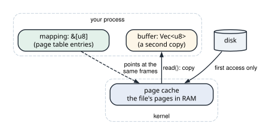
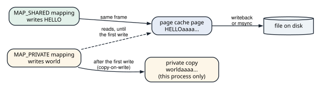
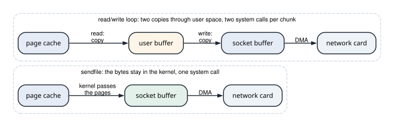

# Mapping files and copying less

<div class="covers" markdown="1">

This chapter covers

- The page cache: where a file's bytes live in RAM, and the copy that `read` makes from it
- `mmap`: a file's pages placed in your address space, loaded by page faults on first touch
- Shared and private mappings, `msync`, and copy-on-write
- What a mapping cannot report as an error, and when `read` is the better tool
- Sending a file to a socket with `sendfile`, without passing its bytes through your process
- Why TLS puts the bytes back into user space

</div>

Part 7 works at the boundary between your program and the kernel. Chapter 2 read files with `read`, and
chapter 15 explained pages and page faults. This chapter joins the two. It maps a file into memory and
watches the page faults that load it. Then it sends a file over a socket without copying its bytes into
the program at all.

Two programs carry the chapter. `mmap_file` maps a 64-page file, counts the faults that two passes over it
take, and writes through a shared and a private mapping. `zero_copy` sends a 256 MiB file over a loopback
socket twice: once with a `read`/`write` loop, and once with `sendfile`.

## 23.1 Where a file's bytes live

The kernel keeps recently used file data in RAM, in the **page cache**. The cache is organized by file and by page. Page 0 of a file holds bytes 0 to 4,095, and page 1 holds the next 4,096. Every way of
reading a file goes through it. A `read` of a page that is not cached makes the kernel load the page from
disk first. A later `read` of the same page, by any process, finds it in RAM.

The page cache belongs to the kernel, so a `read` cannot hand your program the cached page itself. It
copies the requested bytes into a buffer your program owns. After `read(fd, &mut buffer)` returns, the file's
bytes sit in RAM twice: once in the page cache, and once in `buffer`.

A **memory mapping** removes the second copy. The system call `mmap` asks the kernel to make a range of a
file part of your address space. The kernel reserves a range of virtual addresses and returns a pointer to
its start. When the program reads from those addresses, the page table translates them to the page cache's
own frames (figure 23.1). The program reads the file's bytes where the kernel keeps them.

<figure>

<figcaption><b>Figure 23.1</b> <code>read</code> copies from the page cache into your buffer. A mapping points at the page cache's frames.</figcaption>
</figure>

`mmap` loads nothing when it returns. The page table entries for the range start empty. The first access
to each page is a page fault, as in section 15.5. The kernel finds the file's page in the page cache, or
reads it from disk if it is not there. Then it fills in the page table entry and restarts the instruction
that faulted. A fault that finds the page already cached is a **minor fault**, and costs microseconds. A
fault that has to read the disk is a **major fault**, and costs at least a disk access.

Here is the plan for 64 pages:

| Step | What the kernel does | Faults |
|---|---|---|
| `mmap` of 64 pages | reserves 64 pages of addresses, fills no entries | 0 |
| first read of each page | fills that page's entry | one per page |
| second read of each page | nothing: the entries are already filled | 0 |

The rest of this section builds a type for a mapping and checks the table against a real run.

### 23.1.1 A type that owns a mapping

The program calls `mmap` through the `libc` crate. A mapping is a pointer and a length, and it must be
unmapped exactly once. That is the shape of an owning Rust type with a `Drop`:

```rust
{{#include ../../rust-interview-lab/src/bin/mmap_file.rs:10:23}}
```

`NonNull<u8>` is a raw pointer that is never null. It records that `Mapping` always holds a real address.
Creating the mapping is one call to `mmap`. The `libc` crate declares each C function inside an
`unsafe extern "C"` block, with C's types. `c_int` is a C `int`, `size_t` is an unsigned size, and `off_t` is a
file offset. `*mut c_void` is a pointer to bytes of no particular type. Here is the declaration, with what
each parameter means:

```rust
unsafe extern "C" {
    fn mmap(
        addr: *mut c_void, // where to map; null lets the kernel choose
        len: size_t,       // how many bytes to map
        prot: c_int,       // what is allowed: PROT_READ | PROT_WRITE
        flags: c_int,      // MAP_SHARED or MAP_PRIVATE (section 23.2)
        fd: c_int,         // the open file
        offset: off_t,     // where in the file; a multiple of the page size
    ) -> *mut c_void;      // the mapping's address, or MAP_FAILED
}
```

Every call through such a declaration is `unsafe`, because the compiler cannot check what the C code does with
the pointers it is given. `new` makes the call and checks the result:

```rust
{{#include ../../rust-interview-lab/src/bin/mmap_file.rs:25:56}}
    // ...
}
```

On failure `mmap` returns `MAP_FAILED`, not null, so the code checks for that value first. `last_os_error`
reads `errno` and turns it into an `io::Error`.

The program reaches the bytes through slices. `bytes` and `bytes_mut` build them from the pointer and the
length:

```rust
impl Mapping {
    // ...
{{#include ../../rust-interview-lab/src/bin/mmap_file.rs:58:66}}
    // ...
}
```

`bytes_mut` takes `&mut self`, so the borrow checker allows one mutable slice at a time, as with a `Vec`.
`Drop` gives the address range back to the kernel with `munmap`, which takes the same address and length:

```rust
unsafe extern "C" {
    fn munmap(addr: *mut c_void, len: size_t) -> c_int; // 0, or -1 with errno set
}
```


```rust
{{#include ../../rust-interview-lab/src/bin/mmap_file.rs:80:88}}
```

A slice returned by `bytes` borrows `self`, so it cannot outlive the `Mapping`. Without that borrow, a slice
could point into an unmapped range, and the next read through it would crash the process.

### 23.1.2 Counting the faults

The kernel counts each process's page faults. `getrusage` copies the counts into a `rusage` struct that the
caller provides, and `sysconf` reads system constants such as the page size:

```rust
unsafe extern "C" {
    fn getrusage(
        who: c_int,          // RUSAGE_SELF: this process
        usage: *mut rusage,  // filled in; ru_minflt counts minor faults
    ) -> c_int;              // 0, or -1 with errno set
    fn sysconf(name: c_int) -> c_long; // _SC_PAGESIZE gives the page size
}
```

The program reads the minor-fault count before and after a pass over the mapping:

```rust
{{#include ../../rust-interview-lab/src/bin/mmap_file.rs:97:116}}
```

`touch_every_page` reads one byte per page. `step_by(page)` skips from the first byte of one page to the
first byte of the next. The function returns the sum of the bytes so the compiler cannot drop the reads as
unused.

`main` writes a file of 64 pages, maps it shared, and runs the pass twice:

```rust
fn main() -> io::Result<()> {
    // ...
{{#include ../../rust-interview-lab/src/bin/mmap_file.rs:138:149}}
    // ...
}
```

Animation 23.1 follows both passes, the writes of section 23.2, and the truncation of section 23.2.1.

<figure class="anim">
<video class="motion" src="figures/ch23-faults.mp4" autoplay loop muted playsinline preload="metadata" aria-label="The program's thread as a robot, its page table as a grid of 64 empty entries, and the kernel's page cache holding the file's 64 pages beside the file on disk. The first read of page 0 finds the entry empty: a page fault stops the thread. The kernel finds page 0 in the page cache, a minor fault, and fills the entry. Every other page takes the same path, and the first-pass counter reaches 64. The second pass sweeps all 64 entries with no fault. Writing HELLO through the shared mapping changes the page cache's page 0, and msync carries it to the disk. A private mapping starts with no entries filled; writing world to page 0 faults, the kernel copies page 0 into a private frame, and only the copy holds world. In a last run another process truncates the file to one page; the kernel drops pages 1 to 63 and empties their entries, and the next read of page 1 ends in SIGBUS." data-chapters="[[0.0, &quot;mmap&quot;], [10.26, &quot;first pass&quot;], [48.36, &quot;second pass&quot;], [58.62, &quot;HELLO&quot;], [70.44, &quot;world&quot;], [88.92, &quot;truncated&quot;]]"></video>
<figcaption><b>Animation 23.1</b> The first touch of each page faults, and the kernel fills the entry from the page cache. A first write to a private mapping copies the page. A page truncated away leaves nothing to fill the entry with.</figcaption>
</figure>

On macOS, the run matches the table:

```text
$ cargo run --bin mmap_file
page size 4096 bytes, file 64 pages (262144 bytes)

first pass over the mapping:  64 minor faults
second pass over the mapping: 0 minor faults
```

The faults are minor because `fs::write` had put every page of the file in the page cache a moment
earlier. No disk read was needed.

On Linux, the same program reports `first pass over the mapping:  5 minor faults`. When a read faults on a
file mapping, Linux also fills the entries of the neighbouring pages that are already in the page cache.
This is **fault-around**, and by default it covers 64 KiB, which is 16 pages, per fault. 64 pages need at
least 4 such faults. The second pass is 0 faults on both systems.

## 23.2 Shared and private mappings

The flags argument decides where a write through the mapping goes (figure 23.2).

- **`MAP_SHARED`**: the entry points at the page cache frame itself. A write changes the file's cached
  page. Every process that maps or reads the file sees the change. The kernel writes the dirty page to disk
  later, during **writeback**.
- **`MAP_PRIVATE`**: the entry also points at the page cache frame, but it is marked read-only. The first
  write to a page faults. The kernel copies the page into a new frame that belongs to this process and
  points the entry at the copy. This is **copy-on-write**. The file never sees the write.

<figure>

<figcaption><b>Figure 23.2</b> A shared mapping writes into the page cache. A private mapping copies the page on its first write.</figcaption>
</figure>

Writeback happens on the kernel's schedule, typically within about 30 seconds. To put the data on disk at a known point, call `msync`:

```rust
unsafe extern "C" {
    fn msync(
        addr: *mut c_void, // start of the range, as returned by mmap
        len: size_t,       // length of the range
        flags: c_int,      // MS_SYNC: return after the write completes
    ) -> c_int;            // 0, or -1 with errno set
}
```

With `MS_SYNC`, it returns after the dirty pages of the range are written:

```rust
impl Mapping {
    // ...
{{#include ../../rust-interview-lab/src/bin/mmap_file.rs:68:77}}
}
```

`main` writes `HELLO` through the shared mapping and syncs it. Then it maps the same file privately and
writes `world`:

```rust
fn main() -> io::Result<()> {
    // ...
{{#include ../../rust-interview-lab/src/bin/mmap_file.rs:151:166}}
    // ...
}
```

`file_prefix` reads the file with `fs::read`, the ordinary path through the page cache. It reports what the
file holds, not what a mapping holds:

```text
after writing HELLO through MAP_SHARED, the file starts with "HELLO"
after writing world through MAP_PRIVATE, the mapping holds "world"
and the file still starts with "HELLO"
```

`fork` uses the same mechanism for a whole process. The child gets a copy of the parent's page tables with
every writable page marked read-only. Neither process copies a page until one of them writes to it.

### 23.2.1 What a mapping cannot tell you

A `read` that fails returns an error. An access through a mapping has no return value, so the kernel
reports a failure with a signal:

- If another process truncates the file, the pages past the new end no longer exist. Touching one of them
  raises `SIGBUS`, which kills the process unless it installs a handler.
- If the disk returns an error while a major fault reads a page, the access also raises `SIGBUS`.

There is also a rule that Rust's types cannot check. A `&[u8]` promises that the bytes do not change while
the slice is alive. Through a `MAP_SHARED` mapping, another process can write the file at any moment, and
the slice's bytes change under it. `Mapping::bytes` is sound only while no other process writes the file.
The `memmap2` crate makes `Mmap::map` an `unsafe fn` for this reason: the caller promises that the file
stays unchanged.

### 23.2.2 When to map, and when to read

A mapping saves the copy into a buffer, but it has costs of its own. Every first touch of a page is a fault,
and each fault enters the kernel. When a mapping is removed, every CPU that may hold its translations in a TLB must drop them. The kernel interrupts those CPUs to make them do it.

| Access pattern | Better tool | Reason |
|---|---|---|
| Read a file once, front to back | `read` into a reused buffer | readahead keeps the page cache ahead of you, and one buffer is cheap to copy into |
| Random reads over a large file, repeated | `mmap` | each page faults once, then reads cost what memory reads cost |
| Many processes reading the same large file | `mmap` (shared, read-only) | every process uses the page cache's single copy |
| Files that other processes may truncate | `read` | a failed `read` returns an error instead of raising `SIGBUS` |

Databases such as LMDB map their data files for the second and third reasons. Log readers and copy tools
read sequentially, and use `read`.

## 23.3 Sending a file to a socket

A static file server sends files to sockets. The simple version reads a chunk of the file into a buffer and
writes the buffer to the socket, until the file ends. Figure 23.3 shows what each chunk costs. A `read` copies from the page cache to the buffer. A `write` copies from the buffer to the socket's send buffer. The program never looks at the bytes. They pass through it only because `read` and `write`
are the calls it knows.

`sendfile` moves the bytes from a file to a socket inside the kernel. One call names both descriptors, an
offset, and a count. The kernel passes the page cache's pages to the socket, and the bytes never enter the
process. On network cards that can gather data from several places in memory, the kernel passes references
to the pages instead of copying them. This is **zero-copy**: no copy of the payload by the CPU.

<figure>

<figcaption><b>Figure 23.3</b> The two copies of a <code>read</code>/<code>write</code> loop, and the path of <code>sendfile</code>.</figcaption>
</figure>

### 23.3.1 Measuring both

`sendfile` with a socket as the destination is a Linux call, so `zero_copy` puts its code in a module
compiled only on Linux. It also needs a socket to send to. `connected_pair` opens a loopback connection
and starts a thread that reads everything from the far end and counts it:

```rust
{{#include ../../rust-interview-lab/src/bin/zero_copy.rs:10:45}}
    // ...
}
```

`Transfer` records what one run cost. The receiving thread returns its byte count through `join`, so each
run checks that every byte arrived.

The loop reads up to `buffer_size` bytes and writes what it read. It counts every system call:

```rust
mod linux {
    // ...
{{#include ../../rust-interview-lab/src/bin/zero_copy.rs:47:71}}
    // ...
}
```

`write_all` may need more than one `write` when the socket's send buffer is full. The count adds one per
`write_all`, so it is a lower bound.

The `sendfile` version has no buffer. On Linux, `sendfile` copies from one descriptor to another inside the
kernel:

```rust
unsafe extern "C" {
    fn sendfile(
        out_fd: c_int,       // where the bytes go: the socket
        in_fd: c_int,        // where they come from: the file
        offset: *mut off_t,  // where to start reading; advanced by the kernel
        count: size_t,       // at most this many bytes
    ) -> ssize_t;            // bytes sent, or -1 with errno set
}
```

The program calls it until the offset reaches the file's length:

```rust
mod linux {
    // ...
{{#include ../../rust-interview-lab/src/bin/zero_copy.rs:73:101}}
    // ...
}
```

The kernel advances `offset` by the number of bytes it sent. A single call sends at most 2,147,479,552 bytes on Linux, and a signal can cut a call short. The loop handles both, although this run needs one call.

`main` writes a 256 MiB file and sends it once untimed, so both timed runs start with the file in the page
cache. Run in a Linux container, in release mode:

```text
$ cargo run --release --bin zero_copy
method                        MiB   syscalls         ms        MiB/s
read/write, 64 KiB            256       8193      316.4          809
sendfile                      256          1      194.3         1318
```

256 MiB in 64 KiB chunks is 4,096 chunks. Each takes a `read` and a `write`, and one last `read` returns 0,
which gives 8,193 calls. `sendfile` made one. The time fell by about 40%. Both runs share the costs of loopback TCP and of the receiving thread, which still copies every byte into its own buffer. Over a real network card, the receiver is on another machine, and the sender's saving
is a larger share of its work.

### 23.3.2 Where zero-copy stops

`sendfile` works only when the bytes leave the kernel exactly as they sit in the page cache. Any
transformation of the bytes needs a CPU to touch them:

- **TLS.** A TLS library such as `rustls` encrypts each record in user space. The plaintext has to come into the process first. A server that sends a file over HTTPS reads it into a buffer, encrypts
  the buffer, and writes the ciphertext. Linux can move the encryption into the kernel with kernel TLS:
  the library performs the handshake, then hands the session keys to the socket. With kernel TLS on,
  `sendfile` works on a TLS connection again, and the kernel encrypts as it sends.
- **Compression.** A server that compresses responses on the fly reads every byte. Storing a compressed
  copy of each file ahead of time brings `sendfile` back.

## 23.4 The complete programs

<p class="listing"><b>Listing 23.1</b> Shared and private mappings, and the faults that load them. <a href="https://github.com/arpanpathak/cracking-the-systems-programming-interview/blob/prep-v2/rust-interview-lab/src/bin/mmap_file.rs">src/bin/mmap_file.rs</a></p>

```rust
{{#include ../../rust-interview-lab/src/bin/mmap_file.rs}}
```

```text
$ cargo run --bin mmap_file
page size 4096 bytes, file 64 pages (262144 bytes)

first pass over the mapping:  64 minor faults
second pass over the mapping: 0 minor faults

after writing HELLO through MAP_SHARED, the file starts with "HELLO"
after writing world through MAP_PRIVATE, the mapping holds "world"
and the file still starts with "HELLO"
```

<p class="listing"><b>Listing 23.2</b> A file sent over a socket with a <code>read</code>/<code>write</code> loop and with <code>sendfile</code>. <a href="https://github.com/arpanpathak/cracking-the-systems-programming-interview/blob/prep-v2/rust-interview-lab/src/bin/zero_copy.rs">src/bin/zero_copy.rs</a></p>

```rust
{{#include ../../rust-interview-lab/src/bin/zero_copy.rs}}
```

## 23.5 Questions that come up

**"Is a mapped file faster than `read`?"**
For repeated random access to a large file, usually. Each page faults once, and later reads cost a memory read.
For one sequential pass, `read` with a reused buffer is as fast or faster, because it takes no faults.

**"What happens when two processes map the same file with `MAP_SHARED`?"**
Both page tables point at the same page cache frames. A write by one is visible to the other at once,
before any writeback. Shared memory between processes works this way.

**"Does `msync` make a write durable?"**
`MS_SYNC` waits until the dirty pages are written to the device. Whether the device has stored them
permanently depends on its write cache, as with `fsync`.

**"Why does a file server stop using `sendfile` when it turns on TLS?"**
The TLS library encrypts the bytes in user space. Kernel TLS moves the encryption into
the kernel and allows `sendfile` again.

**"What does fault-around change?"**
It lowers the number of faults for a mapping read in order. It does not change what the program sees. It maps only neighbouring pages that are already cached, and reads nothing from disk.

<div class="summary" markdown="1">

## Summary

- The page cache holds files' pages in kernel memory. `read` copies from it into your buffer.
- `mmap` maps a file's pages into your address space. Nothing loads until the first touch of a page faults.
- A minor fault fills the page table entry from the page cache. A major fault reads the disk first.
- Writes through `MAP_SHARED` change the file's cached page. Writes through `MAP_PRIVATE` go to a private
  copy made on the first write. `msync` writes the dirty pages of a shared mapping now.
- A failed access through a mapping raises `SIGBUS` instead of returning an error. A `&[u8]` over a shared
  mapping is sound only while no other process writes the file.
- `sendfile` sends a file to a socket without passing its bytes through the process. This run made one call instead of 8,193.
- TLS and compression need the CPU to read every byte, which brings the bytes back into user space unless
  the kernel does the work.

</div>

Chapter 24 looks at file descriptors themselves. It covers the table each process keeps, what `fork` and `exec` do to it, and how a shell joins two programs with a pipe.

## Exercises

1. Change `PAGES` to 4,096 and run `mmap_file` again. Then drop the page cache (on Linux, as root:
   `echo 1 > /proc/sys/vm/drop_caches`) between writing the file and mapping it, and read `ru_majflt` as
   well as `ru_minflt`. Which faults turn major?
2. Map the file read-only with `PROT_READ` only, and write through the slice from an `unsafe` block. Which
   signal stops the process, and which kind of fault from section 15.5 is it?
3. In `copy_loop`, try buffer sizes of 4 KiB, 64 KiB, and 1 MiB. Explain the change in system calls and in
   time.
4. Add a third method to `zero_copy` that maps the file and calls `write_all` on the whole mapping. Count
   its system calls and compare its time with the other two.
5. Write a test that truncates the file to one page while a two-page `Mapping` of it is alive. Check that the first page still reads. Do not read the second page in the test. Explain why.
