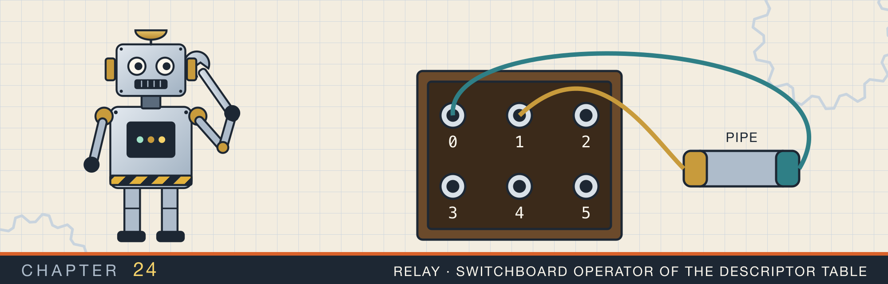
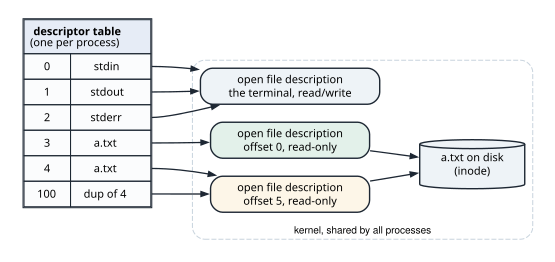
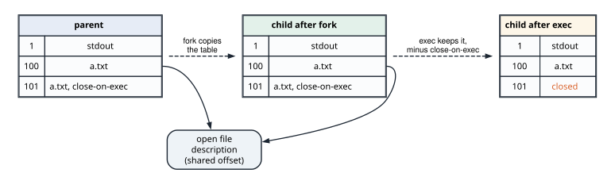
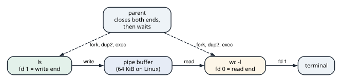

# File descriptors, fork, and pipes

<div class="covers" markdown="1">

This chapter covers

- The descriptor table, the open file descriptions it points at, and the lowest-free-number rule
- What `fork` copies, what `exec` keeps, and why the child of a threaded program must be careful
- Pipes: a kernel buffer with a read end and a write end, and when a reader sees end-of-file
- `ls | wc -l` built by hand with `pipe`, `fork`, `dup2`, and `execvp`
- A write end left open, which makes a reader wait forever
- Close-on-exec, and the descriptors a child inherits without it

</div>

Chapter 2 said that `open` returns a small number, the file descriptor, and that later calls name the
file by that number. Chapter 20 used the same numbers for sockets. This chapter looks at the table that
holds those numbers. It shows what happens to the table when a process starts another program. Then it shows how a shell uses the table to join two programs with a pipe.

The chapter's program, `fd_table`, does the shell's work with raw system calls from the `libc` crate. It
watches descriptor numbers being handed out and reused. It builds `ls | wc -l`, then breaks it by keeping
one descriptor open too long. Last, it checks which descriptors a child process inherits.

## 24.1 The descriptor table

Every process has a **descriptor table**. An entry maps a small number to an open file in the kernel. The
kernel creates the first three entries for most programs: 0 is standard input, 1 is standard output, and 2
is standard error.

An entry does not point at the file on disk directly. It points at an **open file description**, a kernel
object that one `open` call creates. The description holds the state of that one opening: the current
offset, and flags such as read-only or `O_APPEND`. The description points at the file itself (figure 24.1).

<figure>

<figcaption><b>Figure 24.1</b> Three levels: descriptor numbers, open file descriptions, and the file. Descriptors 4 and 100 share one offset.</figcaption>
</figure>

Three rules follow from this layout:

- **Two `open` calls on one file give two descriptions.** Each has its own offset, so reading through
  descriptor 3 does not move descriptor 4.
- **Duplicating a descriptor shares the description.** `dup`, `dup2`, and `fcntl` with `F_DUPFD` add an
  entry that points at an existing description. A read through either number moves the offset of both.
- **`open` returns the lowest free number.** When descriptor 3 is closed, the next `open` returns 3 again.

A description lives as long as some entry points at it. `close` removes one entry. The description, and
for a pipe or socket the connection behind it, goes away when the last entry is closed.

The table has a limit, set per process by `RLIMIT_NOFILE`. A program that never closes its descriptors reaches the limit. Every later `open`, `accept`, or `socket` then fails with `EMFILE`, "Too many open files". In Rust, a `File` or a `TcpStream` closes its descriptor when it is dropped, which prevents most of
these leaks.

### 24.1.1 Watching the numbers

On Linux and macOS, the directory `/dev/fd` lists the calling process's open descriptors. `open_fds` reads
it:

```rust
{{#include ../../rust-interview-lab/src/bin/fd_table.rs:7:27}}
```

Each directory entry is named after a descriptor number. The second `filter_map` keeps the names that parse
as numbers. Reading the directory needs a descriptor of its own, so that one is in the list too.

`main` opens the same file twice, closes the first descriptor, and opens it a third time:

```rust
fn main() -> io::Result<()> {
    // ...
{{#include ../../rust-interview-lab/src/bin/fd_table.rs:204:218}}
    // ...
}
```

The output shows both rules:

```text
open at start: [0, 1, 2, 3]
opened two files: fd 3 and fd 4
closed fd 3, opened another: fd 3
```

At start, 0 to 2 are the standard streams and 3 is the `/dev/fd` directory being read. The directory is
closed when `read_dir`'s iterator is dropped, so the first `File::open` gets 3. Closing 3 frees the lowest
number, and the third `open` takes it again.

## 24.2 `fork` and `exec`

A Unix process starts another program in two steps.

1. **`fork`** creates a child process that is a copy of the caller. The child gets a copy of the caller's
   memory, shared copy-on-write as in section 23.2, and a copy of the descriptor table. `fork` returns
   twice: in the parent it returns the child's process id, and in the child it returns 0.
2. **`exec`** replaces the program running in the process with a new one. The memory is replaced. The
   descriptor table is kept, except for entries marked **close-on-exec**, which `exec` closes.

The table copy is shallow (figure 24.2). The child's descriptor 100 points at the same open file
description as the parent's descriptor 100, so the two processes share one offset. After `exec`, the new
program finds its standard streams at 0, 1, and 2 because they were in the table before `exec` ran.

<figure>

<figcaption><b>Figure 24.2</b> <code>fork</code> copies the table, and both copies point at the same descriptions. <code>exec</code> keeps the table and closes the close-on-exec entries.</figcaption>
</figure>

A shell uses the gap between the two calls. In the child, after `fork` and before `exec`, it rearranges the table. It moves a pipe end to descriptor 0 or 1 with `dup2`, then calls `exec`. The new program reads
descriptor 0 and writes descriptor 1 as always, without knowing they are a pipe.

### 24.2.1 What the child may do before `exec`

`fork` copies only the thread that called it. Suppose another thread held a lock at that moment, such as the memory allocator's lock. The child's copy of that lock stays locked forever. No thread exists in
the child to release it. A child that calls `malloc` can then deadlock.

So between `fork` and `exec`, the child of a multithreaded program may only make **async-signal-safe** calls. These are calls that take no locks, such as `dup2`, `close`, `execvp`, and `_exit`. Rust's test harness runs tests on several threads, so the program follows this rule.

The program describes the command to run as C strings:

```rust
{{#include ../../rust-interview-lab/src/bin/fd_table.rs:72:92}}
```

`execvp` takes an array of pointers to C strings, ending with a null pointer. `argv` builds that array. The
pointers point into the `CString`s, so the array is valid only while the `Program` is alive.

`spawn` forks, and in the child arranges descriptors 0 and 1 and runs the program:

```rust
{{#include ../../rust-interview-lab/src/bin/fd_table.rs:94:122}}
```

`argv` is built before `fork`, because building it allocates. In the child, `dup2(fd, 1)` makes descriptor 1
point at the same description as `fd`, closing whatever 1 was before. `execvp` searches `PATH` for the
program and does not return if it succeeds. If it fails, the child exits with status 127, which shells
report as "command not found". The child must not return from `spawn`: it would go on running the
parent's code.

The parent waits for children with `waitpid`:

```rust
{{#include ../../rust-interview-lab/src/bin/fd_table.rs:124:138}}
```

Until the parent waits for it, an exited child stays in the process table as a **zombie**, holding its
exit status. `WNOHANG` asks whether the child has exited without waiting.

## 24.3 Pipes

A **pipe** is a buffer in the kernel with two descriptors: a read end and a write end. Bytes written to the
write end come out of the read end in the same order. On Linux the buffer holds 64 KiB by default.

The ends block, and the rules for that are the rules of every pipeline:

- `read` on an empty pipe waits until some process writes.
- `read` returns 0, end-of-file, only when the pipe is empty and **every** descriptor for the write end, in
  every process, is closed.
- `write` to a full pipe waits until the reader makes room.
- `write` after every read end is closed fails. The kernel sends the writer `SIGPIPE`, and if the writer
  ignores that signal, `write` returns the error `EPIPE`.

A shell runs `ls | wc -l` in five steps (figure 24.3):

1. `pipe` creates the two ends in the shell's table.
2. `fork` a child, `dup2` the write end onto its descriptor 1, and `exec` `ls`.
3. `fork` a second child, `dup2` the read end onto its descriptor 0, and `exec` `wc -l`.
4. Close both ends in the shell.
5. Wait for both children.

<figure>

<figcaption><b>Figure 24.3</b> <code>ls | wc -l</code> after setup. Only <code>ls</code> holds the write end, and only <code>wc</code> holds the read end.</figcaption>
</figure>

Step 4 makes the pipeline finish. After it, the only write end is `ls`'s descriptor 1. When `ls` exits,
that last write end closes, and `wc` reads end-of-file, prints its count, and exits.

### 24.3.1 Building the pipeline

`pipe` creates the two ends as `OwnedFd`s, which close themselves when dropped. It marks both close-on-exec:

```rust
{{#include ../../rust-interview-lab/src/bin/fd_table.rs:29:56}}
```

`check` turns the C convention, -1 with the error in `errno`, into an `io::Result`. Close-on-exec on the
pipe ends replaces the `close` calls a shell makes in each child. `dup2` copies a descriptor without its
close-on-exec flag. So the copy at 0 or 1 survives `exec`, and the original pipe ends close.

`ls_wc` is the five steps:

```rust
{{#include ../../rust-interview-lab/src/bin/fd_table.rs:152:167}}
```

The two `drop` calls are step 4. The program prints the line count of a directory with three files:

```text
ls fd_table_demo | wc -l
       3
```

On Linux, `wc` prints `3` without the leading spaces.

### 24.3.2 A write end left open

Animation 24.1 follows the pipeline, then runs it again without step 4.

<figure class="anim">
<video class="motion" src="figures/ch24-pipe.mp4" autoplay loop muted playsinline preload="metadata" aria-label="A parent robot, two child robots named ls and wc, and a pipe between them, with a counter of open write ends. pipe creates fd 3, the read end, and fd 4, the write end, in the parent's table. fork copies the table to the ls child; dup2 points its fd 1 at the write end, and exec closes fds 3 and 4, which are close-on-exec. The same for wc, with fd 0 on the read end. The parent drops both ends; the write-end counter shows 1, held by ls. ls writes three names into the pipe and exits, the counter drops to 0, and wc's read returns 0: end-of-file. wc prints 3. In a second run the parent keeps its write end: ls exits, the counter stays at 1, and wc sleeps in read while a clock runs." data-chapters="[[0.0, &quot;fork ls&quot;], [22.14, &quot;fork wc&quot;], [29.58, &quot;close&quot;], [39.3, &quot;data&quot;], [60.9, &quot;write end kept&quot;]]"></video>
<figcaption><b>Animation 24.1</b> The reader sees end-of-file when the last write end closes. A parent that keeps its copy of the write end keeps the reader waiting.</figcaption>
</figure>

`reader_waits_for_the_write_end` measures the failing case. It starts `wc -l` on a pipe, writes two lines,
and keeps its write end open for a while:

```rust
{{#include ../../rust-interview-lab/src/bin/fd_table.rs:169:185}}
```

```text
parent writes two lines to wc -l and holds the write end for 1 s:
       2
wc still running after 1 s: true
```

`wc` had both lines after a few microseconds. It was still running after a second, because it cannot know
that no more lines will come while a write end is open. It printed `2` only after `drop(writer)`. A real
program that forgets the `drop` waits forever, with nothing using the CPU and no error to report.

The same bug appears without a pipe. A process that forks a long-lived child, such as a daemon, while it
holds a socket passes the socket to the child. Closing the socket in the parent then does not close the
connection, because the child's descriptor keeps the description alive.

## 24.4 Close-on-exec

A child inherits every descriptor that is not close-on-exec. The child can then do things the parent did
not intend:

- A listening socket stays bound to its port after the parent exits, so a restarted server fails with
  `EADDRINUSE`.
- A write end of a pipe stays open, and the reader never sees end-of-file, as in section 24.3.2.
- A file opened with secrets stays readable by a program that should not have it.

Rust's standard library sets close-on-exec on every descriptor it creates: files, sockets, and pipes. A
leak needs a descriptor made outside it, through `libc` or a C library. `duplicate` makes one each way:

```rust
{{#include ../../rust-interview-lab/src/bin/fd_table.rs:58:70}}
```

`F_DUPFD` creates a copy without close-on-exec, and `F_DUPFD_CLOEXEC` creates one with it. Both take the
lowest free number at or above 100. A high number keeps the copy away from the descriptors the child opens
for itself.

To find out what a child has open, `child_has` runs `ls /dev/fd` as a child and reads its output through a
pipe:

```rust
{{#include ../../rust-interview-lab/src/bin/fd_table.rs:140:150}}
```

`output` drops its write end as soon as the child has it. Without that `drop`, `read_to_string` would
wait for end-of-file forever, as in section 24.3.2.

```rust
{{#include ../../rust-interview-lab/src/bin/fd_table.rs:187:194}}
```

```text
fd 100 without close-on-exec, open in the child: true
fd 101 with close-on-exec,    open in the child: false
```

`pipe` sets the flag in a second call, after the pipe exists. Between the two calls, another thread could
`fork` and `exec`, and its child would inherit both ends. Linux has `pipe2`, which takes `O_CLOEXEC` and
creates the ends with the flag already set. `open` and `socket` take the same flag. The standard library
uses these forms where the system has them.

## 24.5 The complete program

<p class="listing"><b>Listing 24.1</b> The descriptor table, <code>ls | wc -l</code> by hand, and close-on-exec. <a href="https://github.com/arpanpathak/cracking-the-systems-programming-interview/blob/prep-v2/rust-interview-lab/src/bin/fd_table.rs">src/bin/fd_table.rs</a></p>

```rust
{{#include ../../rust-interview-lab/src/bin/fd_table.rs}}
```

```text
$ cargo run --bin fd_table
open at start: [0, 1, 2, 3]
opened two files: fd 3 and fd 4
closed fd 3, opened another: fd 3

ls fd_table_demo | wc -l
       3

parent writes two lines to wc -l and holds the write end for 1 s:
       2
wc still running after 1 s: true

fd 100 without close-on-exec, open in the child: true
fd 101 with close-on-exec,    open in the child: false
```

## 24.6 Questions that come up

**"What does `2>&1` do?"**
It is `dup2(1, 2)` in the child before `exec`. Descriptor 2 then points at the same description as
descriptor 1, so errors go wherever output goes, with one shared offset.

**"Why does `yes | head -1` stop?"**
`head` exits after one line and closes the read end. The next `write` by `yes` gets `SIGPIPE`, which ends
it. A Rust program ignores `SIGPIPE` by default, so its `write` returns a `BrokenPipe` error instead.

**"Why is `fork` slow for a large process, and what replaces it?"**
`fork` copies the page tables, although the pages are shared copy-on-write. For a process
with many gigabytes mapped, that copy takes milliseconds. `posix_spawn` and `vfork` start the new program
without copying the tables, and `std::process::Command` uses them where it can.

**"A server restarted and failed with `EADDRINUSE`. The old process is gone. What holds the port?"**
Look for a child that inherited the listening socket. `lsof -i :PORT` shows which process has it open.
Another cause is a connection in `TIME_WAIT`, which `SO_REUSEADDR` allows a new listener to ignore.

**"What does `Too many open files` mean?"**
The process reached `RLIMIT_NOFILE`. Check `/proc/PID/fd` on Linux to see what is open: often it is
sockets that are never dropped, or files opened in a loop.

<div class="summary" markdown="1">

## Summary

- A descriptor is an index into the process's table. The entry points at an open file description, which
  holds the offset and flags, and the description points at the file.
- `open` returns the lowest free number. `dup2` points a chosen number at an existing description.
- `fork` copies the table, and the copies share descriptions. `exec` keeps the table and closes the
  close-on-exec entries.
- Between `fork` and `exec`, a child of a multithreaded program may only make async-signal-safe calls.
- A pipe's reader sees end-of-file only when every write end in every process is closed. A forgotten
  write end makes the reader wait forever.
- Rust's standard library opens everything close-on-exec. Descriptors made through `libc` need the flag
  set by hand, in the same call when the system allows it.

</div>

Chapter 25 returns to chapter 20's epoll loop in edge-triggered mode. There, each readiness change is reported once, and a handler that reads too little stalls.

## Exercises

1. Run `fd_table` with descriptor 0 closed: `cargo run --bin fd_table <&-`. Which number does the first
   `File::open` return, and why?
2. Read a few bytes from a file, then `fork` with `spawn` running `cat` with the file's descriptor as
   standard input. Does `cat` print the whole file or the rest of it? Explain with figure 24.2.
3. Remove `drop(write_end)` from `output` and run the tests. Which test hangs, and which call is it
   waiting in?
4. Extend `ls_wc` into a function that takes a list of commands and connects them all, like
   `ls | sort | wc -l`. How many pipes does it create, and how many descriptors does the parent close?
5. Replace `pipe` with `pipe2` and `O_CLOEXEC` under `#[cfg(target_os = "linux")]`, and keep the two-call
   version for other systems.
