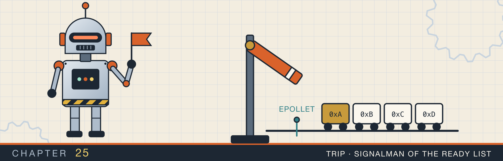
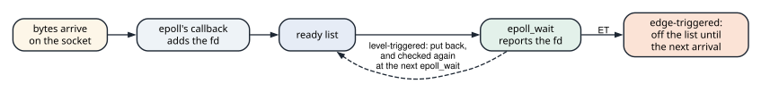
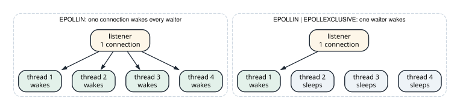

# Edge-triggered epoll

<div class="covers" markdown="1">

This chapter covers

- Readiness as a level and as an edge, and how epoll's ready list implements both
- Three handlers measured: read once under each mode, and read until `EAGAIN`
- The stall: data left in a socket that no event will report
- Why edge-triggered mode suits writes, and how a loop keeps one busy socket from starving the rest
- `EPOLLONESHOT` for a loop shared by several threads
- `EPOLLEXCLUSIVE` and `SO_REUSEPORT` for many threads waiting on one listener

</div>

Section 20.4 built an echo server on epoll in its default mode, **level-triggered**. Epoll has a second mode, **edge-triggered**, selected with the flag `EPOLLET`. Section 20.6 noted that it needs a handler that reads until `EAGAIN`. This chapter shows why, by measuring what each mode reports. Then it covers two flags for loops that several threads share: `EPOLLONESHOT` and `EPOLLEXCLUSIVE`.

The program, `epoll_edge`, uses Linux epoll, so its output comes from a Linux container. It writes 10,000
bytes into a socket and counts the events and bytes each handler sees.

## 25.1 Levels and edges

A socket is **readable** while its receive buffer holds at least one byte. That is a state, or a **level**:
it stays true until a read empties the buffer. The moment new bytes arrive is a change, or an **edge**.

Level-triggered epoll reports the level: every `epoll_wait` returns the socket while it is readable.
Edge-triggered epoll reports the edge: one event when bytes arrive, and no more until more bytes arrive.

The difference comes from the ready list, introduced in section 20.4 (figure 25.1). When bytes arrive, a
callback that epoll registered on the socket adds the socket to the ready list. `epoll_wait` takes entries
off the list and returns them. For a level-triggered socket, the kernel puts the entry back on the list,
and the next `epoll_wait` checks the socket again. It reports the socket only if it is still readable. An
edge-triggered entry is not put back. Only the callback, on the next arrival, can add it again.

<figure>

<figcaption><b>Figure 25.1</b> The ready list. A level-triggered entry goes back on the list after each report. An edge-triggered entry waits for the next arrival.</figcaption>
</figure>

Here is what each mode reports when 10,000 bytes arrive at once and the handler reads 4,096 bytes per event:

| Step | Bytes in the buffer | Level-triggered | Edge-triggered |
|---|---|---|---|
| 10,000 bytes arrive | 10,000 | event | event |
| handler reads 4,096 | 5,904 | event: still readable | nothing |
| handler reads 4,096 | 1,808 | event: still readable | — |
| handler reads 1,808 | 0 | nothing | — |

In edge-triggered mode, 5,904 bytes stay in the buffer after the first event. No event will report them
until the peer sends more. If the peer is waiting for a reply to the bytes it already sent, it never sends
more, and both sides wait forever. This is the stall. Edge-triggered mode needs a handler that reads until
`read` returns `EAGAIN`, which proves the buffer is empty.

## 25.2 Three handlers, measured

Epoll is three system calls. `epoll_event` is the record that carries a descriptor's flags in and its
events out:

```rust
struct epoll_event {
    events: u32, // EPOLLIN, EPOLLOUT, EPOLLET, ... combined with |
    u64: u64,    // data the caller chooses; the program stores the fd
}

unsafe extern "C" {
    fn epoll_create1(flags: c_int) -> c_int; // a new instance's fd; EPOLL_CLOEXEC
    fn epoll_ctl(
        epfd: c_int,                // the instance
        op: c_int,                  // EPOLL_CTL_ADD, EPOLL_CTL_MOD, or EPOLL_CTL_DEL
        fd: c_int,                  // the descriptor to watch
        event: *mut epoll_event,    // its flags
    ) -> c_int;                     // 0, or -1 with errno set
    fn epoll_wait(
        epfd: c_int,
        events: *mut epoll_event,   // an array the kernel fills
        maxevents: c_int,           // its length
        timeout: c_int,             // milliseconds; -1 waits forever
    ) -> c_int;                     // how many entries were filled, or -1
}
```

The program wraps the epoll instance in a type that closes it when dropped:

```rust
{{#include ../../rust-interview-lab/src/bin/epoll_edge.rs:11:76}}
    // ...
}
```

`epoll_create1(EPOLL_CLOEXEC)` creates the instance with close-on-exec set, as section 24.4 recommends.
`control` fills an `epoll_event` with the flags and with the descriptor as the event's data, then calls
`epoll_ctl`. `wait` returns only the number of events, because each run watches a single socket.

The two handlers differ in one loop:

```rust
mod linux {
    // ...
{{#include ../../rust-interview-lab/src/bin/epoll_edge.rs:78:96}}
    // ...
}
```

`read_once` makes one `read` of up to 4,096 bytes. `read_until_eagain` reads until the socket is empty. On a
non-blocking socket, `EAGAIN` reaches Rust as `io::ErrorKind::WouldBlock`, which is the loop's normal exit.

`run` connects a pair of Unix sockets and writes the bytes into one end. Then it handles events on the other end until 100 ms pass without one:

```rust
mod linux {
    // ...
{{#include ../../rust-interview-lab/src/bin/epoll_edge.rs:98:117}}
    // ...
}
```

`UnixStream::pair` returns two sockets connected to each other, which keeps the test off the network. The
reading end is non-blocking, as epoll requires. `handler` is a function pointer, so one `run` measures
both handlers.

Animation 25.1 follows the three runs.

<figure class="anim">
<video class="motion" src="figures/ch25-edge.mp4" autoplay loop muted playsinline preload="metadata" aria-label="A socket's receive buffer as a gauge of bytes, a ready list, and an event loop robot. Level-triggered with one read per event: 10,000 bytes arrive and the socket joins the ready list. epoll_wait returns it, the robot reads 4,096, and the socket goes back on the list because 5,904 bytes remain. Two more events read 4,096 and 1,808, and the buffer is empty. Edge-triggered with reads until EAGAIN: one event, three reads of 4,096, 4,096, and 1,808, then EAGAIN, and the buffer is empty. Edge-triggered with one read per event: one event, one read of 4,096, and the socket is not put back. The robot sleeps in epoll_wait while 5,904 bytes sit in the buffer; the 100 ms timeout passes with no event." data-chapters="[[0.0, &quot;level-triggered&quot;], [32.11, &quot;edge, drained&quot;], [49.21, &quot;edge, read once&quot;]]"></video>
<figcaption><b>Animation 25.1</b> The same 10,000 bytes under three handlers. An edge-triggered socket that is not drained stays off the ready list with data in it.</figcaption>
</figure>

The output matches the table in section 25.1:

```text
10000 bytes written into a socket; one handler call per epoll event

level-triggered, read once  events 3, bytes per event [4096, 4096, 1808], left unread 0
edge-triggered,  read once  events 1, bytes per event [4096], left unread 5904
edge-triggered,  to EAGAIN  events 1, bytes per event [10000], left unread 0
```

Level-triggered mode with one read per event delivered every byte, in three events. Edge-triggered mode
with the same handler left 5,904 bytes unread. The drained handler took one event for all 10,000 bytes.

### 25.2.1 Why use edge-triggered mode

Edge-triggered mode reports each arrival once, which saves work in two places.

- **Fewer re-checks.** A level-triggered loop gets the same socket back from every `epoll_wait` until it
  is drained. The kernel re-checks every such socket on every call.
- **Writes.** A socket is writable whenever its send buffer has room, which is nearly always. Section 20.4
  registered `EPOLLOUT` only while a reply was pending, because a level-triggered `EPOLLOUT` would report
  the socket on every call. In edge-triggered mode, a loop registers `EPOLLIN | EPOLLOUT | EPOLLET` once.
  The writable edge comes only after a `write` has returned `EAGAIN` and the buffer has drained. That is when the loop has a reply to finish.

The `mio` crate, which Tokio uses for its I/O on Linux, registers every socket edge-triggered for these
reasons.

Draining to `EAGAIN` has a cost of its own. A client that sends faster than the loop reads keeps the
handler in its read loop, and every other socket waits. A production loop caps the bytes it reads per event.
It keeps the sockets it stopped early on a list of its own, and returns to them after serving the other
events. Tokio's tasks do the same with a budget: after a fixed amount of work, a task yields even if its
socket still has data.

## 25.3 Several threads on one epoll: `EPOLLONESHOT`

A server can run several threads that all call `epoll_wait` on one epoll instance. In edge-triggered mode,
a socket can then be handled by two threads at once:

1. Bytes arrive, and thread A wakes with the socket and starts reading.
2. More bytes arrive while A is still reading. The arrival is a new edge, so the socket is ready again.
3. Thread B wakes with the same socket and reads too. A and B each get part of the stream, and the order
   between their parts is lost.

**`EPOLLONESHOT`** disables a descriptor in the interest list after it reports one event. It stays
registered, but reports nothing until the thread that handled it calls `epoll_ctl` with `EPOLL_CTL_MOD` to
re-arm it. Only one thread can hold the socket between the event and the re-arm.

```rust
mod linux {
    // ...
{{#include ../../rust-interview-lab/src/bin/epoll_edge.rs:119:137}}
    // ...
}
```

```text
EPOLLONESHOT: first write 1 event, second write 0 events, after re-arming 1 event
```

The second write arrived while the descriptor was disabled, and `epoll_wait` timed out. The re-arm found the
socket readable, so the next `epoll_wait` reported it at once. No data is lost while a descriptor is
disabled. It waits in the socket's buffer for the re-arm.

## 25.4 Many waiters on one listener: `EPOLLEXCLUSIVE`

A common server design gives each thread its own epoll instance, and adds the same listening socket to all
of them. When one connection arrives, the listener's callback runs for every instance, and every thread
wakes. One of them wins `accept`. The others get `EAGAIN` and go back to sleep. With 64 threads, one
connection costs 64 wakeups and 63 wasted system calls. This is the **thundering herd**.

**`EPOLLEXCLUSIVE`**, added in Linux 4.5, marks an instance's interest in the listener as exclusive. When a
connection arrives, the kernel wakes one of the exclusive waiters, or a few, instead of all of them
(figure 25.2). The flag is allowed only with `EPOLL_CTL_ADD`.

<figure>

<figcaption><b>Figure 25.2</b> One connection and four waiting threads, with and without <code>EPOLLEXCLUSIVE</code>.</figcaption>
</figure>

`woken_by_one_connection` starts the threads, waits until each has registered the listener, connects one
client, and counts the threads whose `epoll_wait` returned an event:

```rust
mod linux {
    // ...
{{#include ../../rust-interview-lab/src/bin/epoll_edge.rs:139:176}}
}
```

The `Barrier` holds the main thread until every waiter has called `epoll_ctl`. The 50 ms sleep gives each
waiter time to block in `epoll_wait` before the client connects.

```text
4 threads wait on one listener, and one client connects:
  without EPOLLEXCLUSIVE: 4 threads woke
  with EPOLLEXCLUSIVE:    1 thread woke
```

`SO_REUSEPORT` solves the same problem another way. Each thread creates its own listening socket on the same
port, with the option set before `bind`. The kernel then assigns each new connection to one of the sockets,
chosen by a hash of the client's address and port. No two threads share a listener, so none is woken for
another's connection.

## 25.5 The complete program

<p class="listing"><b>Listing 25.1</b> Level- and edge-triggered handlers, <code>EPOLLONESHOT</code>, and <code>EPOLLEXCLUSIVE</code>. <a href="https://github.com/arpanpathak/cracking-the-systems-programming-interview/blob/prep-v2/rust-interview-lab/src/bin/epoll_edge.rs">src/bin/epoll_edge.rs</a></p>

```rust
{{#include ../../rust-interview-lab/src/bin/epoll_edge.rs}}
```

```text
$ cargo run --bin epoll_edge
10000 bytes written into a socket; one handler call per epoll event

level-triggered, read once  events 3, bytes per event [4096, 4096, 1808], left unread 0
edge-triggered,  read once  events 1, bytes per event [4096], left unread 5904
edge-triggered,  to EAGAIN  events 1, bytes per event [10000], left unread 0

EPOLLONESHOT: first write 1 event, second write 0 events, after re-arming 1 event

4 threads wait on one listener, and one client connects:
  without EPOLLEXCLUSIVE: 4 threads woke
  with EPOLLEXCLUSIVE:    1 thread woke
```

## 25.6 Questions that come up

**"A server under edge-triggered epoll sometimes stops answering one client. CPU use is zero. What do you
check first?"**
Whether every read loop runs until `EAGAIN`. A loop that stops after a full buffer, or after a fixed number
of bytes, leaves data that no event will report.

**"Does edge-triggered mode apply to `accept`?"**
Yes. An edge-triggered listener reports once when connections arrive, so the handler calls `accept` until
`EAGAIN`, as `accept_ready` in section 20.4 does.

**"What happens to an edge-triggered socket when the peer closes it?"**
The close is an arrival. Epoll reports `EPOLLIN`, and `EPOLLRDHUP` if it was requested. The drain loop then
reads the remaining bytes and sees `read` return 0.

**"Is kqueue edge-triggered?"**
kqueue offers both. `EV_CLEAR` gives edge-triggered behavior, and `EV_DISPATCH` disables an event after it
fires, like `EPOLLONESHOT`.

**"Why not have every thread call `accept` on one blocking listener?"**
That works. The kernel queues blocked `accept` callers and wakes one per connection. The herd appears when
threads wait in `epoll_wait` instead, because each epoll instance is a separate waiter on the listener.

<div class="summary" markdown="1">

## Summary

- Readable is a level: true while the buffer has bytes. An arrival is an edge.
- Level-triggered epoll puts a reported socket back on the ready list and reports it again while it is
  readable. Edge-triggered epoll reports it again only after new bytes arrive.
- An edge-triggered handler must read until `EAGAIN`. One 4,096-byte read per event left 5,904 of 10,000
  bytes unread, with no further event.
- Edge-triggered mode saves re-checks and lets `EPOLLOUT` stay registered. A drain loop needs a cap so one
  busy socket cannot starve the others.
- `EPOLLONESHOT` disables a descriptor after one event until `EPOLL_CTL_MOD` re-arms it, so one thread
  handles a socket at a time.
- `EPOLLEXCLUSIVE` wakes one of the waiters on a shared listener: 1 of 4 threads in this run, against 4 of 4
  without it. `SO_REUSEPORT` gives each thread its own listener instead.

</div>

Chapter 26 goes under the locks used in chapter 16. It builds a mutex on the futex system call, and runs
litmus tests that show what each memory ordering allows.

## Exercises

1. Change `run` so that after the edge-triggered stall it writes one more byte, and count the events. How
   many bytes does `read_once` return now, and why?
2. Add `EPOLLOUT | EPOLLET` to a socket in `run` and count the events while nothing is written. Then fill
   the socket's send buffer until `write` returns `WouldBlock`, read from the other end, and count again.
3. Cap `read_until_eagain` at 8,192 bytes per call and return whether it stopped early. Write a loop that
   keeps a list of sockets that stopped early, and serves them after the events from `epoll_wait`.
4. Run `woken_by_one_connection` with 16 threads and 10 connections. How many wakeups does each mode cost?
5. Rewrite `woken_by_one_connection` with `SO_REUSEPORT`, using the `socket2` crate to set the option
   before `bind`. Count how the 10 connections spread across the threads.
