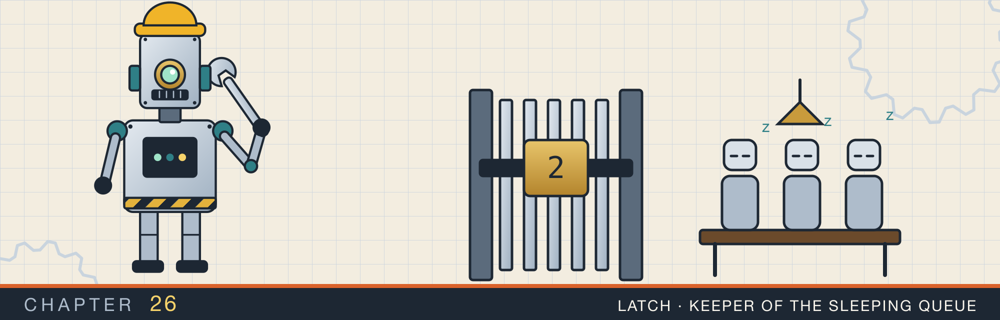
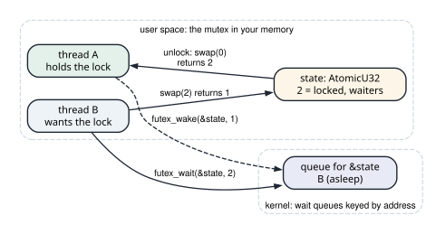
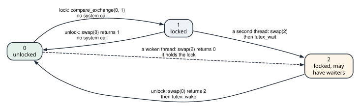
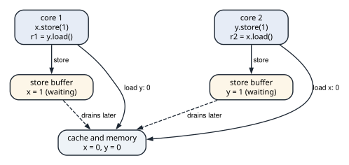

# Futexes and memory ordering

<div class="covers" markdown="1">

This chapter covers

- The futex: a wait queue in the kernel, keyed by the address of a word in your memory
- A mutex with three states that enters the kernel only to sleep and to wake
- Why the kernel checks the word before it puts a thread to sleep
- Counting the system calls a mutex makes, and comparing it with `std::sync::Mutex`
- Store buffers, and the reordering they allow even on x86
- Two litmus tests run a million times: store buffering, and message passing

</div>

Chapter 16 built a spin lock from one atomic flag. A thread that found the lock taken kept the CPU busy
until the lock came free. That is a good trade for a lock held for a few nanoseconds. It is a poor one for a lock held while a thread writes a file. Such a lock has to put the waiting thread to sleep and wake it later. Only the kernel can do that.

This chapter builds such a lock on the Linux **futex** system call, the same design `std::sync::Mutex` uses
on Linux. Then it looks under the orderings chapter 16 used. It runs two classic litmus tests a million times each, and counts how often the hardware reorders memory operations.

## 26.1 Sleeping on a word

A **futex**, a fast user-space mutex, is a wait queue in the kernel, keyed by an address. The word at that
address lives in your program's memory, and the kernel never interprets it. A futex has two operations:

- **`futex_wait(addr, expected)`**: if the 32-bit word at `addr` still holds `expected`, put this thread to
  sleep on the queue for `addr`. If it holds anything else, return at once.
- **`futex_wake(addr, n)`**: wake up to `n` threads sleeping on the queue for `addr`.

The lock state stays in an atomic in user space (figure 26.1). Taking a free lock is one compare-exchange
on that word, with no system call. Only a thread that has to wait calls `futex_wait`, and only an `unlock` that may have a sleeper to wake calls `futex_wake`.

<figure>

<figcaption><b>Figure 26.1</b> The lock word lives in the program. The kernel keeps only the queue of threads asleep on its address.</figcaption>
</figure>

### 26.1.1 Why the kernel checks the word

`futex_wait` checks the word and queues the thread as one step, under a kernel lock. Without the check,
this sequence would lose a wake-up:

1. Thread B reads the lock word and sees it held. B decides to sleep.
2. Thread A unlocks and calls `futex_wake`. No thread is on the queue yet, so the wake does nothing.
3. B enters the queue and sleeps. Nobody will wake it.

With the check, step 3 finds that the word no longer holds the value B saw, and `futex_wait` returns at
once. B then tries the lock again. This is the **lost wake-up** problem, and it is the reason `Condvar` in
chapter 16 takes the mutex as an argument.

## 26.2 A mutex with three states

The lock word has three values (figure 26.2):

- **0**, unlocked.
- **1**, locked, and no thread is waiting.
- **2**, locked, and some thread may be asleep in `futex_wait`.

The third state exists so that `unlock` knows whether to call `futex_wake`. Unlocking from 1 costs one
atomic instruction. Unlocking from 2 also costs a system call.

<figure>

<figcaption><b>Figure 26.2</b> The three states. The two transitions between 0 and 1 are the uncontended path, and make no system call.</figcaption>
</figure>

### 26.2.1 The system calls

`libc` has no wrapper for `futex`, so the program calls it with `syscall` and the call's number:

```rust
{{#include ../../rust-interview-lab/src/bin/futex_mutex.rs:10:53}}
    // ...
}
```

`FUTEX_PRIVATE_FLAG` tells the kernel that only this process uses the word. The kernel can then key the queue by the virtual address alone. A word shared between processes needs the physical page, which costs more to find. `AtomicU32::as_ptr` gives the address of the atomic's value. The return value is ignored. `futex_wait` returns early for several reasons, a signal among them, and the caller checks the word again anyway.

### 26.2.2 `lock` and `unlock`

The type holds the word, two counters for this chapter's measurements, and the protected value:

```rust
mod linux {
    // ...
{{#include ../../rust-interview-lab/src/bin/futex_mutex.rs:55:75}}
        // ...
}
```

As with the spin lock in chapter 16, the `unsafe impl Sync` promises that the lock hands out `value` to one
thread at a time. `lock` returns a `Guard`, which section 26.2.2 shows below: it gives access to the value,
and unlocks when it is dropped. `lock` tries the uncontended path first:

```rust
mod linux {
    // ...
    impl<T> FutexMutex<T> {
        // ...
{{#include ../../rust-interview-lab/src/bin/futex_mutex.rs:77:101}}
        // ...
    }
    // ...
}
```

`compare_exchange(UNLOCKED, LOCKED, Acquire, Relaxed)` takes a free lock in one instruction. If it fails,
`lock_contended` swaps in 2 and looks at the old value. An old value of 0 means the lock was free, and this
thread now holds it. Any other value means the lock is held. The thread sleeps while the word is still 2,
then tries again.

A thread that takes the lock in `lock_contended` leaves the word at 2, even if no other thread waits. It
cannot know whether others are asleep, so it assumes they are. The cost is a `futex_wake` call that may find
nobody to wake.

`unlock` swaps in 0 with `Release`, which publishes the writes made under the lock, as in section 16.4.3.
The old value says whether to wake a sleeper.

The guard is the same as the spin lock's:

```rust
mod linux {
    // ...
{{#include ../../rust-interview-lab/src/bin/futex_mutex.rs:113:138}}
}
```

Animation 26.1 follows two threads through the three states, and then shows the lost wake-up.

<figure class="anim">
<video class="motion" src="figures/ch26-futex.mp4" autoplay loop muted playsinline preload="metadata" aria-label="Two thread robots, A and B, beside the lock word, with the kernel's wait queue for the word's address below. A's compare_exchange changes 0 to 1 without entering the kernel. B's compare_exchange fails; B swaps in 2, sees 1, and calls futex_wait(&state, 2). The kernel checks that the word holds 2, and B sleeps on the queue. A unlocks: swap(0) returns 2, so A calls futex_wake and B wakes. B's swap(2) returns 0, so B holds the lock, with the word at 2. B's unlock returns 2 and calls futex_wake, which finds nobody. In a last run the kernel does not check the word: B sees the lock held, A unlocks and wakes an empty queue, then B joins the queue and sleeps forever." data-chapters="[[0.0, &quot;fast path&quot;], [7.14, &quot;B waits&quot;], [26.78, &quot;wake&quot;], [52.06, &quot;no check&quot;]]"></video>
<figcaption><b>Animation 26.1</b> The uncontended path stays in user space. A waiter sleeps in the kernel, and the check of the word inside <code>futex_wait</code> keeps a wake-up from being lost.</figcaption>
</figure>

### 26.2.3 Measured

`main` adds 1 to a counter a million times under each lock: with one thread, then split across two and four
threads. It runs in a Linux container with two CPUs:

```text
$ cargo run --release --bin futex_mutex
threads     total    waits    wakes     futex ms       std ms
      1   1000000        0        0         30.8         25.1
      2   1000000    23712    59752         64.4         56.2
      4   1000000    28006    71826         71.0         56.1
```

With one thread, a million increments made no system calls, at about 30 ns each. With
two threads, about 2.4% of the locks slept. There were 2.5 times as many wakes as waits. Most wakes came
from a thread that had taken the lock in `lock_contended`, left the word at 2, and woke an empty queue.

`std::sync::Mutex` uses the same three states, and was faster with contention. Before it sleeps, it spins
for up to 100 rounds, reading the word. A lock held for a few nanoseconds is often free again within those
rounds, so the waiter avoids two system calls. The timings vary between runs by 10% or more on this
container. In one of three runs, `std` with four threads took 214 ms. The counts of waits and wakes are the
steadier measurement.

## 26.3 What the hardware reorders

Section 16.2.3 said that `Relaxed` promises nothing about other memory, and that `SeqCst` gives one order
all threads agree on. This section shows a reordering that real hardware performs, and the ordering that
forbids it.

### 26.3.1 Store buffers

A store to memory is slow for a core: the cache line may have to be fetched from another core first. So
each core puts its stores in a **store buffer** and goes on running. The buffer drains to the cache in the
background. The core's own loads check its buffer, so a thread always sees its own stores. Other cores see a
store only after it drains.

A load that comes after a store can therefore complete before the store is visible to anyone else. Figure
26.3 shows two cores each doing that at once. Both loads read the old value, 0, from memory, while both
stores still sit in the buffers.

<figure>

<figcaption><b>Figure 26.3</b> Both stores wait in store buffers while both loads read memory. Each thread's load completes before its own store is visible.</figcaption>
</figure>

Animation 26.2 runs one round of this, then the same round with `SeqCst`.

<figure class="anim">
<video class="motion" src="figures/ch26-store-buffer.mp4" autoplay loop muted playsinline preload="metadata" aria-label="Two thread robots on cores 1 and 2, each with a store buffer below, and cache and memory between them holding x = 0 and y = 0. With Relaxed, thread 1's store x = 1 goes into its buffer, and thread 2's store y = 1 into its own. Thread 1 loads y from memory and reads 0; thread 2 loads x and reads 0. Only then do the buffers drain, and memory holds x = 1 and y = 1, with r1 = 0 and r2 = 0. With SeqCst, thread 1's store waits for its buffer to drain before the core continues, so x = 1 is in memory before thread 1 loads y and reads 0. Thread 2 stores y the same way and then loads x, which reads 1." data-chapters="[[0.0, &quot;Relaxed&quot;], [32.99, &quot;SeqCst&quot;]]"></video>
<figcaption><b>Animation 26.2</b> With <code>Relaxed</code>, both loads run while both stores are still buffered. A <code>SeqCst</code> store drains the buffer first, so the later load of the other thread sees it.</figcaption>
</figure>

x86 processors keep a strong ordering, called **total store order**. They never reorder two stores, or two
loads, and this store-then-load case is the one reordering they allow. ARM processors, including Apple's
M-series and AWS Graviton, also reorder stores with stores and loads with loads. The compiler may reorder
`Relaxed` operations too, on any processor.

### 26.3.2 The litmus tests

A **litmus test** is two short threads and a question about the results. Each test here runs a million
rounds. Every round uses fresh atomics, so no round needs a reset, and both threads meet before each round
so their operations overlap:

```rust
{{#include ../../rust-interview-lab/src/bin/litmus.rs:9:34}}
```

`meet` is a spin barrier on one counter. Each thread adds 1 and waits until both have arrived for this round.

**Store buffering** is figure 26.3 as code. The question is whether both loads can read 0:

```rust
{{#include ../../rust-interview-lab/src/bin/litmus.rs:36:63}}
```

**Message passing** writes data, then sets a flag. The question is whether the reader can see the flag set
and the data still 0:

```rust
{{#include ../../rust-interview-lab/src/bin/litmus.rs:65:93}}
```

Message passing is the pattern behind every lock and every queue: the flag says the data is ready. Its
`Release` store and `Acquire` load are the pair from section 16.4.3.

The run on an Intel x86 laptop:

```text
$ cargo run --release --bin litmus
store buffering, 1000000 rounds: both loads read 0
  Relaxed               14472
  Release / Acquire     15019
  SeqCst                    0

message passing, 1000000 rounds: flag read as 1, data read as 0
  Relaxed                   0
  Release / Acquire         0
  SeqCst                    0
```

The Linux container on the same machine found 6,342 and 5,045 rounds for store buffering, and the same
zeros elsewhere. The results say three things:

- **Store buffering happens.** About 1.5% of rounds read 0 twice with `Relaxed`. `Release` and `Acquire` did not prevent it. They order a thread's earlier operations before a release store, and later operations after an acquire load. Neither stops a store from being passed by a later load.
- **`SeqCst` forbids it.** On x86, a `SeqCst` store compiles to an `xchg` instruction, which waits for the
  store buffer to drain. Every `SeqCst` operation then fits one global order, and in any such order one of
  the stores comes first, so one load sees 1.
- **Message passing did not fail, even with `Relaxed`.** On x86 the hardware does not reorder the two
  stores or the two loads. The `Relaxed` version is still wrong. On ARM the same test fails in some rounds,
  and the compiler may reorder the `Relaxed` operations on any processor. A test that passes on x86 does not
  show that the orderings are right.

## 26.4 The complete programs

<p class="listing"><b>Listing 26.1</b> A mutex on the futex system call. <a href="https://github.com/arpanpathak/cracking-the-systems-programming-interview/blob/prep-v2/rust-interview-lab/src/bin/futex_mutex.rs">src/bin/futex_mutex.rs</a></p>

```rust
{{#include ../../rust-interview-lab/src/bin/futex_mutex.rs}}
```

<p class="listing"><b>Listing 26.2</b> Store buffering and message passing, a million rounds each. <a href="https://github.com/arpanpathak/cracking-the-systems-programming-interview/blob/prep-v2/rust-interview-lab/src/bin/litmus.rs">src/bin/litmus.rs</a></p>

```rust
{{#include ../../rust-interview-lab/src/bin/litmus.rs}}
```

## 26.5 Questions that come up

**"Why not always spin, or always sleep?"**
Spinning wastes a CPU for as long as the wait lasts. Sleeping costs two system calls and a context switch,
a few microseconds. A short spin followed by a sleep handles both short and long holds, which is what
`std::sync::Mutex` does.

**"What is priority inversion, and does a futex help?"**
A low-priority thread holds a lock that a high-priority thread waits for. Meanwhile a medium-priority thread keeps the low one off the CPU. Linux has priority-inheritance futexes, `FUTEX_LOCK_PI`, which raise the
holder's priority while a higher-priority thread waits.

**"Can a futex be shared between processes?"**
Yes. Put the word in memory both processes map, such as a `MAP_SHARED` mapping from section 23.2, and leave
out `FUTEX_PRIVATE_FLAG`. The kernel then keys the queue by the physical page.

**"When is `Relaxed` correct?"**
When no other memory depends on the value: a statistics counter, or a unique id from `fetch_add`. Once a
value says that other data is ready, it needs `Release` and `Acquire`.

**"When is `SeqCst` needed?"**
When correctness depends on a single order of operations on different variables, as in store buffering.
Dekker's mutual-exclusion algorithm is the classic case. Most code built from locks, channels, and
`Release`/`Acquire` pairs does not need it.

<div class="summary" markdown="1">

## Summary

- A futex is a kernel wait queue keyed by the address of a word in user memory. `futex_wait` sleeps only if
  the word still holds the expected value, which prevents a lost wake-up.
- A three-state mutex takes and releases an uncontended lock with one atomic instruction each. It enters the kernel only to sleep or to wake a sleeper.
- One thread made a million increments under the lock with no system calls. Under contention, the conservative
  state 2 made more wakes than waits.
- `std::sync::Mutex` spins briefly before sleeping, which saved system calls in this test.
- A store buffer lets a later load complete before an earlier store is visible. x86 allows this one
  reordering. ARM allows more.
- Store buffering read 0 twice in about 1.5% of a million rounds with `Relaxed` or `Release`/`Acquire`, and
  never with `SeqCst`. Message passing never failed on x86, which does not make `Relaxed` correct there.

</div>

Chapter 27 starts Part 9, production networking. It follows a TCP connection through its close. It covers the states after `FIN`, the length of `TIME_WAIT`, and the `CLOSE_WAIT` sockets a leaking server piles up.

## Exercises

1. Add a spin to `lock_contended`: up to 100 relaxed loads of the word, stopping early when it reads 0,
   before the first `swap`. Compare the waits, wakes, and times with the table in section 26.2.3.
2. Hold the lock for 50 microseconds inside each increment, with a busy loop, and run four threads. Compare
   the futex mutex with chapter 16's spin lock in total time and in CPU time (`/usr/bin/time -v`).
3. Remove the `expected` check by passing a value the word never holds, such as 7, to `futex_wait`. Explain
   why the program now burns CPU instead of sleeping.
4. Change the message-passing test to `Relaxed` for both and build it for `aarch64` (or run it on an ARM
   machine). Count the failing rounds.
5. Add the "load buffering" test: thread 1 loads x then stores y = 1, and thread 2 loads y then stores
   x = 1. Can both loads read 1? Run it with `Relaxed` on x86 and explain the result.
