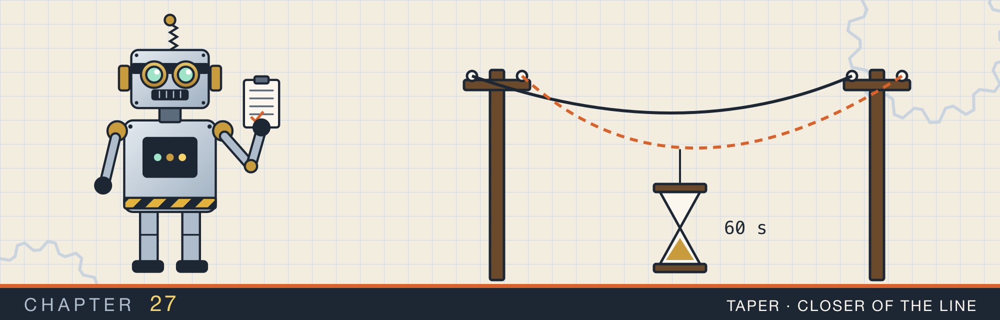
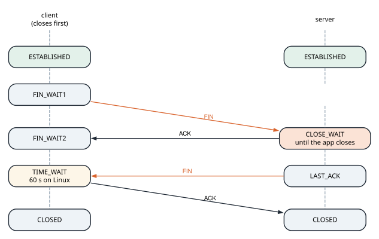

# Closing TCP connections

<div class="covers" markdown="1">

This chapter covers

- How each direction of a TCP connection closes with its own `FIN`
- The states of the side that closes first and of the side that closes second, read from the kernel
- `TIME_WAIT`: what it protects, how long it lasts, and the port limit it puts on busy clients
- `SO_REUSEADDR`, and why a restarted server can bind its port
- `CLOSE_WAIT`: the sockets a server keeps when it never closes, and how to find them
- The reset that replaces `FIN` when a socket closes with unread data

</div>

Chapter 20 opened TCP connections and closed them with `shutdown` and `drop`. Each close sent a `FIN`, and
the other side's `read` returned 0. That is all a program sees. The kernel, though, keeps each side of the
connection in a sequence of states after the program has moved on. Some of those states last a minute. One
lasts for as long as the program forgets to close the socket.

This chapter follows a connection through its close, as the kernel records it. The program, `tcp_close`,
reads each socket's state from Linux's `/proc/net/tcp` at every step, so its output comes from a Linux
container. It also shows the two production problems the close states cause, and the reset that a close
can send instead of a `FIN`.

## 27.1 Two directions, two `FIN`s

A TCP connection carries bytes in both directions, and each direction closes on its own. A side that has
no more bytes to send sends a **`FIN`**, and the other side acknowledges it. After that, bytes can still
flow the other way. The connection is gone only when both directions have closed, which takes four
segments: `FIN`, `ACK`, `FIN`, `ACK`.

The side that sends the first `FIN` makes the **active close**. The other side makes the **passive
close**. They pass through different states (figure 27.1):

| Side | State | Waiting for |
|---|---|---|
| active | `FIN_WAIT1` | the `ACK` of its `FIN` |
| active | `FIN_WAIT2` | the peer's `FIN` |
| active | `TIME_WAIT` | a fixed time, 60 seconds on Linux, before the connection is forgotten |
| passive | `CLOSE_WAIT` | its own program to close the socket |
| passive | `LAST_ACK` | the `ACK` of its `FIN` |

<figure>

<figcaption><b>Figure 27.1</b> The four segments of a close, and the state each side is in between them.</figcaption>
</figure>

Two of these states wait on something other than the network. `CLOSE_WAIT` waits for the program, and
lasts until the program closes the socket. `TIME_WAIT` waits for a clock. Sections 27.2 and 27.3 cover each.

### 27.1.1 Reading the states

Linux lists every IPv4 TCP socket in the file `/proc/net/tcp`, one per line. The second and third columns
are the local and remote addresses, written as `0100007F:1F90`: the IP address, then the port, in
hexadecimal. The fourth column is the state, as a number from `01` for `ESTABLISHED` to `0B` for `CLOSING`.

The program parses the lines into the ports and a state name:

```rust
{{#include ../../rust-interview-lab/src/bin/tcp_close.rs:8:70}}
    // ...
}
```

`entries` skips the header line, splits each line on whitespace, and keeps the three columns it needs. The
`?` operators inside `filter_map` skip any line that does not parse. All connections in this program run
over `127.0.0.1`, so the two ports alone identify a socket.

`state` looks up one socket, and `census` counts the states of every socket on one server port:

```rust
mod linux {
    // ...
{{#include ../../rust-interview-lab/src/bin/tcp_close.rs:72:98}}
    // ...
}
```

A socket the kernel has forgotten has no line in the file, and `state` reports it as `gone`. `connected`
returns both ends of a new connection, so one process can watch both sides.

### 27.1.2 A close, step by step

The first scene closes a connection the way chapter 20's echo test did. The client half-closes with
`shutdown(Write)`, the server reads to the end and replies, then both drop their sockets. After each step
the program waits 50 ms, so the loopback segments have arrived, and prints both states:

```text
1. An orderly close, client first, with a half-close

  step                                   client       server
  connected                              ESTABLISHED  ESTABLISHED
  client shutdown(Write): FIN sent       FIN_WAIT2    CLOSE_WAIT
  server read to end, wrote a reply      FIN_WAIT2    CLOSE_WAIT
  server dropped its socket: FIN sent    TIME_WAIT    gone
  client read the reply, dropped         TIME_WAIT    gone
```

The client never shows `FIN_WAIT1`. On loopback the `ACK` of its `FIN` arrived within microseconds, so by
the time the program looked, the client was in `FIN_WAIT2`. On a network with a 50 ms round trip,
`FIN_WAIT1` would show.

The third row is the half-close at work. The client's direction is closed, the server's is open, and the
server's reply still reached the client. After the server dropped its socket, the server's side passed
through `LAST_ACK` and was gone. The client side went to `TIME_WAIT`, and stayed there after the client
dropped its socket. `TIME_WAIT` belongs to the kernel, not to the program.

Animation 27.1 follows these steps, then shows a server that never closes.

<figure class="anim">
<video class="motion" src="figures/ch27-close.mp4" autoplay loop muted playsinline preload="metadata" aria-label="A client robot and a server robot joined by a wire, each with its TCP state above it. The client's shutdown sends FIN; the server's kernel acknowledges it, and the states become FIN_WAIT2 and CLOSE_WAIT. The server's read returns 0, it writes a reply that crosses to the client, and it drops its socket, which sends FIN. The server goes through LAST_ACK to gone, and the client acknowledges and enters TIME_WAIT, where a 60-second clock runs after the client drops its socket. In a second run the server never drops its sockets: five clients connect and close, each leaves a FIN_WAIT2 on the client side and a CLOSE_WAIT on the server, and the server's count of open descriptors climbs toward its limit." data-chapters="[[0.0, &quot;FIN&quot;], [15.42, &quot;reply&quot;], [23.42, &quot;second FIN&quot;], [42.42, &quot;leak&quot;]]"></video>
<figcaption><b>Animation 27.1</b> Each side's <code>FIN</code> closes one direction. A server that never closes leaves every connection in <code>CLOSE_WAIT</code>, holding a descriptor.</figcaption>
</figure>

## 27.2 `TIME_WAIT`

The side that closes first waits in `TIME_WAIT` before the kernel forgets the connection. The wait covers
two failures:

- **A lost final `ACK`.** If the last `ACK` is lost, the peer, still in `LAST_ACK`, sends its `FIN` again.
  A side in `TIME_WAIT` still knows the connection and answers with another `ACK`. A side that had forgotten it would answer with a reset. The peer would then report an error for a connection that closed cleanly.
- **Old segments.** A segment from the old connection can arrive late, delayed in some router. Suppose a new connection with the same four values, both addresses and both ports, exists by then. The old segment could be taken as part of the new stream. `TIME_WAIT` keeps those four values reserved until such segments have
  expired.

The TCP standard sets the wait to twice the maximum segment lifetime. Linux fixes it at 60 seconds.

### 27.2.1 The cost: ports on a busy client

A socket in `TIME_WAIT` holds a few hundred bytes of kernel memory, which is cheap. The scarce resource is
the four values it reserves. A client uses a new local port for each connection to a server. The kernel picks it from the **ephemeral port range**: 32768 to 60999 on Linux, which is 28,232 ports. If
the client closes first, each port stays in `TIME_WAIT` for 60 seconds. The client can then open about 470 new connections per second to one server address and port. Beyond that, `connect` fails with `EADDRNOTAVAIL`.

Three fixes are common:

- **Reuse connections.** An HTTP client that keeps connections alive, or a connection pool, as in chapter
  29, makes few connections and few closes.
- **Let the server close first.** Then `TIME_WAIT` lands on the server. All its connections share its one port, so the entries use up nothing.
- **`net.ipv4.tcp_tw_reuse`.** This Linux setting lets an outgoing connection reuse a port in `TIME_WAIT`
  when TCP timestamps prove its segments are newer.

### 27.2.2 Binding a port with connections in `TIME_WAIT`

A server that closes first collects `TIME_WAIT` entries on its own port. If it restarts within a minute,
its new listening socket asks for a port that those entries still use. By default, `bind` refuses.
**`SO_REUSEADDR`** allows the bind as long as no socket on the port is listening. Rust's `TcpListener::bind`
sets it on Unix, so the program uses raw calls to bind both ways:

```rust
mod linux {
    // ...
{{#include ../../rust-interview-lab/src/bin/tcp_close.rs:100:141}}
    // ...
}
```

The third scene closes one connection server-first, drops the listener, and binds the port again:

```text
3. TIME_WAIT on the server's port, and binding it again

  server closed first, then the client: {"TIME_WAIT": 1}
  bind port again, SO_REUSEADDR false: Address already in use (os error 98)
  bind port again, SO_REUSEADDR true : bound
```

One socket in `TIME_WAIT` was enough to stop a plain `bind`.

## 27.3 `CLOSE_WAIT`

The side that receives the first `FIN` moves to `CLOSE_WAIT`, and stays there until its own program
closes the socket. The kernel cannot leave `CLOSE_WAIT` on its own. Only the program knows whether it still
wants to send.

A server that never closes a connection after the client has gone leaves it in `CLOSE_WAIT` for as long as
the server runs. Each such connection holds a descriptor. The usual causes are a handler that ignores a `read` of 0, and a connection kept in a map that nothing removes. A reference cycle that keeps a socket's owner alive does the same.

`leaky_server` keeps every accepted socket in a `Vec`, while each client connects and closes at once:

```rust
mod linux {
    // ...
{{#include ../../rust-interview-lab/src/bin/tcp_close.rs:143:157}}
    // ...
}
```

```text
2. A server that never closes what clients closed

  while the server keeps 5 sockets: {"CLOSE_WAIT": 5, "FIN_WAIT2": 5}
  after the server drops them:      {"TIME_WAIT": 5}
```

Five connections waited at the halfway point of figure 27.1. The clients were in `FIN_WAIT2`, waiting for a `FIN`, and the server in `CLOSE_WAIT`, waiting for itself. When the server dropped the `Vec`, it sent five
`FIN`s, and the clients' sides moved to `TIME_WAIT`. The clients had already closed their descriptors.
Linux keeps such an orphaned `FIN_WAIT2` socket for 60 seconds (`tcp_fin_timeout`), then drops it.

In production, `ss -tan state close-wait` lists the `CLOSE_WAIT` sockets of every process. A count that only grows is a leak in the program that owns them. It ends in `EMFILE`, "Too many open files", as in section 24.1.

## 27.4 Reset instead of `FIN`

A socket that is closed while its receive buffer still holds unread bytes does not send `FIN`. The kernel
sends a **reset** (`RST`) instead, which tells the peer that data was thrown away. The peer's next `read`
fails with `ECONNRESET`, and any bytes the peer had not yet read from its own buffer are discarded.

```rust
mod linux {
    // ...
{{#include ../../rust-interview-lab/src/bin/tcp_close.rs:159:169}}
}
```

```text
4. Closing with unread data

  client read failed: Connection reset by peer (os error 104)
```

This bites HTTP servers. Suppose a server sends an error response and closes before reading the whole request body. The reset can arrive while the response is still on its way. The client then reports a reset
instead of the response. Servers avoid it with a **lingering close**. After the response they call `shutdown(Write)`, read and discard the rest of the request for a short time, then close.

A program can also ask for a reset on purpose, by setting `SO_LINGER` with a timeout of 0 before closing.
The connection skips `TIME_WAIT`, and the peer gets `ECONNRESET`. Load balancers use it to drop connections
quickly. It also discards any unsent data, so it is a poor default.

## 27.5 The complete program

<p class="listing"><b>Listing 27.1</b> The states of a closing connection, read from <code>/proc/net/tcp</code>. <a href="https://github.com/arpanpathak/cracking-the-systems-programming-interview/blob/prep-v2/rust-interview-lab/src/bin/tcp_close.rs">src/bin/tcp_close.rs</a></p>

```rust
{{#include ../../rust-interview-lab/src/bin/tcp_close.rs}}
```

```text
$ cargo run --bin tcp_close
1. An orderly close, client first, with a half-close

  step                                   client       server
  connected                              ESTABLISHED  ESTABLISHED
  client shutdown(Write): FIN sent       FIN_WAIT2    CLOSE_WAIT
  server read to end, wrote a reply      FIN_WAIT2    CLOSE_WAIT
  server dropped its socket: FIN sent    TIME_WAIT    gone
  client read the reply, dropped         TIME_WAIT    gone

2. A server that never closes what clients closed

  while the server keeps 5 sockets: {"CLOSE_WAIT": 5, "FIN_WAIT2": 5}
  after the server drops them:      {"TIME_WAIT": 5}

3. TIME_WAIT on the server's port, and binding it again

  server closed first, then the client: {"TIME_WAIT": 1}
  bind port again, SO_REUSEADDR false: Address already in use (os error 98)
  bind port again, SO_REUSEADDR true : bound

4. Closing with unread data

  client read failed: Connection reset by peer (os error 104)
```

## 27.6 Questions that come up

**"A server has 30,000 sockets in `TIME_WAIT`. Is that a problem?"**
Usually not on the server. They share the server's port and cost little memory. It is a problem on a
client, where each one holds an ephemeral port to the same destination.

**"A server has 3,000 sockets in `CLOSE_WAIT` and the number keeps rising. What happened?"**
The clients closed, and the server never closed its side. Look for a code path that returns without
dropping the connection, or a collection that keeps connections after they end.

**"Why not shorten `TIME_WAIT`?"**
Linux has no setting for it: the 60 seconds is a constant in the kernel. Reusing connections removes the need, and `tcp_tw_reuse` covers the outgoing case safely.

**"What is the difference between `shutdown(Write)` and `close`?"**
`shutdown(Write)` sends `FIN` and keeps the socket open for reading. `close` releases the descriptor. If no
other descriptor refers to the socket, the kernel sends `FIN`, or a reset if unread data remains.

**"Both sides send `FIN` at the same moment. What happens?"**
Both go from `FIN_WAIT1` to `CLOSING`, a state for this simultaneous close, then both to `TIME_WAIT`.

<div class="summary" markdown="1">

## Summary

- Each direction of a connection closes with its own `FIN` and `ACK`, four segments in all.
- The side that closes first passes through `FIN_WAIT1`, `FIN_WAIT2`, and `TIME_WAIT`. The other passes
  through `CLOSE_WAIT` and `LAST_ACK`.
- `TIME_WAIT` lasts 60 seconds on Linux. It answers a retransmitted `FIN` and keeps late segments out of a
  new connection with the same addresses and ports.
- On a client, `TIME_WAIT` holds ephemeral ports: about 470 new connections per second to one server.
  Reusing connections is the fix.
- `SO_REUSEADDR` lets a server bind a port that has connections in `TIME_WAIT`. `TcpListener::bind` sets it.
- `CLOSE_WAIT` lasts until the program closes the socket. A growing count is a leak of descriptors.
- Closing with unread data sends a reset, and the peer's `read` fails with `ECONNRESET`.

</div>

Chapter 28 adds encryption to a connection. It runs TLS with `rustls`, checks the server's certificate,
and then has the server check a certificate from the client.

## Exercises

1. Add `thread::sleep(Duration::from_secs(61))` at the end of the first scene and print the client's state
   again. What does it show?
2. Change `leaky_server` so the server closes first and the clients never do. Which side holds `FIN_WAIT2`,
   which holds `CLOSE_WAIT`, and which ends up in `TIME_WAIT`?
3. Open 1,000 connections to one listener in a loop, closing each from the client side, and print the
   `census` afterwards. Then make the server close first and compare.
4. In `close_with_unread_data`, read the client's bytes on the server before dropping it. What does the
   client's `read` return now?
5. Set `SO_LINGER` to `{ l_onoff: 1, l_linger: 0 }` on the server's socket with `libc::setsockopt` before
   dropping it in the first scene. Which states disappear, and what does the client's `read` report?
