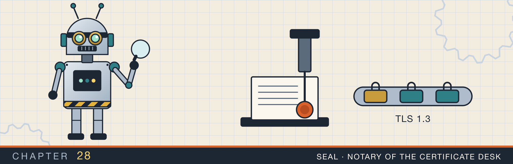
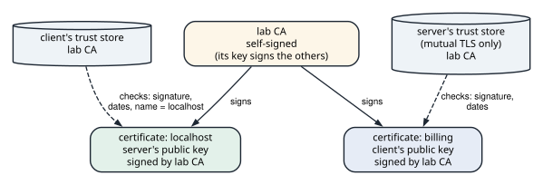
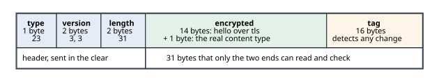

# TLS and mutual TLS

<div class="covers" markdown="1">

This chapter covers

- What TLS adds to a TCP connection: secrecy, integrity, and proof of who the server is
- Certificates, certificate authorities, and the three checks a client makes
- The TLS 1.3 handshake, and the records it puts on the wire, read byte by byte
- A client and server on `rustls`, with certificates made at startup by `rcgen`
- The errors a client reports for a wrong name and for an unknown authority
- Mutual TLS, where the server checks a certificate from the client

</div>

The connections in chapters 20 to 27 sent their bytes as they were. Every router between the two machines
could read them, and could change them without either side noticing. **TLS**, Transport Layer Security,
runs on top of TCP and fixes three things. The bytes are encrypted, so others cannot read them. Each record
carries a tag, so a changed byte is detected. And the server proves who it is with a certificate, so the
client knows it is not talking to an impostor.

This chapter runs TLS with the `rustls` crate. The program, `tls_mtls`, makes its own certificate authority
and certificates when it starts, runs five connections over loopback, and prints what each side reports.

## 28.1 Certificates and trust

TLS identifies a server with **public-key cryptography**. A key pair is two numbers: a private key that the
owner keeps secret, and a public key that anyone may have. A **signature** made with the private key can be
checked with the public key. Only the holder of the private key can make a signature that checks out.

A **certificate** is a signed statement: "this public key belongs to `localhost`, from this date to that
date". The signer is a **certificate authority** (CA). A client keeps a **trust store**, a list of CA
certificates it accepts. When a server presents its certificate, the client makes three checks (figure 28.1):

1. **The signature.** The certificate is signed by a CA in the trust store, possibly through intermediate
   certificates that the server also sends.
2. **The dates.** The current time is inside the certificate's validity period.
3. **The name.** One of the names in the certificate matches the name the client connected to.

A certificate is public, so anyone can present one. During the handshake, the server also signs data from
that handshake with its private key. That signature proves the server holds the key that matches the
certificate.

<figure>

<figcaption><b>Figure 28.1</b> One CA signs both certificates. Each side trusts the CA, and so trusts what it signed.</figcaption>
</figure>

On the public internet, trust stores hold a few hundred commercial CAs, and browsers ship them. Inside a
company, services often trust a private CA of their own, as this program does.

### 28.1.1 Making the certificates

`rcgen` creates key pairs and certificates in memory. `Pki` makes a CA, then has it sign one certificate
for the server and one for the client:

```rust
{{#include ../../rust-interview-lab/src/bin/tls_mtls.rs:11:89}}
```

`IsCa::Ca` marks the first certificate as one that may sign others. `self_signed` signs it with its own key. A CA at the top of a chain vouches for itself. A client trusts it only if it is in the trust store.
`CertificateParams::new` takes the names the certificate covers. `signed_by` signs the new certificate's
public key with the CA's key. The private keys never leave the process. `roots` builds a trust store that
holds only this CA.

## 28.2 The TLS 1.3 handshake

Before any application bytes move, the two sides run a **handshake**. In TLS 1.3 it takes one round trip:

| Step | From | Messages | Encrypted |
|---|---|---|---|
| 1 | client | `ClientHello`: cipher suites, a key share, and the server's name (SNI) | no |
| 2 | server | `ServerHello`: the chosen suite and the server's key share | no |
| 3 | server | `Certificate`, `CertificateVerify` (the signature), `Finished` | yes |
| 4 | client | `Finished` | yes |

After step 2, each side combines its own secret with the other's key share, and both get the same keys. Anyone watching the wire cannot compute them. This is an elliptic-curve Diffie-Hellman exchange. Everything after
`ServerHello` is encrypted with those keys, including the server's certificate. The client checks the
certificate and the signature in step 3 before it sends step 4. The client's first application bytes can
travel with its `Finished`.

TLS sends everything in **records**. Each record starts with a 5-byte header: a content type (22 for
handshake, 23 for application data), a version, and a 2-byte length.

### 28.2.1 Watching the wire

To see the records, the client's socket is wrapped in `Tap`, which keeps a copy of every byte written.
`records` walks the copy, one header at a time:

```rust
{{#include ../../rust-interview-lab/src/bin/tls_mtls.rs:97:140}}
```

The slice pattern `[kind, _, _, high, low, rest @ ..]` matches only while at least five bytes remain, and
names the parts of the header. `rest.get(length..)` skips the record's body, and returns `None` if the body
is cut short, which ends the loop.

### 28.2.2 A client and a server

`rustls` keeps TLS separate from I/O. A `ClientConnection` or `ServerConnection` holds the TLS state, and
`StreamOwned` joins it to any type that implements `Read` and `Write`. The handshake runs inside the first
`read` or `write`.

The configurations are built in steps. Both name the crypto provider, `ring`, explicitly. The server gives
its certificate and key, and the client gives its trust store:

```rust
{{#include ../../rust-interview-lab/src/bin/tls_mtls.rs:228:241}}
    // ...
}
```

`with_safe_default_protocol_versions` allows TLS 1.3 and 1.2. `with_no_client_auth` means the server asks
for no client certificate, and the client offers none.

The server accepts one connection and answers one message in capitals:

```rust
{{#include ../../rust-interview-lab/src/bin/tls_mtls.rs:142:161}}
```

`send_close_notify` queues a closing alert, which tells the client that the stream ended on purpose. TLS
needs it because an attacker can cut a TCP connection at any point. Without the alert, the client could not
tell a complete reply from a truncated one, and `rustls` reports that case as an error.

The client connects through the tap, sends `hello over tls`, and reads the reply:

```rust
{{#include ../../rust-interview-lab/src/bin/tls_mtls.rs:163:203}}
```

`ServerName` is the name the client expects. `rustls` sends it as SNI in the `ClientHello`, and checks the
server's certificate against it.

Animation 28.1 follows this connection, then the mutual TLS connections of section 28.4.

<figure class="anim">
<video class="motion" src="figures/ch28-tls.mp4" autoplay loop muted playsinline preload="metadata" aria-label="A client robot and a server robot joined by a wire. The client sends ClientHello with its key share and the name localhost. The server answers ServerHello with its key share, and both robots get the same key. Locked messages follow from the server: its certificate, signed by the lab CA; CertificateVerify, a signature with its private key; and Finished. The client checks the signature chain to its trust store, the dates, and that the name is localhost, then sends Finished, and its 14-byte message travels as a locked 31-byte record. In mutual TLS the server also sends CertificateRequest. A client with the billing certificate sends Certificate and CertificateVerify, and the server checks them against the lab CA. A client with no certificate sends an empty Certificate, and the server ends the handshake with the alert CertificateRequired." data-chapters="[[0.0, &quot;hello&quot;], [12.36, &quot;keys&quot;], [22.38, &quot;certificate&quot;], [37.86, &quot;data&quot;], [48.06, &quot;mutual&quot;], [67.38, &quot;no certificate&quot;]]"></video>
<figcaption><b>Animation 28.1</b> One round trip sets up the keys, and everything after <code>ServerHello</code> is encrypted. In mutual TLS the server asks for a certificate, and refuses a client without one.</figcaption>
</figure>

`main` runs the scenes. The first is the plain case:

```text
1. The client checks the server's certificate
  client: TLSv1_3 TLS13_AES_256_GCM_SHA384, reply "HELLO OVER TLS"
  client sent records: [("handshake", 231), ("change_cipher_spec", 1), ("application_data", 69), ("application_data", 31)]
  "hello" readable on the wire: false
  server: client presented no certificate
```

The client sent four records:

- **`handshake`, 231 bytes**: the `ClientHello`, the only record the client sent in the clear.
- **`change_cipher_spec`, 1 byte**: a record TLS 1.3 does not use. It is sent so that old middleboxes,
  which expect TLS 1.2, let the connection through.
- **`application_data`, 69 bytes**: the client's `Finished`. In TLS 1.3, encrypted handshake messages are
  labeled as application data, so an observer cannot tell them apart.
- **`application_data`, 31 bytes**: the 14 bytes of `hello over tls`, plus 1 byte for the real content type
  and a 16-byte tag that detects any change.

<figure>

<figcaption><b>Figure 28.2</b> The client's last record, byte by byte. Only the header can be read on the wire.</figcaption>
</figure>

The plaintext appears nowhere in what the client sent.

## 28.3 When the check fails

The second and third scenes break one of the client's checks each:

```text
2. The client expects a different name
  client: invalid peer certificate: certificate not valid for name "billing.example"; certificate is only valid for DnsName("localhost")
  server: handshake failed: unexpected end of file

3. The client does not trust the CA
  client: invalid peer certificate: UnknownIssuer
  server: handshake failed: unexpected end of file
```

In both cases the client stopped in step 3 of the handshake and closed the connection, so the server saw
the stream end. The certificate was valid in both. The client rejected it because it named a different
server, or because nothing in the trust store had signed it.

These checks are the whole of TLS's protection against an impostor. Encryption to an unchecked server is
encryption to whoever answered. `rustls` has no flag to turn the checks off. A program that wants to skip
them must write its own `ServerCertVerifier`, under a module named `danger`.

## 28.4 Mutual TLS

In plain TLS, only the server proves who it is. The client is anonymous at the TLS level, and proves itself,
if at all, with a password or token inside the encrypted stream. In **mutual TLS** (mTLS), the server asks
for a certificate in the handshake. The client sends one, with its own `CertificateVerify` signature. Each
side then knows which key the other holds.

Services inside one company use mutual TLS to authenticate each other. The certificate's name becomes the
caller's identity, and the server can then authorize by it: requests from `billing` may read invoices,
for example.

The server adds a client certificate verifier that trusts the same CA:

```rust
fn main() -> Result<(), Error> {
    // ...
{{#include ../../rust-interview-lab/src/bin/tls_mtls.rs:260:277}}
}
```

```text
4. Mutual TLS, client without a certificate
  client: received fatal alert: CertificateRequired
  server: handshake failed: peer sent no certificates

5. Mutual TLS, client with the billing certificate
  client: TLSv1_3 TLS13_AES_256_GCM_SHA384, reply "HELLO OVER TLS"
  client sent records: [("handshake", 231), ("change_cipher_spec", 1), ("application_data", 481), ("application_data", 31)]
  "hello" readable on the wire: false
  server: client presented 1 verified certificate
```

The client without a certificate got a fatal alert, `CertificateRequired`, and the server reported why.
With the certificate, the client's encrypted handshake record grew from 69 to 481 bytes. The extra 412
bytes carry the client's certificate and its signature.

Certificates expire, and a service that uses mutual TLS has to replace them before they do. Production
systems issue certificates that last hours or days, and rotate them automatically. A leaked key is then
useful only until its certificate expires.

### 28.4.1 What TLS costs

- **A round trip.** A new connection waits for TCP's handshake and then for TLS's, two round trips before
  the first request. Across regions that is 100 ms or more. **Session resumption** lets a client that has connected before skip the certificate exchange. A connection pool (chapter 29) avoids the handshake for most requests.
- **CPU.** The key exchange and the signatures cost tens to hundreds of microseconds per handshake. The
  symmetric encryption of the data afterwards runs at gigabytes per second on modern CPUs.
- **Copies.** `rustls` encrypts in user space, so a TLS server cannot use `sendfile` to send a file
  without copying it, as section 23.3.2 explained.

## 28.5 The complete program

<p class="listing"><b>Listing 28.1</b> TLS and mutual TLS with <code>rustls</code>, on certificates made by <code>rcgen</code>. <a href="https://github.com/arpanpathak/cracking-the-systems-programming-interview/blob/prep-v2/rust-interview-lab/src/bin/tls_mtls.rs">src/bin/tls_mtls.rs</a></p>

```rust
{{#include ../../rust-interview-lab/src/bin/tls_mtls.rs}}
```

```text
$ cargo run --bin tls_mtls
1. The client checks the server's certificate
  client: TLSv1_3 TLS13_AES_256_GCM_SHA384, reply "HELLO OVER TLS"
  client sent records: [("handshake", 231), ("change_cipher_spec", 1), ("application_data", 69), ("application_data", 31)]
  "hello" readable on the wire: false
  server: client presented no certificate

2. The client expects a different name
  client: invalid peer certificate: certificate not valid for name "billing.example"; certificate is only valid for DnsName("localhost")
  server: handshake failed: unexpected end of file

3. The client does not trust the CA
  client: invalid peer certificate: UnknownIssuer
  server: handshake failed: unexpected end of file

4. Mutual TLS, client without a certificate
  client: received fatal alert: CertificateRequired
  server: handshake failed: peer sent no certificates

5. Mutual TLS, client with the billing certificate
  client: TLSv1_3 TLS13_AES_256_GCM_SHA384, reply "HELLO OVER TLS"
  client sent records: [("handshake", 231), ("change_cipher_spec", 1), ("application_data", 481), ("application_data", 31)]
  "hello" readable on the wire: false
  server: client presented 1 verified certificate
```

## 28.6 Questions that come up

**"What does SNI do, and is it encrypted?"**
SNI, Server Name Indication, carries the host name in the `ClientHello`. One IP address can then serve certificates for many names. It is sent in the clear. Encrypted Client Hello (ECH) hides it, where both
sides support it.

**"Where should TLS end in a system?"**
At a load balancer, the bytes are plaintext between the balancer and the servers behind it. That is
acceptable on a trusted network. Mutual TLS between services keeps them encrypted and authenticated all the
way.

**"A client fails with `UnknownIssuer` against a server that works in a browser. Why?"**
Usually the server sends only its own certificate, without the intermediate that links it to a root. A
browser may have the intermediate cached, and a fresh client does not. The server should send the full chain.

**"What does 0-RTT mean?"**
A client resuming an earlier session can send application data in its first flight, before the handshake
completes. An attacker can replay that data, so it is only safe for requests that are idempotent, in the
sense of chapter 19.

**"How does a server revoke a client's certificate before it expires?"**
With a revocation list that the verifier checks, which `WebPkiClientVerifier` accepts. Short-lived
certificates often replace revocation: the certificate is not renewed, and it expires within hours.

<div class="summary" markdown="1">

## Summary

- TLS adds encryption, tamper detection, and server authentication on top of TCP.
- A certificate binds a name to a public key, signed by a CA. A client checks the signature chain to its
  trust store, the dates, and the name.
- The `CertificateVerify` signature proves that the server holds the certificate's private key.
- TLS 1.3 sets up keys in one round trip and encrypts everything after `ServerHello`. On the wire, only the
  `ClientHello` was readable, and the 14-byte message became a 31-byte record.
- A wrong name and an unknown CA both fail in the handshake, before any application data moves.
- Mutual TLS has the client present a certificate too. Without one, the server ended the handshake with
  `CertificateRequired`.
- TLS costs a round trip and some CPU per new connection, which connection reuse avoids.

</div>

Chapter 29 builds that reuse: a client connection pool. It bounds the number of connections, takes each one back when its user is done, and drops connections idle for too long.

## Exercises

1. Print the length of the server's certificate and of the client's. Compare with the 412 extra bytes in
   the mutual TLS record, and account for the rest.
2. Make the server certificate valid for both `localhost` and `api.internal` with `CertificateParams::new`,
   and connect with each name.
3. Set the server certificate's `not_after` to yesterday with `rcgen`'s `date_time_ymd`, and record the
   client's error.
4. Issue the server certificate from an intermediate CA signed by the root, and have the server send only its
   own certificate. Then send the chain. What does the client report in each case?
5. Restrict the server to TLS 1.2 with `with_protocol_versions(&[&rustls::version::TLS12])`. Compare the
   records the client sends with the TLS 1.3 run.
