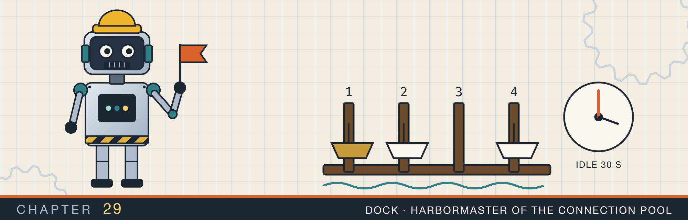

# A client connection pool

<div class="covers" markdown="1">

This chapter covers

- What a new connection costs, and why a client keeps connections open between requests
- A pool with a hard limit on open connections, and a deadline for callers that have to wait
- A guard type that returns its connection when dropped, and a way to throw a broken one away
- Reusing the newest idle connection first, and closing connections idle for too long
- Connections the server closed while they sat idle, and how to detect them before reuse
- 2,000 requests with and without a pool, measured

</div>

Chapter 27 showed that each closed connection leaves a socket in `TIME_WAIT`, and that a busy client runs
out of ports. Chapter 28 added a TLS handshake to every new connection. Both costs come from making connections. A client avoids most of them by keeping a few connections open, and sending request after request over them. A **connection pool** holds those connections and lends them to the threads that
need them.

This chapter builds a pool on the standard library: a `Mutex`, a `Condvar`, and a guard type with `Drop`.
The program, `conn_pool`, runs it against a small line server on loopback, and measures each of the pool's
rules.

## 29.1 What a new connection costs

Each new TCP connection costs:

- **A round trip** for the TCP handshake before the first byte, and a second one for TLS.
- **A slow start.** A new connection begins with a small congestion window and grows it over several round
  trips (section 20.2). A connection that has been in use already has a large one.
- **Work on the server**: an `accept`, a descriptor, and often a thread or a task.
- **A socket in `TIME_WAIT`** after the close, on whichever side closed first.

On a network with a 50 ms round trip, the handshakes alone add 100 ms. On an open connection, the same request might take 5 ms.

Keeping connections open has costs too. Each open connection holds a descriptor and buffers on both
machines, and a server can hold only so many. A pool therefore keeps a bounded number of connections and
lends them out one caller at a time. It follows four rules:

1. **A bound.** At most `max` connections are open, counting those lent out and those idle.
2. **Automatic return.** A borrowed connection comes back when the borrower drops it, unless the borrower
   reports it broken.
3. **Newest first.** The most recently returned idle connection is reused first.
4. **No stale connections.** A connection idle longer than `idle_timeout`, or one the server has closed, is
   closed instead of lent.

Figure 29.1 shows the path of a call to `get` through the four rules.

<figure>

<figcaption><b>Figure 29.1</b> One call to <code>get</code>. A caller gets an idle connection, a new one, or waits for a return until its deadline.</figcaption>
</figure>

## 29.2 The pool's state

`Config` holds the limits, and `Stats` counts what the pool does, so the program can print it:

```rust
{{#include ../../rust-interview-lab/src/bin/conn_pool.rs:8:42}}
```

The pool keeps its idle connections in a `Vec` used as a stack, each with the time it was returned. `open`
counts every connection the pool owns, idle or lent out:

```rust
{{#include ../../rust-interview-lab/src/bin/conn_pool.rs:44:68}}
```

The invariant is that `open` equals the number of idle connections plus the number lent out. Every change to
`open` happens under the mutex, so `get` can trust it when it decides whether to connect.

`Pooled` is the borrowed connection. It holds a reference to its pool, so the borrow checker keeps every
`Pooled` from outliving the pool. The stream sits in an `Option`, so `Drop` can move it out.

## 29.3 Borrowing a connection

`get` loops under the lock until it has a connection or runs out of time:

```rust
{{#include ../../rust-interview-lab/src/bin/conn_pool.rs:83:122}}
    // ...
}
```

Each pass tries three things in order:

- **An idle connection.** `take_idle` returns the newest usable one, or `None`.
- **A new connection.** If fewer than `max` are open, `get` counts the new one in `open` under the lock. Then it drops the lock and connects. A connect can take a whole round trip, or seconds if the server is
  slow to answer. Holding the lock that long would stop every other caller, including those returning
  connections. Counting the slot first keeps two callers from both deciding there is room for one more.
- **Wait.** Otherwise the caller sleeps on the `Condvar` until a connection is returned or the deadline
  passes. `wait_timeout` releases the lock while it sleeps, as in section 16.5. It can also return early,
  so the loop checks the state again on every wake.

A caller that cannot get a connection by its deadline gets `ErrorKind::TimedOut`. Waiting forever would
turn an overloaded server into callers that never return. The deadline turns overload into an error the
caller can handle, as with the bounded queues of chapter 17.

If the connect fails, `connect` gives the slot back:

```rust
impl Pool {
    // ...
{{#include ../../rust-interview-lab/src/bin/conn_pool.rs:141:164}}
    // ...
}
```

## 29.4 Giving it back

`Drop` returns the connection, so a caller cannot forget to. Early returns and `?` return it too:

```rust
impl Pool {
    // ...
{{#include ../../rust-interview-lab/src/bin/conn_pool.rs:166:192}}
}
```

```rust
{{#include ../../rust-interview-lab/src/bin/conn_pool.rs:195:226}}
```

`give_back` pushes the connection onto the idle stack and wakes one waiting caller. `discard` marks the
guard broken, so `Drop` closes the connection and frees its slot instead. A caller discards a connection
after any error on it. A failed request may have left half a response in the socket. The next caller would read it as the start of its own.

`ask` puts the two together. It is how the program sends every pooled request:

```rust
{{#include ../../rust-interview-lab/src/bin/conn_pool.rs:228:250}}
```

## 29.5 Stale connections

The pool takes the newest idle connection first. Under light load, a few connections then do all the work. The rest sink to the bottom of the stack and age past `idle_timeout`. Taking the oldest first
would keep every connection in light use, and none would ever be closed.

The server also closes connections it considers idle. Most HTTP servers do it after somewhere between 5
seconds and a few minutes. The server's `FIN` arrives while the connection sits in the pool, and nothing
reads it. The next caller to borrow that connection writes its request into a socket the server has closed.
Its `read` then returns 0, or the write draws a reset.

`take_idle` handles both kinds of stale connection:

```rust
{{#include ../../rust-interview-lab/src/bin/conn_pool.rs:70:81}}
```

```rust
impl Pool {
    // ...
{{#include ../../rust-interview-lab/src/bin/conn_pool.rs:124:139}}
    // ...
}
```

`is_alive` peeks at the socket without blocking. On an idle connection nothing should be waiting to be
read, so `WouldBlock` means the connection is open. A peek that returns 0 bytes has found the server's
`FIN`. A peek that returns data has found bytes nobody asked for. Either way, the connection is closed.

The check narrows the window, and does not close it. The server can close the connection between the peek
and the request. Two more measures cover the rest:

- Set the pool's `idle_timeout` shorter than the server's idle timeout, so the pool closes connections
  before the server does.
- Retry an idempotent request once on a new connection when a reused one fails, with the retry policy of
  chapter 19.

Animation 29.1 follows the pool through borrowing, waiting, eviction, and a stale connection.

<figure class="anim">
<video class="motion" src="figures/ch29-pool.mp4" autoplay loop muted playsinline preload="metadata" aria-label="Three caller robots on the left, the pool in the middle with two slots and an idle shelf, and the server on the right. Caller A gets a connection: the shelf is empty and open is 0 of 2, so the pool connects. A sends a request, gets a reply, and drops the guard; the connection goes onto the idle shelf with an age clock. Caller B gets it from the shelf, a reuse. A and B now hold both connections, and caller C's get finds open at 2 of 2 and sleeps on the Condvar. B drops its guard, C wakes and takes the returned connection. Later a connection on the shelf ages past idle_timeout and is closed. In a last run the server closes an idle connection, its FIN lands on the shelf unread, and a pool without the liveness check lends it: the caller writes, read returns 0, and the request fails." data-chapters="[[0.0, &quot;connect&quot;], [13.1, &quot;reuse&quot;], [19.7, &quot;limit&quot;], [39.98, &quot;eviction&quot;], [55.18, &quot;stale&quot;]]"></video>
<figcaption><b>Animation 29.1</b> The pool lends, takes back, makes a caller wait at its limit, and closes an idle connection. Without the liveness check, it lends a connection the server has already closed.</figcaption>
</figure>

## 29.6 Measured

`main` runs four scenes against the line server. The first sends 2,000 requests from eight threads, first
with a new connection for each request, then through a pool of four:

```text
1. 2000 requests from 8 threads
  a new connection each:   2000 connections,  169.8 ms
  a pool of 4:                4 connections,   80.4 ms, 1996 reuses
```

On loopback a connect costs microseconds, and the pool still halved the time. Each request without the pool also left a socket in `TIME_WAIT`: 2,000 in 0.17 seconds. At that rate, the ephemeral ports of section 27.2.1 run out in under 3 seconds. On a real network with TLS, each of those connections would also cost two
round trips.

The other scenes check one rule each:

```text
2. The bound: 2 connections, both lent out
  third get after 103 ms: Err(Custom { kind: TimedOut, error: "pool exhausted" })
  after one is returned: Ok(()), sizes (open, idle) = (2, 1)

3. Idle eviction: idle_timeout 100 ms
  connects 2, evicted 1

4. A server that closes idle connections after 50 ms
  check_alive false: Err(Custom { kind: UnexpectedEof, error: "server closed the connection" }), stale discarded 0
  check_alive true : Ok("ok second"), stale discarded 1
```

With both connections lent out, the third `get` waited its full 100 ms deadline and failed. Once a
connection came back, the next `get` reused it. A connection idle for 150 ms against a 100 ms limit was
closed, and the second request connected again. Against a server that closes idle connections after 50 ms,
the pool without the check lent a closed connection, and the request failed. With the check, the pool found
the server's `FIN`, discarded the connection, and connected again.

## 29.7 The complete program

<p class="listing"><b>Listing 29.1</b> A bounded connection pool with automatic return, idle eviction, and a liveness check. <a href="https://github.com/arpanpathak/cracking-the-systems-programming-interview/blob/prep-v2/rust-interview-lab/src/bin/conn_pool.rs">src/bin/conn_pool.rs</a></p>

```rust
{{#include ../../rust-interview-lab/src/bin/conn_pool.rs}}
```

```text
$ cargo run --release --bin conn_pool
1. 2000 requests from 8 threads
  a new connection each:   2000 connections,  169.8 ms
  a pool of 4:                4 connections,   80.4 ms, 1996 reuses

2. The bound: 2 connections, both lent out
  third get after 103 ms: Err(Custom { kind: TimedOut, error: "pool exhausted" })
  after one is returned: Ok(()), sizes (open, idle) = (2, 1)

3. Idle eviction: idle_timeout 100 ms
  connects 2, evicted 1

4. A server that closes idle connections after 50 ms
  check_alive false: Err(Custom { kind: UnexpectedEof, error: "server closed the connection" }), stale discarded 0
  check_alive true : Ok("ok second"), stale discarded 1
```

## 29.8 Questions that come up

**"How large should the pool be?"**
Large enough for the requests in flight at peak. That is the request rate times the time each request holds a connection. At 2,000 requests per second and 5 ms each, that is 10. Each client process multiplies it on the
server, so the server's connection limit divided by the number of clients is the upper bound.

**"Why not one pool shared by every server address?"**
A connection is to one address. Real clients keep one pool per host and port, often with a limit per host
and one overall.

**"What does HTTP/2 change?"**
HTTP/2 sends many requests at once over one connection, each in its own stream. A client then needs one
connection per server, or a few, and the pool limits streams rather than connections.

**"What happens when the server restarts?"**
Every idle connection in the pool is closed by the server at once. The liveness check catches most of them.
Requests already in flight fail, and the idempotent ones can be retried.

**"Is a `Mutex` too slow for a pool?"**
The lock is held for a few pushes and pops. It is never held across a connect or a request. At hundreds of thousands
of requests per second, a pool can split into shards with one lock each, as chapter 14 split a map.

<div class="summary" markdown="1">

## Summary

- A new connection costs a round trip, a TLS handshake, a slow start, and a socket in `TIME_WAIT` when it
  closes. A pool pays those costs once per connection, not once per request.
- The pool counts every open connection under one mutex, and never opens more than `max`.
- `get` reuses an idle connection, opens a new one outside the lock, or waits on a `Condvar` until a
  deadline. Overload becomes `TimedOut`, not a caller that hangs.
- The guard returns its connection in `Drop`. `discard` closes a connection after an error, so no caller
  reads another's half-finished response.
- Reusing the newest connection first lets the oldest ones expire under light load.
- A non-blocking `peek` finds a connection the server has closed. Idle timeouts shorter than the server's,
  and one retry for idempotent requests, cover the rest.
- 2,000 requests took 4 connections and 80 ms through the pool, against 2,000 connections and 170 ms
  without it.

</div>

Chapter 30 collects compact versions of the structures from the earlier parts. Each is the shortest program
that still shows the structure working.

## Exercises

1. Add a `max_lifetime` to `Config`, and close a connection older than it even if it is in use often.
   Why do production pools have this limit, when the server's address can change behind a DNS name?
2. Give `get` a fairness guarantee: callers that started waiting first get connections first. What does
   `Condvar::notify_one` promise about order, and what structure would you add?
3. Make `ask` retry once on a new connection when a reused connection fails, but only if the request is
   marked idempotent.
4. Run scene 1 with `max` set to 1, 2, 8, and 16, and plot the time. Where does the curve flatten, and why?
5. Wrap the pool's connections in TLS from chapter 28, and measure scene 1 again with and without the pool.
