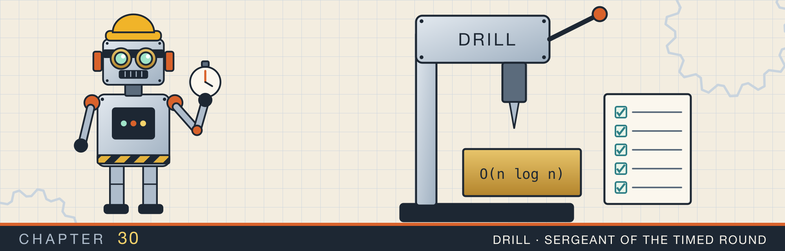
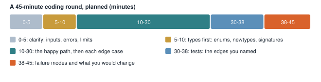

# Drills against the clock

<div class="covers" markdown="1">

This chapter covers

- Ten short implementations, each sized to type in a live round
- Where each drill's full version lives in this book
- Two drills that differ from their reference versions, one of them in a way that changes the answer
- A plan for a 45-minute round, and a way to practice with this repository

</div>

Every chapter so far has shown the long form: the reference implementation with its explanations, its
tests, and its history. In a live round you will not have that. You will have a blank editor, a
problem stated in two sentences, and about forty minutes. `drills.rs` is the short form: ten answers
written at the length you can type under that pressure. Each group carries one test, so you know it runs.

This chapter is a guide to using them. It maps each drill to its chapter, reads the places where the
short form cuts a corner, and ends with a way to rehearse.

## 30.1 The drills

<p class="listing"><b>Listing 30.1</b> Ten answers sized for a live round. <a href="https://github.com/arpanpathak/cracking-the-systems-programming-interview/blob/prep-v2/rust-interview-lab/src/problems/drills.rs">src/problems/drills.rs</a></p>

```rust
{{#include ../../rust-interview-lab/src/problems/drills.rs}}
```

The module comment states the file's role in one line: the neighbouring modules are the reference
versions, and this file is what you type. Table 30.1 pairs each drill with the chapter that explains its
full form.

| Drill | Lines | Full version |
|---|---|---|
| `count_parallel`: `Arc<Mutex<usize>>` counter | 18 | chapter 8 (`total_with_arc_mutex`, listing 8.7), chapter 16 |
| `parallel_sum`: scoped threads | 12 | chapter 16, `threads::parallel_sum`, listing 16.5 |
| `SpinLock` and `SpinGuard` | 45 | chapter 16, listing 16.12 |
| `Semaphore` | 36 | chapter 16, listing 16.15 |
| `BlockingQueue` with `close` | 62 | chapter 17, listing 17.16 |
| `ThreadPool` with `Drop` | 45 | chapter 18, listing 18.7 |
| `retry` with backoff | 21 | chapter 19, listing 19.9 |
| `HashRing` | 33 | chapter 14, listing 14.9 |
| `parse_request_head` | 29 | chapter 21, listing 21.1 |
| `Port` newtype and `Route` enum | 32 | chapter 7 (the `GpuCount` newtype, listing 7.2); chapter 21, `route` |

## 30.2 What the short forms leave out

A drill is allowed to be simpler than its reference. Knowing *what* it left out is part of the answer,
because the follow-up question is usually aimed at exactly that.

**The spin lock uses `swap`.** `while self.locked.swap(true, Acquire) { spin_loop() }` is a
test-and-set lock: every waiting thread writes the lock's cache line on every iteration. The reference
version in chapter 16 uses `compare_exchange_weak` and spins on a *load*, so waiters share the line
read-only until it is released. Both are correct; the reference scales better under contention. The
drill also omits the `SAFETY` comments, which in a real review you would add back.

**The semaphore has no guard.** `acquire` and `release` are separate calls, so a caller that panics
between them leaks a permit. The reference in section 16.5 returns a `SemaphoreGuard` whose `Drop` gives the
permit back.

**The thread pool receives in a let-else.** `let Ok(job) = receiver.lock().expect(..).recv() else { return; };`
is a `let` statement, so the `MutexGuard` temporary is dropped at its end, before `job()` runs. The
pool is fully parallel, which a timing confirms: four 200 ms jobs on four workers take 205 ms. The same
receive written as `while let` would serialize the pool (chapter 18, figure 18.2), so this is the form
to memorize.

**The hash ring wraps with `%`.** `partition_point(..) % self.points.len()` maps an index one past the
end back to 0 in one expression. The reference uses an `if` instead. The drill also hashes in a plainer
way: it calls `hasher.write(input.as_bytes())` and `write_usize(replica)` directly. It stores a `String`
per virtual node where the reference shares an `Arc<str>`.

**The request parser checks the version and little else.** `parse_request_head` accepts only
`HTTP/1.1`, splits headers at the first colon, and lowercases the names. It has no size limits, no
`Host` check, and no body framing. That is the right scope for a ten-minute question about a request
head. For a question about serving requests, chapter 21's checks are the answer.

**`Port::new` is a one-expression validator.** `(1..=u16::MAX).contains(&value).then_some(Self(value)).ok_or(..)`
reads left to right as the rule. `Route::parse` matches the two fixed paths and falls back to
`strip_prefix` for the id route, returning `None` for everything else.

## 30.3 The drill that is slower than it looks

`parallel_sum` changed behaviour in the short form. Compare it with the reference in chapter 16:

```rust
// drills.rs
values
    .chunks(chunk_size)
    .map(|chunk| scope.spawn(move || ...))
    .map(|handle| handle.join().expect("worker panicked"))
    .sum()

// threads.rs
let handles: Vec<_> = values.chunks(chunk_size).map(|chunk| scope.spawn(...)).collect();
handles.into_iter().map(|handle| handle.join().expect("worker panicked")).sum()
```

Iterators are lazy. In the drill, `sum` pulls one item through both `map`s before it asks for the next.
The first chunk's thread is therefore spawned and then *joined* before the second chunk's thread is
spawned. The four workers run one after another. The reference collects every `JoinHandle` into a `Vec`
first, which spawns all four, and only then joins them.

The result is the same number either way, so the drill's test passes. Timing four workers that each
sleep 200 ms shows the difference:

```text
lazy spawn/join chain, four 200 ms workers: 809.402756ms (sum 4)
collect first, then join:              203.482125ms (sum 4)
```

The fix is one `collect()` between the two `map`s. Chapter 18 drew the same lesson from the
thread pool. A concurrency test that checks only the answer cannot tell parallel from serial. Put a
barrier in it, as `thread_pool_v2`'s `jobs_run_at_the_same_time` does, or time it.

## 30.4 Running a round

A 45-minute coding round has a shape. Planning it keeps the last ten minutes, where most of the
signal is, from being spent debugging (figure 30.1).

<figure>

<figcaption><b>Figure 30.1</b> One way to spend a 45-minute round. The proportions matter more than the exact minutes.</figcaption>
</figure>

- **Clarify.** Ask what the inputs are, what should happen on bad input, and what the limits are (size,
  concurrency, latency). Each answer becomes a type or a check.
- **Types first.** Write the enums, newtypes, and signatures before the bodies. A `Result<T, ParseError>`
  return type decided in minute six saves a rewrite in minute twenty-five.
- **The happy path, then each edge.** Get one case working end to end, then add the edges you listed.
- **Tests.** Test the edges you named, not only the example given.
- **Failure modes.** Say what breaks at scale and what you would change: the reference versions in this
  book are that list, written out.

## 30.5 Practicing with this repository

The repository is set up for the drill loop that the problem index in appendix C describes. Write a
minimal correct version in 30 to 45 minutes, then explain its failure modes and how you would test them.

1. Pick a drill. Read its chapter once.
2. Close the book and the file. Write it from an empty buffer, in a scratch binary under `src/bin/`.
3. Run `cargo test` on it, then run the reference tests: `cargo test thread_pool`, `cargo test
   bounded_queue`, `cargo test --bin http_server`.
4. Compare with the reference. Write down what you left out, and whether it was a choice.
5. Say the failure modes out loud, as if to a reviewer.

The chapters' "Questions that come up" sections are the follow-ups to rehearse. The history
this book has followed, ten merges, nine pools, six buffers, is what that loop looks like when you keep
the drafts.

## 30.6 Questions that come up

**"Your parallel sum gives the right answer. Is it parallel?"**
Check that all threads are spawned before any is joined. A lazy iterator that spawns and joins in one
chain is serial.

**"What would you add to this spin lock for production?"**
Spin on a relaxed load before retrying the exchange. Back off or yield under contention. Add `SAFETY`
comments, and prefer `std::sync::Mutex` unless measurements say otherwise.

**"Your semaphore's caller panicked. What happened to the permit?"**
It leaked. Return a guard whose `Drop` releases it.

**"How did you decide what to leave out?"**
By the question's scope. Name what a full version adds, and where it would change the answer.
