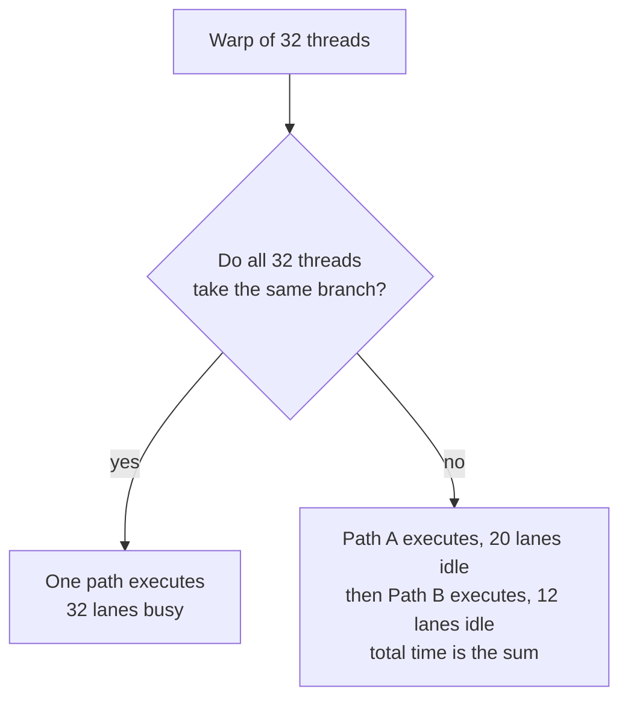
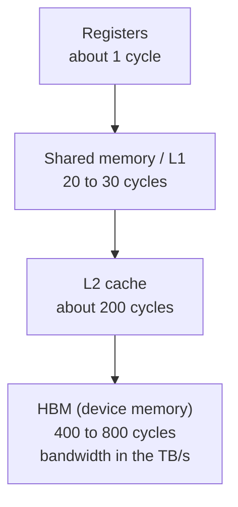
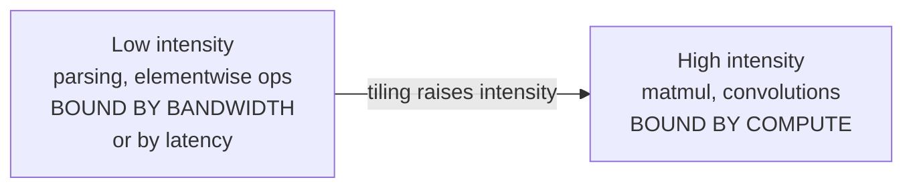
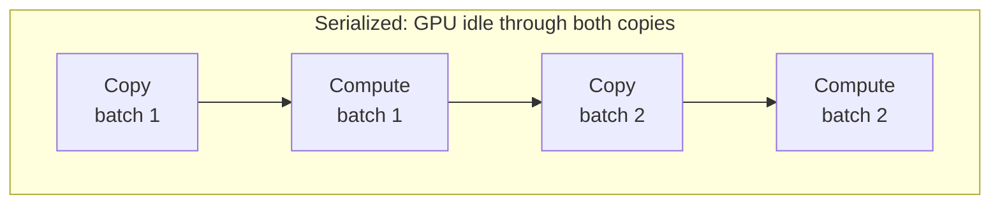
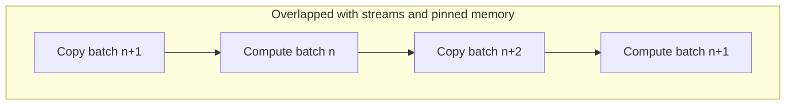

# 01. Execution Model and Data Movement

Two questions that decide whether you understand what a GPU is actually doing,
or only what benchmarks say about it.

---

## Q1. Why is a GPU fast at matmul and slow at a parser?

> Take the same silicon. It multiplies two large matrices in milliseconds and
> then chokes on a branchy log parser. Explain the difference.

**What they are probing:** do you know the GPU is a throughput machine, not a
latency machine, and can you reason about *why* from the execution model rather
than from "GPUs are parallel."

### The reasoning

1. **SIMT, not MIMD.** Threads run in groups (warps of 32). The hardware issues
   one instruction for the whole warp.
2. **Divergence serializes.** If threads in a warp take different branches, both
   paths execute and lanes idle through the path they did not take. A parser
   with unpredictable branches diverges constantly.
3. **There is no branch predictor and almost no cache to save you.** The GPU
   hides latency with thousands of resident threads, not with speculation. When
   the parallelism is not there, nothing hides the latency.
4. **Matmul has none of these problems.** Uniform control flow, predictable
   access, and enormous arithmetic intensity.

### The memory hierarchy is the other half

Latency, not capacity, is what kills you. Bandwidth is enormous; latency is
brutal. You pay it with occupancy.

### Where matmul wins: the roofline

Arithmetic intensity is FLOPs performed per byte moved. Plot it against peak
compute and peak bandwidth and you get a ceiling.

Matmul is high intensity and sits under the compute ceiling. A parser is low
intensity, divergent, and latency bound. Two different walls.

### The one-line answer

A GPU is a machine for hiding memory latency with thousands of uniform threads.
Matmul supplies that uniformity and arithmetic intensity. A branchy parser
supplies neither, so the same silicon has nothing to hide the latency with.

**Follow-ups**

- What is the speedup if only 8 of 32 lanes are active? (Roughly a quarter of
  peak. It is a lane-occupancy problem, not a clock problem.)
- Where would you use shared memory in a matmul, and why does tiling help?
  (Reuse each loaded value many times, raising intensity above the bandwidth wall.)
- If a kernel is bandwidth bound, does a faster clock help? (No. Add bandwidth
  or reduce bytes moved.)

---

## Q2. The job is "GPU bound" at 30% utilization. Where is the time?

> A training job runs for ten hours. GPU utilization averages 30%. The owner
> insists the model is heavy and the GPU is the bottleneck. What is happening?

**What they are probing:** whether you reach for a profiler before an opinion,
and whether you know the training loop is a pipeline with transfers in it.

### The reasoning

1. **Utilization is not the same as busy.** It measures whether *any* kernel was
   resident. A GPU can report 30% while starving between tiny kernels.
2. **The loop has four stages, not one.** Read the batch, copy host to device,
   compute, copy device to host. If they run in sequence, the GPU sits idle for
   two of the four.
3. **The transfers are the usual culprit.** Host to device over PCIe is around
   25 GB/s on a Gen4 x16 slot. NVLink on the same class of part is an order of
   magnitude higher. Move data the slow way and it dominates.
4. **Synchronization destroys pipelining.** A `.item()`, a `.cpu()`, or an
   explicit device synchronize in the loop forces the CPU to wait, so the next
   batch never gets prefetched.

### Serialized versus overlapped

### The fixes, in order of payoff

1. **Measure first.** A timeline trace tells you the real split. Guessing costs
   days.
2. **Prefetch with worker processes** so the CPU is never the reason the GPU waits.
3. **Pin host memory** so the copy does not stage through a bounce buffer.
4. **Overlap with streams** so the next transfer runs under the current compute.
5. **Raise the batch size** so each kernel is large enough to amortize launch cost.
6. **For multi-GPU, check the collective path.** If the interconnect is falling
   back to PCIe or the network, the compute is fine and the fabric is the wall.

### The answer you want to give

"I would stop calling it GPU bound and get a timeline. Thirty percent with high
memory bandwidth usually means starvation between kernels or transfers that
never overlap. I would check whether the copy is on a stream, whether host
memory is pinned, and whether anything in the loop synchronizes. If those are
clean, then the fabric between GPUs is the next suspect."

**Follow-ups**

- Why is pinned memory faster? (The device can DMA directly instead of staging
  through pageable memory, and the driver does not have to pin mid-copy.)
- When does a bigger batch hurt? (Latency-sensitive serving, and when it pushes
  you into memory pressure or reduces the number of concurrent steps.)
- Utilization looks fine but throughput is low. What now? (Small kernels and
  launch overhead. Look at time per step and the number of launches, not percent.)
