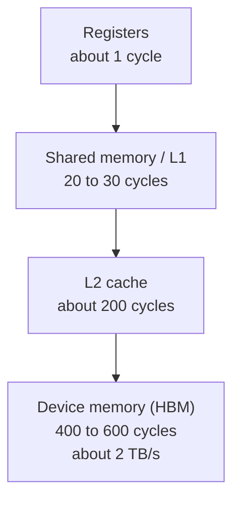
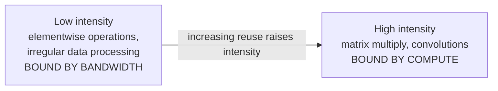
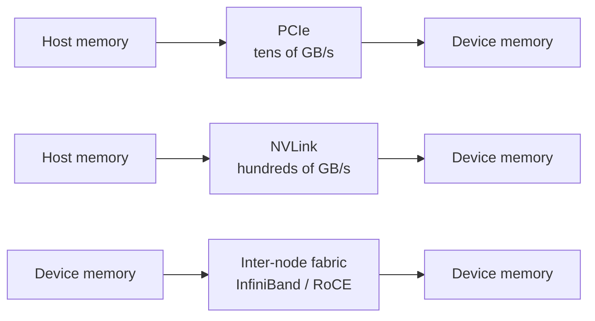
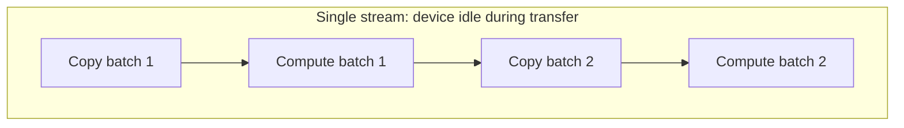
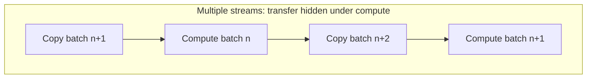

# 1. GPU Execution Model and Data Movement

## 1.1 Overview

A GPU is built for throughput. It keeps thousands of threads resident and
switches between them to hide memory latency.

A CPU core is built for latency. It uses out-of-order execution, large caches,
and branch prediction so that a few instruction streams run quickly.

The two designs spend their area differently. A GPU devotes most of its die to
arithmetic units and relies on having other warps ready when one stalls on a
memory access of several hundred cycles. A CPU devotes a large fraction of its
die to cache and predictors, which makes an individual memory access cheap.

Two kernels with identical arithmetic requirements can therefore differ in
achieved throughput by more than an order of magnitude. Control flow uniformity
and memory access pattern decide which result is obtained.

## 1.2 SIMT execution

Threads are grouped into warps of 32. The scheduler issues one instruction per
warp, and all 32 threads execute it. The model is single-instruction,
multiple-thread, so code correct for one thread is correct for all of them.

### Warp divergence

Divergence occurs when threads in a warp follow different control flow paths. The
hardware issues one instruction stream per warp, so both paths execute, one after
the other, with lanes not on the active path masked off. Elapsed time is the sum
of the path durations.

The split ratio changes how many lanes sit idle, not whether both paths run. When
16 lanes take each path, 16 lanes idle during each. When 1 lane takes one path
and 31 take the other, 31 lanes idle while the shorter path runs.

### Latency hiding

Each streaming multiprocessor keeps several warps resident and switches between
them when one stalls on memory. Occupancy measures how many independent warps are
available to cover that latency.

Occupancy is capped by registers per thread, shared memory per block, and block
size. A kernel using 64 registers per thread can keep roughly half as many warps
resident as one using 32, and therefore hides latency less well. This frequently
explains a kernel that runs well below peak with no other visible cause.

## 1.3 Memory hierarchy

Device memory provides high bandwidth and high latency. The hierarchy keeps
reused data closer to the compute units, so the latency is paid less often.

| Level | Scope | Latency | Managed by |
|---|---|---|---|
| Registers | Per thread | About 1 cycle | Compiler |
| Shared memory | Per block | 20 to 30 cycles | Program |
| L2 | Per device | About 200 cycles | Hardware |
| Device memory | Per device | 400 to 600 cycles | Program |

Shared memory sits about an order of magnitude closer than device memory and is
managed by the program, which makes it the main lever for performance work.
Tiling a matrix multiply so that each value loaded from device memory is reused
from shared memory 128 times reduces device memory traffic by roughly that
factor.

## 1.4 Arithmetic intensity

Arithmetic intensity is arithmetic operations per byte read from memory.

Below the boundary, throughput tracks memory bandwidth and additional arithmetic
capacity changes nothing. Above it, throughput tracks arithmetic capacity and
additional bandwidth changes nothing. The boundary is the ratio of peak
arithmetic throughput to peak memory bandwidth for the device.

An elementwise operation that reads 4 bytes and performs one operation has an
intensity of 0.25, which is far below the boundary on any current device. A
matrix multiply holding a 128 by 128 tile in shared memory reuses each loaded
value 128 times, which places it far above.

## 1.5 Host-device data movement

Device memory is separate from host memory, and data moves between them
explicitly. That path is roughly an order of magnitude slower than device memory,
so a kernel that is compute-bound alone can become transfer-bound once its input
and output are included.

### Transfer paths

| Path | Approximate bandwidth | Typical use |
|---|---|---|
| PCIe Gen4 x16 | 25 GB/s | Input data, checkpoints, results |
| PCIe Gen5 x16 | 50 GB/s | Same, on newer hosts |
| NVLink, device to device | 300 to 450 GB/s per direction | Tensor and pipeline parallelism |
| InfiniBand NDR | 50 GB/s per port | Multi-node collectives |

A workload that performs well on one device can be limited by the interconnect
across several, especially if collectives fall back to a path slower than the
design assumed.

### Pinned host memory

Host buffers used for transfers should be pinned, which means page-locked.
Pageable memory cannot be accessed directly by the device, so the driver stages
the transfer through an intermediate buffer, which adds a copy and increases
latency. Pinned memory allows direct DMA.

Pinned memory cannot be paged out and stays committed while it is held. Buffers
are therefore allocated as a pool and reused across transfers.

### Streams and overlap

A stream is an ordered sequence of operations on a device. Operations in
different streams can run concurrently, so a transfer into one buffer can proceed
while another buffer is used for compute.

Double buffering is the usual implementation. The device computes on one buffer
while the next is filled, then the roles swap.

### Synchronization

Anything that makes the host wait for the device breaks the pipeline and stops
the next transfer from being issued early. Common causes are reading a scalar
result back to the host inside a loop, explicit synchronization in the step,
unpinned host memory, and kernels short enough that launch overhead rivals their
duration.

## 1.6 Diagnostic approach

A low utilization figure means the device did not execute work for part of the
interval. It does not establish that the device is the bottleneck, because the
cause may be upstream.

1. Split the interval into compute, transfer, and idle time. A timeline trace
   gives this directly, and measuring it is faster than estimating.
2. If idle time dominates, look at synchronization points and kernel durations.
   Both are visible in the trace.
3. If transfer time dominates, check buffer pinning and stream configuration.
4. If neither dominates, check the collective path. Multi-node scaling problems
   often present as compute problems and resolve to the interconnect.

## 1.7 Reference figures

| Quantity | Order of magnitude |
|---|---|
| Register access | 1 cycle |
| Shared memory access | 20 to 30 cycles |
| L2 access | 200 cycles |
| Device memory access | 400 to 600 cycles |
| Device memory bandwidth | About 2 TB/s |
| PCIe Gen4 x16 | 25 GB/s |
| PCIe Gen5 x16 | 50 GB/s |
| Warp size | 32 threads |

These values are for reasoning about which term dominates. They are not suitable
for capacity planning.
