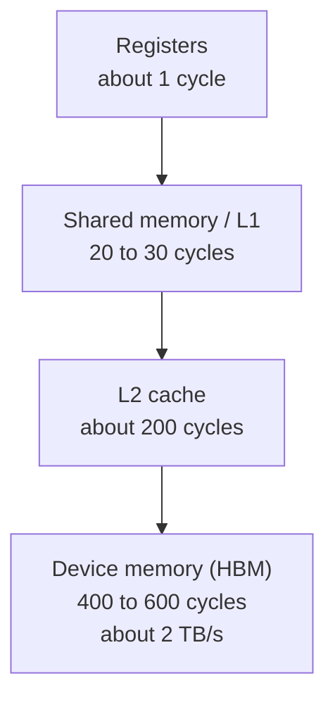
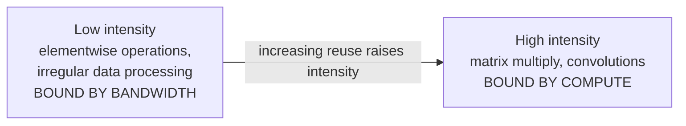
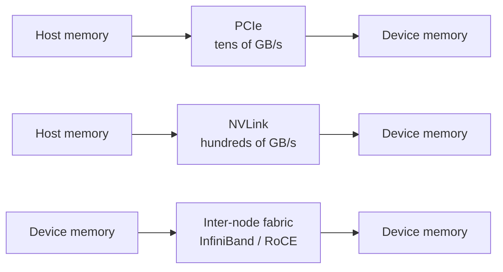
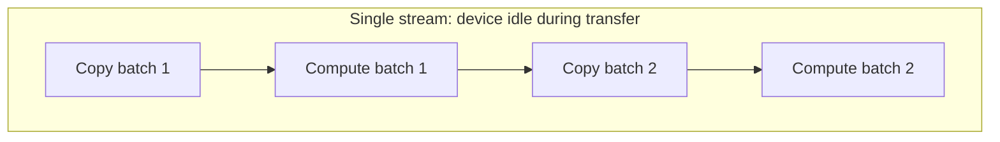
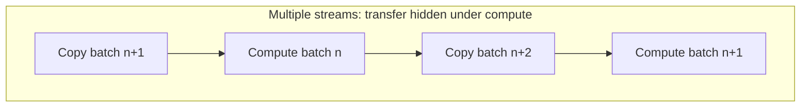

# 1. GPU Execution Model and Data Movement

## 1.1 Throughput against latency

A GPU is a throughput machine: thousands of resident threads, memory latency
hidden by switching between warps. A CPU core is a latency machine: out-of-order
execution, large caches, branch prediction.

The area budget explains the behavior. A GPU spends most of its die on arithmetic
units and covers a 400-cycle memory access with other warps. A CPU spends much of
its die on cache and predictors and makes that access cheap.

Two kernels with identical arithmetic can therefore differ by 10x in throughput,
depending on control flow uniformity and memory access pattern.

## 1.2 SIMT execution

Threads are grouped into warps of 32. One instruction issues per warp, and all 32
threads execute it. Code correct for one thread is correct for all of them.

### Divergence

Different branches within a warp run serially, with inactive lanes masked off.
Warp time is the sum of both paths.

The split ratio sets how many lanes idle. Split 16 and 16, and 16 lanes idle on
each path. Split 1 and 31, and 31 lanes idle while the short path runs.

### Occupancy

Each streaming multiprocessor switches between resident warps to cover memory
latency. Occupancy counts those warps.

Registers per thread, shared memory per block, and block size cap occupancy. A
kernel using 64 registers per thread holds half the resident warps of one using
32, which reduces latency hiding. Check occupancy before optimizing the algorithm.

## 1.3 Memory hierarchy

| Level | Scope | Latency | Managed by |
|---|---|---|---|
| Registers | Per thread | About 1 cycle | Compiler |
| Shared memory | Per block | 20 to 30 cycles | Program |
| L2 | Per device | About 200 cycles | Hardware |
| Device memory | Per device | 400 to 600 cycles | Program |

Shared memory sits an order of magnitude closer than device memory and is
program-controlled. Tiling a matrix multiply so each loaded value is reused 128
times from shared memory cuts device memory traffic by roughly 128x.

## 1.4 Arithmetic intensity

Operations per byte read from memory.

The boundary is peak compute divided by peak bandwidth. Below it, throughput
tracks bandwidth and more compute buys nothing. Above it, the reverse.

An elementwise operation reading 4 bytes per op has intensity 0.25, far below the
boundary. A 128 by 128 tiled matrix multiply reuses each load 128 times, far
above.

## 1.5 Host-device transfers

Device memory and host memory are separate, and transfers are explicit. That path
runs roughly 10x slower than device memory.

### Paths

| Path | Approximate bandwidth | Typical use |
|---|---|---|
| PCIe Gen4 x16 | 25 GB/s | Input data, checkpoints, results |
| PCIe Gen5 x16 | 50 GB/s | Same, on newer hosts |
| NVLink, device to device | 300 to 450 GB/s per direction | Tensor and pipeline parallelism |
| InfiniBand NDR | 50 GB/s per port | Multi-node collectives |

### Pinning

Pin, meaning page-lock, the host buffers you transfer from. The device then DMAs
them directly. Pageable memory gets staged through an intermediate buffer by the
driver, costing a copy and adding latency. Pool pinned buffers and reuse them,
since pinned pages stay committed.

### Streams and overlap

A stream is an ordered queue of device operations. Different streams run
concurrently, so a transfer can overlap compute.

Double buffering computes on one buffer while the next fills, then swaps them.

### Blocking synchronization

Any host wait on the device stalls the pipeline and delays the next transfer.
Sources: reading a scalar back to the host inside a loop, an explicit sync in the
step, unpinned memory, and kernels short enough that launch overhead rivals
runtime.

## 1.6 Diagnosis

Low utilization means no work executed for part of the interval. The cause may sit
upstream of the device.

1. Split the interval into compute, transfer, and idle time, using a timeline
   trace.
2. Idle dominant: check synchronization points and kernel durations.
3. Transfer dominant: check pinning and stream configuration.
4. Neither dominant: check the collective path.

## 1.7 Reference figures

| Quantity | Order of magnitude |
|---|---|
| Register access | 1 cycle |
| Shared memory access | 20 to 30 cycles |
| L2 access | 200 cycles |
| Device memory access | 400 to 600 cycles |
| Device memory bandwidth | About 2 TB/s |
| PCIe Gen4 x16 | 25 GB/s |
| PCIe Gen5 x16 | 50 GB/s |
| Warp size | 32 threads |
