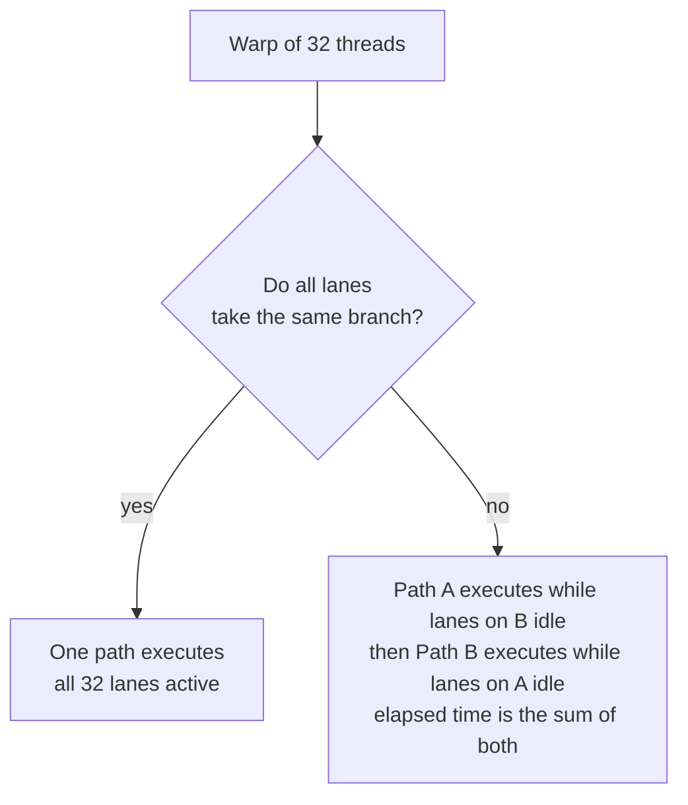
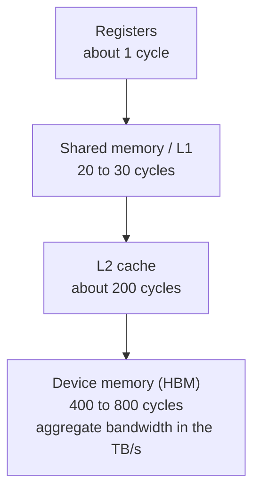
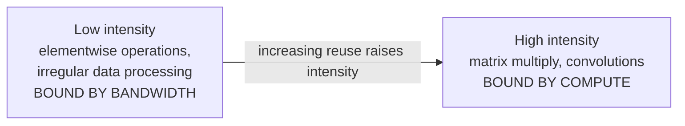
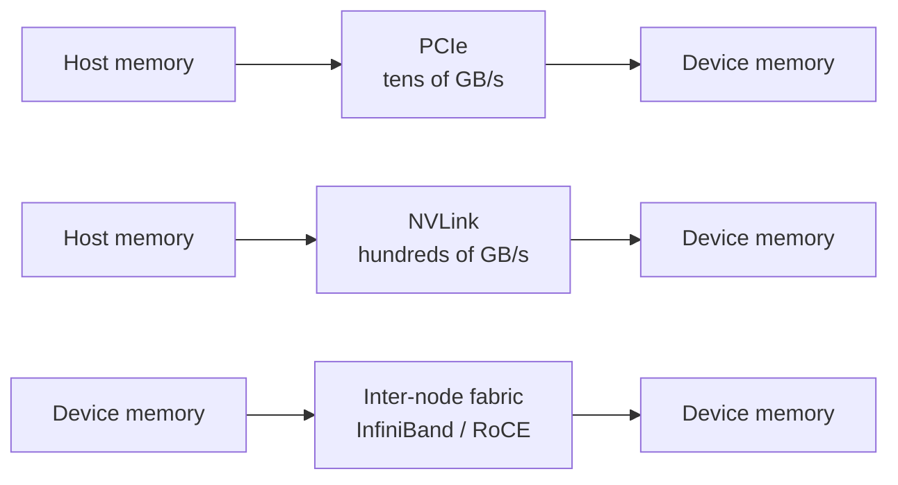
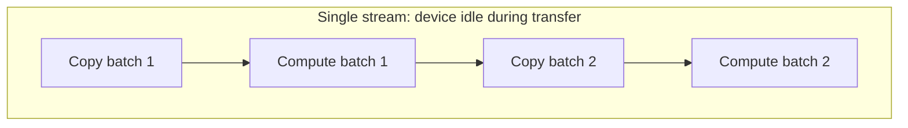
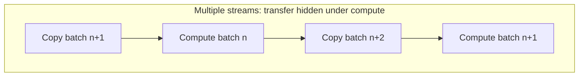

# 1. GPU Execution Model and Data Movement

This section describes the performance model on which the remainder of this
document depends. It covers the way a GPU executes work, the structure of its
memory hierarchy, and the reasons that data movement frequently determines the
throughput of a GPU service to a greater extent than arithmetic does.

## 1.1 Overview

A GPU is a throughput-oriented processor. Its design assumes that a very large
number of similar operations will be available to execute concurrently, and it
tolerates memory latency by keeping many threads resident rather than by
predicting control flow or by serving most memory accesses from cache.

A CPU core is designed around the opposite assumption. It is optimized for
latency, using deep out-of-order execution, large caches, and branch prediction
to allow a small number of instruction streams to progress quickly.

One consequence of the throughput-oriented design is that the characteristics of
a workload influence achieved performance to a greater degree than the nominal
peak throughput of the device does. Two kernels with identical arithmetic
requirements may differ considerably in achieved throughput because of their
control flow uniformity or their memory access patterns.

## 1.2 SIMT execution

Threads are organized into warps, which contain 32 threads on current NVIDIA
hardware. The instruction scheduler issues a single instruction for an entire
warp, and the threads within that warp execute the instruction together. The
programming model is therefore single-instruction, multiple-thread, and a program
written correctly for one thread is correct for all of them.

### Warp divergence

Divergence occurs when threads within the same warp follow different control flow
paths. Since the hardware issues one instruction stream per warp, the divergent
paths are executed in sequence, with the lanes that are not on the active path
masked off. The elapsed time for the warp is the sum of the paths taken, rather
than the duration of the longest path.

The cost depends on how the branch is distributed among the lanes. A branch that
divides a warp roughly in half approaches twice the cost of the undivided case. A
branch taken by a single lane out of 32 also causes serialization, although the
quantity of wasted work is proportionally smaller.

### Latency hiding

Each streaming multiprocessor holds a number of resident warps and switches
between them when one of them stalls, typically on a memory access. The ability
of the device to remain busy therefore depends on the number of independent warps
available to cover memory latency, which is the quantity that occupancy measures.

Occupancy is limited by register usage per thread, shared memory usage per block,
and block size. A kernel that uses a large number of registers or a large amount
of shared memory per block will have fewer resident warps, and will consequently
be less able to hide latency. This is a common reason for a kernel to run well
below peak throughput without exhibiting an obvious inefficiency.

## 1.3 Memory hierarchy

Device memory provides high aggregate bandwidth and correspondingly high latency.
The hierarchy exists to make frequently reused data available closer to the
compute units, which converts available bandwidth into reduced effective latency.

| Level | Scope | Typical use |
|---|---|---|
| Registers | Per thread | Operands and accumulators |
| Shared memory | Per block, managed by the program | Reused tiles and exchange between threads |
| L2 | Per device, managed by hardware | Working sets that exceed shared memory |
| Device memory | Per device | All persistent data |

Shared memory is managed by the program rather than by hardware, which makes it
the primary instrument for performance work. A kernel that tiles a computation so
that each value read from device memory is reused several times from shared
memory shifts the limiting factor from bandwidth to arithmetic.

## 1.4 Arithmetic intensity

Arithmetic intensity is the ratio of arithmetic operations performed to bytes
transferred from memory. Plotting achievable throughput against arithmetic
intensity produces a curve with two regions.

In the bandwidth-bound region, throughput scales with memory bandwidth, and
additional arithmetic capacity produces no improvement. In the compute-bound
region, throughput scales with arithmetic capacity, and additional memory
bandwidth produces no improvement. The boundary between the two is determined by
the ratio of peak arithmetic throughput to peak memory bandwidth for the device
in question. Devices that include specialized matrix units have a high ratio,
which places the boundary at a high arithmetic intensity and leaves a substantial
number of real workloads in the bandwidth-bound region.

The practical question for a given operation is whether each value loaded from
memory is reused often enough to amortize its transfer. Where it is not,
optimization effort yields more benefit when applied to the data path.

## 1.5 Host-device data movement

Device memory is separate from host memory, and data must be transferred between
them explicitly. The bandwidth of the transfer path is typically about an order
of magnitude below device memory bandwidth, so a workload that is compute-bound
in isolation may become transfer-bound once the transfer is included.

### Transfer paths

| Path | Relative bandwidth | Typical use |
|---|---|---|
| PCIe, host to device | Baseline | Input data, checkpoints, results |
| NVLink, device to device | Roughly an order of magnitude higher | Tensor and pipeline parallelism |
| Inter-node fabric | Above remote host access, below NVLink | Multi-node collectives |

A workload that performs well on a single device may be limited by the
interconnect once it is distributed across several, particularly where
collective communication falls back to a slower path than the design assumed.

### Pinned host memory

Host buffers used for transfers are more efficient when they are pinned, that is,
page-locked. Pageable memory cannot be accessed directly by the device, so the
driver stages the transfer through an intermediate buffer, which adds a copy and
increases latency. Pinned memory permits direct DMA access.

The cost of pinning is that the memory cannot be paged out and remains committed
for as long as it is held. Buffers of this kind are therefore usually allocated as
a pool and reused across transfers rather than allocated per transfer.

### Streams and overlap

A stream is an ordered sequence of operations on a device. Operations in
different streams may execute concurrently, which allows a transfer into one
buffer to proceed while compute is performed on another.

Double buffering is the usual implementation. The device computes on one buffer
while the next is being filled, and the roles are exchanged on the following
iteration.

### Synchronization

Operations that require the host to wait for the device interrupt this pipeline
and prevent the transfer for the next iteration from being issued early. Common
sources include reading a scalar result back to the host inside a loop, explicit
device or stream synchronization within the training or inference step, unpinned
host memory, and kernels short enough that launch overhead is comparable to their
duration.

## 1.6 Diagnostic approach

A low utilization figure indicates that the device was not executing work during
part of the measurement interval. It does not by itself establish that the device
is the bottleneck, since the cause may lie upstream of it.

A sequence that usually identifies the cause is as follows:

1. Divide the interval into compute time, transfer time, and idle time. A
   timeline trace provides this directly, and measuring it is generally faster
   than forming an estimate.
2. Where idle time is significant, examine synchronization points and kernel
   durations. These account for a large share of cases and are visible in a trace.
3. Where transfer time is significant, examine buffer pinning and stream
   configuration.
4. Where neither applies, examine the collective path. Scaling problems in
   multi-node configurations frequently appear as compute problems and resolve to
   the interconnect.

## 1.7 Reference figures

| Quantity | Order of magnitude |
|---|---|
| Register access | 1 cycle |
| Shared memory access | 20 to 30 cycles |
| L2 access | 200 cycles |
| Device memory access | 400 to 800 cycles |
| Device memory bandwidth | TB/s |
| PCIe host-device bandwidth | Tens of GB/s |
| Warp size | 32 threads |

These values are intended for reasoning about which term dominates a computation.
They are not suitable for capacity planning.
