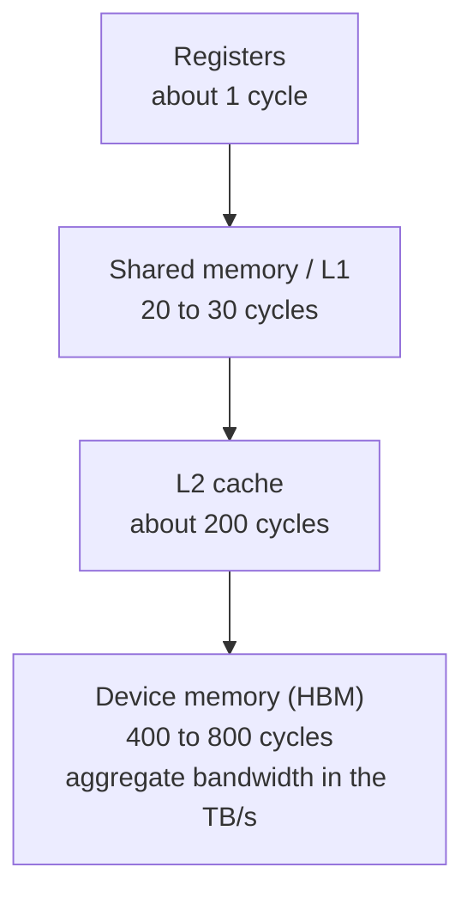
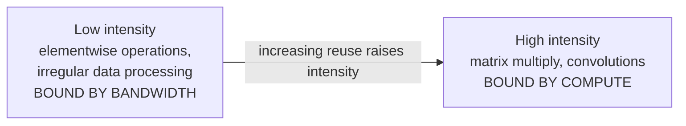
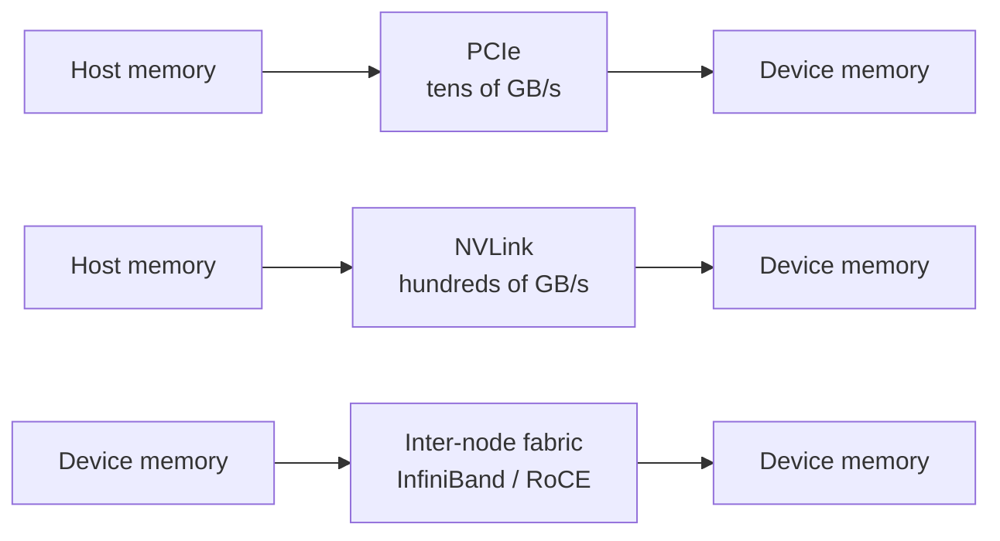
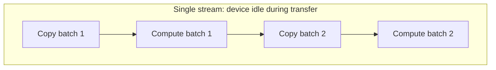
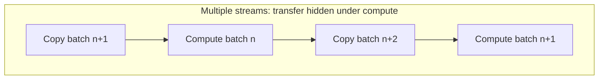

# 1. GPU Execution Model and Data Movement

This section covers how a GPU executes work, how its memory hierarchy is
organized, and why data movement often limits throughput more than arithmetic
does.

## 1.1 Overview

A GPU is built for throughput. It assumes many similar operations will be
available at once. To keep the device busy it holds many threads resident and
switches between them when one stalls.

A CPU core is built for latency. It uses deep out-of-order execution, large
caches, and branch prediction so that a few instruction streams progress quickly.

Workload characteristics therefore matter more than nominal peak throughput. Two
kernels with the same arithmetic requirements can differ widely in achieved
throughput, depending on control flow uniformity and memory access pattern.

## 1.2 SIMT execution

Threads are grouped into warps of 32. The scheduler issues one instruction per
warp, and all 32 threads execute it together. The model is single-instruction,
multiple-thread, so code correct for one thread is correct for all of them.

### Warp divergence

Divergence occurs when threads in a warp follow different control flow paths. The
hardware issues one instruction stream per warp, so the paths run one after
another, and lanes not on the active path are masked off. Elapsed time is the sum
of the paths taken.

The cost depends on how the branch splits the warp. A branch that divides a warp
roughly in half costs close to twice the undivided case. A branch taken by one
lane out of 32 still serializes, but wastes proportionally less work.

### Latency hiding

Each streaming multiprocessor keeps several warps resident and switches between
them when one stalls, usually on a memory access. How busy the device stays
depends on how many independent warps are available to cover that latency. This
is what occupancy measures.

Occupancy is limited by registers per thread, shared memory per block, and block
size. A kernel with high register use or large shared memory allocations has
fewer resident warps and hides latency less well. This commonly explains a kernel
running well below peak with no obvious inefficiency.

## 1.3 Memory hierarchy

Device memory offers high aggregate bandwidth and high latency. The hierarchy
keeps reused data closer to the compute units, which turns bandwidth into lower
effective latency.

| Level | Scope | Typical use |
|---|---|---|
| Registers | Per thread | Operands and accumulators |
| Shared memory | Per block, managed by the program | Reused tiles, exchange between threads |
| L2 | Per device, managed by hardware | Working sets too large for shared memory |
| Device memory | Per device | All persistent data |

Shared memory is managed by the program, which makes it the main tool for
performance work. Tiling a computation so each value is reused several times from
shared memory moves the limit from bandwidth to arithmetic.

## 1.4 Arithmetic intensity

Arithmetic intensity is arithmetic operations per byte read from memory. Plotting
achievable throughput against intensity gives a curve with two regions.

In the bandwidth-bound region, throughput tracks memory bandwidth, and more
arithmetic capacity does not help. In the compute-bound region, throughput tracks
arithmetic capacity, and more bandwidth does not help. The boundary is set by the
ratio of peak arithmetic throughput to peak memory bandwidth. Devices with matrix
units have a high ratio, which puts the boundary at high intensity and leaves
many real workloads bandwidth-bound.

The practical question is whether each loaded value is reused often enough to
justify its transfer. If it is not, optimization belongs on the data path.

## 1.5 Host-device data movement

Device memory is separate from host memory, and data moves between them
explicitly. That path is typically about an order of magnitude slower than device
memory, so a kernel that is compute-bound alone can become transfer-bound.

### Transfer paths

| Path | Relative bandwidth | Typical use |
|---|---|---|
| PCIe, host to device | Baseline | Input data, checkpoints, results |
| NVLink, device to device | Roughly an order of magnitude higher | Tensor and pipeline parallelism |
| Inter-node fabric | Above remote host access, below NVLink | Multi-node collectives |

A workload that performs well on one device can be limited by the interconnect
across several, especially if collectives fall back to a slower path than the
design assumed.

### Pinned host memory

Host buffers used for transfers should be pinned, which means page-locked.
Pageable memory cannot be accessed directly by the device, so the driver stages
the transfer through an intermediate buffer. That adds a copy and increases
latency. Pinned memory allows direct DMA.

Pinned memory cannot be paged out and stays committed while it is held. Buffers
are therefore pooled and reused rather than allocated for each transfer.

### Streams and overlap

A stream is an ordered sequence of operations on a device. Operations in
different streams can run concurrently, so a transfer into one buffer can proceed
while another buffer is used for compute.

Double buffering is the usual implementation. The device computes on one buffer
while the next is filled, then the roles swap.

### Synchronization

Anything that makes the host wait for the device breaks the pipeline and stops
the next transfer from being issued early. Common causes are reading a scalar
result back to the host inside a loop, explicit synchronization in the step,
unpinned host memory, and kernels short enough that launch overhead rivals their
duration.

## 1.6 Diagnostic approach

Low utilization means the device did not execute work for part of the interval.
It does not by itself mean the device is the bottleneck, because the cause may be
upstream.

A sequence that usually finds the cause:

1. Split the interval into compute, transfer, and idle time. A timeline trace
   gives this directly, and measuring is faster than estimating.
2. If idle time is high, look at synchronization points and kernel durations.
   These explain many cases and are visible in the trace.
3. If transfer time is high, check buffer pinning and stream configuration.
4. If neither applies, check the collective path. Multi-node scaling problems
   often look like compute problems and turn out to be the interconnect.

## 1.7 Reference figures

| Quantity | Order of magnitude |
|---|---|
| Register access | 1 cycle |
| Shared memory access | 20 to 30 cycles |
| L2 access | 200 cycles |
| Device memory access | 400 to 800 cycles |
| Device memory bandwidth | TB/s |
| PCIe host-device bandwidth | Tens of GB/s |
| Warp size | 32 threads |

These values are for reasoning about which term dominates. They are not suitable
for capacity planning.
