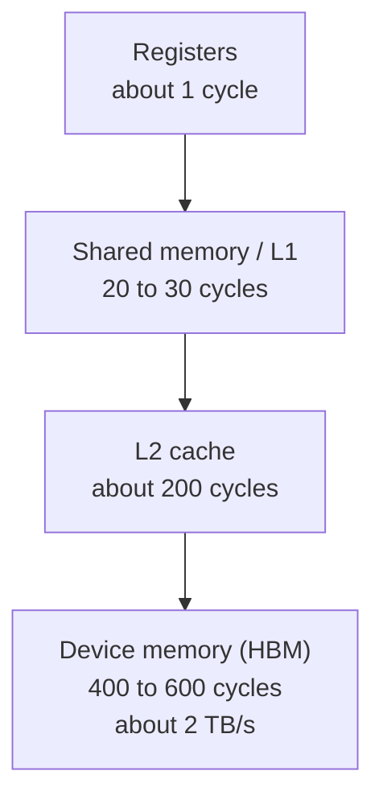
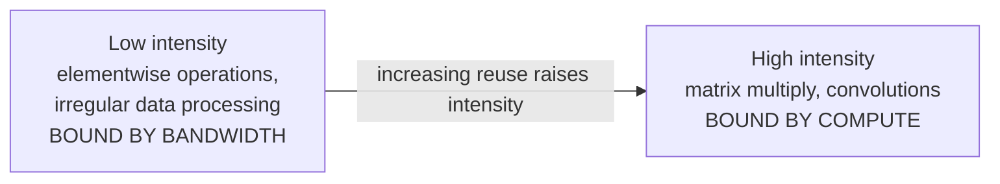
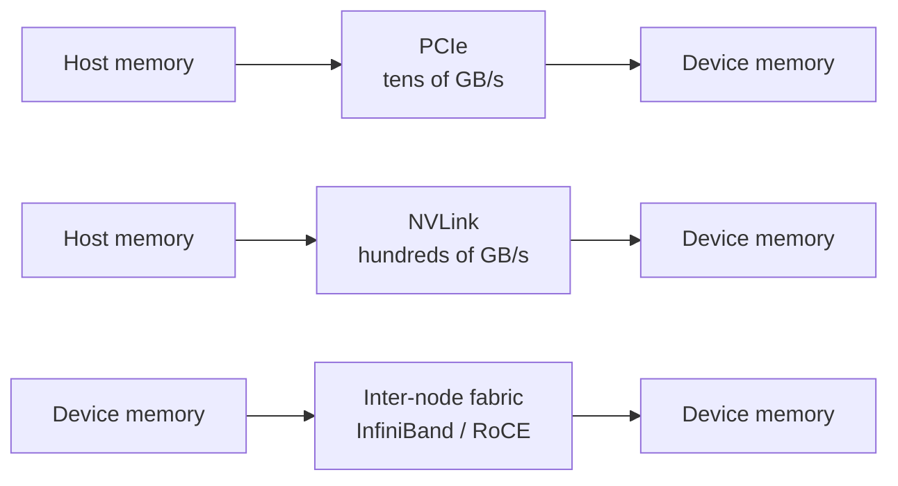
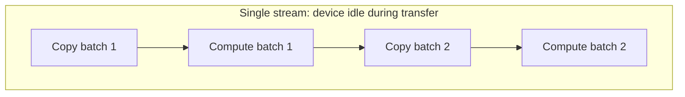
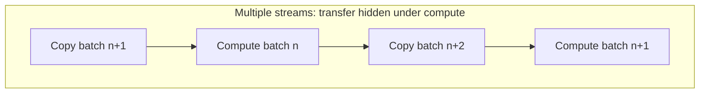

# 1. GPU Execution Model and Data Movement

## 1.1 Overview

A GPU is a throughput machine. It keeps thousands of threads resident and
switches between them to hide memory latency.

A CPU core is a latency machine. It uses out-of-order execution, large caches,
and branch prediction so that a few instruction streams run quickly.

The difference shows up in where each one spends its silicon. A GPU gives most of
its die area to arithmetic units, and covers a memory access of several hundred
cycles by having other warps ready to issue. A CPU gives a large fraction of its
die to cache and predictors, and covers the same access by making it cheap in the
first place.

This is why two kernels with identical arithmetic can differ by more than an
order of magnitude in achieved throughput. Control flow uniformity and memory
access pattern decide which result you get.

## 1.2 SIMT execution

Threads are grouped into warps of 32. The scheduler issues one instruction per
warp, and all 32 threads execute that instruction together. Code that is correct
for one thread is correct for all of them.

### Warp divergence

Divergence happens when threads in a warp take different branches. The hardware
issues one instruction stream per warp, so both paths run, one after the other,
and the lanes on the inactive path sit masked off. The warp takes as long as the
sum of the two paths.

The split ratio decides how many lanes sit idle while each path runs, and that is
what determines how much work you waste. Split a warp 16 and 16, and 16 lanes
idle during each path. Split it 1 and 31, and 31 lanes idle while the short path
runs.

### Latency hiding

Each streaming multiprocessor keeps several warps resident and switches between
them when one stalls on memory. Occupancy counts the independent warps available
to cover that latency.

Registers per thread, shared memory per block, and block size all cap occupancy.
Take a kernel that uses 64 registers per thread: it holds roughly half as many
resident warps as one using 32, so it covers latency less well. A kernel like that
often runs well below peak with nothing else visibly wrong, which is why
occupancy is worth checking before you go looking for a cleverer algorithm.

## 1.3 Memory hierarchy

Device memory offers high bandwidth and high latency. The hierarchy keeps reused
data closer to the compute units, so you pay that latency less often.

| Level | Scope | Latency | Managed by |
|---|---|---|---|
| Registers | Per thread | About 1 cycle | Compiler |
| Shared memory | Per block | 20 to 30 cycles | Program |
| L2 | Per device | About 200 cycles | Hardware |
| Device memory | Per device | 400 to 600 cycles | Program |

Shared memory sits about an order of magnitude closer than device memory, and
your program controls what goes in it. Tiling a matrix multiply so that each
value loaded from device memory is reused from shared memory 128 times cuts
device memory traffic by roughly that factor.

## 1.4 Arithmetic intensity

Arithmetic intensity is arithmetic operations per byte read from memory.

Below the boundary, throughput tracks memory bandwidth, and adding arithmetic
capacity buys you nothing. Above it, throughput tracks arithmetic capacity, and
adding bandwidth buys you nothing. The boundary sits at the ratio of peak
arithmetic throughput to peak memory bandwidth for the device.

An elementwise operation that reads 4 bytes and performs one operation has an
intensity of 0.25, which places it far below the boundary on any current device.
A matrix multiply holding a 128 by 128 tile in shared memory reuses each loaded
value 128 times, which places it far above. Work out which side of the boundary
your kernel is on before you optimize it, because the two sides reward entirely
different work.

## 1.5 Host-device data movement

Device memory and host memory are separate, and data moves between them
explicitly. That path runs roughly an order of magnitude slower than device
memory, so a kernel that looks compute-bound on its own can turn out to be
transfer-bound once you count its input and output.

### Transfer paths

| Path | Approximate bandwidth | Typical use |
|---|---|---|
| PCIe Gen4 x16 | 25 GB/s | Input data, checkpoints, results |
| PCIe Gen5 x16 | 50 GB/s | Same, on newer hosts |
| NVLink, device to device | 300 to 450 GB/s per direction | Tensor and pipeline parallelism |
| InfiniBand NDR | 50 GB/s per port | Multi-node collectives |

A workload that performs well on one device can become interconnect-limited
across several, particularly when the collective path settles onto something
slower than the design assumed.

### Pinned host memory

Pin the host buffers you transfer from, which means page-locking them. The device
reaches pinned memory directly through DMA. Pageable memory gets staged through an
intermediate buffer by the driver, which costs you a copy and adds latency.

Pinning has a cost of its own: pinned pages stay committed for as long as you hold
them. Allocate a pool and reuse it across transfers.

### Streams and overlap

A stream is an ordered sequence of operations on a device. Operations in
different streams can run concurrently, so a transfer into one buffer can proceed
while the device computes on another.

Double buffering is the usual way to build this. The device computes on one
buffer while the next one fills, and the two swap roles on the following
iteration.

### Synchronization

Any operation that makes the host wait on the device breaks the pipeline and
stops the next transfer from being issued early. The usual sources are reading a
scalar result back to the host inside a loop, an explicit synchronization inside
the step, unpinned host memory, and kernels short enough that launch overhead
rivals their runtime.

## 1.6 Diagnostic approach

A low utilization figure tells you the device executed no work for part of the
interval. It does not tell you the device is the bottleneck, because the cause
may sit upstream of it.

1. Split the interval into compute, transfer, and idle time. A timeline trace
   gives you this directly, and measuring beats estimating.
2. When idle time dominates, look at synchronization points and kernel durations.
   Both show up in the trace.
3. When transfer time dominates, check buffer pinning and stream configuration.
4. When neither dominates, check the collective path. Multi-node scaling problems
   often present as compute problems and turn out to be the interconnect.

## 1.7 Reference figures

| Quantity | Order of magnitude |
|---|---|
| Register access | 1 cycle |
| Shared memory access | 20 to 30 cycles |
| L2 access | 200 cycles |
| Device memory access | 400 to 600 cycles |
| Device memory bandwidth | About 2 TB/s |
| PCIe Gen4 x16 | 25 GB/s |
| PCIe Gen5 x16 | 50 GB/s |
| Warp size | 32 threads |

These values help you reason about which term dominates. They are not suitable
for capacity planning.
