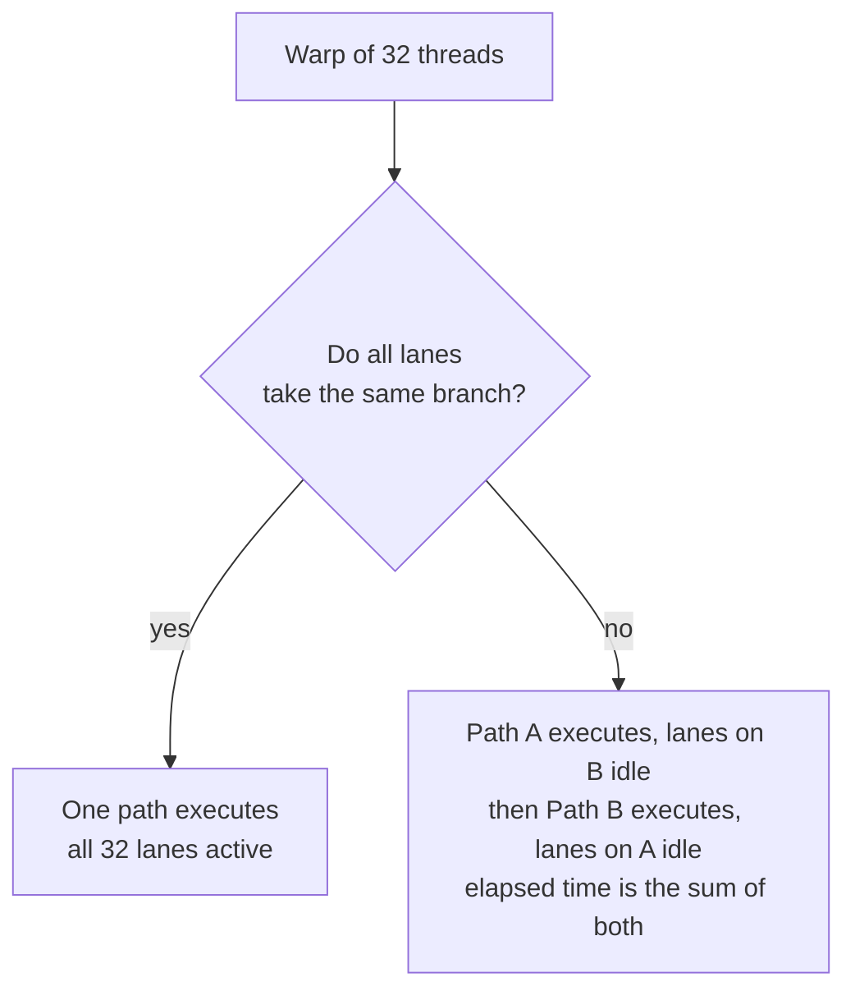
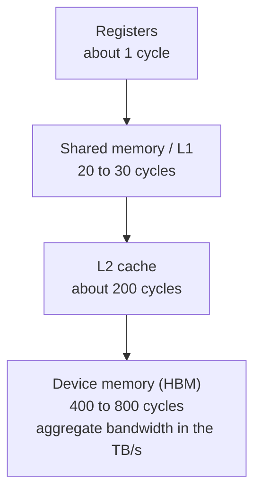
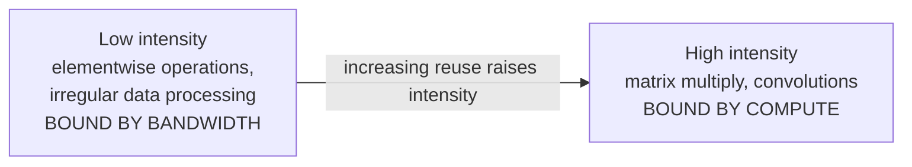
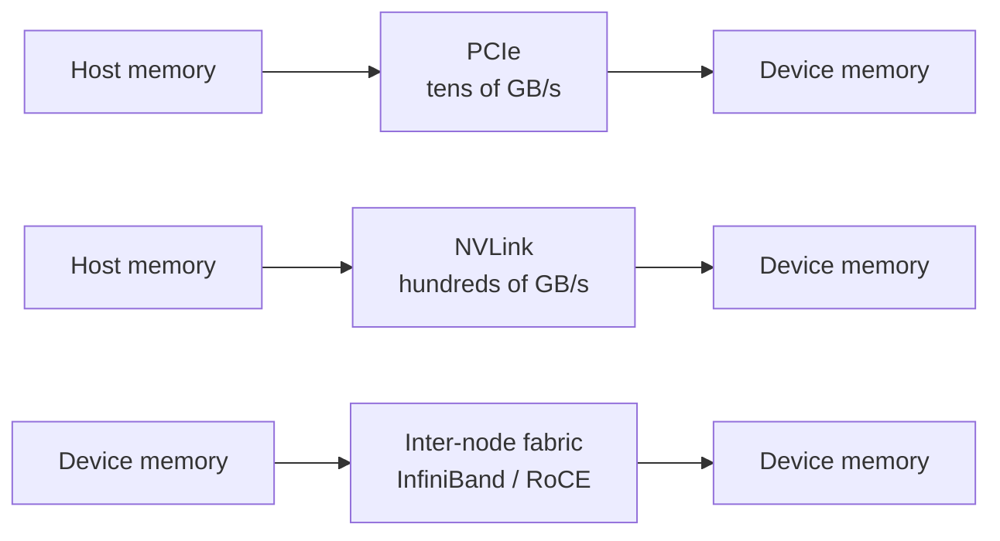
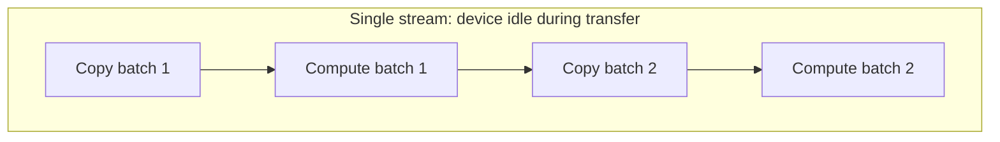
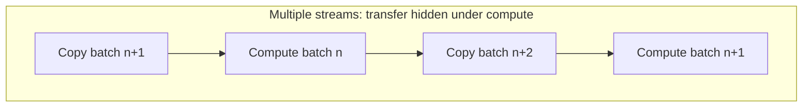

# 1. GPU Execution Model and Data Movement

This section establishes the performance model that the rest of the document
depends on: how a GPU executes work, why its memory hierarchy is shaped the way
it is, and why data movement rather than arithmetic is usually the binding
constraint in a GPU service.

## 1.1 Overview

A GPU is a throughput-optimized processor. It is designed to execute very large
numbers of similar operations concurrently and to tolerate memory latency by
keeping many threads resident, rather than by predicting control flow or serving
most accesses from cache.

This is the opposite of the design point of a CPU core, which is optimized for
latency: deep out-of-order execution, large caches, and branch prediction for a
small number of instruction streams.

The practical consequence is that workload characteristics decide utilization
far more than raw peak throughput does. Two kernels with identical arithmetic
requirements can differ by an order of magnitude in achieved throughput purely
because of control flow uniformity and memory access pattern.

## 1.2 SIMT execution

Threads are grouped into warps, currently 32 threads on NVIDIA hardware. The
scheduler issues one instruction per warp, and the 32 threads execute it
together. A program that is correct for one thread is correct for all of them,
because the model is single-instruction, multiple-thread.

### Warp divergence

Divergence occurs when threads within a warp take different control flow paths.
Because the hardware issues a single instruction stream per warp, the paths are
executed serially with inactive lanes masked off. Total execution time is the sum
of the paths taken, not the maximum.

The impact depends on how the branch is distributed. Divergence that splits a
warp roughly in half costs close to 2x. A branch taken by a single lane out of 32
still serializes, but the wasted work is proportionally small.

### Latency hiding

Each streaming multiprocessor maintains many resident warps and switches between
them when one stalls on a memory access. Utilization therefore depends on having
enough independent warps to cover the memory latency, which is the quantity
occupancy measures.

Occupancy is limited by registers per thread, shared memory per block, and block
size. Kernels that use many registers or a large amount of shared memory per
block reduce the number of resident warps and therefore their ability to hide
latency. This is a frequent cause of a kernel running far below peak despite
having no obvious inefficiency.

## 1.3 Memory hierarchy

Device memory bandwidth is very high, but latency is correspondingly high. The
hierarchy exists to convert bandwidth into effective latency by keeping
frequently reused data close to the compute units.

| Level | Scope | Typical use |
|---|---|---|
| Registers | Per thread | Operands, accumulators |
| Shared memory | Per block, software managed | Reused tiles, inter-thread exchange |
| L2 | Per device, hardware managed | Working set that exceeds shared memory |
| Device memory | Per device | All persistent data |

Shared memory is software-managed, which makes it the primary lever for
performance work. A kernel that tiles a computation so that each value loaded
from device memory is reused many times from shared memory converts a bandwidth
problem into a compute problem.

## 1.4 Arithmetic intensity and the roofline model

Arithmetic intensity is the ratio of floating-point operations performed to bytes
moved from memory. Plotting achievable throughput against intensity produces a
curve with two regimes.

- **Bandwidth bound:** performance scales with memory bandwidth. Adding compute
  capacity, including more or faster SMs, does not help.
- **Compute bound:** performance scales with arithmetic throughput. Adding memory
  bandwidth does not help.

The transition point is set by the ratio of peak compute to peak bandwidth for
the device. Modern accelerators for dense linear algebra are built with
specialized matrix units and have a very high peak, which pushes the transition
point high and makes many real workloads bandwidth bound.

For design purposes the useful test is whether the operation reuses each loaded
value enough times to amortize its transfer. If not, optimization effort belongs
on the data path, not on the arithmetic.

## 1.5 Host-device data movement

Device memory is separate from host memory. Data must be transferred explicitly,
and the bandwidth of that transfer path is typically an order of magnitude lower
than device memory bandwidth.

### Transfer paths

| Path | Relative bandwidth | Used for |
|---|---|---|
| PCIe host to device | Baseline | Input data, checkpoints, results |
| NVLink device to device | Roughly an order of magnitude higher | Tensor and pipeline parallelism |
| Inter-node fabric | Lower than NVLink, higher than remote host access | Multi-node collectives |

A workload that is compute bound in isolation can become entirely transfer bound
in a multi-node configuration if the collective communication falls back to a
slower path.

### Pinned (page-locked) host memory

Host buffers used for transfers should be pinned. Pageable memory cannot be
transferred directly by the device; the driver must stage it, which costs an
extra copy and adds latency. Pinned memory lets the device access host memory
directly through DMA.

The tradeoff is that pinned memory is not swappable and consumes physical memory
permanently, so it should be pooled, not allocated per transfer.

### Streams and overlap

A stream is an ordered queue of operations on a device. Operations in different
streams may execute concurrently, which allows a transfer into one buffer to
overlap with compute on another.

Double buffering is the standard technique: while the device computes on buffer
A, the transfer of buffer B proceeds, and the roles swap on the next iteration.

### Synchronization points

Any operation that forces the host to wait for the device breaks the pipeline and
prevents the next iteration's transfer from being issued early. Common causes:

- Reading a scalar result back to the host inside a loop.
- Explicit device or stream synchronization in the training or inference step.
- Unpinned host memory, which makes the transfer itself synchronous.
- Small kernels, where launch overhead is comparable to the kernel duration.

## 1.6 Diagnostic approach

A low utilization figure is not by itself evidence of a GPU-side bottleneck. It
indicates that the device was not executing work during part of the interval, and
the cause may be upstream.

The productive sequence is:

1. **Separate the time into compute, transfer, and idle.** A timeline trace gives
   this directly. Guessing at the split typically costs far more time than
   measuring it.
2. **If idle time is significant, look for synchronization and small kernels.**
   These are the most common causes and are visible in the trace.
3. **If transfer time is significant, check pinning and stream configuration.**
4. **If neither applies, examine the collective path.** Multi-node scaling
   problems frequently present as a compute problem and resolve to the fabric.

### Reference figures for reasoning

| Quantity | Order of magnitude |
|---|---|
| Register access | 1 cycle |
| Shared memory access | 20 to 30 cycles |
| L2 access | 200 cycles |
| Device memory access | 400 to 800 cycles |
| Device memory bandwidth | TB/s |
| PCIe host-device bandwidth | Tens of GB/s |
| Warp size | 32 threads |

These are order-of-magnitude values intended for reasoning about which term
dominates, not for capacity planning.
