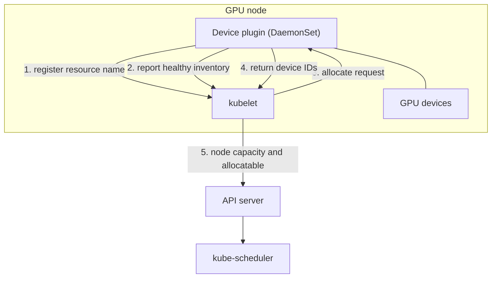
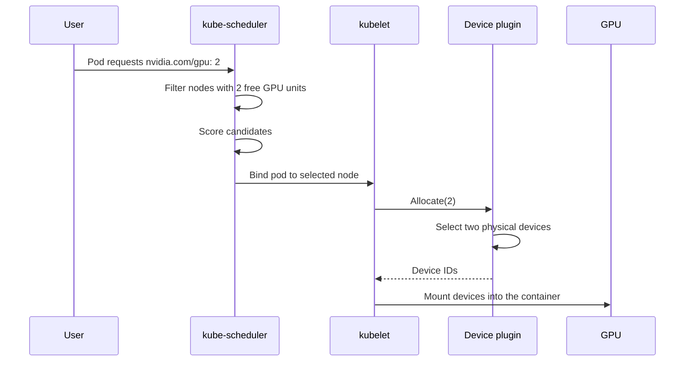
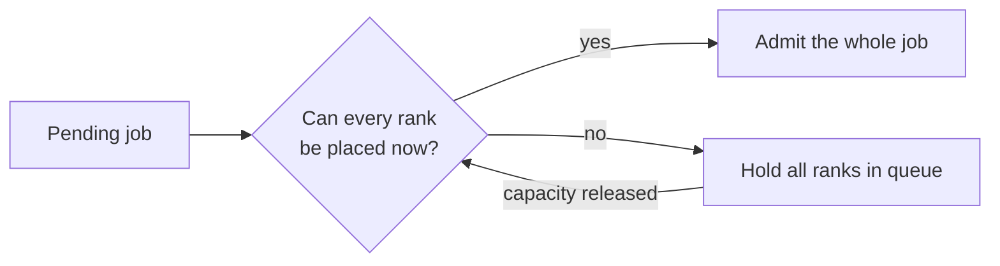
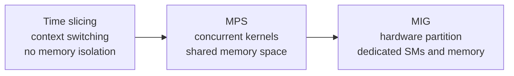
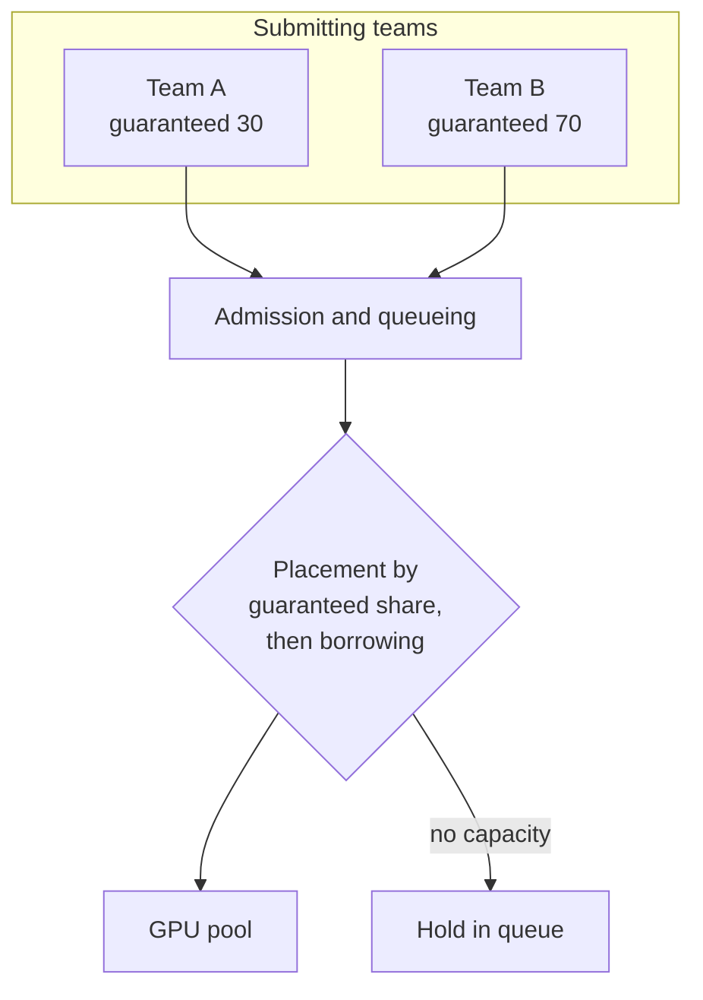

# 2. Cluster Scheduling and GPU Sharing

This section covers how GPU capacity is represented to the Kubernetes scheduler,
how a device is assigned to a container, the constraints placement must satisfy,
and how a shared pool is divided between tenants.

## 2.1 Resource model

GPU capacity is an extended resource. Three properties follow.

Quantities are whole numbers. A pod requests one, two, or four GPUs. A fractional
request cannot be expressed this way.

The request must equal the limit. Extended resources are not oversubscribed.

The scheduler sees only a count. It knows a node has eight units of a named
resource. It knows nothing about the generation, memory size, topology, or health
of the individual devices. That information has to come from node labels or a
scheduler extension. Placement constraints are therefore expressed through node
affinity, taints, or a custom scheduling component.

## 2.2 Device plugin architecture

A device plugin is a DaemonSet on each GPU node. It does three things. It
discovers the devices present, registers the resource name with the kubelet, and
answers allocation requests with the identifiers of specific devices for the
kubelet to mount into the container.

The split matters. The scheduler picks a node. The device plugin picks a device on
that node. The scheduler has no visibility into individual devices.

## 2.3 Allocation sequence

Two properties of this sequence matter. Allocation commits at binding, so a node
can be over-committed if capacity changes in between. And the device plugin is
the only component that sees individual devices, so device-level policy such as
affinity, exclusivity, or health lives there.

## 2.4 Placement constraints

GPU workloads often need more than the default scheduler models.

| Constraint | Reason it matters | Mechanism |
|---|---|---|
| Device type or generation | A workload may require a particular architecture or a minimum memory size | Node labels with node affinity, or a scheduler plugin |
| Topology locality | Collectives between devices on different PCIe roots or in different NVLink islands run at a lower rate | Topology-aware plugin, or node labels describing the interconnect |
| Co-scheduling | Distributed training needs all ranks running, and partial placement holds devices that produce no progress | Coscheduling, Volcano, or Kueue |
| Exclusive access | A latency-sensitive workload may need a device to itself | Whole-device request, or MIG partitioning |
| NUMA alignment | Host memory locality affects transfer performance | Topology manager policies |

### Gang scheduling

The default scheduler places pods one at a time. A 64-rank training job can
therefore start incrementally: half the ranks hold devices while the rest wait.
Those devices are unavailable to other work, so the cluster loses throughput to a
job making no progress.

Admitting ranks as capacity appears is what creates this state. Requiring all
ranks to fit before admitting any avoids it, at the cost of idle capacity while a
large job waits for its last slot.

## 2.5 Sharing models

Three mechanisms let more than one workload use a single device. They differ
mainly in isolation.

| Model | Isolation | Cost | Suitable for |
|---|---|---|---|
| Exclusive | Complete | One device per workload | Large training, latency-critical inference |
| Time slicing | Limited to scheduling | Context switch overhead, tail latency that cannot be bounded | Interactive development, low-utilization batch work |
| MPS | Partial, with a shared memory space | Requires coordinated launch | Several small models on one device |
| MIG | Strong, with dedicated SMs and memory | Fixed partition shapes, which may leave capacity unused | Multi-tenancy needing hardware separation |

### MIG

MIG splits a device into independent instances with dedicated compute and memory.
The device plugin advertises each partition profile as its own extended resource,
so the scheduler places partitions rather than whole devices.

Three consequences follow. Partition shapes are fixed at configuration time, so
capacity can be stranded in shapes nobody wants. A workload needing full device
memory cannot use a partition. And metering and isolation become precise, because
a partition is a hardware resource rather than a scheduling convention.

## 2.6 Fairness and preemption

On a shared pool, the main risk is that long-running work occupies devices and
delays short interactive work. This is queueing behavior rather than a flaw in the
placement algorithm. A job holding a device for a week removes it from
circulation, however fairly it was chosen.

### Queues with quota

Each team or priority class gets a queue with a guaranteed share, plus the
ability to use capacity that is currently idle.

### Preemption

Preemption lets higher-priority work reclaim borrowed capacity. A device cannot be
suspended cheaply, so preemption means stopping a workload, waiting for it to
release the device, and restarting it from its last checkpoint.

Checkpoint frequency therefore sets the cost of preemption. A job that
checkpoints every ten minutes is cheap to preempt. One that checkpoints daily is
not.

### Starvation

Borrowing must be bounded so the lower-priority class is not delayed
indefinitely. The usual mechanisms are aging, where a waiting job's effective
priority rises with the time it has waited, and a cap on how long capacity may be
borrowed.

## 2.7 Summary

GPU capacity is advertised through a device plugin. Placement constraints are
expressed through node labels and affinity, or through a scheduler extension.
Distributed jobs need all-or-nothing admission to avoid the partial-placement
state. The sharing model is chosen from the isolation requirement, and time
slicing and MIG are not interchangeable. Fairness is expressed as queues with
guaranteed shares. Preemption is implemented as a drain and restart. The
checkpoint interval is an input to the scheduling design.
