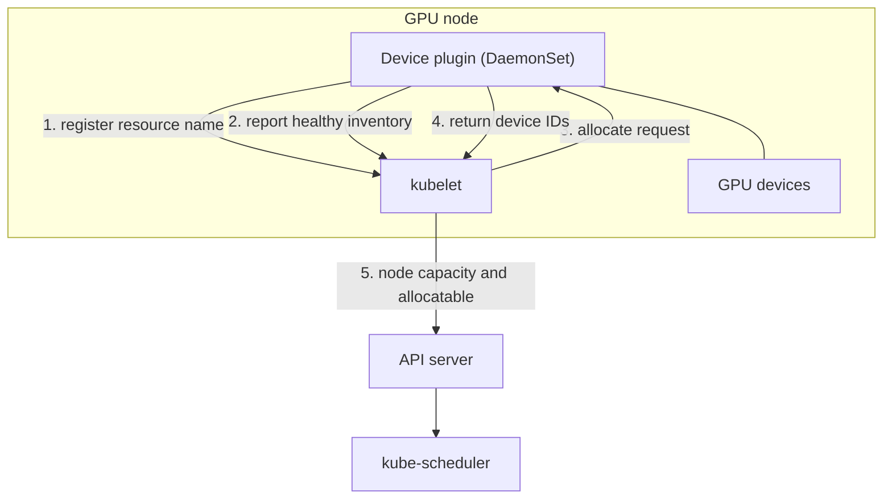
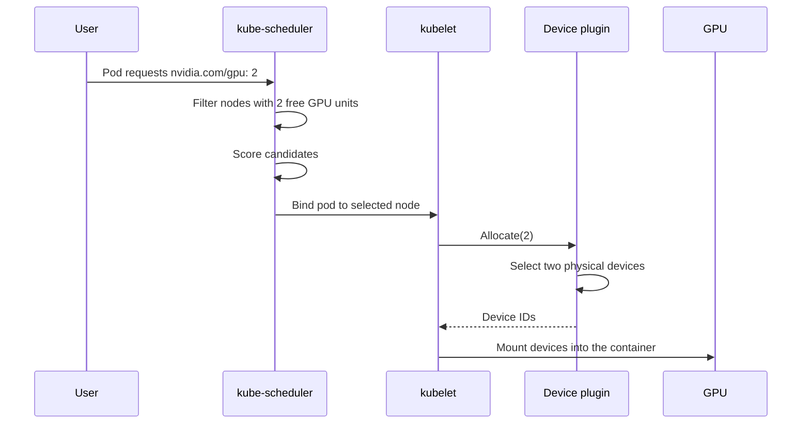
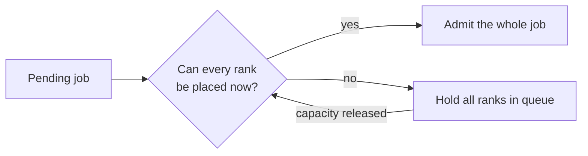
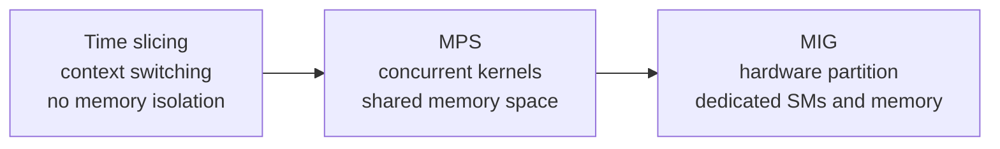
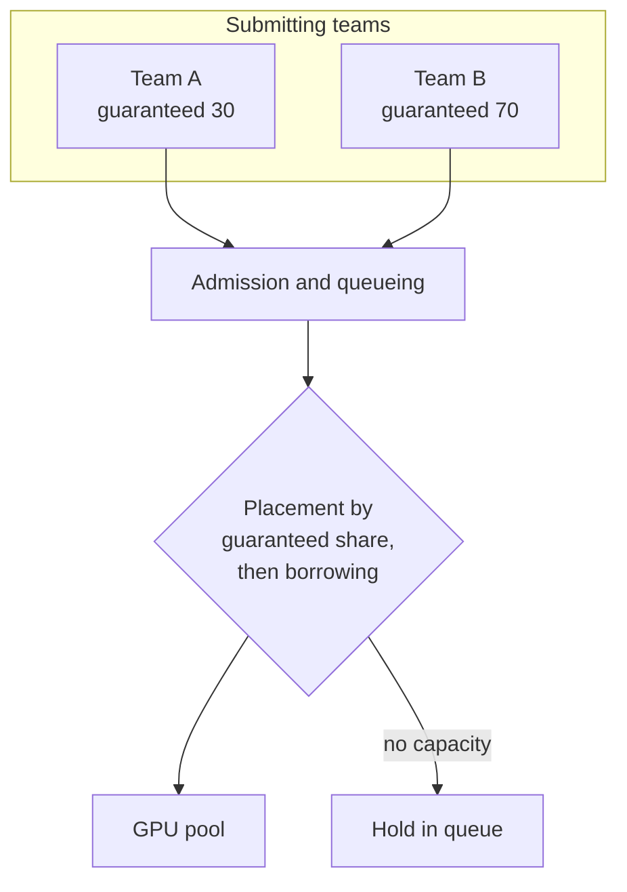

# 2. Cluster Scheduling and GPU Sharing

## 2.1 Resource model

GPU counts are integers. A pod requests 1, 2, or 4 GPUs.

Request equals limit, because extended resources carry no oversubscription.

The scheduler sees a count: eight units of `nvidia.com/gpu`. Device generation,
memory size, topology, and health reach it through node labels or a scheduler
extension, so placement constraints become node affinity, taints, or a custom
scheduler.

## 2.2 Device plugin

A DaemonSet on each GPU node. It discovers the devices, registers the resource
name with the kubelet, and answers allocation requests with device IDs for the
kubelet to mount into the container.

The scheduler picks the node. The device plugin picks the device on it.

## 2.3 Allocation sequence

Allocation commits at binding, so a node can be over-committed if capacity shifts
in between. The device plugin is the only component that sees individual devices,
so affinity, exclusivity, and health policy live there.

## 2.4 Placement constraints

| Constraint | Mechanism |
|---|---|
| Device type or generation | Node labels with node affinity, or a scheduler plugin |
| Topology locality across PCIe roots or NVLink islands | Topology-aware plugin, or labels describing the interconnect |
| Co-scheduling | Coscheduling, Volcano, or Kueue |
| Exclusive access | Whole-device request, or MIG partitioning |
| NUMA alignment | Topology manager policies |

### Gang scheduling

The default scheduler places pods one at a time. A 64-rank training job then
starts partially: some ranks hold devices while the rest wait, and those devices
produce no progress.

Wait for every rank before admitting any. The cost is idle capacity while a large
job waits for its last slot.

## 2.5 Sharing models

| Model | Isolation | Cost |
|---|---|---|
| Exclusive | Complete | One device per workload |
| Time slicing | Scheduling only | Context switch overhead, unbounded tail latency |
| MPS | Partial, with a shared memory space | Requires coordinated launch |
| MIG | Dedicated SMs and memory | Fixed partition shapes |

### MIG

MIG splits a device into instances with dedicated compute and memory. The device
plugin advertises each partition profile as its own extended resource, so the
scheduler places partitions.

Three consequences. Partition shapes are fixed at configuration time, so capacity
strands in shapes nobody wants. A workload needing the full device memory cannot
use a partition. Metering becomes exact, because a partition is a hardware
resource.

## 2.6 Fairness and preemption

A job holding a device for a week removes it from circulation, however fairly it
was selected. The queue has to bound how long a job holds capacity.

### Queues

Each team or priority class gets a guaranteed share plus idle capacity.

### Preemption

Preemption stops a workload, waits for the device release, and restarts from the
last checkpoint. Checkpoint frequency sets the price. Every ten minutes is cheap.
Daily is not.

### Starvation

Bound the borrow period. Aging raises a waiting job's effective priority as its
wait grows. A cap on borrow duration does the same thing more bluntly.

## 2.7 Summary

A device plugin advertises capacity. Node labels and affinity, or a scheduler
extension, carry placement constraints. Distributed jobs need all-or-nothing
admission. Pick the sharing model from the isolation you need, since time slicing
and MIG differ in kind. Express fairness as queues with guaranteed shares and
preemption as a drain and restart. Treat the checkpoint interval as a scheduling
input.
