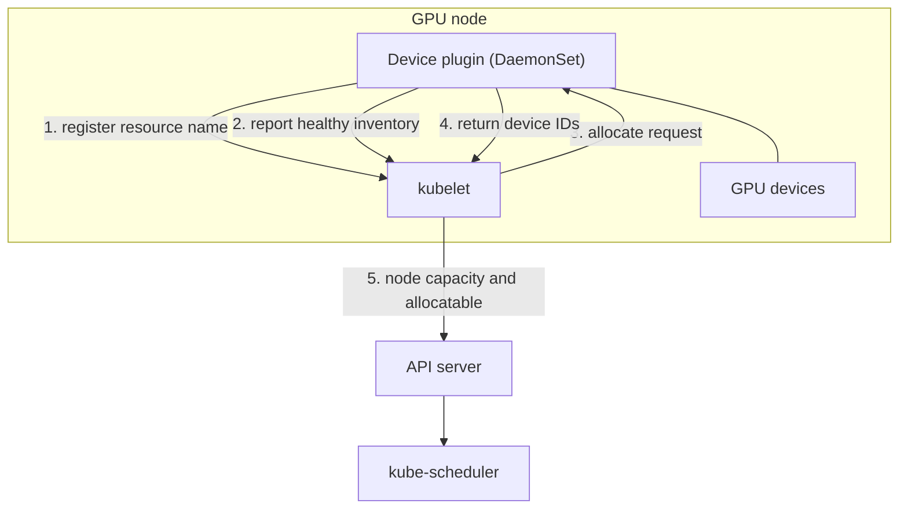
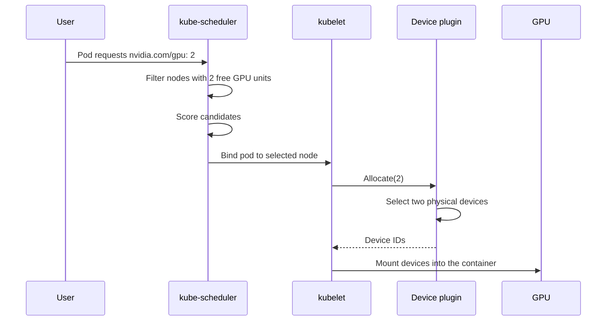
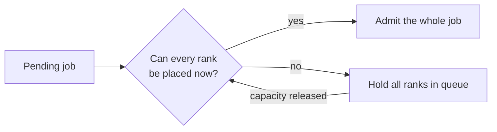
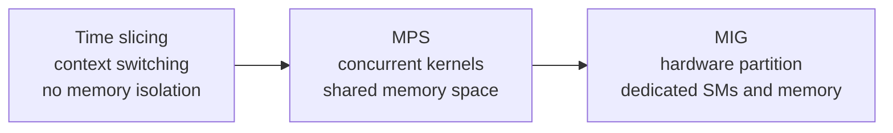
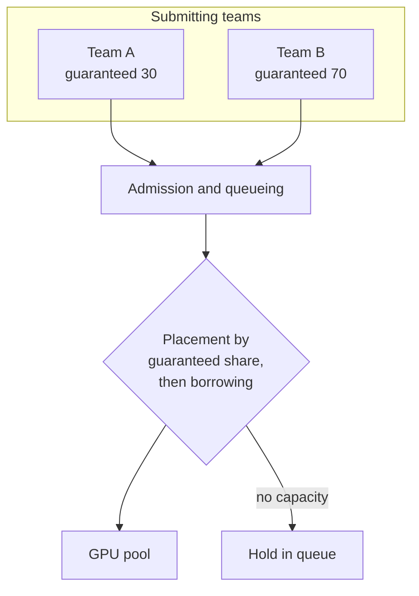

# 2. Cluster Scheduling and GPU Sharing

## 2.1 Resource model

Kubernetes represents GPU capacity as an extended resource, and three of its
properties shape everything in this section.

You ask for whole units. A pod requests 1, 2, or 4 GPUs, and a fractional request
has no representation in this mechanism.

You write the same number twice, because an extended resource carries no
oversubscription. The request sets the limit.

The scheduler sees a count. A node reports that it holds eight units of a named
resource, and reports nothing about the generation, memory size, topology, or
health of the individual devices. That detail has to reach the scheduler through
node labels or a scheduler extension, which is why placement constraints end up
expressed as node affinity, taints, or a custom scheduling component.

## 2.2 Device plugin architecture

A device plugin is a DaemonSet on each GPU node. It discovers the devices present
on the node, registers the resource name with the kubelet, and answers allocation
requests with the identifiers of specific devices for the kubelet to mount into
the container.

Follow the split in responsibility here, because it explains a lot of behavior
later. The scheduler picks the node. The device plugin picks the device on that
node. The scheduler holds no view of individual devices at all.

## 2.3 Allocation sequence

Two timing details explain most scheduling surprises. Allocation commits at
binding, so a node can be over-committed when capacity shifts between scheduling
and binding. And the device plugin is the only component that sees individual
devices, so affinity, exclusivity, and health policy all live there.

## 2.4 Placement constraints

The default scheduler models none of the following.

| Constraint | Reason it matters | Mechanism |
|---|---|---|
| Device type or generation | A workload may require a particular architecture or a minimum memory size | Node labels with node affinity, or a scheduler plugin |
| Topology locality | Collectives between devices on different PCIe roots or in different NVLink islands run at a lower rate | Topology-aware plugin, or node labels describing the interconnect |
| Co-scheduling | Distributed training needs all ranks running, and partial placement holds devices that produce no progress | Coscheduling, Volcano, or Kueue |
| Exclusive access | A latency-sensitive workload may need a device to itself | Whole-device request, or MIG partitioning |
| NUMA alignment | Host memory locality affects transfer performance | Topology manager policies |

### Gang scheduling

The default scheduler places pods one at a time. Picture a 64-rank training job
starting incrementally: half the ranks hold devices while the rest wait. Those
devices sit unavailable to other work, so the cluster loses throughput to a job
that is making no progress.

Wait until every rank can be placed before admitting any of them. You pay for
this by leaving capacity idle while a large job waits for its last slot, which is
usually cheaper than the alternative.

## 2.5 Sharing models

Three mechanisms put more than one workload on a single device, and they differ
mainly in isolation.

| Model | Isolation | Cost | Suitable for |
|---|---|---|---|
| Exclusive | Complete | One device per workload | Large training, latency-critical inference |
| Time slicing | Limited to scheduling | Context switch overhead, tail latency that cannot be bounded | Interactive development, low-utilization batch work |
| MPS | Partial, with a shared memory space | Requires coordinated launch | Several small models on one device |
| MIG | Strong, with dedicated SMs and memory | Fixed partition shapes, which may leave capacity unused | Multi-tenancy needing hardware separation |

### MIG

MIG splits a device into independent instances with dedicated compute and memory.
The device plugin advertises each partition profile as its own extended resource,
so the scheduler places partitions, and each partition is a schedulable unit in
its own right.

Three consequences follow from the hardware split. Partition shapes are fixed at
configuration time, so capacity can strand in shapes for which there is no
demand. A workload that needs the full memory of a device cannot use a partition.
And metering becomes precise, because a partition is a hardware resource.

## 2.6 Fairness and preemption

A job that holds a device for a week removes that device from circulation,
however fairly you selected it. Fair placement gives you nothing here, so the
queue has to bound how long a job may hold capacity.

### Queues with quota

Each team or priority class gets a queue with a guaranteed share, plus the
ability to use capacity that is currently idle.

### Preemption

Preemption lets higher-priority work reclaim borrowed capacity. A device cannot be
suspended cheaply, so preemption stops a workload, waits for it to release the
device, and restarts it from its last checkpoint.

Checkpoint frequency sets the price of that operation. A job that checkpoints
every ten minutes is cheap to preempt, and one that checkpoints daily is dear.

### Starvation

Bound the borrowing period, and the lower-priority class keeps making progress.
Aging raises the effective priority of a waiting job as its wait grows, and a cap
on borrow duration achieves the same result more bluntly.

## 2.7 Summary

A device plugin advertises GPU capacity. Node labels and affinity, or a scheduler
extension, carry the placement constraints. Distributed jobs need all-or-nothing
admission to avoid the partial-placement state. Pick the sharing model from the
isolation you require, because time slicing and MIG differ in kind. Express
fairness as queues with guaranteed shares, implement preemption as a drain and
restart, and treat the checkpoint interval as an input to the scheduling design.
