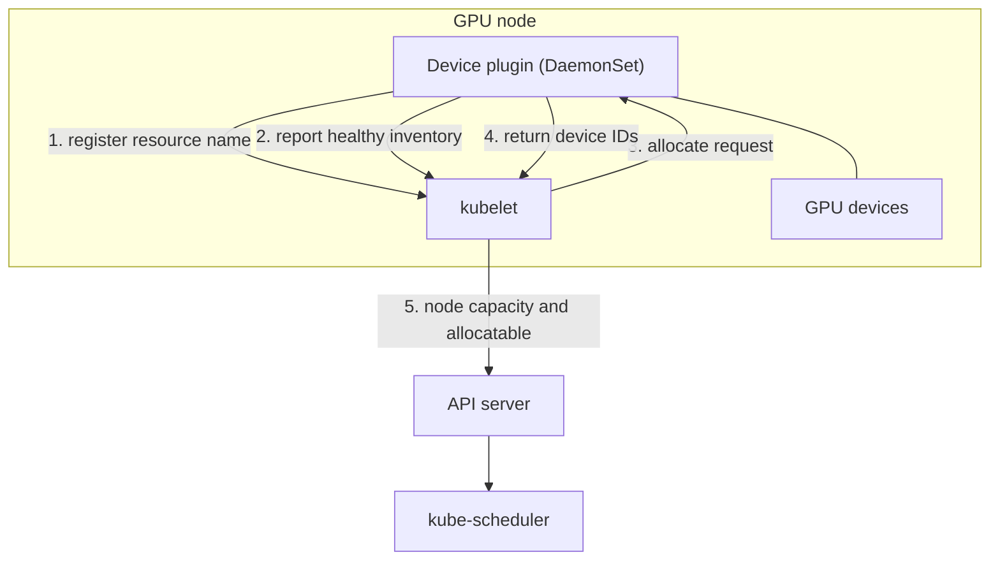
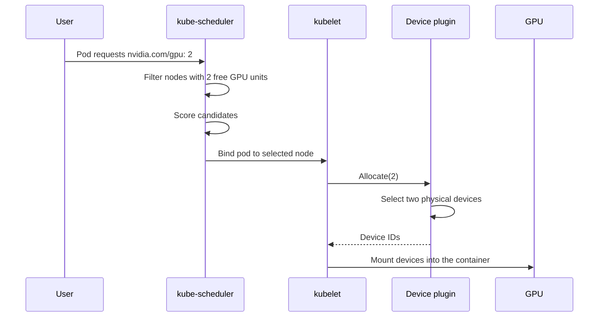
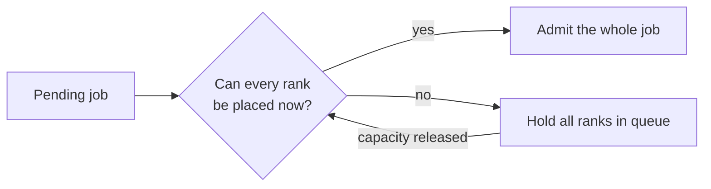
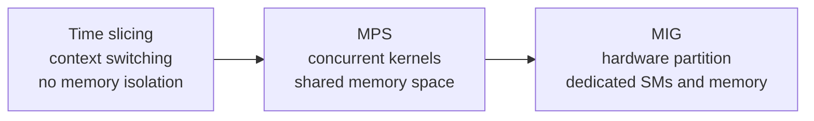
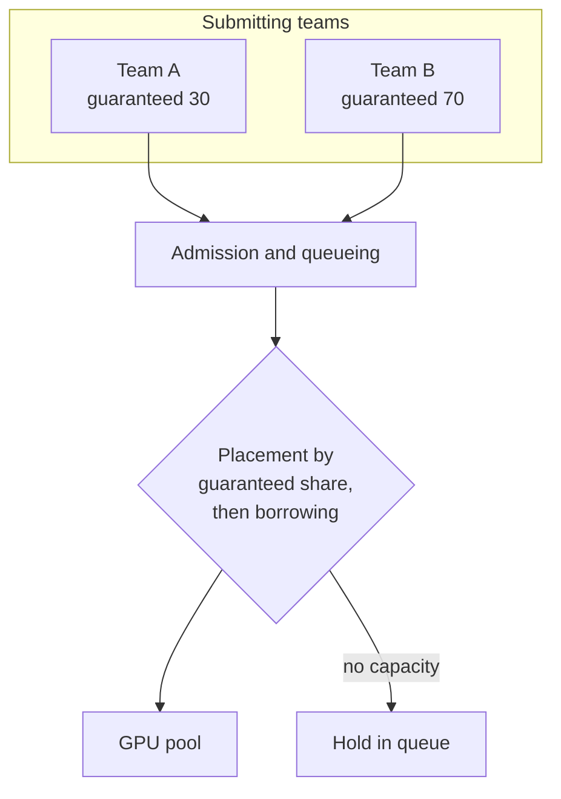

# 2. Cluster Scheduling and GPU Sharing

This section describes how GPU capacity is represented to the Kubernetes
scheduler, how a device is assigned to a container, the constraints that
placement has to satisfy, and the mechanisms by which a shared pool is divided
between tenants.

## 2.1 Resource model

GPU capacity is advertised as an extended resource. Three properties follow from
this and shape the scheduling design.

The first is that quantities are whole numbers. A pod requests one, two, or four
GPUs, and a fractional quantity cannot be expressed through this mechanism.

The second is that the request has to equal the limit. Extended resources are not
oversubscribed, and they are not subject to the usual distinction between a
request and a limit.

The third is that the scheduler treats the resource as an opaque count. It knows
that a node has a number of units of a named resource. It does not know the
generation, memory capacity, interconnect topology, or current health of the
individual devices, unless that information is supplied separately through node
labels or a scheduler extension. Placement constraints are therefore expressed
through node affinity, taints, or a custom scheduling component.

## 2.2 Device plugin architecture

A device plugin is a DaemonSet that runs on each GPU node and performs three
functions. It discovers the devices present on the node, registers the resource
name with the kubelet, and answers allocation requests by returning the
identifiers of specific devices, which the kubelet then mounts into the
container.

The division of responsibility is significant. The scheduler selects a node, and
the device plugin selects a device on that node. The scheduler has no visibility
into individual devices.

## 2.3 Allocation sequence

Two properties of this sequence are relevant to design. Allocation is committed
at the point of binding, so a node may be over-committed if capacity changes
between scheduling and binding. In addition, the device plugin is the only
component with a view of individual devices, so any policy that depends on
device-level state, such as affinity, exclusivity, or health, is implemented
there.

## 2.4 Placement constraints

GPU workloads commonly have requirements that the default scheduler does not
model.

| Constraint | Reason it matters | Mechanism |
|---|---|---|
| Device type or generation | A workload may require a particular architecture or a minimum memory capacity | Node labels with node affinity, or a scheduler plugin |
| Topology locality | Collective operations between devices on different PCIe roots or in different NVLink islands proceed at a lower rate | Topology-aware plugin, or node labels describing the interconnect layout |
| Co-scheduling | Distributed training requires all ranks to be running, and partial placement holds devices that produce no progress | Coscheduling, Volcano, or Kueue |
| Exclusive access | A latency-sensitive workload may require a device to itself | Whole-device request, or MIG partitioning |
| NUMA alignment | Host memory locality affects transfer performance | Topology manager policies |

### Gang scheduling

The default scheduler places pods individually. A training job with 64 ranks can
therefore be admitted incrementally, producing a state in which half the ranks
hold devices while the remainder are pending. The allocated devices are
unavailable to other work during this period, so cluster throughput is reduced
for a job that is not making progress.

Admitting each rank as capacity becomes available is the behavior that produces
the partial-placement state. Requiring all ranks to be placeable before any are
admitted avoids it, at the cost of leaving capacity idle while a large job waits
for its final slot.

## 2.5 Sharing models

Three mechanisms allow more than one workload to use a single device. They differ
primarily in the isolation they provide.

| Model | Isolation | Cost | Suitable for |
|---|---|---|---|
| Exclusive | Complete | One device per workload | Large training, latency-critical inference |
| Time slicing | Limited to scheduling | Context switch overhead, tail latency that cannot be bounded | Interactive development, low-utilization batch work |
| MPS | Partial, with a shared memory space | Requires coordinated launch | Several small models on one device |
| MIG | Strong, with dedicated SMs and memory | Fixed partition shapes, which may leave capacity unused | Multi-tenancy requiring hardware separation |

### MIG

MIG partitions a device into independent instances with dedicated compute and
memory. The device plugin advertises each partition profile as a distinct
extended resource, so the scheduler places partitions rather than complete
devices.

The consequences to allow for are as follows. Partition shapes are fixed at
configuration time, so capacity may be stranded in shapes for which there is no
demand. A workload that requires the full memory of a device cannot use a
partition. Metering and isolation become considerably more precise, because a
partition is a hardware resource rather than a scheduling convention.

## 2.6 Fairness and preemption

Where a pool is shared, the principal risk is that long-running work occupies
devices and delays short interactive work. This is a property of queueing
behavior rather than of the placement algorithm, since a job that holds a device
for a week removes that device from circulation regardless of how fairly it was
selected.

### Queues with quota

The usual structure is a queue for each team or priority class, with a guaranteed
share and the ability to use capacity that is currently idle.

### Preemption

Preemption allows higher-priority work to reclaim capacity that was borrowed.
Since a device cannot be suspended cheaply, preemption consists of signaling the
workload to stop, waiting for it to release the device, and restarting it later
from its most recent checkpoint.

The frequency of checkpointing therefore determines how expensive preemption is
for a given workload. A job that checkpoints every ten minutes can be preempted
at low cost, while a job that checkpoints daily cannot.

### Starvation

Borrowing has to be bounded so that the lower-priority class is not delayed
indefinitely. The mechanisms commonly used are aging, in which the effective
priority of a waiting job increases with the time it has waited, and a maximum
period for which capacity may be borrowed.

## 2.7 Summary

GPU capacity is advertised through a device plugin, and placement constraints are
expressed through node labels and affinity or through a scheduler extension.
Distributed jobs require all-or-nothing admission to avoid the partial-placement
state. The sharing model is selected from the isolation requirement, and time
slicing and MIG are not interchangeable. Fairness is expressed as queues with
guaranteed shares, preemption is implemented as a drain and restart, and the
checkpoint interval is an input to the scheduling design.
