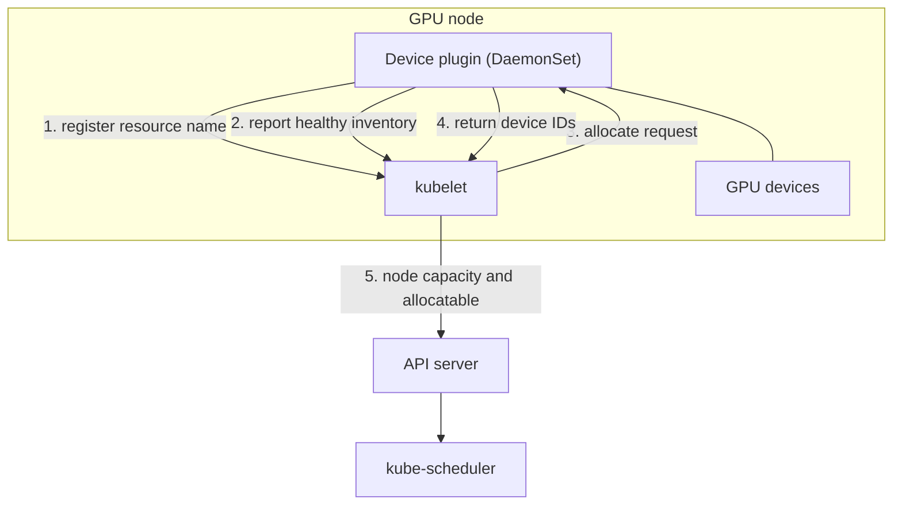
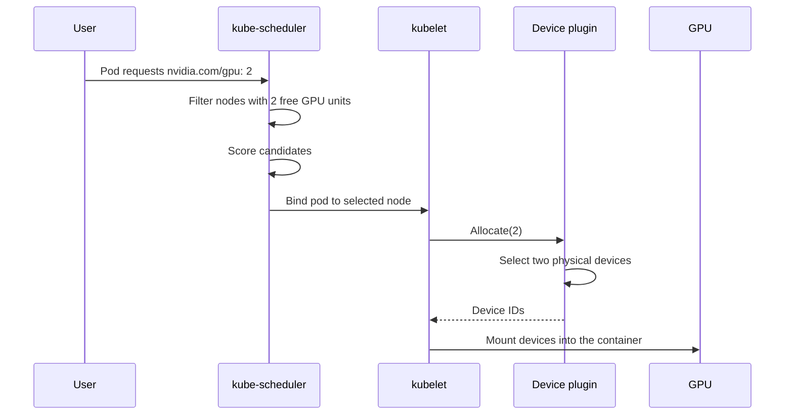
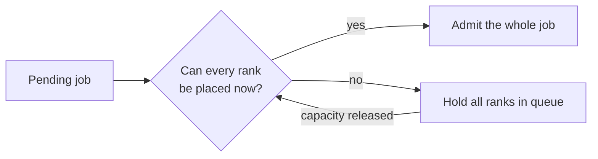
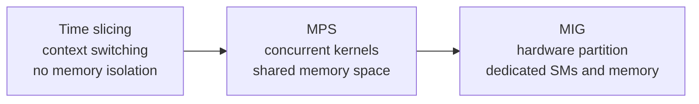
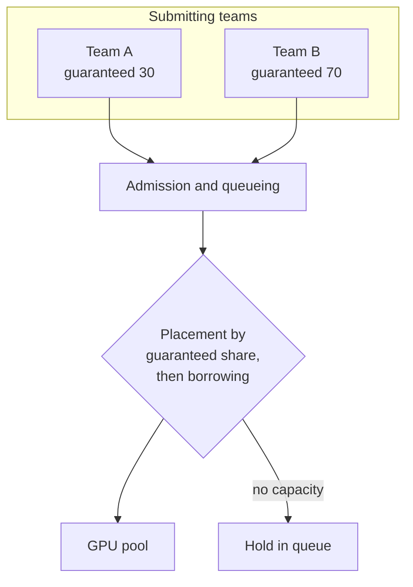

# 2. Cluster Scheduling and GPU Sharing

This section describes how GPUs are represented to a Kubernetes scheduler, how a
device is assigned to a container, what constraints placement has to satisfy, and
how a shared pool is divided between tenants.

## 2.1 The resource model

GPU capacity is advertised as a Kubernetes **extended resource**. This has three
consequences that shape every scheduling design:

1. **Quantities are integers.** A pod requests 1, 2, or 4 GPUs, not 0.5.
2. **Request must equal limit.** Extended resources are not oversubscribed, and
   they are not subject to the normal request/limit distinction.
3. **The scheduler treats them as opaque counts.** It knows a node has 8 of a
   named resource. It does not know the device generation, memory capacity,
   interconnect topology, or health of individual devices unless that
   information is surfaced separately.

Because of the third point, device properties are communicated through node
labels, and placement constraints are expressed through node affinity, taints,
or a custom scheduler plugin.

## 2.2 Device plugin architecture

A device plugin is a DaemonSet that runs on every GPU node and performs three
duties:

1. **Discovery.** Enumerate the devices present on the node.
2. **Registration.** Register the resource name with the kubelet.
3. **Allocation.** Answer requests for specific devices and return the device
   identifiers, which the kubelet then mounts into the container.

The split matters: the **scheduler** chooses a node, and the **device plugin**
chooses which device on that node. The scheduler does not see individual devices.

## 2.3 Allocation sequence

Two properties of this sequence are worth noting. First, allocation is committed
at bind time, so a node can be over-committed between scheduling and binding if
capacity changes concurrently. Second, the device plugin is the only component
with a view of individual devices, so any device-level policy (affinity,
exclusivity, health) lives there.

## 2.4 Placement constraints

Real GPU workloads have requirements that the default scheduler does not model.

| Constraint | Why it matters | Mechanism |
|---|---|---|
| Device type or generation | A workload may require a specific architecture or a minimum memory capacity | Node labels plus node affinity, or a custom scheduler plugin |
| Topology locality | Collectives between GPUs on different PCIe roots or across NVLink islands are much slower | Topology-aware plugin, or node labels describing the interconnect layout |
| Co-scheduling (gang) | Distributed training requires all ranks running; partial placement wastes the allocated devices | Coscheduling, Volcano, or Kueue |
| Exclusive access | A latency-sensitive workload needs a device to itself | Whole-device request, or MIG partitioning |
| NUMA alignment | Host memory locality affects transfer performance | Topology manager policies |

### Gang scheduling

The default scheduler places pods individually. A 64-rank training job can
therefore be admitted incrementally, producing a state where half the ranks hold
GPUs and idle while the rest are pending. Those devices are unavailable to other
work, so the cluster loses throughput to a job that is not making progress.

The alternative, admitting each rank as capacity appears, is the behavior that
creates the partial-placement state. All-or-nothing admission is the fix, at the
cost of leaving resources idle while a large job waits for its last slot.

## 2.5 GPU sharing models

Three mechanisms allow more than one workload to use a single device. They differ
primarily in isolation strength.

| Model | Isolation | Cost | Suitable for |
|---|---|---|---|
| Exclusive | Complete | One device per workload | Large training, latency-critical inference |
| Time slicing | None, beyond scheduling | Context switch overhead, unbounded tail latency | Interactive development, low-utilization batch work |
| MPS | Partial; kernels share a memory space | Requires coordinated launch | Multiple small models on one device |
| MIG | Strong; dedicated SMs and memory | Fixed partition shapes, possibly idle capacity | Hard multi-tenancy |

### MIG specifics

MIG partitions a device into independent instances with dedicated compute and
memory. The device plugin advertises each partition profile as a distinct
extended resource, so the scheduler places partitions rather than whole devices.

The consequences to plan for:

- Partition shapes are fixed and chosen at configuration time, so capacity may
  be stranded in shapes nobody wants.
- A workload that needs full device memory cannot use a partition.
- Accounting and isolation become much cleaner, because a partition is a real
  resource rather than a scheduling convention.

## 2.6 Fairness, quota, and preemption

When a pool is shared, the dominant risk is that long-running work monopolizes
devices and starves short interactive work. This is a queueing property, not a
scheduling algorithm property: a job that holds a device for a week removes that
device from circulation regardless of how fairly it was chosen.

### Queues with quota

The standard structure is a queue per team or priority class, each with a
guaranteed share and the ability to borrow idle capacity.

### Preemption

Preemption lets higher-priority work reclaim borrowed capacity. Because GPUs
cannot be paused cheaply, preemption means:

1. Signal the workload to stop.
2. Wait for it to release the device, or terminate it.
3. Restart it later from its last checkpoint.

This is why checkpoint frequency is a scheduling parameter, not only a
reliability parameter. A job that checkpoints every ten minutes can be preempted
cheaply; a job that checkpoints daily cannot.

### Preventing starvation

Borrowing must be bounded so the low-priority class is not starved indefinitely.
The usual mechanisms are aging (a waiting job's effective priority increases over
time) and a hard maximum on how long capacity may be borrowed.

## 2.7 Design summary

- Advertise capacity through a device plugin; represent placement constraints
  through node labels and affinity, or a scheduler plugin.
- Require all-or-nothing admission for distributed jobs.
- Choose the sharing model from the isolation requirement, and state which one
  is in use. Time slicing and MIG are not equivalent.
- Express fairness as queues with guaranteed shares, and preemption as a drain.
- Treat checkpoint interval as a scheduling input.
